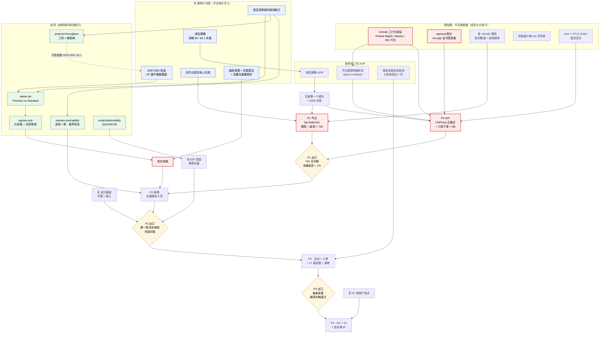

# babel.plus 路线图：P1 与「批准 + 定价」两条链解耦并行，在第一笔真实付款处汇合

> 日期：2026-08-16 · 性质：**排期计划** · 状态：**设计稿 v1**（2026-08-16，待用户确认）
> 事实基线：细化自 [product-brief.md](product-brief.md) §9 的 P0–P4 五段；阻塞项与风险逐条来自
> `05-adr/0001`–`0007`、`02-architecture/*`、`03-product/*`、`04-ops/*` 各自的
> 「这次没有解决的」尾节与「代价」尾节；实测清单来自 [evidence/README.md](../evidence/README.md)
> 关联：[docs/README.md §7](../README.md)（当前阻塞项）、
> [ADR 0001](../05-adr/0001-cloudflare-tos-risk.md)（P0 头号阻塞）、
> [ADR 0007 §9](../05-adr/0007-node-migration.md)（P1 的节点侧七阶段已单独排过）
> 读者：决定「下一件事做什么」的人。**本文不给日历日期**，理由见 §2。

---

## 1 · 结论：排期的三条组织原则

**这份路线图不是一条链，是两条几乎不相交的链。**

| 链 | 关键路径 | 卡在什么上 | 能否现在开工 |
|---|---|---|---|
| **技术链**（P1 内核可用） | v2node 三项行为验证 → `bp-node-hk1` 建成并过三网验收 → `bp-api` 的 UniProxy 五端点 + 订阅下发 → 单人 72 h 验证 | 只卡在**一次容器实验**与**一个域名** | ✅ **可以，今天就能开始** |
| **商业链**（P2 产品闭环） | ADR 0001 批准 → 网络层级 A/B + 出口单价核实 → 定价定稿 → 支付通道尽调与接入 | 卡在**一次用户决策**与**一组实测** | ❌ 两端都不在我们手上 |

两条链在 **P2 的「第一笔真实 USDT 收款完成对账」** 处第一次汇合。在那之前它们互不阻塞。

### 三条组织原则

1. **把 P1 与定价解耦。**
   P1 造的是数据面（节点、订阅、配额、鉴权），它的形态**不因 ADR 0001 的结果而改变** ——
   无论 CF 承不承载数据面，GCP 节点上的 REALITY / Hysteria2 / SS-2022 都要建。
   ADR 0007 已经预置了这条解耦所需的唯一约束：
   **`bp-node-hk1` 第一阶段一律不装 cloudflared**，也绝不复制旧节点的 tunnel token。
   > ⚠️ 但这条解耦有一个失效条件，写在 §12 代价第 1 条：
   > **若用户表态倾向方案 A/B（接受 ToS 风险换流量免费），应当立刻暂停 P1 的节点建设。**

2. **每个阶段的出口标准必须是一次可判定的观察，不是一份文档。**
   「写完了 X 设计」不是出口标准，「Y 在 Z 条件下被观察到」才是。
   本文每个阶段的出口标准都能用一条命令、一次人工加载或一个数字比较来判真伪。

3. **实测按「能推翻多少既有裁决」排序，不按「哪个容易做」排序。**
   当前是**零实测数据**状态，六项 P0 采集任务的价值差了一个数量级。排序见 §10。
   其中 [ADR 0004 §3.7](../05-adr/0004-transport-hardening.md)（Premium vs Standard）
   自陈「论据最弱」且直接决定出口单价翻不翻倍，因此排第一。

---

## 2 · 为什么不用日历时间

我们没有团队规模信息，任何「大概两周」都是编造。本文用**依赖顺序 + 出口标准**表达排期。

需要相对量级时，只用两种有依据的刻度：

**（a）观察窗口长度 —— 这是唯一有真实下限、不可压缩的时间。**

| 窗口 | 长度 | 出处 | 性质 |
|---|---|---|---|
| 域名/托管平台三网可达性采样 | **连续一周，必须覆盖晚高峰** | [ADR 0003 §7](../05-adr/0003-web-hosting-and-reachability.md) 第 1 条 | 硬要求，文献说明单次白天测试会误导 |
| 节点单人验证 | **连续 72 小时** | [ADR 0007 §9.1](../05-adr/0007-node-migration.md) 阶段 3 | 硬要求，明令「不并阶段」 |
| 小队灰度 | **7 天** | ADR 0007 阶段 4 | 硬要求 |
| 旧节点冻结观察 | **30 天零回滚事件** | ADR 0007 阶段 6 | 硬要求 |
| 任何节点变更后旧端点并行存活 | **≥ 7 天** | ADR 0007 §8 | 硬要求（用户侧订阅刷新是 24 h 或手动，回滚做不到即时） |
| TRON 解质押锁定 | **14 天** | [pricing §4.2](../03-product/pricing-and-plans.md) | 外部约束 |
| 破坏性变更时旧节点端点保留 | **≥ 90 天** | [api-contract §11](../02-architecture/api-contract.md) | 提案，无实测依据 |

**（b）工作项个数与外部等待标记。** 每个阶段的任务清单条数是可数的；凡需要外部方
（用户决策 / 供应商审核 / 域名注册 / 权限授予）的条目单独标 ⏳，因为它们的耗时不由我们决定。

> 建机本身有一个估计值：一次完整建机 **90–150 分钟**
> （[node-provisioning §9](../04-ops/node-provisioning.md)，**该数字是估计不是测量**），
> 不含晚高峰挂机采样 —— 后者要跨一个白天。

---

## 3 · P0 · 调研与设计

### 3.1 目标

**每一条会影响架构或定价的裁决，要么有一手数据支撑，要么被明确标记为「带着风险推进」并写明触发复审的条件 —— 不允许第三种状态（悬空但看起来已定）。**

### 3.2 任务清单

**0.A · 决策解锁（需用户决策，⏳ 外部等待）**

- [ ] ⏳ **ADR 0001 拍板**：Cloudflare 用不用做数据面。批准提案 C，或裁为 A/B 并按
      [docs/README §4](../README.md) 的规矩写新 ADR 逐条交代旧理由落点。**这是头号阻塞。**
- [ ] ⏳ **`vpn-us` / `vpn-jp` 上是否有人在用** —— ADR 0007 §11 第 1 条自陈
      「本文唯一一个必须由人回答、任何命令都替代不了的问题」。
- [ ] ⏳ **域名策略**：要几个主域名、注册在哪、DNS 用谁、带外推送怎么做。
      当前 `system-design §2`（用 `web.babel.plus` / `docs.babel.plus` 子域）与
      `system-design §4.1`（禁止子域）**直接矛盾**，需一份 ADR 裁决。
- [ ] ⏳ **退款政策** —— 法务页不能空着上线，年付 75 折把风险前置。
      [page-inventory §8](../03-product/page-inventory.md) 标为**上线前置条件不是待办事项**。
- [ ] ⏳ **升级折抵算法**（按剩余天数还是剩余流量）与**流量包在周期重置时保留还是清零**
      —— 两条都是产品规则，卡着 `POST /orders` 的 `surplus_amount` 契约与
      `users.transfer_enable` 是否要拆成 `_plan` + `_pack` 两列。
- [ ] ⏳ **iOS 首推客户端**：Karing（user-journey，旅程步数最短）vs Shadowrocket
      （tutorials-spec，需要注册外区 Apple ID 的完整子旅程）。
- [ ] ⏳ **是否采购境内探测能力**（租三网短期 VPS 或买商业监测服务）——
      §10 六项实测里有三项依赖它，而 [ADR 0004 §6](../05-adr/0004-transport-hardening.md)
      记录了境内 VPS 探测境外中转服务本身的法律敞口。

**0.B · 零成本、零依赖、能立即做的验证（应当排在所有事情之前）**

- [ ] 🔴 **起一个真实 v2node 容器，一次测完三件事**：
      (a) 是否发送 `If-None-Match`；(b) 能否配置 `Authorization` 头；
      (c) 收到 401/403 时**是否清空本地用户列表**。
      成本以分钟计，影响见 §9 与 §11-R8。**这是全项目性价比最高的一个动作。**
- [ ] 🔴 **`openssl s_client` 核对 `*.run.app` 与 Cloud Run 自定义域名映射的证书签发者。**
      成本 10 秒。若是 Google Trust Services，则 API 必须有两个入口
      （面向中国用户的域名经能钉 LE 的代理，节点继续直连 run.app）。
- [ ] **读 v2node 源码**：它到底承载哪些协议（是否内置 Hysteria2 core）、
      轮询频率与端点次数（`4 次/60 秒` 目前是假设）、是否可配。
      前者决定 HY2 装机自动化要不要从头写，后者决定 §11-R6 的 Cloud Run 请求量算术。
- [ ] **`gcloud sql instances describe` 核对四个配置细节**：存储下限、自动备份默认份数、
      PITR 事务日志保留天数、**删除实例时自动备份是否一并删除**（第四项优先级最高）。
- [ ] **查现有节点的网络层级**（`gcloud compute instances describe` + `addresses describe`
      两处，可能不一致）。查不清则 reference-repos §1.5 那组吞吐实测没有层级归属，
      ADR 0004 §3.7 无法复审。
- [ ] **实验 mux 与 XTLS-Vision 是否互斥** —— 若互斥，
      ADR 0004 §3.3 与 system-design §3.1 必须放弃一个。
- [ ] **抓各客户端真实 `User-Agent` 字符串**（Clash Verge Rev / sing-box / Karing /
      Hiddify / v2rayNG / Shadowrocket）。api-contract §4.3 的分发表现在是推断的，
      **错一行对应客户端就拿到 base64 而不是 YAML**。

**0.C · 实测采集（六项，排序与理由见 §10）**

- [ ] 🔴 `nettier-ab-*` — Premium vs Standard（含 IPv6 能否事后开启）
- [ ] 🔴 `egress-cost-*` — 官方价目表逐档核对（可立即做）+ 实际账单对账（需 P1 有真实流量）
- [ ] `protocol-throughput-*` — REALITY vs Hysteria2 × 电信/联通/移动 × 晚高峰
- [ ] `domain-reachability-*` — 候选托管与域名三网可达性，**连续一周**（最早启动）
- [ ] `email-deliverability-*` — QQ/163/126/Sina 送达率基线
- [ ] `region-ab-*` — **条目已过期**，应改写为 asia-east2 vs asia-northeast1，
      且它是 ADR 0007 阶段 5 的副产品，不需要独立做

**0.D · 补齐三份缺失的裁决**

- [ ] **域名策略 ADR** —— 消解 system-design §2 与 §4.1 的矛盾（承 0.A）
- [ ] **节点密钥传输形式 ADR** —— ADR 0006 §10.2 要求 `Authorization: Bearer`，
      而 UniProxy 冻结契约里节点把 token 放 query string。
      api-contract §3.2.4 已给出 A（打补丁维护 fork）/ B（过渡态接受 query）/ C（换 agent，已否）
      三条路径，**需要一次裁决而不是一份手册**。依赖 0.B 第一条的 (b)。
- [ ] **「域名被封的自动检测」ADR** —— 这个洞在
      ADR 0002 §7、ADR 0003 §7、system-design §9、user-journey §16、api-contract §14、
      data-model §16、runbook §7 **七处各被登记一次**，需要一次合并裁决。在它解决前，
      product-brief §8 承诺的「域名失联恢复 ≤ 30 分钟」**零机制支撑**。

### 3.3 出口标准

| # | 判据 | 怎么验 |
|---|---|---|
| 1 | ADR 0001 状态不再是「提案，未批准」 | `05-adr/README.md` 表格里该行状态变更 |
| 2 | `evidence/` 下有 ≥ 5 个证据目录，每个带 README 且写明「证明什么、不证明什么」 | `ls docs/evidence/` |
| 3 | `pricing-and-plans.md` 里不再有留空的价格；`§7` 第一条（出口单价 P0）被划掉 | grep 该文件是否还有占位 |
| 4 | [docs/README §7](../README.md) 阻塞项表的第 1、2 条被划掉 | 直接读该表 |
| 5 | v2node 三项行为各有一条 evidence 记录（含「不支持」这种否定结论） | `evidence/v2node-behavior-*/README.md` |
| 6 | 三份缺失 ADR 各自存在，且不是「提案，未批准」 | `ls docs/05-adr/` |
| 7 | 至少一个域名**已注册**且 DNS 可控 | `dig` 得到我们自己配的记录 |

> **出口标准 7 是 P1 的真实硬前置**：node-provisioning 的 Hysteria2 需要 Let's Encrypt 证书
> （DNS-01 签发，刻意不建 A 记录，域名只存在于证书里），deploy.md 里所有 `*.babel.plus` 都是占位符。

### 3.4 依赖

- 0.A 全部依赖用户，我们无法推进，只能催。
- 0.B 全部**零依赖**，是本阶段唯一可以立刻 100% 完成的一组。
- 0.C 的三项（nettier / domain-reachability / protocol-throughput）依赖 0.A 最后一条（境内探测能力）。
- 0.D 的第二条依赖 0.B 第一条的 (b)；第三条不依赖任何实测，纯设计，**但没人写**。

---

## 4 · P1 · 内核可用

### 4.1 目标

**第一个真实用户（运维自己）用 bp 自己签发的订阅链接、在 bp 自己的节点上连续上网 72 小时，且面板上的流量数字与节点上报对得上。**

### 4.2 任务清单

**1.A · 节点侧（照 [ADR 0007 §9](../05-adr/0007-node-migration.md) 与
[node-provisioning](../04-ops/node-provisioning.md) 执行）**

- [ ] 阶段 0 · 核查：清零 ADR 0007 §3 的九个待核实项（与 P0 的 0.B 重叠）
- [ ] 阶段 1 · **防火墙先行**：建 4 条 `bp-*` 规则，**必须在实例创建之前就位**
      （`default-allow-ssh` 0.0.0.0/0 对所有实例生效，压制它的 `vpn-public-ssh-deny`
      只覆盖 `vpn-node` 标签）
- [ ] 建 `bp-node-sa`，**故意不授予任何 IAM 角色**（不能用 Compute 默认 SA，它常带 Editor）
- [ ] IP 网段预筛（预留 5 个看落段，优先 35.220.x、避开 34.92.x，留 1 删 4）
- [ ] 阶段 2 · 建 `bp-node-hk1`（asia-east2-a 或 -c、e2-small、Premium、IPv6）
- [ ] 装机 9 步（sysctl / v2node / xray / hysteria2 / ss-2022 / acme.sh + LE / systemd 硬化
      含 `AmbientCapabilities=CAP_NET_BIND_SERVICE` / unattended-upgrades 关自动重启 / swap）
- [ ] 阶段 3 · 单人验证 **72 小时**

**1.B · API 与数据侧**

- [ ] 建 Cloud SQL `db-f1-micro`（`--edition=ENTERPRISE` 必须显式写，否则命令直接失败）
- [ ] 选迁移工具（`golang-migrate` / `atlas` / `goose` / `dbmate`）并落 43 张表的 DDL
- [ ] `bp-api` 骨架：chi + pgx/v5 + pgxpool（MaxConns=2）+ sqlc，`--max-instances=8`
- [ ] 冻结 `openapi/uniproxy-v1.yaml`，实现 UniProxy 五端点
      （`/config` `/user` `/push` `/alive` `/status`），**裸 JSON 不套信封**
- [ ] `node_id` 从密钥推导，请求里带的 `node_id` **一律忽略**，不一致返 403 并告警
- [ ] ETag：`servers.config_rev` / `servers.user_rev` 两列 + 四条 bump 规则
      （改可见用户集合要 bump / 流量累加不 bump / **跨越 `transfer_enable` 阈值那一次要 bump** /
      **到期由定时任务 bump**）
- [ ] 订阅下发：token 十步校验、UA 分发、`subscription-userinfo` 头、伪节点、**同步写审计表**
- [ ] 账户体系最小集：邀请码、邮箱登录、订阅 token 表、设备数
- [ ] 六条 Cloud Scheduler + 一条 Cloud Tasks 入账队列（OIDC aud 用 `*.run.app` 不用镜像域名）
- [ ] 十条 log-based metrics **必须在 `bp-api` 第一次部署之前建好**（它们不追溯）

### 4.3 出口标准

| # | 判据（可判定） | 阈值性质 |
|---|---|---|
| 1 | `bp-node-hk1` 通过 [node-provisioning §5.3](../04-ops/node-provisioning.md) 的 J1–J6，采样含 ≥ 1 次晚高峰 | 判据全为**设定值** |
| 2 | v2node 从 `bp-api` 拉到配置与用户表，且 `/user` 在 180 秒观察窗内出现 `1×200 + 2×304` | 有据（ADR 0006 §11.4 的验证方法） |
| 3 | 若第 2 条不成立（v2node 不发 `If-None-Match`），**已切到降级方案并把降载损失写进 evidence** | 允许「验证为否」通过 |
| 4 | 一条真实订阅链接在 **Clash Verge Rev 与 sing-box 各人工加载一次成功** | 不可自动化（ADR 0006 §12 已定） |
| 5 | 连续 72 小时无中断；节点内存峰值 < 70%；面板 `stat_user` 的 `u+d` 与节点侧上报差异 **< 1%** | 前两条有据（ADR 0007 阶段 3），**1% 是设定值** |
| 6 | 封禁 / 配额耗尽 / 到期 三个状态各手工触发一次，节点侧生效时间分别 ≤ 60 s / ≤ 60 s / **≈ 6 分钟** | 有据（5 分钟扫描 + 60 秒轮询） |
| 7 | 一次节点密钥轮换按 D5 **两步**做完，节点全程不失联；API 层对「一步吊销」返 409 | 有据（api-contract §6） |
| 8 | 每阶段前后各跑一次 [as-built §7](../02-architecture/as-built-gcp.md) 清点命令做 diff，`vpn-*` 与三个 Cloud Run 服务零变化 | **这是「不影响已部署服务」唯一可验证的形式** |

### 4.4 依赖 / 阻塞

- **硬前置**：P0 出口标准 7（至少一个域名）、P0 的 0.B 第一条（v2node 三行为）。
- **不依赖**：ADR 0001、定价、支付通道、ESP 选型、前端框架。
- **软风险**：节点密钥传输形式（query vs Bearer）未裁决时，可按 api-contract §3.2.4 的
  **过渡态 B** 推进（每节点独立密钥 + 每次 query 认证写 WARN 日志带 `key_id`），
  但必须记住那条硬约束：**在 ADR 0007 阶段 5 全量切换前必须关闭过渡态。**

---

## 5 · P2 · 产品闭环

### 5.1 目标

**第一批 20 个用户能自助走通「收到邀请码 → 注册 → 付款 → 拿到订阅 → 连上」，且至少有一笔真实链上收款完成对账。**

### 5.2 任务清单

**2.A · 前端与页面（P1 档共 28 个，其中 8 页是关键路径）**

- [ ] 选前端框架与组件库（用户面板 M1 移动优先 / 后台 M3 桌面优先，两者要求差异很大）
- [ ] 关键路径 8 页：落地页 → `/auth/register` → `/plan` → `/order/:trade_no` →
      `/subscribe` → `docs.*` → `/dashboard` → `/ticket`
- [ ] `/order/:trade_no` **必须独立成页不能做弹窗**（要承载链选择、汇率倒计时、
      `underpaid` 显式界面、可关页再回来的轮询、「我已付款帮我查一下」主动查单）
- [ ] 落地页四条硬约束：零 API 调用纯静态、域名探测后台并行不阻塞首屏、
      页脚常驻全部镜像域名、字体图标全部自托管
- [ ] 备用域名页部署在**每一个**镜像域名上，< 20 KB 且无 JS
- [ ] `docs.*` 教程站（独立主域名 + 免登录 + 纯静态），面板内不做 `#/knowledge`

**2.B · 支付与计费（⏳ 含外部等待）**

- [ ] ⏳ 支付网关定型（自托管 EPUSDT vs 托管 OxaPay）与尽调
- [ ] ⏳ AML 链上风险筛查方案（MistTrack / TRM Labs / Chainalysis / Elliptic，均待评估）
- [ ] 小地址池 + 金额唯一性匹配（冲突 +0.0001 递增，最多 100 次）
- [ ] 幂等键 `(provider, external_id)` 建**唯一索引**，不是应用层 `SELECT ... IF NOT EXISTS`
- [ ] 回调不可信 → 收到回调后反向查单；`POST /orders/{trade_no}/recheck` 是同一逻辑的用户侧入口
- [ ] **过期订单的收款地址继续监听 ≥ 24 小时**，到账入账为余额不直接开通
- [ ] D6「手工标记订单已支付」的独立权限位 —— **从第一天就存在，即使团队只有一个角色**

**2.C · 邮件（⏳）**

- [ ] ⏳ 选两家 ESP 互为备份（密钥、模板、退信回调都要做两套）
- [ ] 每次发验证码写 `email_log`（收件域名 / ESP / bounce 码 / 回填时刻）—— 这是
      ADR 0002 §7 要求的送达率数据源，**不是附带功能**
- [ ] 注册成功页与找回密码成功页引导用户把发信域名加进 QQ 邮箱白名单

**2.D · 灰度**

- [ ] ADR 0007 阶段 4：3–5 人灰度 **7 天**，用户必须被明确告知「你手里有两套配置，旧的是安全绳」
- [ ] ADR 0007 阶段 5：全量 + 建 `bp-node-jp1` 做同条件 A/B（`region-ab-*` 由此产出）

### 5.3 出口标准

| # | 判据 | 阈值性质 |
|---|---|---|
| 1 | 关键路径 8 页全部可用；一个**没用过代理的人**在无人协助下走通一遍 | tutorials-spec §7 明令这是唯一能证伪 user-journey 的动作 |
| 2 | ≥ 1 笔真实链上收款完成「下单 → 到账 → 自动开通 → 对账」闭环 | 硬判据 |
| 3 | ≥ 1 笔**故意 underpaid** 的测试单走通兜底（显示「已收到 X，还差 Y」）；≥ 1 笔过期后到账的单入账为余额 | 硬判据 |
| 4 | 邮件送达率**按收件域名分组**有基线数据（QQ/163/126/Sina 各 ≥ N 条），退信率 < 5% | N 未定；5% 是 SES 审查线，**有据** |
| 5 | `bp-docs` 有连续一周含晚高峰的三网可达性数据 | 有据（ADR 0003 §7） |
| 6 | user-journey 的漏斗指标从「设定值」改写为「基线值」（首连成功率 / 订阅首次拉取率 / 首连中位耗时） | 现有目标 ≥90% / ≥95% / ≤30min **全部是拍的** |
| 7 | ADR 0007 阶段 4 的 7 天里配置类工单 0 起、无 OOM、无 IP 封锁事件 | 有据 |
| 8 | 定价页上的每个数字都能追溯到一条 evidence | 硬判据 |

### 5.4 依赖 / 阻塞

- **硬前置**：P1 全部出口标准 + P0 的定价链（ADR 0001 → nettier A/B → egress-cost → 定价定稿）。
- **⏳ 不由我们决定**：支付网关审核、ESP 域名预热与信誉建立、退款政策拍板。
- **已知会返工的**：`admin-api.yaml` 不应在此时冻结（后台前端框架未定，
  Refine 之类框架对列表分页与筛选参数有约定，会**反过来改 admin API 的形状**）。

---

## 6 · P3 · 可运营

### 6.1 目标

**一个不在场的人能照 runbook 处置一次节点故障；每一条告警都至少被真实触发并送达过一次。**

> **一条从未被真正触发过的告警链路，应当默认视为不工作。**（monitoring §14）

### 6.2 任务清单

- [ ] 后台 17 个模块（P1 档 11 个），16 条危险操作 D1–D16 全部落审计日志（含改前/改后值）
- [ ] 危险操作四层强制：L1 确认串（**必须在 API 层，前端弹窗对 curl 是零**）、
      L2 必填 reason ≥ 8 字符、L3 TOTP step-up、L4 独立权限位
- [ ] 审计写入与业务写入**同一事务**，审计写失败则整个操作回滚
- [ ] 工单系统 + 排障决策树叶子节点上的工单入口 + 建单时服务端重新采集 context 快照
- [ ] monitoring 的 17 条告警策略全部创建，每条同时挂 Pub/Sub 与 email 两个通道
- [ ] `metric-absence` 告警必须 `groupByFields=node_id`；新节点首次上报后**人工确认
      time series 已出现，告警才算 armed**（在监控眼里从未上报过的节点不存在）
- [ ] ⏳ 带外 Uptime Kuma（第三方 VPS，约 $5/月）
- [ ] ⏳ 计费账号权限 → Cloud Billing budget 告警；所有 `bp-` 资源打 label `app=babel-plus`
- [ ] 证书签发者每日核对（必须是 Let's Encrypt，不是 GTS）
- [ ] 域名池管理与镜像切换（依赖 P0 的第三份 ADR）
- [ ] ADR 0007 阶段 6：旧节点冻结观察 **30 天零回滚事件**

### 6.3 出口标准

| # | 判据 |
|---|---|
| 1 | 17 条告警策略全部创建，且**至少做过一次端到端演练**（人为触发 → 送达 → 有人响应），演练记录进 evidence |
| 2 | 一次数据库恢复演练完成（PITR 一定新建实例 → 必须改连接串 → 重部署），**记录实际耗时** |
| 3 | 用 `curl` 直接打 API 尝试绕过前端确认框，16 条危险操作各失败一次 |
| 4 | 一次域名失联演练：手工把主域名从 `mirrors.json` 摘掉，验证用户侧四条路径（面板域名 / API 域名 / 教程站 / 节点 IP）各自的表现符合 user-journey §13 描述 |
| 5 | 一次密钥泄漏演练：吊销一条订阅 token 与一把节点密钥，验证 `sub_revoked_at` 一键全撤生效 |
| 6 | ADR 0007 阶段 6 的 30 天观察期结束，零回滚事件 |
| 7 | 配置类工单占比 ≤ 20%（product-brief §8）—— **需要 P2 积累足够工单量才有意义** |

### 6.4 依赖 / 阻塞

- **硬前置**：P2 有真实用户（否则告警没有信号，工单占比没有分母）。
- **未解决且卡在这里**：SLO 与 error budget 未定义（「什么算可用、按哪个指标算、谁来算」）；
  on-call 轮值与升级路径未定义（monitoring 只定义了告警发到哪，没定义**发给谁、多久没人应答怎么办**）。
- 🔴 **境内探针不存在** —— uptime check 与 Uptime Kuma 都在境外，只能回答「世界能不能访问」。
  QUIC/Hysteria2 探不了，而 runbook §2 的分诊高度依赖「HY2 失败但 REALITY 正常」这个对照。

---

## 7 · P4 · 加固

### 7.1 目标

**一次完整的节点重建可以从 IaC 重放，不依赖任何人的记忆。**

### 7.2 任务清单

- [ ] IaC（Terraform / Pulumi）—— **前置是 CF 侧资产清点完成**，
      导入一份不完整的 state 比没有 state 更危险（`terraform destroy` 会按 state 走）
- [ ] CI / 契约测试：testcontainers-go 起真实 Postgres；**UniProxy 契约测试起真实 v2node 容器**
      （唯一能证明「抄对了」的测试）；`git diff --exit-code` 卡 OpenAPI 漂移
- [ ] 节点自动换 IP 脚本化（开机 → 三网探测 → 不合格自动释放重开）
- [ ] 备用域名带外推送
- [ ] 审计日志外送（Cloud Logging append-only sink 或 GCS 对象锁）——
      DB 层的 `REVOKE` 只防应用层，不防有 DDL 权限的人
- [ ] 自研客户端评估（唯一不可替代价值是**内置域名池自动切换**）
- [ ] 旧节点退役 ADR（ADR 0007 裁决第 7 条要求另写）

### 7.3 出口标准

| # | 判据 |
|---|---|
| 1 | `terraform plan` 对现有全部 `bp-` 资源输出**空 diff** |
| 2 | 从零重建一个节点，全程无手敲 `gcloud`，且通过 J1–J6 |
| 3 | 一次自动换 IP 全流程无人工干预，且旧 IP 端点按纪律并行存活 ≥ 7 天 |
| 4 | CI 里的 schema 与生产一致，由一次自动化检查证明（而不是靠人记得） |
| 5 | 契约测试里跑着一个真实 v2node 容器，改动 `uniproxy-v1.yaml` 会让它红 |

### 7.4 依赖

- 卡在 **CF 侧资产清点**（需要 CF API token 或后台访问权限，as-built §9 第 2 条）。
- deploy §15 论证 CF 清点完成后 IaC 应「立即补」，
  **这与 product-brief §9 把 IaC 放在 P4 有张力**（见 §13）。

---

## 8 · 依赖关系图与关键路径

### 8.1 关键路径读法

| 链 | 路径 | 说明 |
|---|---|---|
| **技术关键路径** | `Z1 → A1 → P1A` 与 `A2 → DOM → P1N` 汇合到 `G1` | 全程不经过 ADR 0001，也不经过任何实测 |
| **商业关键路径** | `U1 → M1 → M2 → PRICE → WEB → G2` | 起点与终点都不在我们手上 |
| **唯一的交叉** | `M3 -.-> U1`（虚线） | 若 protocol-throughput 显示 CDN 路径不劣于直连，ADR 0001 §4.1 第 1 条失效，**批准要重来一次** |

### 8.2 可以完全并行的三组

1. **`Z1`–`Z5` 与 `U1`–`U5` 并行** —— 前者不依赖后者，且前者能立即完成。
2. **`P1N`（节点）与 `P1A`（API）并行** —— 两者只在 `G1` 汇合。
   但注意 `P1N` 有 90–150 分钟的连续操作段与 72 小时挂机段，中间不能并阶段。
3. **`M4`（域名可达性，一周窗口）与所有事情并行** ——
   **它的启动优先级是第一，判读优先级是第四**，是本文唯一一条启动顺序 ≠ 优先级顺序的项。

### 8.3 排在最前面的五件事（不分先后，都是零依赖）

1. 起 v2node 容器测三项行为
2. `openssl s_client` 核对 `run.app` 证书签发者
3. 注册第一个域名（依赖域名策略拍板，但**先注册一个可用的**不必等策略完整）
4. 启动 `domain-reachability` 的一周采样（依赖境内探测能力，故与第 4 项捆绑）
5. 催 ADR 0001

---

## 9 · 阻塞项汇总

遍历全部 ADR 与设计文档的「这次没有解决的」尾节。**按「卡住了什么」分四层排序**，
层内按登记处数量降序（登记处越多说明它挡的路越多）。

### 9.1 T1 · 卡住全局（不解决则后面所有事情都是悬空的）

| # | 阻塞项 | 卡住了什么 | 归属 | 登记处 | 解锁于 |
|---|---|---|---|---|---|
| B1 | **ADR 0001 未获批准** | 拓扑与成本模型，进而定价、ADR 0004 的层级复审、CF 应急通道的存在与否 | **需用户决策** | README §7、ADR 0001 §7 | P0 |
| B2 | **GCP 出口到中国大陆的准确单价未核实**（$0.11 vs $0.23/GiB，差一倍） | 全部定价（当前留空）、ADR 0001 §6 代价第 1 条的 $23/人/月、product-brief §8「单用户月成本可覆盖」 | **需实测** + 需核实官方价目表 | pricing §7 🔴、ADR 0001 §7、ADR 0004 §5、user-journey §16 🔴 | P0 |
| B3 | **v2node 是否发 `If-None-Match`** | 整套 ETag、`node_rev` 表、ADR 0006 §3.3 的 Cloud Run 免费额度算术（10 节点 = 86%）、data-model §12.1 的「1.33 次索引查找/秒」 | **可直接做**（起容器） | ADR 0006 §15 🔴、data-model §16 🔴、api-contract §14 🔴、node-provisioning §10 🔴 | P0 |
| B4 | **域名一个都没注册 + 域名策略未裁决**（system-design §2 用子域 vs §4.1 禁止子域，**同一文档内矛盾**） | 部署、API 入口、镜像池、Hysteria2 的 LE 证书、deploy 全文的 `*.babel.plus` 占位符 | **需用户决策** + 可直接做 | product-brief §11、page-inventory §8 🔴、deploy §15、api-contract §13 | P0 |
| B5 | **「域名被封」的自动检测机制不存在** | product-brief §8 承诺的「域名失联恢复 ≤ 30 分钟」**零机制支撑**；域名池表存什么列是猜的；管理面模块 17 无法设计 | 待裁决（需一份合并 ADR） | ADR 0002 §7、ADR 0003 §7、system-design §9、user-journey §16 🔴、api-contract §14、data-model §16、runbook §7 —— **七处** | P0 设计 / P3 实现 |

### 9.2 T2 · 卡住 P1（技术链）

| # | 阻塞项 | 卡住了什么 | 归属 | 登记处 |
|---|---|---|---|---|
| B6 | **节点密钥走 query string 还是 Bearer 未裁决** | UniProxy 鉴权实现；ADR 0006 §10.2 与冻结契约直接冲突 | 需实测（v2node 能力）+ 待裁决 | node-provisioning §10 🔴、api-contract §14 🔴、ADR 0006 §10.2 |
| B7 | **v2node 收到 401/403 是否清空用户列表** | 一次密钥失误是否 = 全员瞬时掉线；**这是唯一一条「实现方不是我们、后果由我们承担」的条款** | **可直接做** | api-contract §14 🔴 |
| B8 | **v2node 承载哪些协议（是否内置 HY2 core）** | 节点装机工作量；若不内置，HY2 要单独装一套并自己解决用户同步 | **可直接做**（读源码） | node-provisioning §10 🔴、ADR 0007 §10 |
| B9 | **`*.run.app` / 自定义域名的证书签发者未实测** | API 的入口形态：若是 GTS，中国用户路径必须过能钉 LE 的代理（CF 橙云 $0 或 GCLB 约 $18/月待核实） | **可直接做**（10 秒） | deploy §15 🔴 |
| B10 | **`/config` 如何下发 LE 证书没有契约位置** | 「换证书」是配置下发还是运维操作 —— 两者 runbook 完全不同 | 需核实（Xboard hysteria 分支是否有证书字段） | api-contract §14 |
| B11 | **迁移工具未选**（golang-migrate / atlas / goose / dbmate） | 「谁保证 CI 里的 schema 和生产一致」 | **可直接做** | ADR 0005 §12、ADR 0006 §15、data-model §16、deploy §15 |
| B12 | **Cloud SQL 四个配置细节未核实**（尤其「删实例时自动备份是否一并删」） | 恢复方案的必要性 | **可直接做**（`gcloud describe`） | ADR 0005 §12 |
| B13 | **现有节点网络层级未查** | ADR 0004 §3.7 无法复审；reference-repos §1.5 的吞吐实测没有层级归属 | **可直接做** | ADR 0007 §11、ADR 0004 §6 |
| B14 | **旧节点是否有人在用** | ADR 0007 裁决第 4 条（回滚落点是否真实存在） | **需用户决策** | ADR 0007 §11 🔴 |
| B15 | **mux 与 XTLS-Vision 是否互斥** | 可能推翻 ADR 0004 §3.3 或 system-design §3.1 之一 | **可直接做**（实验） | node-provisioning §10 |
| B16 | **`alivelist` 的设备计数口径**（按 IP 还是按连接） | `user_device_state` 主键的正确性；设备数杠杆（2/5/10）能否成立；「家里能用、公司连不上」的具体形态 | 需实测 | page-inventory §8、data-model §16、api-contract §14、user-journey §16 |
| B17 | **各客户端真实 UA 字符串未抓取** | 订阅分发表错一行，对应客户端拿到错格式 | **可直接做** | api-contract §14 |
| B18 | **`base_config.device_online_min_traffic` / `node_report_min_traffic` 语义未知** | v2node 会读它们而我们不知道填什么 | 需实测 | api-contract §14 |
| B19 | **`bp-admin` 是否独立 Cloud Run 服务未定** | 它会再吃一份 max-instances 与连接数预算，ADR 0005 §6.2 的公式要重算 | **可直接做** | deploy §15 |

### 9.3 T3 · 卡住 P2（商业链）

| # | 阻塞项 | 卡住了什么 | 归属 |
|---|---|---|---|
| B20 | **Premium vs Standard 未做 A/B**（ADR 0004 §3.7 自陈论据最弱）；且被 **IPv6 参数名与 stack-type 能否事后变更未核实** 二次卡住 | 出口单价翻不翻倍 → 全部定价 | **需实测** |
| B21 | **支付网关未选型**（自托管 EPUSDT vs 托管 OxaPay）+ 尽调 + AML 筛查方案 | 收款闭环 | **需申请与尽调** |
| B22 | **邮件 ESP 未选 + 送达率零数据** | ADR 0002 的**整个前提**；找回密码成功率 = 邮件送达率 | **需实测** + 需申请 |
| B23 | **文档站大陆可达性未实测** | 「删掉面板内 `#/knowledge`」这个决定的前提；整个自助排障体系的单点 | **需实测**（连续一周） |
| B24 | **退款政策未定** | 法务页不能空着上线 —— **上线前置条件不是待办事项** | **需用户决策** |
| B25 | **升级折抵算法未设计** | `POST /orders` 的 `surplus_amount` 现在没有契约 | **需用户决策** |
| B26 | **流量包与 `reset_traffic_method` 未对齐** | `transfer_enable` 要不要拆成 `_plan` + `_pack` 两列 | **需用户决策** |
| B27 | **前端框架 / 后台框架未定** | `admin-api.yaml` 不能冻结（框架会反过来改 admin API 形状） | **可直接做** |
| B28 | **人机验证方案未定** | P1 决定不上 captcha，但依赖「邀请制足以防刷」这个未验证假设；hCaptcha 大陆可达性无数据 | 需实测 |
| B29 | **iOS 首推客户端分歧**（Karing vs Shadowrocket） | 教程与旅程步数 | **需用户决策** |
| B30 | **订阅 token 存哈希后怎么给用户看明文** | `/subscribe` 页可用性 | ⚠️ **已被 data-model §5 裁决**（`token_enc` 可逆加密），api-contract §14 的登记**可撤销** |

### 9.4 T4 · 卡住 P3 / P4，或不卡任何东西但需记录

| # | 阻塞项 | 卡住了什么 | 归属 |
|---|---|---|---|
| B31 | **境内探针机不存在** | 全部可达性实测、QUIC/HY2 探活、监控最大缺口；runbook §2 的分诊依赖「HY2 失败但 REALITY 正常」这个对照 | **需申请**（采购决策 + 法律敞口评估） |
| B32 | **计费账号与月度支出未查** | Cloud Billing budget 告警**现在建不了** | **需申请**（权限） |
| B33 | **CF 账号资产未清点 + cloudflared 隧道账号归属未确认** | IaC 起步（不完整 state 比无 state 更危险）；ADR 0001 落地约束第 4 条 —— **这可能是当前就存在的暴露** | **需申请**（CF 后台访问） |
| B34 | **SLO / error budget 未定义** | 「该不该进下一阶段」除出口标准外无连续量化依据 | **需用户决策** |
| B35 | **on-call 轮值、升级路径、告警静默未定义** | 告警「发给谁、多久没人应答怎么办」 | **需用户决策** |
| B36 | **恢复演练一次都没做**（DB 恢复 + 告警端到端） | deploy §12 的「秒级/分钟级/小时级」没有一个是实测的 | 可直接做（需 P1 存在） |
| B37 | **佣金结算状态机端点未设计**；**邮件群发 D11b 的收件人筛选表达式未设计** | P3 的两个模块 | 可直接做 |
| B38 | **节点退役方案未定** | ADR 0007 阶段 6 之后 | 待裁决（需另写 ADR） |
| B39 | **河南省级审查影响未评估**（自 2023-08 起省内自建 TLS-SNI/HTTP-Host 审查，累计封锁 420 万域名，**超过 GFW 累计量 5 倍**） | 河南用户的实际体验 | 需调研 + 需实测 |
| B40 | **`evidence/README.md` 的 `region-ab-*` 条目已过期** | 它写 asia-east1 vs asia-northeast1，而主力已裁为 asia-east2 | **可直接做**（改一行） |

> **统计**（按主归属计，跨类的取第一归属）：40 条阻塞项中
> **需用户决策 9 条、需实测 9 条、需申请 4 条、可直接做 15 条、待裁决 2 条、已可撤销 1 条**。
> 「可直接做」的 15 条里有 **7 条成本以分钟计**：B3 B7（同一次容器实验）、B8（读源码）、
> B9（一条 `openssl`）、B12 B13（两条 `gcloud describe`）、B17（抓 UA）。
> **这 7 条应当在写第一行业务代码之前全部做完。**

---

## 10 · 实测优先级

### 10.0 先说清楚：有三件事比这六项都靠前

[evidence/README.md](../evidence/README.md) 列的六项 P0 采集任务，**没有一项能在今天下午做完**
（都需要境内探测能力或真实流量）。而下面三件事成本以分钟计、零依赖、且各自挡着一条路：

| 事 | 成本 | 挡着什么 |
|---|---|---|
| v2node 三项行为验证（B3 B6 B7） | 起一个容器 | 整套 ETag、鉴权形态、故障隔离 |
| `openssl` 核对 run.app 证书签发者（B9） | 10 秒 | API 入口形态 |
| 读 v2node 源码确认协议覆盖与轮询频率（B8） | 一次阅读 | 装机工作量、Cloud Run 请求量算术 |

**先做这三件。** 下面的排序是六项 P0 采集任务内部的排序。

### 10.1 六项 P0 采集任务按「能推翻多少既有裁决」排序

| 排名 | 实测项 | 能推翻什么（逐条） | 前置 | 窗口 |
|---|---|---|---|---|
| **1** | 🔴 `nettier-ab-*` Premium vs Standard | ① **ADR 0004 §3.7 —— 全项目自陈论据最弱的一条**（依赖「IPv6 更不易被干扰」这个无论文支撑的社区观察） ② 出口单价 $0.11 → $0.23/GiB **翻倍**，并放弃 200 GiB/区域/月免费额度 ③ pricing §2 的全部核算 ④ ADR 0001 §6 代价第 1 条的「$23/人/月」 ⑤ node-provisioning §3.6 的 IPv6 配置步骤（**不开 IPv6 = Premium 白花钱**） | 境内探测能力；**且被 IPv6 参数名与「stack-type 能否事后变更」未核实二次卡住** | 需覆盖晚高峰 |
| **2** | 🔴 `egress-cost-*` 出口单价与账单 | ① pricing 全文（当前价格**全部留空**） ② product-brief §4.3「计费模型必须能覆盖出口成本」 ③ ADR 0005 §13 的「$9.53/月固定成本只占出口成本 2.1%」这个占比结论 | **可拆两半**：官方价目表逐档核对是**零成本零等待、今天就能做**；实际账单对账要等 P1 有真实流量 | 账单周期 |
| **3** | `protocol-throughput-*` REALITY vs HY2 × 三网 × 晚高峰 | ① ADR 0004 §5 代价第 1 条（Brutal → BBR **主动放弃 55% 吞吐**，1700 → 1094 KB/s；若 GFW 未部署 CCA 分类则纯亏） ② **ADR 0001 §4.1 第 1 条 —— 该 ADR 最有力的论据**（「违反 ToS 换来的路径性能只有合规路径的 1/5」）。ADR 0001 §6 代价第 4 条已预告：若 CDN 路径不劣于直连，本裁决需重新审视 ③ product-brief §7 差异点 #1（Hysteria2 4.6×） ④ system-design §3.1 的默认协议 ⑤ ADR 0004 §5 代价第 2 条（mux 的吞吐损失） | 境内探测能力 | 需覆盖晚高峰，多轮交叉轮询 |
| **4** | `domain-reachability-*` 候选托管与域名三网可达性 | ① **ADR 0003 的全部五条裁决** —— §7 第 1 条自陈「未做我们自己的实测」，现结论全部来自第三方 OONI 聚合（GitHub Pages 8.9% / Netlify 25.8% / CF Pages 85.4% / Vercel 99.1%） ② page-inventory 删掉 `#/knowledge` 的前提 ③ tutorials-spec 整个自助排障体系的单点 ④ page-inventory 的前端超时阈值 15 秒（提案值，要按晚高峰 P95 校准） | 境内探测能力 | **连续一周，不可压缩** |
| **5** | `email-deliverability-*` QQ/163/126/Sina | ① **ADR 0002 的整个前提**（「邮件是唯一失联恢复通道」） ② 只推翻 1 条，但**推翻后无路可退**：Telegram 已被 99.1% 异常率排除、短信需资质、微信公众号大概率申请不下来 ③ monitoring §10.2 的送达率阈值（该节已论证 95% 是结构上达不到的目标） | ESP 选型（⏳） | 基线需按收件域名分组，样本随注册量自然积累 |
| **6** | `region-ab-*` 区域对照 | ① 推翻最少。物理下限已知（深圳 → asia-east2 **0.3 ms** / → asia-northeast1 **28.7 ms** / → us-west1 **106.1 ms**），实测只能确认「实际路由有没有把这个优势吃掉」 ② ⚠️ **该条目本身已过期**：写的是 asia-east1 vs asia-northeast1，而 ADR 0004 §3.5 已裁定 asia-east2 为主力 ③ 它是 **ADR 0007 阶段 5 的副产品**（建 `bp-node-jp1` 做同条件 A/B），不需要独立做 | ADR 0007 阶段 5 | 随阶段 5 |

### 10.2 启动顺序 ≠ 优先级顺序

| 项 | 优先级 | 启动顺序 | 理由 |
|---|---|---|---|
| `domain-reachability-*` | 4 | **1** | 一周窗口不可压缩，最早启动、最晚收口 |
| `nettier-ab-*` | 1 | 2 | 需先核实 IPv6 参数（B20 的二次阻塞） |
| `egress-cost-*` 的价目表部分 | 2 | **与上面并行，今天就能做** | 零成本零等待 |
| `protocol-throughput-*` | 3 | 3 | 与 nettier 共用同一批探测点，可合并采集 |
| `email-deliverability-*` | 5 | 4 | 卡在 ESP 选型（⏳） |
| `region-ab-*` | 6 | 5 | 随 ADR 0007 阶段 5 |

> **注意 1 与 3 可以合并采集** —— 同一批境内探测点、同一个晚高峰窗口，
> 同时跑 Premium/Standard 双 IP 与 REALITY/HY2 双协议的交叉矩阵。
> 这是唯一一处能靠合并省下墙钟时间的地方。

---

## 11 · 风险登记表

可能性一律标注依据强度；**凡缓解措施本身尚不存在的，单独标 ⚠️**。

### R1 · Cloudflare 账号处置

| | |
|---|---|
| **影响** | 主账号被处置 = Web 面板 + API + 教程站 + DNS **同时消失**，且 DNS 转出耗时以天计。ADR 0001 §3 判定这是「最糟糕的那种单点」——抗封锁架构的全部备份路径会在同一时刻一起消失 |
| **可能性** | **待核实，但不敢标低。** §2.2.1(j) 的判定依据是**用途**不是流量类型，且「无付费豁免通道」。一个卖代理订阅的面板托管在 CF 上是否落入 "provide a virtual private network or other similar proxy services"，**没有先例可依** |
| **缓解** | ADR 0001 落地约束 1–3（两账号严格隔离 / 注册商账号与 CF 账号分离 / 应急通道默认关闭）；**本文新增一条：至少一个镜像域名的 NS 不在 CF** —— 否则处置发生时连改 A 记录的能力都没有 |
| **触发后** | 切到不在 CF 的镜像域名 → 邮件广播（ADR 0002）→ **数据面完全不受影响**（节点是 IP 直连，已连接会话不受影响）。这是 ADR 0001 选方案 C 的直接红利 |
| **⚠️ 缺口** | **cloudflared 隧道的账号归属未确认**（ADR 0001 §7 第 1 条 + ADR 0007 §11 第 4 条）。若它挂在主账号下，**这不是未来风险而是当前正在发生的暴露** |

### R2 · 支付通道失效

| | |
|---|---|
| **影响** | 分两级：USDT 主通道失效 = 无法收新款但**已付费用户完全不受影响**；易支付备用本就「风险极高」且该类目被其协议**点名拒收** |
| **可能性** | 中。失效形态多半不是「被关停」而是链路故障：自托管 EPUSDT 挂、TRON 能量不足导致归集卡住（一笔转账需质押约 **6,730 TRX ≈ $2,231**，解质押锁定 **14 天**）、汇率源不可用 |
| **缓解** | 钱包余额模型本身是缓冲（可预存）；年付默认预选把付款频次降下来（月付在链上本就亏本，TRC20 归集成本 $2.13–4.31 对 ¥30–90 月付订单是 **20–85% 侵蚀**）；小地址池 + 金额唯一性不依赖单一网关 |
| **触发后** | 转手工收款 + D6「手工标记订单已支付」。**这正是 D6 权限位必须从第一天存在的原因** —— 它同时是支付失效的唯一出口和全系统最大的内部欺诈面 |
| **⚠️ 缺口** | AML 筛查方案未定；法释〔2024〕4号原文未取回；「客户用已持有 USDT 支付服务是否落入银发〔2021〕237号列举」**条文未直接回答，需 PRC 法律意见** |

### R3 · 域名被封 ⚠️

| | |
|---|---|
| **影响** | **四种形态杀伤力差一个数量级**（user-journey §13）：面板域名被封 → 已连用户完全不受影响；API/订阅域名被封 → 节点用最后一次成功配置继续服务；教程站被封 → 自助排障归零；**节点 IP 被封 → 才是真断网** |
| **可能性** | **高，应当假定为必然。** ADR 0003 裁决第 5 条就是「按域名一定会被封来设计」 |
| **缓解** | 镜像域名池；落地页零 API 调用纯静态；页脚常驻全部镜像域名；备用域名页 < 20 KB 无 JS 部署在每个镜像上；订阅里的伪节点通道（名字即公告）；邮件广播 |
| **触发后** | deploy §11.3 的九步新增镜像域名 |
| **⚠️ 缺口** | **product-brief §8 的「≤ 30 分钟恢复」是假的**，两条独立理由：(a) 自动检测机制在七处文档里各被登记为未解决一次，谁判定、多快判定、判定后自动做什么一个都没有答案；(b) 九步里**第 1 步注册新域名单独就可能超过 30 分钟**。**这条承诺只有在域名池里始终备着「已注册、已配证书、已在 mirrors.json 里但未启用」的备件时才成立，这一点必须写进产品口径** |

### R4 · 邮件送达率不达标

| | |
|---|---|
| **影响** | ADR 0002 的整个前提失效，**且没有备选通道**：Telegram 异常率 99.1%、短信需国内资质、微信公众号大概率主体资质申请不下来。直接后果：找回密码成功率 = 邮件送达率；封锁当天的新域名广播送不到 |
| **可能性** | **零数据，标待核实。** QQ/163 对境外发信域名的策略是已知的严格 |
| **缓解** | 两家 ESP 互为备份（密钥/模板/退信回调都要做两套）；注册成功页与找回密码页引导加白名单（**QQ 官方文档确认白名单优先级高于黑名单与反垃圾规则**，零成本高回报）；每次发验证码写 `email_log` 采基线 —— 注册验证码就是「失联生命线的免费持续压测」 |
| **触发后** | (a) 退信率 ≥ 5% 立即停发非关键邮件保住发信资质（SES 审查线，≥ 10% 可能暂停发信）；(b) 送达率低到不可用时，失联恢复退化为唯一一条路径：**「你还能上网就说明数据面正常，直接用现有代理打开面板」** —— 这也恰好是最常命中却最易被忽略的那一条，必须放在教程和邮件的最前面 |
| **复审条件** | 某收件域名基线 < 80% 时，应考虑对该域名用户强制要求第二联系方式 |

### R5 · GFW 协议识别升级

| | |
|---|---|
| **影响** | REALITY 或 Hysteria2 之一被特征识别 → 该路径全体不可用。**现象与 IP 级封锁、与节点 OOM kill 高度相似**，三者的取证区分是 runbook 的核心 |
| **可能性** | 中到高（在时间尺度上接近必然）。已知具体形态：Brutal 有 100% 可分特征（已按 ADR 0004 主动放弃，代价是 1700 → 1094 KB/s）；TLS-in-TLS 指纹（已用 mux 缓解，但「mux 有效」来自 censor-modelling 论文而非 GFW 观测）；河南省级审查累计封锁 420 万域名，**影响未评估** |
| **缓解** | 四条路径并存且**失效模式不相关**：REALITY (TCP:443) / Hysteria2 (UDP:443) / SS-2022 兜底 / CF 应急。**这才是多协议的全部价值，不是「给用户选择」** |
| **触发后** | 改节点侧配置 60 秒生效 —— **但用户手里的订阅刷新是 24 小时或手动**。所以协议级切换对用户不是自动的，必须靠邮件广播 + 伪节点通道推动用户重新拉订阅 |
| **最易低估之处** | 🔴 **我们能在 60 秒内改节点，但改不了用户手里的订阅。** 这是所有「切换类」应对措施的共同天花板 |

### R6 · 成本超预算

| | |
|---|---|
| **影响** | 内部服务的成本分摊模型崩掉 = 要么涨价要么自掏 |
| **已知固定成本** | Cloud SQL `db-f1-micro` **$9.53/月**（核实）；告警策略 2027-09-01 起约 **$5.95/月**（17 条 × $0.35，待核实）；带外 Uptime Kuma VPS 约 **$5/月**；旧节点保留约 **$15/月**（待核实）；`bp-node-hk1` e2-small（us-central1 二手源 $12.23/月，**asia-east2 溢价未核实**）。合计粗估 **$47–55/月**，其中 asia-east2 溢价与告警计费两项待核实 |
| **可能性** | **高。** 三个具体失控点：(a) Premium 单价翻倍且放弃 200 GiB 免费额度（B20 未测）；(b) 节点轮询逼近 Cloud Run 免费额度 —— **10 节点 = 1,728,000 请求/月 = 免费额度的 86%，20 节点超出 173%**，而 **ETag 不是优化是让这笔账算得平的前提**，且 ETag 是否生效未验证（B3）；(c) `/push` 在 HTTP 层不可能幂等，最坏 3 倍计费 |
| **缓解** | 所有 `bp-` 资源打 label `app=babel-plus`（否则项目级 budget 会混进 anthropic-relay / lisa-* / vpn-* 的支出）；`--max-instances=8` 是硬上限；`min-instances=0`（min-instances=1 = 免费额度的 **14.6 倍**，约 $63/月）；不买 Redis（Memorystore $35.77/月 比整个数据库贵 3.7 倍） |
| **⚠️ 缓解链断点** | **Cloud Billing budget 告警现在建不了** —— 计费账号与 `BILLING_ACCOUNT_ID` 都没查（B32） |

### R7 · GCP 项目共享导致的爆炸半径

| | |
|---|---|
| **影响** | `oratis-491316` 里还有 anthropic-relay / lisa-cloud / lisa-web 三个 Cloud Run 与 vpn-us / vpn-jp 两台 VM，一次误操作能打掉不属于本项目的东西 |
| **可能性** | 中。全程手敲 `gcloud`、无 IaC、无 diff；且已知项目里存在 `default-allow-ssh` 0.0.0.0/0 与两条无 target tag 的 443 allow 规则 |
| **缓解** | `bp-` 前缀 + `bp-node` 标签；deploy 的部署前后 JSON 快照断言（把隔离承诺变成可判定断言）；每个迁移阶段前后跑 as-built §7 清点做 diff；`bp-node-sa` 不授予任何 IAM 角色（**Compute 默认 SA 常带 Editor，意味着一台被攻陷的节点可以删掉全部现有资产**） |
| **触发后** | **没有自动回滚。** 这是「共享项目」取舍的直接代价（as-built §8 已显式接受） |

### R8 · v2node 的实际行为与我们的假设不符

| | |
|---|---|
| **影响** | 三条后果各不相同：不发 `If-None-Match` = 整套 ETag 作废 + Cloud Run 请求量算术作废；不能配 `Authorization` 头 = 密钥进 access log（过渡态）或维护 fork 的长期税；**401 时清空用户列表 = 一次密钥配置失误 = 全员瞬时掉线**，且现象与 IP 级封锁高度相似 |
| **可能性** | 中到高。XrayR 用 resty `SetQueryParams` 把 token/node_id/node_type 全局挂 query 是已知事实，v2node 是同源继任者 |
| **缓解** | 起一个真实 v2node 容器验证，**成本以分钟计**。这是全项目性价比最高的动作 |
| **触发后** | 前两条各有预案（ADR 0006 §11.4 的降载重算；api-contract §3.2.4 的 A/B/C 三路径）。**第三条没有预案** —— 因为实现方不是我们，system-design §5.3「控制面故障绝不能升级为数据面故障」我们**无法通过契约强制** |

### R9 · 单人运维 ⚠️

| | |
|---|---|
| **影响** | on-call 轮值、告警升级路径、静默流程**均未定义**。monitoring 定义了告警发到哪，没定义**发给谁、多久没人应答怎么办** |
| **可能性** | 确定（团队规模未知，按最坏假设为 1 人） |
| **缓解** | 每条告警同时挂 Pub/Sub 与 email 两个通道且**不做分级**（Pub/Sub 中继跑在 bp-api 上是自我引用，bp-api 挂了发不出去，所以 email 是必需不是可选）；告警收件箱不能是 `@babel.plus` |
| **触发后** | **无。这是本表唯一一条「缓解措施是接受」的风险** |
| **⚠️ 附带的自我引用失效** | IAP 要求 Google 身份，而 google.com 在大陆自 2014 年起被完全封锁 —— **服务出故障时身处大陆的运维自己也进不了后台**。必须准备不依赖本服务的备用出网路径并定期演练 |

### R10 · 节点 OOM ⚠️

| | |
|---|---|
| **影响** | 全体用户瞬时掉线，**现象与 IP 级封锁高度相似**，会把排障指向「释放 IP 重开机器」这条错误路径 |
| **可能性** | 中。e2-small 2 GiB，估算稳态约 620 MB（系统 250 + xray 80 + v2node 60 + ss 30 + QUIC 接收窗口约 200），但 **QUIC per-connection 接收窗口 20 MB 这个数字待核实** |
| **缓解** | 1 GB swapfile + `vm.swappiness=10`；systemd `MemoryHigh=1400M` / `MemoryMax=1600M`。**两条都是 node-provisioning 自拟、未经 ADR 裁决的提案**，目的是把「瞬时掉线」换成可观测可告警的劣化 |
| **触发后** | ⚠️ **不装 Ops Agent = 没有系统级指标 = 「内存爆了但我们不知道」是真实可能状态**（v2node 消费的端点里没有 status 反向上报内存）。node-provisioning 自陈这是该手册最脆弱的取舍 |
| **撤回条件** | 若 30 天内 swap 使用始终为 0、`MemoryHigh` 从未触发，应撤掉这两条 |

---

## 12 · 代价

> ⚠️ 这一选择的代价，必须留在记录里而不是被措辞掩盖：
>
> 1. **把 P1 与定价解耦，代价是可能建出一个「技术上跑通但商业上不成立」的系统。**
>    P1 的固定成本下限粗估 $27–35/月（Cloud SQL $9.53 + 一台 e2-small 约 $12–17 + Uptime Kuma $5），
>    加上出口流量 —— 而出口单价 $0.11 vs $0.23/GiB **相差一倍且未核实**，
>    按 100 GB/人/月即 $11–23/人/月。若 ADR 0001 最终裁为方案 A/B（接受 ToS 风险换流量免费），
>    P1 建的节点仍然有用（数据面不变），但 ADR 0007 的整个迁移计划与
>    node-provisioning 的成本论证要重做。
>    **失效条件很明确：一旦用户表态倾向 A/B，应当立刻暂停 P1 的节点建设，先重写 ADR 0001。**
>
> 2. **用出口标准而非日历时间表达排期，代价是没有任何一条任务有截止日** ——
>    而一个没有截止日的任务在单人团队里等价于可以无限推迟。
>    本文能提供的唯一约束是「出口标准可判定」，它只保证「完成了没有」不可争辩，
>    不保证「什么时候完成」。
>    **复审条件：若 §10 的六项实测在三个月后仍是零，说明本文的组织方式失败，应改为强制排期。**
>
> 3. **本文把 40 条未解决项压缩成一张表，代价是丢失了每条的原始上下文。**
>    表里每条都注明了登记处，但读表的人不会去翻。已知的具体损失：
>    ADR 0004 §3.7「论据最弱」这四个字承载的判断，在 §9.3 的表里被压成了「需实测」三个字。
>    **§9 是索引不是替代品**，做任何一条之前必须回原文读它的完整语境。
>
> 4. **§10 把 `nettier-ab`（钱）排在 `protocol-throughput`（技术正确性）之前，是一个明确的取舍。**
>    代价：若 protocol-throughput 的结果推翻 ADR 0001 §4.1 第 1 条
>    （「违反 ToS 换来的路径性能只有合规路径的 1/5」），我们会在一个错误的成本模型上先做完定价。
>    **触发复审的条件：任一 CDN 路径实测单流吞吐 > 800 KB/s**
>    （即达到 HY2 实测 1700 KB/s 的约 47%）。**这个阈值是设定值，无实测依据。**
>
> 5. **风险登记表里有三条的缓解措施本身不成立**：R3（域名被封）的「≤ 30 分钟恢复」
>    没有任何机制、R6（成本超预算）的 budget 告警建不了、R9（单人运维）的缓解是「接受」。
>    **一张有三条缓解不成立的风险表，其价值主要在于把这三条标出来，
>    而不在于它列全了风险。** 不要因为「已经登记」就以为已经被管理。
>
> 6. **本文没有为任何一个阶段定义「失败」。** 出口标准只定义了「通过」，
>    没有定义「达不到该怎么办」——是退回上一阶段、带病推进、还是重开裁决，无规则。
>    在只有出口标准没有回退规则的排期里，压力下的默认行为是**降低出口标准**。

---

## 13 · 这次没有解决的

- [ ] **团队规模未知**，因此依赖顺序无法转成日历排期。本文刻意不给任何工作量估计 ——
      不在本次范围是因为编造一个「大概两周」比留空危害更大。
- [ ] **没有定义阶段回退规则**（见 §12 代价第 6 条）。
      P2 出口标准不达标时是退回 P1 还是带病推进，本文没有答案。
- [ ] **没有 SLO / error budget**，因此「该不该进下一阶段」除了离散的出口标准之外
      没有连续量化依据。这一条本身是 B34，属于 P3 范围。
- [ ] **§10 的六项实测中有三项都卡在同一个前置（境内探测能力），而本文没有解决「从哪来」。**
      它是采购决策（租三网短期 VPS 或买商业监测服务如 boce / 17ce，**后者从未评估**），
      且 ADR 0004 §6 记录了境内 VPS 探测境外中转服务本身的法律敞口。
      **不在本次范围是因为它需要用户同时做一次采购决策和一次风险接受。**
- [ ] **三份缺失的 ADR（域名策略 / 节点密钥传输形式 / 域名失联自动检测）本文只登记了它们该存在**，
      编号分配与内容不在本文范围 —— 排期计划不能代替裁决。
- [ ] **`evidence/README.md` 的 `region-ab-*` 条目已过期**（写的是 asia-east1 vs asia-northeast1，
      而 ADR 0004 §3.5 已裁定 asia-east2 为主力）。本文只在 §9.4 B40 登记，**未修改该文件** ——
      因为本次任务只写 `roadmap.md` 一个文件。
- [ ] **api-contract §14 的「订阅 token 存哈希后怎么给用户看明文未裁决」实际已被
      data-model §5 裁决**（`token_enc` 用 AES-256-GCM 可逆加密，理由是失联恢复靠用户拿新域名
      自己拼 URL，不可再展示的 token 会让恢复面失效）。本文在 §9.3 B30 标为**可撤销**，
      但撤销动作属于 api-contract 的修订，不在本文范围。
- [ ] **未评估「P1 出口标准全部达成但第一个用户说不好用」这个场景。**
      user-journey §5 的 L5「技术成功但体验失败」（单流 ~300 KB/s 让用户判定服务不行）
      **没有对应的阶段门** —— 我们的出口标准全是技术判据，没有一条是主观体验判据。
- [ ] **本文照抄了 product-brief §9 的 P0–P4 五段划分，未质疑这个划分本身。**
      已知一处张力：IaC 被放在 P4，但 deploy §15 论证 CF 侧清点完成后应「立即补」，
      因为「导入一份不完整的 state 比没有 state 更危险」——
      这意味着 IaC 的触发条件是 B33 的解除，而不是阶段推进。
- [ ] **P3 与 P4 的边界模糊。** 监控告警在 P3、CI/契约测试在 P4，
      但 ADR 0006 §12 论证「UniProxy 契约测试起真实 v2node 容器是唯一能证明抄对了的测试」——
      按这个理由它应该在 P1 就存在。本文未调整，因为调整阶段划分需要先质疑 product-brief §9。
- [ ] **风险登记表没有量化「可能性」** —— 全部是「高/中/待核实」这类定性词。
      不在本次范围是因为量化概率需要历史数据，而我们连一次事故都还没有过。
