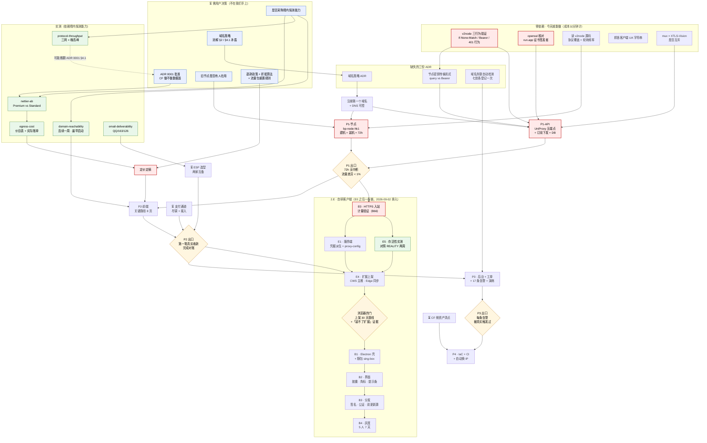

# babel.plus 路线图：P1 与「批准 + 定价」两条链解耦并行，在第一笔真实付款处汇合

> 日期：2026-08-16（**2026-08-30 复核 §3–§7 的勾选状态与 §9 的 B1–B52 总账；同日第二次复核，
> 基线从 `a4604c9396f` 前推到 `b6e7603e7f9`**） ·
> 性质：**排期计划** · 状态：**执行中**（2026-08-30；原「设计稿 v1（2026-08-16，待用户确认）」）
> 事实基线：细化自 [product-brief.md](product-brief.md) §9 的 P0–P4 五段；阻塞项与风险逐条来自
> `05-adr/0001`–`0015`、`02-architecture/*`、`03-product/*`、`04-ops/*` 各自的
> 「这次没有解决的」尾节与「代价」尾节；实测清单来自 [evidence/README.md](../evidence/README.md)。
> **2026-08-30 那一轮的每个数字都出自当场跑过的命令**（命令写在对应条目里）。
> ⚠️ **同日两次复核，基线不同，本文的追加块各自标注了哪一次**：
> 第一次基线 master `a4604c9396f`（operation 18/128）；
> **第二次基线 `b6e7603e7f9`（operation 120/128、前端测试 623、迁移 19 组 / 47 张表、sqlc 343 条）**，
> 并第一次用只读 `gcloud` 实查了 GCP 侧（节点 0 台、`bp-` 告警 0 条、`bp-` Scheduler 0 条）。
> **凡标「2026-08-30 二次复核」的追加块以第二次为准；第一次的原文一律保留，不抹掉。**
> 关联（2026-08-30 追加）：[launch-readiness-review-20260830.md](launch-readiness-review-20260830.md)
> （本次复核的同源时点快照，含与 2026-08-21 那份的逐条对读）、
> [launch-readiness-review-20260821.md](launch-readiness-review-20260821.md)（**As-Built，不回改**）
> 关联：[docs/README.md §7](../README.md)（当前阻塞项）、
> [ADR 0001](../05-adr/0001-cloudflare-tos-risk.md)（P0 头号阻塞）、
> [ADR 0007 §9](../05-adr/0007-node-migration.md)（P1 的节点侧七阶段已单独排过）
> 读者：决定「下一件事做什么」的人。**本文不给日历日期**，理由见 §2。

---

## 1 · 结论：排期的三条组织原则

**这份路线图不是一条链，是两条几乎不相交的链。**

| 链 | 关键路径 | 卡在什么上 | 能否现在开工 |
|---|---|---|---|
| **技术链**（P1 内核可用） | v2node 三项行为验证 → `bp-node-hk1` 建成并过三网验收 → `bp-api` 的 UniProxy 五端点 + 订阅下发 → 单人 72 h 验证 | 只卡在**一次容器实验**与**一个域名** | ✅ **可以，今天就能开始** |
| **商业链**（P2 产品闭环） | ADR 0001 批准 → 网络层级 A/B + 出口单价核实 → 定价定稿 → 支付通道尽调与接入 | 卡在**一次用户决策**与**一组实测** | ❌ 两端都不在我们手上 |

两条链在 **P2 的「第一笔真实 USDT 收款完成对账」** 处第一次汇合。在那之前它们互不阻塞。

### 三条组织原则

1. **把 P1 与定价解耦。**
   P1 造的是数据面（节点、订阅、配额、鉴权），它的形态**不因 ADR 0001 的结果而改变** ——
   无论 CF 承不承载数据面，GCP 节点上的 REALITY / Hysteria2 / SS-2022 都要建。
   ADR 0007 已经预置了这条解耦所需的唯一约束：
   **`bp-node-hk1` 第一阶段一律不装 cloudflared**，也绝不复制旧节点的 tunnel token。
   > ⚠️ 但这条解耦有一个失效条件，写在 §12 代价第 1 条：
   > **若用户表态倾向方案 A/B（接受 ToS 风险换流量免费），应当立刻暂停 P1 的节点建设。**

2. **每个阶段的出口标准必须是一次可判定的观察，不是一份文档。**
   「写完了 X 设计」不是出口标准，「Y 在 Z 条件下被观察到」才是。
   本文每个阶段的出口标准都能用一条命令、一次人工加载或一个数字比较来判真伪。

3. **实测按「能推翻多少既有裁决」排序，不按「哪个容易做」排序。**
   当前是**零实测数据**状态，六项 P0 采集任务的价值差了一个数量级。排序见 §10。
   其中 [ADR 0004 §3.7](../05-adr/0004-transport-hardening.md)（Premium vs Standard）
   自陈「论据最弱」且直接决定出口单价翻不翻倍，因此排第一。

---

## 2 · 为什么不用日历时间

我们没有团队规模信息，任何「大概两周」都是编造。本文用**依赖顺序 + 出口标准**表达排期。

需要相对量级时，只用两种有依据的刻度：

**（a）观察窗口长度 —— 这是唯一有真实下限、不可压缩的时间。**

| 窗口 | 长度 | 出处 | 性质 |
|---|---|---|---|
| 域名/托管平台三网可达性采样 | **连续一周，必须覆盖晚高峰** | [ADR 0003 §7](../05-adr/0003-web-hosting-and-reachability.md) 第 1 条 | 硬要求，文献说明单次白天测试会误导 |
| 节点单人验证 | **连续 72 小时** | [ADR 0007 §9.1](../05-adr/0007-node-migration.md) 阶段 3 | 硬要求，明令「不并阶段」 |
| 小队灰度 | **7 天** | ADR 0007 阶段 4 | 硬要求 |
| 旧节点冻结观察 | **30 天零回滚事件** | ADR 0007 阶段 6 | 硬要求 |
| 任何节点变更后旧端点并行存活 | **≥ 7 天** | ADR 0007 §8 | 硬要求（用户侧订阅刷新是 24 h 或手动，回滚做不到即时） |
| TRON 解质押锁定 | **14 天** | [pricing §4.2](../03-product/pricing-and-plans.md) | 外部约束 |
| 破坏性变更时旧节点端点保留 | **≥ 90 天** | [api-contract §11](../02-architecture/api-contract.md) | 提案，无实测依据 |

**（b）工作项个数与外部等待标记。** 每个阶段的任务清单条数是可数的；凡需要外部方
（用户决策 / 供应商审核 / 域名注册 / 权限授予）的条目单独标 ⏳，因为它们的耗时不由我们决定。

> 建机本身有一个估计值：一次完整建机 **90–150 分钟**
> （[node-provisioning §9](../04-ops/node-provisioning.md)，**该数字是估计不是测量**），
> 不含晚高峰挂机采样 —— 后者要跨一个白天。

---

## 3 · P0 · 调研与设计

### 3.1 目标

**每一条会影响架构或定价的裁决，要么有一手数据支撑，要么被明确标记为「带着风险推进」并写明触发复审的条件 —— 不允许第三种状态（悬空但看起来已定）。**

### 3.2 任务清单

> **2026-08-30 勾选复核。三条判定口径，先说清楚再看勾：**
> 1. **写了代码 ≠ 上线，写了脚本 ≠ 执行过，裁决落库 ≠ 已批准。**
>    `infra/` 下 **18 支脚本共 10,705 行**全部带 dry-run，而 `bp-node-*` 现有 **0 台** ——
>    所有节点侧任务一条都不勾。
> 2. **ADR 0010–0015 六份全是「提案，未批准」**，所以它们对应的任务
>    （域名策略 / 退款政策 / 折抵算法 / iOS 客户端 / SLO / on-call）**一条都不勾**，
>    只在行尾登记「有裁决草案」。
> 3. **勾了的每一条都注明日期 + 证据**（commit、文件路径或一条可复跑的命令）。

**0.A · 决策解锁（需用户决策，⏳ 外部等待）**

- [x] ~~⏳ **ADR 0001 拍板**：Cloudflare 用不用做数据面。批准提案 C，或裁为 A/B 并按
      [docs/README §4](../README.md) 的规矩写新 ADR 逐条交代旧理由落点。**这是头号阻塞。**~~
      **✅ 2026-08-17 用户批准提案 C**（指示「所有决策按照推荐」），
      证据：`docs/05-adr/0001-cloudflare-tos-risk.md:3` 的「**已批准，待实施**」
      与「裁决人：用户（2026-08-17 批准）」一行；记录随 commit `a70a9621298` 进 master
      （`git merge-base --is-ancestor a70a9621298 HEAD` 为真，2026-08-30 实查）。
      ⚠️ **是「已批准，待实施」不是「已实施」** —— 落地约束 1–3 一条都没做（B33）。
- [ ] ⏳ **`vpn-us` / `vpn-jp` 上是否有人在用** —— ADR 0007 §11 第 1 条自陈
      「本文唯一一个必须由人回答、任何命令都替代不了的问题」。
- [ ] 🔶 ⏳ **域名策略**：要几个主域名、注册在哪、DNS 用谁、带外推送怎么做。
      当前 `system-design §2`（用 `web.babel.plus` / `docs.babel.plus` 子域）与
      `system-design §4.1`（禁止子域）**直接矛盾**，需一份 ADR 裁决。
      **2026-08-30：ADR 写出来了，但本条不勾。**
      [ADR 0010](../05-adr/0010-domain-strategy.md)（2026-08-23，随 PR #18 于 2026-08-29 进 master）
      裁决「按故障域买五个中性主域名，品牌不进域名；NS 全放注册商，CF 在 P1 持零个池内 zone」，
      §2.2 直接消解了 system-design 的那处矛盾。
      **不勾的两条理由**：① 状态是**提案，未批准**；② 它规定的 **5 个域名一个都没买**。
      ✅ 顺带订正一个错误前提：`babel.plus` **已注册且 DNS 可控**
      （`dig +short NS babel.plus` → `dns13/dns14.hichina.com`，2026-08-30 实查），
      归属已于 2026-08-25 由用户确认为「项目所有者自己的」。见 §9 B4。
- [ ] 🔶 ⏳ **退款政策** —— 法务页不能空着上线，~~年付 75 折把风险前置~~。
      [page-inventory §8](../03-product/page-inventory.md) 标为**上线前置条件不是待办事项**。
      **2026-08-30 两处更新**：① **「年付 75 折」已被推翻，改 85 折且年付不随首发上架**
      （[pricing §3.2](../03-product/pricing-and-plans.md) 逐格复算：75 折下标准/重度年付
      落到 1.17/1.16，破 1.20× 地板）；② [ADR 0013](../05-adr/0013-billing-and-refund-rules.md)
      给了完整退款方案，迁移 `0016` 甚至已经把「冷静期退款一生一次」做成数据库约束
      （`refunds_cooling_off_once`，commit `a4604c9396f`）。
      **仍不勾**：ADR 0013 是**提案，未批准**，且这一条的实质是**用户对外承诺**不是技术方案。
- [ ] 🔶 ⏳ **升级折抵算法**（按剩余天数还是剩余流量）与**流量包在周期重置时保留还是清零**
      —— 两条都是产品规则，卡着 `POST /orders` 的 `surplus_amount` 契约与
      `users.transfer_enable` 是否要拆成 `_plan` + `_pack` 两列。
      **2026-08-30：`transfer_enable` 那半句已经在数据库里落地了**（迁移 `0016`：
      它现在是 GENERATED STORED 列 = `transfer_enable_plan + transfer_enable_pack`，
      `pack_expire_at` 顺延 12 个月，加油包跨周期结转），
      [ADR 0013](../05-adr/0013-billing-and-refund-rules.md) 裁决「升级只按剩余天数折抵」
      且 `GetRefundBasis` 的 `WITH RECURSIVE` 升级链已在真库上对过算例。
      🔴 **仍不勾，两条理由**：① ADR 0013 **提案，未批准** ——
      **也就是说数据库已经按一份未获批准的裁决改了形状**；
      ② [pricing §3.5.10](../03-product/pricing-and-plans.md) 明记
      **降档、周期内多次升档、加油包余量三种情形都还没有算式**，`surplus_amount` 契约仍未定。
- [ ] 🔶 ⏳ **iOS 首推客户端**：Karing（user-journey，旅程步数最短）vs Shadowrocket
      （tutorials-spec，需要注册外区 Apple ID 的完整子旅程）。
      **2026-08-30：[ADR 0015](../05-adr/0015-client-strategy.md) 已裁决**（连同 sing-box profile
      形态、分流规则一致性、设备数软限制口径一并处理），但状态是**提案，未批准**，
      **所以不勾** —— 在用户批准之前 tutorials-spec 与 user-journey 都不该按它改。
- [ ] ⏳ **是否采购境内探测能力**（租三网短期 VPS 或买商业监测服务）——
      §10 六项实测里有三项依赖它，而 [ADR 0004 §6](../05-adr/0004-transport-hardening.md)
      记录了境内 VPS 探测境外中转服务本身的法律敞口。

**0.B · 零成本、零依赖、能立即做的验证（应当排在所有事情之前）**

- [x] ~~🔴 **起一个真实 v2node 容器，一次测完三件事**：
      (a) 是否发送 `If-None-Match`；(b) 能否配置 `Authorization` 头；
      (c) 收到 401/403 时**是否清空本地用户列表**。
      成本以分钟计，影响见 §9 与 §11-R8。**这是全项目性价比最高的一个动作。**~~
      **✅ 三个问题都有答案了，但 🔴 容器一次都没起 —— 勾的是答案，不是方法。**
      (a) **发**（2026-08-17，读源码；v2node 完整实现条件请求：发送 → 304 短路 → 保存新 ETag，
      证据 [v2node-contract-20260817 §2](../evidence/v2node-contract-20260817/)）；
      (b) **不能**（只发 query，无 `Authorization` 支持、无开关 —— 即 B6，裁决为 query）；
      (c) **不会清空**（2026-08-21，读源码；`GetUserList` 在 401/403 上返 error 而非空列表，
      `nodeInfoMonitor` 在 `compareUserList` 之前提前 return，证据
      [v2node-401-behavior-20260821](../evidence/v2node-401-behavior-20260821/)）。
      🔴 **但 (c) 的答案带出一个方向相反的新风险**：`Controller.Start()` 在拉不到用户表时**拒绝启动**
      —— 运行中是静默失效（只有一行 `log.Error`），**重启**才是全员掉线且不自愈。
      🔴 **真机验证仍然欠着**：§4.3 出口标准 2 要的「180 秒窗口 1×200 + 2×304」是真机判据，
      读源码替代不了它（B3 仍记 🔶）。
- [x] ~~🔴 **`openssl s_client` 核对 `*.run.app` 与 Cloud Run 自定义域名映射的证书签发者。**
      成本 10 秒。若是 Google Trust Services，则 API 必须有两个入口
      （面向中国用户的域名经能钉 LE 的代理，节点继续直连 run.app）。~~
      **✅ 2026-08-21 做完，答案是 GTS**：签发者 **Google Trust Services `CN=WR2`**
      （→ GTS Root R1 → GlobalSign），**不是 LE**。
      证据 [gcp-inventory-20260821 §2](../evidence/gcp-inventory-20260821/)。
      ⚠️ **括号里那个「则」现在成立了，而它指向的动作没做**：deploy §15 的「若是 GTS」分支生效 ——
      `*.run.app` 直连**不能**作为面向中国用户的 API 入口，必须过一个能钉 LE 的代理
      （CF 橙云 $0 或 GCLB 约 $18/月**仍待核实**），**代理选型至今未定**（B9 的后半条）。
- [ ] 🔶 **读 v2node 源码**：它到底承载哪些协议（是否内置 Hysteria2 core）、
      轮询频率与端点次数（`4 次/60 秒` 目前是假设）、是否可配。
      前者决定 HY2 装机自动化要不要从头写，后者决定 §11-R6 的 Cloud Run 请求量算术。
      **2026-08-30：读过了，但结论没有落进任何一个 evidence 目录，所以不勾**（即 B8）。
      按本仓的证据纪律，「我记得读过」不构成事实基线 ——
      §11-R6 的「10 节点 = 免费额度的 86%」这条算术至今建立在一个没有出处的 `4 次/60 秒` 上。
- [ ] 🔶 **`gcloud sql instances describe` 核对四个配置细节**：存储下限、自动备份默认份数、
      PITR 事务日志保留天数、**删除实例时自动备份是否一并删除**（第四项优先级最高）。
      **2026-08-21 解决 3/4，所以不勾**：存储 **10 GB PD_SSD**、自动备份**保留 14 份**、
      PITR 事务日志 **7 天**；**第四问 `describe` 里根本没有这个字段，仍开放**（即 B12）。
      🔴 顺带查到三条本来没在问、但比第四问更要紧的：**`deletionProtection: false`**
      （一条命令就能删掉实例）、`storageAutoResize` 开且**无上限**（存储成本没有天花板）、
      公网 IP 存在且 `sslMode: ALLOW_UNENCRYPTED_AND_ENCRYPTED`。
      证据 [gcp-inventory-20260821 §3](../evidence/gcp-inventory-20260821/)。
- [x] ~~**查现有节点的网络层级**（`gcloud compute instances describe` + `addresses describe`
      两处，可能不一致）。查不清则 reference-repos §1.5 那组吞吐实测没有层级归属，
      ADR 0004 §3.7 无法复审。~~
      **✅ 2026-08-20 查完，两处一致**：`vpn-us`（us-west1-a）/ `vpn-jp`（asia-northeast1-a）
      **两台实例与两个静态 IP 全部 `PREMIUM`**。
      证据 [network-tier-implementation-20260820 §2](../evidence/network-tier-implementation-20260820/)。
      附带两条：Premium 是 GCP 默认值；当时脚本里**显式硬编码 `--network-tier=PREMIUM` 共 7 处**
      （不是疏忽，是写死的）。这一条解开了 ADR 0004 §3.7 的复审前提，进而有了 ADR 0008。
- [ ] **实验 mux 与 XTLS-Vision 是否互斥** —— 若互斥，
      ADR 0004 §3.3 与 system-design §3.1 必须放弃一个。
- [ ] **抓各客户端真实 `User-Agent` 字符串**（Clash Verge Rev / sing-box / Karing /
      Hiddify / v2rayNG / Shadowrocket）。api-contract §4.3 的分发表现在是推断的，
      **错一行对应客户端就拿到 base64 而不是 YAML**。

**0.C · 实测采集（六项，排序与理由见 §10）**

- [ ] 🔴 `nettier-ab-*` — Premium vs Standard（含 IPv6 能否事后开启）。
      **2026-08-20 更新：线上一直是 Premium**（`gcloud` 实查两台节点与两个静态 IP，
      见 [as-built-gcp §10.4](../02-architecture/as-built-gcp.md)），
      [ADR 0008](../05-adr/0008-network-tier-standard.md)「改用 Standard」**从未实施** ——
      所以这一项不再是选型调研，而是「一个已经在花钱的现状要不要改」。
      切 Standard 是**唯一一个不改产品形态就能压低单位出口成本的杠杆**，
      但省多少未知（需先做 SKU 级拆分），且代价是回程路径质量 —— 对代理类产品是体感问题。
      **这项 A/B 是那个决定的前置条件。**
- [x] ~~🔴 `egress-cost-*` — 官方价目表逐档核对（可立即做）+ 实际账单对账（需 P1 有真实流量）~~
      **两半都做完了**：目录价 2026-08-17（[evidence/gcp-egress-pricing-20260817](../evidence/gcp-egress-pricing-20260817/)）；
      账单对账 2026-08-20 —— **不需要等 P1**，两台自用节点在 2026-06-28 → 08-20 已经打出
      **2,927 GiB / $294.12**（Premium 混合 $0.1005/GiB，
      [as-built-gcp §10.3](../02-architecture/as-built-gcp.md)）。
      **仍欠 SKU 级拆分**，见 [pricing §7](../03-product/pricing-and-plans.md)。
- [ ] `protocol-throughput-*` — REALITY vs Hysteria2 × 电信/联通/移动 × 晚高峰
- [ ] `domain-reachability-*` — 候选托管与域名三网可达性，**连续一周**（最早启动）
- [ ] `email-deliverability-*` — QQ/163/126/Sina 送达率基线
- [ ] `region-ab-*` — **条目已过期**，应改写为 asia-east2 vs asia-northeast1，
      且它是 ADR 0007 阶段 5 的副产品，不需要独立做

**0.D · 补齐三份缺失的裁决**

> 🔴 **2026-08-30 复核：三条一条都不勾，但三条的欠法各不相同，必须分开说** ——
> 因为 §3.3 出口标准 6 的判据是「**各自存在，且不是「提案，未批准」**」，
> 这两个条件当前**没有一条同时满足**。

- [ ] 🔶 **域名策略 ADR** —— 消解 system-design §2 与 §4.1 的矛盾（承 0.A）。
      **文件存在**：[ADR 0010](../05-adr/0010-domain-strategy.md)（2026-08-23，PR #18 于 2026-08-29 合并）。
      **状态「提案，未批准」→ 出口标准 6 不满足，不勾。**
- [ ] 🔴 **节点密钥传输形式 ADR** —— ADR 0006 §10.2 要求 `Authorization: Bearer`，
      而 UniProxy 冻结契约里节点把 token 放 query string。
      api-contract §3.2.4 已给出 A（打补丁维护 fork）/ B（过渡态接受 query）/ C（换 agent，已否）
      三条路径，**需要一次裁决而不是一份手册**。依赖 0.B 第一条的 (b)。
      🔴 **2026-08-30：这一份 ADR 到今天根本不存在。** `ls docs/05-adr/` 是
      `0001`–`0008` 与 `0010`–`0015` 共 **14 份**，**没有一份是节点密钥传输形式**。
      事实上的裁决只活在 evidence 与 api-contract 里（B6：读源码确认「只发 query、无 Bearer 支持、
      无开关」，因此裁决为 query），**但那不是一份 ADR** ——
      按 [docs/README §4](../README.md)，它推翻的是 ADR 0006 §10.2 的一条明文要求，
      而「推翻旧裁决要写一份新 ADR 并逐条交代落点」这一步**没有做**。
      这是三条里唯一一条**连文件都没有**的。
- [ ] 🔶 **「域名被封的自动检测」ADR** —— 这个洞在
      ADR 0002 §7、ADR 0003 §7、system-design §9、user-journey §16、api-contract §14、
      data-model §16、runbook §7 **七处各被登记一次**，需要一次合并裁决。在它解决前，
      product-brief §8 承诺的「域名失联恢复 ≤ 30 分钟」**零机制支撑**。
      **文件存在**：[ADR 0011](../05-adr/0011-domain-blackout-detection.md)（2026-08-23），
      一次性合并解决了那七处登记。
      **状态「提案，未批准」→ 出口标准 6 不满足，不勾**；且**零机制支撑这句话今天仍然成立**
      （代码里没有域名池表、没有判决逻辑、没有广播通道）。

### 3.3 出口标准

| # | 判据 | 怎么验 |
|---|---|---|
| 1 | ADR 0001 状态不再是「提案，未批准」 | `05-adr/README.md` 表格里该行状态变更 |
| 2 | `evidence/` 下有 ≥ 5 个证据目录，每个带 README 且写明「证明什么、不证明什么」 | `ls docs/evidence/` |
| 3 | `pricing-and-plans.md` 里不再有留空的价格；`§7` 第一条（出口单价 P0）被划掉 | grep 该文件是否还有占位 |
| 4 | [docs/README §7](../README.md) 阻塞项表的第 1、2 条被划掉 | 直接读该表 |
| 5 | v2node 三项行为各有一条 evidence 记录（含「不支持」这种否定结论） | `evidence/v2node-behavior-*/README.md` |
| 6 | 三份缺失 ADR 各自存在，且不是「提案，未批准」 | `ls docs/05-adr/` |
| 7 | 至少一个域名**已注册**且 DNS 可控 | `dig` 得到我们自己配的记录 |

> **出口标准 7 是 P1 的真实硬前置**：node-provisioning 的 Hysteria2 需要 Let's Encrypt 证书
> （DNS-01 签发，刻意不建 A 记录，域名只存在于证书里），deploy.md 里所有 `*.babel.plus` 都是占位符。

**2026-08-30 逐条实测（上表原文不动，判定追加在这里）：**

| # | 判定 | 依据（当场跑过的命令 / 读过的文件） |
|---|---|---|
| 1 | ✅ **满足** | `0001-cloudflare-tos-risk.md:3` = 「**已批准，待实施**（2026-08-17 用户批准）」，不再是「提案，未批准」 |
| 2 | ✅ **满足，且超额**：要求 ≥ 5 个，实有 **9 个**，且 **9/9 都有 README** | `ls -d docs/evidence/*/ \| wc -l` = 9。最后一个缺 README 的目录 `ipv6-censorship-20260817/` 已于 2026-08-29 补上（含「证明什么 / 不证明什么」一节，并附 `sha256` 与逐字段解包） |
| 3 | ✅ **满足**（本轮由 §7 与定价落库共同达成） | `grep -n "待定" docs/03-product/pricing-and-plans.md` **无命中**（2026-08-30）；三档 ¥72/¥159/¥358 已定案；`pricing §7` 第一条已是 `- [x]` |
| 4 | 🔶 **半满足** | [docs/README §7](../README.md) 第 1 条已划掉（ADR 0001 已批准）；**第 2 条「零实测数据」原封不动** —— Standard 的性能数据仍是零，`nettier-ab-*` 未做 |
| 5 | 🔶 **答案有了，形式不合** | 三项行为全部有结论（见 0.B 第一条），但落在 `v2node-contract-20260817` 与 `v2node-401-behavior-20260821` 两个目录，**没有一个叫 `evidence/v2node-behavior-*`**；且判据要的「起容器」一次都没做 |
| 6 | 🔴 **不满足，0/3** | 域名策略（0010）与域名失联检测（0011）**文件存在但状态是「提案，未批准」**，判据明确排除这个状态；**节点密钥传输形式那一份连文件都不存在**（`ls docs/05-adr/` = `0001`–`0008` + `0010`–`0015`，14 份，无此题）。逐条见 0.D |
| 7 | ✅ **满足** —— 🔴 **而且它一直是满足的，只是没人查过** | `dig +short NS babel.plus` → `dns13.hichina.com.` / `dns14.hichina.com.`；`dig +short SOA babel.plus` → `dns13.hichina.com. hostmaster.hichina.com. 2026082617 3600 1200 86400 600`（2026-08-30 实查）。**即「至少一个域名已注册且 DNS 可控」为真。** 归属 2026-08-25 由用户确认为项目所有者自己的 |

> 🔴 **出口标准 7 的这次订正值得单独记一笔，因为它推翻的是一个被反复引用的前提。**
> 「域名一个都没注册」这句话曾出现在 §9 B4、`launch-readiness-review-20260821` §1/§2.2/§3、
> 以及 ADR 0014 的三处论证里，并且是 §4.4「P1 硬前置」的第一条。
> **它是错的** —— `babel.plus` 从 2023-01-11 起就注册着，NS 一直在我们手上，
> 生产 `bp-api` 的 `BP_ALLOWED_ORIGINS` 也一直指向它。
> **真正缺的是 ADR 0010 那 5 个中性镜像主域名（未采购）**，那是另一件事。
> 换句话说：**P1 的 Hysteria2 / DNS-01 证书链今天就可以开始搭，它并没有被「零域名」卡着。**
> ⚠️ 但请不要把这条读成「P0 快做完了」—— 出口标准 6 是 0/3，第 4 条只满足一半。

### 3.4 依赖

- 0.A 全部依赖用户，我们无法推进，只能催。
- 0.B 全部**零依赖**，是本阶段唯一可以立刻 100% 完成的一组。
- 0.C 的三项（nettier / domain-reachability / protocol-throughput）依赖 0.A 最后一条（境内探测能力）。
- 0.D 的第二条依赖 0.B 第一条的 (b)；第三条不依赖任何实测，纯设计，**但没人写**。

---

## 4 · P1 · 内核可用

### 4.1 目标

**第一个真实用户（运维自己）用 bp 自己签发的订阅链接、在 bp 自己的节点上连续上网 72 小时，且面板上的流量数字与节点上报对得上。**

### 4.2 任务清单

> **2026-08-30 勾选复核：1.A 节点侧一条都不勾，1.B API 侧勾了 6 条。**
> **2026-08-30 二次复核（基线 `b6e7603e7f9`）：1.B 再勾 1 条（UniProxy 端点），
> 1.A 仍然一条都不勾 —— `gcloud compute instances list --project=oratis-491316` 只返回
> `vpn-us` / `vpn-jp`，`bp-node-*` **0 台**（本次只读实查，不是转述）。**
> 🔴 **本阶段最该被记住的一句话，在二次复核之后变得更硬了**：
> API 侧从 18/128 做到 **120/128**、9 个 `RunXxxTask` 全部实现、六个节点面端点齐了，
> **而 §4.3 的八条出口标准仍然一条都不满足** —— 它们全部要求一台在跑的机器。
> **P1 现在只差一台机器，软件侧的借口没有了。**
> 🔴 **1.A 的脚本全部写好了，一台机器都没建。**
> `infra/node/` 下 `create-node.sh` 779 行、`setup-node.sh` 941 行、`verify-route.sh` 518 行、
> `rotate-ip.sh` 383 行（`infra/` 全目录 **18 支脚本 / 10,705 行**，2026-08-30 `wc -l` 实数），
> **全部带 dry-run，而 `bp-node-*` 现有 0 台**。
> **写了脚本 ≠ 执行过** —— 本节所有节点侧条目按此口径一律保持 `- [ ]`。

**1.A · 节点侧（照 [ADR 0007 §9](../05-adr/0007-node-migration.md) 与
[node-provisioning](../04-ops/node-provisioning.md) 执行）**

> 🟢 **2026-09-01 三次复核（基线 master `85ae3e2e494`）：本组第一次勾上三条。**
> `gcloud compute instances list --project=oratis-491316` 现返回三台 ——
> `vpn-us` / `vpn-jp` / **`bp-node-hk1`（asia-east2-a，RUNNING）**（本次只读实查）。
> **上面那两段「一台机器都没建」的原文一律保留，它记的是 2026-08-30 的实况。**
> 🔴 **但本组仍然只勾得动前三条，因为「建机」与「装机」是两件事** ——
> 机器在跑，**机器上一个协议栈都没装**。§4.3 的八条出口标准因此仍是 **0/8**：
> 出口标准 2–7 全部要求节点上有一个在跑的 v2node，而它不存在。
> 证据 [node-provision-bp-node-hk1-20260901](../evidence/node-provision-bp-node-hk1-20260901/)。

- [ ] 阶段 0 · 核查：清零 ADR 0007 §3 的九个待核实项（与 P0 的 0.B 重叠）
- [x] ~~阶段 1 · **防火墙先行**：建 4 条 `bp-*` 规则，**必须在实例创建之前就位**
      （`default-allow-ssh` 0.0.0.0/0 对所有实例生效，压制它的 `vpn-public-ssh-deny`
      只覆盖 `vpn-node` 标签）~~
      **✅ 2026-08-31 建成，四条齐，且优先级关系正确**：`bp-allow-hy2-udp443`(udp:443/1000) ·
      `bp-allow-reality-443`(tcp:443/1000) · `bp-iap-ssh-allow`(tcp:22/**900**) ·
      `bp-public-ssh-deny`(deny tcp:22/**1000**) —— **900 < 1000，即 IAP 段放行压过全网拒绝**。
      规则在实例创建**之前**就位（清点时间戳 `17:14:21Z` → `17:21:30Z` 同一批）。
      证据 [node-provision-bp-node-hk1-20260901](../evidence/node-provision-bp-node-hk1-20260901/)。
- [x] ~~建 `bp-node-sa`，**故意不授予任何 IAM 角色**（不能用 Compute 默认 SA，它常带 Editor）~~
      **✅ 2026-08-31 建成**：`bp-node-sa@oratis-491316.iam.gserviceaccount.com`
      （描述 `babel.plus node runtime`），出现在建机后清点里。
      ⚠️ **「零角色」这一半本次没有单独取证** —— 清点命令列的是 SA 存在，不是它的 IAM 绑定。
      要坐实还需一条 `gcloud projects get-iam-policy --flatten=bindings --filter=bp-node-sa`。
- [ ] IP 网段预筛（预留 5 个看落段，优先 35.220.x、避开 34.92.x，留 1 删 4）
      🔶 **2026-09-01：没有按这条做，所以不勾。** 实际是**只留了 1 个**（`bp-node-hk1-ip-cand1`
      = `35.215.140.154`），随后因误判换过一次，现网是 `35.215.158.52`。
      🔴 **而「换 IP」这个动作本身是被一个已被推翻的判据触发的** —— 见 §9 **B55**：
      两个 Standard IP 连续给出同样形态，**再换下去只是重复同一个测量误差**。
      本条的预筛方法在新判据落定之前无法执行。
- [x] ~~阶段 2 · 建 `bp-node-hk1`（asia-east2-a 或 -c、e2-small、Premium、IPv6）~~
      **✅ 2026-08-31 建成**：`bp-node-hk1` · **asia-east2-a** · **e2-small** · RUNNING ·
      Shielded VM · 删除保护 · IAP SSH 实测可登录 · 隔离核对 16/16。
      ⚠️ **两处与本行原文的偏差，都要记**：① 网络层级实建为 **Standard 不是 Premium**
      （照 [ADR 0008](../05-adr/0008-network-tier-standard.md)，且被
      [node-route-methodology-20260901 §2.3](../evidence/node-route-methodology-20260901/)
      的 A/B 事后支持：Premium 36.4 ms vs Standard 36.2 ms，**无可测差异** ——
      但那是单目标单时段的握手延迟，**不是吞吐**）；
      ② **IPv6 未核实**（本次清点无相关字段），承 B20 的二次阻塞。
- [x] ~~🔴 装机 9 步（sysctl / v2node / xray / hysteria2 / ss-2022 / acme.sh + LE / systemd 硬化
      含 `AmbientCapabilities=CAP_NET_BIND_SERVICE` / unattended-upgrades 关自动重启 / swap）~~
      🟢 **2026-09-01 当天做完了 9 步里的 7 步，REALITY 通路端到端可用。**
      证据 [node-bringup-20260901](../evidence/node-bringup-20260901/)。
      ✅ sysctl（BBR 已生效）· baseline（含 1 GB swap）· v2node（**钉 v0.4.3**）·
      transport · systemd · unattended-upgrades（Automatic-Reboot false）· ssh 加固。
      🔴 **没做的两步都卡在同一件事 —— 证书**：`cert` 步骤签不出来
      （`setup-node.sh` 写死 `--dns dns_cf`，那是已被 **ADR 0016 否决**的 ADR 0010 的遗留；
      而本机 `aliyun` CLI 配的是另一个账号，`babel.plus` 不在其下，报 `IncorrectDomainUser`）。
      **于是 Hysteria2 不可用**（它是唯一需要真证书的通路），SS-2022 也未启用。
      **REALITY 与 SS-2022 不需要证书这一点，脚本自己 step 3 就写着** ——
      但它的 systemd 单元把证书写成无条件 `LoadCredential`，
      导致「只跑 REALITY 的节点根本装不起来」，本轮一并修掉。
      🔴 **v2node 版本必须钉 v0.4.3，不能用 v0.4.5**：后者 vendored
      `xray-core v1.260728.0`（2026-07-28），已过脚本头部「版本地雷 ①」说的
      **v26.7.11 兼容断点**；v0.4.3 是最后一个 vendored `v1.260627.0` 的版本。
      ⚠️ 这一条与那颗地雷的原始表述有出入，值得记：地雷写的是「mihomo 会连不上」，
      **而实测下来 v0.4.5 上连官方 xray 26.3.27 客户端也连不上** —— 影响面比登记的更大。
- [ ] 阶段 3 · 单人验证 **72 小时**

**1.B · API 与数据侧**

- [x] ~~建 Cloud SQL `db-f1-micro`（`--edition=ENTERPRISE` 必须显式写，否则命令直接失败）~~
      **✅ 2026-08-17 建成**：`bp-db`，PostgreSQL **17**，`db-f1-micro`，`us-central1`，
      自建成起运行并计费（到 08-20 gross $0.74）。
      证据 [as-built-gcp §10.2](../02-architecture/as-built-gcp.md)。
- [x] ~~选迁移工具（`golang-migrate` / `atlas` / `goose` / `dbmate`）并落 44 张表的 DDL~~
      **✅ 选 `golang-migrate`（版本钉死，`infra/migrate/Dockerfile:28`），走独立 Cloud Run Job
      `bp-migrate`；44 张表已在库。** 2026-08-30 实数：
      `ls api/db/migrations/*.up.sql | wc -l` = **17 组**；
      `grep -rhoiE 'CREATE TABLE (IF NOT EXISTS )?[a-z_."]+' api/db/migrations/*.up.sql | sort -u | wc -l` = **44**。
      🔴 **2026-08-30 二次复核，上面这两个数都要改，而且第二个当时就是错的**：
      现为 **19 组**（新增 `0018_ledger_commission_account` / `0019_ledger_admin_adjust`，两支都只 seed 科目、
      `0019` 另把 `admin_users_email_uk` 改成 `WHERE disabled_at IS NULL` 的部分索引，**都不建表**）；
      表是 **47 张**不是 44 —— 上面那条 grep 的模式匹配不到 `CREATE UNLOGGED TABLE`，
      漏掉了 `server_online_state` / `user_device_state` / `rate_limit` 三张。
      44 + 3 = 47，与 commit `3e18dd8b269` 记录的 `make migrate-verify` 实跑结果
      （「up 后 47 表，down 后残留 0」）一致。
      ⚠️ **「谁保证 CI 里的 schema 和生产一致」这半句仍未解决**（B11），从未做过一次 schema diff。
- [x] ~~`bp-api` 骨架：chi + pgx/v5 + pgxpool（MaxConns=2）+ sqlc，`--max-instances=8`~~
      **✅ 2026-08-17 上 Cloud Run，四个参数逐条对上**：`api/go.mod` = `go-chi/chi/v5 v5.3.1` +
      `jackc/pgx/v5 v5.10.0`；线上 `BP_DB_MAX_CONNS=2`、`maxScale=8`
      （[as-built-gcp §10.1](../02-architecture/as-built-gcp.md)）；
      sqlc 生成 **194 条**查询（`api/db/gen/*.sql.go` 的 SQL 常量数，2026-08-30 实数）。
      **2026-08-30 二次复核：现为 343 条** —— `db/queries/*.sql` 的 `-- name:` 数、
      `db/gen/*.sql.go` 的 SQL 常量数、`Querier` 接口的方法数**三处一致**（各自一条命令实数）。
- [x] ~~冻结 UniProxy 契约，实现 UniProxy 五端点
      （`/config` `/user` `/push` `/alive` `/status`），**裸 JSON 不套信封**~~
      （原文写的是「冻结 ~~`openapi/uniproxy-v1.yaml`~~」，那个文件名早已被划掉，见下方 ⚠️）
      **✅ 2026-08-30 二次复核勾上**（commit `d5400165fc3` 之前的 `92b65e0d5f9` 段落里补完，
      `PushUniProxyStatus` 落在 `api/internal/handler/usersub.go:1413`）：
      **六个节点面 operation 现在全部实现** —— 五端点加上契约里多出来的 `/alivelist`。
      「裸 JSON 不套信封」已落实（PR #14 修过一次相反的错）。
      ⚠️ **一条文档欠账原样留着，不因为勾上就消失**：`openapi/uniproxy-v1.yaml` 这个文件仍然不存在，
      UniProxy 契约被并进了 `openapi/openapi.yaml`，**「单独冻结一份 uniproxy 契约」这个决定
      至今没有任何地方交代过**。勾的是「实现」，不是「那个决定被解释过了」。
      ⚠️ 另一条：**六个端点实现了 ≠ 验过了** —— §4.3 出口标准 2 要的「180 秒窗口 `1×200 + 2×304`」
      是真机判据，而节点数是 0（B3 仍记 🔶）。
      **以下是 2026-08-30 第一次复核时写的不勾理由，原样保留：**
      ① **`openapi/uniproxy-v1.yaml` 这个文件不存在** —— `ls openapi/` 只有 `openapi.yaml`
      一份（128 个 operation）。UniProxy 契约被并进了那一份，**「单独冻结一份 uniproxy 契约」
      这个决定被静默改掉了，没有任何地方交代过**。
      ② **五个端点实现了四个**：`GetUniProxyConfig` / `GetUniProxyUsers` /
      `PushUniProxyTraffic`（`/push`）/ `PushUniProxyAlive`（`/alive`）已实现，
      外加本行没列的 `GetUniProxyAliveList`（`/alivelist`）；
      🔴 **`PushUniProxyStatus`（`/status`）未实现，仍返 501**
      —— 而 `authmap.go` 的注释专门警告过它：表里查不到的 operation 会被**原样放行不做鉴权**，
      上一版正是把它拼错成 `GetUniProxyStatus`，「当时无害（handler 仍返回 501），
      但实现 /status 的那一刻它就是一个无鉴权写端点」。
      「裸 JSON 不套信封」已落实（节点面不套信封，PR #14 修过一次相反的错）。
- [x] ~~`node_id` 从密钥推导，请求里带的 `node_id` **一律忽略**，不一致返 403 并告警~~
      **✅ 已实现**：`api/internal/handler/node.go` 的 `nodeIDMatches`，
      五个已实现的节点面 operation 逐个先过它，不一致返 `403 NodeForbidden`。
      鉴权本身按 scope 白名单走 `authmap.go` 的 `nodeOperationScopes`（6 个 operation 各一个 scope），
      覆盖性由 `TestOperationAuthCoverage` 反射比对强制，不靠人肉核对。
- [x] ~~ETag：`servers.config_rev` / `servers.user_rev` 两列 + 四条 bump 规则~~
      **✅ 表结构已落库，但列的位置与本行写的不同**：不是 `servers` 上的两列，
      而是独立的 `node_rev` 表（`api/db/migrations/0004_servers.up.sql:71`，
      `server_id` 主键 + `config_rev` / `user_rev` / 两个 `_at`）。
      bump 规则由迁移 `0012` 的触发器实现（改 `users` 的 9 个字段自动 bump `user_rev`）。
      🔴 **两条代价原样留着**：① 触发器在 sqlc 生成的 Go 代码里是**隐形的**，
      调用方看不到任何线索（data-model §15.1 已登记）；
      ② **真机 ETag 生效未验证** —— §4.3 出口标准 2 的「180 秒 1×200 + 2×304」没跑过（B3）。
- [x] ~~订阅下发：token 十步校验、UA 分发、`subscription-userinfo` 头、伪节点、**同步写审计表**~~
      **✅ 2 个 operation 已实现并上云**：`GetShortSubscription` / `GetClientSubscription`
      （`api/internal/handler/subscription.go` + `internal/subgen/`，有 `subgen_test.go` /
      `clash_rules_test.go` 两支单测）。
      ⚠️ 两处真机欠账：`GEOIP,CN` 已按 B46 从下发规则里去掉（**代价是国内流量现在也走节点**）；
      sing-box 侧缺 `inbounds` / `route.rules`（B45，需真机验）。
- [x] ~~账户体系最小集：邀请码、邮箱登录、订阅 token 表、设备数~~
      **✅ 10 个 operation 已实现并上云**：`VerifyInviteCode` / `RegisterAccount` /
      `SendEmailCode` / `Login` / `RefreshToken` / `Logout` / `ForgotPassword` /
      `ResetPassword` / `ChangePassword` / `GetCurrentUser`（`api/internal/handler/auth.go`）。
      🔴 **但邮箱这条链是断的**：ESP 未选型、**发信未接通**，`email_log.status` 恒为 `queued`
      —— 也就是说「邮箱登录」现在拿不到验证码（B22）。
- [ ] 六条 Cloud Scheduler + 一条 Cloud Tasks 入账队列（OIDC aud 用 `*.run.app` 不用镜像域名）
      **2026-08-30：不勾。** 9 个 `RunXxxTask` 端点**全部 501**
      （`authmap.go` 的 `internalTaskOperations` 硬 501，见 §9 B48）；
      `infra/scripts/setup-scheduler.sh`（916 行）已写好并过 shellcheck，**但从未执行**。
      as-built 记录 GCP 上已有 **2 条 Cloud Tasks 队列**，Scheduler 作业则是 0 条。
      🔴 **2026-08-30 二次复核：上面那半句「9 个端点全部 501」已经不成立，而本条仍然不勾。**
      九个 `RunXxxTask` **全部实现**（commit `6ed53d5a8bc`，22 个顶层测试 / 63 个子测试）；
      外部依赖做成可注入接口，未配置时优雅退出 `200 + WARN` 而不是 503
      （每分钟一次的假告警会训练所有人忽略它）。
      **不勾的理由换成了纯粹的一条**：`gcloud scheduler jobs list`（us-central1 / asia-east2 / us-west1
      三个 location 各查一次，2026-08-30 只读实查）返回的**只有 `lisa-autonomy-sweep` 一条，
      `bp-` 作业 0 条**。**端点在那里，没有任何东西会去调它。**
      🟢 **2026-09-01 三次复核：本条勾上，上面那句「没有任何东西会去调它」已经不成立。**
      `setup-scheduler.sh --only=scheduler --apply --yes` 于 **2026-08-31 首次上线时执行**
      （[first-deploy §2](../04-ops/first-deploy-20260831.md) 第 8 步），建成 **8 条**作业：
      `bp-alive-gc` / `bp-expire-check` / `bp-order-timeout` / `bp-chain-scan` /
      `bp-traffic-reset` / `bp-stat-rollup-hourly` / `bp-stat-rollup-daily` / `bp-remind-sweep`,
      **全部 ENABLED，走 OIDC，实测 200**（`gcloud scheduler jobs list --location=us-central1`
      2026-09-01 只读实查，逐条对上）。
      ⚠️ **原文那条「六条 Cloud Scheduler + 一条 Cloud Tasks 入账队列」的计数也要订正**：
      实建 **8 条 Scheduler**（`stat-rollup` 拆成 hourly / daily 两条，另多一条 `remind-sweep`）。
- [ ] 🔴 十条 log-based metrics **必须在 `bp-api` 第一次部署之前建好**（它们不追溯）
      **2026-08-30：这一条已经失败了，不是「还没做」而是「做晚了，损失已经发生」。**
      `bp-api` 首次部署是 2026-08-17，而当天 `gcloud logging metrics list` 返回空 ——
      **2026-08-17 → 08-21 的四天数据因「不追溯」永久缺失**。
      2026-08-21 补建 **7 条**；清单现为 **11 条**（`bp_ratelimit_degraded` 是本轮新增），
      仍有 **4 条未建**：`bp_mail_bounce`（ESP 未接通）、`bp_cert_issuer_bad`（信号源已有，指标未建）、
      `bp_node_alive`（应用侧已写日志，指标未建，**§5 的 metric-absence 告警依赖它**）、
      `bp_ratelimit_degraded`（限流失败开放时唯一的痕迹，**它不产生任何 429**）。
      逐条见 [monitoring §3.2](../04-ops/monitoring.md) 与 §9 B42。
      **2026-08-30 二次复核（`gcloud logging metrics list --project=oratis-491316` 只读实查）：
      确实是 7 条，逐条对上** —— `bp_admin_authz_fail` `bp_api_429` `bp_api_5xx` `bp_db_pool_wait`
      `bp_subscribe_404` `bp_task_idem_skip` `bp_uniproxy_auth_fail`。
      **此前这个「7」是转述，现在是实测；差的那 4 条也确实一条都没建。**

### 4.3 出口标准

| # | 判据（可判定） | 阈值性质 |
|---|---|---|
| 1 | `bp-node-hk1` 通过 [node-provisioning §5.3](../04-ops/node-provisioning.md) 的 J1–J6，采样含 ≥ 1 次晚高峰 | 判据全为**设定值** |
| 2 | v2node 从 `bp-api` 拉到配置与用户表，且 `/user` 在 180 秒观察窗内出现 `1×200 + 2×304` | 有据（ADR 0006 §11.4 的验证方法） |
| 3 | 若第 2 条不成立（v2node 不发 `If-None-Match`），**已切到降级方案并把降载损失写进 evidence** | 允许「验证为否」通过 |
| 4 | 一条真实订阅链接在 **Clash Verge Rev 与 sing-box 各人工加载一次成功** | 不可自动化（ADR 0006 §12 已定） |
| 5 | 连续 72 小时无中断；节点内存峰值 < 70%；面板 `stat_user` 的 `u+d` 与节点侧上报差异 **< 1%** | 前两条有据（ADR 0007 阶段 3），**1% 是设定值** |
| 6 | 封禁 / 配额耗尽 / 到期 三个状态各手工触发一次，节点侧生效时间分别 ≤ 60 s / ≤ 60 s / **≈ 6 分钟** | 有据（5 分钟扫描 + 60 秒轮询） |
| 7 | 一次节点密钥轮换按 D5 **两步**做完，节点全程不失联；API 层对「一步吊销」返 409 | 有据（api-contract §6） |
| 8 | 每阶段前后各跑一次 [as-built §7](../02-architecture/as-built-gcp.md) 清点命令做 diff，`vpn-*` 与三个 Cloud Run 服务零变化 | **这是「不影响已部署服务」唯一可验证的形式** |

**2026-09-01 逐条判定（上表原文不动，判定追加在这里）。证据 [node-bringup-20260901](../evidence/node-bringup-20260901/)：**

| # | 判定 | 依据 |
|---|---|---|
| 1 | 🔴 **不满足，且判据本身作废** | J1–J3 建立在 ICMP 打运营商 DNS 上，已被实测推翻（**B55**）。新判据未定、阈值未重标定、数据源 B/C 与晚高峰采样未做 |
| 2 | ✅ **满足** | `GET /api/v2/server/config` → `200 + ETag "c-1"`；带 `If-None-Match` → **304**。⚠️ 路径不是原文写的那个 —— v2node 实际请求 `/api/v2/server/config`，本轮补进契约 |
| 3 | — | 前提未发生（第 2 条成立） |
| 4 | ✅ **满足** | **未经任何手工修改的订阅**，在 mihomo（Clash Verge Rev 内核）与 sing-box 上各加载一次，**出口 IP 均为 `35.215.158.52`**。这一条是被 **B15** 挡了 16 天的那一条 |
| 5 | 🔶 **三项里达成两项，72 小时未开始** | 内存峰值 **388 / 1976 MiB ≈ 20%**（阈值 < 70%）✅；流量差 **0.3%**（15,000,000 B 实下 → 面板增量 15,039,442 B，阈值 < 1%）✅；**连续 72 小时观察窗口尚未开始** 🔴 |
| 6 | 🔴 **未做** | 封禁 / 配额耗尽 / 到期 三态各需手工触发一次并计时。软件侧链路已通（8 条 Scheduler 在跑），但一次都没触发过 |
| 7 | 🔴 **未做** | 节点密钥两步轮换演练零次 |
| 8 | ✅ **满足** | `verify-isolation.sh` 部署前 16/16、部署后 **18/18**，非 `bp-` 资源逐字节未变 |

> **2026-09-02 再判（证据 [adr0014-alerts-hy2-20260902](../evidence/adr0014-alerts-hy2-20260902/)）：**
>
> | # | 判定 | 依据 |
> |---|---|---|
> | 1 | 🔴 仍不满足 | 判据未重定（B55） |
> | 4 | ✅ 满足 → **两条通路都满足**：HY2 也从 mihomo 容器与原生各加载一次，出口 IP 正确 | 原判定只有 REALITY |
> | 5 | 🔶 **72 h 窗口已起算**：起点 2026-09-02T07:05:22Z（HY2 热重载成功、双通路同时在跑）；内存峰值与流量差两项已达成 | 终点 09-05T07:05Z；节点侧 `bp-mem-sample.timer` 每分钟采样 |
> | 6 | ✅ **满足**：封禁 **38 s**、配额耗尽 **17 s**（真实下载经 `/push` 撞线）、到期 **3 min 51 s** | ⚠️ 前提是 **B63**（只剩一个用户时踢不掉）已用哨兵用户绕过 |
> | 7 | 🔴 未做 | 需 `wangharp@gmail.com` 在 `admin.babel.plus` 登录（B56 的两个权限位同样卡在那里） |
>
> 🟢 **3.5/8 → 6/8**（1、7 未做，5 在等时间）。**剩下三条里没有一条需要写代码。**

> 🟢 **从 0/8 到 3/8 + 1 个半满足。** 这是 P1 出口标准第一次不是零。
> 🔴 **而剩下的 5 条里，只有 1 条（第 5 条的 72 小时）是「等时间」** ——
> 第 1 条要重定判据、第 6/7 条要做演练、第 3 条依赖第 2 条（已满足所以不适用）。
> **它们都不需要再写代码。**

### 4.4 依赖 / 阻塞

- **硬前置**：P0 出口标准 7（至少一个域名）、P0 的 0.B 第一条（v2node 三行为）。
- **不依赖**：ADR 0001、定价、支付通道、ESP 选型、前端框架。
- **软风险**：节点密钥传输形式（query vs Bearer）未裁决时，可按 api-contract §3.2.4 的
  **过渡态 B** 推进（每节点独立密钥 + 每次 query 认证写 WARN 日志带 `key_id`），
  但必须记住那条硬约束：**在 ADR 0007 阶段 5 全量切换前必须关闭过渡态。**

---

## 5 · P2 · 产品闭环

### 5.1 目标

**第一批 20 个用户能自助走通「收到邀请码 → 注册 → 付款 → 拿到订阅 → 连上」，且至少有一笔真实链上收款完成对账。**

### 5.2 任务清单

**2.A · 前端与页面（P1 档共 28 个，其中 8 页是关键路径）**

> **2026-08-30 勾选复核：本组只有第一条能勾一半，其余一条都不勾。**
> 前端确实动了（登录态、守卫、108 个测试、三页接线），
> **但关键路径 8 页里只有 `/dashboard` 与 `/ticket` 两页接了线**，
> 落地页、注册、套餐、收银台、订阅页、docs 教程站**都还是空壳或不存在**。
>
> **2026-08-30 二次复核（基线 `b6e7603e7f9`）：本组再勾 1 条，前两条仍不勾但理由缩小了一大圈。**
> `pnpm test` 本次真跑：**623 个用例 / 48 个文件全绿**（shared 67/3 + user 189/20 + admin 367/25）。
> 用户面板 **20 条业务路由全部接线**（commit `d5400165fc3`；`user/src/App.tsx` 共 22 条 `path=`，
> 另两条是 `/` 重定向与 `*` 的静态 `NotFoundPage`）；
> 后台 23 页接线 **21 页**（`b6e7603e7f9`），不接的两页是 `DomainsPage`（三个端点都是 501）
> 与 `NotFoundPage`（静态页）。`web/` 下的 `TODO(P1)` 从 **44 处 / 30 个文件**降到
> **22 处 / 16 个文件**（`grep -rho 'TODO(P1)' web --include='*.ts*' | wc -l` 实数）。
> 🔴 **关键路径 8 页现在接线 6 页，仍缺的两页是同一件事**：落地页与 `docs.*` 教程站
> **属第三套前端，目录都还不存在**。

- [ ] 🔶 选前端框架与组件库（用户面板 M1 移动优先 / 后台 M3 桌面优先，两者要求差异很大）
      **框架已定并已在跑**（`web/*/package.json` 2026-08-30 实读）：
      **React `19.2.8` + react-router `7.18.2` + Vite `8.2.1` + Tailwind `4.3.3`**，
      测试 vitest `4.1.11`，**108 个用例 / 7 个文件全绿**（`pnpm -r test` 2026-08-30 复跑：
      shared 67 + user 33 + admin 8）；`AuthProvider` + `RequireAuth` 三态守卫落地，
      16 条受保护路由整段在 layout route 守卫之下，`App.routes.test.tsx` 对**真实路由表逐条**核对。
      🔴 **组件库仍未选型，所以不勾**：`web/README §7` 代价 5 明记手写的
      `Button` / `Card` / `Badge` 只够撑骨架，**后台 16 条危险操作需要的确认对话框
      （焦点管理 + 键盘 + 屏幕阅读器）现在不存在**；后台 admin 框架（Refine 之类）也未定，
      因此 `openapi/admin-api.yaml` **仍不能冻结**（B27）。
      **2026-08-30 二次复核：测试数改为 623 个用例 / 48 个文件**（本次真跑）；
      后台侧另有 `admin/src/lib/auth.tsx` 的 `RequireAdmin` 守卫与
      `admin/src/App.routes.test.tsx` 对真实路由表逐条核对。
      🔴 **仍不勾，两条理由都没变，而第一条现在有了一个具体的证物**：
      ① 后台 16 条危险操作用的是 `components/DangerousAction.tsx`（742 行），
      它是**行内确认块不是 modal** —— `grep 'role="dialog"\|aria-modal\|<dialog'` 在该文件里**无命中**。
      这不是疏忽，是 web/README §7 代价 5 那句「那个组件现在不存在」的直接后果：
      做不对焦点管理的 modal 对键盘与读屏用户就是死路，所以刻意退回行内块。
      **组件库这一条一个字都没被解决。**
      ② 后台 admin 框架（Refine 之类）仍未定，`admin-api.yaml` 仍不能冻结。
- [ ] 🔶 关键路径 8 页：落地页 → `/auth/register` → `/plan` → `/order/:trade_no` →
      `/subscribe` → `docs.*` → `/dashboard` → `/ticket`
      **2026-08-30：8 页里接线 2 页（`/dashboard`、`/ticket`，commit `2c0c6b69bde`），
      外加不在这 8 页里的 `/auth/login`。** 全仓 47 个路由组件里只有这 3 个真的调过 API；
      `web/` 下仍有 **44 处 `TODO(P1)` 散在 30 个文件里**（2026-08-30 `grep` 实数）。
      **落地页与 `docs.*` 教程站属第三套前端，目录都还不存在**（`web/README §8` 已登记）。
      **2026-08-30 二次复核：8 页里接线 6 页**（`/auth/register`、`/plan`、`/order/:trade_no`、
      `/subscribe`、`/dashboard`、`/ticket`，commit `d5400165fc3`）。
      🔴 **仍不勾，缺的两页是同一件事**：**落地页**与 **`docs.*` 教程站**属第三套前端，
      目录到现在都不存在。
      ⚠️ **另一条不能被「6/8」盖过去的实况**：`/auth/register` 这一页前端是完整的，
      **而真人现在收不到那封验证码邮件** —— ESP 一行没接（见 2.C）。
      「页面接好了」与「这条路径能走通」在这一页上是两件事。
- [x] ~~`/order/:trade_no` **必须独立成页不能做弹窗**（要承载链选择、汇率倒计时、
      `underpaid` 显式界面、可关页再回来的轮询、「我已付款帮我查一下」主动查单）~~
      **✅ 2026-08-30 二次复核勾上**（commit `d5400165fc3`）：
      `web/user/src/routes/OrderDetailPage.tsx` 是 `App.tsx` 里 `path="/order/:trade_no"`
      的独立路由（不是弹窗），承载的五件事逐条对上后端已实现的
      `GetOrderPayment` / `PayOrder` / `RecheckOrderPayment`（「我已付款帮我查一下」走最后这条）。
      ⚠️ **勾的是「这一页存在且形态对」，不是「付款能走通」** ——
      链上扫描器是「未配置」的默认实现，没有任何一笔真钱经过这一页（见 2.B）。
- [ ] 🔶 **落地页已建成并部署，但 DNS 未切**（2026-09-04）：`web/site/`（Vite，**产出零 JavaScript**，
      8.0 kB HTML + 4.9 kB CSS），镜像与 nginx 配置在 `infra/site/`，服务是 Cloud Run `bp-site`，
      已接进负载均衡器且经 `Host: babel.plus` 实测 200（[first-deploy §4.6](../04-ops/first-deploy-20260831.md)）。
      🔴 **apex 与 www 现在指向 Vercel 上一个在线的、与本项目无关的产品**（LLM Game Platform），
      改指过来会让它下线 —— **等用户裁决**，三个选项：① 改指 apex（那个站点下线）；
      ② 官网放子域（如 `get.babel.plus`），apex 不动；③ 那个产品先搬到子域再让出 apex。
      连带：证书也没签（http-01 要求先有解析），`renew-le-cert.sh` 的 DOMAINS 已备好。
      ⚠️ `docs.*` 教程站仍不存在。
- [ ] 落地页四条硬约束：零 API 调用纯静态、域名探测后台并行不阻塞首屏、
      页脚常驻全部镜像域名、字体图标全部自托管
- [ ] 备用域名页部署在**每一个**镜像域名上，< 20 KB 且无 JS
- [ ] `docs.*` 教程站（独立主域名 + 免登录 + 纯静态），面板内不做 `#/knowledge`

**2.B · 支付与计费（⏳ 含外部等待）**

> **2026-08-30：本组一条都不勾。** 支付相关 operation **全部 501**；
> 数据库侧倒是先走了一步 —— 迁移 `0014`–`0017` 已落 `payments` / `pay_addresses` /
> `refunds` / `coupons` 等表并带上 `refunds_cooling_off_once` 这类约束（commit `a4604c9396f`），
> 但**表在库 ≠ 有读写路径**，而且它们是按**提案未批准**的 ADR 0012/0013 建的形状。
>
> 🔴 **2026-08-30 二次复核：上面那句「支付相关 operation 全部 501」已经不成立，本组勾了 4 条。**
> 11 条支付 operation 全部实现（`CreateOrder` / `PayOrder` / `GetOrderPayment` /
> `RecheckOrderPayment` / `HandlePaymentNotify` / `VerifyCoupon` / `CancelOrder` …，commit `92b65e0d5f9`），
> 复式账在写入前按币种断言 `SUM = 0`（**不平的分录根本写不进去**），
> 两条冲突的入账路径已合并成一条（`3e18dd8b269`）。
> ⚠️ **但「实现了」在这一组里离「能收钱」比别处更远，三条都要说**：
> ① **裁决没批**（ADR 0012 提案未批），**AML 完全未定** —— 现在的状态是「实现了但不许开」；
> ② 链上扫描器是**可注入接口的「未配置」默认实现**，代码里没有任何第三方 endpoint 字面量，
>    没有连过 TronGrid，**一次链都没扫过**；
> ③ 🔴 **`paid → completed` 的权益开通未接** —— `markOrderPaid` 现在**响亮地**停在 `paid`，
>    每次打一条 `metric=bp_order_paid_not_provisioned` 的 ERROR。缺一条「首次开通的
>    covers_from / covers_to / reset_at」查询，而 `reset_at` 的口径唯一实现在
>    `stats.sql` 的 `AdvanceUserResetCycle` 里，在 Go 侧再抄一份就是本仓反复警告的漂移。
>    **也就是说：即使今天真收到一笔钱，用户也不会自动开通。**

- [ ] 🔶 ⏳ 支付网关定型（自托管 EPUSDT vs 托管 OxaPay）与尽调
      **2026-08-30：[ADR 0012](../05-adr/0012-payment-gateway.md) 把问题换掉了** ——
      裁决为「**不部署 EPUSDT、不接易支付、`bp-api` 自扫链、一单一址且永不复用、
      第一阶段一次都不归集**」。**状态「提案，未批准」，不勾**；AML 筛查方案仍完全未定。
      **2026-08-30 二次复核：仍不勾，理由一个字没改**，但现在它的分量不同了 ——
      **代码已经按这份未获批准的裁决实现完了**（11 条 operation + 复式账 + 一单一址）。
      此前是「schema 按未批准的裁决改了形状」，现在**逻辑也是**。
- [ ] ⏳ AML 链上风险筛查方案（MistTrack / TRM Labs / Chainalysis / Elliptic，均待评估）
- [ ] ~~小地址池 + 金额唯一性匹配（冲突 +0.0001 递增，最多 100 次）~~
      🔴 **2026-08-30 二次复核：本条被 [ADR 0012](../05-adr/0012-payment-gateway.md) §3.6 推翻，
      不是「做完了」也不是「还没做」，划掉的理由要写清楚**：
      裁决改为「**订单与收款地址一一对应且地址永不复用；归属只看 `to_address`，
      金额只用于判定 `paid` / `underpaid`**」。
      「小地址池 + 金额尾数唯一」整套机制**被取消**，`+0.0001 递增重试最多 100 次` 一并作废。
      数据库侧的强制已经在库：`pay_addresses.assigned_order_id` 是 `UNIQUE`（`0014_payments.up.sql:42`），
      `UNIQUE (chain, address)` 与 `UNIQUE (chain, derivation_index)` 各一条。
      ⚠️ **本条不勾成 `[x]`**：勾表示「这件事做到了」，而这件事**被裁掉了**。
      **替代它的那件事**（一单一址 + 按地址归属）已随 `92b65e0d5f9` / `3e18dd8b269` 实现。
      🔴 但 ADR 0012 **提案未批准**，所以这条推翻本身也还没生效 —— 两边都悬着。
- [x] ~~幂等键 `(provider, external_id)` 建**唯一索引**，不是应用层 `SELECT ... IF NOT EXISTS`~~
      **✅ 2026-08-30 二次复核勾上**（迁移 `0014_payments.up.sql:125`，随 commit `2c0c6b69bde` 入库）：
      `payments` 表上 `UNIQUE (provider, external_id)`。
      迁移注释逐字给了理由：应用层 `SELECT … IF NOT EXISTS` 在两个 Cloud Run 实例并发处理
      同一次重投时会**双双通过**，结果是**同一笔钱入账两次、开通两次**，
      而 `--max-instances=8` 之下这不是小概率。
- [x] ~~回调不可信 → 收到回调后反向查单；`POST /orders/{trade_no}/recheck` 是同一逻辑的用户侧入口~~
      **✅ 2026-08-30 二次复核勾上**（commit `92b65e0d5f9`）：
      `HandlePaymentNotify` 的默认验签实现对**一切**回调返回 401
      （`api/internal/handler/order.go:2066`，第一阶段没接任何网关，所以没有任何回调可能是真的；
      默认放行意味着任何人 POST 一个 JSON 就能触发入账路径）；
      `RecheckOrderPayment` 已实现（`order.go:1942`），是同一逻辑的用户侧入口。
      有一条专门的用例把这条纪律钉死：`TestProcessDepositUsesChainAmountNotCallbackClaim` ——
      回调声称全额到账、链上只有 0.5 USDT → **落库金额与状态判定只能来自链上**，订单停在 `underpaid`。
      **任何一天有人把回调载荷里的数字接进计算，这条测试就会炸。**
- [x] ~~**过期订单的收款地址继续监听 ≥ 24 小时**，到账入账为余额不直接开通~~
      **✅ 2026-08-30 二次复核勾上**（commit `92b65e0d5f9` / `6ed53d5a8bc`）：
      `api/internal/handler/order.go:80` 的 `addressWatchAfterExpiry = 7 * 24 * time.Hour`
      —— **取 7 天不是 24 小时**，注释写明契约里的「≥ 24 小时」是下限不是上限，
      且一单一址之下「第 8 天、第 800 天到账的钱归属仍然唯一确定」。
      `ExpireTimedOutOrders` 用 `greatest(...)` 把 `address_watch_until` 顶到至少 24 小时之后
      （`task.go:469`），chain-scan 的扫描范围就是 `address_watch_until > now()`。
      ⚠️ **勾的是「这条规则在代码里成立」** —— 而 chain-scan 的扫描器是「未配置」的默认实现，
      **这套监听至今一次都没有真的运行过**。
- [x] ~~D6「手工标记订单已支付」的独立权限位 —— **从第一天就存在，即使团队只有一个角色**~~
      **✅ 2026-08-30 二次复核勾上**：`admin_users.perm_mark_order_paid`
      **从迁移 `0002_foundation.up.sql:62` 就存在且 `DEFAULT false`**（「必须显式授予」写在列注释里），
      契约侧对应枚举值 `admin.order.mark_paid`（`AdminPermission`），
      服务端强制在 `api/internal/handler/admin_orders.go:1132` 的 `guardAdminPermission`。
      **四层强制齐了**（见 §6.2 的对应条目），D6 的凭证还配了一个专用科目
      `asset:manual_reconcile` —— 它的余额长期非零就意味着「有人标了已支付但钱没进来」。
      🔴 **顺带登记一条本轮查出的同族缺口，它不影响 D6 但影响 D7/D10**：
      `perm_refund`(D7) 与 `perm_adjust_balance`(D10) 这两个直接动钱的权限位
      **在 `AdminPermission` 枚举里没有对应值**，所以它们在 API 上既看不见也授不了。见 §9 **B52**。

**2.C · 邮件（⏳）**

> 🔴 **2026-08-30：本组一条都不勾，而它是全项目最安静的一个洞。**
> ESP 未选型、**发信一行都没接通**（`api/internal/handler/auth.go` 的 `TODO(P1)`，
> `email_log.status` 恒为 `queued`）。后果不只是「邮件没做」：
> [ADR 0002](../05-adr/0002-notification-channels.md) 裁决**邮件是唯一的失联恢复通道**，
> 而 §11-R5 / R3 的全部「切换类」应对都靠邮件广播推动用户重新拉订阅。
> 也就是说：**今天发生一次域名封锁，我们没有任何一条能通知到用户的路径。**
>
> **2026-08-30 二次复核：本组仍然一条都不勾，而它现在是全项目最刺眼的一个洞。**
> 前后两端都做好了、只差 ESP：注册 / 找回 / 重置**三页前端已完整**（commit `d5400165fc3`）、
> `CreateEmailLog` 在发码时真的写行（`auth.go:1299`）、`MarkEmailProbeRedeemed` 会回填 `redeemed_at`、
> `runMailSendTask` 已实现、`MailSender` 是可注入接口。
> 🔴 **而 `MailSender` 的默认实现叫 `unconfiguredMailSender`，`Name()` 返回 `"unconfigured"`**
> （`task.go:140`），`auth.go:1293` 的 `TODO(P1): 接 ESP 真正发信` 原封不动，
> `email_log.status` 恒为 `queued`，只有 dev 环境把验证码明文打进日志。
> **一个真人现在注册，收不到那封信。**

- [ ] ⏳ 选两家 ESP 互为备份（密钥、模板、退信回调都要做两套）
- [ ] 🔶 每次发验证码写 `email_log`（收件域名 / ESP / bounce 码 / 回填时刻）—— 这是
      ADR 0002 §7 要求的送达率数据源，**不是附带功能**
      **2026-08-30 二次复核：四项里做了三项，所以记 🔶 不勾。**
      ✅ 收件域名（`email_log.to_domain`，`0011_ops.up.sql:71` 冗余列 + `email_log_domain_idx`）、
      ✅ ESP 字段（`esp` 列，写的是 `MailSender.Name()`）、
      ✅ 回填时刻（`MarkEmailProbeRedeemed` 写 `redeemed_at`，`sent_at → redeemed_at` 的差值就是
      真实端到端送达时延）。
      🔴 **bounce 码没有写入路径** —— `bounce_code` / `bounce_type` 两列在库里，
      但 128 个 operation 里**没有任何一条是 ESP 的退信回调端点**，没有东西会去填它们。
      🔴 **更根本的一条：`esp` 现在恒为 `"unconfigured"`、`status` 恒为 `queued`。**
      **一张所有行都是「已入队、未发出」的表不是送达率数据源。**
      本条的形状是「代码写好了，等 ESP」——按本文口径 **写了代码 ≠ 上线**。
- [ ] 注册成功页与找回密码成功页引导用户把发信域名加进 QQ 邮箱白名单

**2.D · 灰度**

> **2026-08-30：整组不勾，且前置为零** —— 灰度要有节点，而 `bp-node-*` 现有 0 台。

- [ ] ADR 0007 阶段 4：3–5 人灰度 **7 天**，用户必须被明确告知「你手里有两套配置，旧的是安全绳」
- [ ] ADR 0007 阶段 5：全量 + 建 `bp-node-jp1` 做同条件 A/B（`region-ab-*` 由此产出）

**2.E · 自研客户端：扩展 → 浏览器，E0 之后一条链（2026-09-02 新增，用户指示排入）**

> 来源：[client-products-spec §6](../03-product/client-products-spec.md)（E0–E5 / B1–B4 与完成判据）、
> [go-to-market §6](../03-product/go-to-market-plan.md)（B 扩展 / C 浏览器两阶段的进入与退出门槛）。
> 🔴 **两条硬规矩**：① 整条链以 **E0（HTTPS 入站计量验证，B66）为起点**，E0 查不到计量就整条停；
> ② **浏览器排在扩展之后**（spec §6.2），进入门槛照抄 go-to-market §6 C：**扩展上架满 30 天有转化基线，
> 且有证据表明「装不了扩展」是真实卡点** —— 这条证据现在是零，所以 B1 没有日期。
> 🔴 **2026-09-04 用户再次指示：先把扩展与浏览器做出来，再做官网。** 于是 **B1 的进入门槛被用户显式跳过** ——
> 「扩展上架 30 天基线 + 『装不了扩展』的证据」这条门**没有满足就开工了**，本表不掩饰这一点：
> 它意味着我们在没有需求证据的情况下承担了 spec §9 代价 1 的那三项持续成本。B2–B4 的门槛不变。
> 排进本表意味着 go-to-market §4.2「浏览器不做」被用户 2026-09-02 的指示改写为「排在扩展之后做，门槛不变」；
> spec §9 代价第 1 条的三项持续成本（Electron 每 8 周跟版、中国法域物证、签名与误报）原样保留，不因排期而消失。
> 已完成的两步不列为待办：**E2 扩展内核 ✅ / E3 界面 ✅**（PR #39，`web/extension/`，61 个用例）。

- [ ] 🔴 **E0 · 门槛验证（真机约 3 天）** —— 在 `bp-node-hk1` 起 HTTPS 代理入站（Caddy `forwardproxy` + `probe_resistance`，
      或 Xray `http` inbound + TLS + accounts），一个真人用 curl 走它产生 100 MB。
      **完成判据**：`stat_user_server` 里查得到这 100 MB。**查不到就停，先解决计量**（B66）。
      前置：72 h 观察窗（§4.3 出口标准 5）2026-09-05T07:05Z 到点 —— 到点前不动那台机器。
- [ ] **E1 · 服务端（约 1 周）** —— 凭据派生（`HMAC(token, node_id)` 前 16 字节，提案，未做安全评审）、
      `probe_url` 服务（返回 `{ "ip": … }`，其主机必须被 PAC 判为走代理）、`probe_resistance` 的回落站点、
      `getUserProxyConfig` 真实现并从 `unimplemented_test.go` 的表里删掉那一行。
      **完成判据**：无凭据访问入站域名得到一个正常网站；带凭据能代理；扩展从真机连上并显示出口 IP。前置：E0。
- [ ] **E5 · 存活性实测（2 周，与 E1 并行）** —— 1–2 个测试域名对照 REALITY 跑两周。
      **完成判据**：一份 evidence 写明 HTTPS 入站在大陆的可用率与被封时间。没有它，扩展的 SLO 不能承诺
      （ADR 0014 要按传输拆两条）。前置：E0。
- [ ] **E4 · 上架（1–2 周）** —— 按 [`web/extension/store/README.md`](../../web/extension/store/README.md)「提交前必须为真」的七条逐条打勾，
      CWS 主推、Edge 同步；截图在真机上截。
      **完成判据**：两家都过审。前置：E1 + E5 + **P2 出口（§8 的 G2）** —— go-to-market §6 把 B 阶段的进入门槛定为 A2 通过：
      扩展内不收款、跳官网，官网收款没闭环就没有可卖的东西。风险：B67（`<all_urls>` 对审核的影响无数据）。
- [ ] ⏳ **浏览器的门（不是工作项，是判据）** —— 扩展上架满 **30 天**的安装 → 付费转化基线（go-to-market §6 B 的退出门槛），
      **且有证据表明「人已在中国、打不开 Chrome Web Store、装不了扩展」是真实卡点**（工单或转化漏斗里能指出来的数字，不是推理）。
      两条都满足才开 B1。**这条证据现在是零**（spec §9 代价第 1 条）。
- [ ] 🔶 **B1 · 壳与内核（2 周）** —— Electron 骨架、随包 sing-box、`session.setProxy` 接本机 SOCKS、进程生命周期与崩溃重启。
      **完成判据**：打开就能上 Google；杀掉 sing-box 进程能自愈。前置：上一条门。
      **2026-09-04（用户指示提前开工，见下方说明）**：`desktop/` 已落地并可 `pnpm start` 起来 ——
      51 个用例全绿、生成的配置由**真 sing-box v1.14.0 `check` 过**、`BP_SMOKE=1` 自检确认渲染与 preload 桥都生效。
      🔴 **判据未达成**：没有真账号做端到端（连上 → 出口 IP → 杀内核确认不静默直连），且 Windows / Intel Mac 一次没跑过。
- [ ] **B2 · 界面（3 周）** —— 地球胶囊、per-tab 路由角标、「这个站点在这里被屏蔽」提示条、首次运行三步、设置页。
      **完成判据**：spec §4.3 三处特性逐个可演示。前置：B1；per-tab 字节归属在 Electron 里的实现路径要先 spike（spec §10）。
- [ ] **B3 · 分发（2 周）** —— macOS Developer ID 签名 + 公证（$99/年）、Windows Azure Artifact Signing
      （🔴 中国主体能否过身份验证**待核实**，spec §4.5）、`electron-updater` 双更新源（都在域名池里）、下载页 < 20 KB 无 JS。
      **完成判据**：在一台干净的 Windows 与 macOS 上从零安装无警告。前置：B2；签名主体 = go-to-market §1 第 0 条的法律实体。
- [ ] **B4 · 灰度（1 周）** —— 5 人用 7 天。
      **完成判据**：无崩溃、无杀软误报、更新通道验证过一次。前置：B3。

### 5.3 出口标准

| # | 判据 | 阈值性质 |
|---|---|---|
| 1 | 关键路径 8 页全部可用；一个**没用过代理的人**在无人协助下走通一遍 | tutorials-spec §7 明令这是唯一能证伪 user-journey 的动作 |
| 2 | ≥ 1 笔真实链上收款完成「下单 → 到账 → 自动开通 → 对账」闭环 | 硬判据 |
| 3 | ≥ 1 笔**故意 underpaid** 的测试单走通兜底（显示「已收到 X，还差 Y」）；≥ 1 笔过期后到账的单入账为余额 | 硬判据 |
| 4 | 邮件送达率**按收件域名分组**有基线数据（QQ/163/126/Sina 各 ≥ N 条），退信率 < 5% | N 未定；5% 是 SES 审查线，**有据** |
| 5 | `bp-docs` 有连续一周含晚高峰的三网可达性数据 | 有据（ADR 0003 §7） |
| 6 | user-journey 的漏斗指标从「设定值」改写为「基线值」（首连成功率 / 订阅首次拉取率 / 首连中位耗时） | 现有目标 ≥90% / ≥95% / ≤30min **全部是拍的** |
| 7 | ADR 0007 阶段 4 的 7 天里配置类工单 0 起、无 OOM、无 IP 封锁事件 | 有据 |
| 8 | 定价页上的每个数字都能追溯到一条 evidence | 硬判据 |

### 5.4 依赖 / 阻塞

- **硬前置**：P1 全部出口标准 + P0 的定价链（ADR 0001 → nettier A/B → egress-cost → 定价定稿）。
- **⏳ 不由我们决定**：支付网关审核、ESP 域名预热与信誉建立、退款政策拍板。
- **2.E 客户端链**（2026-09-02）：E0 挂在 72 h 观察窗之后；E4 挂在 G2 之后；B1 挂在「扩展上架 30 天基线 + 『装不了扩展』的证据」之后 —— 后两项现在都是零。
- **已知会返工的**：`admin-api.yaml` 不应在此时冻结（后台前端框架未定，
  Refine 之类框架对列表分页与筛选参数有约定，会**反过来改 admin API 的形状**）。

---

## 6 · P3 · 可运营

### 6.1 目标

**一个不在场的人能照 runbook 处置一次节点故障；每一条告警都至少被真实触发并送达过一次。**

> **一条从未被真正触发过的告警链路，应当默认视为不工作。**（monitoring §14）

### 6.2 任务清单

> **2026-08-30 勾选复核：一条都不勾，两条有半成品。**
> （**2026-08-30 二次复核后本组勾了 3 条**：四层强制、审计同事务、工单系统。详见下方各条与本注末尾。）
> 后台侧的根本障碍不是前端也不是审计，是**鉴权没接线** ——
> 61 个 `/admin/*` operation 在 `api/cmd/server/authmap.go` 里被中间件**硬性 501 fail-closed**
> （见 §9 B48；两支中间件 `AuthenticateAdmin` / `AuthenticateInternal` 已写在
> `api/internal/middleware/` 下，但 HEAD `a4604c9396f` 的 `authmap.go` 还没接上它们，
> 也没有对应测试；**同日未提交的工作树里已经接上了，逐条见 B48**）。
> ⚠️ **即便接线提交了，本组也一条都勾不上** —— 接线只把「无凭据」从 501 变成 403，
> **61 个 admin handler 绝大多数仍是 `Unimplemented` 的 501**，17 个模块照样打不开。
> 在它接通之前，后台 17 个模块**一页都接不了线**。
>
> 🔴 **2026-08-30 二次复核：上面整段的前提全部翻掉了，本组勾了 3 条，而障碍换了一个层面。**
> 鉴权接线**已提交**（`01350425ef1`，80 个新测试 / 3,176 行；`authwiring_test.go` 遍历全部
> **61 + 9 = 70** 个 operationID，每个各跑 7/8 种伪造或缺失凭据，逐个断言 handler spy 一次都没被调用）；
> 61 个 admin operation **实现了 56 个**（`bdc4437d0fe`），9 个内部任务端点**全部实现**；
> 后台 23 页**接线 21 页**（`b6e7603e7f9`）。
> 🔴 **新的障碍是基础设施与裁决，不是代码，两条**：
> ① **生产 `bp-api` 上没有配 `BP_ADMIN_IAP_AUDIENCE`**（`gcloud run services describe` 实查，
>    10 个环境变量逐个列过，没有任何 `BP_ADMIN_*` / `BP_INTERNAL_*`）——
>    按 fail-closed 设计，**管理面在线上整体拒绝**；
> ② **管理面根本没有登录端点**（45 条 admin 路径里没有 login/session/me，
>    `AuthenticateAdmin` 从不读 `Authorization`），而它要的 IAP audience 形态
>    `/projects/<数字>/global/backendServices/<数字>` **只能来自一个挂 IAP 的 GCLB 后端服务** ——
>    **那套东西一件都没建**。见 §9 **B51** 与 B19。
>
> 🟢 **2026-09-01 三次复核：上面 ① ② 两条全部不成立了，原文保留，订正写在这里。**
> ① **`BP_INTERNAL_*` 已配**（2026-08-31 首次上线，8 条 Scheduler 带 OIDC 实测 200）；
>    **`BP_ADMIN_IAP_AUDIENCE` 与 `BP_ADMIN_TOTP_ENC_KEY` 也已配**（同日稍晚）。
> ② **那套 GCLB + IAP 建起来了**：全局静态 IP `34.117.101.225`、`bp-admin-lb`、
>    四个 serverless NEG、两个 IAP=enabled 的后端服务、两张证书。
>    **`https://admin.babel.plus` 实测可登录，`/api/v1/admin/dashboard` 200 带真实数据。**
> **也就是说 B51 可关闭、B19 的部署形态问题已被实际选择回答**（GCLB + IAP，`bp-admin` 独立服务）。
> 逐条与踩坑记录见 [first-deploy §4.1 末节](../04-ops/first-deploy-20260831.md)——
> 其中「IAP 开关打开但 `oauth2ClientId` 为空 → 502」与「控制台 IAP 列表页显示 Status: Ok 与真实可用性不符」
> 两条值得单独记住。
> 🔴 **本组仍有一条没被这次订正覆盖**：**后台 17 个模块里第 17 个（域名池与可达性）三个端点仍是 501**，
> `DomainsPage` 仍刻意不接线 —— 承 B5 / ADR 0011（提案，未批准）。
> **一句话：后台的 21 页现在打得开，但没有人进得去。**

- [ ] 🔶 后台 17 个模块（P1 档 11 个），16 条危险操作 D1–D16 全部落审计日志（含改前/改后值）
      **2026-08-30 二次复核：后半句做完了，前半句差一个模块，所以记 🔶 不勾。**
      ✅ **D1–D16（含 D11b，共 17 个编号）全部落审计**，改前/改后值用**一条语句里两个 CTE**
      （`before` + `upd`）取快照 —— 同一语句内数据修改型 CTE 互相看不到对方的效果，
      所以 `before` 必然是这次 `UPDATE` 之前的快照，**中间不存在任何时刻能让第三方插进来**；
      换成「先 SELECT 再 UPDATE」即使同事务也会被并发写插进来，
      结果是审计记下一个**从未紧接着 after 出现过的 before**。
      🔴 **一处刻意的例外**：`ResetAdminAccountTotp` 的 before/after **只有时间戳，没有 secret**
      （明文密文都不行）—— `audit_logs` 是 append-only 永不删除的表，
      **一份写进去的凭据是永久写进去的**。有专门用例断言序列化后不含明文与密文。
      🔴 **前半句不勾**：模块 17「域名池与可达性」的三个端点全是 501（`domains` 表不存在 +
      ADR 0010/0011 未批准 + 字段模型有两套），`DomainsPage` 因此**刻意不接线**、
      显示「尚未开放」并说明缺什么；邮件模板两条同理（`mail_templates` 表不存在）。
      ⚠️ 另有三处审计偏差原样登记：`request_id` 没落库（openapi 标了 required）、
      `admin_email_snapshot` 无字段可放、`action` 带 D 编号前缀所以过滤**必须是包含匹配**
      （等值匹配一条都查不到**且不报错**）。
- [x] ~~危险操作四层强制：L1 确认串（**必须在 API 层，前端弹窗对 curl 是零**）、
      L2 必填 reason ≥ 8 字符、L3 TOTP step-up、L4 独立权限位~~
      **✅ 2026-08-30 二次复核勾上**（服务端 `bdc4437d0fe`，前端 `23061d4be34` / `b6e7603e7f9`）：
      L1 确认串**在服务端比对**（前端弹窗对 curl 是零）；L2 reason ≥ 8 **按码位不按 `String.length`**
      （后端用的是 rune，前端测试里钉了 `'🔴🔴🔴🔴'`——`length === 8` 但只有 4 个码位——必须被挡）；
      L3 走 `mw.RequireStepUp`（18 处调用，含 `used_totp` 防重放，同一 code 第二次使用必须失败）；
      L4 独立权限位（`guardAdminPermission`）。
      测试里「不许提交」不是靠断言计数器，是**靠物理上不存在可提交的对象**表达的：
      夹具的 `Server.db` 是 `nil`，被测分支多走一步碰数据库就 panic 而不是失败。
      前端 `DangerousAction.tsx`（742 行）按 api-contract §6.2 收齐四层参数，
      且**前端零校验语义** —— 所有变灰只是省一次注定失败的往返。
      🔴 **勾上之后仍要记住的两条**：
      ① **L4 有一个契约层的洞**：`perm_refund`(D7) 与 `perm_adjust_balance`(D10)
         在 `AdminPermission` 枚举里没有值，**授不了**（§9 **B52**）。强制是在的，授权路径是断的。
      ② §6.3 出口标准 3 要的是「用 `curl` 直接打 API 尝试绕过前端确认框，16 条各失败一次」——
         **那是一次真机演练，至今零次**。勾的是实现，不是那条出口标准。
- [x] ~~审计写入与业务写入**同一事务**，审计写失败则整个操作回滚~~
      **✅ 2026-08-30 二次复核勾上**（commit `bdc4437d0fe`）：`internal/audit` 的 `InTx`，
      handler 侧 46 处调用。**有真用例，不是靠读代码断言的**：
      真 `audit.InTx` + 真 sqlc 生成代码 + 假 `pgx.Tx`，
      断言审计写失败时 `Commit` **一次都没发生**、`Rollback` 发生、且业务写入确实**先**发生过；
      另配一条**反向用例**证明夹具在正常路径确实提交 —— 否则前一条可能是假通过
      （一个永远不提交的夹具会让第一条恒绿）。
- [x] ~~工单系统 + 排障决策树叶子节点上的工单入口 + 建单时服务端重新采集 context 快照~~
      **✅ 2026-08-30 二次复核勾上**（后端 `92b65e0d5f9`，前端 `d5400165fc3` / `b6e7603e7f9`）：
      用户侧 5 条工单 operation + 管理侧工单模块已实现；
      **context 快照由服务端采集**，客户端那份只能进 `client_reported` 子对象
      （`api/internal/handler/ticket.go:34` 写明这条纪律）；
      排障决策树在 `web/user/src/routes/DiagnosePage.tsx`，**每个叶子都带诊断码跳工单**
      （`/ticket?from=diagnose&code=<诊断码>&category=<类>`），
      诊断码刻意不是 JSON 也不是 base64 —— 它要被用户抄进工单、被客服念出来。
      ⚠️ **一处 TODO 原样留着**：`ticket-common.tsx` 的分类只写「排障区里的哪一片」，
      **不拼具体文章 URL** —— tutorials-spec 只定了信息架构没定任何 slug，
      **编一个出来就是把用户导到 404**。文档站落地后才换成深链。
      ⚠️ **附件上传未做**：契约里 `CreateTicketMessageRequest` 只有 `message` 一个字段。
- [ ] 🔴 monitoring 的 17 条告警策略全部创建，每条同时挂 Pub/Sub 与 email 两个通道
      **2026-08-30：一条都没建。** `infra/scripts/setup-alerts.sh`（1,191 行）与
      `setup-metrics.sh`（951 行）已写好并过 shellcheck（`-x`、不降级、0.9.0 与 0.11.0 两个版本），
      **但从未执行**。日志指标侧 11 条建了 7 条（[monitoring §3.2](../04-ops/monitoring.md)）。
      **2026-08-30 二次复核，第一次用 `gcloud` 把这两个数坐实了**：
      `gcloud alpha monitoring policies list --project=oratis-491316` 返回 **3 条，
      全部是 `lisa-cloud` 的**（`lisa-cloud 5xx` / `lisa-cloud uptime failing` / `lisa-cloud billing anomaly`）——
      **`bp-` 告警策略 0 条**；`gcloud logging metrics list` 返回 **7 条，全部 `bp_`**。
      `gcloud monitoring uptime list-configs` 返回 **1 条（`lisa-cloud-health`）——`bp-` uptime check 0 条**。
      **此前这三个数是转述，现在是实测，结论完全一致。**
      ⚠️ 建之前必须先改一处：脚本自己在注释里点名了 ——
      matcher 内容原写 `'"ok":true'`，而 `/-/healthz` 返回的是**三个字节的纯文本 `ok`**，
      照原文建出来会从第一天永久报红。**该错误已于 2026-08-30 在
      [monitoring §6.2 / §7](../04-ops/monitoring.md) 与 [deploy.md §5.3](../04-ops/deploy.md) 改正。**
- [ ] `metric-absence` 告警必须 `groupByFields=node_id`；新节点首次上报后**人工确认
      time series 已出现，告警才算 armed**（在监控眼里从未上报过的节点不存在）
- [ ] ⏳ 带外 Uptime Kuma（第三方 VPS，约 $5/月）
- [ ] 🔶 ~~⏳ 计费账号权限 →~~ Cloud Billing budget 告警；所有 `bp-` 资源打 label `app=babel-plus`
      **2026-08-30：「⏳ 计费账号权限」这个前置划掉了，而且它的前提本来就是错的**（B32）——
      计费账号是 `0130C2-FA2146-786074`，当前身份**本来就有** budget 读写权限，**不需要申请**；
      账户上早就有一条项目级预算。真正的缺口是**口径**：它原是 `INCLUDE_ALL_CREDITS`，
      被账户级推广抵扣全额冲平，**在抵扣用完之前永远不会触发**；
      已于 2026-08-21 改为 `EXCLUDE_ALL_CREDITS` / $500 月 / 加 forecasted 100%。
      🔴 **本条仍不勾，两个遗留**：① `notificationsRule` 为空 ——
      **没有接 `bp-alerts` Pub/Sub topic**，只走默认账单管理员邮箱；
      ② **从未端到端触发过**，按 §6.1 的口径应当默认视为不工作。
      `--filter-labels=app=babel-plus` 的确切行为仍**待核实**。
- [ ] 🔶 证书签发者每日核对（必须是 Let's Encrypt，不是 GTS）
      **2026-08-30：信号源有了，调度器没有。** `infra/scripts/check-cert-issuer.sh`（435 行，
      随 PR #16 于 2026-08-23 合并）每日核对签发者、不符就写结构化日志，
      空清单时优雅退出（**因为镜像域名还没买**）。
      🔴 **不勾的三条**：① `bp_cert_issuer_bad` 这条 log-based metric **仍要人工建一次**，
      且必须在作业挂上去**之前**建（不追溯）；② **「每日」的调度器未裁决、无脚本**；
      ③ 域名池为空时它实际上没有东西可核对（承 B4）。
- [ ] 域名池管理与镜像切换（依赖 P0 的第三份 ADR）
- [ ] ADR 0007 阶段 6：旧节点冻结观察 **30 天零回滚事件**

### 6.3 出口标准

| # | 判据 |
|---|---|
| 1 | 17 条告警策略全部创建，且**至少做过一次端到端演练**（人为触发 → 送达 → 有人响应），演练记录进 evidence |
| 2 | 一次数据库恢复演练完成（PITR 一定新建实例 → 必须改连接串 → 重部署），**记录实际耗时** |
| 3 | 用 `curl` 直接打 API 尝试绕过前端确认框，16 条危险操作各失败一次 |
| 4 | 一次域名失联演练：手工把主域名从 `mirrors.json` 摘掉，验证用户侧四条路径（面板域名 / API 域名 / 教程站 / 节点 IP）各自的表现符合 user-journey §13 描述 |
| 5 | 一次密钥泄漏演练：吊销一条订阅 token 与一把节点密钥，验证 `sub_revoked_at` 一键全撤生效 |
| 6 | ADR 0007 阶段 6 的 30 天观察期结束，零回滚事件 |
| 7 | 配置类工单占比 ≤ 20%（product-brief §8）—— **需要 P2 积累足够工单量才有意义** |

### 6.4 依赖 / 阻塞

- **硬前置**：P2 有真实用户（否则告警没有信号，工单占比没有分母）。
- **未解决且卡在这里**：SLO 与 error budget 未定义（「什么算可用、按哪个指标算、谁来算」）；
  on-call 轮值与升级路径未定义（monitoring 只定义了告警发到哪，没定义**发给谁、多久没人应答怎么办**）。
- 🔴 **境内探针不存在** —— uptime check 与 Uptime Kuma 都在境外，只能回答「世界能不能访问」。
  QUIC/Hysteria2 探不了，而 runbook §2 的分诊高度依赖「HY2 失败但 REALITY 正常」这个对照。

---

## 7 · P4 · 加固

### 7.1 目标

**一次完整的节点重建可以从 IaC 重放，不依赖任何人的记忆。**

### 7.2 任务清单

> **2026-08-30 勾选复核：一条都不勾。** 唯一有实质进展的是「CI / 契约测试」那一条的**第三个分号**，
> 见下。
> **2026-08-30 二次复核：仍然一条都不勾。** 测试从 195 涨到 **573 个顶层函数**，
> 但**全部仍是进程内单元测试**（假 `Querier` / `httptest`）——
> 数量翻了三倍，而本组要的「真实 Postgres」与「真实 v2node 容器」**依旧各是 0**。
> 🔴 **这是本文口径最干净的一次演示**：`测试数` 是工作量指标，`测试形态` 才是这一阶段的完成度指标。

- [ ] IaC（Terraform / Pulumi）—— **前置是 CF 侧资产清点完成**，
      导入一份不完整的 state 比没有 state 更危险（`terraform destroy` 会按 state 走）
      **2026-08-30：未起步，且是刻意后置**（卡 CF 资产清点 B33）。
      ⚠️ 但要注意现状比「无 IaC」更差一点：**部署路径本身也没有被 CI 验证过** ——
      `deploy.yml` 从未运行，35 次 workflow run 全是 `ci`（新登记为 §9 **B47**）。
      🔴 **2026-08-30 二次复核，又差一点**：`gh run list --limit 200` 仍是 **35 次全 `ci`**，
      而生产 `bp-api` 的 serving revision 是 **`bp-api-618bf1c`**
      （`gcloud run services describe` 实查），对应 commit `618bf1cc89b3`（2026-08-23，PR #16）。
      `git merge-base --is-ancestor 618bf1c HEAD` 为真、`git rev-list --count 618bf1c..HEAD` = **14**。
      **也就是说：生产跑的是 14 个提交之前的代码，在那个 commit 上 operation 实现数是 18/128，
      而 HEAD 是 120/128。今天做的 102 个 operation，生产上一个都没有。**
      🟢 **2026-09-01 三次复核：上面这一整段已经不成立，但它记的是 2026-08-30 的实况，按本文规矩原样保留。**
      **2026-08-31 部署过一次**，生产 `bp-api` 的 serving revision 从 `bp-api-618bf1c` 推到
      **`bp-api-87886e4` = 当时的 master**（[first-deploy §1–§2](../04-ops/first-deploy-20260831.md)），
      随后又因配环境变量与 IAP 前移到 `bp-api-00009-7dn`。
      **这是本项目第一次「仓库口径 = 线上口径」。**
      🔴 **而本条（IaC）仍然不勾，理由一个字没变，且现在更硬**：
      部署走的是本机 `deploy-api.sh` + Cloud Build，**`deploy.yml` 至今一次都没运行过**（B47），
      仓库的 variables / secrets / environments 三者仍是空的。
      🔴 **2026-08-31 → 09-01 之间新增的 GCLB + IAP + ACME 那一整套（十余个资源）同样全是手敲的**，
      它把「无 IaC」的敞口从「一台节点」扩大到「整个入口层」——
      见 [first-deploy §4.1 / §4.3](../04-ops/first-deploy-20260831.md) 的资源表。
      🟢 **好消息只有一条，但它关掉了一笔欠了九天的账**：镜像 tag 可溯源、commit 仍被 `master` 引用，
      B41 那种「对应关系断掉」的事故没有重演。
- [ ] 🔶 CI / 契约测试：testcontainers-go 起真实 Postgres；**UniProxy 契约测试起真实 v2node 容器**
      （唯一能证明「抄对了」的测试）；`git diff --exit-code` 卡 OpenAPI 漂移
      **2026-08-30：三件里第三件早已做完，前两件一件都没做，所以本条不勾。**
      ✅ **生成物漂移**：CI 的 `contract-drift` 作业用 `git diff --exit-code` 卡四处生成物
      （`api/internal/gen/`、`api/db/gen/`、`handler/unimplemented.gen.go`、`web/shared/api/`）。
      🔴 **真实 Postgres 的集成测试不存在**：`api/` 下 **20 个 `_test.go` / 195 个顶层 `Test` 函数**
      （2026-08-30 实数）**全部是进程内单元测试**（假 `Querier` / `httptest`），
      一条真实数据库连接都没有。
      **2026-08-30 二次复核：数改为 37 个 `_test.go` / 573 个顶层 `Test` 函数，
      而「全部是进程内单元测试」这半句一个字都不用改。**
      ⚠️ 这 573 是 `grep` 的**静态计数**，不是一次绿灯 —— 本机无 Go 工具链、
      Docker daemon 未运行，本轮 `make check` / `make db-explain` / `make migrate-verify` **都没跑**。
      最后一次真跑的记录在 commit `bdc4437d0fe` 的信息里（573 个顶层函数 / 1,263 个用例 / 0 失败 0 跳过）。
      🔶 唯一贴近真库的是 `migrations` 作业里 2026-08-30 新增的两步
      （`db_explain.py` 对 **194 条**生成 SQL 跑 `EXPLAIN (GENERIC_PLAN)`、
      `ci_post_rollback_write.sql` 的回滚后写探针，见 §9 **B49**）——
      它们打的是真 Postgres，但**测的是 schema 与 SQL 而不是 handler**，不构成集成测试。
      **2026-08-30 二次复核：`db_explain.py` 现在抽出 343 条语句、其中 172 条写语句**
      （`python3 api/scripts/db_explain.py | head -2` 的生成头，本次实跑抽取这一步；
      **`EXPLAIN` 本身没有对真库跑过**，Docker daemon 未运行）。
      🔴 **真实 v2node 容器的契约测试仍然不存在**，而 ADR 0006 §12 称它是
      「唯一能证明 UniProxy 抄对了的测试」。CI 现共 **9 个作业**
      （`changes` / `go` / `contract-drift` / `migrations` / `openapi-lint` / `web` /
      `shellcheck` / `docker-build` / `ci-ok`，2026-08-30 从 `ci.yml` 实数）；
      **另有 `deploy.yml` 的 6 个作业**（`plan` / `isolation-before` / `deploy-api` / `deploy-web` /
      `isolation-after` / `mark-deployed`，二次复核补记 —— 上一轮只数了 `ci.yml` 那一半），
      **而那 6 个一次都没有运行过**。
- [ ] 节点自动换 IP 脚本化（开机 → 三网探测 → 不合格自动释放重开）
- [ ] 备用域名带外推送
- [ ] 审计日志外送（Cloud Logging append-only sink 或 GCS 对象锁）——
      DB 层的 `REVOKE` 只防应用层，不防有 DDL 权限的人
- [ ] 自研客户端评估（唯一不可替代价值是**内置域名池自动切换**）
- [ ] 旧节点退役 ADR（ADR 0007 裁决第 7 条要求另写）

### 7.3 出口标准

| # | 判据 |
|---|---|
| 1 | `terraform plan` 对现有全部 `bp-` 资源输出**空 diff** |
| 2 | 从零重建一个节点，全程无手敲 `gcloud`，且通过 J1–J6 |
| 3 | 一次自动换 IP 全流程无人工干预，且旧 IP 端点按纪律并行存活 ≥ 7 天 |
| 4 | CI 里的 schema 与生产一致，由一次自动化检查证明（而不是靠人记得） |
| 5 | 契约测试里跑着一个真实 v2node 容器，改动 `uniproxy-v1.yaml` 会让它红 |

### 7.4 依赖

- 卡在 **CF 侧资产清点**（需要 CF API token 或后台访问权限，as-built §9 第 2 条）。
- deploy §15 论证 CF 清点完成后 IaC 应「立即补」，
  **这与 product-brief §9 把 IaC 放在 P4 有张力**（见 §13）。

---

## 8 · 依赖关系图与关键路径

### 8.1 关键路径读法

| 链 | 路径 | 说明 |
|---|---|---|
| **技术关键路径** | `Z1 → A1 → P1A` 与 `A2 → DOM → P1N` 汇合到 `G1` | 全程不经过 ADR 0001，也不经过任何实测 |
| **商业关键路径** | `U1 → M1 → M2 → PRICE → WEB → G2` | 起点与终点都不在我们手上 |
| **唯一的交叉** | `M3 -.-> U1`（虚线） | 若 protocol-throughput 显示 CDN 路径不劣于直连，ADR 0001 §4.1 第 1 条失效，**批准要重来一次** |
| **客户端链**（2026-09-02 加） | `G1 → E0 → E1 → E4 → GC → B1 → B2 → B3 → B4`；`E5` 与 `E1` 并行汇入 `E4`，`G2` 也汇入 `E4` | 起点是一次真机实测（E0，查不到计量整条停）；中段挂在商业链的出口 `G2` 上（扩展内不收款）；浏览器挂在一条现在为零的证据上（`GC`） |

### 8.2 可以完全并行的三组

1. **`Z1`–`Z5` 与 `U1`–`U5` 并行** —— 前者不依赖后者，且前者能立即完成。
2. **`P1N`（节点）与 `P1A`（API）并行** —— 两者只在 `G1` 汇合。
   但注意 `P1N` 有 90–150 分钟的连续操作段与 72 小时挂机段，中间不能并阶段。
3. **`M4`（域名可达性，一周窗口）与所有事情并行** ——
   **它的启动优先级是第一，判读优先级是第四**，是本文唯一一条启动顺序 ≠ 优先级顺序的项。

### 8.3 排在最前面的五件事（不分先后，都是零依赖）

1. 起 v2node 容器测三项行为
2. `openssl s_client` 核对 `run.app` 证书签发者
3. 注册第一个域名（依赖域名策略拍板，但**先注册一个可用的**不必等策略完整）
4. 启动 `domain-reachability` 的一周采样（依赖境内探测能力，故与第 4 项捆绑）
5. 催 ADR 0001

---

## 9 · 阻塞项汇总

遍历全部 ADR 与设计文档的「这次没有解决的」尾节。**按「卡住了什么」分四层排序**，
层内按登记处数量降序（登记处越多说明它挡的路越多）。

> **2026-08-30 二次复核（基线 `b6e7603e7f9`）：本表现有 B1–B52。**
> 这一天落了 10 个提交、API 从 18/128 做到 120/128，**而 ✅ 那一栏一条都没多**
> —— 新增的三条（B50/B51/B52）全部是 🔴，两条（B19/B37）从 🔴 转 🔶。
> 逐条追加块都标着「2026-08-30 二次复核」，**第一次复核的原文一律保留，不抹掉**。

### 9.1 T1 · 卡住全局（不解决则后面所有事情都是悬空的）

| # | 阻塞项 | 卡住了什么 | 归属 | 登记处 | 解锁于 |
|---|---|---|---|---|---|
| B1 | ~~**ADR 0001 未获批准**~~ ✅ **2026-08-30：批准记录早已在 master，本条彻底关闭。** 批准发生在 2026-08-17；[launch-readiness-review-20260821](launch-readiness-review-20260821.md) §8 当时把它记为「**记录在未合并分支**」，那是 2026-08-21 的实况。该记录随 commit `a70a9621298` 进入 master（`git merge-base --is-ancestor a70a9621298 HEAD` 为真，2026-08-30 实查），现文 `0001-cloudflare-tos-risk.md:3` 写「**已批准，待实施**（2026-08-17 用户批准）」。⚠️ **仍是「待实施」不是「已实施」**：CF 侧资产清点（B33）与应急通道都没动 | 拓扑与成本模型，进而定价、ADR 0004 的层级复审、CF 应急通道的存在与否 | ✅ 已批准 / 待实施 | README §7、ADR 0001 §7 | P0 |
| B2 | ~~GCP 出口到中国大陆的准确单价未核实~~ **✅ 2026-08-17 已解决** —— Cloud Billing Catalog API 权威价目：Standard **$0.11/GiB + 每源区域每月 200 GiB 免费**（不区分目的地）；Premium **$0.23/GiB**（中国是香港出口最贵的目的地）。证据 [evidence/gcp-egress-pricing-20260817](../evidence/gcp-egress-pricing-20260817/) | 定价可以定稿了；但**用量分布仍无数据**，总成本预测仍是猜的 | ✅ 已解决（单价）/ 仍需用量基线 | pricing §2 |
| B3 | **v2node 是否发 `If-None-Match`** | 整套 ETag、`node_rev` 表、ADR 0006 §3.3 的 Cloud Run 免费额度算术（10 节点 = 86%）、data-model §12.1 的「1.33 次索引查找/秒」 | **可直接做**（起容器） | ADR 0006 §15 🔴、data-model §16 🔴、api-contract §14 🔴、node-provisioning §10 🔴 | P0 |
| B4 | ~~域名一个都没注册~~ **✅ 2026-08-25 订正**：`babel.plus` 是项目所有者自己的域名（此前文档漏记，生产 `BP_ALLOWED_ORIGINS` 一直指向它）；域名**策略已裁决**（[ADR 0010](../05-adr/0010-domain-strategy.md)，提案未批）。**仍未做**：镜像域名池尚未采购（0010 定 5 个中性域名）、Hysteria2 的 LE 证书链未搭。 🔴 **2026-08-30 一手实查，把「域名一个都没注册」这个前提彻底判死**：`dig +short NS babel.plus` → `dns13.hichina.com.` / `dns14.hichina.com.`；`dig +short SOA babel.plus` → `dns13.hichina.com. hostmaster.hichina.com. 2026082617 …`。**即 `babel.plus` 是一个已注册、且 DNS 由我们可控的域名**（ADR 0010 §2.1 另记它 2023-01-11 注册、2027-01-11 到期、注册商 HiChina，2026-08-25 用户确认归属）。**「一个都没注册」这个前提是错的，而全仓多处据它论证** —— 仅 [ADR 0014](../05-adr/0014-slo-and-oncall.md) 就有三处。**§3.3 出口标准 7 因此是满足的**，见该行的 2026-08-30 订正。 🔶 **缺的是另一件事，不要混为一谈**：ADR 0010 规定的 **5 个中性镜像主域名，一个都没买**（仓库里不存在任何域名池清单；0010 §8.2 的暗池纪律要求它落在 `infra/.local/` 且进 `.gitignore`）。采购需用户本人付钱且**不可退**，是 [05-adr/README](../05-adr/README.md) 末段现在**唯一**一件「必须由用户本人做」的事 | 镜像池、备用域名切换仍等采购落地；**但 P1 的 LE / DNS-01 前置不再被「零域名」卡住** | 🔶 归属 + 策略 + 首个域名已有 / **5 个镜像域名未采购** | [ADR 0010](../05-adr/0010-domain-strategy.md) | P0→P1 |
| B5 | **「域名被封」的自动检测机制不存在**。 🔶 **2026-08-30：合并裁决已经写出来了，但它没有被批准，更没有被实现。** [ADR 0011 · 域名失联的发现与恢复](../05-adr/0011-domain-blackout-detection.md)（2026-08-23 写，随 PR #18 于 2026-08-29 进 master）**一次性合并解决了这七处登记**：恢复责任交给客户端，发现责任交给客户端内核的直连探测腿，中心只负责补货、判决与广播。🔴 **状态是「提案，未批准」，所以本条不划掉** —— 按本文的诚实口径，**裁决落库 ≠ 已批准 ≠ 已实现**：代码里没有域名池表、没有判决逻辑、没有广播通道；`product-brief §8` 的「≤ 30 分钟恢复」**今天仍然零机制支撑** | product-brief §8 承诺的「域名失联恢复 ≤ 30 分钟」**零机制支撑**；域名池表存什么列是猜的；管理面模块 17 无法设计 | 🔶 **已有裁决草案（ADR 0011，提案未批）** / 未批准、未实现 | ADR 0002 §7、ADR 0003 §7、system-design §9、user-journey §16 🔴、api-contract §14、data-model §16、runbook §7 —— **七处** | P0 设计 / P3 实现 |

### 9.2 T2 · 卡住 P1（技术链）

| # | 阻塞项 | 卡住了什么 | 归属 | 登记处 |
|---|---|---|---|---|
| B6 | ~~节点密钥走 query string 还是 Bearer 未裁决~~ **✅ 2026-08-17 解决** —— 读 v2node 源码：**只发 query，无 Authorization 支持，无开关**。裁决为 query（唯一可行），保留每节点独立密钥 + 哈希存储 + scope | 鉴权已实现并实测通过 | ✅ 已解决 | node-provisioning §10 🔴、api-contract §14 🔴、ADR 0006 §10.2 |
| B7 | ~~v2node 收到 401/403 是否清空用户列表~~ **✅ 2026-08-21 解决（读源码，未起容器）** —— **不会清空**：`GetUserList` 在 401/403 上返 error 而非空列表，`nodeInfoMonitor` 在 `compareUserList` 之前提前 return，且 `len(newU)==0` 另有短路；resty 只对传输层错误重试，4xx 一次都不重试。🔴 **但风险形态是反的**：`Controller.Start()` 在拉不到用户表或用户数为 0 时**拒绝启动** —— 运行中是**静默失效**（配置停更，只有一行 `log.Error`），**重启**才是全员掉线且不自愈。证据 [evidence/v2node-401-behavior-20260821](../evidence/v2node-401-behavior-20260821/) | 密钥两步轮换的必要性**比原来记的更高**；`bp_uniproxy_auth_fail` 是该窗口唯一可观测信号（已建） | ✅ 已解决 | api-contract §14 |
| B8 | **v2node 承载哪些协议（是否内置 HY2 core）** | 节点装机工作量；若不内置，HY2 要单独装一套并自己解决用户同步 | **可直接做**（读源码） | node-provisioning §10 🔴、ADR 0007 §10 |
| B9 | ~~`*.run.app` 的证书签发者未实测~~ **✅ 2026-08-21 解决** —— 签发者是 **Google Trust Services `CN=WR2`**（→ GTS Root R1 → GlobalSign），**不是 LE**。证据 [evidence/gcp-inventory-20260821 §2](../evidence/gcp-inventory-20260821/) | deploy §15 的「**若是 GTS**」分支成立：`*.run.app` 直连**不能**作为面向中国用户的 API 入口，必须过一个能钉 LE 的代理（CF 橙云 $0 或 GCLB 约 $18/月**仍待核实**） | ✅ **2026-09-01：剩余部分也解决了。** 面向中国的入口选型**都没选** —— CF 橙云（无契约保证钉 LE，ADR 0010 §2.3）与 GCLB+ACM（约 $18/月）两条都绕开了：在**已经存在的** GCLB 上直接换自管 LE 证书，成本 **$0**。`web./api.babel.plus` 实测签发者 `O=Let's Encrypt, CN=YE1`；`admin.` 刻意保留 GTS（走 IAP，管理员本就要过 accounts.google.com）。🔴 代价是**续期要人管**（90 天，`infra/scripts/renew-le-cert.sh --apply`），兜底是 `bp-api-healthz-down`（uptime check 校验 TLS，过期即告警）。落点：[first-deploy §4.3](../04-ops/first-deploy-20260831.md) | deploy §15 |
| B10 | **`/config` 如何下发 LE 证书没有契约位置** | 「换证书」是配置下发还是运维操作 —— 两者 runbook 完全不同 | 需核实（Xboard hysteria 分支是否有证书字段） **2026-09-02 ✅**：契约位置已核实并落地 —— v2node v0.4.3 `TlsSettings` 有 `cert_mode` / `cert_file` / `key_file`（读源码），openapi `NodeTlsSettings` 已加这三个字段并随 HY2 接通真机验证。裁决为 **`cert_mode=file`**：证书由 `setup-node.sh --step cert` 在节点上签好，`/config` **只下发路径不下发内容**（私钥不进 HTTP 响应、不进库、不进日志）；「换证书」因此是**运维操作**（acme.sh 续期 + `--reloadcmd` 重启单元），不是配置下发。🔴 面板侧 **fail-closed**：Hysteria2 行缺三件套任一或 `cert_mode≠file` 一律拒绝组装（`TestBuildNodeConfig_Hysteria2RequiresCert`）—— 静默下发的后果是 B64 那条失败形态（v2node 整个进程退出码 0，同机 REALITY 陪葬） | api-contract §14 |
| B11 | ~~**迁移工具未选**（golang-migrate / atlas / goose / dbmate）~~ ✅ **2026-08-30：选定 `golang-migrate` 并已在生产使用。** `infra/migrate/Dockerfile:28` 从源码构建 `github.com/golang-migrate/migrate/v4/cmd/migrate@${MIGRATE_VERSION}`（**版本钉死**），走独立 Cloud Run Job `bp-migrate`；`infra/migrate/entrypoint.sh:22` 依赖它 postgres driver 自带的 `pg_advisory_lock`（**驱动提供的，不是我们加的，升级 golang-migrate 时要复核**），并对 dirty 状态拒绝自动 `force`。`api/db/migrations/` 现有 **17 组 up/down** 按它的命名约定落库。⚠️ **「谁保证 CI 里的 schema 和生产一致」这半句仍未解决** —— CI 的 `migrations` 作业灌的是同一批文件，但**从未与生产实例做过一次 schema diff** | 「谁保证 CI 里的 schema 和生产一致」**仍未解决** | 🔶 工具已选并在用 / 一致性保证未做 | ADR 0005 §12、ADR 0006 §15、data-model §16、deploy §15 |
| B12 | **Cloud SQL 四个配置细节** —— **2026-08-21 解决 3/4**：存储 **10 GB PD_SSD**（ADR 成本基础成立）、自动备份**保留 14 份**、PITR 事务日志 **7 天**；**第四问「删实例时自动备份是否一并删」仍开放**（`describe` 里没有这个字段）。🔴 顺带查到三条本来没在问的：**`deletionProtection: false`**（一条命令就能删掉实例）、`storageAutoResize` 开且**无上限**（存储成本没有天花板）、公网 IP 存在且 `sslMode: ALLOW_UNENCRYPTED_AND_ENCRYPTED`（`authorizedNetworks` 为空所以现在连不进来，是待收紧项）。证据 [evidence/gcp-inventory-20260821 §3](../evidence/gcp-inventory-20260821/) | 恢复方案的必要性；**`deletionProtection` 比第四问更要紧** | 🔶 部分解决 | ADR 0005 §12 |
| B13 | ~~**现有节点网络层级未查**~~ ✅ **2026-08-20 已查，2026-08-30 把答案搬进表内**（此前它只活在本节末尾那个「7 条成本以分钟计」的表外补丁块里，读这张表的人看不到）：`vpn-us`（us-west1-a）与 `vpn-jp`（asia-northeast1-a）**两台实例与两个静态 IP 全部是 `PREMIUM`**，证据 [network-tier-implementation-20260820 §2](../evidence/network-tier-implementation-20260820/)。附带查明两条：**Premium 是 GCP 的默认值**（不显式指定就是它），且当时 `create-node.sh` / `rotate-ip.sh` 里**显式硬编码 `--network-tier=PREMIUM` 共 7 处** —— 不是疏忽，是写死的。本条同时解开 ADR 0004 §3.7 的复审前提 | ADR 0004 §3.7 无法复审；reference-repos §1.5 的吞吐实测没有层级归属 | ✅ 已解决 | ADR 0007 §11、ADR 0004 §6 |
| B14 | **旧节点是否有人在用** | ADR 0007 裁决第 4 条（回滚落点是否真实存在） | **需用户决策** | ADR 0007 §11 🔴 |
| B15 | ~~**mux 与 XTLS-Vision 是否互斥**~~ ✅ **2026-09-01 实测：互斥，本条关闭。** 同一条订阅、同一台节点、只切 mux 一个变量：**开 mux 时 mihomo 与 sing-box 双双连不上**（失败形态是「能导入、能显示节点、连不上」，**不报错**）；**只去掉 mux 块，两者立刻都通**（出口 IP 实测为节点 IP `35.215.158.52`）。🔴 **也就是说在这一条修掉之前，下发的订阅对所有客户端都是连不上的。** 处置：**放弃 mux，保留 XTLS-Vision** —— Vision 解决的正是 mux 想解决的那个问题（TLS-in-TLS 指纹），且它在传输层直接消除内层 TLS 记录特征，而不是靠多路复用稀释统计特征。实现落在 `subscription.go` 的 `p.Mux = false`，回归测试 `TestRealitySubscriptionDoesNotEnableMux` 走真实 `buildProxies`。证据 [node-bringup-20260901 §6](../evidence/node-bringup-20260901/) | ~~可能推翻 ADR 0004 §3.3 或 system-design §3.1 之一~~ **已推翻 ADR 0004 §3.3** | ✅ **已解决**。🔴 **欠一条落点**：ADR 0004 §3.3 与 system-design §3.1 尚未按 [docs/README §4](../README.md) 的规矩逐条交代 | node-provisioning §10 |
| B16 | ~~`alivelist` 的设备计数口径~~ **✅ 部分解决** —— **按 IP**：节点上报 `{uid:["ip1","ip2"]}`，面板回 `{"alive":{uid:count}}`。`user_device_state` 以 IP 为主键是对的。🔴 另发现 **`alivelist` 失败时 v2node 静默降级为「零在线设备」**，即设备数限制会静默失效 —— 它只能是软限制，不能作为计费或防滥用的强保证 | 主键设计已验证；限制强度需在产品文案中说明。 🔶 **2026-08-30：「软限制如何表述」这后半条有裁决了，但没批准。** [ADR 0015 · 客户端策略](../05-adr/0015-client-strategy.md) 把「设备数软限制口径」列进裁决范围（见 [05-adr/README](../05-adr/README.md) 该行）。**状态「提案，未批准」，因此不划掉。** 而同一件事已经从产品文案渗进了钱的模型：[pricing §3.5.9 条件 9](../03-product/pricing-and-plans.md) 把「`/alivelist` 可用率跌破阈值 = 设备数阶梯失效」列为定价失效条件（阶梯一塌，「轻量 ¥72 + 60 GiB 加油包 ¥72 = ¥144 / 90 GiB」与「标准 ¥159 / 100 GiB」只差 ¥15）。**该告警至今未设计** | ✅ 已解决（口径）/ 🔶 表述有裁决草案（ADR 0015，提案未批） | page-inventory §8、data-model §16、api-contract §14、user-journey §16 |
| B17 | **各客户端真实 UA 字符串未抓取** | 订阅分发表错一行，对应客户端拿到错格式 | **可直接做** | api-contract §14 |
| B18 | ~~两个 base_config 字段语义未知~~ **✅ 2026-08-17 解决** —— `device_online_min_traffic` **单位是 KB**（代码里 `devicemin*1000` 转字节），作用是把本轮流量低于此值的用户**排除出在线设备统计**（防止空闲客户端吃掉设备名额）；`node_report_min_traffic` 是流量上报的下限过滤。建议初值 `device_online_min_traffic=1000`（1 MB），**仍需真实用量调参** | 设备数杠杆可以落地了 | ✅ 已解决（语义）/ 需调参 | api-contract §14 |
| B19 | **`bp-admin` 是否独立 Cloud Run 服务未定** | 它会再吃一份 max-instances 与连接数预算，ADR 0005 §6.2 的公式要重算 | **可直接做** | deploy §15 |
| | 🔶 **2026-08-30 二次复核（B19 续）：问题的形状被代码改写了，从「可直接做」变成「需先裁决 + 需先建基础设施」。** 本轮打开管理面鉴权时，`api/internal/config` 的 `parseAdminIAPAudience` 在**启动期**把 `BP_ADMIN_IAP_AUDIENCE` 钉死成 `/projects/<纯数字项目编号>/global/backendServices/<纯数字后端服务 id>`，并**显式拒绝**写成 Cloud Run 服务 URL（`internal/config/admin_test.go` 逐条钉住：项目 ID 写成项目编号、后端服务名写成 id、尾斜杠、缺前导斜杠、缺 `/global/backendServices/` 分段 —— 每一条都有用例，因为 aud 是**逐字节比对**的，多一个字符就永远匹配不上）。🔴 **`backendServices` 这个形态只能来自一个外部 HTTPS 负载均衡器的后端服务** —— 「管理面坐在 IAP 后面」已经被代码钉了一半，而**那套 GCLB + IAP 一件都没建**。**要拍的板因此从「`bp-admin` 要不要独立」变成「这套 GCLB + IAP 建不建（钱，与 B9 的代理选型是同一笔，GCLB 约 $18/月**仍待核实**），以及 `bp-admin` 是否顺带独立成第二个 Cloud Run 服务」** —— 后者才是本条原来问的那件事，它没被回答，只是前面多了一道更贵的门。⚠️ **在这一条落地之前，56 个已实现的管理面 operation 一个都进不去**：生产 `bp-api` 上没有 `BP_ADMIN_IAP_AUDIENCE`（`gcloud run services describe` 实查，10 个环境变量逐个列过），fail-closed 整体拒绝。承 **B51**。 | 承上 | 🔶 **从 🔴 转 🔶** —— 不是解决了，是**问题被换成了一个更清楚也更贵的问题** | deploy §15、`api/internal/config/admin.go` |

### 9.3 T3 · 卡住 P2（商业链）

| # | 阻塞项 | 卡住了什么 | 归属 |
|---|---|---|---|
| B20 | **Premium vs Standard 未做 A/B**（ADR 0004 §3.7 自陈论据最弱）；且被 **IPv6 参数名与 stack-type 能否事后变更未核实** 二次卡住 | 出口单价翻不翻倍 → 全部定价 | **需实测** |
> **2026-08-17 更新（B20）**：成本侧已定量 —— Premium 相对 Standard 是 **2.09× 单价 + 完全失去 200 GiB/区域/月免费额度**，小规模下差距是「$0 vs $23/人/月」。性能侧仍需 A/B 实测，但现在知道了要用多大的性能优势才值回这个价差。
| B21 | **支付网关未选型**（自托管 EPUSDT vs 托管 OxaPay）+ 尽调 + AML 筛查方案。 🔶 **2026-08-30：形态有裁决了 —— [ADR 0012 · 收款：一单一址、自扫链、不归集](../05-adr/0012-payment-gateway.md)**（2026-08-23 写，随 PR #18 于 2026-08-29 进 master）。它把「选哪个网关」这个问题整个换掉了：**不部署 EPUSDT、不接易支付、`bp-api` 自己扫链，第一阶段一次都不归集**。🔴 **状态「提案，未批准」，不许写成已解决** —— **裁决落库 ≠ 已批准 ≠ 已实现**，代码里 9 个支付相关 operation 全是 501。**AML 筛查方案仍完全未定**（MistTrack / TRM Labs / Chainalysis / Elliptic 均待评估），而 [pricing §4](../03-product/pricing-and-plans.md) 明记入账前筛查在法律上非可选 | 收款闭环 | 🔶 形态有裁决草案（ADR 0012，提案未批）/ AML 未定 / 未实现 |
| B22 | **邮件 ESP 未选 + 送达率零数据** | ADR 0002 的**整个前提**；找回密码成功率 = 邮件送达率 | **需实测** + 需申请 |
| B23 | **文档站大陆可达性未实测** | 「删掉面板内 `#/knowledge`」这个决定的前提；整个自助排障体系的单点 | **需实测**（连续一周） |
| B24 | **退款政策未定**。 🔶 **2026-08-30：[ADR 0013 · 计费与退款规则](../05-adr/0013-billing-and-refund-rules.md)** 给了完整方案 —— 退款一律进**不可提现余额**、按「已消费时间 + 已消费流量」扣减；数据库侧已经有落地物（迁移 `0016` 的 `refunds_cooling_off_once` 让「冷静期退款一生一次」成为**数据库拒绝**而不是应用代码的自觉，见 commit `a4604c9396f`）。🔴 **仍不许写成已解决**：ADR 0013 是**提案，未批准**，而这一条的实质是**用户拍板**不是技术方案 —— 法务页要写的是对用户的承诺。[pricing §7](../03-product/pricing-and-plans.md) 另记它与退坡准备金耦合：**必须先定退款政策才能给退坡准备金定实际可用额度** | 法务页不能空着上线 —— **上线前置条件不是待办事项** | 🔶 有裁决草案（ADR 0013，提案未批）/ **仍需用户决策** |
| B25 | **升级折抵算法未设计**。 🔶 **2026-08-30：[ADR 0013](../05-adr/0013-billing-and-refund-rules.md) 裁决「升级只按剩余天数折抵」**，数据库侧 `GetRefundBasis` 的 `WITH RECURSIVE` 升级链已随 commit `a4604c9396f` 落库并在真库上对过算例（V_window=9300 / consumed_time=3300 / refund_B=6000，与 ADR §3.3 手算逐分相等）。🔴 **不许写成已解决**：ADR 0013 **提案，未批准**；且 [pricing §3.5.10](../03-product/pricing-and-plans.md) 明记**降档、周期内多次升档、加油包余量三种情形都还没有算式**；`POST /orders` 的 `surplus_amount` 契约仍未定 | `POST /orders` 的 `surplus_amount` 现在没有契约 | 🔶 主路径有裁决草案 + SQL（ADR 0013，提案未批）/ 三种情形无算式 |
| B26 | ~~**流量包与 `reset_traffic_method` 未对齐**~~ 🔶 **2026-08-30：schema 那一半已经做完了，产品口径那一半还是提案。** [ADR 0013](../05-adr/0013-billing-and-refund-rules.md) 裁决「加油包**跨周期结转**并拆列」，迁移 `0016` 已把 `users.transfer_enable` 变成 **GENERATED STORED 列** = `transfer_enable_plan + transfer_enable_pack` 两个分量之和，`pack_expire_at` 顺延 12 个月（真库实测两条写语句通过且合计自动相等，commit `a4604c9396f`）。🔴 **不许写成已解决**：ADR 0013 **提案，未批准** —— 也就是说**数据库已经按一份未获批准的裁决改了形状**。这次改形状还顺带炸过一次主干（8 条查询仍在写生成列，`sqlc generate` 与 `go build` 都 exit 0，**第一次暴露是在用户付款成功、订单进 paid、开通权利那一刻返 500**），修复与两步 CI 检查见 **B49** | `transfer_enable` 要不要拆成 `_plan` + `_pack` 两列 | 🔶 schema 已拆列并在库 / 裁决**提案未批**、产品口径未定 |
| B27 | ~~**前端框架未定**~~ 🔶 **2026-08-30：前端框架已落地并有测试，后台框架与组件库仍未定。** 已定并已在跑（`web/*/package.json` 2026-08-30 实读）：**React `19.2.8` + react-router `7.18.2` + Vite `8.2.1` + Tailwind `4.3.3`**，测试 **vitest `4.1.11`，108 个用例 / 7 个文件全绿**（`pnpm -r test` 2026-08-30 复跑：shared 67 + user 33 + admin 8）；登录态、`RequireAuth` 三态守卫与 16 条受保护路由都在守卫之下。🔴 **仍未定的两件，本条因此不划掉**：① **组件库未选型** —— 后台 16 条危险操作全都需要一个真正可用的确认对话框（焦点管理 + 键盘 + 屏幕阅读器），`web/README.md §7` 代价 5 明记「**那个组件现在不存在**」；② **后台 admin 框架未定**（Refine 之类），所以 `admin-api.yaml` **仍不能冻结** —— 这正是本条最初登记的那个理由，它一个字都没被解决 | `admin-api.yaml` 不能冻结（框架会反过来改 admin API 形状）**—— 未解除** | 🔶 前端栈已落地 + 108 测试 / 组件库与 admin 框架未定 🔶 **2026-08-30 二次复核：前端那一半做完了，组件库这一半一个字都没解决，本条仍不划掉。** ✅ **测试 108 → 623 个用例 / 48 个文件全绿**（`pnpm test` 本次真跑：shared 67/3 + user 189/20 + admin 367/25）；用户面板 **20 条业务路由全部接线**（另两条 `path=` 是 `/` 重定向与 `*` 的静态 `NotFoundPage`）；后台 23 页**接线 21 页**；后台侧另有 `RequireAdmin` 守卫与 `admin/src/App.routes.test.tsx` 对真实路由表逐条核对。🔴 **组件库仍未选型，而本轮给出了它的第一个具体证物**：后台 16 条危险操作用的 `components/DangerousAction.tsx`（742 行）**是行内确认块不是 modal** —— 在该文件里按 `role="dialog"` / `aria-modal` / `<dialog` 三个模式各 grep 一次，**三次都无命中**。这不是疏忽：`web/README §7` 代价 5 明记「可访问的确认对话框在本仓不存在」，而**做不对焦点管理的 modal 对键盘与读屏用户就是死路**，所以刻意退回行内块。🔴 **后台 admin 框架（Refine 之类）仍未定，`admin-api.yaml` 仍不能冻结** —— 这正是本条最初登记的那个理由，**它一个字都没被解决**。 |
| B28 | **人机验证方案未定** | P1 决定不上 captcha，但依赖「邀请制足以防刷」这个未验证假设；hCaptcha 大陆可达性无数据 | 需实测 |
| B29 | **iOS 首推客户端分歧**（Karing vs Shadowrocket）。 🔶 **2026-08-30：[ADR 0015 · 客户端策略](../05-adr/0015-client-strategy.md)** 把它连同「sing-box profile 形态、分流规则一致性、设备数软限制口径」一并裁决（2026-08-23 写，随 PR #18 于 2026-08-29 进 master）。🔴 **状态「提案，未批准」，不许写成已解决** —— 它决定的是教程体系与旅程步数（Shadowrocket 要带一整段注册外区 Apple ID 的子旅程），**在用户批准之前 tutorials-spec 与 user-journey 都不该按它改** | 教程与旅程步数 | 🔶 有裁决草案（ADR 0015，提案未批）/ **仍需用户批准** |
| B30 | **订阅 token 存哈希后怎么给用户看明文** | `/subscribe` 页可用性 | ⚠️ **已被 data-model §5 裁决**（`token_enc` 可逆加密），api-contract §14 的登记**可撤销** |

### 9.4 T4 · 卡住 P3 / P4，或不卡任何东西但需记录

> ⚠️ **B47–B49（2026-08-30 新增）与 B50–B52（2026-08-30 二次复核新增）按编号顺序追加在本表末尾，
> 但它们的分层归属并不都在 T4：**
> **B51（管理面没有登录端点）与 B52（两个动钱权限位无枚举值）实质属 T2/T3** ——
> 前者卡住全部 56 个已实现的管理面 operation，后者卡住 D7/D10 两条危险操作的授权路径；
> **B50（ADR 0012 报价公式）属 T3**（它是收款链路的一部分，只是已经被实现绕过去了）。
> **B48（管理面与内部面鉴权）实质属 T2** —— 它直接卡 P1 出口标准 6（封禁 / 配额耗尽 / 到期
> 三态生效依赖 9 个 `RunXxxTask` 端点）；**B47（deploy.yml 从未运行）跨 T2 与 T4**。
> 没有把它们插进 §9.2 是因为本节的编号是**只增不减、按登记顺序**的
> （与 [docs/README §3](../README.md) 对 ADR 序号的要求同源），
> 插队会让所有既有的「B4x」外部引用错位。**读分层请以本注与统计表为准，不要以它们所在的小节为准。**

| # | 阻塞项 | 卡住了什么 | 归属 |
|---|---|---|---|
| B31 | **境内探针机不存在** | 全部可达性实测、QUIC/HY2 探活、监控最大缺口；runbook §2 的分诊依赖「HY2 失败但 REALITY 正常」这个对照 | **需申请**（采购决策 + 法律敞口评估） |
| B32 | ~~计费账号与月度支出未查~~ **✅ 2026-08-21 解决，且前提是错的** —— 计费账号 `0130C2-FA2146-786074`，当前身份**有** budget 读写权限，**不需要申请**；账户上本来就有一条项目级预算。🔴 真正的缺口是**口径**：它是 `INCLUDE_ALL_CREDITS`，而项目 gross 被账户级推广抵扣全额冲平，**在抵扣用完之前永远不会触发**。已于 2026-08-21 改为 `EXCLUDE_ALL_CREDITS` / $500 月 / 加 forecasted 100%。证据 [evidence/gcp-inventory-20260821 §4](../evidence/gcp-inventory-20260821/) | ✅ 已解决；**遗留**：`notificationsRule` 为空（只走默认账单管理员邮箱，未接 Pub/Sub），且从未端到端触发过 |
| B33 | **CF 账号资产未清点 + cloudflared 隧道账号归属未确认** | IaC 起步（不完整 state 比无 state 更危险）；ADR 0001 落地约束第 4 条 —— **这可能是当前就存在的暴露** | **需申请**（CF 后台访问） |
| B34 | **SLO / error budget 未定义**。 🔶 **2026-08-30：[ADR 0014 · SLO、on-call 与告警分级](../05-adr/0014-slo-and-oncall.md)** 给了完整定义：三个按**分钟**计的 SLI（`DP-a` 节点可服务性 / `DP-b` 有效承载 / `CP` 控制面），**P1 期只发一个数字 —— `CP` = 98%/月**，`DP-a`/`DP-b` 只记账不承诺；error budget 改**滚动 30 天**、约束从四档改两档 + 一个事件触发。[monitoring §14](../04-ops/monitoring.md) 已补登这条落点。🔴 **不许写成已解决，两条理由**：① ADR 0014 是**提案，未批准**；② **即便批准了，0014 §4.1 也明说 `DP-a` 在 P1 期故意没有 SLO** —— 「定义了」不等于「都有承诺」。台账文件 `docs/04-ops/slo-ledger.md` **尚不存在** | 「该不该进下一阶段」除出口标准外无连续量化依据 | 🔶 有裁决草案（ADR 0014，提案未批）/ 台账文件不存在 |
| B35 | **on-call 轮值、升级路径、告警静默未定义**。 🔶 **2026-08-30：[ADR 0014 §6–§8](../05-adr/0014-slo-and-oncall.md)** 裁决了，且**它诚实地不假装有轮值**（§6.1 先承认约束：运维就是一个人）。升级路径三段，**没有一段是「找另一个人」**：自动降级 → 显式延迟承诺 → 把内部用户变成 19:00–01:00 这 6 小时的第二告警通道；「多久没人应答」由 GCP `renotifyInterval` + Kuma 5 分钟重发**双层**提供；响应承诺 10:00–19:00 Asia/Shanghai，A 级 30 分钟确认 / B 级 4 小时；静默一律走 Snooze 且 ≤ 7 天带理由。🔴 **不许写成已解决**：ADR 0014 **提案，未批准**，且它要求的 `docs/04-ops/alert-drill-ledger.md` **尚不存在**，17 条告警策略**一条都还没建**（[monitoring §5](../04-ops/monitoring.md)），演练零次 | 告警「发给谁、多久没人应答怎么办」 | 🔶 有裁决草案（ADR 0014，提案未批）/ 告警与台账都不存在 |
| B36 | **恢复演练一次都没做**（DB 恢复 + 告警端到端） | deploy §12 的「秒级/分钟级/小时级」没有一个是实测的 | 可直接做（需 P1 存在） |
| B37 | **佣金结算状态机端点未设计**；**邮件群发 D11b 的收件人筛选表达式未设计** 🔶 **2026-08-30 二次复核：两半都实现了一个「在当前契约下唯一确定」的版本，而两半各自暴露出一处契约与 schema 不兼容 —— 所以本条从 🔴 转 🔶，不转 ✅。** **（一）佣金 —— 两处不兼容，都在 `api/internal/handler/wallet.go` 里就地登记了。** ① 🔴 **`commissions` 没有 `amount_transferred` 列**（`0007_ledger.up.sql:70` 只有 `amount bigint NOT NULL CHECK (amount >= 0)`），**一条佣金要么整条 `transferred` 要么不动**；而契约的 `CommissionTransferRequest` 只有一个自由 `amount`（`minimum: 1`）、**没有 id 列表**，服务端无从知道用户勾选了哪几条。本轮只能取「按 `(confirmed_at, id)` 排序的前 k 条前缀和恰好等于 `amount`」这一个解释（`pickCommissionsForAmount`）——**任何「凑出这个金额的任意子集」的实现都是在发明语义**：同一个金额可能有多个子集能凑出来，而选哪一个是用户看得见的差别。**裁决前不加列**：加了会让一条佣金同时处在两个状态。 ② 🔴 **状态机差一格，而缺的那一格是「这笔钱没了」**：契约 `Commission.status` 是 `[pending, confirmed, settled]`，DB 的 CHECK 是 `('pending','confirmed','transferred','voided')`（`0007_ledger.up.sql:73`）。`transferred → settled` 显然，**`voided` 在契约里没有对应值**，而两个候选都是谎话 —— 映射成 `settled` = 告诉用户「这笔已经到账了」而它永远不会到；映射成 `pending` = 让他一直等一笔永远不会来的钱。本轮选了伤害较小的 `pending`，并保证 `voided` **一分都不进「可划转」合计**。**根治要么给契约加一个枚举值，要么在用户面把它过滤掉（后者会让「我明明看到过一笔佣金」变成悬案）。** ③ 顺带修掉一个缺科目导致的 500：`0018` 补 `expense:commission`（`0015` 的 seed 来自 ADR 0012 §17.6(c)，只覆盖收款链路；佣金是 ADR 0013 §3.5 的事，两份 ADR 同批合并但 seed 只跟了前者）。**缺它的现象不是启动失败，是用户点「划转佣金」时 500。** 科目仍缺时返 **503 + `Retry-After: 300`** 而不是 500 —— 这个失败**不是偶发**，前端可以直接把按钮置灰。 **（二）群发 D11b —— 契约自己写着未裁决，实现只能做一半。** `MailBroadcastRequest` 只有粗粒度 `audience` 枚举（`all` / `active` / `expired` / `expiring_soon` / `by_plan`）+ 可选 `plan_ids`，schema 的 description 原文就是「**收件人筛选表达式怎么表示是个独立的设计问题，尚未裁决**」。🔴 **`broadcastAdminMail` 的自定义正文那一半必须 501** —— `email_log` 有 `template` 键与 `subject`、**没有正文列**，`ClaimQueuedMail` 也取不到正文；模板键驱动的那一半可用。🔴 另：契约的 202 响应描述写着「走 `mail_queue` + `/internal/tasks/mail-send`」，而 **`mail_queue` 这张表在 19 支迁移里不存在**（`traffic_batch` 同理，两者都已在代码注释里逐条登记）。 | P3 的两个模块 | 🔶 **从 🔴 转 🔶** —— 两半都实现了，**两半都卡在同一类东西上：契约与 schema 不兼容，而修哪一边都是裁决**（加列 / 加枚举值 / 加表，三者都不属于「实现一个已在契约里的端点」） |
| B38 | **节点退役方案未定** | ADR 0007 阶段 6 之后 | 待裁决（需另写 ADR） |
| B39 | **河南省级审查影响未评估**（自 2023-08 起省内自建 TLS-SNI/HTTP-Host 审查，累计封锁 420 万域名，**超过 GFW 累计量 5 倍**） | 河南用户的实际体验 | 需调研 + 需实测 |
| B40 | ~~`evidence/README.md` 的 `region-ab-*` 条目已过期~~ **✅ 2026-08-21 已改** —— 改为 asia-east2 vs asia-northeast1 | — | ✅ 已解决 |
| B41 | 🔴 **镜像 tag 用短 sha，分支被 force-push 之后镜像与源码的对应关系就断了** —— 这**已经发生**：生产 `bp-api-2fbf49d` 对应的 commit `2fbf49d3d2b6` 不被任何分支引用（`pr7/p1-core-and-deploy` 被改写过）。取回来比对确认与 PR #9 head 只差 4 个文件、`api/` 侧全是注释，**这次运气好**。证据 [evidence/gcp-inventory-20260821 §5.2](../evidence/gcp-inventory-20260821/) | 「线上跑的到底是哪份源码」不可回答 = 无法回滚到已知good、无法审计。要么禁止已部署分支 force-push，要么把完整 sha + 分支名写进镜像 label | 🔶 **2026-08-23 做了后一条** —— `deploy-api.sh` 往镜像写六个 label（完整 40 位 sha / tag / 构建时间 / 分支 / 工作树是否干净 / 构建路径），两条构建路径同源；Cloud Build 侧因 `builds submit --tag=` 传不了 `--label`，改成运行时生成构建配置。工作树脏时**默认拒绝构建**（`--allow-dirty` 才放行，且 tag 变 `<短sha>-dirty`）。反查：新增 `infra/scripts/image-provenance.sh`，一条命令查出完整 sha 并判断该 commit 是否仍被分支引用。**剩下的**：① 「禁止已部署分支 force-push」未做（仓库托管方未定）；② label / `--update-labels` 的真实行为**待核实**（本次未执行任何 gcloud 变更）；③ `-X main.version` 打的符号在 `main.go` 里不存在，`/healthz` 至今回报不了版本 |
| B42 | 🔴 **10 条 log-based metrics 里 3 条建不了** —— `bp_mail_bounce`（ESP 未接通）、`bp_cert_issuer_bad`（每日证书核对作业不存在）、`bp_node_alive`（需应用主动写带 `node_id` 的结构化日志）。另 7 条已于 2026-08-21 补建，但 **2026-08-17 → 08-21 这 4 天的数据因「不追溯」永久缺失** | monitoring §5 的 metric-absence 告警**依赖 `bp_node_alive`**，节点上线前必须先有它 | 🔶 **2026-08-23 解开一条的一半** —— `bp_cert_issuer_bad` 的信号源有了：新增 `infra/scripts/check-cert-issuer.sh`（每日核对签发者，不符就写结构化日志；空清单优雅退出，因为域名还没注册）。**但指标本身仍要人工建一次，且「每日」的调度器未裁决、无脚本**。`bp_mail_bounce`（ESP 未接通）与 `bp_node_alive`（要应用写一行带 `node_id` 的日志）**原地不动**。 ✅ **2026-09-01：`bp_cert_issuer_bad` 的另一半也补上了** —— 指标已按 `check-cert-issuer.sh` 自己给的过滤器契约建好（`logName="…/bp-cert-issuer-check" AND jsonPayload.event="cert_issuer_bad"`），配套 P0 告警策略 `bp-cert-issuer-bad` 也建了。🔴 **但它目前收不到任何信号**：每日核对作业仍未挂，而 ADR 0014 §14 要求这类检测**带外**运行（检测「前置基础设施是否被替换」不该依赖那套基础设施），我们没有带外机器。**在它挂上之前，「签发者被换成 GTS」只能靠人跑 `renew-le-cert.sh --check` 发现。**另：ESP 已于 2026-08-31 接通（Resend），`bp_mail_bounce` 的前置条件因此已具备，指标仍未建。 🔶 **2026-08-30 再解开半条：`bp_node_alive` 的信号源已经有了**（随 PR #15 于 2026-08-23 合并）。`api/internal/handler/nodealive.go` 已在写这行结构化日志，两条与 [monitoring §3.2](../04-ops/monitoring.md) 强耦合的约定也写进了代码注释：**日志文案就是指标名 `bp_node_alive`**（过滤器匹配 `jsonPayload.message` 即可，不会因为谁改了一句中文措辞而静默失配）、`node_id` 写成**字符串**；心跳记在「鉴权 + `node_id` 校验通过之后、业务逻辑之前」，降频每节点每 60 秒最多一条。附带一条依赖已被钉住：`jsonPayload.message` 这个字段名来自 `cmd/server/main.go` 的 `ReplaceAttr`（slog 默认是 `msg`），删掉那几行**不会有任何编译或运行时报错，但本页每一条 log-based metric 会同时停止匹配** —— `cmd/server/logger_test.go` 已实测钉住。🔴 **另外半条仍然欠着：指标本身没建**，`gcloud logging metrics create bp_node_alive --label-extractors=...` **一次都没执行过**，且 `--label-extractors` 的确切写法**需实测**。§5 的 metric-absence 告警依赖它，**节点上线前必须先有**。 🔴 **本轮新增第 11 条 `bp_ratelimit_degraded` 也未建** —— 限流器**失败开放**（DB 不可用时放行并写一条 ERROR），没有这条指标，「本该限流却没限」在监控上**完全静默**，因为它不产生任何 429 |
| B43 | 🔴 **2026-08-30 复核：仍未做，一次控制台查询就能关掉。** **推广抵扣的余额与到期日未查** —— 账户级 GFS 抵扣按预算名推断为 $100k / 2026-06-16→2027-06-15，至 08-20 已用 $39,107（39.1%），本项目只占 3.3%。近 14 天全账户日均 $200.6，按此速率大致够用满一年 | 「什么时候开始真的花钱」不可预测；**跑道由同账户的其它项目消耗决定，不在本项目控制内**（2026-07 一个月就吃掉全年额度的四分之一） | **可直接做**（Billing 控制台抵扣余额页） |
| B44 | 🔴 **PR 栈代码审查确认的 13 条缺陷未修，且已在生产运行** —— 最重四条：`ClientIP` 取 `X-Forwarded-For` **最左**段（调用方可伪造，污染账号共享检测的唯一数据源）、Clash 订阅缺 `rules:` 段（**导入后一点流量都不走代理**）、`/push` 同事务混了容错 UPDATE 与带外键 INSERT（一个未知 user_id 让整批流量入账回滚且节点不重发）、`migrate/entrypoint.sh` 的 dirty 闸门让它自己指定的 `force` 恢复路径不可达 | P1 出口的 72 小时验证；Clash 那条直接卡住任何真实用户 | ✅ **2026-08-30：已解决。** PR [#13](https://github.com/oratis/babelplus/pull/13)（6 条 High）与 [#14](https://github.com/oratis/babelplus/pull/14)（4 条 Medium）**均已于 2026-08-23 合并进 master**（`gh pr view` 实查：#13 `2026-08-23T08:56:59Z`、#14 `2026-08-23T08:57:24Z`），CI 全绿。13 条里剩下的那 1 条转 **B45**（sing-box 缺 `inbounds`/`route.rules`，需真机），另有 1 条转 **B46**（`GEOIP,CN` 拒载）。⚠️ **「已修」不等于「已验证」**：这些修复至今**没有在一台真实节点或一个真实客户端上跑过** —— `bp-node-*` 现有 0 台。 🔴 **2026-08-30 二次复核：这句警告现在有一次只读实查做背书，而且它比原来更该被读到。** `gcloud compute instances list --project=oratis-491316` 返回的**只有 `vpn-us`（us-west1-a，RUNNING）与 `vpn-jp`（asia-northeast1-a，RUNNING）** —— `bp-node-*` **仍是 0 台**。 ✅ **2026-09-01：第一台自有节点已建成** —— `bp-node-hk1`（asia-east2-a / e2-small / Standard / IP `35.215.158.52`）。建机验收全过：`bp-node` 标签、SSH 姿态（IAP 段 900 优先于全网 deny 1000）、零角色 SA、Shielded VM、删除保护、IAP SSH 实测可登录；隔离核对 16/16，清点 diff 显示 `vpn-*` 与三个 lisa 服务逐字节未变。🔴 **但路由验收未通过**，且原因不是节点：`verify-route.sh` 的 ICMP 探测方法被实测推翻 —— 见 [evidence/node-route-methodology-20260901](../evidence/node-route-methodology-20260901/)。**P1 的八条出口标准仍未开始验**（那三条生效时间要装机之后才测得了）。此前这一条是转述 2026-08-20 的 as-built，**现在是实测**。 ⚠️ **另一层，本次才查清楚**：生产 `bp-api` 的 serving revision 是 `bp-api-618bf1c` = commit `618bf1cc89b3`（2026-08-23，PR #16 的合并提交，`git merge-base --is-ancestor` 实查为真），距 HEAD **14 个提交**。#13 / #14 是同日（2026-08-23）合并的，**它们是否都在 `618bf1c` 之前，本次没有逐条核对** —— 所以「已修」与「线上已修」在本条上仍不能划等号。**「已修」→「已部署」→「已验证」是三件事，本条现在只能保证第一件。** |
| B45 | **sing-box 订阅没有 `inbounds`，也没有 `route.rules`** —— ① 官方图形客户端（SFI / SFA / SFM / SFT）把 profile 当**完整配置**加载，隧道由 `tun` inbound 声明，缺它时进程能起、节点列表正常，但没有入口捕获流量（现象：开关打开却一点流量不走）。Karing / Hiddify 不受影响，它们把订阅当节点清单自己生成完整配置。② Clash 侧已补「私有网段 + `GEOIP,CN` 直连」，sing-box 侧没有 —— **同一用户在两种客户端上的分流行为不一致**。⚠️ `sing-box check` 对缺 `inbounds` 的配置是**通过**的，ADR 0006 §5.1 那条「加分做法」抓不到它 | sing-box 官方客户端的用户可用性；两种客户端的行为一致性 | **需实测**（真机；`tun` 与 `rule_set` 的参数写错会让整份 profile 加载失败，比现状更糟，所以不能靠猜） |
| B46 | **首推客户端是否自带 `geoip.metadb` 未知** —— 实测（mihomo v1.19.30，全新配置目录 + 断网）：规则表里带 `GEOIP,CN` 时**整份配置被拒绝加载**（不是「该规则不匹配」），因为要去 `github.com/MetaCubeX/meta-rules-dat/releases` 下 8.6 MB 的 MMDB，而需要它的人正是「人在大陆、刚装客户端、还没有可用代理」的那一刻。已据此把 `GEOIP,CN,DIRECT` 从下发的规则表里去掉 | **国内流量现在也走节点** —— 体感更慢，且出口账单按 100% 流量计（出口是当前最大成本项，见 `evidence/egress-billing-20260820/`）。要拿回国内直连必须先回答这一条。另：tutorials-spec 排障表「GEOIP,CN 的位置问题」目前对不上实现 | **可直接做**（装一次 Clash Verge Rev 看它带不带 geo 文件） |
| B47 | 🔴 **`deploy.yml` 从未运行过一次，而它是仓库里唯一一条声称存在的部署路径**（2026-08-30 新增）。实查：`gh run list --limit 200` 返回 **35 次 workflow run，全部是 `ci`，`deploy` 一次都没有**（`gh run list --workflow=deploy.yml` 返回空）。仓库设置里 **0 个 environment、0 个 variable、0 个 secret**（`gh api repos/oratis/babelplus/{environments,actions/variables,actions/secrets}` 三条实查，`total_count` 全为 0），而 `deploy.yml` 顶部登记的**四项 TODO 一项都没填**：`vars.GCP_WIF_PROVIDER`、`vars.GCP_DEPLOY_SA`、`vars.BP_WEB_DEPLOY_CMD`（ADR 0003 托管选型未裁决，所以它是空的）、staging 环境的资源命名（**用不用独立 GCP 项目、`bp-db` 要不要第二个实例都还没裁决**，现在的 `-staging` 后缀是占位）。工作流自己写着「缺失时**直接失败**而不是跳过认证」，所以现状不是「配了一半能跑」，是**根本没跑过** | 「怎么部署」这件事在仓库里有两份不一致的答案：写下来的是 `deploy.yml`（从未执行），实际用的是 `infra/deploy/deploy-api.sh` + Cloud Build 手动跑。**没有一条被 CI 验证过的部署路径**，也就没有可回滚、可审计的发布。它同时卡着 B41 的遗留第 ① 条（禁止已部署分支 force-push） | **可直接做**（配 WIF + 填四项）/ 其中 `BP_WEB_DEPLOY_CMD` 与 staging 命名**需先裁决**。登记处：[CONTRIBUTING §8](../../CONTRIBUTING.md)、[deploy.md](../04-ops/deploy.md)、`.github/workflows/deploy.yml:21` **2026-09-02 🔶**：`setup-wif.sh --apply` 已建 pool/provider，`GCP_WIF_PROVIDER` / `GCP_DEPLOY_SA` 已设，`bp-deploy-sa` 有 `bp-api` 的 `run.developer`；**工作流仍未跑过第一次**（四项 TODO 的后两项——托管选型与 staging——仍未裁决） |
| B48 | 🔴 **管理面与内部面的鉴权此前完全没有实现，70 个 operation 靠中间件硬 501 顶着**（2026-08-30 新增）。`api/cmd/server/authmap.go` 的 `authMiddleware` 对 `adminOperations`（**61 个** `/admin/*`）与 `internalTaskOperations`（**9 个** `/internal/tasks/*`）**一律返回 `handler.ErrNotImplemented`**，注释写明这是**刻意的 fail-closed**：上一版这里是原样放行，于是任何人实现某个 admin handler 的那一刻，就等于上线了一个无鉴权的管理端点，而**代码 diff 里看不出任何异常**。走 error 通道而不是自己写 500，是为了不让 70 个端点长期把 5xx 告警刷红（告警规则正是按「排除 501」建的）。 🔶 **2026-08-30 现状（先看 `git log` 与该文件再写，本行就是这么写的）**：`2c0c6b69bde` 已经加了两支中间件 —— `api/internal/middleware/admin.go:295` 的 `AuthenticateAdmin` 与 `internal.go:184` 的 `AuthenticateInternal`。**但 HEAD `a4604c9396f` 的 `authmap.go` 还没有接上它们**，那个 `case adminOperations[...], internalTaskOperations[...]` 分支仍然原样返回 501，且 `middleware/` 下**没有 `admin_test.go` / `internal_test.go`**。所以在 HEAD 这个基线上，准确表述是「**中间件已写、尚未接线、无测试**」，不是「已实现」。 🔶 **2026-08-30 收尾时的现场更新（同一天内，本审查进行期间）**：另一条并行工作流已经在 **未提交的工作树**里把这条接线做完了 —— `authmap.go` 的 `case adminOperations[...]` 与 `case internalTaskOperations[...]` 已拆成两个独立分支，分别调 `mw.AuthenticateAdmin` 与 `mw.AuthenticateInternal`，并新增 5 个测试文件（`middleware/admin_test.go`、 `middleware/internal_test.go`、`cmd/server/authwiring_test.go`、`internal/audit/audit_test.go`、 `internal/config/admin_test.go`），Go 测试从 **20 文件 / 195 函数** 涨到 **25 文件 / 275 函数**。 拆分买下的正是那条注释担心的东西：**从此「实现某个 admin handler」不再等于「上线一个无鉴权端点」** （鉴权不过 → 403 进不了 handler；凭据对了但 handler 没写 → 仍然 501）， 且 `BP_ADMIN_IAP_AUDIENCE` 未配置时 `AuthenticateAdmin` **整体拒绝**（fail-closed）， 「配置漏了」的现象是「管理面进不去」而不是「谁都进得去」。 🔴 **但本条仍记 🔶 不记 ✅，两条理由**：① **这些改动尚未提交**， 本文的事实基线是 master `a4604c9396f`，按本仓口径 **未提交 ≠ 已落库**； ② **接线 ≠ 端点可用** —— 61 个 admin handler 绝大多数仍是 `Unimplemented` 的 501， `BP_ADMIN_IAP_AUDIENCE` 也还没有在生产 `bp-api` 上配置过。 🔶 **2026-08-30 二次复核：接线已提交，「卡住了什么」那一栏整栏作废，而本条仍记 🔶。** ✅ **接线落在 commit `01350425ef1`**：`authmap.go` 的 `case adminOperations[...]` 与 `case internalTaskOperations[...]` 已拆成两个独立分支，分别调 `mw.AuthenticateAdmin` / `mw.AuthenticateInternal`。**80 个新顶层 Test / 3,176 行测试**；安全红线由 `cmd/server/authwiring_test.go` 承担 —— 它不抽查代表端点，而是**遍历全部 61 + 9 = 70 个 operationID**，每个各跑 7/8 种伪造或缺失凭据，逐个断言 ① handler spy 一次都没被调用 ② 403 ③ 信封里 `error.code` 是 `AUTH_PERMISSION_DENIED`，末尾再断言这 70×7 次尝试**一次都没触碰 `admin_users` 查询**。两条配套用例堵住「假绿」：拿**完全合法**的凭据打未配置实例仍须 403；拿正确凭据必须放行（否则「无条件 403」也能全绿，那不是鉴权，是把 70 个端点关掉）。agent 另做了变异验证：摘掉 authmap 的管理面鉴权 → 立刻红；把 `internal.go` 的 `email_verified` 检查改成 `if false` → 同一条 wiring 测试红，两次均已还原。 ✅ **「卡住了什么」那一栏已经不成立**：后台 23 页**接线 21 页**（`b6e7603e7f9`），9 个 `RunXxxTask` **全部实现**（`6ed53d5a8bc`），61 个 admin operation **实现了 56 个**（`bdc4437d0fe`）。 🔴 **仍记 🔶 不记 ✅，理由换了两条全新的，而它们都不是代码**：① **生产 `bp-api` 上没有配 `BP_ADMIN_IAP_AUDIENCE`**（`gcloud run services describe bp-api --region=us-central1` 实查，10 个环境变量逐个列过，没有任何 `BP_ADMIN_*` / `BP_INTERNAL_*`）—— 按 fail-closed 设计，**管理面与内部面在线上整体拒绝**，56 个已实现的 operation 一个都进不去；② **管理面根本没有登录端点**，而它要的 IAP audience 形态只能来自一个挂 IAP 的 GCLB 后端服务，**那套东西一件都没建** —— 见新增的 **B51** 与 B19。 ⚠️ **一条本轮顺带修掉的真缺陷值得留在这里**：迁移 `0019` 把 `admin_users_email_uk` 改成 `WHERE disabled_at IS NULL` 的部分索引（软停用后邮箱不再被永久占住，「离职再入职」能进来），但 `LookupAdminByIAPEmail` 是不带条件的 `QueryRow`，**会静默取到先插入的停用行并 403** —— 于是 0019 想放行的那件事在登录路径上变成稳定 403。**在真库上复现过。** 修法用 `ORDER BY (disabled_at IS NULL) DESC, id DESC LIMIT 1` 而不是迁移注释建议的 `AND disabled_at IS NULL`：后者同样能修好登录，但会让「已停用的管理员来敲门」与「这邮箱压根不是管理员」塌成同一条日志，**而前者是一条安全相关的记录，值得有人看见**。 | ~~后台 17 个模块一页都接不了线；9 个 `RunXxxTask` 端点全 501~~ **两条都已不成立（见左）。现在卡住的是**：管理面在生产上整体关闭，且没有可用的准入路径（无登录端点 + 无 GCLB/IAP） | 🔶 **接线与测试已完成并提交；卡口移到基础设施与裁决**。登记处：`authmap.go` 两张表的注释、[web/README §8](../../web/README.md)、本表 **B51** / **B19** |
| B49 | ~~**`sqlc` 检查不到「写生成列」这类错误，而 CI 对它全盲**~~ ✅ **2026-08-30 解决（本轮新增两步 CI 检查，commit `a4604c9396f`）。** 根因：`api/sqlc.yaml` **没有 `database:` 段**，内置引擎只做语法与列名解析，所以迁移 `0016` 把 `users.transfer_enable` 变成 GENERATED STORED 之后，仍有 8 条查询在写它，而 `sqlc generate` 与 `go build` **都 exit 0**；`migrations` 作业当时只灌 up/down 再数对象个数、**一行数据都不写**，整类「语法对、列名对、运行时才炸」的缺陷全在盲区里。**第一次暴露是在用户付款成功、订单进 paid、开通权利那一刻返 500。** 两步补法（都在 CI `migrations` 作业里）：① **EXPLAIN 全量写语句** —— `api/scripts/db_explain.py` 从 `db/gen/*.sql.go` 抽出 **194 条**常量 SQL（读 gen 而不是 `queries/`，因为后者的 `sqlc.narg()` / `@name` 不是合法 SQL），逐条 `EXPLAIN (GENERIC_PLAN)`；自证是把 `ApplyUserEntitlement` 改回旧写法后这一步 exit 3 并**指名是哪条 query**。② **回滚后写探针** —— `api/scripts/ci_post_rollback_write.sql` 插在 `0016.down` 之后（再往下一步 `0012.down` 第一句就 `DROP FUNCTION`，证物被销毁）。🔴 值得单独记一笔：ADR 0013 §6.4 原本提议的 `UPDATE users SET updated_at = now() WHERE false` **抓不到它要抓的东西** —— 影响 0 行 ⇒ ROW 触发器不执行 ⇒ plpgsql 永不解析字段名，实测在故意写坏的 schema 上返回 `UPDATE 0`、exit 0。所以探针改成**先 INSERT 一行真实数据再打到那一行上**并断言 `ROW_COUNT=1`（打不到行 = 这一步是空跑的），在同一份坏 schema 上它 exit 3 并报出 `record "old" has no field "transfer_enable_plan"` | 「生成列 / 触发器 / plpgsql 字段名」这一整类缺陷此前**只在生产的付款链上暴露**。⚠️ **仍未解决的是根因本身**：`sqlc.yaml` 依旧没有 `database:` 段，我们是**在下游加了两道网**，不是让 sqlc 自己看得见 | ✅ 已解决（两步 CI 检查）/ 根因未消除。登记处：commit `a4604c9396f`、`api/sqlc.yaml`、`.github/workflows/ci.yml` 的 `migrations` 作业 |
| **B50** | 🔴 **[ADR 0012](../05-adr/0012-payment-gateway.md) §5.3 的报价公式漏了汇率的 1e4 定点基数**（2026-08-30 二次复核新增）。原文（`0012-payment-gateway.md:295`）：`amount_usdt6 = ceil( amount_due_cents × 1e6 × (1 + fx_buffer) / (cny_per_usdt_e4 × 100) )`。分母里的 `cny_per_usdt_e4` **已经是 ×1e4 的定点整数**，公式里没有抵掉这个基数。**照它算 ¥100.00 @ 7.15、缓冲 1%**：`10000 × 1e6 × 1.01 / (71500 × 100) = 1412.6` → **0.0014 USDT，小 10000 倍**。正确量纲是 `cents × 1e10 × (10000 + bps) / (e4 × 100 × 10000)` → **14.13 USDT**。**怎么被抓到的**：agent 第一版照抄 ADR，**测试当场炸出来**；已按正确形式实现在 `api/internal/handler/order.go:571` 的 `quoteUSDT6`，`:578` 的注释逐项对齐四个基数。 | 🔴 **ADR 原文至今未改**，任何照它写第二份实现的人会再踩一次同一个坑；而 ADR 0012 是**已合并的裁决**，改它要按 [docs/README §4](../README.md) 逐条交代落点，**属独立一次修订** | 🔴 **可直接做**（一次文档修订）/ 需按推翻登记的规矩写。登记处：`0012-payment-gateway.md:295`、`api/internal/handler/order.go:578` |
| **B51** | 🔴 **管理面根本没有登录端点：`adminSession` 在冻结契约里有声明、无实现**（2026-08-30 二次复核新增）。逐条实查：① **45 条 `/api/v1/admin/*` 路径里没有一条是 login / session / me**（把 `openapi.yaml` 里 45 条 `^  /api/v1/admin/*` 路径全部取出来，再按 `login` / `session` / 结尾的 `me` 三个词各筛一次，**命中数 0**）；② `adminSession` 定义在 `openapi.yaml:4379`（`http` / `bearer` / JWT），被 **61 个** operation 引用；③ **`AuthenticateAdmin` 从不读 `Authorization`**（`grep -c Authorization api/internal/middleware/admin.go` = **0**）—— 它验 `x-goog-iap-jwt-assertion` 的签名，再用断言里的 email 查 `admin_users`；④ 它用的 `AdminRecord` **刻意不含 `password_hash`**，注释原话「管理面走 IAP，根本不该有任何代码路径能读到密码哈希」；⑤ L3 的 TOTP **不是登录第二因子**，是每个危险操作的 `X-TOTP-Code` step-up。 **原本以为的解法是错的**：`login` 在 openapi 里 `tags: [user]` / `security: []`，handler 查的是 **users 表**，发的是管理面根本不读的用户面 token —— 接上去的结果是「提示登录成功 → 每一页照样 403」。 **本轮的处置是诚实降级而不是发明**：`web/admin` 的 `LoginPage` 改成**准入状态页**（三个 input 受控但保持 disabled 并写清上面五条，禁用而不隐藏）；守卫改成**准入探测**（探 `GET /api/v1/admin/audit?limit=1`，最便宜、不挑角色、不挑权限位、且已实现），**结论不缓存** —— 缓存的「你是管理员」在管理员刚被禁用那一刻正好是错的。 | **管理面的准入路径整条不存在**：56 个已实现的 admin operation 谁都进不去；且它决定了部署形态（IAP audience 必须是 GCLB 后端服务 → 承 **B19**） | 🔴 **需裁决 + 需建基础设施**（不是写代码）：要么建 GCLB + IAP 并配 `BP_ADMIN_IAP_AUDIENCE`，要么给契约补一套管理面会话端点（那是改冻结契约）。登记处：`openapi.yaml:4379`、`api/internal/middleware/admin.go`、`web/admin/src/routes/LoginPage.tsx` |
| **B52** | 🔴 **两个直接动钱的权限位在 API 上看不见也授不了**（2026-08-30 二次复核新增）。`admin_users` 有 **4 个** `perm_` boolean 列（`0002_foundation.up.sql:62-65`）：`perm_mark_order_paid`(D6) · **`perm_refund`(D7)** · **`perm_adjust_balance`(D10)** · `perm_export_csv`(D14)，另有 `role`。而契约的 `AdminPermission` 枚举**只有 7 个值**：`admin.order.mark_paid` `admin.user.export` `admin.user.write` `admin.node.write` `admin.plan.write` `admin.ticket.write` `admin.settings.write` —— **`perm_refund` 与 `perm_adjust_balance` 没有任何对应枚举值**。本轮的处置：写侧只接受那两个对得上的，其余一律 **422 并说明「由角色决定」——绝不假装成功**（静默忽略会让「我给他授了退款权限」与「他有退款权限」变成两件事，而这个差值只会在有人退了一笔不该退的钱之后才被发现）。 **同族的两条一并登记在此**：① 🔴 **`createAdmin` 造出来的管理员登不进去** —— `totp_confirmed_at` 是 NOT NULL（库里不存在「待绑 2FA」状态），而 `createAdmin` 的 201 响应是 `AdminAccount`、**没有 `TotpEnrollment`**，明文 secret 无处可去；**正确开户是两步：`createAdmin` → 立刻 `resetAdminTotp`**，不写进后台操作文档的话现场唯一的「解法」是直接改库。本轮给 201 多带了一个 `X-Next-Step` 头指向 reset-totp，**那是补丁不是修复**。② 佣金状态机差一格，见 **B37**。 | D7 / D10 两条危险操作的 L4 强制在服务端是有的，**授权路径却是断的**；以及一条无法从 API 完成的开户流程 | 🔴 **需裁决**（给契约加枚举值 = 改冻结契约；或裁定这两个权限位只由 `role` 决定并把列去掉）。登记处：`openapi.yaml` 的 `AdminPermission`、`api/db/migrations/0002_foundation.up.sql:62`、`api/internal/handler/admin_users.go:223` |
| **B53** | 🔴 **链上入账完全不看 `Solidified`，未固化的转账立刻把订单置为 `paid`**（2026-08-31 新增，PR #19 审查）。`settleDeposit` 的付清判定用 `SumAddressReceipts`，而那条 SQL 只排除 `aml_verdict = 'blacklisted'`，**不按 `payments.state` 过滤** —— 一笔 `state = 'confirming'`（即 `Solidified = false`）的到账会照样计入分子，于是 `shortfall <= 0` 成立、订单直接 `paying → paid`。`processDeposit` 自己是知道固化与否的（它据此决定 `state` 写 `paid` 还是 `confirming`），但那个事实在付清判定里**一次都没被读过**。TRON 的最终性是固化而不是 N 个确认（[ADR 0012](../05-adr/0012-payment-gateway.md) §10.5，代码注释也逐字写着「拿 `Confirmations >= 19` 当判据，在链重组时会开通一个没付钱的订阅」）—— 现在的实现比那还宽一档 | 链重组时会开通一个**没付钱**的订阅，且没有任何告警：订单已 `paid`，`payments` 行停在 `confirming`，两者不再有人比对 | 🔴 **不是一处小改，别照着「加个 `AND pm.state = 'paid'`」直接动手。** 现状下 `InsertPaymentIfNew` 是 `ON CONFLICT DO NOTHING`，重扫同一笔 tx **不会**把 `confirming` 升成 `paid`（`AttributePayment` 只在新插入的分支上跑）。所以只加过滤条件会把订单**永久卡在未付清** —— 用户真金白银付了却永远开通不了，比现状更糟。正确顺序是：先给扫描器补一条「重访 `confirming` 且已固化 → 升级 state」的路径，**再**收紧付清判定。两者必须同一个 PR ✅ **2026-08-31：已修（[PR #25](https://github.com/oratis/babelplus/pull/25)），按本栏要求的顺序、同一个 PR**：① 重访路径 `promoteSolidifiedDeposit` —— `handleAlreadyProcessed` 遇「confirming 且本次已固化」时经 `PromoteSolidifiedPayment`（`WHERE state='confirming'` 的 CAS，并发重访只结算一次）升级后重新结算，由扫描游标的 10 分钟回看自然触发；② `SumAddressReceipts.received_usdt6` 只数 `state='paid'`，confirming 单独成列，`settleDeposit` 在「钱在路上」时既不置 paid 也不标 underpaid（新增 hold 分支，`bp_pay_awaiting_solidified`），分支 ④/⑤ 的资金动作同样只认已固化。**口径刻意拆分**：收银台与少付队列仍含 confirming（显示/对账口径，否则每笔正常到账固化前都会闪进少付队列）。**残留**：重组后的幽灵 confirming 使订单停在 underpaid 而队列不显示 —— 那一行 state 恒为 'confirming' 是唯一人工线索，登记在 `admin_ops.sql` 注释。回归测试 5 条 |
| **B54** | 🔴 **订单 `paid` 之后到达的补足款被静默吞掉**（2026-08-31 新增，PR #19 审查）。`settleDeposit` 的 `case OrderStatusPaid, OrderStatusCompleted` 分支里，`shortfall >= 0` 时直接 `return nil` —— 既不入余额，也不记日志、不打指标。触发形态很具体：C 档少付（`shortfall > ReviewUsdt6`）的用户按提示**向同一地址补足**，而在补足款到账之前，另一条路径（A 档写销、或 D6 手工标记）已经把订单推成了 `paid`；此时补足款落进这个分支，钱在我们的地址上，**没有任何记录指向那个用户** | 与「订单过期后到账入余额」是同一类风险，而那一条在同一个函数里被郑重处理过（「**不做这一条，用户第一次付款的钱就真的进黑洞**」）—— 这一条是同一个黑洞的另一个入口，只是没人注意到 | 🔴 需要「本单已认领额」的口径才能算准该退多少。`amount_paid` 现在**已经会涨了**（PR #19 审查时修的另一条），所以这条的前置条件已经具备：`credit = min(本笔到账, max(0, 累计到账 − 已认领))`，`credit > 0` 入余额；写销过的订单要先冲销 `expense:payment_shortfall`。**在补齐之前至少不许静默** —— `credit == 0` 也要打一条 ERROR + `bp_pay_unclaimed_topup` ✅ **2026-08-31：已修（同一个 [PR #25](https://github.com/oratis/babelplus/pull/25)）**：paid/completed 分支重写为三段、各有归宿都留痕 —— ① 先按 `SumOrderShortfallWriteoff`（WOF−WOR 按分录腿求和）冲销写销（`postWriteoffRecovery` 为 `postShortfallWriteoff` 的逐腿反向：用户补足款先收回我们垫掉的损失）；② `credit = min(本笔 − 冲销, max(0, 累计已固化 − 应收))` 入余额，顺带把旧实现「整笔入余额」封顶到超出应收的部分（D6 标 paid 而链上钱不足应收时，旧实现会把用户没多付的钱也送出去）；③ 剩余无法归属的打 ERROR + `bp_pay_unclaimed_topup`，钱留在 `liability:deferred_revenue` 上等人看。回归测试 4 条（含「恰好填平写销」与「无法归属必须响」） |
| **B55** | 🔴 **路由验收的判据被自己的实测推翻，`verify-route.sh` 的 J1–J3 当前处于作废状态**（2026-09-01 新增，PR #33 证据）。判据建立在「ICMP 打三个运营商 DNS」之上，而那三个目标对 ICMP 的响应与真实路径质量无关：联通 `202.106.196.115` **ICMP 100% 丢包 → 脚本判「硬否决，立即换 IP」**，而同一时刻同一目标的**真实 DNS 查询 5/5 成功**（中位 331 ms）——**路径是通的，只是不回 ICMP**；电信 `202.96.209.133` ICMP 293–302 ms 却对 UDP/53 无应答。对照组 `114.114.114.114:53`（确定在大陆、确定开 TCP）**TCP 中位 36.2 ms，8/8**。**按现有判据，一个到大陆 TCP 中位 36 ms 的健康节点会被判「IP 不合格」** —— 而这已经真的发生过一次（`35.215.140.154` 被换掉，两个 IP 形态逐条复现）。证据 [node-route-methodology-20260901](../evidence/node-route-methodology-20260901/) | 🔴 **P1 出口标准 1「通过 J1–J6，含 ≥1 次晚高峰采样」当前无法被判定** —— 不是「没通过」，是**判据本身作废了**。这比「还没做」更麻烦：它让出口标准 1 从一个可判真伪的观察退化成一个悬空条件。顺带卡住 §4.2 的「IP 网段预筛」（预筛靠的就是这套判据） | 🔴 **可直接做，但不是改一行**：① 判据换 TCP 握手，目标换成确定在大陆且确定开放某 TCP 端口的地址；② ICMP 降为参考值，不再硬否决；③ **J2/J3 的 120 ms / 5% 阈值要在新口径下重新标定** —— 而重标定需要多个节点的样本，现在只有一台；④ `node-provisioning.md` §5.2/§5.3 的探测点清单要跟着改，并写明「目标为什么选它、它开哪个端口」。**证据文档刻意只登记不改脚本**，理由即③。登记处：`node-route-methodology-20260901/README.md` §4、`infra/node/verify-route.sh`、`node-provisioning.md` §5.2 |
| **B56** | 🔴 **线上存在一个四权限全开的 owner，而其中两个直接动钱的权限位在 API 上收不回**（2026-09-01 新增）。B52 的处置是**绕过**不是修复：2026-08-31 用「一次性引导程序（跑完即删，不进仓库）」直接往 `admin_users` 插了 id=1 的 `owner` 行，**四个 `perm_` 位全开**（[first-deploy §4.1](../04-ops/first-deploy-20260831.md) 资源表最后一行）。而 B52 的根因没动：契约的 `AdminPermission` 枚举**仍然只有 7 个值**，`perm_refund`(D7) 与 `perm_adjust_balance`(D10) **没有对应枚举值**。两件事合起来的形态是新的：**这两个权限位现在既授不了、也撤不了** —— 写侧对它们一律 422，唯一的收回途径是直接改库 | D7（退款）与 D10（改余额）两条危险操作的 L4 强制在服务端是有的，**而授权与撤销路径两头都断**；且「跑完即删、不进仓库」意味着**这一步不可复现** —— 下一个人建第二个管理员时没有可照做的东西（`createAdmin` 造出来的管理员登不进去，仍要走 `createAdmin` → `resetAdminTotp` 两步，见 B52） | 🔴 **需裁决**（承 B52）：给契约加枚举值 = 改冻结契约；或裁定这两位只由 `role` 决定并把列去掉。**在裁决之前至少要做一件可直接做的事**：把那段引导程序按脱敏形式落进 `docs/04-ops/` 或 `infra/`，否则「怎么开出第一个管理员」这个知识只存在于一次性脚本和本条登记里。登记处：`openapi.yaml` 的 `AdminPermission`、`0002_foundation.up.sql:62`、`admin_users.go:223`、first-deploy §4.1 |
| **B57** | 🔴 **三条手工告警与 `setup-alerts.sh` 的接管冲突，且其中一条收不到任何信号**（2026-09-01 新增）。2026-09-01 建了 `bp-` 的头三条告警策略（`gcloud alpha monitoring policies list` 实查，确为 3 条）：`bp-scheduler-task-failed` / `bp-api-healthz-down` / `bp-cert-issuer-bad`。两个问题：① 🔴 **`bp-cert-issuer-bad` 目前收不到任何信号** —— 它依赖 `check-cert-issuer.sh` 每日写结构化日志，而**那个每日作业没有挂**；[ADR 0014 §14](../05-adr/0014-slo-and-oncall.md) 要求这类检测**带外**运行（「检测『我们的前置基础设施是否被替换』不应依赖那套基础设施」），而我们没有带外机器。在它挂上之前，「签发者被换回 GTS」只能靠人跑 `renew-le-cert.sh --check` 发现，`bp-api-healthz-down` 抓不到它（GTS 证书受信任，TLS 校验照样通过）。② ⚠️ **这三条是手工建的，`setup-alerts.sh` 的 17 条里也有同题** —— ADR 0014 批准后跑 `--apply` **必须先删掉这三条**，否则同一事件告警两次，而「告警响两次」正是训练所有人忽略告警的标准方式 | 从「告警 0 条」到「告警 3 条」是真进步，但**其中 1/3 是空的**；且这一条是**未批准的裁决正在产生运维债**的第一个具体样本 —— 不是返工风险，是已经存在的、需要在批准那一刻记得处理的状态 | 🔴 **两半分开做**：前半「挂每日作业」**可直接做**（Cloud Scheduler 一条，或按 ADR 0014 §14 找带外落点 —— 后者需采购决策，与 B31 境内探针是同一笔）；后半**需先批 ADR 0014**，且批准动作要连带「先删三条手工策略」这一步。登记处：[first-deploy §4.4](../04-ops/first-deploy-20260831.md)、`infra/scripts/setup-alerts.sh`、`infra/scripts/check-cert-issuer.sh` **2026-09-02 ✅**：前半——Cloud Run Job `bp-cert-issuer-check` + Scheduler 每日 04:40 CST 已挂，首跑 2/2 通过（带内，与 0014 §10.2 有意偏离，登记在 0014 批准记录）；后半——ADR 0014 已批准，三条手工策略已删、由 `setup-alerts.sh` 的 B2/B11/B12 接管 |
| **B58** | 🔴 **`web.` / `api.babel.plus` 的 Let's Encrypt 证书 2026-11-29 到期，而续期没有任何调度**（2026-09-01 新增）。本次实查：两个域名签发者 `C=US, O=Let's Encrypt, CN=YE1`，`notAfter=Nov 29 15:58:48 2026 GMT`（`openssl s_client` 2026-09-01 实跑）。`infra/scripts/renew-le-cert.sh` 已写好（`--check` / `--dry-run` / `--apply` 三模式），**但没有任何东西会去调它** —— 与 B57 的每日证书核对作业是同一个形状的缺口。兜底是 `bp-api-healthz-down`（uptime check 校验 TLS），**而那是过期之后才响，不是之前** | 忘了续的现象是**全站 TLS 失败**：`web.` 与 `api.` 同时挂，用户面板与订阅下发一起断。且 ACME 这条链路本身有两个已知的坑（GCS 硬拒 `.well-known/acme-challenge/` 需 URL rewrite；容器内 gcloud 在 arm64 模拟下不可用需宿主机接力），**90 天后重跑时如果换了人或换了机器，会重新踩一遍** | 🔴 **可直接做，成本接近零**：挂一条 Cloud Scheduler 在到期前 30 天调 `renew-le-cert.sh --check`，或至少在日历上钉一条。⚠️ 与 B57 前半是同一个动作类别（「已经写好的脚本没有调度器」），建议一次做完。登记处：[first-deploy §4.3](../04-ops/first-deploy-20260831.md)、`infra/scripts/renew-le-cert.sh` **2026-09-02 🔶**：剩余 < 14 天由 `bp-b-cert-expiring-or-unreachable`（B13）告警，信号源是每日作业；**续签本身仍是人跑 `renew-le-cert.sh --apply`**，未自动化 |
| **B59** | 🔴 **`user-journey.md` 的收款设计与已实现的 ADR 0012 直接冲突，且它是面向用户的文案来源**（2026-09-01 新增）。[user-journey §6.1](../03-product/user-journey.md) 第 2 条写「**不是一单一地址**。用小地址池 + 金额唯一性做匹配（冲突则金额 `+0.0001` 递增重试，最多 100 次）」，§7 卡点 3「金额带四位小数，看着像诈骗」的整条应对（「**尾数是订单识别码，少一位就无法自动到账**」）建立在它之上。而 [ADR 0012 §3.6](../05-adr/0012-payment-gateway.md) 已裁决为**一单一址、地址永不复用、归属只看 `to_address`、金额只用于判定 `paid` / `underpaid`**，数据库侧 `pay_addresses.assigned_order_id UNIQUE` 已在库，**代码也已按新裁决实现完并上线**。roadmap §5.2 的对应条目已划掉，**但 user-journey 一个字没改** | 🔴 **它不是一处内部矛盾，是一句会被抄进收银台页面的错误解释** —— 按 §7 卡点 3 写出来的文案会告诉用户「尾数是识别码」，而在一单一址之下这句话是假的；而这一页是 [page-inventory §3.1](../03-product/page-inventory.md) 里唯一标注「**无替代（付款中断=丢单）**」的路由。同族还有一处：§6.1 第 1 条「默认预选年付」与 [pricing §3.2](../03-product/pricing-and-plans.md) 的「**年付不随首发上架**」也已不一致 | 🔴 **可直接做**（一次文档修订），**但要按 [docs/README §4](../README.md) 的规矩逐条交代落点**，因为它推翻的是 user-journey 自己的两条明文设计。⚠️ 修的时候要连带回答一个 ADR 0012 没有回答的产品问题：**一单一址之下，收银台还需不需要展示四位小数的精确金额** —— 需要（金额仍用于判定 `underpaid`），但**理由变了**，文案不能照抄。登记处：`user-journey.md` §6.1 / §7、`0012-payment-gateway.md` §3.6 |
| **B60** | 🔴 **Hysteria2 签不出证书，因此整条 HY2 通路不可用**（2026-09-01 新增）。两个原因叠在一起：① `infra/node/setup-node.sh` 的 cert 步骤**写死** `acme.sh --issue --dns dns_cf`，即 Cloudflare DNS-01 —— 那是 [ADR 0010](../05-adr/0010-domain-strategy.md) 的遗留，而 0010 已被 **[ADR 0016](../05-adr/0016-domain-babelplus.md) 否决**，`babel.plus` 的 NS 在**阿里云**（`dns13/dns14.hichina.com`）；② 本机 `aliyun` CLI 配的是**另一个账号**，对 `babel.plus` 返回 `IncorrectDomainUser` —— 也就是说**当前没有任何一条可用的 DNS-01 路径**。⚠️ HTTP-01 那条路也不通：node-provisioning 明确要求节点证书域名**刻意不建 A 记录**（域名只存在于证书里），而 HTTP-01 要求域名解析到能被 LE 访问的地址。 | **HY2 整条通路** —— 它是 ADR 0004 §3.1 的加速路径，也是 product-brief §7 差异点 #1「单流吞吐 4.6×」的唯一载体。**现在只有 REALITY 一条路**，任何一条出问题就是全线中断 | 🔴 **需用户提供凭据 + 一次脚本修改**：要么给 `babel.plus` 所属阿里云账号的 API 密钥并把 cert 步骤改成 `--dns dns_ali`，要么裁决改用别的签发路径。登记处：`infra/node/setup-node.sh` 的 `do_cert`、`0016-domain-babelplus.md` **2026-09-02 ✅**：实查发现 `hk1.babel.plus` 的 LE 证书 **09-01 就已用 `dns_ali` 签出**（到期 11-30，acme cron 已挂），AK/SK 已入 Secret Manager `bp-aliyun-dns-ali-key` / `-secret`，`setup-node.sh` 与文档已改 `dns_ali`。**HY2 通路同日接通**（另撞三条契约缺陷，见 B64） |
| **B61** | 🔴 **REALITY target 的选型标准缺一条硬判据，而仓库里现存的样例值正好踩中它**（2026-09-01 新增）。[node-provisioning §4.5](../04-ops/node-provisioning.md) 与 `transport-policy.json` 列的标准是「TLS 1.3 + HTTP/2、无跳转、境外、非自家域名、在中国可正常访问、从本节点可达且低延迟」——**没有一条约束证书链大小**。而实测判据是：**target 的 TLS Certificate 消息必须装得进 REALITY 的缓冲窗口，分界线在 4.5 KB 附近**。`www.microsoft.com` 是 **8273 字节**，握手必然失败；而它正是 [local-development.md](../04-ops/local-development.md) 冒烟种子里写的那个值。⚠️ 关键在于**它做「回落」目标完全正常**（`openssl s_client` 能拿到微软的证书），只是做 REALITY target 不行 —— 两者是不同的要求，文档没有区分。失败形态见 [node-bringup-20260901 §5](../evidence/node-bringup-20260901/)：`AuthKey` 两侧逐字节相同（**认证是成功的**），卡在 `Certificate: 8273 / len(s2cSaved): 2834`。 | 任何人照文档或照冒烟种子选 target，都会得到一个**认证成功但握手失败**的节点，而日志里没有一句话指向证书大小 | 🔴 **可直接做**（两处文档修订）：给 §4.5 补「证书链 < 4.5 KB，用 `realitySettings.show:true` 实测一次」这条判据；把冒烟种子里的 `www.microsoft.com` 换掉。当前生产用的是 `www.bing.com`（5021 B、`200 + H2 + 无跳转`、176 ms、xray 无告警），⚠️ **它的中国可达性未实测** |
| **B62** | 🔴 **v2node 的升级闸门比「版本地雷 ①」登记的更严重**（2026-09-01 新增）。脚本头部记的是「mihomo 已放弃与 Xray ≥ v26.7.11 的 REALITY 兼容」，读起来像是只影响 Clash 系客户端。**实测不是**：v2node **v0.4.5**（vendored `xray-core v1.260728.0`）之下，**mihomo、sing-box、以及官方 xray 26.3.27 客户端三者全部连不上**；换成 **v0.4.3**（vendored `v1.260627.0`，断点之前）三者全部正常。也就是说这条不兼容是**服务端 xray 版本对所有旧客户端的单向断裂**，不是某个客户端的适配问题。 | 一次「跟进上游最新版」的常规升级 = **全体用户在下次节点重启后集体失联**，且节点侧日志只有 `handshake did not complete successfully`，看不出是版本问题 | 🔴 **纪律而非代码**：`BP_V2NODE_VERSION` 当前钉 **v0.4.3**；升级前必须 ① 查 `go.mod` 里 `xtls/xray-core` 的版本，② 用真实 mihomo **与** sing-box 各回归一次。⚠️ 这条纪律现在只活在脚本注释与本条里，**没有任何自动化手段**。登记处：`infra/node/setup-node.sh` 头部「版本地雷 ①」 |
| **B63** | 🔴 **节点上只剩一个用户时，封禁 / 到期 / 配额耗尽永远不生效**（2026-09-02 新增，真机实测）。v2node `node/task.go`：`if len(newU) == 0 { "User list no change"; return }` —— 空列表被当「没变化」。这就是 B7 记过的那条保护的另一面。第一次封禁演练时 `bp-api` 3 s 内给了 200，节点什么都没做 | 单用户节点无法吊销最后一个用户；P1 出口标准 6 在没有第二个用户时**测不出来** | 🔶 **已绕过**：哨兵用户 `drill-sentinel@babel.plus`（id=2，不可登录，通知全关）让列表永不为空。**真正的修**要么上游改、要么 `/user` 永远至少回一个占位条目——未裁决。登记处：[evidence §6.0](../evidence/adr0014-alerts-hy2-20260902/) |
| **B64** | ~~**照抄 Xboard 的 Hysteria2 配置有三处与 v2node 不符**~~ ✅ **2026-09-02 已修并上线**（`bp-api-a747ebf`）：`protocol` 要 `hysteria2` 不是 `hysteria`；`tls: 1` 必须显式；obfs 密码键名是 `obfs_password` 不是 `obfs-password`。三条的失败形态都是 v2node **整个进程退出码 0**（同机 REALITY 陪葬），第三条连日志都没有。openapi `NodeConfig` 已改 | 曾让 HY2 完全不可用；两次 REALITY 中断共约 6 分钟 | ✅ 保留本行是为了记住那条规律：**「照抄 Xboard」对 v2node 不成立，字段要逐个对源码** |
| **B65** | 🔴 **REALITY 私钥与 HY2 obfs 密码进入了 2026-09-02 会话的转录**（本文作者排查时整列打印了 `servers.protocol_settings`）。私钥泄露 = 持有者可探测并冒充 REALITY 服务端 | 数据面凭据的机密性 | 🔴 **建议轮换**：换一对 x25519 → 改 `protocol_settings` → bump `config_rev`，客户端经订阅拿到新公钥（需重导一次）。obfs 密码同法。另：node.go 的 `TODO(P2)` 已写明这三项本就不该明文落库 |
| **B66** | 🔴 **浏览器扩展的传输是一条还不存在的入站：HTTPS 代理入站的每用户计量能否进 UniProxy 上报路径未核实**（2026-09-02 新增，[client-products-spec §6.1](../03-product/client-products-spec.md) 的 E0）。扩展侧代码已完成并有 61 个用例（`web/extension/`），契约 `getUserProxyConfig` 已冻结，但服务端 **501** —— 节点上没有 HTTPS 入站；且不能计量就不能扣配额，扩展流量会成为无界泄漏 | 整条扩展路线（go-to-market §4.5 渠道第 4 位）；E1–E5 全部排在它后面；扩展能装、能登录、能显示配额，**一个字节都转发不了** | 🔴 **需实测**（真机约 3 天）：在 `bp-node-hk1` 起 Caddy `forwardproxy` 或 Xray `http` inbound + TLS，curl 走它产生 100 MB，查 `stat_user_server`。⚠️ 建议等 72 h 观察窗（出口标准 5）2026-09-05T07:05Z 到点后再动那台机器。登记处：[web/extension/README §6](../../web/extension/README.md)、`api/internal/handler/unimplemented_test.go`、spec §6.4 |
| **B67** | 🔴 **扩展必须申请 `<all_urls>` host 权限，而它对商店审核的影响无数据**（2026-09-02 新增）。Chrome 文档：webRequest 只对扩展有 host 权限的 URL 派发事件，而代理质询挂在被代理的目标 URL 上，所以 `onAuthRequired` 回填凭据离不开它（spec §3.2 已订正；第一版写的 `host_permissions: []` 与同节的 `onAuthRequired` 互相矛盾）。头部 VPN 扩展普遍申请，但「申请了它的 VPN 类扩展审核时长与被拒率」查不到 | E4 上架的时长不可预估；隐私政策与权限说明要为它负责 | 🔴 **只能提交一次才知道**（E4，且必须在 B66 之后）。文案与逐权限说明已按最保守口径写好（`web/extension/store/`）。登记处：spec §3.2 / §10 |

> **统计**（按主归属计，跨类的取第一归属）：初版 40 条时是
> **需用户决策 9 条、需实测 9 条、需申请 4 条、可直接做 15 条、待裁决 2 条、已可撤销 1 条**。
> 2026-08-21 之后为 **46 条**（新增 B41–B46；B41/B42/B44/B46 可直接做，B43 查一下控制台，B45 需真机实测）。
>
> **2026-08-30 复核后为 49 条**（新增 **B47** deploy.yml 从未运行 / **B48** 管理面与内部面鉴权 /
> **B49** sqlc 看不见生成列）。**按解决状态计：✅ 已解决 13 · 🔶 部分 18 · 🔴 开放 18。**
>
> **2026-08-30 二次复核后为 52 条**（新增 **B50** ADR 0012 §5.3 报价公式漏 1e4 定点基数 /
> **B51** 管理面没有登录端点 / **B52** 两个动钱权限位在契约里没有枚举值）。
>
> **2026-08-31（PR #19 审查后）为 54 条**（新增 **B53** 入账不看 `Solidified` /
> **B54** 订单 paid 之后的补足款被静默吞掉）。两条都动钱，且**都不是能顺手改一行的**：
> B53 直接照抄「加一个 state 过滤」会让订单永久卡在未付清，比现状更糟。
> **按解决状态计：✅ 已解决 13 · 🔶 部分 20 · 🔴 开放 19。**
>
> ⚠️ **上面那行的算术漏了两条，先订正再往下写**：宣布「为 54 条」的同一段里仍写着
> `13 + 20 + 19 = 52` —— **B53 / B54 这两条新增没有进计数**。
> 54 条的正确拆分是 **✅ 13 · 🔶 20 · 🔴 21**。
> （同族还有一处更小的：下方 ✅ 那一栏列了 **14** 个编号却写着「已解决（13）」。
> 本次**不改那两张表的原文**，只在这里记明差异 —— 按本文规矩，追加不抹掉。）
>
> **2026-09-01 三次复核（基线 master `85ae3e2e494`）：为 59 条。**
> 这一轮是全项目**第一次 ✅ 那一栏真的变多** —— 此前 25,000 行代码没能让任何一条从 🔶/🔴 转 ✅，
> 而这一轮五条同时关掉，因为它们要的**全部是「去执行一次」而不是「再写一遍」**。
>
> | 变化 | 条目 |
> |---|---|
> | 🔴 → ✅（3） | **B51** 管理面准入（GCLB + IAP + 手工 OAuth 客户端已建，`admin.babel.plus` 实测可登录、`/admin/dashboard` 200）· **B53** / **B54** 两条动钱缺陷（[PR #25](https://github.com/oratis/babelplus/pull/25) 已合并并随 `bp-api-00009-7dn` 上线） |
> | 🔶 → ✅（2） | **B19** `bp-admin` 部署形态（问题被实际选择回答：GCLB + IAP，`bp-admin` 独立 Cloud Run 服务）· **B4** 域名（[ADR 0016](../05-adr/0016-domain-babelplus.md) **已批准**统一用 `babel.plus`，[ADR 0010](../05-adr/0010-domain-strategy.md) **已否决**，那 5 个未采购的镜像域名**不再是缺口**） |
> | 🔶 内容大变但状态不变（2） | **B22** ESP（**已接通 Resend 并实测送达第一封信**，`email_log` 出现 `esp=resend / status=sent`；🔴 而 ADR 0002 §7 要的**按收件域名分组的送达率实测仍是零** —— 选型是用户直接指定的，不是实测出来的）· **B42** 日志指标（11 条建了 **8** 条，新增 `bp_cert_issuer_bad`；仍缺 `bp_mail_bounce`（ESP 无退信回调端点）、`bp_node_alive`、`bp_ratelimit_degraded`） |
> | 🔶 部分推进（1） | **B20** Premium vs Standard：**握手延迟这一半做了**（同机同区同目标，36.4 vs 36.2 ms，无可测差异，**实测证实 ADR 0008**），**吞吐与晚高峰仍是零** |
> | 🔴 新增（5） | **B55** 路由验收判据作废 · **B56** 引导 owner 的两个动钱权限位收不回 · **B57** 三条手工告警的接管冲突 + `bp-cert-issuer-bad` 无信号源 · **B58** LE 证书 11-29 到期无续期调度 · **B59** user-journey 的收款设计与已实现的 ADR 0012 冲突 |
>
> **算式**：54 = 13✅ + 20🔶 + 21🔴 →
> ✅ 13 + 3（B51/B53/B54）+ 2（B19/B4）= **18**；
> 🔶 20 − 2（B19/B4 转出）= **18**；
> 🔴 21 − 3（B51/B53/B54 转出）+ 5（B55–B59）= **23**。
> **18 + 18 + 23 = 59。**
>
> 🔴 **这一轮新增的五条里有四条是同一个形状，值得单独记住**：
> **B55（判据作废）· B57（脚本没有调度器）· B58（脚本没有调度器）· B56（绕过而不是修复）**
> —— 它们全部产生于「终于开始执行」这个动作本身。
> 上一轮的规律是「写了代码不等于上线」；**这一轮的规律是「上线了不等于接管了」**：
> 一次性手敲出来的东西（引导管理员、手工告警、手工签证书）**都缺一个「谁在之后维持它」的答案**，
> 而这个缺口在敲完的当天是看不见的 —— 它在 90 天后、在批准 ADR 0014 的那一刻、
> 在下一个人建第二个管理员的时候才显形。
> ⚠️ 与之相对，**B59 是另一个形状**：它是文档之间的漂移，
> 而本仓的 `contract-drift` 只卡生成物，**卡不住两份产品文档对同一件事的两种写法**。
> 这是继 B50/B51/B52「契约与 schema 语义不兼容」之后，
> **第二类没有任何自动化手段的漂移**。
> **算式**：上一轮 49 = 13 + 18 + 18；本轮 **B19 与 B37 由 🔴 转 🔶**（18 → 20 部分，18 → 16 开放），
> **新增 B50 / B51 / B52 三条一律记 🔴**（16 → 19 开放）。13 + 20 + 19 = 52。
>
> 🔴 **这一轮的三条新增全部来自「有人真去实现它」这个动作，而不是来自又一次审查。**
> B50 / B51 / B52 的共同形状是**冻结契约与数据库 schema 各自成立、合起来不成立** ——
> 这类缺口**编译器抓不到、CI 抓不到、`contract-drift` 也抓不到**（生成物两边都对得上），
> 只有在有人真去写那个 handler 的时候才会撞上。
> **它们不是本轮才产生的，是本轮才被发现的。**
> ⚠️ **由此得到一条应当记住的规律**：本仓的「契约冻结」防的是**前后端类型漂移**，
> **防不了契约与 schema 的语义不兼容**。后者至今没有任何自动化手段，
> 而它一次比一次贵 —— B52 那两条是**直接动钱的权限位**。
>
> | 状态 | 条目 |
> |---|---|
> | ✅ **已解决（13）** | B1 ADR 0001 已批准（记录在 master）· B2 出口单价 · B6 密钥形态裁决为 query · B7 v2node 401 不清空用户列表 · B9 run.app 证书是 GTS · B11 golang-migrate 已选并在生产用 · B13 既有节点全 Premium · B16 设备计数按 IP · B18 字段语义（KB 单位）· B30 `token_enc` 已被 data-model §5 裁决 · B32 计费账号与预算口径 · B40 region-ab 条目已改 · B44 PR #13/#14 已合并 · B49 生成列的两步 CI 检查 |
> | 🔶 **部分（18）** | B3 ETag（源码确认，真机未验）· B4 域名（**首个域名已注册且 DNS 可控**，5 个镜像域名未采购）· B5 → ADR 0011 · B8 协议覆盖（结论未落 evidence）· B11 一致性保证未做 · B12 Cloud SQL 3/4 · B16 软限制表述 → ADR 0015 · B20 nettier（成本已定量，性能零数据）· B21 → ADR 0012 · B24/B25/B26 → ADR 0013 · B27 前端栈已落地、组件库与 admin 框架未定 · B29 → ADR 0015 · B34/B35 → ADR 0014 · B41 镜像溯源（label 已写，force-push 禁令未做）· B42 log-based metrics（信号源有了，指标未建）· B48 管理面鉴权（中间件已写，未接线） |
> | 🔴 **开放（18）** | B10 `/config` 下发 LE 证书的契约位 · B14 旧节点是否有人用 · B15 mux×XTLS 互斥 · B17 客户端 UA · B19 `bp-admin` 是否独立服务 · B22 ESP + 送达率 · B23 文档站可达性 · B28 人机验证 · B31 境内探针 · B33 CF 清点 + 隧道归属 · B36 恢复演练 · B37 佣金状态机 / 群发筛选 · B38 退役 ADR（0009 未写）· B39 河南审查影响 · B43 抵扣余额与到期日 · B45 sing-box 缺 `inbounds` · B46 客户端是否自带 geoip · B47 deploy.yml 从未运行 |
>
> **2026-08-30 二次复核后的三行（上表原文不动，本表是它的当前值）：**
>
> | 状态 | 条目 |
> |---|---|
> | ✅ **已解决（13）** | **与上表逐字相同 —— 这一天 25,000 行代码没有让任何一条阻塞项从 🔶/🔴 变成 ✅。** |
> | 🔶 **部分（20）** | 上表 18 条**全部保留**（B48 的内容整个换了但状态不变，见该行）+ **B19**（`bp-admin` 独立性：问题被 IAP audience 形态改写，从 🔴 转入）+ **B37**（佣金状态机 / 群发筛选：两半都实现了，两半都卡在契约与 schema 不兼容，从 🔴 转入） |
> | 🔴 **开放（19）** | 上表 18 条**去掉 B19 与 B37**（转 🔶）= 16 条，**加上新增的 B50 / B51 / B52** = 19 条 |
>
> 🔴 **B5 / B16 / B21 / B24 / B25 / B26 / B29 / B34 / B35 这九条一律记 🔶 而不是 ✅，只有一个理由：
> 它们对应的 ADR 0011–0015 全部是「提案，未批准」。**
> 本文的口径是 **写了代码 ≠ 上线，写了脚本 ≠ 执行过，裁决落库 ≠ 已批准**。
> 把「写了一份裁决」记成「解决了一个阻塞项」，正是这张表最容易被用错的方式 ——
> 因为它读起来像进度，实际只是**把同一个问题写得更清楚了**。
>
> **2026-08-21 更新 —— 那「7 条成本以分钟计」的清单现在是这样：**
>
> | | 状态 |
> |---|---|
> | B3（v2node 发不发 `If-None-Match`） | 🔶 源码已确认会发；真机 1×200 + 2×304 待验 |
> | B7（401/403 是否清空用户列表） | ✅ **读源码解决，没起容器** |
> | B8（协议覆盖） | 🔶 源码调研做过，结论未落 evidence |
> | B9（run.app 证书签发者） | ✅ 一条 `openssl` |
> | B12（Cloud SQL 四细节） | 🔶 一条 `gcloud describe` 解决 3/4 |
> | B13（现有节点网络层级） | ✅ 2026-08-20 已查，全 Premium |
> | B17（客户端 UA） | 🔴 **仍未做** —— 这 7 条里唯一一条零进展的 |
>
> 「这 7 条应当在写第一行业务代码之前全部做完」这句**没有做到**：
> 代码已经上线，B3/B8/B17 才补。**代价见 B42** —— 日志指标同样是「应当在部署之前建好」，
> 结果晚了 4 天，那 4 天的数据永久没有。
> **这条规律值得记住：带「不追溯 / 前置」字样的待办，拖延的成本不是线性的。**

> **2026-09-01（第一台节点接通后）：为 62 条。**
> 🟢 **B15 关闭**（mux × XTLS-Vision 实测互斥，见该行）—— 这是**继 2026-08-31 那五条之后
> 又一条从 🔴 转 ✅ 的**，而且它和那五条是同一个形状：**要的是「去执行一次」，不是「再写一遍」。**
> 🔴 **新增三条，全部来自「第一次把真节点接上来」这一个动作**：
> **B60**（HY2 签不出证书：cert 步骤写死 CF DNS-01，而 ADR 0010 已被 0016 否决）·
> **B61**（REALITY target 选型标准缺「证书链大小」判据，而冒烟种子里的样例值正好踩中）·
> **B62**（v2node 升级闸门的影响面比登记的更大：v0.4.5 之下连官方 xray 客户端也连不上）。
> **算式**：59 = 18✅ + 18🔶 + 23🔴 →
> ✅ 18 + 1（B15）= **19**；🔶 **18** 不变；🔴 23 − 1（B15 转出）+ 3（B60–B62）= **25**。
> **19 + 18 + 25 = 62。**

> **2026-09-02（ADR 0014 批准 + HY2 接通后）：为 65 条。**
> 🔴 → ✅（2）：**B57**（每日证书作业已挂 + 手工告警已被脚本接管）· **B60**（证书其实早已签出，HY2 接通）；
> 🔴 → 🔶（2）：**B47**（WIF 与变量已配，工作流未跑）· **B58**（14 天告警有了，续签仍手工）；
> 🔶 → ✅（3）：**B34 / B35**（ADR 0014 已批准，12 条策略已建）· **B42**（指标 8 → 13 条，缺的三条全建了）；
> 新增（3）：**B63** 🔶（单用户踢不掉，哨兵绕过）· **B64** ✅（Xboard 三处不符，已修）· **B65** 🔴（私钥进转录）。
> **算式**：62 = 19✅ + 18🔶 + 25🔴 →
> ✅ 19 + 2 + 3 + 1（B64）= **25**；🔶 18 − 2（B34/B35）− 1（B42）+ 2（B47/B58）+ 1（B63）= **18**；
> 🔴 25 − 2（B57/B60）− 2（B47/B58）+ 1（B65）= **22**。**25 + 18 + 22 = 65。**
>
> **2026-09-02 合并前加固追记（PR #37）**：🔴 → ✅（1）：**B10**（证书契约位落地 + 面板侧 fail-closed）。
> **算式**：65 = 25✅ + 18🔶 + 22🔴 → ✅ **26**；🔶 **18**；🔴 **21**。**26 + 18 + 21 = 65。**
>
> **2026-09-02 扩展落地追记**：新增（2）：**B66** 🔴（HTTPS 入站计量未核实，扩展一个字节都转发不了）· **B67** 🔴（`<all_urls>` 与商店审核无数据）。
> **算式**：65 = 26✅ + 18🔶 + 21🔴 → ✅ **26**；🔶 **18**；🔴 **23**。**26 + 18 + 23 = 67。**
> 规律与上一轮同形：**写完了 ≠ 能用** —— 扩展 61 个用例全绿，而它依赖的那条入站在真机上还不存在。
>
> 🔴 **这一轮的规律**：前三轮是「写了 ≠ 上线」「上线 ≠ 接管」「装好 ≠ 通」，
> **这一轮是「通了一条 ≠ 通了第二条」** —— 同一台机器、同一个 agent，第二条通路照样撞出三条只有真机才会撞的缺陷，
> 而且比第一条更隐蔽（第三条零日志）。**每一条新通路都要按第一条的标准重测，「同一套代码」不是理由。**
>
> 🔴 **这一轮的规律，与前两轮并列记下来**：
> 第一轮是「**写了代码 ≠ 上线**」，第二轮是「**上线了 ≠ 接管了**」，
> **这一轮是「装好了 ≠ 通了」** —— 四条缺陷（契约分叉、单元无条件挂证书、
> ExecStart 用了不存在的标志、部署脚本复现不出生产配置）加上 REALITY target 的证书链约束，
> **没有一条能靠读代码发现，每一条的失败形态都指向错误的方向**：
> 路由不匹配报成 JSON 解析错误、REALITY 认证成功却报「握手未完成」、
> 服务没在跑却记 `Deactivated successfully`。
> ⚠️ 由此得到一条应当写进纪律的话：**「agent 的行为」只能靠跑起来知道，
> 而本仓此前把 v2node 的三项行为全部靠读源码关掉了**（§10.0 那张表）——
> 今天为那个省下来的容器实验付了利息。

---

## 10 · 实测优先级

### 10.0 先说清楚：有三件事比这六项都靠前

[evidence/README.md](../evidence/README.md) 列的六项 P0 采集任务，**没有一项能在今天下午做完**
（都需要境内探测能力或真实流量）。而下面三件事成本以分钟计、零依赖、且各自挡着一条路：

| 事 | 成本 | 挡着什么 | 2026-08-21 状态 |
|---|---|---|---|
| v2node 三项行为验证（B3 B6 B7） | 起一个容器 | 整套 ETag、鉴权形态、故障隔离 | ✅ **三条都靠读源码关掉了，容器一次没起** |
| `openssl` 核对 run.app 证书签发者（B9） | 10 秒 | API 入口形态 | ✅ 已做，答案是 GTS |
| 读 v2node 源码确认协议覆盖与轮询频率（B8） | 一次阅读 | 装机工作量、Cloud Run 请求量算术 | 🔶 读过，结论未落 evidence |

**这三件基本做完了**，且**全部没有用到「起容器」这个成本更高的手段** ——
`evidence/README.md` 的那条经验（先穷尽读源码与查 API）在本项目已经连续五次成立。
下面的排序是六项 P0 采集任务内部的排序。

### 10.1 六项 P0 采集任务按「能推翻多少既有裁决」排序

| 排名 | 实测项 | 能推翻什么（逐条） | 前置 | 窗口 |
|---|---|---|---|---|
| **1** | 🔴 `nettier-ab-*` Premium vs Standard | ① **ADR 0004 §3.7 —— 全项目自陈论据最弱的一条**（依赖「IPv6 更不易被干扰」这个无论文支撑的社区观察） ② 出口单价 $0.11 → $0.23/GiB **翻倍**，并放弃 200 GiB/区域/月免费额度 ③ pricing §2 的全部核算 ④ ADR 0001 §6 代价第 1 条的「$23/人/月」 ⑤ node-provisioning §3.6 的 IPv6 配置步骤（**不开 IPv6 = Premium 白花钱**） | 境内探测能力；**且被 IPv6 参数名与「stack-type 能否事后变更」未核实二次卡住** | 需覆盖晚高峰 |
| **2** | 🔴 `egress-cost-*` 出口单价与账单 | ① pricing 全文（当前价格**全部留空**） ② product-brief §4.3「计费模型必须能覆盖出口成本」 ③ ADR 0005 §13 的「$9.53/月固定成本只占出口成本 2.1%」这个占比结论 | **可拆两半**：官方价目表逐档核对是**零成本零等待、今天就能做**；实际账单对账要等 P1 有真实流量 | 账单周期 |
| **3** | `protocol-throughput-*` REALITY vs HY2 × 三网 × 晚高峰 | ① ADR 0004 §5 代价第 1 条（Brutal → BBR **主动放弃 55% 吞吐**，1700 → 1094 KB/s；若 GFW 未部署 CCA 分类则纯亏） ② **ADR 0001 §4.1 第 1 条 —— 该 ADR 最有力的论据**（「违反 ToS 换来的路径性能只有合规路径的 1/5」）。ADR 0001 §6 代价第 4 条已预告：若 CDN 路径不劣于直连，本裁决需重新审视 ③ product-brief §7 差异点 #1（Hysteria2 4.6×） ④ system-design §3.1 的默认协议 ⑤ ADR 0004 §5 代价第 2 条（mux 的吞吐损失） | 境内探测能力 | 需覆盖晚高峰，多轮交叉轮询 |
| **4** | `domain-reachability-*` 候选托管与域名三网可达性 | ① **ADR 0003 的全部五条裁决** —— §7 第 1 条自陈「未做我们自己的实测」，现结论全部来自第三方 OONI 聚合（GitHub Pages 8.9% / Netlify 25.8% / CF Pages 85.4% / Vercel 99.1%） ② page-inventory 删掉 `#/knowledge` 的前提 ③ tutorials-spec 整个自助排障体系的单点 ④ page-inventory 的前端超时阈值 15 秒（提案值，要按晚高峰 P95 校准） | 境内探测能力 | **连续一周，不可压缩** |
| **5** | `email-deliverability-*` QQ/163/126/Sina | ① **ADR 0002 的整个前提**（「邮件是唯一失联恢复通道」） ② 只推翻 1 条，但**推翻后无路可退**：Telegram 已被 99.1% 异常率排除、短信需资质、微信公众号大概率申请不下来 ③ monitoring §10.2 的送达率阈值（该节已论证 95% 是结构上达不到的目标） | ESP 选型（⏳） | 基线需按收件域名分组，样本随注册量自然积累 |
| **6** | `region-ab-*` 区域对照 | ① 推翻最少。物理下限已知（深圳 → asia-east2 **0.3 ms** / → asia-northeast1 **28.7 ms** / → us-west1 **106.1 ms**），实测只能确认「实际路由有没有把这个优势吃掉」 ② ⚠️ **该条目本身已过期**：写的是 asia-east1 vs asia-northeast1，而 ADR 0004 §3.5 已裁定 asia-east2 为主力 ③ 它是 **ADR 0007 阶段 5 的副产品**（建 `bp-node-jp1` 做同条件 A/B），不需要独立做 | ADR 0007 阶段 5 | 随阶段 5 |

### 10.2 启动顺序 ≠ 优先级顺序

| 项 | 优先级 | 启动顺序 | 理由 |
|---|---|---|---|
| `domain-reachability-*` | 4 | **1** | 一周窗口不可压缩，最早启动、最晚收口 |
| `nettier-ab-*` | 1 | 2 | 需先核实 IPv6 参数（B20 的二次阻塞） |
| `egress-cost-*` 的价目表部分 | 2 | **与上面并行，今天就能做** | 零成本零等待 |
| `protocol-throughput-*` | 3 | 3 | 与 nettier 共用同一批探测点，可合并采集 |
| `email-deliverability-*` | 5 | 4 | 卡在 ESP 选型（⏳） |
| `region-ab-*` | 6 | 5 | 随 ADR 0007 阶段 5 |

> **注意 1 与 3 可以合并采集** —— 同一批境内探测点、同一个晚高峰窗口，
> 同时跑 Premium/Standard 双 IP 与 REALITY/HY2 双协议的交叉矩阵。
> 这是唯一一处能靠合并省下墙钟时间的地方。

---

## 11 · 风险登记表

可能性一律标注依据强度；**凡缓解措施本身尚不存在的，单独标 ⚠️**。

### R1 · Cloudflare 账号处置

| | |
|---|---|
| **影响** | 主账号被处置 = Web 面板 + API + 教程站 + DNS **同时消失**，且 DNS 转出耗时以天计。ADR 0001 §3 判定这是「最糟糕的那种单点」——抗封锁架构的全部备份路径会在同一时刻一起消失 |
| **可能性** | **待核实，但不敢标低。** §2.2.1(j) 的判定依据是**用途**不是流量类型，且「无付费豁免通道」。一个卖代理订阅的面板托管在 CF 上是否落入 "provide a virtual private network or other similar proxy services"，**没有先例可依** |
| **缓解** | ADR 0001 落地约束 1–3（两账号严格隔离 / 注册商账号与 CF 账号分离 / 应急通道默认关闭）；**本文新增一条：至少一个镜像域名的 NS 不在 CF** —— 否则处置发生时连改 A 记录的能力都没有 |
| **触发后** | 切到不在 CF 的镜像域名 → 邮件广播（ADR 0002）→ **数据面完全不受影响**（节点是 IP 直连，已连接会话不受影响）。这是 ADR 0001 选方案 C 的直接红利 |
| **⚠️ 缺口** | **cloudflared 隧道的账号归属未确认**（ADR 0001 §7 第 1 条 + ADR 0007 §11 第 4 条）。若它挂在主账号下，**这不是未来风险而是当前正在发生的暴露** |

### R2 · 支付通道失效

| | |
|---|---|
| **影响** | 分两级：USDT 主通道失效 = 无法收新款但**已付费用户完全不受影响**；易支付备用本就「风险极高」且该类目被其协议**点名拒收** |
| **可能性** | 中。失效形态多半不是「被关停」而是链路故障：自托管 EPUSDT 挂、TRON 能量不足导致归集卡住（一笔转账需质押约 **6,730 TRX ≈ $2,231**，解质押锁定 **14 天**）、汇率源不可用 |
| **缓解** | 钱包余额模型本身是缓冲（可预存）；年付默认预选把付款频次降下来（月付在链上本就亏本，TRC20 归集成本 $2.13–4.31 对 ¥30–90 月付订单是 **20–85% 侵蚀**）；小地址池 + 金额唯一性不依赖单一网关 |
| **触发后** | 转手工收款 + D6「手工标记订单已支付」。**这正是 D6 权限位必须从第一天存在的原因** —— 它同时是支付失效的唯一出口和全系统最大的内部欺诈面 |
| **⚠️ 缺口** | AML 筛查方案未定；法释〔2024〕4号原文未取回；「客户用已持有 USDT 支付服务是否落入银发〔2021〕237号列举」**条文未直接回答，需 PRC 法律意见** |

### R3 · 域名被封 ⚠️

| | |
|---|---|
| **影响** | **四种形态杀伤力差一个数量级**（user-journey §13）：面板域名被封 → 已连用户完全不受影响；API/订阅域名被封 → 节点用最后一次成功配置继续服务；教程站被封 → 自助排障归零；**节点 IP 被封 → 才是真断网** |
| **可能性** | **高，应当假定为必然。** ADR 0003 裁决第 5 条就是「按域名一定会被封来设计」 |
| **缓解** | 镜像域名池；落地页零 API 调用纯静态；页脚常驻全部镜像域名；备用域名页 < 20 KB 无 JS 部署在每个镜像上；订阅里的伪节点通道（名字即公告）；邮件广播 |
| **触发后** | deploy §11.3 的九步新增镜像域名 |
| **⚠️ 缺口** | **product-brief §8 的「≤ 30 分钟恢复」是假的**，两条独立理由：(a) 自动检测机制在七处文档里各被登记为未解决一次，谁判定、多快判定、判定后自动做什么一个都没有答案；(b) 九步里**第 1 步注册新域名单独就可能超过 30 分钟**。**这条承诺只有在域名池里始终备着「已注册、已配证书、已在 mirrors.json 里但未启用」的备件时才成立，这一点必须写进产品口径** |

### R4 · 邮件送达率不达标

| | |
|---|---|
| **影响** | ADR 0002 的整个前提失效，**且没有备选通道**：Telegram 异常率 99.1%、短信需国内资质、微信公众号大概率主体资质申请不下来。直接后果：找回密码成功率 = 邮件送达率；封锁当天的新域名广播送不到 |
| **可能性** | **零数据，标待核实。** QQ/163 对境外发信域名的策略是已知的严格 |
| **缓解** | 两家 ESP 互为备份（密钥/模板/退信回调都要做两套）；注册成功页与找回密码页引导加白名单（**QQ 官方文档确认白名单优先级高于黑名单与反垃圾规则**，零成本高回报）；每次发验证码写 `email_log` 采基线 —— 注册验证码就是「失联生命线的免费持续压测」 |
| **触发后** | (a) 退信率 ≥ 5% 立即停发非关键邮件保住发信资质（SES 审查线，≥ 10% 可能暂停发信）；(b) 送达率低到不可用时，失联恢复退化为唯一一条路径：**「你还能上网就说明数据面正常，直接用现有代理打开面板」** —— 这也恰好是最常命中却最易被忽略的那一条，必须放在教程和邮件的最前面 |
| **复审条件** | 某收件域名基线 < 80% 时，应考虑对该域名用户强制要求第二联系方式 |

### R5 · GFW 协议识别升级

| | |
|---|---|
| **影响** | REALITY 或 Hysteria2 之一被特征识别 → 该路径全体不可用。**现象与 IP 级封锁、与节点 OOM kill 高度相似**，三者的取证区分是 runbook 的核心 |
| **可能性** | 中到高（在时间尺度上接近必然）。已知具体形态：Brutal 有 100% 可分特征（已按 ADR 0004 主动放弃，代价是 1700 → 1094 KB/s）；TLS-in-TLS 指纹（已用 mux 缓解，但「mux 有效」来自 censor-modelling 论文而非 GFW 观测）；河南省级审查累计封锁 420 万域名，**影响未评估** |
| **缓解** | 四条路径并存且**失效模式不相关**：REALITY (TCP:443) / Hysteria2 (UDP:443) / SS-2022 兜底 / CF 应急。**这才是多协议的全部价值，不是「给用户选择」** |
| **触发后** | 改节点侧配置 60 秒生效 —— **但用户手里的订阅刷新是 24 小时或手动**。所以协议级切换对用户不是自动的，必须靠邮件广播 + 伪节点通道推动用户重新拉订阅 |
| **最易低估之处** | 🔴 **我们能在 60 秒内改节点，但改不了用户手里的订阅。** 这是所有「切换类」应对措施的共同天花板 |

### R6 · 成本超预算

| | |
|---|---|
| **影响** | 内部服务的成本分摊模型崩掉 = 要么涨价要么自掏 |
| **已知固定成本** | Cloud SQL `db-f1-micro` **$9.53/月**（核实）；告警策略 2027-09-01 起约 **$5.95/月**（17 条 × $0.35，待核实）；带外 Uptime Kuma VPS 约 **$5/月**；旧节点保留约 **$15/月**（待核实）；`bp-node-hk1` e2-small（us-central1 二手源 $12.23/月，**asia-east2 溢价未核实**）。合计粗估 **$47–55/月**，其中 asia-east2 溢价与告警计费两项待核实 |
| **可能性** | **高。** 三个具体失控点：(a) Premium 单价翻倍且放弃 200 GiB 免费额度（B20 未测）；(b) 节点轮询逼近 Cloud Run 免费额度 —— **10 节点 = 1,728,000 请求/月 = 免费额度的 86%，20 节点超出 173%**，而 **ETag 不是优化是让这笔账算得平的前提**，且 ETag 是否生效未验证（B3）；(c) `/push` 在 HTTP 层不可能幂等，最坏 3 倍计费 |
| **缓解** | 所有 `bp-` 资源打 label `app=babel-plus`（否则项目级 budget 会混进 anthropic-relay / lisa-* / vpn-* 的支出）；`--max-instances=8` 是硬上限；`min-instances=0`（min-instances=1 = 免费额度的 **14.6 倍**，约 $63/月）；不买 Redis（Memorystore $35.77/月 比整个数据库贵 3.7 倍） |
| **⚠️ 缓解链断点** | ~~**Cloud Billing budget 告警现在建不了** —— 计费账号与 `BILLING_ACCOUNT_ID` 都没查（B32）~~ **2026-08-30 订正：这个断点的诊断从一开始就是错的。** 计费账号是 `0130C2-FA2146-786074`，当前身份**本来就有** budget 读写权限，**不需要申请**，账户上早就有一条项目级预算（B32，证据 [gcp-inventory-20260821 §4](../evidence/gcp-inventory-20260821/)）。真正的断点是**口径**：那条预算原为 `INCLUDE_ALL_CREDITS`，而项目 gross 被账户级推广抵扣全额冲平，**在抵扣用完之前它永远不会触发** —— 一条永远不会响的告警比没有告警更糟，因为它在清单里显示存在。已于 2026-08-21 改为 `EXCLUDE_ALL_CREDITS` / $500 月 / 加 forecasted 100%。🔴 **仍然断着的两截**：`notificationsRule` 为空（**没接 `bp-alerts` Pub/Sub topic**，只走默认账单管理员邮箱），且**从未端到端触发过** |

### R7 · GCP 项目共享导致的爆炸半径

| | |
|---|---|
| **影响** | `oratis-491316` 里还有 anthropic-relay / lisa-cloud / lisa-web 三个 Cloud Run 与 vpn-us / vpn-jp 两台 VM，一次误操作能打掉不属于本项目的东西 |
| **可能性** | 中。全程手敲 `gcloud`、无 IaC、无 diff；且已知项目里存在 `default-allow-ssh` 0.0.0.0/0 与两条无 target tag 的 443 allow 规则 |
| **缓解** | `bp-` 前缀 + `bp-node` 标签；deploy 的部署前后 JSON 快照断言（把隔离承诺变成可判定断言）；每个迁移阶段前后跑 as-built §7 清点做 diff；`bp-node-sa` 不授予任何 IAM 角色（**Compute 默认 SA 常带 Editor，意味着一台被攻陷的节点可以删掉全部现有资产**） |
| **触发后** | **没有自动回滚。** 这是「共享项目」取舍的直接代价（as-built §8 已显式接受） |

### R8 · v2node 的实际行为与我们的假设不符

| | |
|---|---|
| **影响** | 三条后果各不相同：不发 `If-None-Match` = 整套 ETag 作废 + Cloud Run 请求量算术作废；不能配 `Authorization` 头 = 密钥进 access log（过渡态）或维护 fork 的长期税；**401 时清空用户列表 = 一次密钥配置失误 = 全员瞬时掉线**，且现象与 IP 级封锁高度相似 |
| **可能性** | 中到高。XrayR 用 resty `SetQueryParams` 把 token/node_id/node_type 全局挂 query 是已知事实，v2node 是同源继任者 |
| **缓解** | 起一个真实 v2node 容器验证，**成本以分钟计**。这是全项目性价比最高的动作 |
| **触发后** | 前两条各有预案（ADR 0006 §11.4 的降载重算；api-contract §3.2.4 的 A/B/C 三路径）。**第三条没有预案** —— 因为实现方不是我们，system-design §5.3「控制面故障绝不能升级为数据面故障」我们**无法通过契约强制** |

### R9 · 单人运维 ⚠️

| | |
|---|---|
| **影响** | on-call 轮值、告警升级路径、静默流程**均未定义**。monitoring 定义了告警发到哪，没定义**发给谁、多久没人应答怎么办** |
| **可能性** | 确定（团队规模未知，按最坏假设为 1 人） |
| **缓解** | 每条告警同时挂 Pub/Sub 与 email 两个通道且**不做分级**（Pub/Sub 中继跑在 bp-api 上是自我引用，bp-api 挂了发不出去，所以 email 是必需不是可选）；告警收件箱不能是 `@babel.plus` |
| **触发后** | **无。这是本表唯一一条「缓解措施是接受」的风险** |
| **⚠️ 附带的自我引用失效** | IAP 要求 Google 身份，而 google.com 在大陆自 2014 年起被完全封锁 —— **服务出故障时身处大陆的运维自己也进不了后台**。必须准备不依赖本服务的备用出网路径并定期演练 |

### R10 · 节点 OOM ⚠️

| | |
|---|---|
| **影响** | 全体用户瞬时掉线，**现象与 IP 级封锁高度相似**，会把排障指向「释放 IP 重开机器」这条错误路径 |
| **可能性** | 中。e2-small 2 GiB，估算稳态约 620 MB（系统 250 + xray 80 + v2node 60 + ss 30 + QUIC 接收窗口约 200），但 **QUIC per-connection 接收窗口 20 MB 这个数字待核实** |
| **缓解** | 1 GB swapfile + `vm.swappiness=10`；systemd `MemoryHigh=1400M` / `MemoryMax=1600M`。**两条都是 node-provisioning 自拟、未经 ADR 裁决的提案**，目的是把「瞬时掉线」换成可观测可告警的劣化 |
| **触发后** | ⚠️ **不装 Ops Agent = 没有系统级指标 = 「内存爆了但我们不知道」是真实可能状态**（v2node 消费的端点里没有 status 反向上报内存）。node-provisioning 自陈这是该手册最脆弱的取舍 |
| **撤回条件** | 若 30 天内 swap 使用始终为 0、`MemoryHigh` 从未触发，应撤掉这两条 |

---

## 12 · 代价

> ⚠️ 这一选择的代价，必须留在记录里而不是被措辞掩盖：
>
> 1. **把 P1 与定价解耦，代价是可能建出一个「技术上跑通但商业上不成立」的系统。**
>    P1 的固定成本下限粗估 $27–35/月（Cloud SQL $9.53 + 一台 e2-small 约 $12–17 + Uptime Kuma $5），
>    加上出口流量 —— 而出口单价 $0.11 vs $0.23/GiB **相差一倍且未核实**，
>    按 100 GB/人/月即 $11–23/人/月。若 ADR 0001 最终裁为方案 A/B（接受 ToS 风险换流量免费），
>    P1 建的节点仍然有用（数据面不变），但 ADR 0007 的整个迁移计划与
>    node-provisioning 的成本论证要重做。
>    **失效条件很明确：一旦用户表态倾向 A/B，应当立刻暂停 P1 的节点建设，先重写 ADR 0001。**
>
> 2. **用出口标准而非日历时间表达排期，代价是没有任何一条任务有截止日** ——
>    而一个没有截止日的任务在单人团队里等价于可以无限推迟。
>    本文能提供的唯一约束是「出口标准可判定」，它只保证「完成了没有」不可争辩，
>    不保证「什么时候完成」。
>    **复审条件：若 §10 的六项实测在三个月后仍是零，说明本文的组织方式失败，应改为强制排期。**
>
> 3. **本文把 40 条未解决项压缩成一张表，代价是丢失了每条的原始上下文。**
>    表里每条都注明了登记处，但读表的人不会去翻。已知的具体损失：
>    ADR 0004 §3.7「论据最弱」这四个字承载的判断，在 §9.3 的表里被压成了「需实测」三个字。
>    **§9 是索引不是替代品**，做任何一条之前必须回原文读它的完整语境。
>
> 4. **§10 把 `nettier-ab`（钱）排在 `protocol-throughput`（技术正确性）之前，是一个明确的取舍。**
>    代价：若 protocol-throughput 的结果推翻 ADR 0001 §4.1 第 1 条
>    （「违反 ToS 换来的路径性能只有合规路径的 1/5」），我们会在一个错误的成本模型上先做完定价。
>    **触发复审的条件：任一 CDN 路径实测单流吞吐 > 800 KB/s**
>    （即达到 HY2 实测 1700 KB/s 的约 47%）。**这个阈值是设定值，无实测依据。**
>
> 5. **风险登记表里有三条的缓解措施本身不成立**：R3（域名被封）的「≤ 30 分钟恢复」
>    没有任何机制、~~R6（成本超预算）的 budget 告警建不了~~、R9（单人运维）的缓解是「接受」。
>    **2026-08-30 订正中间那条**：budget 告警**建得了，2026-08-21 已改好口径**
>    （`EXCLUDE_ALL_CREDITS` / $500 月，B32）—— 原文「建不了」的诊断是错的。
>    **但「三条不成立」这个计数不变，只是第二条换了内容**：
>    该预算的 `notificationsRule` 为空、**没接 `bp-alerts`**、且从未端到端触发过，
>    按 §6.1 的口径仍应默认视为不工作。R3 与 R9 一个字没变。
>    **一张有三条缓解不成立的风险表，其价值主要在于把这三条标出来，
>    而不在于它列全了风险。** 不要因为「已经登记」就以为已经被管理。
>
> 6. **本文没有为任何一个阶段定义「失败」。** 出口标准只定义了「通过」，
>    没有定义「达不到该怎么办」——是退回上一阶段、带病推进、还是重开裁决，无规则。
>    在只有出口标准没有回退规则的排期里，压力下的默认行为是**降低出口标准**。

---

## 13 · 这次没有解决的

- [ ] **团队规模未知**，因此依赖顺序无法转成日历排期。本文刻意不给任何工作量估计 ——
      不在本次范围是因为编造一个「大概两周」比留空危害更大。
- [ ] **没有定义阶段回退规则**（见 §12 代价第 6 条）。
      P2 出口标准不达标时是退回 P1 还是带病推进，本文没有答案。
- [ ] **没有 SLO / error budget**，因此「该不该进下一阶段」除了离散的出口标准之外
      没有连续量化依据。这一条本身是 B34，属于 P3 范围。
- [ ] **§10 的六项实测中有三项都卡在同一个前置（境内探测能力），而本文没有解决「从哪来」。**
      它是采购决策（租三网短期 VPS 或买商业监测服务如 boce / 17ce，**后者从未评估**），
      且 ADR 0004 §6 记录了境内 VPS 探测境外中转服务本身的法律敞口。
      **不在本次范围是因为它需要用户同时做一次采购决策和一次风险接受。**
- [ ] **三份缺失的 ADR（域名策略 / 节点密钥传输形式 / 域名失联自动检测）本文只登记了它们该存在**，
      编号分配与内容不在本文范围 —— 排期计划不能代替裁决。
- [ ] **`evidence/README.md` 的 `region-ab-*` 条目已过期**（写的是 asia-east1 vs asia-northeast1，
      而 ADR 0004 §3.5 已裁定 asia-east2 为主力）。本文只在 §9.4 B40 登记，**未修改该文件** ——
      因为本次任务只写 `roadmap.md` 一个文件。
- [ ] **api-contract §14 的「订阅 token 存哈希后怎么给用户看明文未裁决」实际已被
      data-model §5 裁决**（`token_enc` 用 AES-256-GCM 可逆加密，理由是失联恢复靠用户拿新域名
      自己拼 URL，不可再展示的 token 会让恢复面失效）。本文在 §9.3 B30 标为**可撤销**，
      但撤销动作属于 api-contract 的修订，不在本文范围。
- [ ] **未评估「P1 出口标准全部达成但第一个用户说不好用」这个场景。**
      user-journey §5 的 L5「技术成功但体验失败」（单流 ~300 KB/s 让用户判定服务不行）
      **没有对应的阶段门** —— 我们的出口标准全是技术判据，没有一条是主观体验判据。
- [ ] **本文照抄了 product-brief §9 的 P0–P4 五段划分，未质疑这个划分本身。**
      已知一处张力：IaC 被放在 P4，但 deploy §15 论证 CF 侧清点完成后应「立即补」，
      因为「导入一份不完整的 state 比没有 state 更危险」——
      这意味着 IaC 的触发条件是 B33 的解除，而不是阶段推进。
- [ ] **P3 与 P4 的边界模糊。** 监控告警在 P3、CI/契约测试在 P4，
      但 ADR 0006 §12 论证「UniProxy 契约测试起真实 v2node 容器是唯一能证明抄对了的测试」——
      按这个理由它应该在 P1 就存在。本文未调整，因为调整阶段划分需要先质疑 product-brief §9。
- [ ] **风险登记表没有量化「可能性」** —— 全部是「高/中/待核实」这类定性词。
      不在本次范围是因为量化概率需要历史数据，而我们连一次事故都还没有过。
