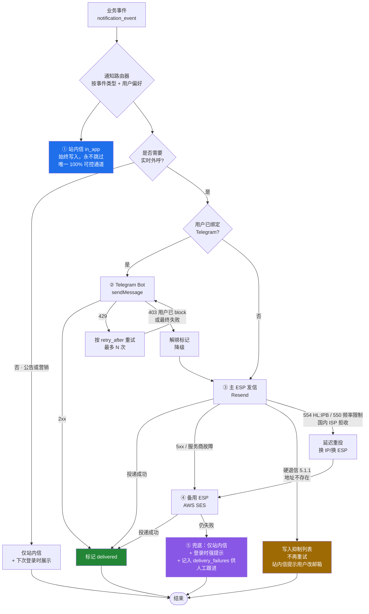

# babel.plus 后台体系调研：Admin Console / 工单 / 通知 / 文档站 / 可观测性

> 状态：调研稿 · 日期：2026-08-16
> 范围：API 与 Web 分离部署（GCP Cloud Run），团队规模 1–3 人，终端用户主要位于中国大陆。
> 约定：正文用简体中文，技术标识符、产品名、配置项一律保留英文原文。
>
> **可信度标记**
> - 未标记 = 已通过下方「参考来源」中的一手文档核实。
> - **待核实** = 未能找到权威来源，属于推断或社区共识，落地前需确认。
> - **需实测** = 与中国大陆网络可达性相关的判断。除非有可信测量来源，一律按此标记；
>   墙的行为随时间、地区、运营商、协议而变化，任何"某站在中国能不能访问"的结论
>   都必须以自己在多地实测为准，不能照抄本文档。

---

## 0. 结论速览

| 领域 | 选型 | 一句话理由 |
| --- | --- | --- |
| Admin Console | **Refine（shadcn preset）+ GCP IAP** | MIT、headless、原生对接 plain REST；认证交给 IAP 零代码；静态产物部署成本≈0 |
| 工单系统 | **自建工单模块（主）+ Telegram Bot forum topics（副）** | 可达性与主站同域名同预案；Telegram 在中国大陆约 98% 异常率，不能当唯一入口 |
| 邮件 / 通知 | **站内信（基线）+ Resend（主）+ AWS SES（备）+ Telegram（增强）** | 站内信是唯一 100% 可控通道；国内邮箱强制 SPF/DKIM/DMARC；微信与国内短信结构性关闭 |
| 文档站 | **Astro Starlight + Pagefind，Cloudflare Pages + 自有域名** | 搜索静态化不依赖 Algolia，可达性与页面一致；自有域名可随时切换边缘 |
| 可观测性 | **Uptime Kuma + Cloud Monitoring 告警 → Telegram** | 一个容器 + 免费内置指标即可覆盖 1–3 人团队 |

完整推荐与取舍见文末「## 推荐方案」。**文末另附「立即需要实测或补齐的事项」清单。**

---

## 1. Admin Console

### 1.1 我们的约束

1. 后端是独立的 **Go 或 TypeScript API**，对外只暴露 plain REST/JSON。
2. API 与 Web **分开部署**在 Cloud Run，两者只通过 HTTP 通信。
3. 团队 1–3 人，没有专职前端，也养不起 Kubernetes。
4. Admin 需要的业务对象是明确的 CRUD 形态：`users`、`subscriptions`、`plans`、`orders`、
   `nodes`、`traffic_records`、`tickets`、`announcements`、`audit_logs`。

约束 1 会直接淘汰一大批方案：**AdminJS、Filament、Django Admin、go-admin 全部要求 admin 层
直接持有 ORM / 数据库访问权**，它们读的是你的 model，不是你的 API。

### 1.2 横向对比

| 方案 | 构建速度 | 定制上限 | 直接对接 plain REST | 认证集成 | 自托管成本 | License |
| --- | --- | --- | --- | --- | --- | --- |
| **Refine** | 快 | **很高**（headless + swizzle） | **原生支持** | `authProvider`，任意 JWT | 静态产物 ≈ $0 | MIT |
| **React-Admin** | **最快（代码派）** | 高（绑定 Material UI） | 支持，需 adapter | `authProvider` + `canAccess` | 静态产物 ≈ $0 | MIT 核心；EE 145–590 €/月 |
| **AdminJS** | 快 | 中 | **不支持，需 ORM** | 自建 | 进程内 | MIT，**约 13 个月无提交** |
| **Retool** | **整体最快** | **最低** | 支持 | SSO 需高价位档 | **K8s + Postgres** | 商业，按席位 |
| **Appsmith** | 很快 | 中低 | 支持 | SSO 需 Business+ | **VM，最低 2vCPU/8GB** | Apache-2.0 (CE) |
| **Filament** | 快（前提是 Laravel 栈） | 高 | **不支持，绑定 Eloquent** | Laravel auth | 低 | MIT |
| **Django Admin** | 快（前提是 Django 栈） | 中低 | **不支持，绑定 Django ORM** | Django auth | 低 | BSD-3 |
| **自建 shadcn/ui + TanStack Table** | **最慢** | **无上限** | 支持 | 全手写 | 静态产物 ≈ $0 | MIT |
| **go-admin** | 中 | 中 | **不支持，绑定 GORM** | 内置 JWT/RBAC | 低 | MIT |

### 1.3 逐项说明

**Refine** — MIT，headless 架构把业务逻辑与 UI/路由解耦。`@refinedev/simple-rest` 直接映射
常规 REST 语义：`GET /resource`（列表）、`GET /resource/:id`、`POST /resource`、
`PATCH /resource/:id`、`DELETE /resource/:id`，可通过 `meta` 逐请求覆写 method 与 header。
关键逃生舱是 **`swizzle` 命令**：把 data provider 源码弹出到你自己的仓库里改写映射，
因此**不会出现「API 形状对不上就卡死」的情况**。UI 层官方支持 shadcn/ui、Ant Design、
Material UI、Chakra UI、Mantine；shadcn 是官方集成而非社区产物，通过 shadcn registry 分发，
组件落到你的源码树而不是 `node_modules`，脚手架命令为
`npm create refine-app@latest my-app -- --preset vite-shadcn`。
认证通过 `authProvider` 抽象：必需 `login`/`check`/`logout`/`onError`，可选 `getIdentity`/
`getPermissions`/`register`/`forgotPassword`/`updatePassword`，框架对 token 形态不做假设。

> 命名陷阱：`refine.dev/pricing` 上的价格**不是框架授权费**，那是 Refine AI（refine.new）
> 这个 AI 应用生成器的 credit 计费。**框架本体是 MIT，免费。**
> 另有 Refine Enterprise Edition（私有 npm registry `registry.refine.dev`，含 Okta Auth
> Provider、Devtools、Multitenancy、ACL/RBAC/ABAC、audit logging），**官方未公开任何价格，
> 只能联系销售** —— 价格 **待核实**，我们不需要它。

**React-Admin** — MIT 核心，维护最活跃。`ra-data-simple-rest` 要求一种特定方言：

```
GET /posts?sort=["title","ASC"]&range=[0,24]&filter={"author_id":12}
响应必须带 header:  Content-Range: posts 0-24/319
```

跨域时还需 `Access-Control-Expose-Headers: Content-Range`，`update` 用 **PUT**（Refine 用 PATCH），
所有记录必须有 `id` 字段。官方文档自己承认 API 千差万别、现成 provider 往往不适用，
不匹配就要手写 9 个方法的 `dataProvider`（`getList`/`getOne`/`getMany`/`getManyReference`/
`create`/`update`/`updateMany`/`delete`/`deleteMany`），预算约半天。
Enterprise Edition 价格**是公开的**：Team 145 €/月（年付，≤2 名开发）、Business 290 €/月（≤10 名）、
Corporate 从 590 €/月起（不限人数）。条款相当厚道：最短 1 个月、随时取消，**已经发布到生产的
代码在取消后继续可用**，只是失去私有 registry 访问与支持。

**AdminJS** — 淘汰。它以 core + framework plugin（Express/NestJS/Fastify/Koa/Hapi）+ ORM adapter
三件套的形式**挂载在你现有的 Node.js 进程里**，adapter 全是 ORM/ODM 绑定
（TypeORM、Sequelize、Mongoose、Prisma、MikroORM、Objection，外加仅支持 PostgreSQL 的裸 SQL adapter），
**没有任何 REST datasource adapter**。若 API 用 Go 则结构上不可能；若用 TypeScript 则必须把
admin UI 塞进 API 进程、直接交出数据库凭据，从而绕过自己的业务逻辑与校验层。
叠加维护状况：最新版本 v7.8.17 发布于 2025-07-15，最后一次提交也停在同一天，
截至 2026-08-16 已约 13 个月零提交，Snyk 将其维护状态标为 Inactive。

**Retool / Appsmith** — 低代码路线，起步最快但定制上限最低，且应用无法像普通代码那样版本化。
Retool 云端按席位计费（Team $10/builder/月年付 + $5/内部用户；Business $50 + $15），
3 个开发者走 Business 档在算终端用户之前就已约 $150/月，席位增长是典型成本陷阱。
自托管方面来源互相矛盾：定价页展示了自托管 Free/Team/Business 档，
但 `retool.com/self-hosted` 只说 Enterprise 客户才能自部署 —— **待核实，签约前须向销售确认**。
自托管基础设施要求也不友好：**生产环境只支持 Kubernetes + Helm，Docker 明确不适合生产**，
另需 PostgreSQL 13+，意味着要上 GKE 而不是 Cloud Run。
Appsmith 的 Community Edition 是 **Apache-2.0、自托管完全免费且无席位上限**，故事比 Retool 好得多，
代价是最低 **2 vCPU / 8 GB RAM**，这个内存下限本身就排除了 Cloud Run，需要一台常驻 GCE VM。

**Filament / Django Admin / go-admin** — 同一类否决理由。Filament 的 Resource 是
「为 **Eloquent model** 构建 CRUD 界面的静态类」，表格、筛选、分页、表单最终都编译成 Eloquent 查询；
Django Admin 的 `ModelAdmin` 注册在 Django ORM model 上，changelist 建立在 `QuerySet` 之上，
权限依附 Django auth model；go-admin 是 Gin + **GORM** 直连数据库的脚手架，
用它等于在它的结构里重建后端。三者要接我们的 REST API，都得额外引入一整个语言运行时和第二套部署，
对 1–3 人团队不成立。

**自建 shadcn/ui + TanStack Table** — 免费拿到的是：shadcn/ui（MIT，CLI 把组件源码复制进你的仓库，
不是依赖，你完全拥有并可修改，但只提供无障碍 UI 原语，不含数据获取/CRUD/认证/路由）、
TanStack Table（MIT，完全 headless，内置排序、列筛选与全局筛选、faceting、分组、聚合、分页、
行展开、单元格跨列、行/单元格选择、列固定/排序/显隐/调宽）、TanStack Query（服务端状态缓存与重验证）。
必须自己写的是：① 每个 resource 的 CRUD 骨架（最大成本，且每加一个 resource 就重复一次）、
② 表单校验与服务端错误映射、③ 对接你 API 查询参数方言的筛选/排序/分页 UI、
④ 认证（登录、token 存储、401 刷新、路由守卫）、⑤ RBAC、⑥ audit log、
⑦ 批量操作 / CSV 导出 / 关联选择器 / 文件上传 / i18n / 通知 / 暗色模式。
①–④ 大约需要一名熟练 React 开发 2–4 周才能追平 Refine/React-Admin 开箱即得的水平。
值得注意的是 **Refine + shadcn 底层本来就是 TanStack Query + shadcn**，等于白送 CRUD 层，
所以「纯自建」只有在 admin 本质上不是 CRUD 形态时才划算。

**Go 生态没有等价物。** 不存在能对接 REST API 的 Django Admin 式 Go 方案，这是意料之中的：
Go 缺少让 Django Admin / Filament / AdminJS 得以成立的 ORM 运行时反射能力。
Ent 的 `entoas`/`ogent` 只生成 OpenAPI spec 与类型化 REST handler，**没有 admin UI**；
PocketBase 的 dashboard 管的是它自己内嵌的 SQLite collection，不是通用 admin。
**Go 后端的 admin console 注定是一个说 REST 的 JavaScript 应用** —— 这正是 Refine 与 React-Admin。

### 1.4 认证：把登录交给 GCP IAP

因为 API 与 Web 分开部署在 Cloud Run，admin console 的认证可以完全不写代码：
**Identity-Aware Proxy (IAP) for Cloud Run**，部署时加 `--iap` 标志并授予 IAP service agent
invoker 权限即可。IAP 挡在应用前面完成认证，向后端传递一个带已认证身份的签名 JWT，
访问控制通过 IAM 角色分配。若同时启用 IAP 与 Cloud Run IAM，两道检查都会执行，IAP 先行。

取舍：
- 优点：零登录页、零 session 管理、零 OAuth 流程；运维人员增减就是改 IAM binding。
- 缺点：员工需要 Google 身份，而 `google.com` 在中国大陆自 2014 年起被完全封锁
  （见 §2.4 来源），**在中国大陆办公的运维人员必须自备翻墙才能进 admin —— 对我们这个业务
  倒不构成障碍，但要写进 runbook**。
- 建议：admin console 走 IAP；面向终端用户的 Web 应用**不要**用 IAP，走自建 JWT。

### 1.5 建议

**选 Refine + shadcn preset。** 理由：MIT 且无需付费档、原生对接 plain REST、
swizzle 保证 API 形状再怪也不会卡死、shadcn 让 UI 完全可拥有、
静态产物放 Cloud Run 或 GCS+CDN 成本几乎为零。

**若更看重发版节奏则选 React-Admin**（它 2026 年的提交/发版频率明显高于 Refine），
代价是绑定 Material UI，且要么让 API 迁就 `Content-Range` 方言、要么手写 dataProvider。
两者都是 MIT，先做一个 `users` 列表页的原型再定，成本很低。

---

## 2. 工单 / 客服系统

### 2.1 先说中国大陆可达性，这决定了架构

调研中最有价值的部分是 **OONI 实测数据**（开放观测网络，探针位于中国大陆境内）。
先做基线校验以确认探针确实在墙内：`probe_cc=CN`，2025-01-01 → 2026-08-16，
`www.google.com` 异常 2,184 / 正常 72，`www.facebook.com` 异常 18,798 / 正常 779。基线可信。

| 目标 | OONI 实测（probe_cc=CN） | 判定 | 置信度 |
| --- | --- | --- | --- |
| Telegram（`test_name=telegram`，2026 年） | anomaly **12,215** / ok 253 / confirmed 0 | **被封锁**（约 98% 异常率） | 强 |
| `t.me`（web_connectivity，2026 年） | anomaly 528 / failure 33 / ok 24 | 被封锁 | 强 |
| `api.telegram.org`（2026 年） | anomaly 48 / ok 0 | 被封锁（但样本仅 48，偏小） | 中–强 |
| `discord.com`（2025→2026） | anomaly 5,688 / confirmed 16 / failure 401 / ok 158 | **被封锁**（约 91% 异常率） | 强 |
| `client.crisp.chat`（2024→2026） | **仅 2 条测量，均 ok** | **数据不足，无法判定** | 极弱，**需实测** |
| `widget.intercom.io` | **零条测量** | 无数据 | **需实测** |
| `static.zdassets.com`（Zendesk） | **零条测量** | 无数据 | **需实测** |
| `fonts.googleapis.com`（2025→2026） | ok 86 / anomaly 10 / confirmed 0 | 大体可达（与厂商博客说法相反） | 中，样本偏小 |

三点必须讲清楚：

1. **`confirmed_count: 0` 不代表没被封。** GFW 主要通过 RST 重置与 DNS 污染实施封锁，
   不返回封锁页面，OONI 因此把它归类为 anomaly 而非 confirmed。异常率才是信号。
2. **「西方客服 widget 在中国被墙」这个流行说法，目前找不到测量证据支撑，也找不到反证。**
   Crisp / Intercom / Zendesk 的 CDN 域名在 OONI 上几乎没有测量数据。
   本文不把它当作事实，标记为 **需实测**。
3. 顺带修正一个常见错误：多家厂商博客（AppInChina、Chinafy 等）断言 Google Fonts 在中国被封，
   但 OONI 数据显示 `fonts.googleapis.com` 约 90% 可达，与同批探针上 `www.google.com` 约 97%
   异常形成鲜明对比。样本小、且"可达"不等于"快"，但不应把博客说法当事实复述。

**推论：对 babel.plus 而言，Telegram 作为唯一主客服通道是危险的。**
它是本次调研中封锁证据最硬的一项。我们的用户确实具备翻墙能力，但那意味着
**把客服的可用性建立在产品本身可用的前提上 —— 而用户最需要客服的时刻，恰恰是产品用不了的时刻。**
这是一个自我引用的失效模式，必须在架构上打破。

同时还要意识到一个不对称：**本服务自己的主域名大概率也会被封**（这类服务是重点目标，**需实测**且
需要预案）。所以「站内工单」的可达性同样不是无条件的，必须配合备用域名策略。

### 2.2 候选方案对比

| 方案 | License | 自托管footprint | Widget 由谁的域名分发 | Telegram | 邮件 | Cloud Run 适配 |
| --- | --- | --- | --- | --- | --- | --- |
| **自建工单模块** | 自有 | 复用现有 Postgres | **自有域名** | 自接 Bot API | 自接 ESP | **完美**（无状态） |
| **Chatwoot** | MIT + `enterprise/` 目录单独授权 | Postgres + Redis + **常驻 Sidekiq worker** + 对象存储 | **自有域名** | 原生支持 | 原生支持 | **差**（需常驻 worker） |
| **Zammad** | AGPLv3 | **最低 2 核 6 GB RAM**（Elasticsearch 同机再 +4 GB） | 不适用 | — | 支持 | 差 |
| **FreeScout** | AGPL-3.0 | PHP/Laravel + MySQL，轻量 | 不适用（邮件优先） | 通过模块 | **核心能力** | 中（需常驻 + MySQL） |
| **Crisp** | 商业 SaaS | 无 | **`client.crisp.chat`，不可迁移** | — | 支持 | 不适用 |
| **Telegram Bot** | 自有 | 无 | 不适用 | **就是它本身** | — | **完美**（webhook） |

**Chatwoot** — 授权是 **双授权，不是纯 MIT**：`LICENSE` 是 MIT Expat，但明确把 `enterprise/`
目录排除出去、单独适用 `enterprise/LICENSE`；README 只写 "Released under the MIT License"，
两句话都对，但 README 是不完整的那句。该变更于 2021-12-09 随 2.0 发布公告，
官方承诺"不会把已在 CE 发布的功能移到 EE"，当时划入 EE 的是：自定义 dashboard、SLA 管理、
坐席排班/容量、IP 黑名单。**CE 是否有坐席数量上限 —— 找不到权威说法，待核实。**
自托管需要：web server + **Sidekiq worker** + PostgreSQL + Redis + SMTP + 对象存储（S3/GCS/Azure）；
官方文档**未公布最低 RAM/CPU 数值**，别引用坊间数字（待核实）。

Chatwoot 对我们最关键的优点是：**自托管时 widget 从你自己的域名加载，不经过 Chatwoot 的 CDN。**
嵌入代码里的 `BASE_URL` 就是你的安装地址，SDK 路径为 `/packs/js/sdk.js`（旧版）或 `/app/js/sdk.js`。
这意味着「唯一必须可达的主机名」握在自己手里。
它还提供公开的 Client API 创建会话：
`POST /public/api/v1/inboxes/{inbox_identifier}/contacts/{contact_identifier}/conversations`
（`security: []`，不需要坐席 token，inbox/contact identifier 本身即凭据），
以及一个通用 **API channel**，允许自建传输层、仍用 Chatwoot 当坐席收件箱。
缺点很实在：**常驻 Sidekiq worker 与 Cloud Run 的 scale-to-zero 模型冲突**，
要么开 min-instance，要么单独跑一台小 VM。

**Zammad** — AGPLv3。官方硬件要求最低 **2 核 6 GB RAM**（Elasticsearch 同机再 +4 GB）；
40 坐席以内的参考配置是 6 核 6 GB（+6 GB 给 Elasticsearch）。对 1–3 人团队过重。
Elasticsearch 是**可选而非必需**（官方原话是"强烈推荐"），但文档未说明不装会退化到什么程度。
API 支持 token（推荐）、HTTP basic（官方明确不建议）与 OAuth2。

**FreeScout** — AGPL-3.0，PHP/Laravel + MySQL，定位是**邮件优先的共享收件箱**（开源版 Help Scout）。
免费核心 + 付费模块，模块是**一次性买断的单实例终身授权（含终身更新）、不支持退款**，不是订阅制。
**本文不引用任何单模块价格**：官方模块索引页不展示价格，需逐个打开商品页；
第三方聚合站流传的 $2–$15 区间属未经核实的转述。服务器版本矩阵亦 **待核实**。

**Crisp** — 按 workspace 计费而非按坐席：Free（2 坐席，会话不限）、Mini $45/月（4 坐席）、
Essentials $95/月（10 坐席）、Plus $295/月（20+ 坐席）；Free 与 Mini 加坐席 $10/月。
Widget CDN 已从 Crisp 官方 KB 逐字确认为 **`https://client.crisp.chat/l.js`**，
另有 `go.crisp.chat/chat/embed/` 与 `storage.crisp.chat`。**不提供自托管，
这个主机名你无法迁移** —— 无论它当前是否被封，这都是面向中国用户的结构性风险。**直接否决。**

**Telegram Bot** — 关键能力是 **forum topics**（Bot API 6.3，2022-11-05 引入）：
`createForumTopic`、`editForumTopic`，`Message` 上新增 `is_topic_message` 与 `message_thread_id`，
`ChatAdministratorRights` 上新增 `can_manage_topics`。Bot 需要是管理员并持有 `can_manage_topics`，
超级群需开启 topics。这直接给出「一个用户一个 topic」的共享收件箱模式，**服务端零 UI 开发**，
对 1–3 人团队极其划算。
部署上 **webhook 优于 long polling**：`setWebhook` 仅支持 **443 / 80 / 88 / 8443** 端口，
支持 `secret_token`（1–256 字符，`A-Za-z0-9_-`），Telegram 会在回调 header 中回显以供校验；
Cloud Run 天然在 443 上提供有效证书，**完美契合**。`getUpdates` 长轮询需要常驻进程，
与 scale-to-zero 相悖，不要用。
**待核实**：官方 Bot API 参考页未列出每秒消息数限制（常被引用的 ~30/s、群组 20/分钟 出自 Bot FAQ）；
另有搜索结果声称"bot 在私聊中无需管理员权限即可创建 topic"，未能在官方参考中证实，**不要照此设计**。
Go 侧库选型 **待核实**：`go-telegram-bot-api/telegram-bot-api`、`go-telegram/bot`、`gotgbot`、`telebot`
均存在，但前者有陈旧的名声，选型前须自行确认最近提交/发版时间。
Node 侧 grammY、Telegraf 是常见选择。

**其它轻量自托管选项**（各一行）：
**Peppermint** — **仓库已于 2026-07-17 归档为只读，排除**。
**Trudesk** — Apache-2.0，Node 16+ / MongoDB 5+ / 可选 Elasticsearch 8，活跃度低，采用前须核实。
**osTicket** — GPL-2.0，PHP 8.2–8.4 + MySQL，经典邮件/电话/网页表单工单，UI 陈旧。
**UVdesk** — OSL-3.0（较少见的授权，务必通读），Symfony/PHP 8.1 + MySQL 5.7.23+。
**Frappe Helpdesk** — AGPL-3.0，Frappe（Python）+ Vue3，会拖入整套 bench 栈（MariaDB、Redis、
后台 worker），过重且不适合 Cloud Run。

### 2.3 建议：自建工单模块为主，Telegram 为副

推荐 **自建工单模块**，而不是引入 Chatwoot。理由不是"自建更好"，而是三条具体约束叠加的结果：

1. **可达性可控。** 工单页面就是我们自己的 Web 应用的一部分，与用户面板同域名、同 CDN、
   同备用域名策略。没有第三方主机名需要额外保障。
2. **Cloud Run 亲和。** 无状态 HTTP，复用现有 Postgres，scale-to-zero，运维成本≈0。
   Chatwoot 的 Sidekiq worker 会强迫我们多养一台常驻实例。
3. **数据本来就在我们这边。** 工单必须关联 `user_id`、订阅状态、最近节点、流量记录。
   自建时这是一个 JOIN；用 Chatwoot 时这是一套双向同步。工单量到不了需要专业工具的规模之前，
   这套同步的成本高于它节省的开发量。

**Telegram Bot 作为第二通道**（forum topics 模式），承担两件事：给用户发主动通知、
给运维发告警与工单提醒。**不要把它当唯一入口**（§2.1 的自我引用失效模式）。

**若日后工单量增长到需要专业坐席工具**，迁移路径是 Chatwoot 自托管 + API channel：
自建的收发逻辑保留，Chatwoot 只当坐席收件箱。这条路留着，现在不走。

### 2.4 工单数据模型（PostgreSQL 15+ DDL）

```sql
-- ============================================================
-- babel.plus 工单系统 schema
-- 目标: PostgreSQL 15+
-- 约定: 时间一律 timestamptz(UTC); 主键用 bigint identity;
--       对外暴露 public_id(短码) 而不是自增 id, 避免枚举
-- 前置依赖(本文件不定义, 假定已存在于主 schema):
--       users(id), admin_users(id), plans(id)
-- ============================================================

CREATE TYPE ticket_status AS ENUM (
  'open',          -- 用户新建, 待客服首次响应
  'pending',       -- 客服已回复, 等待用户补充信息
  'in_progress',   -- 客服正在处理
  'on_hold',       -- 挂起(等待上游/节点供应商等外部依赖)
  'resolved',      -- 已解决, 进入自动关闭倒计时
  'closed'         -- 终态
);

CREATE TYPE ticket_priority AS ENUM ('low', 'normal', 'high', 'urgent');

CREATE TYPE ticket_channel AS ENUM (
  'web',        -- 站内工单页(主通道)
  'email',      -- 邮件转工单
  'telegram',   -- Telegram Bot
  'admin'       -- 客服代客户创建
);

CREATE TYPE ticket_actor AS ENUM ('user', 'agent', 'system');

-- ---------- 分类 ----------
CREATE TABLE ticket_categories (
  id            bigint GENERATED ALWAYS AS IDENTITY PRIMARY KEY,
  slug          text NOT NULL UNIQUE,           -- 'subscription', 'node-down', 'billing', 'account'
  name_zh       text NOT NULL,
  name_en       text,
  -- 每个分类可覆盖默认 SLA; NULL 表示继承全局默认
  sla_first_response_minutes int,
  sla_resolution_minutes     int,
  default_priority           ticket_priority NOT NULL DEFAULT 'normal',
  sort_order    int  NOT NULL DEFAULT 0,
  is_active     boolean NOT NULL DEFAULT true,
  created_at    timestamptz NOT NULL DEFAULT now()
);

-- ---------- 工单主表 ----------
CREATE TABLE tickets (
  id             bigint GENERATED ALWAYS AS IDENTITY PRIMARY KEY,
  public_id      text NOT NULL UNIQUE,          -- 对外短码, 例如 'BP-7K2M9Q'
  user_id        bigint NOT NULL REFERENCES users(id) ON DELETE RESTRICT,
  category_id    bigint REFERENCES ticket_categories(id) ON DELETE SET NULL,

  subject        text NOT NULL,
  status         ticket_status   NOT NULL DEFAULT 'open',
  priority       ticket_priority NOT NULL DEFAULT 'normal',
  channel        ticket_channel  NOT NULL DEFAULT 'web',

  assignee_id    bigint REFERENCES admin_users(id) ON DELETE SET NULL,
  assigned_at    timestamptz,

  -- 诊断上下文: 建单瞬间快照, 避免事后订阅变更导致无法复现
  -- 存 JSONB 而非外键, 因为这是"当时的事实"而不是"当前的关联"
  context        jsonb NOT NULL DEFAULT '{}'::jsonb,
  -- 期望形如: {"subscription_id":123,"plan":"pro","client":"Clash Verge Rev 2.5.2",
  --            "os":"Windows 11","node_id":45,"last_seen_ip_country":"CN"}

  -- SLA 计算所需的时间戳
  first_response_at   timestamptz,   -- 首次由 agent 发出的公开回复时间
  first_response_due  timestamptz,   -- 建单时按 SLA 算出的截止时间
  resolution_due      timestamptz,
  resolved_at         timestamptz,
  closed_at           timestamptz,
  last_user_reply_at  timestamptz,
  last_agent_reply_at timestamptz,

  -- 满意度回访
  satisfaction_rating  smallint CHECK (satisfaction_rating BETWEEN 1 AND 5),
  satisfaction_comment text,

  -- 外部通道关联(Telegram forum topic / 邮件线程)
  telegram_chat_id          bigint,
  telegram_message_thread_id bigint,
  email_message_id          text,

  tags           text[] NOT NULL DEFAULT '{}',
  message_count  int    NOT NULL DEFAULT 0,     -- 冗余计数, 由触发器维护
  created_at     timestamptz NOT NULL DEFAULT now(),
  updated_at     timestamptz NOT NULL DEFAULT now(),

  CONSTRAINT tickets_resolved_consistency
    CHECK ((status IN ('resolved','closed')) = (resolved_at IS NOT NULL)),
  CONSTRAINT tickets_closed_consistency
    CHECK ((status = 'closed') = (closed_at IS NOT NULL))
);

-- 客服工作台的主查询: 按状态+优先级+SLA 排序
CREATE INDEX tickets_queue_idx
  ON tickets (status, priority DESC, first_response_due)
  WHERE status NOT IN ('resolved', 'closed');
CREATE INDEX tickets_user_idx     ON tickets (user_id, created_at DESC);
CREATE INDEX tickets_assignee_idx ON tickets (assignee_id, status)
  WHERE status NOT IN ('resolved', 'closed');
CREATE INDEX tickets_tags_idx     ON tickets USING gin (tags);
CREATE INDEX tickets_context_idx  ON tickets USING gin (context jsonb_path_ops);
-- Telegram topic 反查(收到 bot 消息时定位工单)
CREATE UNIQUE INDEX tickets_tg_thread_idx
  ON tickets (telegram_chat_id, telegram_message_thread_id)
  WHERE telegram_message_thread_id IS NOT NULL;

-- ---------- 工单消息 ----------
CREATE TABLE ticket_messages (
  id            bigint GENERATED ALWAYS AS IDENTITY PRIMARY KEY,
  ticket_id     bigint NOT NULL REFERENCES tickets(id) ON DELETE CASCADE,

  actor_type    ticket_actor NOT NULL,
  -- 二选一: user_id 或 admin_user_id; actor_type='system' 时两者皆空
  user_id       bigint REFERENCES users(id)       ON DELETE SET NULL,
  admin_user_id bigint REFERENCES admin_users(id) ON DELETE SET NULL,

  body          text NOT NULL,
  body_format   text NOT NULL DEFAULT 'markdown'  CHECK (body_format IN ('markdown','plain','html')),

  -- 内部备注对用户不可见; 这是最容易出安全事故的一列, 务必在 API 层加白名单
  is_internal   boolean NOT NULL DEFAULT false,

  channel       ticket_channel NOT NULL DEFAULT 'web',
  -- 用于去重: 同一条 Telegram/邮件消息重复投递时幂等
  external_id   text,

  created_at    timestamptz NOT NULL DEFAULT now(),
  edited_at     timestamptz,

  CONSTRAINT ticket_messages_actor_consistency CHECK (
    (actor_type = 'user'   AND user_id IS NOT NULL AND admin_user_id IS NULL) OR
    (actor_type = 'agent'  AND admin_user_id IS NOT NULL AND user_id IS NULL) OR
    (actor_type = 'system' AND user_id IS NULL AND admin_user_id IS NULL)
  ),
  -- 用户消息永远不能是内部备注
  CONSTRAINT ticket_messages_internal_only_agent
    CHECK (NOT (is_internal AND actor_type = 'user'))
);

CREATE INDEX ticket_messages_ticket_idx ON ticket_messages (ticket_id, created_at);
CREATE UNIQUE INDEX ticket_messages_external_idx
  ON ticket_messages (channel, external_id) WHERE external_id IS NOT NULL;

-- ---------- 附件 ----------
CREATE TABLE ticket_attachments (
  id            bigint GENERATED ALWAYS AS IDENTITY PRIMARY KEY,
  message_id    bigint NOT NULL REFERENCES ticket_messages(id) ON DELETE CASCADE,
  storage_key   text   NOT NULL,        -- GCS 对象键, 不存公开 URL
  filename      text   NOT NULL,
  content_type  text   NOT NULL,
  size_bytes    bigint NOT NULL CHECK (size_bytes > 0),
  created_at    timestamptz NOT NULL DEFAULT now()
);
CREATE INDEX ticket_attachments_message_idx ON ticket_attachments (message_id);

-- ---------- SLA 策略 ----------
-- 全局/按套餐的 SLA 定义; 分类上的覆盖优先级更高
CREATE TABLE sla_policies (
  id                         bigint GENERATED ALWAYS AS IDENTITY PRIMARY KEY,
  name                       text NOT NULL UNIQUE,
  -- NULL 表示适用于所有套餐; 否则仅适用于该套餐(付费用户 SLA 更短)
  plan_id                    bigint REFERENCES plans(id) ON DELETE CASCADE,
  priority                   ticket_priority NOT NULL,
  first_response_minutes     int NOT NULL CHECK (first_response_minutes > 0),
  resolution_minutes         int NOT NULL CHECK (resolution_minutes > 0),
  -- 是否只在工作时间内计时(24/7 支持则为 false)
  business_hours_only        boolean NOT NULL DEFAULT false,
  timezone                   text NOT NULL DEFAULT 'Asia/Shanghai',
  is_active                  boolean NOT NULL DEFAULT true,
  created_at                 timestamptz NOT NULL DEFAULT now(),
  UNIQUE (plan_id, priority)
);

-- SLA 违约记录; 单独建表以便统计, 而不是在 tickets 上加布尔列
CREATE TABLE ticket_sla_breaches (
  id           bigint GENERATED ALWAYS AS IDENTITY PRIMARY KEY,
  ticket_id    bigint NOT NULL REFERENCES tickets(id) ON DELETE CASCADE,
  breach_type  text   NOT NULL CHECK (breach_type IN ('first_response','resolution')),
  due_at       timestamptz NOT NULL,
  breached_at  timestamptz NOT NULL DEFAULT now(),
  UNIQUE (ticket_id, breach_type)
);

-- ---------- 状态流转审计 ----------
CREATE TABLE ticket_events (
  id            bigint GENERATED ALWAYS AS IDENTITY PRIMARY KEY,
  ticket_id     bigint NOT NULL REFERENCES tickets(id) ON DELETE CASCADE,
  actor_type    ticket_actor NOT NULL,
  admin_user_id bigint REFERENCES admin_users(id) ON DELETE SET NULL,
  event_type    text NOT NULL,   -- 'status_changed','assigned','priority_changed','tagged','merged'
  from_value    text,
  to_value      text,
  metadata      jsonb NOT NULL DEFAULT '{}'::jsonb,
  created_at    timestamptz NOT NULL DEFAULT now()
);
CREATE INDEX ticket_events_ticket_idx ON ticket_events (ticket_id, created_at);

-- ---------- 客服快捷回复(高频问题模板) ----------
CREATE TABLE canned_responses (
  id          bigint GENERATED ALWAYS AS IDENTITY PRIMARY KEY,
  slug        text NOT NULL UNIQUE,
  title       text NOT NULL,
  body        text NOT NULL,          -- 支持 {{user_name}} {{subscription_url}} 等占位符
  locale      text NOT NULL DEFAULT 'zh-CN',
  category_id bigint REFERENCES ticket_categories(id) ON DELETE SET NULL,
  usage_count int  NOT NULL DEFAULT 0,
  created_at  timestamptz NOT NULL DEFAULT now()
);
```

设计要点说明：

- **`public_id` 与自增 `id` 分离。** 对外只暴露短码，避免通过递增 ID 枚举工单总量与他人工单。
- **`context` 用 JSONB 存快照而非外键。** 工单记录的是"报障当时的事实"；
  用户事后续费或换节点不应改变工单的诊断上下文。
- **`is_internal` 是最危险的一列。** 内部备注与用户可见回复同表，
  任何一次 API 层遗漏过滤都会直接泄露内部讨论。
  建议在 repository 层强制：面向用户的查询走一个固定带 `is_internal = false` 的视图或方法，
  不接受调用方传参决定。
- **`external_id` + 唯一索引实现幂等。** Telegram webhook 与邮件 webhook 都可能重复投递，
  靠数据库唯一约束去重比在应用层做可靠。
- **SLA 违约独立成表** 而不是在 `tickets` 上加布尔列，这样"违约了多少次、哪一类"可直接聚合，
  也不会因为工单后续被重开而丢失历史。
- **`business_hours_only` 与 `timezone` 默认 `Asia/Shanghai`**，因为用户在中国大陆，
  但 SLA 计时逻辑要写清楚：24/7 支持就把它设为 false，别留半吊子实现。

---

## 3. 通知与邮件可达性

这一节是整份调研里风险最高的部分。结论先行：**面向中国大陆用户，邮件是唯一可行的大众通道，
而微信系推送与国内短信对我们是结构性关闭 —— 不是"难"，是"关闭"。**

### 3.1 ESP 对比

| 服务商 | 免费额度 | 首个付费档 | 超量 /1000 封 | 独立 IP | 备注 |
| --- | --- | --- | --- | --- | --- |
| **Resend** | 3,000/月，**硬上限 100/天** | $20/月 → 50,000 | $0.90 | **$30/月**，仅 Scale 档，需 >3,000/天 | 支持自定义 Return-Path |
| **AWS SES** | **待核实** | 纯按量，无档位 | **$0.10** | **$24.95**/IP/月；托管型 $15/月 + $0.08/1000 | 有 sandbox 与信誉制度 |
| **Postmark** | 100/月，**不允许超量** | $15/月 → 10,000 | $1.80 / $1.30 / $1.20 | 起 **$50**/IP/月，仅 Pro+ | Message Streams 强制事务/群发分离 |
| **SendGrid** | **待核实** | **待核实** | **待核实** | **待核实** | 定价页处于 301 重定向环，且表格由 JS 渲染，抓不到 |
| **Mailgun** | **100/天** | $15/月 → 10,000 | 起 $1.80 | Foundation($35/月, 5万封)含 1 个；额外 **$59**/IP/月 | |
| **Brevo** | **300/天**（需人工审核开通） | $9/月 → 5,000 起 | 待核实 | 仅 Enterprise，价格待核实 | |
| **MailerSend** | 500/月，1 个域名 | $5.60/月 → 5,000 | $1.50 / $0.90 | 仅 Enterprise，>10万/周 | |
| **阿里云邮件推送（国际站）** | 累计 2,000 封，200/天 | 按量 **$0.29**/1000 | $0.29 | **$128**/月（杭州、**新加坡、法兰克福、弗吉尼亚同价**） | **必须先完成阿里云实名认证** |
| **阿里云邮件推送（中国站）** | 共 2000 封（一次性），200/天；默认配额 2,000/天 | 按量 **¥2**/1000 | ¥2 | 待核实 | 同上 |
| **腾讯云 SES** | **1,000 封，不限有效期** | 按量 **¥0.0019/封**（¥1.90/1000） | ¥1.90 | **¥900**/IP/月，每月最多 3 个 | **发信专用域名不强制备案** |

两个抓不到的缺口，如实标注：
- **AWS SES 免费额度 待核实。** `aws.amazon.com/ses/pricing` 在本环境下五次尝试均连接失败；
  Price List API 中没有免费额度条目。坊间常引的"每月 3,000 次消息计费、持续 12 个月"
  只见于第三方博客，**不要当作已确认**。
- **SendGrid 定价整体 待核实。** `twilio.com/en-us/sendgrid/pricing` 301 到 `sendgrid.com/pricing/`，
  后者又 301 回去 —— 一个闭环；直接取 `sendgrid.com/pricing/` 返回约 611 KB HTML，
  其中没有任何档位名、`$` 金额或 JSON-LD offers，表格完全由客户端渲染。用浏览器人工核对。

**顺带纠正一个过时认知：Postmark 已不再禁止群发邮件。** 官方支持文档原文：
"Yes. Message Streams makes it possible to send all application email, including bulk messages,
through Postmark."，且 "transactional and broadcast messages do not mix in Postmark,
including IP ranges."。**可执行的规则是路由分离，不是内容品类禁令。**

**AWS SES sandbox 与信誉制度**（对我们是实质风险）：
新账号一律置于 sandbox，且 **sandbox 状态按 AWS Region 独立** —— 在 us-east-1 出笼不等于在
ap-southeast-1 出笼。沙箱限制：只能发给已验证的地址/域名或 mailbox simulator、
**每 24 小时最多 200 封、每秒最多 1 封**。
申请转生产需提交 **网站 URL**、联系邮箱与用途（Marketing / Transactional），24 小时内首次回复。
信誉阈值（官方原文）：**退信率 ≥ 5% 进入审查，≥ 10% 可能暂停发信**（目标 < 2%）；
**投诉率 ≥ 0.1% 进入审查，≥ 0.5% 可能暂停**（目标 < 0.1%）。
退信率"仅计入发往未验证域名的硬退信"，软退信与**被封 IP 导致的退信不计入** ——
这一点对我们有利，网易的 `554 HL:IPB` 本身不会推高退信率。
人工调查触发条件里有一条 **"Your content is otherwise associated with a use case that SES doesn't
support"** —— 自由裁量、未定义，**这是我们真正的风险敞口**。

### 3.2 国内邮箱投递：一手证据

这部分不是推测，是从 QQ 与网易自己的文档里抄下来的。

**QQ 邮箱** 有正式的《群发邮件指南》，明确要求：

| 要求 | 原文 |
| --- | --- |
| 反向解析 | 发信IP增加PTR反解记录 |
| SPF | 域名有正确的SPF记录 |
| DKIM | 建议对所有外发邮件采用DKIM签名 |
| 头部一致 | 邮件的Sender地址和信头From地址保持一致 |
| RBL | 所有的IP、Sender、Domain都必须不在知名的RBL组织列表上 |
| **第三方代发** | 使用第三方平台代发邮件或者使用云主机代发邮件时，**必须保证可以通过SPF或DKIM记录验证到你的发信域名** |
| 退订 | 每封邮件里面应包括退订或者更改接收策略的URL链接…Email方式退订需要在信头添加"List-Unsubscribe"字段 |
| 广告标注 | 带有推广营销类性质的商业性邮件必须在主题前加注 **(AD)** 字样 |
| 通道分离 | 事务性邮件与商业性邮件须使用独立 IP 与独立 Sender 地址 |

QQ 的拒信码证明**按 IP / 域名 / 发件人 / 连接的频率限制都是一等机制**：
`550 Ip frequency limited`、`550 Domain frequency limited`、`550 Sender frequency limited`、
`550 Connection frequency limited`、`550 SPF check failed`、`550 Suspected spam ip` 等。
**注意：QQ 的 postmaster 门户在 QQ 邮箱登录墙之后**（`open.mail.qq.com` 会 302 到登录页），
**登录之后是否要求中国企业主体资质 —— 未能核实，而这恰恰是本节最关键的未知项。**

一个**官方记载、成本极低且真实有效的缓解手段**：QQ 用户可以自行把我们的发信域名加白名单
（邮箱设置 → 反垃圾 → 白名单，填裸域名如 `babel.plus` 即可），
官方原文"该域名下各个邮箱发来的信件都将不受反垃圾规则的影响"、
"**白名单优先级高于黑名单与反垃圾规则**"。**把这一步写进注册引导流程。**

**网易 163 / 126 / yeah.net** 公布了完整退信码表，是整份调研里最硬的证据：

| 退信码 | 原文 | 说明 |
| --- | --- | --- |
| **554 HL:IPB** | 该IP不在网易允许的发送地址列表里 | **网易运行显式 IP 白名单，未知 IP 的默认状态是"不被允许"** |
| **554 MI:SPB** | 此用户不在网易允许的发信用户列表里 | 发件人级白名单 |
| 421 HL:IFC | 该IP短期内发送了大量信件，超过了网易的限制 | 频率限制 |
| 421 HL:ICC | 该IP同时并发连接数过大 | 并发限制 |
| **554 DT:SUM** | 信封发件人和信头发件人不匹配 | **强制 envelope/header 一致** |
| **550 MI:SPF** | 发信IP未被发送域的SPF许可 | **SPF 主动强制** |
| **550 MI:DMA** | 该邮件未被发信域的DMARC许可 | **DMARC 主动强制** |
| 554 5.5.3 / 554 MI:STC | Domain / sender exceed the sent limit | 按域名、按发件人的日累计上限 |

**境外 ESP 的 IP 段是否被特殊对待？** 诚实回答：
**找不到任何一手证据表明中国 ISP 按 IP 地理位置歧视**；
但**有确凿一手证据表明它们按 IP 白名单成员资格与按 IP 频率进行区别对待** ——
而境外 ESP 的共享 IP 池恰恰是那种一开始就不在白名单里、且与无关发件人共享信誉的 IP。
**两种机制的实际后果相同。**
坊间流传的具体数字（如"境外 IP 每天 2 万–4 万封上限"、"每 IP 一个连接"、
"QQ 白名单只对有中国营业执照的公司开放"）来自**无任何引用来源的博客文章，属未经核实的逸事**，
不要据此做容量规划。较可信的二手来源（Validity）称新发件人应从每天 500 封 / 每小时 150 封起步，
QQ 按 60 天 IP 信誉决定日限额，且信誉是**实体级而非域名级** —— 同样标记 **待核实**。

**sina.com 与 sohu.com 完全找不到任何 postmaster 或发件人文档。这两家只能盲发。**

**ICP 备案不影响邮件投递。** 三个独立一手来源一致：
阿里云 ICP FAQ（"当域名解析指向中国内地的服务器并开通Web服务时，需进行ICP备案"、
"若解析指向境外服务器（如中国香港），则无需ICP备案"）、
网易企业邮（未备案仅影响自定义网页登录页，收发信正常）、
腾讯云 SES（仅发信用途的域名不强制备案，只有 A 记录指向内地服务器时才需要）。
QQ 与网易的发件人文档中均未提及 ICP 备案。**不要让这件事影响架构决策。**

### 3.3 SPF / DKIM / DMARC 配置

**SPF（RFC 7208 §4.6.4）** —— `include`、`a`、`mx`、`ptr`、`exists` 机制与 `redirect` 修饰符会触发 DNS 查询，
**实现"MUST limit the total number of those terms to 10"**，超限必须返回 `permerror`；
`all`、`ip4`、`ip6` 不触发查询、不计入。另有 void lookup SHOULD 限制为 2。
记录应控制在 512 字节内，450 字节以下更安全。

**M3AAWG 推荐 `~all` 而非 `-all`**（Email Authentication Recommended Best Practices, 2020-09）：
理由是让 **DMARC 而不是 SPF 承担强制决策** —— 在 `p=reject` 下 `~all` 同样会导致拒收。
不发信的域名则应发布 `v=spf1 -all`。
**SPF flattening 没有任何 RFC 或 M3AAWG 文档背书**：它会在 ESP 轮换 IP 时静默失效。
RFC 认可的替代方案是**自定义 MAIL FROM 子域，其 SPF 记录只含一个 `include:`**，
DMARC 对齐则主要依靠 DKIM。

**DKIM（RFC 8301，2018-01，Standards Track，Updates RFC 6376）** —— 原文：
"**Signers MUST use RSA keys of at least 1024 bits for all keys. Signers SHOULD use RSA keys of at
least 2048 bits.**"；且 "rsa-sha1 MUST NOT be used"。
**255 字符分片陷阱**：2048 位公钥 base64 约 392 字符，必须在**一条** TXT 记录里拆成多个带引号的字符串，
RFC 6376 §3.6.2.2 要求 "concatenated together before use with **no intervening whitespace**"。
**在分片之间插入空格或静默截断到 255 字符的 DNS 面板，是 2048 位 DKIM 失效的头号原因。**
M3AAWG 建议 **DKIM 密钥至少每 6 个月轮换一次**，且 "**The reuse of selector names is strongly
discouraged**"；`t=y` 仅供测试，多家邮件商见到它就会忽略签名。
**Selector CNAME 委派**是 M3AAWG 明确记载的一等模式（DKIM Key Rotation BCP §3.1.3）：
域名持有者建 key1/key2/key3 三条 CNAME 指向第三方，第三方可在使用一把密钥的同时轮换其余两把，
**私钥永不跨组织边界**。代价是你看不到也控制不了密钥长度与轮换节奏 ——
缓解办法是验证已发布的密钥位数，并把 CNAME 严格限制在 `_domainkey` 标签下，绝不委派整个子域。

**DMARC —— 注意：RFC 7489 已于 2026-05 作废。**
现行标准是 **RFC 9989（DMARC，Proposed Standard，2026-05，Obsoletes RFC 7489 与 RFC 9091）**，
配套 RFC 9990（聚合报告）与 RFC 9991（失败报告）。RFC 7489 是 2015 年的 Informational 独立提交，
**不要再当作现行标准引用**。

**`pct=` 已在 DMARCbis 中移除**（RFC 9989 附录 A.6 "Removal of the 'pct' Tag"），
改为 **`t=` 标签**（`y`/`n`，语义类比原 `pct=0`/`pct=100`）：
`p=quarantine; t=y` 实际施加 `none`，`p=reject; t=y` 实际施加 `quarantine`。
`pct`、`rf`、`ri` 现已在 IANA 注册表中标记为 historic；现行标签为
`adkim, aspf, fo, np, p, psd, rua, ruf, sp, t`。
**但 `pct=` 在实践中仍被广泛遵守，而接收方对 `t=` 的支持是全新的 —— 现网支持度 待核实。**

推荐的策略推进路径与记录示例：

```dns
; 阶段一：只监控
_dmarc.babel.plus.  IN TXT "v=DMARC1; p=none; rua=mailto:dmarc-agg@babel.plus; fo=1"

; 阶段二：灰度
_dmarc.babel.plus.  IN TXT "v=DMARC1; p=quarantine; t=y; sp=quarantine; rua=mailto:dmarc-agg@babel.plus"

; 阶段三：强制
_dmarc.babel.plus.  IN TXT "v=DMARC1; p=reject; sp=reject; np=reject; adkim=s; aspf=s; rua=mailto:dmarc-agg@babel.plus; fo=1"
```

**`np=reject` 值得立刻上**：它只管**不存在的子域**，即使 `p=none` 期间也零成本，
却能直接掐死从臆造子域发起的伪造。
另注意：**没有 `rua` 就没有报告**（"If the tag is not provided, Mail Receivers MUST NOT generate
aggregate feedback reports for the domain"）。

**自定义 MAIL FROM / Return-Path —— 为什么必须做。**
RFC 9989 §4.4.2 原文："**DMARC relies solely on SPF validation of the MAIL FROM identity.**"
也就是说，ESP 自家退信域名（`bounces.esp-vendor.com`）上的 SPF pass
**对 From 为 `@babel.plus` 的邮件在 DMARC 上毫无价值**。
AWS SES 文档说得同样直白："If you want to use this SPF record as a way to comply with DMARC,
**the domain in the From address must match the MAIL FROM domain.**"
SES 的自定义 MAIL FROM 需要**恰好一条 MX 加一条 SPF TXT**
（"you must publish exactly one MX record… If the MAIL FROM domain has multiple MX records,
the custom MAIL FROM setup with Amazon SES will fail."），MX 检测最长 72 小时。
**"Behavior on MX failure" 这个开关是关键**：选 "Use default MAIL FROM domain" 会回退到
`amazonses.com` —— SPF 仍然通过，但 **DMARC-via-SPF 静默失效**；选 "Reject message" 则快速失败。

严格说，只要 DKIM 用 `d=babel.plus` 签名，不配自定义 MAIL FROM 也能过 DMARC。
自定义 MAIL FROM 买到的是：① SPF 对齐作为第二条独立通路，在某些破坏 DKIM 的中转下仍存活；
② 退信落到自己域名；③ 一个永远不会撞上 10 次查询上限的、只含一个 `include` 的 SPF 记录。
**鉴于网易对 envelope/header 不一致直接回 `554 DT:SUM`，我们这个场景下两条通路都对齐是值得的。**

**Gmail / Yahoo / Microsoft 基线**（作为参照，也因为我们必然有部分海外用户）：
- **Google**，两档均自 **2024-02-01** 生效。所有发件人：SPF **或** DKIM、有效正反向 DNS(PTR)、
  传输用 TLS、RFC 5322 格式、垃圾率低于 0.3%。
  **每天向 Gmail 发送超过 5,000 封**者：SPF **且** DKIM、
  "Set up DMARC… **Your DMARC enforcement policy can be set to none**"、
  From 头域名须与 SPF 或 DKIM 域名对齐、营销/订阅类邮件须支持一键退订。
  垃圾率口径澄清：**0.10% 是目标，0.30% 是硬上限**。
- **Yahoo**：自 2024-02 起逐步执行；批量发件人须 SPF 且 DKIM、
  "**Publish a valid DMARC policy with at least p=none - DMARC must pass**"、
  一键退订（List-Unsubscribe 政策自 2024-06 开始执行）、**2 天内处理退订**。
  Yahoo FAQ 明确："**一键退订仅对推广/营销类邮件必需，不适用于事务性邮件**（如订单确认、密码重置）"。
  **Yahoo 从未在自家页面上给出数字阈值 —— "Yahoo 5,000/天" 的说法未经一手来源证实。**
- **Microsoft / Outlook**（2025-04-02 公告）：日发信量超 5,000 的域名，
  **SPF 必须 Pass、DKIM 必须 Pass、DMARC 至少 p=none 且与 SPF 或 DKIM 对齐**。
  自 2025-05-05 起不合规邮件进垃圾箱，未来（日期待定）将直接拒收。
  **实质差异：微软要求 SPF 与 DKIM 双双 Pass**，而 Google/Yahoo 只要求两者都配置、其一对齐即可。

**BIMI** —— 要求 DMARC 处于强制状态（`p=quarantine; sp=quarantine` 或 `p=reject; sp=reject`，
"'None' policies or 'pct' less than 100 percent are not accepted"），logo 须为 SVG Tiny PS，
VMC/CMC 证书标为"强烈推荐但可选"（实践中 Gmail 要求）。
**对以中国邮箱为主的受众，BIMI 近乎无价值** —— QQ 与网易都未公布任何 BIMI 支持。**不做。**

### 3.4 Telegram Bot 作为通知通道

**限流（官方 FAQ 原文）：**

| 限制 | 数值 | 状态 |
| --- | --- | --- |
| 单个会话 | 约 1 条/秒，允许短时突发 | **官方** |
| 群组内 | 20 条/分钟 | **官方** |
| 批量广播总体 | 约 30 条/秒 | **官方** |
| 付费广播上限 | 1,000 条/秒 | **官方**（需 Bot 余额 ≥ 10 万 Stars 且月活 ≥ 10 万） |

**常被引用但非官方**：把 30/秒说成"全局 API 请求上限"（官方把它限定在批量广播语境）；
`sendMessage` 与 `sendPhoto` 的分方法限额；突发桶的具体大小。

**用户必须先 /start —— 已确认。** 官方原文：
"**Bots can't start conversations with users. A user must either add them to a group or send them a
message first.**"
设计后果：**无法按手机号或用户名通知**，只能通知一个因用户已经 start 过而获得的 `chat_id`。
**所有绑定流程必须由用户发起。**

**Deep link 绑定：** `https://t.me/your_bot?start=PAYLOAD`，
"A-Z, a-z, 0-9, _ and - are allowed… **The parameter can be up to 64 characters long.**"
（恰好是 base64url 去掉 padding 的字符集）。用户点 Start 后 bot 收到 `/start <payload>`。

标准绑定流程：已登录用户点"绑定 Telegram" → 后端签发**一次性、短 TTL、高熵**令牌
（32 字节随机 base64url = 43 字符，远在 64 以内），关联 `{user_id, expires_at, consumed:false}`
→ 渲染链接 → 用户点 Start → webhook 收到 `/start <token>` 以及 `message.from.id` / `message.chat.id`
→ 后端原子消费令牌（对 `consumed` 做 CAS）并绑定 `chat_id` ↔ `user_id`。

> **安全提醒：这个 payload 是躺在 URL 里的 bearer 凭据。** 它出现在链接里、
> 用户自己的 Telegram 聊天记录里（明文）、浏览器历史里、以及任何被转发的地方。
> 必须：一次性、TTL 以分钟计、**不可解码**（纯随机查找键，绝不是编码过的 `user_id`）、
> 首次绑定即失效、按账号限流、签发时要求新鲜会话。
> **它证明的是"谁持有这个链接"，不是"这个 Telegram 用户就是那个网站用户"。**

**更好的选择：Telegram Login 现已是 OpenID Connect。**
授权端点 `https://oauth.telegram.org/auth`，token 端点 `…/token`，JWKS `…/.well-known/jwks.json`；
Client ID/Secret 来自 BotFather，`response_type=code`，推荐 PKCE (S256)。
scope 含 `openid`、`profile`、`phone`，以及关键的
**`telegram:bot_access` —— "Allows your bot to send direct messages to the user after login."**
用户信息直接在 **ID token** 中返回，没有单独的 UserInfo 端点。
**这比 deep-link 令牌强得多**：拿到的是由后端发起（state + PKCE）、密码学绑定的已验证 Telegram 用户 ID，
且 DM 权限作为授权的一部分同时取得，URL 里不再有散落的 bearer 令牌。

**背压处理：** 429 + `retry_after`（Bot API `ResponseParameters` 类型：
"In case of exceeding flood control, the number of seconds left to wait before the request can be
repeated"）。**严格遵守 `retry_after`，不要自己发明指数退避**；
同时维护「每 `chat_id` 1/秒」与「全局约 25–30/秒」两个令牌桶。
另需处理 `migrate_to_chat_id`（群升级为超级群时要改写已存 ID）。
不付费时官方建议把批量通知**摊到 8–12 小时**发送。

### 3.5 微信公众号 模板消息 / 订阅通知：为什么用不了

**账号类型与注册资格**（微信官方注册页原文）：
公众号（原订阅号）"具有信息发布与传播的能力"，**"个人及媒体注册"**；
服务号"具有用户管理与提供业务服务的能力"，**"企业及组织注册"**。
**模板消息与订阅通知都要求认证服务号。**

**纠正一个流行的误解：公众号的模板消息并没有下线。**
- 2021-01-27 官方公告《服务号订阅通知灰度测试》：灰度期 2021-01-27 → 2021-04-30，
  资格限于**"已认证的境内主体服务号"**，灰度期间**服务号模板消息可正常使用**。
- 2021-04-29《服务号订阅通知灰度测试延期公告》：应商户要求延期，**未给新的截止日期**。
- 今天：模板消息文档仍挂着横幅「说明：服务号订阅通知功能开启灰度测试，模板消息能力可正常使用」。
- **真正下线的是小程序的模板消息**（2019-10-12 公告，2020-01-10 接口下线，由订阅消息替代）。

**订阅通知能给什么：** 一次性订阅 = 用户订阅一次、可发一条对应通知（无时限）；
长期订阅 = 可重复下发，但**"长期订阅通知仅向政务民生、医疗等公共服务领域开放"**。
且有**封闭的服务类目门槛**（物流、教育、医疗、金融、交通、生活服务等，多数需对应行业资质）。

**认证费用**（腾讯客服页原文）：
"微信公众号/服务号申请微信认证，需一次性支付 **300元/次** 审核服务费用"；
"认证成功后…将会被保留**一年**"；"若认证审核失败，审核费用不予退还"。

**为什么我们几乎必然注册不了 —— 四道独立门槛，任一即致命：**

1. **主体门槛（单这一条就结束讨论）。** 服务号仅限企业及组织注册；微信认证需已核实的企业主体
   与 300 元审核；而订阅通知资格明文写的是**"已认证的境内主体服务号"** —— **境内主体**。
   一个 1–3 人的境外团队没有营业执照、没有对公账户、没有境内主体。
2. **服务类目门槛。** 订阅通知只对固定行业类目开放，每类需匹配资质。"跨境代理/VPN"不映射到任何一类，
   也没有任何中国监管机构为其发放资质。
3. **平台规则 —— 会被封号。** 2021-01-27 公告本身要求开发者不得推送
   "与用户预期不符或**违反国家法律法规**的内容"；
   《模板消息运营规范》列明处罚阶梯：**"营销内容过滤、阶梯性限制模板新增/跳转/下发、甚至封禁账号"**。
4. **底层业务在中国大陆不合法**，这正是触发第 3 条"违反国家法律法规"的原因。
   **《关于清理规范互联网网络接入服务市场的通知》工信部信管函〔2017〕32号（2017-01-17）** 原文：
   > "**未经电信主管部门批准，不得自行建立或租用专线（含虚拟专用网络VPN）等其他信道开展跨境经营活动。**"

   工信部的政策解读把执法对象界定为"未经电信主管部门批准，无国际通信业务经营资质的企业或个人，
   租用国际专线或VPN，私自开展跨境的电信业务经营活动"，
   而跨国公司向持牌运营商租用专线供内部办公使用不在禁止之列。
   **面向消费者的跨境中继服务正落在被禁止的一侧。**

> **待核实（两处）**：《微信公众平台运营规范》未能定位到可抓取的官方 URL；
> 《计算机信息网络国际联网管理暂行规定》(国务院令第195号) 第六条的 gov.cn 链接 404，
> 内容属常见引用但**公开引用前须重新核实**。

**企业微信（WeCom）也帮不上忙。** 它的客户联系功能确实能让员工把个人微信用户加为外部联系人并群发，
但：① **不是面向匿名用户的推送通道** —— 每个用户必须主动扫某个**具体员工**的「联系我」二维码或通过好友申请；
② **硬性频率上限**："每位客户/每个客户群每月最多可接收条数为当月天数"，即约每客户每天一条，
用户还能进一步收紧到每周 7 条或每天 1 条；
③ **同样的主体与认证墙**：认证审核费 300元/次、有效期一年、需年审同价，
另有企业成员规模费 2,700元/次（1,000–10,000 人）与 29,700元/次（>10,000 人），审核失败不退；
④ **在同一个腾讯平台上承担同样的合法性风险**。
**结论：企业微信是面向逐个获客的 1:1 客服/CRM 通道，不是面向匿名消费者的事务通知通道。**

### 3.6 国内短信：结构性关闭

三道串行审批：账号实名认证 → 签名（发送方署名）注册并经运营商实名制报备 → 逐条模板审核。
主体门槛在内容被审之前就已决定结果。
阿里云侧，企业认证用户签名数量不受限，而**个人认证用户根本无法通过自用签名的实名制报备**，
只能走"他用"签名（需委托授权书）或升级企业认证；签名须是真实企事业单位名或注册商标、2–12 字、
必须含中文，"客服通知"这类中性名称会被拒；阿里云自审约 2 小时，
但**运营商实名制报备需 5–7 个工作日，当前 7–10 天且不保证通过**。
腾讯云更严：签名须"真实、清晰并能唯一标识所属企业/组织/机构"且 **"不支持中性化签名"**，
**个人用户的自用签名已于 2025-09-18 起按运营商要求全面停止**。
决定性的一条，腾讯云前置条件页原文：**"国内短信仅支持中国大陆公司授权申请签名"**。
模板还要按类目审核：验证码模板**"不可夹带链接"**，通知模板不得含营销内容或推广链接。

境外绕道（Twilio）同样不通：中国**不支持字母数字 Sender ID**，不支持国内长号码，
国际长号码仅尽力而为，发送方显示为 "Overwritten"，
官方原文 "**Twilio can deliver SMS to China on a best-effort basis, without guaranteed delivery**"，
不支持双向短信；内容上"Chinese networks have very strict regulations"，
**明确禁止 URL**、政治/非法/色情及金融类内容。

**结论：短信是死路。** 拿不到境内签名（腾讯要求中国大陆公司，阿里对非企业认证封死自用签名）；
"他用"签名需要一家真实的中国公司签委托授权书替我们承担合规责任，
没有正规代理会为一个中继服务这么做。境外绕道则剥掉发送方身份、**直接禁 URL**（正好废掉发短信的主要目的）、
且不作任何投递保证。

### 3.7 推荐的通知架构与降级链路

设计原则：**每一条通知都必须至少有一条我们完全可控的送达路径。**
唯一 100% 可控的是**站内信** —— 它就在我们自己的应用里，用户能登录就能看到。
其余通道都是"尽力而为"的增强。



**通道分工：**

| 通道 | 角色 | 适用事件 | 可控性 |
| --- | --- | --- | --- |
| **站内信** | **基线，永不跳过** | 全部 | **100%** |
| **邮件（Resend 主 / SES 备）** | 主要外呼通道 | 注册验证、密码重置、到期提醒、支付回执 | 中（受国内 ISP 制约） |
| **Telegram Bot** | 已绑定用户的实时通道 | 节点故障、流量告警、工单回复 | 高（但仅覆盖已绑定且能连上的用户） |
| **订阅内下发** | 隐蔽但有效的兜底 | 备用域名、紧急公告 | **高** |

最后一条值得展开：**订阅 URL 本身就是一条通知通道。**
客户端会按周期（如 sing-box 默认 60 分钟）自动拉取订阅。我们可以在订阅响应里
夹带一个名字即公告的"伪节点"（例如 `⚠️ 主站已迁移至 babel2.plus`），
或利用 `Subscription-Userinfo` 的到期字段。**这是唯一在用户邮箱收不到、Telegram 连不上、
主站被封时仍然能触达的通道** —— 因为它走的正是产品自己的链路。
**待核实：** 各客户端对节点名称长度与特殊字符的渲染差异，需实测。

**落地清单（按优先级）：**
1. 先把认证做对：SPF（`~all`，单 include 的自定义 MAIL FROM 子域）+ DKIM 2048 位（CNAME 委派）
   + DMARC `p=none; np=reject; rua=…`，收两周报告再推进到 quarantine。
2. 主 ESP 选 **Resend**（开发体验好、自定义 Return-Path 支持完善），
   备用 **AWS SES**（单价低 10–18 倍，作为主 ESP 故障与配额溢出时的第二条腿）。
   **注意 SES 需提前申请出 sandbox 且按 Region 独立，别等到故障当天才发现备用通道不可用。**
3. 事务性与营销性邮件**严格分流到不同 IP / 不同 Sender**（QQ 明文要求）。
4. 注册流程里引导 QQ 用户把 `babel.plus` 加入邮箱白名单（官方支持、优先级高于反垃圾规则）。
5. 站内信从第一天就做，不要当作"以后再补"。
6. Telegram 绑定优先走 **OIDC + `telegram:bot_access`**，而不是 deep-link 令牌。

> **必须在动手前补齐的调研缺口：**
> **没有读过任何一家 ESP 的 Acceptable Use Policy。** 各家对 proxy/VPN 类业务的措辞完全未核实。
> 签约前请直接阅读 `aws.amazon.com/aup`、Resend 与 Brevo 的 AUP ——
> AWS 那句自由裁量的 "a use case that SES doesn't support" 是最关键且未定义的条款。
> 另：**QQ postmaster 门户登录后是否要求中国企业主体，是本节最具决策价值的未知项。**

---

## 4. 用户文档 / 教程站

### 4.1 决定性约束：搜索必须完全静态化

面向中国大陆读者的文档站，最容易被忽略的失效点不是页面本身，而是**搜索**。
如果页面托管在 A、搜索索引托管在 B，那就有两个可达性问题而不是一个。

**Algolia DocSearch 的中国可达性：证据不足，需实测。**
GreatFire 的分析器**从未测试过** `algolia.net` 与 `algolianet.com`（两者均返回 "This URL has not
been tested yet."）；也找不到 Algolia 关于中国大陆 POP 或中国方案的任何声明。
结论是「未经证实」，而举证责任在 Algolia 一侧：既然 Algolia 没有任何有文档记载的境内基础设施，
**至少每一次按键都要跨越 GFW 打到境外 POP，即使不被封，延迟体验也会很差。**
V2EX / Reddit / HN 上关于此事的说法一律是逸事，不能当依据。

**因此：优先选择索引作为静态文件与页面一起分发的方案，让搜索的可达性等同于页面的可达性。**
这一条直接决定了下面的选型。

### 4.2 文档站生成器对比

| 方案 | License | 内置搜索 | 中文分词 | i18n | 静态导出 | 长期风险 |
| --- | --- | --- | --- | --- | --- | --- |
| **Starlight (Astro)** | MIT | **Pagefind，零配置默认开启** | **是**（Pagefind zh） | 内置 32+ 语言 UI 串，含简繁中文 | 是 | 低 |
| **Docusaurus v3** | MIT | Algolia 一等公民；本地搜索需插件 | 需 `@easyops-cn/docusaurus-search-local`（明确支持 zh） | 一等公民，支持 hreflang | 是 | 低 |
| **VitePress** | MIT | **内置 MiniSearch 本地搜索** | **未文档化，需自行实现 tokenize（待核实）** | 支持，但无根路径自动跳转 | 是 | 低 |
| **Nextra v4** | MIT | **Pagefind**（v4 已用 Pagefind 替换 FlexSearch） | 是（Pagefind zh） | 支持，但**自动语言跳转依赖 middleware，与 `output: 'export'` 不兼容** | 部分 | 中（v4 仅 App Router） |
| **MkDocs Material** | MIT | 内置 lunr.js + lunr-languages | **内置 jieba 分词，本组最强** | `mkdocs-static-i18n` | 是 | **高，见下** |
| **Mintlify** | 商业 SaaS | 内置 | 未知 | 支持 | 否（SaaS） | **高，边缘不可控** |

**Starlight** — MIT，由 Astro 核心团队维护。**默认零配置内置 Pagefind**，
用 frontmatter `pagefind: false` 或 `data-pagefind-ignore` 排除页面；也可通过官方
`@astrojs/starlight-docsearch` 换成 Algolia。i18n 在 `astro.config.mjs` 里配 `defaultLocale` +
`locales`，内容按语言分目录，`root` 键让默认语言免前缀；**内置 32+ 语言的 UI 字符串翻译，
含简体与繁体中文**；且在某页尚未翻译时会自动回退到默认语言并内嵌一条"此语言暂无该内容"提示 ——
这对"中文先行、英文滞后"的我们非常实用。

**Docusaurus v3** — MIT，生态最大，版本化能力最强（`docusaurus docs:version X.Y.Z`）。
但官方文档自己提醒："多数情况下你并不需要版本化，它只会增加构建时间"，并建议版本数控制在 10 个以内 ——
**我们不需要文档版本化**，客户端教程跟着客户端版本走即可。
i18n 是一等公民：Markdown/MDX 整篇翻译、JSON（导航栏/页脚等 UI 串）、插件数据文件三类可译资产，
`docusaurus write-translations` 生成骨架，支持单域名子路径 / 多域名 / 混合部署并输出 `hreflang`。
搜索方面 Algolia 是一等公民且已接入 `preset-classic` —— **这正是我们要避开的**，
应改用 `@easyops-cn/docusaurus-search-local`（社区资源页明确标注 "language of zh supported"）。

**VitePress** — MIT，Vue 3 + Vite。**内置本地搜索已确认**，基于 **MiniSearch**、浏览器内索引、无需服务端，
`themeConfig.search.provider = 'local'` 即开。
**但官方文档没有记载中文分词**；它暴露了 `miniSearch.options.tokenize`，
所以 CJK 分词是**自行定制**（例如接 `Intl.Segmenter`）而非开箱能力。
"VitePress 本地搜索对中文效果良好"这个说法 **待核实，必须实测**。
i18n 为根 locale + 子路径 locale，**不提供根路径自动跳转**，需要在托管层做 `_redirects`。
主题定制上限很高：CSS 变量覆盖 → 约 34 个具名布局插槽 → `enhanceApp` 注册全局 Vue 组件 → 完全自定义主题。

**Nextra v4** — MIT。**纠正一个常见误解：v4 已用 Rust/WASM 的 Pagefind 取代了 FlexSearch**，
搜索默认开启，需要一个 `postbuild` 脚本对构建产物跑 Pagefind。
静态导出只能算"部分支持"：基础 i18n 可静态导出，**但自动语言检测/跳转用的是 `nextra/locales`
的 middleware，官方明确说明它"对使用 `output: 'export'` 静态导出的 i18n 站点不生效"**。
v4 仅支持 App Router。

**MkDocs Material** — 有一个**重大状态变化**必须写清楚：据官方博客，自 **v9.7.0（2025-11-11）** 起，
所有原先 sponsor 专属的 Insiders 功能已并入免费的 MIT 版本，GitHub Sponsors 停止、现有赞助取消。
**但同时它进入维护模式**：至少 12 个月的缺陷与安全修复，**不再有新功能**，团队转向新的 SSG **Zensical**。
其中文能力其实是本组最强的：核心 search 插件**内置 jieba 分词**（Python 侧，非 Insiders 专属，
自 9.2.0 起标记为实验性），配置项 `jieba_dict` 与 `jieba_dict_user`：

```yaml
plugins:
  - search:
      lang: zh
      jieba_dict: dict.txt
      jieba_dict_user: user_dict.txt
```

i18n 走 `mkdocs-static-i18n`（MIT，支持 `page.zh.md` 后缀式与目录式，并可本地化图片资源），
**但该仓库自述插件目前处于 "frozen" 状态**（因对上游 MkDocs 维护状况的顾虑）。
Material 维护模式 + i18n 插件冻结 = 整个 MkDocs 栈在缓慢冻结。**对一个要维护数年的站点不建议。**

**Mintlify** — Starter $0/月（5 个编辑席位、自定义域名、Web 编辑器、认证、MCP server、API playground）；
**Pro 的具体价格在页面上由 JS 渲染，抓取不到 —— 待核实**；Enterprise 自定义价格。
功能表中列出 "Self-hosting: Available"，**但未说明适用档位，待核实**（推测为 Enterprise 门槛）。
**决定性问题：它不披露 CDN/托管提供商。** 对中国大陆读者而言，
**你既无法查看也无法控制边缘节点，更无法为别人的 CDN 做 ICP 备案。** 否决。

### 4.3 搜索方案

**Pagefind — 中文支持已确认。** MIT，纯静态，无托管基础设施。
中文（`zh`）、日文（`ja`）、韩文（`ko`）被列为 "specialized languages"，
非空格分隔文字的分词已实现（官方例子：`每個月都` 被索引为 `每個` / `月` / `都`）；
语言从 `<html lang>` 属性自动检测，**按语言各建一份索引**，运行时只加载对应的那份。
局限：specialized languages **不做词干还原**，因此不会跨词形匹配。
**打包细节很关键：CJK 支持只存在于 `pagefind_extended` 二进制中，标准版没有。**
`npx pagefind` 始终下载 extended 版本，所以走 npx 是安全的；
**但如果在 CI 里固定/缓存了标准版二进制，中文搜索会静默失效** —— 这是个很难排查的坑，写进 CI 注释。

其它候选：
- **Typesense** — DocSearch 兼容性已确认：`typesense-docsearch-scraper` 存在且明确自称是
  "Algolia 归档原项目后持续维护的 fork"，前端用 `typesense-docsearch.js`，
  Docusaurus 接 `docusaurus-theme-search-typesense`；scraper 无状态，可作为 CI 里的 Docker 容器跑。
  代价是要运行一个搜索服务端。
- **Meilisearch** — Community Edition 为 MIT（另有商业/BSL 1.1 的 Enterprise Edition），Rust 编写；
  其分词器 **Charabia 用 jieba 处理中文**。同样是**一个常驻服务进程**，对 1–3 人团队是净负担。
- **Orama** — Apache-2.0，全文 + 向量 + 混合检索，可跑在浏览器/服务端/边缘，声称 <2kb，
  支持含中文在内 30 种语言的分词与词干。**其中文指南页面只渲染出导航，
  具体 tokenizer 包名与配置片段未能提取 —— 待核实。**

**结论：用 Pagefind。** 它把索引变成和 HTML 一起分发的静态文件，中文分词已确认，零基础设施，
且 Starlight 默认就带、Nextra v4 也已采用。

### 4.4 托管与中国大陆可达性

**证据质量警告：** 下表来自 GreatFire 分析器（真实测量项目），
**但这些具体域名在 90 天窗口内的有效测试样本极小 —— 只有 1 到 2 次。**
这些是方向性信号，不是统计意义上的结论。**每一条都 需实测。**

| 目标 | GreatFire 判定 | 样本 |
| --- | --- | --- |
| `vercel.app` | **Blocked** —「最近 2 次有效测试 100% 失败」 | 2 次，最后测试 2026-07-30 |
| `github.io` | **Sometimes** — 最近 1 次有效测试 100% 显示干扰；140 个 github.io URL 被封 vs 3 个可访问 | 1 次，最后测试 2026-07-30 |
| `netlify.app` | **Sometimes** — 最近 2 次有效测试 50% 受扰；HTTPS 未见封锁而 HTTP 有 | 2 次，约 17 天前 |
| `pages.dev`（Cloudflare Pages） | **Not blocked** — 1 次测试 0 次受扰；110 个子域名 URL 中 9 个被封、87 个可访问 | 1 次，约 17 天前 |

**GitHub Pages 的历史记录**（Wikipedia "Censorship of GitHub"）：
2013-01-21 至 01-23 通过 DNS 劫持封锁 github.com（因微博舆论而解封）；
2013-01-26 伪造 SSL 证书的 MITM 攻击；**2020-03-26 至 03-27 MITM 再现，影响 GitHub Pages 与 github.com**；
2015-03-26 "大炮"对 GreatFire 仓库发起 DDoS（Citizen Lab 归因）。
文章指出 GitHub 目前**不处于全面封锁**，但访问"可能缓慢或不稳定"，
部分子域（如 `raw.githubusercontent.com`）受运营商限制。
**净结论：github.io 是"不稳定但非一律封锁"，不能作为面向中国用户的文档站唯一路径。**

**Cloudflare China Network** — 与 **JD Cloud** 合作运营境内节点。三条硬约束：
1. **仅限 Enterprise 套餐**的独立订阅。
2. **必须为每个要接入的 apex 域名持有有效的 ICP 备案或许可证。**
3. 境内面向互联网的服务**强制要求 IPv6**（Cloudflare 会自动开启）。

并且 **Cloudflare Pages 不在 China Network 可用产品清单中**
（可用的是 Workers、Workers KV、R2、Assets 与纯静态 CDN 缓存；无 Cache Reserve、无 Tiered Cache；
Turnstile 在中国大陆明确不可用）。

**ICP 备案** —— MIIT 同时签发两类：面向售卖商品/服务站点的**经营性 ICP 许可证**（`京ICP证123456号`），
与面向"纯信息性、不涉及直接销售的非经营性网站"的 **ICP 备案**（`京ICP备04123456号`）；
移动应用 ICP 备案自 **2023-09-01** 起亦为必需。
"在中国境内运营也是取得许可的前提条件"，境外公司通常需与中国公司合作。
不合规的后果是："若在宽限期内未取得许可，中国境内的 ISP 必须封锁该站点。"

**对 babel.plus 的现实结论：ICP 备案基本不可能取得**（这类业务在境内不具备合法经营基础），
因此 **Cloudflare China Network 这条"官方支持路径"对我们关闭**。
`pages.dev` 目前看起来可达，但那**不是** China Network，
而是全球网络从境外打进来 —— 无加速、无保障、随时可能变化。

可行的做法只有：**境外托管 + 尽一切可能压小传输体积**，
让一条又慢又丢包的跨境链路仍能渲染出可用页面。具体到工程约束：
- 静态站、无 SSR、无运行时数据获取；
- 搜索索引静态化（Pagefind），不打第三方 API；
- 字体不外链（Google Fonts 虽据 OONI 测量约 90% 可达，但仍是一次不必要的跨境请求，
  且样本仅 96 条；直接自托管 woff2 子集）；
- 图片走 WebP/AVIF 并严格压缩，教程截图是这类站点的体积大头；
- **自有域名 + 多套 CNAME 预案**，随时可把文档站从 Cloudflare 切到其它边缘而不改链接；
- **准备备用域名**，并在客户端订阅里下发（用户在主域名被封时仍能拿到文档地址）。

HK/SG/JP 源站到中国大陆的实际延迟 **找不到可信测量数据，需实测**。

### 4.5 建议

**Starlight (Astro) + Pagefind，托管在 Cloudflare Pages 的自有域名上。**
理由：MIT、Astro 核心团队维护、Pagefind 零配置默认开启且中文分词已确认、
内置简繁中文 UI 串与未翻译回退提示、纯静态产物体积可控。
`pages.dev` 是四个候选托管中唯一被 GreatFire 判为 Not blocked 的（**样本仅 1 次，需实测**），
且用自有域名意味着随时可切边缘。

**次选 Docusaurus v3 + `@easyops-cn/docusaurus-search-local`**，
如果日后需要更大的插件生态或版本化。**不要用它默认的 Algolia 接线。**

**明确排除：** Mintlify（边缘不可控）、Vercel（GreatFire 判定 Blocked）、
github.io 作为唯一源、MkDocs Material（维护模式 + i18n 插件冻结，不适合多年期押注）。

### 4.6 教程页面清单

文档站的信息架构按「平台 → 客户端」组织，因为用户来的时候只知道自己用什么设备。
每个客户端页面都遵循同一套骨架，便于批量维护与翻译：

> **统一骨架**：① 下载与安装（含校验方式）→ ② 导入订阅（一键 URL scheme + 手动粘贴两条路径）
> → ③ 选择节点与测速 → ④ 开启系统代理 / TUN 模式 → ⑤ 验证是否生效
> → ⑥ 该客户端特有的坑 → ⑦ 卸载/重置

**关于订阅链接的通用说明页**（所有客户端页面都链接到它）：
- 订阅 URL 的构成、如何重置（泄露后必须能一键换）、**绝对不要分享给他人**；
- 各客户端支持的订阅格式：Clash YAML / sing-box JSON / base64 分享链接；
- **流量与到期信息的展示**依赖响应头 `Subscription-Userinfo`，
  格式为 `upload=X; download=Y; total=Z; expire=E`（字节 / Unix 秒），
  `total=0` 表示不限量，各字段均可选。
  **注意：这是事实上的社区约定而非正式规范（待核实，无 RFC 级文档），
  不同客户端解析行为存在差异**，我们的服务端必须同时兼容宽松解析。
- 一键导入 URL scheme（各客户端不同），例如 sing-box 的
  `sing-box://import-remote-profile?url=urlEncodedURL#urlEncodedName`；
  sing-box 还要求 GUI 客户端实现**自动更新（默认间隔 60 分钟）与 HTTP Basic 授权**。

| # | 页面 | 客户端 | 关键内容 |
| --- | --- | --- | --- |
| **Windows** | | | |
| W1 | Windows 快速开始 | — | 选客户端决策树；杀软误报说明 |
| W2 | v2rayN 使用教程 | v2rayN（GPL-3.0，支持 Xray / sing-box 等多内核） | 下载与解压路径、导入订阅、系统代理模式（PAC/全局/直连）、路由规则 |
| W3 | Clash Verge Rev 使用教程 | Clash Verge Rev（GPL-3.0，Tauri，内置 mihomo 内核，Windows x64/x86） | 订阅导入、**TUN 模式与所需的服务安装/管理员权限**、订阅自动更新周期 |
| **macOS** | | | |
| M1 | macOS 快速开始 | — | Apple Silicon / Intel 区分；Gatekeeper「已损坏」提示的处理 |
| M2 | Clash Verge Rev（macOS） | Clash Verge Rev（macOS 11+，Intel / Apple Silicon） | 同 W3，另加 macOS 上安装系统服务以启用 TUN |
| M3 | sing-box（macOS） | sing-box / SFM | 配置文件与 Remote Profile、`sing-box://import-remote-profile` 导入 |
| **iOS / iPadOS** | | | |
| I1 | iOS 快速开始 | — | **需要非中国大陆区 Apple ID**（美区/港区/日区），如何注册与切换；付费应用的购买方式 |
| I2 | Shadowrocket 使用教程 | Shadowrocket（付费，**价格以 App Store 为准，待核实**） | 订阅导入、配置文件、按需连接、常用规则 |
| I3 | Stash 使用教程 | Stash（付费，Clash 规则生态） | 订阅导入、分流策略组、SSID 策略 |
| I4 | Karing 使用教程 | Karing（免费，sing-box 系，iOS/macOS/Windows/Android） | 订阅导入、协议兼容性、作为免费替代方案的取舍 |
| **Android** | | | |
| A1 | Android 快速开始 | — | 侧载 APK 的风险提示与签名校验；国产 ROM 的后台省电限制 |
| A2 | v2rayNG 使用教程 | v2rayNG（Xray core / v2fly core） | 订阅导入、路由设置、分应用代理 |
| A3 | NekoBox for Android | NekoBoxForAndroid（sing-box） | 订阅导入、协议支持、配置调优 |
| A4 | Clash Meta for Android | ClashMetaForAndroid（GPL-3.0，Clash.Meta 内核） | 订阅导入、覆写配置、分应用代理 |
| A5 | Hiddify 使用教程 | hiddify-app（Flutter，sing-box 内核，多平台，支持 sing-box / V2ray / Clash / Clash Meta 订阅格式并自动更新） | 订阅导入、多平台一致体验 |
| **Linux / 路由器** | | | |
| L1 | Linux 桌面 | Clash Verge Rev（x64/arm64）或 sing-box CLI | 包管理器安装、systemd 服务、CLI 配置 |
| L2 | OpenWrt / 软路由 | OpenClash（MIT，mihomo 内核）、homeproxy（ImmortalWrt，sing-box 驱动）、PassWall、ShellClash | 固件与架构选择、依赖安装、订阅导入、透明代理与 DNS 配置、**路由器性能与协议加密开销的关系** |
| L3 | 旁路由 / 网关模式 | — | 网关与 DNS 指向、与主路由 DHCP 的关系、回环问题 |
| **通用** | | | |
| G1 | 订阅链接说明 | — | 见上文通用说明页 |
| G2 | 协议选择说明 | — | VLESS/Reality、Hysteria2、TUIC、Trojan、Shadowsocks 的适用场景与取舍 |
| G3 | 分流规则说明 | — | 国内直连 / 国外代理 / 广告拦截的规则集来源与更新 |

**常见问题排查**（独立分区，每条一页，标题写成用户会搜的原话）：

| # | 页面标题 | 排查路径 |
| --- | --- | --- |
| T1 | 订阅更新失败 / 无法拉取订阅 | ① 订阅域名是否被封（换备用域名）② 订阅是否过期/流量耗尽（看 `Subscription-Userinfo`）③ 客户端是否走了代理去拉订阅导致死锁 ④ 系统时间是否偏差过大导致 TLS 失败 ⑤ 客户端 UA 是否被服务端拒绝 |
| T2 | 节点全部超时 / 一个都连不上 | ① 本地网络是否正常（先直连测试）② 是否处于校园网/企业网 QoS ③ 系统时间偏差（VMess/Reality 对时间敏感）④ 是否需要更换协议或端口 ⑤ 是否触发了 IP 封锁 |
| T3 | 能连上但网页打不开 / DNS 解析失败 | ① 分流规则把域名判成了直连 ② DNS 配置（fake-ip vs redir-host）③ TUN 模式下的 DNS 劫持未生效 ④ 系统 DNS 缓存 |
| T4 | **DNS 泄漏排查** | 泄漏的定义与危害；如何检测（第三方检测站 + 抓包）；fake-ip 模式原理；`dns` 段配置要点；TUN 模式下强制劫持 53 端口；国内 DNS 与国外 DNS 的分流写法 |
| T5 | **分流规则不生效 / 该走代理的走了直连** | 规则优先级与匹配顺序；`GEOIP,CN,DIRECT` 的位置；规则集更新失败；进程级规则（process-name）与分应用代理的关系；如何用日志确认命中了哪条规则 |
| T6 | 速度慢 / 延迟高 | 测速方法与误区（延迟 ≠ 带宽）；节点选择策略（url-test / fallback / load-balance）；MTU 与 TCP BBR；路由器 CPU 瓶颈；运营商 QoS |
| T7 | 开启后部分应用无法联网 | 分应用代理白/黑名单；UDP 支持（游戏与语音）；企业应用与证书校验；国产 App 的域名走直连更稳 |
| T8 | 流量统计与面板对不上 | 统计口径（上下行是否都计）、多设备并发、客户端本地统计与服务端统计的差异、结算周期与重置时间 |
| T9 | 更换设备 / 多设备同时在线 | 设备数限制说明、订阅复用注意事项、如何重置订阅 |
| T10 | 客户端升级后配置丢失 | 各客户端配置文件位置与备份方法 |

**运营性页面**：服务状态页（链接到 Uptime Kuma 状态页）、更新公告、退款与计费说明、
隐私政策与日志策略、联系我们（工单入口 + Telegram Bot 入口）。

---

## 5. 可观测性与运维

### 5.1 小团队真正需要的东西

三个人的团队应该走托管路线，不要自建 Prometheus + Alertmanager：
那等于在一个 serverless 应用旁边额外运维一套有状态的抓取目标、存储与告警路由，
**恰恰是 Cloud Run 想帮你消除的负担**。

**Cloud Run 的指标是自动的 ——「无需任何设置或配置」，不需要埋点。**
开箱可得：request count、request latencies、max concurrent requests（服务）、
container instance count、CPU 利用率、内存利用率、billable instance time、
container startup latency、收发字节数、GPU 指标、job execution 指标。
被监控资源类型为 `cloud_run_revision`、`cloud_run_job`、`cloud_run_worker_pool`。

**Uptime checks 可以直接指向 Cloud Run 服务**（Cloud Run 是一等的 uptime check 资源类型），
需要在该服务上具备 **`run.routes.invoke`** 权限（检查返回 403 通常就是缺这个）。
检查点区域覆盖美国（×3）、欧洲、南美、亚太，默认 Global = 全部、最少 3 个检查点，支持 HTTP/HTTPS/TCP。
**注意：uptime check 不加载页面资源、不执行 JavaScript**，所以它只能证明"服务器活着"，
不能证明"前端能用"。

### 5.2 分层方案

| 层 | 工具 | 覆盖 | 成本 |
| --- | --- | --- | --- |
| L1 外部可用性 | **Uptime Kuma**（自托管，MIT） | API / Web / 文档站 / 各节点端口存活；公开状态页 | 一个容器 |
| L2 平台侧指标 | **Cloud Monitoring alerting policy** | Cloud Run 请求量/延迟/实例数/内存；配额与计费 | 免费内置指标 |
| L3 业务异常 | **log-based metrics + log-based alerts** | 认证失败率、订阅拉取失败、支付失败、流量异常 | 50 GiB/月免费额度内 |
| L4 告警送达 | **Telegram**（Uptime Kuma 原生 + webhook relay） | 值班通知 | ≈0 |

**Uptime Kuma** — MIT。监控类型：HTTP(s)、TCP、HTTP(s) Keyword、HTTP(s) Json Query、
WebSocket、Ping、DNS Record、**Push（心跳/dead-man's-switch）**、Steam Game Server、Docker Containers；
最小检查间隔 20 秒。**原生支持 Telegram 通知已确认**（README 列出 Telegram、Discord、Gotify、
Slack、Pushover、Email(SMTP) 及 90+ 通知服务）。**支持多个状态页，并可映射到指定域名** ——
这正好用来做面向用户的服务状态页。部署：官方镜像 `louislam/uptime-kuma:2`，
或 Node.js ≥ 20.4 + PM2。**官方未公布资源需求数值（待核实）**，实践中很小。
注意它是有状态的（本地文件存储、不兼容 NFS），所以**放一台小 VM 而不是 Cloud Run**。

**Cloud Logging 免费额度已确认：「每个项目每月前 50 GiB 日志数据」**，
按默认保留期存储不额外收费。Cloud Monitoring 方面，所有不计费的 Google Cloud 指标免费包含，
Monitoring API 读取调用在每个结算账号每月前 100 万条时间序列内免费。
**日志保留期默认：`_Default` bucket 30 天**，可配置 1–3650 天；`_Required` 的保留期不可更改；
自 **2023-04-01** 起，`_Default` 与用户自定义 bucket 中超出默认保留期的数据要收保留费。
**待核实：** 超出 50 GiB 后的每 GiB 费率、自定义指标的每 MiB 分档价格、
保留存储 $/GiB、uptime check 计价 —— 官方定价页用 JS 渲染表格，抓取不到，需人工核对。

### 5.3 流量异常告警

对我们这类服务，值得设的告警（从简到繁）：

1. **可用性**：Cloud Run 5xx 比例 > 阈值、p95 延迟突增、实例数打到上限（容量不足信号）。
2. **订阅拉取异常**：订阅端点请求量的同比骤降（可能是域名被封）或骤升（可能是订阅泄露被滥用）。
   实现方式是对结构化日志建 **log-based metric（counter）** 再设阈值告警。
3. **单用户流量异常**：单账号在短窗口内的流量超过其套餐日均值的 N 倍 —— 订阅泄露/转卖的典型信号。
   这条更适合在应用侧定时任务里算，然后主动发告警，而不是硬塞进 Cloud Monitoring。
4. **节点健康**：各节点的握手成功率与延迟，由 Uptime Kuma 的 TCP/Ping 监控 + 应用侧探测共同覆盖。
5. **认证失败率突增**：撞库/爆破信号。

**建议从第 1、2、5 条起步**，第 3、4 条随业务量再加。
告警最大的失败模式不是漏报而是**疲劳**：一开始就设十几条阈值，两周后没人看了。

### 5.4 告警送达 Telegram

**Alertmanager 内置 Telegram receiver 已确认**：`telegram_configs`，
字段含 `bot_token` / `bot_token_file`（互斥）、`chat_id` / `chat_id_file`（互斥）、
`api_url`（默认 `https://api.telegram.org`）、`parse_mode`（MarkdownV2 / Markdown / HTML / 留空）、
`message_thread_id`（可直接指向 forum topic）、`send_resolved`、`disable_notifications`。
内置 receiver 还包括 `slack_configs`、`webhook_configs`、`pagerduty_configs`、`discord_configs`、
`msteams_configs`、`opsgenie_configs`、`sns_configs`、`wechat_configs` 等。
**待核实：** 哪个 Alertmanager 版本引入了 `telegram_configs`。

**但我们不打算引入 Alertmanager**（§5.1）。GCP 原生路径是：

**Cloud Monitoring alerting policy → webhook notification channel → 一个极小的 Cloud Run 服务
翻译 payload → Telegram Bot API `sendMessage`。**

支撑这条路径的两个事实已确认：Cloud Monitoring **支持 webhook 通知渠道**
（完整渠道列表：Email、Mobile App、PagerDuty、SMS、Slack、**Webhooks**、**Pub/Sub**、Google Chat(预览)），
且 webhook **仅支持公网可达端点**（80/443）、**支持 HTTP basic auth 与 token auth
（endpoint URL 上的查询参数）**。若 webhook 端点是 Cloud Run function，调用方身份需要 invoke 权限。
**不想暴露公网端点就用 Pub/Sub → 订阅者 → Telegram**，官方文档正是把 Pub/Sub 作为
非公开/私有基础设施的替代方案，并建议**配置多个通知渠道做冗余**
（Pub/Sub 与其它渠道投递机制不同，推荐配对使用）。

**待核实：** 未找到 Google 官方对这一具体组合的一手教程，
上述形状由通知渠道文档拼装而来，逻辑成立但配方未经验证。

**最短路径提醒：Uptime Kuma 与 Gatus 都原生带 Telegram**，
对 1–3 人团队而言，"一个 MIT/Apache 容器 + Telegram 告警 + 公开状态页"是性价比最高的第一步，
GCP alerting policy 作为第二层，只覆盖那些只有 GCP 才看得见的东西（配额、计费、实例数）。

### 5.5 备选工具一览

| 工具 | License / 计费 | 适用 |
| --- | --- | --- |
| **Gatus** | Apache-2.0，Go 单二进制/Docker，YAML 配置，存储可选内存/SQLite/Postgres | 资源占用"可忽略不计"；**40+ 告警渠道含 Telegram**；支持 HTTP/TCP/ICMP/DNS/SSH/WebSocket/gRPC/TLS/UDP/SCTP/域名到期；内置状态页 |
| **BetterStack** | 免费档 10 个 monitor + 心跳、1 个状态页、Slack/邮件告警；付费监控 $25/月（年付 $21）**每 50 个 monitor**；**on-call 责任人席位另计 $34/月（年付 $29）** | 需要电话/短信值班升级时才值得 |
| **Healthchecks.io** | 免费 Hobbyist 20 个 check；付费 Supporter $5/月、Business $20/月、Business Plus $80/月（年付 8 折） | cron / 定时任务的 dead-man's-switch。**自托管与开源授权状态在定价页未说明，待核实** |
| **Grafana Cloud Free** | 1 万活跃指标序列（14 天）、日志/追踪/profile 各 50 GB（14 天）、3 个 Grafana 用户、每月 10 万 API + 1 万浏览器合成测试；Pro 起价 $19/月平台费 + 用量 | 日后需要统一仪表盘时 |
| **UptimeRobot Free** | 50 个 monitor、**5 分钟间隔**、邮件告警、1 个基础状态页、3 个月留存；Solo 档约 $9–10/月（60 秒间隔） | 最省事的托管替代，但 5 分钟间隔对我们偏粗 |

---

## 参考来源

### Admin Console
- Refine 仓库 — https://github.com/refinedev/refine
- Refine simple-rest data provider — https://refine.dev/docs/data/packages/simple-rest/
- Refine authProvider — https://refine.dev/docs/authentication/auth-provider/
- Refine shadcn 集成 — https://refine.dev/core/docs/ui-integrations/shadcn/introduction/
- Refine Enterprise Edition — https://refine.dev/docs/enterprise-edition/ ・ https://refine.dev/enterprise/
- Refine AI 定价（**不是框架授权费**） — https://refine.dev/pricing/
- React-Admin 仓库 — https://github.com/marmelab/react-admin
- React-Admin Enterprise Edition 定价 — https://react-admin-ee.marmelab.com/
- React-Admin 编写 DataProvider — https://marmelab.com/react-admin/DataProviderWriting.html
- ra-data-simple-rest — https://github.com/marmelab/react-admin/tree/master/packages/ra-data-simple-rest
- React-Admin 认证 — https://marmelab.com/react-admin/Authentication.html
- AdminJS 仓库 — https://github.com/SoftwareBrothers/adminjs
- AdminJS 入门文档 — https://docs.adminjs.co/installation/getting-started
- AdminJS 维护状态（Snyk） — https://security.snyk.io/package/npm/adminjs
- Retool 定价 — https://retool.com/pricing
- Retool 自托管 — https://retool.com/self-hosted ・ https://docs.retool.com/self-hosted
- Retool 自托管套餐公告 — https://retool.com/blog/self-hosted-retool-plans
- Appsmith 定价 — https://www.appsmith.com/pricing
- Appsmith 仓库与 LICENSE — https://github.com/appsmithorg/appsmith ・ https://github.com/appsmithorg/appsmith/blob/release/LICENSE
- Appsmith 部署要求 — https://docs.appsmith.com/getting-started/setup
- Filament 仓库 — https://github.com/filamentphp/filament
- Filament 安装与 Resources — https://filamentphp.com/docs/5.x/introduction/installation ・ https://filamentphp.com/docs/5.x/resources/overview
- Django Admin — https://docs.djangoproject.com/en/stable/ref/contrib/admin/
- shadcn/ui — https://ui.shadcn.com/docs ・ https://github.com/shadcn-ui/ui
- TanStack Table — https://tanstack.com/table/latest ・ https://github.com/TanStack/table
- go-admin — https://github.com/go-admin-team/go-admin
- Ent — https://github.com/ent/ent
- PocketBase — https://github.com/pocketbase/pocketbase
- **GCP IAP for Cloud Run** — https://cloud.google.com/run/docs/securing/identity-aware-proxy-cloud-run
- IAP 概览 — https://docs.cloud.google.com/iap/docs/concepts-overview

### 工单 / 客服
- Chatwoot 仓库与 LICENSE — https://github.com/chatwoot/chatwoot ・ https://github.com/chatwoot/chatwoot/blob/develop/LICENSE
- Chatwoot 双授权公告（2021-12-09） — https://www.chatwoot.com/blog/2-0-release-ee-edition-et-al
- Chatwoot EE 功能清单 — https://www.chatwoot.com/hc/user-guide/articles/1677776492-enterprise-edition
- Chatwoot 自托管架构 — https://developers.chatwoot.com/self-hosted/deployment/architecture
- Chatwoot Docker 部署 — https://developers.chatwoot.com/self-hosted/deployment/docker
- Chatwoot Widget 嵌入 — https://github.com/chatwoot/ui/blob/main/WIDGET.md
- Chatwoot 创建会话 API — https://developers.chatwoot.com/api-reference/conversations-api/create-a-conversation
- Chatwoot Telegram / Email / API channel — https://www.chatwoot.com/hc/user-guide/articles/1677838569-how-to-setup-a-telegram-channel ・ https://www.chatwoot.com/hc/user-guide/articles/1677843043-how-to-setup-an-email-channel ・ https://www.chatwoot.com/hc/user-guide/articles/1677839703-how-to-create-an-api-channel-inbox
- Zammad 仓库与 LICENSE — https://github.com/zammad/zammad ・ https://github.com/zammad/zammad/blob/develop/LICENSE
- Zammad 硬件要求 — https://docs.zammad.org/en/latest/prerequisites/hardware.html
- Zammad Elasticsearch — https://docs.zammad.org/en/latest/install/elasticsearch.html
- Zammad API — https://docs.zammad.org/en/latest/api/intro.html ・ https://docs.zammad.org/en/latest/api/ticket.html
- FreeScout 仓库与 LICENSE — https://github.com/freescout-help-desk/freescout ・ https://github.com/freescout-help-desk/freescout/blob/dist/LICENSE
- FreeScout 模块与 FAQ — https://freescout.net/modules/ ・ https://freescout.net/modules-faq/
- Crisp 定价 — https://crisp.chat/en/pricing/
- Crisp widget 域名（`client.crisp.chat/l.js`） — https://help.crisp.chat/en/article/how-to-embed-the-crisp-live-chat-chatbox-in-an-iframe-bkfh98/
- Telegram Bot API changelog（forum topics, Bot API 6.3） — https://core.telegram.org/bots/api-changelog
- Telegram setWebhook / getUpdates — https://core.telegram.org/bots/api#setwebhook ・ https://core.telegram.org/bots/api#getupdates
- Peppermint（**已归档**） — https://github.com/Peppermint-Lab/peppermint
- Trudesk — https://github.com/polonel/trudesk
- osTicket — https://github.com/osTicket/osTicket
- UVdesk — https://github.com/uvdesk/community-skeleton
- Frappe Helpdesk — https://github.com/frappe/helpdesk

### 中国大陆可达性
- OONI 聚合 API（Telegram，CN） — https://api.ooni.io/api/v1/aggregation?probe_cc=CN&test_name=telegram&since=2026-01-01&until=2026-08-16
- Wikipedia：中国大陆被封锁网站列表 — https://en.wikipedia.org/wiki/List_of_websites_blocked_in_mainland_China
- Wikipedia：Censorship of Telegram — https://en.wikipedia.org/wiki/Censorship_of_Telegram
- Wikipedia：Censorship of GitHub — https://en.wikipedia.org/wiki/Censorship_of_GitHub
- GreatFire 分析器 — https://en.greatfire.org/vercel.app ・ https://en.greatfire.org/github.io ・ https://en.greatfire.org/netlify.app ・ https://en.greatfire.org/pages.dev ・ https://en.greatfire.org/algolia.net ・ https://en.greatfire.org/algolianet.com
- Wikipedia：ICP license — https://en.wikipedia.org/wiki/ICP_license
- Cloudflare China Network — https://developers.cloudflare.com/china-network/
- Cloudflare China Network 可用产品 — https://developers.cloudflare.com/china-network/reference/available-products/

### 邮件与通知
- Resend 定价 — https://resend.com/pricing
- Resend 自定义 Return-Path — https://resend.com/docs/dashboard/domains/custom-return-path
- AWS SES Price List API — https://pricing.us-east-1.amazonaws.com/offers/v1.0/aws/AmazonSES/current/region_index.json
- AWS SES 申请生产权限（sandbox 限制） — https://docs.aws.amazon.com/ses/latest/dg/request-production-access.html
- AWS SES 信誉阈值 — https://docs.aws.amazon.com/ses/latest/dg/faqs-enforcement.html
- AWS SES 自定义 MAIL FROM — https://docs.aws.amazon.com/ses/latest/dg/mail-from.html
- Postmark 定价 — https://postmarkapp.com/pricing
- Postmark 群发政策 — https://postmarkapp.com/support/article/can-i-send-bulk-emails
- Postmark 适用消息类型 — https://postmarkapp.com/support/article/1082-what-types-of-messages-are-a-good-fit-for-postmark
- Mailgun 定价 — https://www.mailgun.com/pricing/
- Brevo 定价 — https://www.brevo.com/pricing/
- MailerSend 定价 — https://www.mailersend.com/pricing
- 阿里云邮件推送定价（国际站 / 中国站） — https://www.alibabacloud.com/en/product/directmail/pricing ・ https://help.aliyun.com/zh/direct-mail/billing-methods
- 阿里云邮件推送开通前提（实名认证） — https://help.aliyun.com/zh/direct-mail/purchase-procedure
- 腾讯云 SES 计费 — https://cloud.tencent.com/document/product/1288/47930
- 腾讯云 SES 域名验证 — https://cloud.tencent.com/document/product/1288/55191
- 腾讯云 SES 备案要求 — https://cloud.tencent.com/document/product/1288/52776
- 阿里云 ICP 备案 FAQ — https://help.aliyun.com/zh/icp-filing/basic-icp-service/product-overview/faq-about-icp-filing-applications-in-different-scenarios
- 网易企业邮备案说明 — https://qiye.163.com/help/9b767a.html
- **QQ 邮箱《群发邮件指南》** — https://service.mail.qq.com/detail/124/126
- QQ 邮箱发件人帮助索引 — https://service.mail.qq.com/detail/124
- QQ 邮箱退信码 — https://service.mail.qq.com/detail/120/413
- QQ 邮箱白名单说明 — https://service.mail.qq.com/detail/0/473 ・ https://help.mail.qq.com/detail/0/1051
- QQ 邮箱发件人反馈门户（**需登录**） — https://open.mail.qq.com/feedback/feedbackhome
- **网易反垃圾退信码表** — http://app.ym.163.com/ym/feedback/antispam_info.html
- 网易解封申诉 — http://app.ym.163.com/ym/feedback/complain.html
- 网易反垃圾帮助 — https://mail.163.com/mailhelp/antispam.htm
- RFC 7208（SPF）§4.6.4 — https://www.rfc-editor.org/rfc/rfc7208.html#section-4.6.4
- RFC 8301（DKIM 算法与密钥更新） — https://www.rfc-editor.org/rfc/rfc8301.html
- **RFC 9989（DMARC，2026-05，Obsoletes 7489/9091）** — https://www.rfc-editor.org/rfc/rfc9989.txt ・ https://datatracker.ietf.org/doc/rfc9989/
- IETF DMARC 工作组文档 — https://datatracker.ietf.org/wg/dmarc/documents/
- DMARC 概览 — https://dmarc.org/overview/
- M3AAWG Email Authentication BCP（2020-09） — https://www.m3aawg.org/sites/default/files/doc_files/m3aawg-email-authentication-recommended-best-practices-09-2020.pdf
- M3AAWG DKIM 密钥轮换 BCP — https://www.m3aawg.org/DKIMKeyRotation
- M3AAWG Implement-DKIM BP — https://www.m3aawg.org/Implement-DKIM-BP
- Google 发件人指南 — https://support.google.com/a/answer/81126
- Yahoo 发件人最佳实践与 FAQ — https://senders.yahooinc.com/best-practices/ ・ https://senders.yahooinc.com/faqs/
- Microsoft Outlook 大批量发件人要求（2025-04-02） — https://techcommunity.microsoft.com/blog/microsoftdefenderforoffice365blog/strengthening-email-ecosystem-outlooks-new-requirements-for-highvolume-senders/4399730
- BIMI 实施指南 — https://bimigroup.org/implementation-guide/
- Telegram Bot FAQ（限流与广播） — https://core.telegram.org/bots/faq
- Telegram Bots 概述（bot 不能主动发起会话） — https://core.telegram.org/bots
- Telegram Bot features（deep linking） — https://core.telegram.org/bots/features
- Telegram Login（OIDC） — https://core.telegram.org/widgets/login
- Telegram Bot API（ResponseParameters / retry_after） — https://core.telegram.org/bots/api
- 微信公众平台注册页（账号类型） — https://mp.weixin.qq.com/cgi-bin/registermidpage?action=index&lang=zh_CN
- 微信模板消息接口文档 — https://developers.weixin.qq.com/doc/service/guide/product/template_message/Template_Message_Interface.html
- 微信订阅通知介绍 — https://developers.weixin.qq.com/doc/service/guide/product/subscription_messages/intro.html
- 微信订阅通知服务类目 — https://developers.weixin.qq.com/doc/service/guide/product/subscription_messages/category.html
- 微信《模板消息运营规范》 — https://developers.weixin.qq.com/doc/service/guide/product/template_message/Template_Message_Operation_Specifications.html
- 《服务号订阅通知灰度测试》公告（2021-01-27） — https://developers.weixin.qq.com/community/minihome/doc/000a4e1df800d82acb9b7fb5e5b001
- 《服务号订阅通知灰度测试延期公告》（2021-04-29） — https://developers.weixin.qq.com/community/minihome/doc/000a46c7eb8468ba1a1cc863e51401
- 小程序模板消息（已下线） — https://developers.weixin.qq.com/miniprogram/dev/framework/open-ability/template-message.html
- 微信认证费用（腾讯客服） — https://kf.qq.com/faq/161219JvMNvi161219raieiY.html
- 企业微信客户联系 / 群发频率 / 认证费用 — https://developer.work.weixin.qq.com/document/path/92109 ・ https://developer.work.weixin.qq.com/document/path/92135 ・ https://open.work.weixin.qq.com/help2/pc/19734
- **工信部信管函〔2017〕32号** — https://www.miit.gov.cn/jgsj/xgj/wjfb/art/2020/art_ac2095b32d054e22a03e8154c3a44d50.html
- 工信部 32 号文政策解读 — https://wap.miit.gov.cn/zwgk/zcjd/art/2020/art_6d942fea3c824343bdd1e01f2d6e12af.html
- 阿里云短信签名规范 — https://help.aliyun.com/document_detail/108076.html
- 阿里云短信模板规范 — https://help.aliyun.com/document_detail/108253.html
- 腾讯云短信签名审核 — https://cloud.tencent.com/document/product/382/39022
- 腾讯云短信前置条件（"国内短信仅支持中国大陆公司授权申请签名"） — https://cloud.tencent.com/document/product/382/13444
- Twilio 中国短信指南 — https://www.twilio.com/en-us/guidelines/cn/sms

### 文档站与搜索
- Docusaurus 仓库 — https://github.com/facebook/docusaurus
- Docusaurus i18n / 版本化 / 搜索 — https://docusaurus.io/docs/i18n/introduction ・ https://docusaurus.io/docs/versioning ・ https://docusaurus.io/docs/search
- Docusaurus 社区资源（本地搜索插件列表） — https://docusaurus.io/community/resources
- VitePress 仓库 — https://github.com/vuejs/vitepress
- VitePress 搜索 / i18n / 主题扩展 — https://vitepress.dev/reference/default-theme-search ・ https://vitepress.dev/guide/i18n ・ https://vitepress.dev/guide/extending-default-theme ・ https://vitepress.dev/guide/custom-theme
- Nextra 仓库 — https://github.com/shuding/nextra
- Nextra 搜索 / i18n — https://nextra.site/docs/guide/search ・ https://nextra.site/docs/guide/i18n
- Nextra 4 发布说明 — https://the-guild.dev/blog/nextra-4
- Mintlify 定价 — https://mintlify.com/pricing
- MkDocs Material：Insiders 免费化与维护模式公告 — https://squidfunk.github.io/mkdocs-material/blog/2025/11/11/insiders-now-free-for-everyone/
- MkDocs Material 搜索设置 / search 插件（jieba） — https://squidfunk.github.io/mkdocs-material/setup/setting-up-site-search/ ・ https://squidfunk.github.io/mkdocs-material/plugins/search/
- mkdocs-static-i18n — https://github.com/ultrabug/mkdocs-static-i18n
- Starlight 仓库 — https://github.com/withastro/starlight
- Starlight 搜索 / i18n — https://starlight.astro.build/guides/site-search/ ・ https://starlight.astro.build/guides/i18n/
- Algolia DocSearch — https://docsearch.algolia.com/docs/what-is-docsearch/
- **Pagefind 多语言（中文分词）** — https://pagefind.app/docs/multilingual/
- Pagefind 安装（`pagefind_extended`） — https://pagefind.app/docs/installation/
- Pagefind 仓库与 v1.5.0 — https://github.com/CloudCannon/pagefind ・ https://github.com/Pagefind/pagefind/releases/tag/v1.5.0
- Orama — https://github.com/oramasearch/orama
- Meilisearch 与 Charabia（jieba） — https://github.com/meilisearch/meilisearch ・ https://github.com/meilisearch/charabia
- Typesense DocSearch — https://typesense.org/docs/guide/docsearch.html

### 客户端（教程页面依据）
- v2rayN — https://github.com/2dust/v2rayN
- v2rayNG — https://github.com/2dust/v2rayNG
- Clash Verge Rev — https://github.com/clash-verge-rev/clash-verge-rev
- Clash Meta for Android — https://github.com/MetaCubeX/ClashMetaForAndroid
- NekoBox for Android — https://github.com/MatsuriDayo/NekoBoxForAndroid
- Hiddify — https://github.com/hiddify/hiddify-app
- sing-box — https://github.com/SagerNet/sing-box ・ https://sing-box.sagernet.org/
- sing-box 客户端通用规范（Remote Profile / import scheme） — https://sing-box.sagernet.org/clients/general/
- sing-box for Android — https://sing-box.sagernet.org/clients/android/
- Karing — https://karing.app/ ・ https://apps.apple.com/us/app/karing/id6472431552
- Stash — https://stash.wiki/en ・ https://apps.apple.com/us/app/stash-rule-based-proxy/id1596063349
- OpenClash — https://github.com/vernesong/OpenClash
- `Subscription-Userinfo` 头部（**社区约定，非正式规范**） — https://docs.v2raytun.com/overview/supported-headers ・ https://docs.sanaei.dev/docs/config/subscription/
- XTLS 订阅标准讨论 — https://github.com/XTLS/Xray-core/discussions/4877

### 可观测性
- Uptime Kuma — https://github.com/louislam/uptime-kuma
- BetterStack 定价 — https://betterstack.com/uptime/pricing
- Gatus — https://github.com/TwiN/gatus
- Healthchecks.io 定价 — https://healthchecks.io/pricing/
- Grafana 定价 — https://grafana.com/pricing/
- UptimeRobot 定价 — https://uptimerobot.com/pricing/
- **Cloud Monitoring 通知渠道** — https://docs.cloud.google.com/monitoring/support/notification-options
- GCP 免费用量（Cloud Logging 50 GiB/月） — https://docs.cloud.google.com/free/docs/free-cloud-features
- Cloud Logging buckets 与保留期 — https://docs.cloud.google.com/logging/docs/buckets
- Cloud Run 监控指标 — https://docs.cloud.google.com/run/docs/monitoring
- Cloud Monitoring uptime checks — https://docs.cloud.google.com/monitoring/uptime-checks
- **Alertmanager 配置（`telegram_configs`）** — https://prometheus.io/docs/alerting/latest/configuration/

---

## 推荐方案

### Admin Console → **Refine（shadcn preset）+ GCP IAP**

- 框架 **Refine**，MIT，无需任何付费档。headless 架构，`@refinedev/simple-rest` 原生对接 plain REST；
  API 形状不匹配时用 `swizzle` 把 provider 源码弹进仓库改写，**不存在被卡死的情况**。
  UI 用官方 shadcn 集成（组件落到源码树，完全可拥有）。
  脚手架：`npm create refine-app@latest babel-admin -- --preset vite-shadcn`。
- 产物是静态资源，放 Cloud Run 或 GCS+CDN，**成本≈0**，与 API 完全解耦。
- 认证**不自己写**：Cloud Run 部署时加 `--iap`，授予 IAP service agent invoker 权限，
  用 IAM binding 管理运维人员进出。注意运维人员需要 Google 身份，
  而 google.com 在中国大陆被封 —— **把"运维需自备翻墙"写进 runbook**。
- 备选 **React-Admin**（发版更勤，但绑定 Material UI，且需迁就 `Content-Range` 方言或手写 dataProvider）。
  两者都是 MIT，**建议先各做一个 `users` 列表页原型再定**，成本极低。
- **不选**：AdminJS（约 13 个月无提交，且必须持有 ORM）、Retool/Appsmith（定制上限低、
  自托管要 K8s 或 8 GB VM）、Filament/Django Admin/go-admin（绑定各自 ORM，要引入第二套运行时）。

### 工单系统 → **自建工单模块（主）+ Telegram Bot forum topics（副）**

- **自建**，理由是三条约束叠加：可达性与主站同一套域名/CDN/备用域名策略；
  无状态、复用现有 Postgres、Cloud Run 亲和；工单本就要 JOIN 用户/订阅/节点/流量数据。
- 数据模型见 §2.4 的 PostgreSQL DDL（tickets / ticket_messages / ticket_categories /
  ticket_attachments / sla_policies / ticket_sla_breaches / ticket_events / canned_responses）。
  三个要点：对外只暴露 `public_id`；`context` 用 JSONB 存建单时的快照；
  **`is_internal` 必须在 repository 层强制过滤，不接受调用方传参**。
- **Telegram Bot 作为第二通道**，用 forum topics 做"一用户一 topic"的共享收件箱（Bot API 6.3+，
  bot 需 `can_manage_topics`），webhook 模式（Cloud Run 443 天然满足 `setWebhook` 的端口要求）。
  **不要把它当唯一入口** —— OONI 数据显示 Telegram 在中国大陆约 98% 异常率，
  而用户最需要客服的时刻恰恰是产品用不了的时刻。
- **明确否决 Crisp**：widget 只能从 `client.crisp.chat` 加载且不提供自托管，
  这个主机名我们永远无法迁移。
- 日后工单量上来，迁移路径是 Chatwoot 自托管 + API channel（widget 走自有域名，
  代价是要为 Sidekiq worker 养一台常驻实例）。

### 邮件 / 通知 → **站内信为基线，Resend 主 + AWS SES 备，Telegram 为增强**

- **每条通知都必须先写站内信** —— 这是唯一 100% 可控的通道。降级链路见 §3.7 的 mermaid 图。
- 认证先做对，这是国内邮箱的硬门槛（网易对 SPF/DMARC 失败与信封头不一致分别有专门退信码
  `550 MI:SPF` / `550 MI:DMA` / `554 DT:SUM`；QQ 强制第三方代发必须能通过 SPF 或 DKIM 验证到发信域）：
  - SPF：`~all`（M3AAWG 推荐），配自定义 MAIL FROM 子域，其记录只含**一个** `include`，
    永不触碰 RFC 7208 的 10 次查询上限；
  - DKIM：**2048 位**（RFC 8301 SHOULD），走 selector CNAME 委派，注意 TXT 多字符串拼接**不能有空格**；
  - DMARC：`p=none; np=reject; rua=…` 起步 → `p=quarantine; t=y` → `p=reject`。
    **引用 RFC 9989，不要再引 RFC 7489（已于 2026-05 作废）。**
  - **不做 BIMI**（QQ/网易均无支持声明）。
- 主 ESP **Resend**（$20/月 5 万封，自定义 Return-Path 完善），
  备用 **AWS SES**（$0.10/1000，便宜 10–18 倍，$24.95/月独立 IP）。
  **SES 必须提前申请出 sandbox，且 sandbox 状态按 Region 独立** —— 别等故障当天才发现备胎不可用。
- 事务性与营销性邮件**严格分流到不同 IP、不同 Sender**（QQ 明文要求）。
- 注册流程引导 QQ 用户把 `babel.plus` 加入邮箱白名单（官方支持，优先级高于反垃圾规则）。
- Telegram 绑定优先走 **OIDC + `telegram:bot_access` scope**，而不是 deep-link bearer 令牌。
  发送遵守 `retry_after`，维护每会话 1/秒与全局 30/秒两个桶。
- **微信公众号与国内短信直接放弃**：都要求中国大陆企业主体，
  且工信部信管函〔2017〕32号 明文禁止未经批准的跨境专线/VPN 经营活动。不要在这上面花时间。
- **签约前必读各家 ESP 的 AUP** —— 本次调研一份都没读过，
  AWS 那句自由裁量的 "a use case that SES doesn't support" 是最关键的未定义条款。

### 文档站 → **Astro Starlight + Pagefind，Cloudflare Pages + 自有域名**

- **Starlight**：MIT，Astro 核心团队维护，**Pagefind 零配置默认开启**，
  内置 32+ 语言 UI 串（含简繁中文）与未翻译自动回退提示。
- **Pagefind** 的中文分词已确认（`每個月都` → `每個` / `月` / `都`，按语言分别建索引）。
  **CI 里务必用 `npx pagefind` 以确保拿到 `pagefind_extended`，标准版没有 CJK 支持且会静默失效。**
- **绝不用 Algolia DocSearch**：GreatFire 从未测过 `algolia.net`/`algolianet.com`，
  Algolia 也没有任何有文档记载的境内基础设施 —— 每次按键都要跨墙。
  静态索引让搜索的可达性等同于页面可达性，把两个问题变成一个。
- 托管 **Cloudflare Pages + 自有域名**：`pages.dev` 是四个候选中唯一被 GreatFire 判为 Not blocked 的
  （**样本仅 1 次，需实测**），自有域名保证随时可切换边缘。
  **Cloudflare China Network 这条官方路径对我们关闭** —— 它要求 Enterprise 套餐 + 每个 apex 域名的
  ICP 备案，而我们这类业务拿不到备案；且 Pages 本来就不在其可用产品清单里。
- 工程约束：纯静态、无 SSR、字体自托管、图片 WebP/AVIF 严格压缩、准备备用域名并通过订阅下发。
- 教程页面清单见 §4.6：Windows（v2rayN / Clash Verge Rev）、macOS（Clash Verge Rev / sing-box）、
  iOS（Shadowrocket / Stash / Karing）、Android（v2rayNG / NekoBox / Clash Meta for Android / Hiddify）、
  Linux/OpenWrt/路由器，外加 10 篇常见问题排查（订阅更新失败、节点全部超时、DNS 泄漏、分流规则等）。
- **不选**：Mintlify（边缘不可见不可控）、Vercel（GreatFire 判定 Blocked）、
  github.io 作为唯一源、MkDocs Material（虽然 jieba 中文最强，但已进入维护模式且 i18n 插件冻结）。

### 可观测性 → **Uptime Kuma + Cloud Monitoring 告警策略 → Telegram**

- **Uptime Kuma**（MIT，一个容器，原生 Telegram 通知，多状态页可绑定域名）跑在一台小 VM 上
  （它是有状态的，不要放 Cloud Run），负责外部可用性与面向用户的状态页。
- **Cloud Monitoring alerting policy** 覆盖 Cloud Run 的免费内置指标（请求量、延迟、实例数、内存），
  以及只有 GCP 才看得见的配额与计费。Cloud Run 指标"无需任何设置或配置"。
- 业务异常用 **log-based metrics**，在 Cloud Logging 每月 50 GiB 免费额度内绰绰有余。
  起步只设三条：5xx 比例、订阅端点请求量骤变、认证失败率突增。**告警的最大失败模式是疲劳，不是漏报。**
- 告警送达 Telegram：`alerting policy → webhook notification channel → 极小的 Cloud Run 服务 → Bot API`
  （webhook 仅支持公网端点，支持 basic auth 与 token auth）；
  不愿暴露公网端点就换 **Pub/Sub → 订阅者 → Telegram**。官方建议配多个渠道做冗余。
- **不引入 Prometheus + Alertmanager** —— 虽然它内置 `telegram_configs`，
  但为 1–3 人团队在 serverless 应用旁边运维一套有状态的抓取/存储/路由不划算。
  真要 PromQL 就上 Google Managed Service for Prometheus。

### 立即需要实测或补齐的事项

| 事项 | 为什么重要 |
| --- | --- |
| **多地实测中国大陆到 `pages.dev`、自有域名、HK/SG/JP 源站的可达性与延迟** | 全部文档站与 Web 决策都压在 1–2 次 GreatFire 测量上 |
| **实测 Telegram 在目标用户网络下的可用性** | 决定它是"第二通道"还是"仅限运维告警" |
| **阅读 AWS / Resend / Brevo 的 AUP 中关于 proxy/VPN 的措辞** | 一份都没读过；SES 的自由裁量条款是最大风险 |
| **登录 QQ postmaster 门户，确认是否要求中国企业主体** | 本次调研最具决策价值的未知项 |
| **人工核对 AWS SES 免费额度与 SendGrid 全部定价** | 页面抓不到（连接失败 / 301 环 / JS 渲染） |
| **确认 Go 侧 Telegram 库的维护状态** | `go-telegram-bot-api` 有陈旧的名声 |
| **实测 VitePress 本地搜索的中文效果**（若最终选它） | 官方未文档化 CJK 分词 |
| **实测各客户端对订阅内"伪节点公告"的渲染** | 这是主站被封时唯一的触达通道 |
