# 支付与营收设计（Payments & Revenue Design）

> **业务前提**：babel.plus 是流量中转 / 网络接入服务；付费用户主体在中国大陆，
> 运营主体在境外。这个类目在**几乎所有主流支付网络里都是受限或禁止业务**。
> 本文不做乐观假设，先说清"能不能收钱"，再说"怎么记账"。

> **本文的态度**：所有费率、政策原文、API 参数要么给出可核验的来源，
> 要么明确标注 `待核实`。凡是标 `待核实` 的，落地前必须自己开户/测试验证一遍。

---

## 零、结论速览（TL;DR）

| 问题 | 结论 |
|---|---|
| 能拿到支付宝/微信官方商户号吗？ | **不能。** 微信支付《合规经营规范》禁止类目第 38 条直接写着 "Virtual Private Network, Virtual Private Server"。境内主体还需 ICP 备案 + 合法经营范围，本类目拿不到。 |
| 能用 Stripe 直连吗？ | **技术上可以，商业上极高风险。** Stripe 受限业务清单未点名 VPN，但"钱包余额充值"被明确列为 Restricted（third-party stored value）；且一旦被识别为 VPN + 中国流量 + 高拒付，封号冻结资金是行业常态。 |
| MoR（Paddle/Polar/Creem/LS）能救吗？ | **部分可以，但都是"受限类目"需要人工过审。** Paddle 明写 "VPN and Proxies (Restricted Category)"，Polar 明写 "VPN, VPS & VDS services" 需 closer review。过审后仍随时可被下架。 |
| 行业实际默认通道是什么？ | **加密货币（USDT）+ 第三方易支付聚合**。这是中国面向的机场/中转服务的事实标准。 |
| 推荐主通道 | **USDT（自建 EPUSDT/BTCPay 或托管网关）** 作为结算基石 |
| 推荐备用通道 | **易支付聚合（支付宝/微信扫码）** 作为转化率通道，但按"随时会跑路"设计 |

---

## 一、卡组织 / 国际通道（Card & International Rails）

### 1.1 横向对比

| 平台 | 是否 MoR（代收税） | 名义费率 | 本类目政策 | 订阅/续费 | 中国卡（UnionPay） | 结论 |
|---|---|---|---|---|---|---|
| **Stripe** | 否（自己是商户，自己报税） | 各国不同；Alipay/WeChat Pay **3.6%**（日本区页面），跨币种 +2%（`待核实` 各主体费率） | 受限清单**未点名 VPN**；但 "Third-party stored value or credits" 属 **Restricted**（钱包充值） | 完整（Billing/Subscriptions） | 支持 CUP，账户国限 AU/CA/HK/MY/NZ/SG/UK/US/CH + EEA（除冰岛） | 技术最强，**政策风险最高**，不建议做唯一通道 |
| **Paddle** | **是** | **5% + $0.50** / 笔（标准 pay-as-you-go），<$10 需谈定制价 | **"VPN and Proxies (Restricted Category)"** — 需 enhanced due diligence | 完整 | `待核实`（Paddle 支持 Alipay/微信，UnionPay 未确认） | 唯一**明确写了 VPN 可以走受限流程**的 MoR，值得申请试试 |
| **Polar** | **是** | Starter **5% + 50¢**；Pro $20/mo → **3.8% + 40¢**；Growth $100/mo → 3.6% + 35¢；Scale $400/mo → 3.4% + 30¢。国际卡 **+1.5%**；争议 **$15/笔**；提现 0.25% + $0.25，另 $2/月 | **"VPN, VPS & VDS services"** 列在"需更严格审查、可能拒绝"；另有第 18 条禁止 "Services to circumvent the rules, paywalls or terms of other services"、第 29 条禁止 "Telecommunication and eSIM Services" | 完整（底层 Stripe） | 底层 Stripe，同 Stripe 限制 | 费率透明，条款对本类目**同时存在"受限"和"疑似禁止"两种解释**，过审后仍不稳 |
| **Lemon Squeezy** | **是** | `待核实`（官网被 Cloudflare 拦截，无法抓取原文；市面普遍称 5% + 50¢） | 禁止清单含"任何形式的服务（marketing/design/web development/consulting）"，**未点名 VPN**；每个 store 做 KYC/KYB | 完整 | `待核实` | 已被 Stripe 收购（2024），2026 年是否仍开放新商户 `待核实`。**不建议押注** |
| **Creem** | **是** | 市面称 **3.9% + $0.40**，另有 revenue split +2%、affiliate +2%、abandoned cart +5%、国际提现 $7 或 1% 取高 — **均为第三方评测数据，`待核实`**（官方 Terms 只写 "X% + €Y，见 pricing schedule"） | 禁止清单含 IPTV、online traffic/engagement services、cyberlockers；**未点名 VPN/Proxy**；"API resellers" 属受限需提供历史拒付率 | 有 | `待核实` | 审核 24–72h，门槛低；条款没点名不等于安全，**"online traffic services" 有被套用的风险** |
| **FastSpring** | **是** | `待核实`（Order Form 定价，条款不公开数字）。另有 <$5,000 GTV 年费最高 **$150** 的 Vendor Risk Verification Fee | 禁止条款（Section 4.5）只列 adult / tobacco / pharma / gambling / hate / **third-party processing** / unlawful activity。**未点名 VPN** | 有 | `待核实` | 传统老牌，条款最宽松，但**没有公开 AUP，全靠销售谈**；终止后可扣留余额最长 180 天（可延至 1 年） |

### 1.2 关键政策原文（可核验）

**Paddle**（`https://www.paddle.com/help/start/intro-to-paddle/what-am-i-not-allowed-to-sell-on-paddle`）
禁止/受限清单第 19 条：

> **19. VPN and Proxies** (Restricted Category)

Paddle 对 Restricted 的定义：

> "Paddle must do enhanced due diligence on certain product offerings.
> Should your offering be considered restricted, Paddle's team will reach out
> to you for additional information if it is needed."

→ **可申请，但要人工尽调**。这是所有 MoR 里最明确的"有路可走"信号。

**Polar**（`https://polar.sh/legal/acceptable-use-policy`）
Prohibited Products 里有两条对本业务威胁很大：

> "18. Services to circumvent the rules, paywalls or terms of other services"
> "29. Telecommunication and eSIM Services"

同时在 Restricted Businesses Requiring Closer Review 里：

> "VPN, VPS & VDS services"

→ 同一份文档里既把 VPN 放进"需审查"，又禁止"规避他方规则的服务"。
实践中解释权在 Polar，**随时可以改口**。

**微信支付《Proper Use Rules》**（`https://pay.weixin.qq.com/index.php/public/wechatpay_en/proper_rule`）
Part A — Forbidden Categories 第 38 条：

> **"Virtual Private Network, Virtual Private Server"**

→ 这是本文最硬的一条证据：**微信支付官方把 VPN/VPS 列为禁止类目**。
而 Stripe 的 WeChat Pay 接入文档明确要求：

> "To use WeChat Pay on Stripe, your business can't be restricted from using
> Stripe or engage in a category that WeChat Pay lists as forbidden or
> restricted in its Proper Use Rules."

→ **即使通过 Stripe 走微信支付，本类目依然违反规则。** 这条不是"灰色"，是白纸黑字。

**Stripe 受限业务清单**（`https://stripe.com/en-gb/legal/restricted-businesses`）
未点名 VPN/Proxy，但 Restricted 段落里有：

> "Third-party stored value or credits"（第三方储值/credits）

→ **我们的"余额充值"钱包模型正好命中这一条。** 如果用 Stripe，
钱包充值功能必须提前报备，否则是被封的现成理由。

### 1.3 中国支付方式在 Stripe 上的现实能力

来自 `https://docs.stripe.com/payments/alipay` 与 `https://docs.stripe.com/payments/wechat-pay`：

| 维度 | Alipay | WeChat Pay |
|---|---|---|
| 商户可在哪些国家开户 | US/UK/EEA 多数/HK/SG/JP/AU/CA/CH/MY/NZ 等（**不含中国大陆**） | AT/AU/BE/CA/CH/DE/DK/ES/FI/FR/GB/HK/IE/IT/JP/LU/NL/NO/PT/SE/SG/US |
| 默认展示币种 | `cny`（顾客看到人民币） | `cny` |
| **拒付/Chargeback** | **不支持**（无拒付流程） | **不支持** |
| 退款窗口 | 90 天，异步（最长 5 分钟） | 180 天，异步 |
| 订阅/循环扣款 | **Private preview，需申请** | **Private preview，需申请** |
| Stripe Checkout subscription/setup mode | **不支持** | **不支持** |
| 费率 | 3.6%（日本区页面口径） | 3.6%（同上） |

**要点**：Alipay/WeChat Pay 走 Stripe 是**一次性付款**为主，
不能天然做自动续费（要申请 private preview），且**没有拒付**——
这一点对我们其实是好事（拒付风险归零），但类目合规问题依然存在。

**UnionPay**（`https://docs.stripe.com/payments/cards/supported-card-brands`）：
Stripe 支持中国银联（CUP），商户账户国限 AU/CA/HK/MY/NZ/SG/UK/US/CH + EEA（除冰岛），
持卡人全球，支持 3DS，**不支持钱包（Apple/Google Pay）**。
注意：**大陆发行的银联借记卡默认多数不开通境外线上支付**，
实际成功率远低于名义支持度 —— `待核实`（需实测）。

### 1.4 卡通道小结（诚实版）

1. **没有任何一家主流卡通道把本类目当作"正常业务"。** 最好的情况是 Paddle/Polar 的"受限类目 + 人工尽调"。
2. **过审 ≠ 安全。** MoR 的条款都保留单方面终止权，且 FastSpring 明文可扣留余额 180 天–1 年，Creem 可冻结调查 90 天。
3. **拒付是本类目的死穴。** 中国大陆用户 + 订阅制 + 服务不可见 = 高拒付率。
   Stripe 官方口径：**行业标准认为拒付活动率超过 0.75% 即属"过度"**，
   且"突然增长或急剧上升趋势"可能在到达 0.75% 之前就触发监控计划
   （来源：`https://docs.stripe.com/disputes/measuring`）。
   进入卡组织监控计划后会产生罚款，并**影响在其他收单机构的处理能力**（不只是 Stripe 一家）。
   另注意：**持卡人可在支付后 120 天内发起拒付**（部分情况更久），
   意味着资金要到 4 个月后才算真正安全。
4. **结论：卡通道只能作为"锦上添花"的第二/第三通道，绝不能作为营收基石。**

---

## 二、加密货币通道（Crypto Rails）—— 本行业的事实默认

> **市场证据**：本行业主流面板 **v2board / Xboard** 内置的支付驱动清单
> （`app/Payments/*.php`，源码可核验）就是这个行业的通道地图：
>
> `AlipayF2F.php`、`BTCPay.php`、`CoinPayments.php`、`Coinbase.php`、
> `EPay.php`、`MGate.php`、`StripeALLInOne.php`（Xboard dev 分支）
> / v2board 另有 `StripeAlipay/StripeCheckout/StripeCredit/StripeWepay`、`WechatPayNative.php`
>
> 即：**EPay（易支付）+ BTCPay/CoinPayments/Coinbase（加密）** 是被产品化固化下来的两条主线。
> 来源：`https://github.com/v2board/v2board/tree/master/app/Payments`、
> `https://github.com/cedar2025/Xboard/tree/dev/app/Payments`

<!-- SECTION_CRYPTO_GATEWAYS -->

### 2.9 BTCPay Server（自托管、零抽成）— 已验证的实现细节

BTCPay Server 是**自托管**方案：没有平台手续费、没有 KYC、资金直接进自己的钱包。
代价是要自己运维节点。

**下单（Greenfield API）** — 以下来自 v2board/Xboard `BTCPay.php` 的真实实现，可直接照抄：

```
POST  {btcpay_url}api/v1/stores/{storeId}/invoices
Headers:
  Authorization: token {API_KEY}        ← 注意是 "token " 前缀，不是 Bearer
  Content-Type: application/json
Body:
{
  "jsonResponse": true,
  "amount": "30.00",
  "currency": "CNY",
  "metadata": { "orderId": "<我方 order_no>" }
}
Response: { "checkoutLink": "https://.../i/xxxx", ... }  ← 重定向用户到此
```

**Webhook 验签** —

```
Header 名: BTCPay-Sig
  ⚠ 实际发出的 header 大小写是 Btcpay-Sig；BTCPay 官方文档写的是 BTCPay-Sig。
    源码注释原文："IS Btcpay-Sig / NOT BTCPay-Sig / API doc is WRONG!"
    → 读 header 必须大小写不敏感。

值格式: "sha256=" + hex(HMAC_SHA256(raw_body, webhook_secret))
比较:   必须常量时间比较（hash_equals / crypto.timingSafeEqual）
```

伪代码：

```python
raw = request.get_data()                      # 原始字节，不要反序列化再序列化
sig = get_header_ci(request, "btcpay-sig")    # 大小写不敏感
expected = "sha256=" + hmac.new(WEBHOOK_SECRET, raw, hashlib.sha256).hexdigest()
if not hmac.compare_digest(sig, expected):
    return 400
event = json.loads(raw)
# ⚠ webhook body 里只有 invoiceId，没有我们的 orderId
# 必须回查 invoice 详情才能拿到 metadata.orderId：
#   GET {btcpay_url}api/v1/stores/{storeId}/invoices/{invoiceId}
#   Authorization: token {API_KEY}
order_no = invoice["metadata"]["orderId"]
```

**这个"回查"步骤很重要**：它同时充当了二次校验（防止伪造的 invoiceId），
也是我们拿到真实金额/币种做金额校验的唯一途径。**不要信任 webhook body 里的金额。**

**BTCPay 的局限（必须知道）**：
- 原生支持 BTC / Lightning，以及通过插件支持部分山寨币（LTC/XMR 等）。
- **对 USDT-TRC20（Tron）的原生支持是本方案最大的问号** —— `待核实`，
  需确认当前是否有可用的 Tron/USDT 插件。如果没有，BTCPay 就**不适合中国用户**
  （中国用户手上的币 95% 是 USDT-TRC20，不是 BTC）。

### 2.10 EPUSDT — 面向中文市场的自托管 USDT 网关

`https://github.com/assimon/epusdt` — Go 编写的开源自托管加密收款网关，
**这是中文机场/中转行业里 USDT 收款的事实标准之一**。

- **支持链/币**：TRC20(USDT/TRX)、ERC20(USDT/USDC/ETH)、Solana(USDT/USDC)、
  BEP20(USDT/USDC/BNB)、Polygon(USDT/USDC)、Aptos(USDC/USDT)。
- **收款识别机制（关键设计，值得抄）**：不为每个订单生成新地址，
  而是用**「地址 + 唯一金额」组合**做匹配：
  下单时在哈希表里找一个空闲的 (钱包地址, 金额) 组合并**锁定 10 分钟**；
  若该组合已被占用，则把金额 **+0.0001** 递增重试，最多 100 次。
  后台线程轮询所有钱包地址的链上入账，金额精确匹配即确认。
- **优点**：不需要 HD 钱包派生、不需要归集手续费、一个地址可服务无限订单。
- **注意**：这个机制天然要求 **金额必须精确匹配**，所以要显式建模 `underpaid` 状态（见 4.8）。
- **v2.0.0+ 提供两套接口**：
  - `POST /payments/gmpay/v1/order/create-transaction`（推荐），
    签名为 **HMAC-SHA256**，对"规范化的非空参数串"用 `api_keys.secret_key` 加签，`pid` 标识商户。
  - `GET/POST /payments/epay/v1/order/create-transaction/submit.php`
    —— **易支付兼容端点**，商户号字段 `pid`，签名字段 `sign`（MD5），
    `type` 可传 `alipay` 或链选择器如 `usdt.tron`。
  - 具体参数名与回调字段 `待核实`（官方文档 `https://epusdt.com/api/reference.html`
    的 "Payment API" 分节需实际开户后核对）。

> **一个很说明问题的细节**：连一个纯 USDT 网关都要提供"易支付兼容端点"。
> 这证明**易支付（epay）的 MD5 签名协议已经是中文支付集成的通用插座**（见第三节）。
> 对我们的启示：**内部支付抽象层应该以 epay 协议为一等公民**，
> 这样切换通道时改配置不改代码。

### 2.11 USDT 自持地址（手动/半自动核验）方案

不接任何网关，自己盯链。适合起步阶段：

**架构**：

```
下单 → 分配 (收款地址, 唯一金额)  ← 抄 EPUSDT 的思路，或用 HD 钱包每单一地址
     → 前端展示地址 + 金额 + 倒计时(15~30min) + 二维码
     → 后台 worker 轮询链上 API（TronGrid / Etherscan / BscScan）
     → 匹配到入账 & 确认数达标 → 状态机 paying → paid
     → 超时未匹配 → expired；金额不足 → underpaid
```

**链的选择（面向中国用户）**：

| 网络 | 现实情况 |
|---|---|
| **TRC20 (Tron)** | **中国用户的绝对主流**。手续费低、到账快。必须支持 |
| ERC20 (Ethereum) | 手续费高，用户少。可选 |
| BEP20 (BSC) | 手续费低，币安用户多。次选 |

具体手续费数值与确认数要求 `待核实`（Tron 的能量/带宽模型 2025 年有过调整，
落地前需按当时实际网络参数确认）。**建议确认数配置化**，不要硬编码。

**必须处理的风险（不要跳过）**：

1. **地址复用泄露隐私**：同一个收款地址会把所有客户订单关联在一起。
   用 HD 钱包（BIP32/44）每单派生新地址可缓解，但引入归集手续费成本。
2. **USDT 冻结权**：Tether 对 USDT 合约有黑名单/冻结权限。
   收到被标记的资金可能导致地址被冻结。
3. **"黑 U" / 资金污染**：收到来自电诈、洗钱链路的 USDT，会导致
   **后续在交易所出金时账户被风控冻结**。这是加密收款最被低估的实际风险。
   缓解：接入链上风险评分服务（Chainalysis / TRM / Misttrack 等，`待核实` 成本），
   或者只用托管网关（把风险外包给网关）。
4. **中国法域下的定性**：中国人民银行等十部委 2021 年《关于进一步防范和处置
   虚拟货币交易炒作风险的通知》明确"虚拟货币相关业务活动属于非法金融活动"。
   → **中国境内用户用 USDT 付款、以及我方接受 USDT，在中国法下不受保护且有违法风险。**
   这不影响境外主体的技术可行性，但它意味着：**出现纠纷时没有任何救济途径**，
   并且**不能在中国境内做任何出金/兑换动作**。

<!-- SECTION_CRYPTO_RISK -->

## 三、中国境内通道（China Domestic Rails）

### 3.1 为什么拿不到支付宝/微信官方商户号

**微信支付**（`https://pay.weixin.qq.com/index.php/public/wechatpay_en/proper_rule`）
《Proper Use Rules》Part A — Forbidden Categories 第 38 条：

> **"Virtual Private Network, Virtual Private Server"**

**这一条本身就终结了讨论。** 不是"审核难"，是**明文禁止类目**。
且这条约束会顺着通道传递：Stripe 的 WeChat Pay 文档明确要求商户
不得属于 WeChat Pay Proper Use Rules 里的禁止/受限类目 —— 
**通过第三方绕过 = 依然违规，只是被发现得晚一点。**

叠加境内主体开户的硬性门槛：
- 需营业执照 + 对公账户 + **ICP 备案**（网站类）；
- 经营范围必须涵盖对应业务；
- 行业类目需与实际业务一致，虚报即违规。

而"跨境网络接入"这个业务**在中国拿不到合法的经营资质**，
其法律障碍在《计算机信息网络国际联网管理暂行规定》——
国际联网必须通过国家批准的国际出入口信道，
未经许可自行建立或使用其他信道进行国际联网属违法。
（条文细节与执法口径 `待核实`，但方向明确。）

支付宝国际版（Alipay Global / **Antom**，`https://docs.antom.com/`）
对境外商户有独立的行业准入与尽调；官方公开文档中未找到可直接引用的
禁止行业清单，需通过销售渠道确认 —— `待核实`。
但基于同一集团的风控口径，**本类目通过的概率极低**。

### 3.2 易支付（EPay）标准 —— 已验证的完整技术规格

易支付是国内第三方聚合支付的**事实接口标准**。
以下规格来自 **v2board / Xboard 的真实生产代码**（可核验，非推测）：
`https://github.com/v2board/v2board/blob/master/app/Payments/EPay.php`

#### 3.2.1 页面跳转支付（submit.php）

```
GET  {商户配置的 URL}/submit.php?<urlencoded params>
```

请求参数：

| 参数 | 必填 | 含义 | 注意 |
|---|---|---|---|
| `pid` | 是 | 商户 ID | 平台分配 |
| `out_trade_no` | 是 | 我方订单号 | 幂等锚点，必须全局唯一 |
| `name` | 是 | 商品名称 | v2board 直接填订单号（避免商品名触发风控关键词，**这个做法值得抄**） |
| `money` | 是 | 金额，**单位为「元」** | v2board：`total_amount / 100`。⚠ 我方内部存"分"，这里必须换算 |
| `notify_url` | 是 | 异步回调地址 | 服务端到服务端 |
| `return_url` | 是 | 同步跳转地址 | 浏览器跳转 |
| `type` | 否 | 支付方式：`alipay` / `wxpay` / `qqpay` | 不传则由聚合平台出收银台让用户选 |
| `sign` | 是 | MD5 签名 | 见下 |
| `sign_type` | 是 | 固定 `MD5` | 不参与签名 |

#### 3.2.2 MD5 签名构造（关键，逐字对照源码）

```php
ksort($params);                     // 1. 参数名按 ASCII 升序排序
reset($params);
$str = stripslashes(urldecode(http_build_query($params)))  // 2. 拼成 a=1&b=2（未编码的原始值）
     . $this->config['key'];        // 3. 末尾直接拼接商户 KEY（无分隔符）
$sign = md5($str);                  // 4. MD5，小写十六进制
```

等价伪代码（语言无关）：

```
params = {所有业务参数}                    # 不含 sign / sign_type
sorted = sort_by_key_ascii_asc(params)
raw    = join("&", ["{k}={v}" for k,v in sorted])   # v 是【未 URL 编码】的原值
sign   = lowercase_hex(md5(raw + MERCHANT_KEY))
```

**四个最容易踩的坑**：

1. **`{k}={v}` 里的 `v` 必须是未编码的原始值。**
   源码里 `urldecode(http_build_query(...))` 就是"先编码再解码"，净效果 = 原始值。
   直接用编码后的串签名会一直验签失败。
2. **KEY 直接拼在末尾，没有 `&key=` 也没有任何分隔符。**（与微信支付的 `&key=` 惯例不同）
3. **MD5 结果小写。**
4. **空值参数应当剔除后再签名**（易支付标准规定），
   ⚠ v2board 的实现**没有做空值过滤**，因为它构造的参数恰好都非空。
   我们自己实现时**必须加空值过滤**，否则传了空 `type` 就会验签失败。`待核实` 各平台容忍度不一。

#### 3.2.3 异步通知（notify_url）验签

平台以 **GET**（多数实现）回调 `notify_url`，携带参数：

| 参数 | 含义 |
|---|---|
| `pid` | 商户 ID |
| `trade_no` | **平台**订单号 |
| `out_trade_no` | **我方**订单号 |
| `type` | 支付方式 |
| `name` | 商品名 |
| `money` | 金额（元） |
| `trade_status` | 交易状态，成功为 `TRADE_SUCCESS` |
| `param` | 业务扩展参数（原样回传） |
| `sign` / `sign_type` | 签名 |

验签流程（源码逐字）：

```php
$sign = $params['sign'];
unset($params['sign']);             // 1. 移除 sign
unset($params['sign_type']);        // 2. 移除 sign_type
ksort($params); reset($params);     // 3. 其余参数 ASCII 升序
$str = stripslashes(urldecode(http_build_query($params))) . $this->config['key'];
if ($sign !== md5($str)) return false;   // 4. 比对
```

> ⚠ 源码用的是 `!==` 字符串比较。**我们的实现必须改成常量时间比较**
> （`hash_equals` / `crypto.timingSafeEqual`），防时序攻击。

**验签通过后还必须做的业务校验**（源码里没有，但缺了就是漏洞）：

```
1. trade_status == 'TRADE_SUCCESS'
2. out_trade_no 在我方存在，且状态可流转到 paid
3. money(元) * 100 == orders.amount_due(分)     ← 必须校验金额！
4. pid == 我方配置的 pid
5. (gateway='epay', event_id = trade_no) 唯一插入 webhook_events，冲突即已处理
```

**响应约定**：验签与业务处理成功后，HTTP 200 返回**纯文本 `success`**（小写、无引号、无多余空白）。
返回其它内容平台会持续重推。

#### 3.2.4 API 接口与查单

- API 下单（返回二维码/支付链接而非跳转）：`{URL}/mapi.php`，参数与签名同 `submit.php` `待核实`。
- **查单**：`{URL}/api.php?act=order&pid={pid}&key={key}&out_trade_no={...}`。
  ⚠ 注意这个接口是**把商户 KEY 明文放在 URL query 里**的 —— 这是易支付标准的设计缺陷，
  意味着 KEY 会进各级日志/代理。**必须只从服务端调用，且定期轮换 KEY。**
  参数细节 `待核实`（各平台实现有出入）。
- **查单接口是必须接的**，用于 4.11 的主动补偿：回调丢失时靠轮询兜底。

#### 3.2.5 我方内部抽象层建议

因为易支付协议已是"通用插座"（连 EPUSDT 都提供兼容端点），建议：

```
PaymentProvider 接口
  ├─ create(order) -> {redirect_url | qrcode | address+amount}
  ├─ verify(raw_body, headers) -> {ok, gateway_ref, out_trade_no, amount, status}
  └─ query(out_trade_no) -> {status, amount}

实现：EpayProvider / UsdtProvider / BtcPayProvider / StripeProvider / PaddleProvider
```

**通道配置全部走数据库，支持热切换与多通道并存**（同一个 epay 协议下挂 3 家平台，
一家挂了立刻切下一家）。这不是过度设计 —— 见 3.4。

#### 3.2.6 反例警示：MGate（另一个国内聚合驱动）

v2board 同时内置 `MGate.php`，它**看起来**和易支付很像，实际有三处致命差异，
说明"国内聚合通道的签名细节没有统一标准，必须逐家实测"：

| 差异点 | EPay | MGate |
|---|---|---|
| 端点 | `GET /submit.php`（跳转） | `POST /v1/gateway/fetch`（API） |
| 金额单位 | **元**（`total_amount / 100`） | **分**（`total_amount` 原值） |
| 签名的待签串 | `urldecode(http_build_query(...))` → **未编码原值** | `http_build_query(...)` → **URL 编码后的串** |
| 商户密钥字段 | `key` | `app_secret` |

> **同样是"ksort + 拼接 + 拼 KEY + MD5"，一个签原始值，一个签编码值。**
> 抄错一个字符就是 100% 验签失败且无从排查。
> 另外 MGate 驱动里有 `CURLOPT_SSL_VERIFYPEER, 0`（关闭证书校验）——
> **我们的实现绝不能照抄这一行**，那是中间人攻击的敞口。

<!-- SECTION_CHINA_AGGREGATORS -->

## 四、计费模型设计（Billing Model）

> 本节的设计取向：**先满足"能收到钱且账目自洽"，再谈花哨功能。**
> 同类竞品（见 `competitor-conyss.md`，v2board/Xboard 系）已经跑通的模式直接抄，
> 不重新发明。

### 4.1 商品形态

| 商品类型 | `product_type` | 说明 | 建议 |
|---|---|---|---|
| 周期套餐 | `plan_period` | 月/季/半年/年，含 GB 配额 + 设备数 + 峰值带宽 | **核心营收**。至少三档（Lite/Standard/Pro） |
| 一次性流量包 | `traffic_pack` | 不延长到期日，只加流量。竞品称"流量重置包" | **第二营收曲线**。竞品数据显示近半年复购 7 次，说明基础配额刻意做紧是合理的 |
| 余额充值 | `wallet_topup` | 充值到账户余额 | **必须"仅消费不可提现"**（见 4.4） |
| 订阅续期 | `plan_renew` | 续买同一套餐 | 与首购分开计价，便于做"续费折扣" |

**周期与配额的关系（重要）**：
到期日与流量重置日**绑定为订单日**，不要用自然月 1 号。
理由：自然月重置会让月末下单的用户第二天就重置，产生客服纠纷与套利。
竞品即采用"每月订单日重置流量"。

```
plan_period(月付) 购买于 2026-03-17
  → expired_at        = 2026-04-17 00:00:00
  → traffic_reset_at  = 2026-04-17（月付=到期即结束，无中途重置）
plan_period(年付) 购买于 2026-03-17
  → expired_at        = 2027-03-17
  → traffic_reset_at  = 每月 17 号（共重置 11 次）
```

年付/季付必须做**月度流量重置**，否则"年付 1200GB 一次性给"会被拿去做转售。

### 4.2 优惠券 / Promo Code

```
coupon.type     = 'percentage' | 'fixed_amount'
coupon.scope    = 全局 / 限定 plan_id 列表 / 限定 product_type
coupon.limits   = { total_uses, uses_per_user, first_order_only, min_amount }
coupon.window   = [starts_at, ends_at]
```

约束建议：
- **默认 `first_order_only = true`**，防止老用户循环薅。
- **优惠券与推荐返利互斥**（或返利按折后金额计），否则会出现"自己邀请自己 + 折扣券"的负毛利套利。
- 折扣**不叠加**（一单只允许一张券）。
- 券码大小写不敏感，存储时统一 `upper()`，并对码本身做唯一索引。

### 4.3 推荐返利 / Affiliate

抄竞品的**两段式佣金**，这个设计是对的：

```
用户 B 通过 A 的邀请码下单并支付
  → commission 记为 pending（"确认中的佣金"）
  → 冷静期 T（建议 7~15 天，覆盖退款窗口）过后
  → 转为 confirmed（"累计获得佣金"）
  → 用户可"划转"到账户余额（仅消费）
```

- 佣金比例：竞品为 **10%**，按订单实付金额计（非首单限定 `待核实`）。
- **佣金只能转入余额，不可提现**——与 4.4 同一条合规底线。
- 若订单在冷静期内退款/拒付 → `pending` 佣金直接作废，不进入 `confirmed`。
- 冷静期必须 **≥ 退款政策窗口 + 拒付常见发生窗口**。卡通道拒付可以晚至 120 天，
  所以**卡通道支付的订单，佣金冷静期应单独拉长**（建议 30 天）或干脆不给卡单返利。

### 4.4 余额（Wallet）—— 合规红线

**余额必须标注"仅用于消费，不可提现、不可转让"。**

理由（这条不是技术问题，是法律问题）：
- 可提现的余额 = 事实上的储值/预付卡业务，在多数法域需要支付牌照或货币服务商（MSB）注册。
- Stripe 明确把 "Third-party stored value or credits" 列为 **Restricted business**。
- 竞品在 UI 上直接写 `账户余额(仅消费)`，这是行业内已验证的正确做法。

余额只有三个入口、一个出口：

```
入口：wallet_topup（充值）/ affiliate_transfer（佣金划转）/ refund_to_balance（退款回余额）
出口：order_payment（抵扣订单）
禁止：withdraw（提现）— 系统里根本不实现这个动作
```

### 4.5 自动续费 vs 手动续费

| 通道 | 自动续费可行性 | 建议 |
|---|---|---|
| 卡（Stripe/MoR） | 天然支持 | 可开，但本类目**自动续费是拒付的头号来源**（用户忘了订阅 → 银行争议） |
| Alipay/WeChat via Stripe | Private preview，需申请 | 先按**不支持**设计 |
| 易支付聚合 | **不支持**（无签约代扣） | 手动 |
| USDT / 加密 | **不支持** | 手动 |

**建议：产品默认「手动续费 + 到期前多渠道提醒」，自动续费仅对卡通道开放且默认关闭。**
提醒节奏：到期前 7 天 / 3 天 / 1 天 + 流量用尽 80% / 95% 时。
对本类目而言，**到期提醒的转化率比自动续费更安全**，因为不会产生"未授权扣款"争议。

### 4.6 升级/降级与差价（Proration）

参考 Stripe 的比例分摊模型（`https://docs.stripe.com/billing/subscriptions/prorations`）：
Stripe 默认 `proration_behavior=create_prorations`，
把"旧套餐未使用时间的 credit" + "新套餐剩余时间的 debit" 两条 line item 相抵。

**但我们不应该照搬**，原因是我们的计费维度是**流量 + 时间双维度**，
纯时间比例分摊会被套利（升级前把流量跑完，升级后按时间退款）。

**推荐规则（简单、抗套利）**：

| 场景 | 规则 |
|---|---|
| **升级**（更高档周期套餐） | 补差价 = `新套餐价 - 旧套餐价 × (剩余天数/总天数) × (剩余流量/总流量)`，两个比例取**较小值**。到期日不变，流量配额立即提升到新档 |
| **降级** | **不允许中途降级**，只允许"到期后改选"。避免退款套利 |
| **加购流量包** | 不影响到期日，直接叠加流量。这是升级的主要替代路径 |

即：**用"流量包"承接大部分中途扩容需求，把 proration 的复杂度降到最低。**
只在同周期跨档位升级时才计算差价，且用双比例取小值封住套利口。

### 4.7 退款政策

本类目**必须有明文退款政策**，否则拒付时无从申辩。建议：

- **7 天内 且 已用流量 < 配额的 10%（或 < 5GB，取小）** → 全额退款。
- 超出上述条件 → **不退**，但可协商折算为余额（余额仅消费，成本可控）。
- 一次性流量包、余额充值 → **不退**（明确写入条款）。
- 加密货币支付 → **原路退回同币种同网络**，汇率按支付时锁定汇率，
  网络手续费由用户承担（写进条款）。
- **退款一律优先退回余额**，只有明确要求且符合条件时才原路退回。

退款窗口的存在本身就是防拒付工具：拒付申诉时能出示"我们有 7 天无理由，
用户未申请"是有效证据。

### 4.8 订单状态机

```mermaid
stateDiagram-v2
    [*] --> pending: 创建订单 (create_order)

    pending --> cancelled: 用户取消
    pending --> expired: 超时未支付 (TTL 15~30min)
    pending --> paying: 拉起支付 / 生成收款地址

    paying --> pending: 用户放弃返回
    paying --> expired: 支付窗口超时
    paying --> paid: 网关回调验签通过 & 金额匹配
    paying --> failed: 网关明确返回失败
    paying --> underpaid: 加密通道实收 < 应收 (容差外)

    underpaid --> paid: 用户补足差额
    underpaid --> refunding: 运营决定原路退回
    underpaid --> expired: 超时未补足

    failed --> pending: 用户重试 (换通道)

    paid --> completed: 权益发放成功 (fulfillment)
    paid --> refunding: 发放失败 / 人工介入

    completed --> refunding: 用户申请退款 (符合政策)
    completed --> chargeback: 收到拒付通知 (仅卡通道)

    refunding --> refunded: 退款成功
    refunding --> partially_refunded: 部分退款成功
    refunding --> completed: 退款被拒 / 撤销申请

    chargeback --> chargeback_won: 申诉成功
    chargeback --> chargeback_lost: 申诉失败 (资金已扣回)

    cancelled --> [*]
    expired --> [*]
    refunded --> [*]
    partially_refunded --> [*]
    chargeback_won --> [*]
    chargeback_lost --> [*]
    completed --> [*]
```



**状态机的硬约束**：

1. **`paid` → `completed` 必须幂等。** 同一订单重复收到成功回调，只能发放一次权益。
2. **`completed` 是唯一可以触发"权益生效"的转移**，不要在 `paid` 里发货。
   分两步是为了：发货失败时订单不会卡在"已付款但看起来没事发生"。
3. **`underpaid` 是加密通道特有的状态**，卡/易支付通道用不到。
   必须显式建模，否则少付 0.5 USDT 的订单会永远挂着。
4. **状态转移只允许通过一个 `transition(order_id, from, to, reason)` 函数**，
   在 DB 层用 `UPDATE ... WHERE status = $from` 做 CAS，返回 0 行即视为并发冲突。

### 4.9 幂等（Idempotency）

三个层面都要做：

**(a) 下单幂等** — 客户端生成 `Idempotency-Key`（UUID v4），服务端：

```sql
INSERT INTO idempotency_keys (key, user_id, endpoint, request_hash, status)
VALUES ($1, $2, $3, $4, 'in_progress')
ON CONFLICT (key) DO NOTHING;
-- 影响 0 行 → 已存在：若 status='completed' 直接返回缓存的 response_body；
--             若 status='in_progress' 返回 409 Conflict（请重试）
```

`request_hash` 必须参与校验：同一个 key 配不同 body → 返回 422，
防止客户端 bug 把 key 复用到不同订单上。

**(b) 网关请求幂等** — 调用外部支付 API 时传自己的订单号作为商户订单号
（`out_trade_no`），保证重复调用不会创建两笔真实收款。

**(c) 回调幂等** — 见 4.10。

### 4.10 Webhook 回调：验签 + 重放防护

**通用流程（所有通道统一）**：

```
1. 读取 raw body（禁止先 JSON 反序列化再重新序列化 —— 会破坏签名）
2. 按通道各自算法验签（HMAC-SHA256 / HMAC-SHA512 / MD5，见第二、三节）
3. 用常量时间比较（hmac.compare_digest / crypto.timingSafeEqual）
4. 校验时间戳新鲜度（若通道提供）：|now - ts| <= 300s
5. 幂等落库：INSERT INTO webhook_events (gateway, event_id, payload_hash) 
   ON CONFLICT DO NOTHING；影响 0 行 → 已处理过，直接返回 200/success
6. 校验业务字段：out_trade_no 存在、金额 == 订单应收（或在容差内）、币种匹配
7. 用状态机做 CAS 转移，写分录
8. 快速返回通道要求的响应体（易支付要求纯文本 "success"）
```

**重放防护的三道锁**（缺一不可）：

| 锁 | 作用 | 备注 |
|---|---|---|
| 签名 | 防伪造 | 用 raw body |
| 时间戳容差 | 防旧包重放 | Stripe 官方库默认容差 **5 分钟**；不要设为 0（会完全关闭新鲜度检查） |
| `event_id` 唯一索引 | 防重复处理 | **最关键的一道**。易支付这类没有 event_id 的通道，用 `(gateway, trade_no, trade_status)` 组合做唯一键 |

> Stripe 的做法可直接参考：`Stripe-Signature: t=<ts>,v1=<hmac>`，
> 签名内容为 `"{t}.{raw_body}"`，算法 HMAC-SHA256，忽略非 `v1` 的 scheme 防降级攻击。
> 来源：`https://docs.stripe.com/webhooks`

**另外两条 Stripe 的经验值得照抄**：
- **先返回 2xx，再异步处理**。回调处理进队列，不要在 HTTP 请求里做发货。
- **不要依赖事件顺序**。Stripe 明确说明不保证顺序；我们的状态机必须能处理乱序到达。

### 4.11 对账（Reconciliation）

**每日 T+1 三方对账**，缺一不可：

```
A. 网关侧账单（对账文件 / 查询 API 拉取当日成功交易）
B. 我方 orders 表（status IN ('paid','completed','refunded'))
C. 我方 ledger 分录（借贷平衡 & 通道在途科目余额）
```

对账要产出四类差异并**必须人工处理清零**：

| 差异类型 | 含义 | 处理 |
|---|---|---|
| **长款**（网关有，我方无） | 回调丢失 / 验签失败被丢弃 | 补单：按网关数据补发权益。**这是最常见的一类** |
| **短款**（我方有，网关无） | 伪造回调 / 测试数据污染生产 | **立即告警**，这是安全事件 |
| **金额不符** | 汇率、手续费扣减、部分退款未同步 | 逐笔核 |
| **状态不符** | 我方 paid，网关已退款 | 反向冲正 |

**主动补偿机制（必做）**：对所有停留在 `paying`/`pending` 超过 N 分钟的订单，
定时任务主动调网关的**查单接口**（易支付是 `/api.php?act=order`）拉一次状态。
**永远不要只依赖回调。** 中国网络环境下回调丢失率不低。

### 4.12 复式记账（Double-Entry Ledger）

余额（wallet）一旦引入，就**必须**用复式记账，否则一定对不平。

**科目表（Chart of Accounts）**：

| 科目 | 类型 | 说明 |
|---|---|---|
| `asset:gateway:<name>` | 资产 | 通道在途资金（已收款、未结算到我方账户） |
| `asset:bank:<name>` | 资产 | 已结算到公司账户/钱包 |
| `asset:crypto:<chain>` | 资产 | 自持链上余额 |
| `liability:user_wallet` | 负债 | **用户余额是我们欠用户的**（按 user_id 分账） |
| `liability:deferred_revenue` | 负债 | 预收账款：已收钱、服务未提供完（周期套餐核心） |
| `liability:affiliate_payable` | 负债 | 已确认未划转的佣金 |
| `revenue:subscription` | 收入 | 按周期摊销确认 |
| `revenue:traffic_pack` | 收入 | 一次性确认 |
| `expense:gateway_fee` | 费用 | 通道手续费 |
| `expense:refund` / `expense:chargeback` | 费用 | 退款 / 拒付损失 |

**典型分录**：

```
① 用户充值 ¥100（易支付，费率 2%）
   Dr asset:gateway:epay        98.00
   Dr expense:gateway_fee        2.00
       Cr liability:user_wallet:{uid}   100.00

② 用户用余额买月付套餐 ¥30
   Dr liability:user_wallet:{uid}      30.00
       Cr liability:deferred_revenue    30.00

③ 每日摊销收入（月付 ¥30 / 30 天）
   Dr liability:deferred_revenue        1.00
       Cr revenue:subscription           1.00

④ 佣金确认（10%，¥3）
   Dr expense:affiliate                  3.00
       Cr liability:affiliate_payable     3.00

⑤ 佣金划转到余额
   Dr liability:affiliate_payable        3.00
       Cr liability:user_wallet:{uid}     3.00

⑥ 退款 ¥30 到余额
   Dr liability:deferred_revenue        30.00
       Cr liability:user_wallet:{uid}    30.00
```

**不变量（每次写入后校验，或用 DB 约束保证）**：

```
∀ entry: SUM(lines.amount) = 0                    -- 借贷必相等
∀ user:  wallet_balance = -SUM(lines.amount WHERE account='liability:user_wallet' AND user_id=?)
∀ time:  wallet_balance >= 0                       -- 余额不能为负
```

**关键实现约定**：
- `ledger_lines.amount` 用**有符号整数最小货币单位**（分 / 聪 / 1e-6 USDT），
  **禁止用 FLOAT**。
- 分录一经写入**永不 UPDATE / DELETE**；纠错用**反向冲正分录**（reversal entry）。
- 用户余额**不存字段，实时/物化聚合**；若为性能建缓存表，必须有定时任务比对。

### 4.13 表结构草案（PostgreSQL DDL Sketch）

```sql
-- ============ 订单 ============
CREATE TYPE order_status AS ENUM (
  'pending','paying','underpaid','paid','completed',
  'cancelled','expired','failed',
  'refunding','refunded','partially_refunded',
  'chargeback','chargeback_won','chargeback_lost'
);

CREATE TABLE orders (
  id                BIGSERIAL PRIMARY KEY,
  order_no          TEXT        NOT NULL UNIQUE,       -- 对外订单号，也用作 out_trade_no
  user_id           BIGINT      NOT NULL REFERENCES users(id),
  product_type      TEXT        NOT NULL,              -- plan_period|traffic_pack|wallet_topup|plan_renew
  plan_id           BIGINT      REFERENCES plans(id),
  period            TEXT,                              -- month|quarter|half_year|year
  status            order_status NOT NULL DEFAULT 'pending',

  currency          CHAR(3)     NOT NULL DEFAULT 'CNY',
  amount_gross      BIGINT      NOT NULL CHECK (amount_gross >= 0),  -- 分
  amount_discount   BIGINT      NOT NULL DEFAULT 0,
  amount_balance    BIGINT      NOT NULL DEFAULT 0,    -- 余额抵扣
  amount_due        BIGINT      NOT NULL,              -- 实际需网关收取
  amount_paid       BIGINT      NOT NULL DEFAULT 0,
  amount_refunded   BIGINT      NOT NULL DEFAULT 0,

  coupon_id         BIGINT      REFERENCES coupons(id),
  invited_by        BIGINT      REFERENCES users(id),

  gateway           TEXT,                              -- epay|usdt_trc20|stripe|paddle|...
  gateway_ref       TEXT,                              -- 网关侧交易号 trade_no / payment_intent
  pay_address       TEXT,                              -- 加密通道：本单专属收款地址
  pay_amount_raw    NUMERIC(38,18),                    -- 加密通道：链上应收数量（含唯一尾数）

  idempotency_key   TEXT,
  expires_at        TIMESTAMPTZ NOT NULL,              -- 支付窗口 TTL
  paid_at           TIMESTAMPTZ,
  completed_at      TIMESTAMPTZ,
  created_at        TIMESTAMPTZ NOT NULL DEFAULT now(),
  updated_at        TIMESTAMPTZ NOT NULL DEFAULT now(),

  CHECK (amount_due = amount_gross - amount_discount - amount_balance),
  CHECK (amount_refunded <= amount_paid)
);
CREATE INDEX ON orders (user_id, created_at DESC);
CREATE INDEX ON orders (status, expires_at) WHERE status IN ('pending','paying','underpaid');
CREATE UNIQUE INDEX ON orders (gateway, gateway_ref) WHERE gateway_ref IS NOT NULL;
CREATE UNIQUE INDEX ON orders (pay_address, pay_amount_raw)
  WHERE pay_address IS NOT NULL AND status IN ('pending','paying','underpaid');

-- 状态流转审计（不可变）
CREATE TABLE order_transitions (
  id          BIGSERIAL PRIMARY KEY,
  order_id    BIGINT NOT NULL REFERENCES orders(id),
  from_status order_status,
  to_status   order_status NOT NULL,
  reason      TEXT,
  actor       TEXT NOT NULL,             -- system|webhook:<gw>|admin:<id>|user:<id>
  created_at  TIMESTAMPTZ NOT NULL DEFAULT now()
);

-- ============ 幂等 & Webhook ============
CREATE TABLE idempotency_keys (
  key           TEXT PRIMARY KEY,
  user_id       BIGINT,
  endpoint      TEXT NOT NULL,
  request_hash  TEXT NOT NULL,
  status        TEXT NOT NULL,           -- in_progress|completed
  response_code INT,
  response_body JSONB,
  created_at    TIMESTAMPTZ NOT NULL DEFAULT now(),
  expires_at    TIMESTAMPTZ NOT NULL DEFAULT now() + INTERVAL '24 hours'
);

CREATE TABLE webhook_events (
  id            BIGSERIAL PRIMARY KEY,
  gateway       TEXT NOT NULL,
  event_id      TEXT NOT NULL,           -- 通道 event id；无则用 (trade_no||':'||status)
  event_type    TEXT,
  payload_hash  TEXT NOT NULL,           -- sha256(raw_body)
  raw_body      TEXT NOT NULL,           -- 存原文，对账/申诉用
  signature_ok  BOOLEAN NOT NULL,
  processed_at  TIMESTAMPTZ,
  error         TEXT,
  received_at   TIMESTAMPTZ NOT NULL DEFAULT now(),
  UNIQUE (gateway, event_id)             -- ← 重放防护的核心
);

-- ============ 复式账 ============
CREATE TABLE ledger_accounts (
  id       BIGSERIAL PRIMARY KEY,
  code     TEXT NOT NULL UNIQUE,         -- 'liability:user_wallet' 等
  kind     TEXT NOT NULL CHECK (kind IN ('asset','liability','equity','revenue','expense')),
  currency CHAR(3) NOT NULL
);

CREATE TABLE ledger_entries (            -- 一笔"分录"（凭证头）
  id          BIGSERIAL PRIMARY KEY,
  entry_no    TEXT NOT NULL UNIQUE,
  description TEXT NOT NULL,
  ref_type    TEXT,                      -- order|refund|commission|reconcile_adjust
  ref_id      BIGINT,
  reverses_id BIGINT REFERENCES ledger_entries(id),   -- 冲正指向原分录
  created_at  TIMESTAMPTZ NOT NULL DEFAULT now()
);

CREATE TABLE ledger_lines (              -- 分录明细，正数=借 Dr，负数=贷 Cr
  id          BIGSERIAL PRIMARY KEY,
  entry_id    BIGINT NOT NULL REFERENCES ledger_entries(id),
  account_id  BIGINT NOT NULL REFERENCES ledger_accounts(id),
  subject_id  BIGINT,                    -- user_id（用于 user_wallet 分账）
  amount      BIGINT NOT NULL,           -- 最小货币单位，有符号；禁止 FLOAT
  currency    CHAR(3) NOT NULL,
  created_at  TIMESTAMPTZ NOT NULL DEFAULT now()
);
CREATE INDEX ON ledger_lines (account_id, subject_id);
CREATE INDEX ON ledger_lines (entry_id);

-- 借贷平衡：写入后校验（也可用 DEFERRABLE 约束触发器实现）
-- SELECT entry_id FROM ledger_lines GROUP BY entry_id, currency HAVING SUM(amount) <> 0;

-- 用户余额视图（唯一真相来源）
CREATE VIEW user_wallet_balance AS
SELECT l.subject_id AS user_id, l.currency, -SUM(l.amount) AS balance
FROM ledger_lines l
JOIN ledger_accounts a ON a.id = l.account_id
WHERE a.code = 'liability:user_wallet'
GROUP BY l.subject_id, l.currency;

-- ============ 券 / 佣金 / 退款 ============
CREATE TABLE coupons (
  id               BIGSERIAL PRIMARY KEY,
  code             TEXT NOT NULL UNIQUE,     -- 存 upper()
  type             TEXT NOT NULL CHECK (type IN ('percentage','fixed_amount')),
  value            BIGINT NOT NULL,          -- percentage: basis points; fixed: 分
  scope_plan_ids   BIGINT[],
  min_amount       BIGINT NOT NULL DEFAULT 0,
  total_uses       INT, used_count INT NOT NULL DEFAULT 0,
  uses_per_user    INT NOT NULL DEFAULT 1,
  first_order_only BOOLEAN NOT NULL DEFAULT true,
  starts_at        TIMESTAMPTZ, ends_at TIMESTAMPTZ,
  created_at       TIMESTAMPTZ NOT NULL DEFAULT now()
);

CREATE TABLE affiliate_commissions (
  id           BIGSERIAL PRIMARY KEY,
  order_id     BIGINT NOT NULL REFERENCES orders(id),
  inviter_id   BIGINT NOT NULL REFERENCES users(id),
  invitee_id   BIGINT NOT NULL REFERENCES users(id),
  rate_bps     INT    NOT NULL,               -- 1000 = 10%
  amount       BIGINT NOT NULL,
  status       TEXT   NOT NULL DEFAULT 'pending',  -- pending|confirmed|voided|transferred
  confirm_at   TIMESTAMPTZ NOT NULL,          -- 冷静期到期时间
  created_at   TIMESTAMPTZ NOT NULL DEFAULT now(),
  UNIQUE (order_id)                            -- 一单只产生一条佣金
);

CREATE TABLE refunds (
  id            BIGSERIAL PRIMARY KEY,
  order_id      BIGINT NOT NULL REFERENCES orders(id),
  amount        BIGINT NOT NULL CHECK (amount > 0),
  destination   TEXT   NOT NULL CHECK (destination IN ('balance','original')),
  status        TEXT   NOT NULL DEFAULT 'pending',
  gateway_ref   TEXT,
  reason        TEXT,
  operator_id   BIGINT,
  created_at    TIMESTAMPTZ NOT NULL DEFAULT now()
);
```

---

## 五、欺诈与滥用（Fraud & Abuse）

### 5.1 拒付（Chargeback）

**本类目的拒付率天然偏高**，因为：
服务无实物、订阅自动续费、跨境交易（对持卡人是"境外可疑扣款"）、
且相当一部分用户不希望账单上出现这笔消费。

| 措施 | 说明 |
|---|---|
| **账单描述符（statement descriptor）中性化** | 不要出现 VPN/Proxy/Relay 字样，用中性品牌名。同时**必须在结账页明确告知账单上会显示什么**，否则本身构成"不可识别扣款" |
| **强制 3DS** | 对卡通道全量开启 3DS，责任转移到发卡行。Stripe 支持 `request_three_d_secure=any` |
| **默认关闭自动续费** | 见 4.5 |
| **续费前邮件预告** | 扣款前 3 天发提醒，附一键取消链接。这是最有效的单项措施 |
| **保留证据包** | 每单留存：IP、UA、下单时间、3DS 结果、服务使用日志（流量消耗曲线）、条款同意记录。拒付申诉时"用户实际用了 47GB"是强证据 |
| **主动退款优于被动拒付** | 拒付一次的成本 = 订单金额 + 争议费（Polar $15/笔）+ 拒付率指标。**能退就退** |
| **拒付即封号** | 拒付发生后立即停服并封禁该用户的支付指纹（卡 BIN + last4 + 邮箱 + 设备指纹） |

**优先走无拒付通道**：Alipay/WeChat Pay（Stripe 文档明确"不存在拒付流程"）
与加密货币（链上不可逆）都**没有拒付**。这是选择通道时被严重低估的一条优势。

### 5.2 试用滥用与多账号

| 手段 | 实现 |
|---|---|
| **不做免费试用** | 最有效的一条。改为**极低价体验包**（如 ¥1 / 3 天 / 5GB），付费动作本身就是最强的去重信号 |
| 邮箱去重 | 归一化（去 `.`、去 `+suffix`），封禁一次性邮箱域名列表 |
| 设备/浏览器指纹 | 注册与下单时采集，同指纹多账号进人工审核队列 |
| 支付指纹 | 同一张卡 / 同一个 USDT 出款地址 关联多账号 → 标记 |
| 订阅链接指纹 | 同一订阅 token 出现在异常多的出口 IP / ASN → 判定共享或转售 |
| 注册频率限流 | 按 IP / ASN / 邮箱域名做滑窗限流；对 IDC 段（云厂商 ASN）注册直接加验证码或拒绝 |
| **邀请返利反套利** | 邀请人与被邀请人同设备/同支付指纹 → 佣金自动 `voided` |

### 5.3 为什么必须做注册准入（Invite Code / Allowlist）

这一条不是风控偏好，是**业务定性问题**：

1. **法律定性差异。** 面向不特定公众销售 = "经营性"服务；限定内部/受邀成员使用 =
   自用或小范围共享。两者在中国法下的定性差距巨大（详见第三节风险部分）。
   **公开注册 + 公开定价页 + SEO 获客 = 主动把自己放进"经营"这一栏。**
2. **封锁面。** 公开注册意味着任何人（包括自动化探测）都能拿到节点信息，
   节点 IP 被扫描封禁的速度会快一个数量级。
3. **拒付与滥用。** 邀请制天然把用户限制在有社交连接的人群，拒付率、
   转售率、滥用率都会显著下降。
4. **支付通道存活率。** 通道方做尽调时会看落地页。一个"内部工具、邀请制"的
   落地页，与一个"$3.99/月 无限流量 解锁 Netflix"的落地页，
   在风控眼里完全不是一个东西。

**建议实现**：
- 注册必须持**邀请码**（每个老用户有限额度，如 3~5 个，用完可申请）。
- 或**邮箱域名白名单**（若定位为组织内部工具）。
- 定价页与购买入口**登录后可见**，不对搜索引擎开放（`noindex`）。
- 落地页文案避免出现 "VPN / 翻墙 / 科学上网 / 解锁流媒体" 等关键词，
  用 "网络加速 / 跨境链路 / 开发者代理" 等中性表述。**这既是合规，也是通道尽调的通过率。**

---

## 参考来源

**卡组织 / MoR 政策与费率**
- Stripe 受限与禁止业务清单 — https://stripe.com/en-gb/legal/restricted-businesses
- Stripe 拒付度量与"过度"阈值（0.75%、120 天拒付窗口）— https://docs.stripe.com/disputes/measuring
- Stripe Webhook（`Stripe-Signature` 格式、HMAC-SHA256、5 分钟容差、重复事件处理）— https://docs.stripe.com/webhooks
- Stripe 订阅比例分摊 `proration_behavior` — https://docs.stripe.com/billing/subscriptions/prorations
- Stripe 支持的卡品牌与银联可用国家 — https://docs.stripe.com/payments/cards/supported-card-brands
- Stripe Alipay 接入（商户国、无拒付、90 天退款、订阅需 private preview）— https://docs.stripe.com/payments/alipay
- Stripe WeChat Pay 接入（商户国、无拒付、180 天退款、引用微信禁止类目）— https://docs.stripe.com/payments/wechat-pay
- Stripe 本地支付方式费率（Alipay / WeChat Pay 3.6%）— https://stripe.com/pricing/local-payment-methods
- Paddle 可售/禁售清单（"19. VPN and Proxies (Restricted Category)"）— https://www.paddle.com/help/start/intro-to-paddle/what-am-i-not-allowed-to-sell-on-paddle
- Paddle 定价（5% + 50¢）— https://www.paddle.com/pricing
- Paddle 支持的卖家国家/不支持清单 — https://www.paddle.com/help/start/intro-to-paddle/which-countries-are-supported-by-paddle
- Polar 可接受使用政策（36 条禁止项 + "VPN, VPS & VDS services" 需审查）— https://polar.sh/legal/acceptable-use-policy
- Polar MoR 可接受使用文档 — https://polar.sh/docs/merchant-of-record/acceptable-use
- Polar 定价（各档费率、国际卡 +1.5%、争议 $15）— https://polar.sh/resources/pricing
- Creem 商户条款（服务费结构、扣款/调查条款）— https://www.creem.io/terms
- Creem 账户审核与禁止/受限商品 — https://docs.creem.io/merchant-of-record/account-reviews/account-reviews
- Creem Webhook 验签 — https://docs.creem.io/learn/webhooks/verify-webhook-requests
- FastSpring 卖家服务条款（Section 4.5 禁止业务、风险核验费、终止后扣留）— https://fastspring.com/terms-use/seller-terms-service/
- FastSpring 法律文件索引 — https://fastspring.com/legal/
- Lemon Squeezy 禁止商品（页面受 Cloudflare 保护，本次未能抓取原文）— https://docs.lemonsqueezy.com/help/getting-started/prohibited-products

**中国境内通道**
- 微信支付 Proper Use Rules（Part A 禁止类目第 38 条 "Virtual Private Network, Virtual Private Server"）— https://pay.weixin.qq.com/index.php/public/wechatpay_en/proper_rule
- Antom（Alipay Global）开发者文档与商户接入 — https://docs.antom.com/ac/merchant_service/merchant_onboard

**行业实现（源码级可核验）**
- v2board 支付驱动目录（通道地图）— https://github.com/v2board/v2board/tree/master/app/Payments
- v2board EPay 驱动（易支付签名/验签权威实现）— https://github.com/v2board/v2board/blob/master/app/Payments/EPay.php
- v2board MGate 驱动（签名口径差异反例）— https://github.com/v2board/v2board/blob/master/app/Payments/MGate.php
- Xboard 支付驱动目录（dev 分支）— https://github.com/cedar2025/Xboard/tree/dev/app/Payments
- Xboard BTCPay 驱动（Greenfield 下单 + `BTCPay-Sig` HMAC-SHA256 验签）— https://github.com/cedar2025/Xboard/blob/dev/app/Payments/BTCPay.php
- EPUSDT 自托管 USDT 网关 — https://github.com/assimon/epusdt
- EPUSDT API 参考（含易支付兼容端点）— https://epusdt.com/api/reference.html

**内部参考**
- `docs/01-research/competitor-conyss.md` — 同类竞品的套餐结构、流量重置、佣金与余额设计实证

<!-- SECTION_SOURCES_EXTRA -->

---

## 推荐方案

### 主通道：USDT（自托管，TRC20 优先）

**为什么是它，而不是"更正规"的选项：**

1. **它是唯一没有第三方否决权的通道。** 卡通道、MoR、易支付平台
   都可以在任意一天单方面停掉我们并冻结在途资金
   （FastSpring 可扣留 180 天–1 年、Creem 可冻结调查 90 天、易支付平台可直接跑路）。
   自托管 USDT 收款**没有任何中间人**。
2. **零拒付。** 链上交易不可逆。本类目最大的财务风险（拒付率触发卡组织监控）直接归零。
3. **零类目审查。** 不需要向任何人解释我们卖什么。
4. **目标用户已经会用。** 面向中国的中转服务用户群与 USDT 用户群高度重合。
5. **成本最低。** 自托管无平台抽成，只有链上手续费。

**实现选型**：
- **首选 EPUSDT 自托管**（`https://github.com/assimon/epusdt`）——
  原生支持 TRC20/ERC20/BEP20/Polygon/Solana，且提供易支付兼容端点，
  与我们的抽象层天然对齐。
- **不选 BTCPay Server 作为主方案** —— 它对 USDT-TRC20 的支持是本方案最大问号（`待核实`），
  而中国用户手上的币基本都是 TRC20。BTCPay 更适合面向欧美的 BTC 收款。

**必须同时做的三件事**：
- `underpaid` 状态显式建模（金额匹配机制决定了少付一定会发生）。
- 链上风险筛查或"只收托管网关的钱"，规避黑 U 污染导致出金被冻。
- 汇率锁定：下单时锁 CNY→USDT 汇率，写进订单，超时作废重新报价。

### 备用通道：易支付（EPay）聚合 — 转化率通道

**为什么必须有它**：USDT 对非技术用户是巨大的转化漏斗。
中国用户扫码付款的转化率与 USDT 不在一个量级。放弃支付宝/微信 = 放弃大部分市场。

**但必须按"随时会消失"来设计**：
- **同时接 2–3 家易支付平台**，全部走同一套 `EpayProvider` 代码，配置化切换。
- **每家只留最低限度的沉淀资金**，日结提现，绝不在平台账户里放隔夜大额。
- **必接查单接口**做主动补偿，回调不可信。
- 在产品上**引导大额/长周期订单走 USDT**（例如年付只支持 USDT，或 USDT 付款额外 95 折）——
  把易支付的敞口限制在小额短周期订单上。

**要清醒的是**：这条通道的合规与资金安全风险实质由平台方转嫁给我们，
且我方无任何追索能力。它是**战术工具，不是基础设施**。

### 机会主义通道：Paddle（MoR）

值得**申请一次**，因为 Paddle 是唯一在公开政策里给 VPN/Proxy 留了
"Restricted Category + enhanced due diligence" 通道的 MoR。
如果过审，会带来三个真实收益：代收 VAT/销售税、支持海外用户与卡支付、品牌可信度。
但**不要把任何关键路径依赖它**，并做好被下架的预案（数据可导出、用户可迁移到其它通道）。

### 明确不做

| 选项 | 不做的理由 |
|---|---|
| 支付宝/微信**官方**商户号 | 微信支付明文禁止 VPN/VPS 类目；境内主体资质拿不到 |
| Stripe 作为唯一/主通道 | 类目风险 + "third-party stored value" 命中受限项 + 拒付敞口 |
| 个人收款码 / 码商通道 | 冻卡与刑事风险，见第三节风险评估 |
| 余额提现功能 | 触及支付/储值牌照，系统里不实现这个动作 |

### 分阶段上线

**Phase 0 — MVP（先能收到钱，2 周内）**
- 通道：**USDT（EPUSDT 自托管，仅 TRC20）**，单一通道。
- 商品：只做**周期套餐**（月/季/年）+ **流量包**。
- 订单状态机：`pending / paying / underpaid / paid / completed / expired / cancelled`（先不做退款态）。
- 幂等：下单 `Idempotency-Key` + `webhook_events` 唯一索引。
- **不做**：余额、优惠券、返利、自动续费。
- 注册：**邀请码制**，定价页登录后可见 + `noindex`。

**Phase 1 — 转化与留存（1–2 个月）**
- 加 **易支付通道（2 家）**，抽象为 `PaymentProvider`，配置化切换。
- 加**主动查单补偿**任务 + **T+1 对账**任务（长款/短款/金额不符/状态不符四类差异）。
- 加**复式记账 ledger**（此时还没有余额，但先把 `deferred_revenue` 与收入摊销跑起来）。
- 加**退款流程**与 `refunding / refunded` 状态。
- 加到期与流量提醒（7/3/1 天，80%/95% 流量）。

**Phase 2 — 增长机制（2–4 个月）**
- 加**余额钱包**（仅消费，基于 ledger 视图，不存字段）。
- 加**优惠券**（默认 `first_order_only`）。
- 加**邀请返利**（两段式：pending → 冷静期 → confirmed → 划转余额）。
- 加**升级差价**（双比例取小值），降级不做。

**Phase 3 — 国际化 / 机会主义（4 个月+）**
- 申请 **Paddle**；过审则开卡通道，默认关闭自动续费、强制 3DS、扣款前预告。
- 若需要更多币种，再评估 NOWPayments / Cryptomus / OxaPay 等托管网关作为
  USDT 自托管的补充（把黑 U 风险外包出去）。
- 评估 BTCPay Server 服务面向欧美的 BTC/Lightning 用户。

### 一句话总结

> **用 USDT 自托管做营收基石（不可被封、无拒付、无类目审查），
> 用多家易支付并联做转化率通道（按随时跑路设计、日结、只承接小额），
> 把 Paddle 当作可选的合规升级项而非依赖项；
> 全程用复式记账 + 幂等 + 主动查单对账把账做平。**

---

