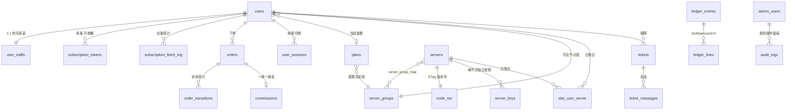

# 数据模型：抄 Xboard 的业务语义，用 PostgreSQL 重写表达，并在四处热点上拆表与加固

> 日期：2026-08-16 · 性质：**设计方案** · 状态：**设计稿 v1**（2026-08-16，未实施）
> 事实基线：Xboard 表结构实测见 [panels-and-market.md](../01-research/panels-and-market.md) §1.2 / §6.4 / §6.6；
> 工单八表 DDL 已存在于 [admin-support-docs.md](../01-research/admin-support-docs.md) §2.4；
> 订单与复式账 DDL 已存在于 [payments.md](../01-research/payments.md) §4.13
> 关联：[ADR 0005 数据库选型](../05-adr/0005-database-selection.md)、[ADR 0006 API 技术栈](../05-adr/0006-api-stack.md)、
> [system-design.md](system-design.md) §6、[pricing-and-plans.md](../03-product/pricing-and-plans.md)、
> [user-journey.md](../03-product/user-journey.md)、[page-inventory.md](../03-product/page-inventory.md)、
> [ADR 0011](../05-adr/0011-domain-blackout-detection.md)（§16 的域名池建表）、
> [ADR 0013](../05-adr/0013-billing-and-refund-rules.md)（§16 的折抵与流量包拆列，迁移 `0016`）
> —— **两份均为提案，未批准**（2026-08-23）
> **2026-08-29 补登**：§16 加落点，DDL 一行未改。
> ⚠️ **本文是 schema 的唯一真相来源。** 其他文档里出现的表名/列名与本文冲突时，以本文为准，
> 冲突逐条登记在 §14。

---

## 1 · 裁决

**一句话**：照抄 Xboard 的**业务语义**（可用性判定、订单状态机、重置模式、UniProxy 契约），
但**不照抄它的物理表达** —— 时间用 `timestamptz` 不用 integer、金额用 `bigint` 分不用 JSON 里的浮点元、
数组用真关系表不用 JSON、热写字段拆出主表、订阅 token 与节点密钥独立成表且不存明文。

### 1.1 表清单

本文定义 **38 张表**（含 3 张 UNLOGGED）+ **4 个视图** + **10 个枚举类型**；
另沿用 [admin-support-docs §2.4](../01-research/admin-support-docs.md) 的 6 张工单辅助表。
**全库共 44 张表。**（2026-08-23：新增 `rate_limit`，见 §11.4。）

| 组 | 表 | 数量 |
|---|---|---|
| **账户** | `users` `user_traffic` `invite_codes` `invite_code_uses` `user_sessions` `email_verifications` | 6 |
| **订阅** | `subscription_tokens` `subscription_fetch_log` | 2 |
| **套餐与订单** | `plans` `orders` `order_transitions` `coupons` `idempotency_keys` `webhook_events` `traffic_reset_log` | 7 |
| **钱包与返佣** | `ledger_accounts` `ledger_entries` `ledger_lines` `wallet_balances` `commissions` `refunds` | 6 |
| **节点** | `server_groups` `servers` `server_group_map` `server_keys` `node_rev` | 5 |
| **在线态（UNLOGGED）** | `server_online_state` `user_device_state` | 2 |
| **统计** | `stat_user_server`（唯一实表） | 1 |
| **工单** | `tickets` `ticket_messages` + admin-support-docs §2.4 的另外 6 张 | 2（+6 沿用） |
| **运营** | `admin_users` `audit_logs` `notices` `knowledge_articles` `email_log` `settings` | 6 |
| **限流（UNLOGGED）** | `rate_limit` | 1 |
| **视图** | `stat_user` `stat_server` `user_wallet_balance` `ticket_messages_public` | 4 |

### 1.2 八条全局裁决

| # | 裁决 | 出处 |
|---|---|---|
| 1 | **可用性判定一条 SQL 覆盖**：`u + d < transfer_enable` AND (`expired_at IS NULL` OR 未过期) AND NOT `banned`。`expired_at IS NULL` 天然支撑不限时套餐 | 【抄 Xboard】panels §6.4 #1 |
| 2 | **流量不落明细流水** —— 只在 `user_traffic` 累加 + 按天聚合到 `stat_user_server`。这是本业务的性能命门 | 【抄 Xboard】panels §6.4 #3 |
| 3 | **热写字段拆 1:1 表** —— `u`/`d`/`online_at` 从 `users` 拆到 `user_traffic`，减少行锁竞争 | 【加固】抄 Remnawave，panels §6.4 #12 |
| 4 | **金额一律 `bigint` 存分**，绝不 float、绝不 JSON 里存元 | 【抄 Xboard】+ 明确**不抄**其 2025-01 的 `prices` JSON 倒退 |
| 5 | **时间一律 `timestamptz`（UTC）**，不用 Xboard 的 integer 时间戳 | 【改进】 |
| 6 | **凭据不存明文**：订阅 token 存哈希（查找）+ 密文（展示），节点密钥只存哈希 | 【加固】system-design §5.1 三条加固之一、二 |
| 7 | **ETag 由版本号驱动**（`node_rev` 表），不哈希响应体 | 【加固】ADR 0006 |
| 8 | **`users` 永不硬删除** —— 「删除账号」= 匿名化。订单、账、统计的外键因此永不悬空 | 【新增】见 §13 |

---

## 2 · 全局约定

### 2.1 方言与版本

目标是 **PostgreSQL 17**（Cloud SQL Enterprise edition，`db-f1-micro`，`us-central1`，ADR 0005）。
只用 PG 内建能力，**不依赖任何扩展**：

- `gen_random_uuid()` 自 PG13 起为内建，**不需要 `pgcrypto`**。
- 邮箱大小写不敏感用 `CREATE UNIQUE INDEX ... (lower(email))`，**不用 `citext` 扩展**
  —— 少一个扩展依赖，且 `citext` 在跨库迁移时是负担。
  > ⚠️ 这一条是 ADR 0005 点名的 MySQL→PostgreSQL 陷阱：Xboard 用 `utf8mb4_unicode_ci`
  > 天然大小写不敏感，PG 的 `text` 默认**区分大小写**，直接照抄会让同一邮箱注册两次。

### 2.2 类型约定

单位见 §2.5。

| 用途 | 类型 | 说明 |
|---|---|---|
| 主键 | `bigint GENERATED ALWAYS AS IDENTITY` | 不用 `BIGSERIAL`（隐式 sequence 归属混乱，`IDENTITY` 是 SQL 标准且 `ALWAYS` 挡住误插入） |
| 时间 | `timestamptz` | 存 UTC，展示层转 `Asia/Shanghai` |
| 金额 | `bigint` | 单位见 §2.5 |
| 流量字节 | `bigint` | `int8` 上限 9.22×10^18 = 9.2 EB，永远够 |
| IP | `inet` | 原生支持 IPv4/IPv6（ADR 0004 选 Premium 层级正是为了 IPv6） |
| 凭据哈希 | `bytea` | 存 32 字节 raw sha256，不存 hex 字符串（省一半空间且不会出现大小写不一致） |
| 标签/数组 | `text[]` / `bigint[]` | 仅用于**不需要引用完整性**的场景 |
| 快照 | `jsonb` | 只用于「当时的事实」（工单上下文、审计前后值），**不用于当前关联** |

**枚举策略**：状态机类用 `CREATE TYPE ... AS ENUM`（借用 PG 的声明序做排序，见 §10）；
配置类、预期会频繁增删的用 `text` + `CHECK`。理由：ENUM 加值容易（`ALTER TYPE ADD VALUE`），
**删值不可能** —— 所以只给那些「删一个值等于业务语义变了」的集合用。

### 2.3 DDL 的执行顺序

**下文按业务领域分组给出 DDL，不是按可执行顺序给出。** 组间存在正向引用
（`users.group_id → server_groups`、`orders.coupon_id → coupons`、
`server_keys.created_by → admin_users`），直接从上到下拼成一个文件会报
`relation does not exist`。真正的 migration 必须按拓扑序：

```
enum types
→ server_groups → plans → admin_users → users → user_traffic
→ servers → server_group_map → server_keys → node_rev
→ coupons → orders → order_transitions → commissions → refunds
→ ledger_* → wallet_balances
→ subscription_tokens → subscription_fetch_log
→ invite_codes → invite_code_uses → user_sessions → email_verifications
→ stat_user_server → traffic_reset_log
→ ticket_categories → tickets → ticket_messages → （工单其余 5 张）
→ audit_logs → notices → knowledge_articles → email_log → settings
→ idempotency_keys → webhook_events
→ 函数与触发器 → 视图 → GRANT/REVOKE
```

### 2.4 命名

- 表名复数小写下划线，无 `v2_` 前缀（Xboard 的前缀是 v2board 迁移遗产，我们没有这个包袱）。
- 布尔列用正向语义（`enabled` 而不是 `disabled`），避免双重否定。
- 时刻列一律 `_at` 结尾；「是否发生过」用 `..._at IS NULL` 表达，不另加布尔列
  （`revoked_at` / `deleted_at` / `paid_at`），这样吊销/删除**自带时间证据**。

### 2.5 金额与量纲总表（每个数值列的单位，必须核对）

| 列 | 类型 | 单位 |
|---|---|---|
| `plans.price_monthly` / `_quarterly` / `_half_yearly` / `_yearly` / `_onetime` / `_reset` | `bigint` | **人民币分** |
| `orders.amount_gross` / `_discount` / `_balance` / `_due` / `_paid` / `_refunded` / `surplus_amount` | `bigint` | **人民币分**（`currency` 声明币种，第一阶段恒为 `CNY`） |
| `orders.pay_amount_raw` | `numeric(38,18)` | **链上代币数量**（USDT）。这是本文档**唯一**允许的非整数金额，因为它不是货币运算，是与链上余额的等值比对 |
| `orders.fx_usdt_per_cny` | `numeric(20,10)` | 下单时锁定的汇率，**只作记录与申诉证据，不参与任何再计算** |
| `coupons.value` | `bigint` | `type='fixed_amount'` 时 = **分**；`type='percentage'` 时 = **基点 bps**（1000 = 10%） |
| `commissions.rate_bps` | `integer` | **基点**，1000 = 10%（pricing §5 的返佣比例） |
| `commissions.amount` / `refunds.amount` / `ledger_lines.amount` / `wallet_balances.balance` | `bigint` | **该 currency 的最小单位**（CNY 为分）。`ledger_lines.amount` 有符号 |
| `users.transfer_enable` / `plans.transfer_enable` / `user_traffic.u,d` / `stat_user_server.u,d` | `bigint` | **字节** |
| `users.speed_limit_mbps` / `plans.speed_limit_mbps` | `integer` | **Mbps**（NULL = 不限速；第一阶段全部为 NULL） |
| `server_online_state.mem_total/mem_used/disk_total/disk_used` | `bigint` | **字节** |
| `server_online_state.cpu_pct` | `real` | **百分比 0–100**（沿用 Xboard `/status` 的校验区间） |

> **不引入节点倍率**（product-brief §6），因此 `servers` **不建 `rate` 列**，
> `stat_user_server` **不按倍率分桶**（Xboard 的 `v2_stat_user` 是按 `server_rate` 分桶的）。
> 引入倍率是一次 ADR 级决策，代价见 §16。

---

## 3 · 核心表关系



图里刻意没画的东西：

- **`user_traffic` 没有指向 `servers` 的强关联** —— 它只记 `last_node_id`，是提示不是外键。
  流量的节点维度全在 `stat_user_server`。
- **`server_online_state` / `user_device_state` 不在图里**，因为它们是 UNLOGGED 的在线态，
  崩溃即清空，不属于持久数据模型。

---

## 4 · 账户

**职责**：谁是用户、他买到了什么权利、他现在用掉了多少、他怎么登录、他从哪来。

```sql
-- ============================================================
-- 4 · 账户
-- ============================================================

CREATE TYPE verification_purpose AS ENUM ('register', 'password_reset', 'email_change');

CREATE TABLE users (
  id                    bigint GENERATED ALWAYS AS IDENTITY PRIMARY KEY,

  -- ---- 身份 ----
  email                 text        NOT NULL,
  password_hash         text        NOT NULL,           -- argon2id 编码串（含参数与 salt）
  password_algo         text        NOT NULL DEFAULT 'argon2id',
  email_verified_at     timestamptz,
  uuid                  uuid        NOT NULL DEFAULT gen_random_uuid(),  -- 节点侧连接凭据

  -- ---- 订阅权利（节点每 60 秒读的就是这几列）----
  plan_id               bigint      REFERENCES plans(id)         ON DELETE SET NULL,
  group_id              bigint      NOT NULL
                                    REFERENCES server_groups(id) ON DELETE RESTRICT,
  transfer_enable       bigint      NOT NULL DEFAULT 0 CHECK (transfer_enable >= 0),  -- 字节
  expired_at            timestamptz,                    -- NULL = 不限时套餐
  speed_limit_mbps      integer     CHECK (speed_limit_mbps > 0),  -- NULL = 不限速
  device_limit          integer     CHECK (device_limit    > 0),   -- NULL = 不限
  banned                boolean     NOT NULL DEFAULT false,
  banned_reason         text,
  banned_at             timestamptz,

  -- ---- 周期锚点（重置与到期都从这里算，见 §6.2）----
  subscription_anchor_at timestamptz,                   -- 首次开通时刻；续费与升级都不改
  reset_seq             integer     NOT NULL DEFAULT 0, -- 已重置次数
  reset_at              timestamptz,                    -- 下次重置时刻（物化，供索引）
  expiry_applied_at     timestamptz,                    -- 到期已被扫描处理（见 §8.4）

  -- ---- 订阅吊销 ----
  sub_revoked_at        timestamptz,                    -- 一键全撤：早于此刻签发的 token 全失效

  -- ---- 邀请与返佣 ----
  invited_by            bigint      REFERENCES users(id) ON DELETE SET NULL,
  commission_rate_bps   integer     CHECK (commission_rate_bps BETWEEN 0 AND 10000), -- NULL=用系统默认

  -- ---- 通知偏好（⚠️ 只管到期与流量两类；失联广播不受此控制，见 user-journey §12）----
  notify_expire         boolean     NOT NULL DEFAULT true,
  notify_traffic        boolean     NOT NULL DEFAULT true,

  -- ---- 运维 ----
  last_login_at         timestamptz,
  last_login_ip         inet,
  remarks               text,                            -- 仅管理员可见
  created_at            timestamptz NOT NULL DEFAULT now(),
  updated_at            timestamptz NOT NULL DEFAULT now(),
  deleted_at            timestamptz,                     -- 软删除；见 §13，永不硬删

  CONSTRAINT users_banned_consistency CHECK ((banned) = (banned_at IS NOT NULL))
);

-- 邮箱唯一：大小写不敏感 + 软删除后释放邮箱
CREATE UNIQUE INDEX users_email_uk    ON users (lower(email)) WHERE deleted_at IS NULL;
CREATE UNIQUE INDEX users_uuid_uk     ON users (uuid);
CREATE        INDEX users_invited_idx ON users (invited_by) WHERE invited_by IS NOT NULL;

-- 节点拉用户列表（§12.2）：group_id 定位 + expired_at 用 coalesce 把 NULL 当 +∞
CREATE INDEX users_available_idx
  ON users (group_id, (coalesce(expired_at, 'infinity'::timestamptz)))
  WHERE banned = false AND deleted_at IS NULL;

-- 到期扫描与重置扫描（Cloud Scheduler 每分钟跑，平时命中 0 行）
CREATE INDEX users_expiry_due_idx ON users (expired_at)
  WHERE expired_at IS NOT NULL AND expiry_applied_at IS NULL AND deleted_at IS NULL;
CREATE INDEX users_reset_due_idx  ON users (reset_at)
  WHERE reset_at IS NOT NULL AND deleted_at IS NULL;


-- ---------- 热写字段拆表（1:1）----------
CREATE TABLE user_traffic (
  user_id      bigint      PRIMARY KEY REFERENCES users(id) ON DELETE CASCADE,
  u            bigint      NOT NULL DEFAULT 0 CHECK (u >= 0),   -- 本周期上行字节
  d            bigint      NOT NULL DEFAULT 0 CHECK (d >= 0),   -- 本周期下行字节
  u_lifetime   bigint      NOT NULL DEFAULT 0,                  -- 累计（重置不清零）
  d_lifetime   bigint      NOT NULL DEFAULT 0,
  online_at    timestamptz,                                     -- 最后一次有流量的时刻
  last_node_id bigint,                                          -- 提示用，刻意不建外键
  updated_at   timestamptz NOT NULL DEFAULT now()
);
-- ⚠️ 本表刻意只有主键，不建任何二级索引，也禁止建任何触发器。理由见 §8.4。


-- ---------- 邀请码 ----------
CREATE TABLE invite_codes (
  id            bigint GENERATED ALWAYS AS IDENTITY PRIMARY KEY,
  code          text    NOT NULL,               -- 大写，剔除 0/O/1/I/l 等易混字符
  owner_user_id bigint  REFERENCES users(id) ON DELETE CASCADE,  -- NULL = 管理员种子码
  max_uses      integer NOT NULL DEFAULT 1 CHECK (max_uses >= 1),
  used_count    integer NOT NULL DEFAULT 0 CHECK (used_count >= 0),
  expires_at    timestamptz,
  revoked_at    timestamptz,
  note          text,
  created_at    timestamptz NOT NULL DEFAULT now(),

  CONSTRAINT invite_codes_uses CHECK (used_count <= max_uses),
  -- user-journey §3.2 裁决：用户码恒为一次性核销；只有管理员种子码可 1–N 次
  CONSTRAINT invite_codes_user_single_use CHECK (owner_user_id IS NULL OR max_uses = 1)
);
CREATE UNIQUE INDEX invite_codes_code_uk ON invite_codes (code);
CREATE INDEX invite_codes_owner_idx ON invite_codes (owner_user_id)
  WHERE revoked_at IS NULL AND owner_user_id IS NOT NULL;

CREATE TABLE invite_code_uses (
  id             bigint GENERATED ALWAYS AS IDENTITY PRIMARY KEY,
  invite_code_id bigint NOT NULL REFERENCES invite_codes(id) ON DELETE RESTRICT,
  user_id        bigint NOT NULL REFERENCES users(id)        ON DELETE RESTRICT,
  request_ip     inet,
  used_at        timestamptz NOT NULL DEFAULT now(),
  UNIQUE (user_id)                              -- 一个用户只能被一个码带进来
);
CREATE INDEX invite_code_uses_code_idx ON invite_code_uses (invite_code_id);


-- ---------- 会话（refresh token）----------
CREATE TABLE user_sessions (
  id             bigint GENERATED ALWAYS AS IDENTITY PRIMARY KEY,
  user_id        bigint NOT NULL REFERENCES users(id) ON DELETE CASCADE,
  refresh_hash   bytea  NOT NULL,               -- sha256(refresh_token)，不存明文
  user_agent     text,
  created_ip     inet,
  issued_at      timestamptz NOT NULL DEFAULT now(),
  last_used_at   timestamptz,
  expires_at     timestamptz NOT NULL,
  revoked_at     timestamptz,
  replaced_by_id bigint REFERENCES user_sessions(id) ON DELETE SET NULL  -- 轮换链
);
CREATE UNIQUE INDEX user_sessions_hash_uk ON user_sessions (refresh_hash);
CREATE INDEX user_sessions_user_idx ON user_sessions (user_id, expires_at DESC)
  WHERE revoked_at IS NULL;


-- ---------- 邮箱验证码 / 找回密码 ----------
CREATE TABLE email_verifications (
  id           bigint GENERATED ALWAYS AS IDENTITY PRIMARY KEY,
  email        text     NOT NULL,
  user_id      bigint   REFERENCES users(id) ON DELETE CASCADE,  -- 注册场景为 NULL
  purpose      verification_purpose NOT NULL,
  code_hash    bytea    NOT NULL,
  attempts     smallint NOT NULL DEFAULT 0,
  max_attempts smallint NOT NULL DEFAULT 5,
  expires_at   timestamptz NOT NULL,
  consumed_at  timestamptz,
  request_ip   inet,
  created_at   timestamptz NOT NULL DEFAULT now()
);
CREATE INDEX email_verifications_lookup_idx
  ON email_verifications (lower(email), purpose, created_at DESC);
```

### 4.1 为什么这么设计

- **【加固】管理员不是 `users` 上的一个 flag。** Xboard 用 `is_admin` / `is_staff` 两个布尔列，
  这意味着用户鉴权链与后台鉴权链共享同一张表、同一条查询。我们把管理员放进独立的
  `admin_users`（§11），使 ADR 0006 的五条互不共享的中间件链在**数据层**就是分离的
  —— 「一个全局 auth 中间件 + if 分支」这个 Xboard 病灶在 schema 层面就被堵死。
- **【加固】`user_traffic` 拆表**（抄 Remnawave）。写压力的量化：ADR 0005 的 P3 情景是
  **40 行/秒**行更新。这些更新如果落在 `users` 上，会与「读用户列表」「改套餐」「登录写
  `last_login_at`」争同一批行版本；拆表后 `users` 的写频率降到接近零。
- **【新增】`subscription_anchor_at` + `reset_seq` 而不是「上次重置时间 + 1 个月」。**
  后者会漂移：`2026-01-31 + 1 month = 2026-02-28`，再 `+1 month = 2026-03-28`，
  锚点被永久拉到 28 号。从固定锚点算 `anchor + n * interval '1 month'` 则
  `2026-01-31 + 2 months = 2026-03-31`，不漂移。
- **【改进】`banned` 与 `banned_at` 用 CHECK 绑死。** Xboard 只有 `banned` 布尔，
  封禁时间要去审计日志里翻。绑死后「什么时候被封的」永远可查。
- **【改进】邮箱唯一索引带 `WHERE deleted_at IS NULL`。** 用户注销后邮箱可以重新注册，
  同时历史行仍在（§13 的匿名化会把 email 改写成 `deleted+{id}@invalid`，两条机制冗余但不冲突）。
- **【新增】`notify_expire` / `notify_traffic` 只有两个开关，没有「全部通知」总开关。**
  user-journey §12 的裁决：一切「服务不可用」类通知（新域名广播）**不受用户开关控制**。
  schema 上表达这条裁决的方式就是**不提供那个列**。
- **【新增】`invite_codes_user_single_use` 用 CHECK 表达产品裁决。** 用户码多次可用 =
  开放注册，与「内部使用」定位冲突。这条约束写在数据库里，将来任何一处代码想放宽都会被拒绝。
- **【设计说明】`users.group_id` 是 `NOT NULL`，未付费用户也有组。** 看起来会让没买套餐的人
  看到节点，实际不会：新注册用户 `transfer_enable = 0`，而可用性判定里
  `u + d < transfer_enable` 在 `0 + 0 < 0` 时为假，他被排除在节点用户列表之外。
  **配额本身就是准入开关，不需要再加一个「已付费」布尔列。** 这条与
  「`expired_at IS NULL` 表示不限时」是同一种思路：让一个字段同时承担状态语义。
- ⚠️ **「每用户未核销码 ≤ 3」无法用声明式约束表达**（PG 没有跨行的 CHECK）。落在应用层，
  并配一条巡检 SQL：

  ```sql
  SELECT owner_user_id, count(*) FROM invite_codes
  WHERE owner_user_id IS NOT NULL AND revoked_at IS NULL AND used_count = 0
  GROUP BY owner_user_id HAVING count(*) > 3;
  ```

- ⚠️ **access JWT 在其有效期内不可撤销**，这是 JWT 的固有代价。「全部登出」= 撤销全部
  `user_sessions` 行 + 最长一个 access token TTL（建议 15 分钟）后真正生效。
  若这个窗口不可接受，唯一的解法是每请求查库 —— 那 JWT 就没有意义了。

---

## 5 · 订阅

**职责**：让客户端凭一条 URL 拿到节点列表；让泄漏可以被发现、被精确止血。

```sql
-- ============================================================
-- 5 · 订阅
-- ============================================================

CREATE TABLE subscription_tokens (
  id             bigint GENERATED ALWAYS AS IDENTITY PRIMARY KEY,
  user_id        bigint NOT NULL REFERENCES users(id) ON DELETE CASCADE,

  token_hash     bytea  NOT NULL,        -- sha256(token)：唯一索引，O(1) 查找
  token_enc      bytea  NOT NULL,        -- AES-256-GCM(token)，密钥在 Secret Manager 不落 DB
  token_prefix   text   NOT NULL,        -- 明文前 8 位：面板列表与日志定位用

  name           text   NOT NULL DEFAULT '',   -- 用户自命名：'家里的台式机'
  issued_at      timestamptz NOT NULL DEFAULT now(),   -- 与 users.sub_revoked_at 比对
  expires_at     timestamptz,                          -- NULL = 不过期
  last_used_at   timestamptz,
  last_used_ip   inet,
  revoked_at     timestamptz,
  revoked_reason text,
  created_at     timestamptz NOT NULL DEFAULT now()
);
CREATE UNIQUE INDEX subscription_tokens_hash_uk ON subscription_tokens (token_hash);
CREATE INDEX subscription_tokens_user_idx ON subscription_tokens (user_id)
  WHERE revoked_at IS NULL;


CREATE TABLE subscription_fetch_log (
  id           bigint GENERATED ALWAYS AS IDENTITY PRIMARY KEY,
  user_id      bigint   NOT NULL REFERENCES users(id) ON DELETE CASCADE,
  token_id     bigint   REFERENCES subscription_tokens(id) ON DELETE SET NULL,
  request_ip   inet     NOT NULL,
  user_agent   text     NOT NULL DEFAULT '',
  client_flag  text,                   -- 归一化后的客户端：clash / singbox / karing / unknown
  status_code  smallint NOT NULL,      -- 200 / 304 / 404（不存在一律 404，见 ADR 0006）
  format       text,                   -- clash / singbox / base64
  node_count   smallint,               -- 本次下发的节点数；0 = 到期/超配额的伪节点响应
  request_at   timestamptz NOT NULL DEFAULT now()
);
CREATE INDEX subscription_fetch_log_user_idx ON subscription_fetch_log (user_id, request_at DESC);
CREATE INDEX subscription_fetch_log_at_idx   ON subscription_fetch_log (request_at);
```

### 5.1 token 校验的完整判定

```sql
SELECT t.id, t.user_id
FROM subscription_tokens t
JOIN users u ON u.id = t.user_id
WHERE t.token_hash = $1                                  -- sha256(URL 里的 token)
  AND t.revoked_at IS NULL
  AND (t.expires_at IS NULL OR t.expires_at > now())
  AND (u.sub_revoked_at IS NULL OR t.issued_at > u.sub_revoked_at)  -- ← 一键全撤
  AND u.deleted_at IS NULL;
```

`sub_revoked_at` 的语义抄 Marzban：**不更换标识符即可让全部旧链接失效**。
两个吊销粒度对应用户面板上的两个按钮（page-inventory §3.2）：

| 粒度 | 写哪里 | 用户感受 |
|---|---|---|
| 吊销单条 token | `subscription_tokens.revoked_at = now()` | 只有那一台设备要重新导入 |
| 一键全撤 | `users.sub_revoked_at = now()` | **所有设备都要重新导入** —— 确认弹窗必须写死这句话 |

### 5.2 为什么 token 要「哈希 + 密文」两份而不是只存哈希

只存哈希（3x-ui 的 API token 做法）意味着**明文只在创建时显示一次**。这在本项目里与
一条更重要的机制正面冲突：

> ADR 0002 的失联恢复靠**邮件广播新域名**，用户拿到新域名后自己拼出
> `https://{新域名}/s/{token}`。如果 token 不可再次展示，每换一次域名就要给所有用户
> 重签一次 token —— 恢复面的核心机制会因为一个存储决策而失效。

因此裁决是**可逆加密**：`token_hash` 负责查找，`token_enc` 负责展示。

**这层加密的准确防护边界（不要夸大）**：它防的是「只拿到数据库」的场景 ——
备份文件泄漏、只读 SQL 注入、Cloud SQL 快照被误共享。它**不防**「`bp-api` 实例被攻破」
—— 那时密钥与数据库一起丢。愿意付这个复杂度是因为前三种场景在云上比后一种常见得多。

### 5.3 为什么 `subscription_fetch_log` 是本组最重要的表

system-design §5.2 原话：**这是唯一能识别「账号共享」的数据来源**。共享检测查询：

```sql
SELECT u.id, u.email,
       count(*)                        AS fetches,
       count(DISTINCT f.request_ip)    AS distinct_ips,
       count(DISTINCT f.client_flag)   AS distinct_clients
FROM subscription_fetch_log f
JOIN users u ON u.id = f.user_id
WHERE f.request_at > now() - interval '7 days'
  AND f.status_code = 200
GROUP BY u.id, u.email
HAVING count(DISTINCT f.request_ip) > 20        -- ⚠️ 20 是占位数字
ORDER BY distinct_ips DESC;
```

> ⚠️ **阈值 20 是占位数字，不是结论。** 中国移动网络的公网 IP 变动极频繁，
> 单个正常用户 7 天内出现几十个不同 IP 完全可能。**必须先采基线再定阈值**
> —— 与 user-journey §14 的「先采基线」口径一致。**需实测。**

面板侧把最近 10 次拉取记录（时间 / IP 归属地 / UA）直接展示给用户，边际成本为零
（page-inventory §3.2.7）：用户自己就能发现订阅被白嫖并自助重置，不用开工单。

### 5.4 增长与清理

| 参数 | 值 | 性质 |
|---|---|---|
| 客户端订阅刷新间隔 | Clash Verge Rev / sing-box 默认多为手动或 24 h | **需实测**（各客户端默认值不同，直接决定本表行数） |
| 悲观估算（每设备每小时一次） | 100 用户 × 3 设备 × 24 = **7,200 行/天** | 上界 |
| 90 天保留 | ≈ **648,000 行** ≈ 100 MB（含索引约 200 MB） | 推算 |

清理由 Cloud Scheduler 每天跑一次：

```sql
DELETE FROM subscription_fetch_log WHERE request_at < now() - interval '90 days';
```

**本表是全库唯一需要定时清理的持久表**（在线态两张是 UNLOGGED，另算）。

---

## 6 · 套餐与订单

**职责**：卖什么、卖多少钱、这笔钱到没到、到了之后把什么权利写进 `users`。

```sql
-- ============================================================
-- 6 · 套餐与订单
-- ============================================================

-- Xboard v2_plan.reset_traffic_method 的六种模式，改成有名字的枚举
CREATE TYPE reset_method AS ENUM (
  'follow_system',         -- Xboard null：跟随系统默认
  'monthly_first',         -- Xboard 0：每月 1 号
  'monthly_on_order_day',  -- Xboard 1：按订单日按月 ← 竞品实测的实际行为，我们的默认
  'never',                 -- Xboard 2：不重置（不限时套餐用）
  'yearly_jan_first',      -- Xboard 3：每年 1 月 1 日
  'yearly_on_order_day'    -- Xboard 4：按订单日按年
);

CREATE TABLE plans (
  id                   bigint GENERATED ALWAYS AS IDENTITY PRIMARY KEY,
  code                 text    NOT NULL UNIQUE,        -- 'lite' / 'standard' / 'heavy'
  name                 text    NOT NULL,
  group_id             bigint  NOT NULL REFERENCES server_groups(id) ON DELETE RESTRICT,

  transfer_enable      bigint  NOT NULL CHECK (transfer_enable > 0),  -- 字节/周期
  device_limit         integer CHECK (device_limit > 0),              -- pricing §3.1：2 / 5 / 10
  speed_limit_mbps     integer CHECK (speed_limit_mbps > 0),          -- 第一阶段全 NULL
  reset_traffic_method reset_method NOT NULL DEFAULT 'monthly_on_order_day',

  -- 价格：人民币分，NULL = 该周期不售。⚠️ 刻意不抄 Xboard 的 prices JSON（值为元、浮点）
  price_monthly        bigint CHECK (price_monthly      >= 0),
  price_quarterly      bigint CHECK (price_quarterly    >= 0),
  price_half_yearly    bigint CHECK (price_half_yearly  >= 0),
  price_yearly         bigint CHECK (price_yearly       >= 0),
  price_onetime        bigint CHECK (price_onetime      >= 0),
  price_reset          bigint CHECK (price_reset        >= 0),   -- 流量重置包

  renewable            boolean NOT NULL DEFAULT true,   -- 老用户能否续费
  sellable             boolean NOT NULL DEFAULT true,   -- 新用户能否购买
  visible              boolean NOT NULL DEFAULT true,   -- 是否出现在套餐页
  sort_order           integer NOT NULL DEFAULT 0,
  content_md           text    NOT NULL DEFAULT '',
  created_at           timestamptz NOT NULL DEFAULT now(),
  updated_at           timestamptz NOT NULL DEFAULT now(),
  archived_at          timestamptz                       -- 下架≠删除，见 §13
);


CREATE TYPE order_type AS ENUM (
  'new', 'renew', 'upgrade', 'traffic_pack', 'reset_pack', 'wallet_topup'
);
CREATE TYPE order_period AS ENUM (
  'monthly', 'quarterly', 'half_yearly', 'yearly', 'onetime'
);
-- 沿用 payments.md §4.13 的定义，一字不改
CREATE TYPE order_status AS ENUM (
  'pending','paying','underpaid','paid','completed',
  'cancelled','expired','failed',
  'refunding','refunded','partially_refunded',
  'chargeback','chargeback_won','chargeback_lost'
);

CREATE TABLE orders (
  id                bigint GENERATED ALWAYS AS IDENTITY PRIMARY KEY,
  trade_no          text        NOT NULL UNIQUE,  -- 对外单号，即 page-inventory 的 /order/:trade_no
  user_id           bigint      NOT NULL REFERENCES users(id) ON DELETE RESTRICT,
  type              order_type  NOT NULL,
  plan_id           bigint      REFERENCES plans(id) ON DELETE RESTRICT,
  period            order_period,
  status            order_status NOT NULL DEFAULT 'pending',

  -- ---- 金额：全部人民币分 ----
  currency          char(3) NOT NULL DEFAULT 'CNY',
  amount_gross      bigint  NOT NULL DEFAULT 0 CHECK (amount_gross    >= 0),  -- 标价
  amount_discount   bigint  NOT NULL DEFAULT 0 CHECK (amount_discount >= 0),  -- 优惠码
  surplus_amount    bigint  NOT NULL DEFAULT 0 CHECK (surplus_amount  >= 0),  -- 升级折抵
  amount_balance    bigint  NOT NULL DEFAULT 0 CHECK (amount_balance  >= 0),  -- 余额抵扣
  amount_due        bigint  NOT NULL           CHECK (amount_due      >= 0),  -- 网关应收
  amount_paid       bigint  NOT NULL DEFAULT 0 CHECK (amount_paid     >= 0),
  amount_refunded   bigint  NOT NULL DEFAULT 0 CHECK (amount_refunded >= 0),
  surplus_order_ids bigint[] NOT NULL DEFAULT '{}',   -- 被折抵掉的历史订单（Xboard 同名字段）

  coupon_id         bigint  REFERENCES coupons(id) ON DELETE SET NULL,
  invited_by        bigint  REFERENCES users(id)   ON DELETE SET NULL,  -- 下单瞬间的邀请人快照

  -- ---- 支付通道 ----
  gateway           text,                 -- 'usdt_trc20' | 'usdt_erc20' | 'usdt_bep20' | 'epay:*'
  gateway_ref       text,                 -- 网关侧交易号 / 链上 txid
  pay_chain         text,                 -- 'tron' | 'ethereum' | 'bsc'
  pay_address       text,                 -- 本单专属收款地址
  pay_amount_raw    numeric(38,18),       -- 链上应收数量（含四位小数的订单识别尾数）
  pay_amount_received numeric(38,18) NOT NULL DEFAULT 0,   -- 实收，underpaid 判定用
  fx_usdt_per_cny   numeric(20,10),       -- 下单时锁定汇率，只作记录
  fx_locked_at      timestamptz,

  -- ---- 时间 ----
  expires_at           timestamptz NOT NULL,       -- 支付窗口（倒计时）
  address_watch_until  timestamptz,                -- ⚠️ 收款地址继续监听到此刻，见下
  paid_at              timestamptz,
  completed_at         timestamptz,
  cancelled_at         timestamptz,
  created_at           timestamptz NOT NULL DEFAULT now(),
  updated_at           timestamptz NOT NULL DEFAULT now(),

  CONSTRAINT orders_amount_balance
    CHECK (amount_due = amount_gross - amount_discount - surplus_amount - amount_balance),
  CONSTRAINT orders_refund_le_paid CHECK (amount_refunded <= amount_paid)
);

CREATE INDEX orders_user_idx ON orders (user_id, created_at DESC);
CREATE INDEX orders_expiry_idx ON orders (status, expires_at)
  WHERE status IN ('pending','paying','underpaid');
CREATE UNIQUE INDEX orders_gateway_ref_uk ON orders (gateway, gateway_ref)
  WHERE gateway_ref IS NOT NULL;
-- 地址 + 唯一金额的组合，在「未终结」的订单里必须唯一（EPUSDT 的金额尾数递增法）
CREATE UNIQUE INDEX orders_pay_addr_amount_uk ON orders (pay_address, pay_amount_raw)
  WHERE pay_address IS NOT NULL AND status IN ('pending','paying','underpaid');
-- ⚠️ 不能写成 WHERE address_watch_until > now()：now() 不是 IMMUTABLE，建索引会直接报错。
--    把列放进索引键，让查询条件走范围扫描。
CREATE INDEX orders_addr_watch_idx ON orders (pay_address, address_watch_until)
  WHERE pay_address IS NOT NULL;


-- 状态流转审计（不可变，沿用 payments.md §4.13）
CREATE TABLE order_transitions (
  id          bigint GENERATED ALWAYS AS IDENTITY PRIMARY KEY,
  order_id    bigint NOT NULL REFERENCES orders(id) ON DELETE RESTRICT,
  from_status order_status,
  to_status   order_status NOT NULL,
  reason      text,
  actor       text NOT NULL,        -- system | webhook:<gw> | admin:<id> | user:<id> | chain:<txid>
  created_at  timestamptz NOT NULL DEFAULT now()
);
CREATE INDEX order_transitions_order_idx ON order_transitions (order_id, created_at);


CREATE TABLE coupons (
  id               bigint GENERATED ALWAYS AS IDENTITY PRIMARY KEY,
  code             text    NOT NULL,                 -- 存 upper()
  name             text    NOT NULL DEFAULT '',
  type             text    NOT NULL CHECK (type IN ('percentage','fixed_amount')),
  value            bigint  NOT NULL CHECK (value > 0),   -- percentage=bps；fixed=分
  scope_plan_ids   bigint[] NOT NULL DEFAULT '{}',       -- 空 = 不限套餐
  scope_periods    order_period[] NOT NULL DEFAULT '{}', -- 空 = 不限周期
  min_amount       bigint  NOT NULL DEFAULT 0,
  total_uses       integer,                              -- NULL = 不限
  used_count       integer NOT NULL DEFAULT 0,
  uses_per_user    integer NOT NULL DEFAULT 1,
  first_order_only boolean NOT NULL DEFAULT false,
  starts_at        timestamptz,
  ends_at          timestamptz,
  visible          boolean NOT NULL DEFAULT false,
  created_at       timestamptz NOT NULL DEFAULT now()
);
CREATE UNIQUE INDEX coupons_code_uk ON coupons (upper(code));


-- 幂等与 webhook 重放防护（沿用 payments.md §4.13）
CREATE TABLE idempotency_keys (
  key           text PRIMARY KEY,
  user_id       bigint,
  endpoint      text NOT NULL,
  request_hash  text NOT NULL,
  status        text NOT NULL CHECK (status IN ('in_progress','completed')),
  response_code integer,
  response_body jsonb,
  created_at    timestamptz NOT NULL DEFAULT now(),
  expires_at    timestamptz NOT NULL DEFAULT now() + interval '24 hours'
);
CREATE INDEX idempotency_keys_expiry_idx ON idempotency_keys (expires_at);

CREATE TABLE webhook_events (
  id            bigint GENERATED ALWAYS AS IDENTITY PRIMARY KEY,
  gateway       text NOT NULL,
  event_id      text NOT NULL,      -- 通道 event id；无则用 (trade_no || ':' || status)
  event_type    text,
  payload_hash  text NOT NULL,      -- sha256(raw_body)
  raw_body      text NOT NULL,      -- 存原文，对账与申诉用
  signature_ok  boolean NOT NULL,
  processed_at  timestamptz,
  error         text,
  received_at   timestamptz NOT NULL DEFAULT now(),
  UNIQUE (gateway, event_id)        -- ← 重放防护的核心
);


-- 流量重置审计（抄 Xboard v2_traffic_reset_logs）
CREATE TABLE traffic_reset_log (
  id             bigint GENERATED ALWAYS AS IDENTITY PRIMARY KEY,
  user_id        bigint NOT NULL REFERENCES users(id) ON DELETE CASCADE,
  trigger_source text   NOT NULL CHECK (trigger_source IN ('scheduler','order','admin','pack')),
  reset_method   reset_method,
  old_u          bigint NOT NULL,
  old_d          bigint NOT NULL,
  new_transfer_enable bigint NOT NULL,
  order_id       bigint REFERENCES orders(id) ON DELETE SET NULL,
  admin_user_id  bigint,
  reset_at       timestamptz NOT NULL DEFAULT now()
);
CREATE INDEX traffic_reset_log_user_idx ON traffic_reset_log (user_id, reset_at DESC);
```

### 6.1 为什么这么设计

- **【抄 Xboard】`surplus_amount` + `surplus_order_ids` 做升级折抵。** 但我们把它加进了
  `amount_due` 的 CHECK 等式里（payments.md §4.13 的等式漏了这一项），
  这样「三行金额加起来对不上」在插入时就会被数据库拒绝，而不是在对账时才发现。
- **【改进】不抄 Xboard 的 `prices` JSON。** panels-and-market §1.2 明确标注它是**一处倒退**
  （2025-01 迁移把八个整数分列合并成 JSON 且**值为元、浮点**）。我们用六个固定的
  `bigint` 分列。代价：加一个新周期需要一次 migration —— 可接受，因为周期集合
  （月/季/半年/年，pricing §3.2）是产品决策不是数据。
- **【新增】`address_watch_until` 与「过期订单继续监听」。** user-journey §7 的设计增量：
  过期订单的收款地址必须**继续监听 ≥ 24 小时**，到账后入账为**余额**而不是直接开通。
  因为余额仅可消费不可提现，这个兜底在资金合规上是安全的。不做这一条，
  用户第一次付款的钱就真的进黑洞。
- **【新增】`pay_amount_received` 独立成列。** `underpaid` 状态必须能显式回答
  「已收到 X，还差 Y」（page-inventory §3.2 要求收银台展示这句话）。
  只有 `amount_paid`（分）不够，因为链上收的是 USDT 不是分。
- ⚠️ **`orders_addr_watch_idx` 的谓词里不能出现 `now()`。** PostgreSQL 要求部分索引的
  谓词是 IMMUTABLE 的，`WHERE address_watch_until > now()` 会在 `CREATE INDEX` 时直接报
  `functions in index predicate must be marked IMMUTABLE`。这是照抄「看起来很自然的写法」
  必踩的坑，写在这里免得在 migration 阶段才发现。
- **【抄 payments.md】`webhook_events` 的 `UNIQUE (gateway, event_id)`。**
  易支付回调可被伪造（NewAPI 的真实漏洞，payments §4.1），
  幂等靠数据库唯一约束比靠应用层判断可靠。

### 6.2 重置日的计算（竞品实测是「重置日 = 订单日」）

```sql
-- 下一次重置时刻。从固定锚点乘算，避免月末漂移。
UPDATE users u SET
  reset_at = CASE p.reset_traffic_method
    WHEN 'never'                THEN NULL
    WHEN 'monthly_first'        THEN date_trunc('month', now()) + interval '1 month'
    WHEN 'yearly_jan_first'     THEN date_trunc('year',  now()) + interval '1 year'
    WHEN 'monthly_on_order_day' THEN u.subscription_anchor_at + (u.reset_seq + 1) * interval '1 month'
    WHEN 'yearly_on_order_day'  THEN u.subscription_anchor_at + (u.reset_seq + 1) * interval '1 year'
    ELSE u.subscription_anchor_at + (u.reset_seq + 1) * interval '1 month'  -- follow_system
  END
FROM plans p WHERE p.id = u.plan_id AND u.id = $1;
```

执行重置的事务（每分钟由 Cloud Scheduler 触发，命中 `users_reset_due_idx`）：

```sql
BEGIN;
  INSERT INTO traffic_reset_log (user_id, trigger_source, reset_method, old_u, old_d, new_transfer_enable)
  SELECT ut.user_id, 'scheduler', p.reset_traffic_method, ut.u, ut.d, p.transfer_enable
  FROM user_traffic ut JOIN users u ON u.id = ut.user_id JOIN plans p ON p.id = u.plan_id
  WHERE u.reset_at <= now() AND u.deleted_at IS NULL;

  UPDATE user_traffic ut SET
    u_lifetime = ut.u_lifetime + ut.u, d_lifetime = ut.d_lifetime + ut.d,
    u = 0, d = 0, updated_at = now()
  FROM users u WHERE u.id = ut.user_id AND u.reset_at <= now() AND u.deleted_at IS NULL;

  UPDATE users SET reset_seq = reset_seq + 1, reset_at = <上式重算>
  WHERE reset_at <= now() AND deleted_at IS NULL;

  -- ⚠️ 必须显式 bump：user_traffic 上没有触发器（§8.4），配额恢复不会自动传播到节点
  SELECT bump_user_rev_for_user(id) FROM users WHERE reset_seq_just_changed;
COMMIT;
```

> ⚠️ **流量包与重置的关系未裁决。** user-journey §10.1 建议「流量包在周期重置时保留」
> （清零会让月末买包的用户烧钱），但这与 `reset_traffic_method` 把 `transfer_enable`
> 整个覆盖回套餐值的实现方式冲突。当前 DDL **没有为流量包留独立的配额列**
> —— 这是一个已知缺口，见 §16。

---

## 7 · 钱包与返佣

**职责**：余额只进不出的账；佣金的两段式冷静期。

**这一组整体沿用 [payments.md §4.13](../01-research/payments.md) 的复式记账设计**，
本文只写差异与补充。核心不变量：

```
∀ entry: SUM(lines.amount) = 0                 -- 借贷必相等
∀ user:  余额 = -SUM(lines.amount WHERE account = 'liability:user_wallet' AND subject_id = uid)
∀ time:  余额 >= 0
```

```sql
-- ============================================================
-- 7 · 钱包与返佣
-- ============================================================

CREATE TABLE ledger_accounts (
  id       bigint GENERATED ALWAYS AS IDENTITY PRIMARY KEY,
  code     text    NOT NULL UNIQUE,   -- 'liability:user_wallet' / 'revenue:subscription' / ...
  kind     text    NOT NULL CHECK (kind IN ('asset','liability','equity','revenue','expense')),
  currency char(3) NOT NULL
);

CREATE TABLE ledger_entries (
  id          bigint GENERATED ALWAYS AS IDENTITY PRIMARY KEY,
  entry_no    text NOT NULL UNIQUE,
  description text NOT NULL,
  ref_type    text,                    -- order | refund | commission | reconcile_adjust
  ref_id      bigint,
  reverses_id bigint REFERENCES ledger_entries(id),   -- 冲正指向原分录
  created_at  timestamptz NOT NULL DEFAULT now()
);
CREATE INDEX ledger_entries_ref_idx ON ledger_entries (ref_type, ref_id);

CREATE TABLE ledger_lines (
  id         bigint GENERATED ALWAYS AS IDENTITY PRIMARY KEY,
  entry_id   bigint  NOT NULL REFERENCES ledger_entries(id) ON DELETE RESTRICT,
  account_id bigint  NOT NULL REFERENCES ledger_accounts(id) ON DELETE RESTRICT,
  subject_id bigint,                   -- user_id（liability:user_wallet 分账用）
  amount     bigint  NOT NULL,         -- 有符号最小货币单位：正=借 Dr，负=贷 Cr。禁止 float
  currency   char(3) NOT NULL,
  created_at timestamptz NOT NULL DEFAULT now()
);
CREATE INDEX ledger_lines_entry_idx   ON ledger_lines (entry_id);
CREATE INDEX ledger_lines_subject_idx ON ledger_lines (account_id, subject_id);

-- 唯一真相：余额是分录的聚合
CREATE VIEW user_wallet_balance AS
SELECT l.subject_id AS user_id, l.currency, -SUM(l.amount) AS balance
FROM ledger_lines l JOIN ledger_accounts a ON a.id = l.account_id
WHERE a.code = 'liability:user_wallet'
GROUP BY l.subject_id, l.currency;

-- 性能缓存：面板每次打开都要读余额，不能每次扫分录
CREATE TABLE wallet_balances (
  user_id           bigint  PRIMARY KEY REFERENCES users(id) ON DELETE CASCADE,
  currency          char(3) NOT NULL DEFAULT 'CNY',
  balance           bigint  NOT NULL DEFAULT 0 CHECK (balance >= 0),  -- 分；不可为负
  last_entry_id     bigint,          -- 已计入的最后一条分录，用于增量对账
  updated_at        timestamptz NOT NULL DEFAULT now()
);


CREATE TABLE commissions (
  id           bigint GENERATED ALWAYS AS IDENTITY PRIMARY KEY,
  order_id     bigint NOT NULL REFERENCES orders(id) ON DELETE RESTRICT,
  inviter_id   bigint NOT NULL REFERENCES users(id)  ON DELETE RESTRICT,
  invitee_id   bigint NOT NULL REFERENCES users(id)  ON DELETE RESTRICT,
  rate_bps     integer NOT NULL CHECK (rate_bps BETWEEN 0 AND 10000),  -- 1000 = 10%
  amount       bigint  NOT NULL CHECK (amount >= 0),                   -- 分
  -- 两段式：确认中 → 已获得（pricing §5）
  status       text    NOT NULL DEFAULT 'pending'
               CHECK (status IN ('pending','confirmed','transferred','voided')),
  confirm_at   timestamptz NOT NULL,        -- 冷静期到期时刻
  confirmed_at timestamptz,
  voided_reason text,
  created_at   timestamptz NOT NULL DEFAULT now(),
  UNIQUE (order_id)                          -- 一单只产生一条佣金
);
CREATE INDEX commissions_inviter_idx ON commissions (inviter_id, status);
CREATE INDEX commissions_due_idx     ON commissions (confirm_at) WHERE status = 'pending';


CREATE TABLE refunds (
  id          bigint GENERATED ALWAYS AS IDENTITY PRIMARY KEY,
  order_id    bigint NOT NULL REFERENCES orders(id) ON DELETE RESTRICT,
  amount      bigint NOT NULL CHECK (amount > 0),
  destination text   NOT NULL CHECK (destination IN ('balance','original')),
  status      text   NOT NULL DEFAULT 'pending'
              CHECK (status IN ('pending','done','failed','cancelled')),
  gateway_ref text,
  reason      text,
  operator_id bigint REFERENCES admin_users(id) ON DELETE SET NULL,
  created_at  timestamptz NOT NULL DEFAULT now()
);
```

### 7.1 为什么这么设计

- **【新增】`wallet_balances` 是缓存不是真相。** payments.md 的要求是「余额不存字段，
  实时/物化聚合；若为性能建缓存表，必须有定时任务比对」。对账 SQL：

  ```sql
  SELECT b.user_id, b.balance AS cached, coalesce(v.balance, 0) AS ledger
  FROM wallet_balances b
  LEFT JOIN user_wallet_balance v ON v.user_id = b.user_id AND v.currency = b.currency
  WHERE b.balance IS DISTINCT FROM coalesce(v.balance, 0);
  ```

  **返回非空行 = 立即告警，且以视图为准。** 每日一次 Cloud Scheduler。
- ⚠️ **「余额不可提现」在数据库层面无法强制。** 它的实现方式是：
  `ledger_accounts` 里**不存在** `asset:bank` ← `liability:user_wallet` 这条分录路径，
  且**没有写提现代码**。数据库能保证的只有 `balance >= 0`。
  这条产品裁决的真正守卫是 code review 与 §11 的审计日志，不是约束。
- **【抄 pricing §5】佣金两段式 + 冷静期。** `confirm_at` 是订单支付完成后加冷静期
  （防退款套利）。`commissions_due_idx` 让「到点确认」的定时任务是一次索引范围扫描。
- **【新增】`UNIQUE (order_id)`。** 一单只产生一条佣金 —— 这条约束把「Cloud Tasks
  至少一次投递导致佣金重复发放」这个 ADR 0006 点名的风险，从应用逻辑降级成数据库拒绝。

---

## 8 · 节点

**职责**：节点是谁、它能看到哪些用户、它凭什么证明自己是它、它该不该重新拉一次列表。

```sql
-- ============================================================
-- 8 · 节点
-- ============================================================

CREATE TYPE server_protocol AS ENUM (
  'vless_reality',      -- VLESS + XTLS-Vision + REALITY，TCP:443，默认主力
  'hysteria2',          -- Hysteria2 + salamander，UDP:443，加速通路（BBR 不用 Brutal）
  'shadowsocks2022',    -- 2022-blake3-aes-128-gcm，兜底
  'vless_xhttp_cdn'     -- 应急：VLESS + XHTTP over CF CDN，默认关闭
);

CREATE TABLE server_groups (
  id         bigint GENERATED ALWAYS AS IDENTITY PRIMARY KEY,
  code       text NOT NULL UNIQUE,       -- 'basic' / 'all'
  name       text NOT NULL,
  created_at timestamptz NOT NULL DEFAULT now()
);

CREATE TABLE servers (
  id                bigint GENERATED ALWAYS AS IDENTITY PRIMARY KEY,
  code              text            NOT NULL UNIQUE,   -- 'bp-node-hk1'，与 GCE 实例名一致
  name              text            NOT NULL,          -- 面向用户的显示名（兼域名广播位）
  protocol          server_protocol NOT NULL,

  host              text     NOT NULL,       -- 客户端连的地址（IP 或域名）
  port              integer  NOT NULL CHECK (port        BETWEEN 1 AND 65535),  -- 客户端连的端口
  server_port       integer           CHECK (server_port BETWEEN 1 AND 65535),  -- 节点实际监听（端口跳跃时不同）
  region            text     NOT NULL,       -- 'asia-east2' / 'asia-northeast1'
  parent_id         bigint   REFERENCES servers(id) ON DELETE SET NULL,  -- 中转链
  protocol_settings jsonb    NOT NULL DEFAULT '{}'::jsonb,
  tags              text[]   NOT NULL DEFAULT '{}',

  enabled           boolean  NOT NULL DEFAULT true,   -- 是否给节点端下发配置（= 是否运行）
  visible           boolean  NOT NULL DEFAULT true,   -- 是否出现在用户订阅里
  sort_order        integer  NOT NULL DEFAULT 0,
  created_at        timestamptz NOT NULL DEFAULT now(),
  updated_at        timestamptz NOT NULL DEFAULT now(),
  deleted_at        timestamptz
);
CREATE INDEX servers_visible_idx ON servers (sort_order)
  WHERE visible = true AND enabled = true AND deleted_at IS NULL;

-- 节点 ↔ 分组：改用真关系表，不抄 Xboard 的 group_ids JSON 数组
CREATE TABLE server_group_map (
  server_id bigint NOT NULL REFERENCES servers(id)       ON DELETE CASCADE,
  group_id  bigint NOT NULL REFERENCES server_groups(id) ON DELETE RESTRICT,
  PRIMARY KEY (server_id, group_id)
);
CREATE INDEX server_group_map_group_idx ON server_group_map (group_id);


-- ---------- 每节点独立密钥（system-design §5.1 加固第 1 条）----------
CREATE TABLE server_keys (
  id             bigint GENERATED ALWAYS AS IDENTITY PRIMARY KEY,
  server_id      bigint NOT NULL REFERENCES servers(id) ON DELETE CASCADE,
  name           text   NOT NULL DEFAULT '',
  key_prefix     text   NOT NULL,          -- 'bpk_a1b2c3d4' 明文前缀，仅用于日志与 UI 定位
  key_hash       bytea  NOT NULL,          -- sha256(完整密钥)；明文只在签发时返回一次
  scopes         text[] NOT NULL DEFAULT '{uniproxy}',   -- 硬编码路由白名单的键
  issued_at      timestamptz NOT NULL DEFAULT now(),
  expires_at     timestamptz,
  last_used_at   timestamptz,
  last_used_ip   inet,
  revoked_at     timestamptz,
  revoked_reason text,
  created_by     bigint REFERENCES admin_users(id) ON DELETE SET NULL
);
CREATE UNIQUE INDEX server_keys_hash_uk ON server_keys (key_hash);
CREATE INDEX server_keys_server_idx ON server_keys (server_id) WHERE revoked_at IS NULL;


-- ---------- ETag 的版本号来源（ADR 0006 的硬要求）----------
CREATE TABLE node_rev (
  server_id     bigint PRIMARY KEY REFERENCES servers(id) ON DELETE CASCADE,
  config_rev    bigint NOT NULL DEFAULT 1,
  user_rev      bigint NOT NULL DEFAULT 1,
  config_rev_at timestamptz NOT NULL DEFAULT now(),
  user_rev_at   timestamptz NOT NULL DEFAULT now()
);


-- ---------- 在线态：UNLOGGED，不买 Redis（ADR 0005）----------
CREATE UNLOGGED TABLE server_online_state (
  server_id    bigint  PRIMARY KEY,
  online_users integer NOT NULL DEFAULT 0,
  last_push_at timestamptz,
  cpu_pct      real    CHECK (cpu_pct BETWEEN 0 AND 100),
  mem_total    bigint, mem_used  bigint,
  swap_total   bigint, swap_used bigint,
  disk_total   bigint, disk_used bigint,
  reported_at  timestamptz NOT NULL DEFAULT now()
);

CREATE UNLOGGED TABLE user_device_state (
  user_id      bigint NOT NULL,
  server_id    bigint NOT NULL,
  device_ip    inet   NOT NULL,
  last_seen_at timestamptz NOT NULL DEFAULT now(),
  PRIMARY KEY (user_id, server_id, device_ip)
);
CREATE INDEX user_device_state_seen_idx ON user_device_state (last_seen_at);
```

### 8.1 为什么改用 `server_group_map` 而不抄 `group_ids JSON`

Xboard 的 `v2_server.group_ids(json)` 是 MySQL 时代「没有数组类型也没有好用的 GIN」的
变通。PostgreSQL 有真关系表，代价是多一次 join，收益是**引用完整性**：
删掉一个 `server_group` 时数据库会拒绝（`ON DELETE RESTRICT`），而 JSON 数组里
留下一个孤儿 id 不会有任何人发现，直到某天订阅里少了一批节点。

在我们的规模（≤ 10 节点、≤ 5 组）这张表最多几十行，join 成本是零。

### 8.2 为什么密钥用 sha256 而不是 argon2

密钥是我们自己签发的 **256 bit 随机串**，不存在字典攻击与弱口令，慢哈希的全部价值
（抗离线爆破）在这里为零。而慢哈希的代价是实打实的：

| | 数值 |
|---|---|
| 稳态请求量（10 节点 × 4 端点 / 60 秒） | **0.67 req/s** —— 吞吐不是问题 |
| argon2id 常用参数（64 MiB, t=3）单次内存占用 | 64 MiB（**待核实**具体延迟） |
| Cloud Run 单实例默认并发 | 80 |
| 最坏并发内存 | 80 × 64 MiB = **5 GiB**，远超实例内存 |

**内存才是杀手，不是 CPU。** 用户密码必须用 argon2id（低熵，人选的），
节点密钥与订阅 token 用 sha256（高熵，我们生成的）—— 这两类凭据不能用同一套策略。

时序安全：因为查找走 `WHERE key_hash = $1` 的唯一索引，**应用代码里根本不存在
逐字节比较密钥的地方**，时序信道天然消失。若某处仍需在应用层比对，用
`subtle.ConstantTimeCompare`。

### 8.3 密钥轮换为什么不加唯一约束

page-inventory D5 要求轮换**强制两步**：先签发新密钥 → 确认节点已用新密钥上报 → 再撤旧的。
这要求**同一节点在一段时间内有两把有效密钥**，因此 `server_keys` 上
**不能**有 `UNIQUE (server_id) WHERE revoked_at IS NULL`。

「同时有效 ≤ 2」是应用层规则，配一条巡检：

```sql
SELECT server_id, count(*) FROM server_keys
WHERE revoked_at IS NULL AND (expires_at IS NULL OR expires_at > now())
GROUP BY server_id HAVING count(*) > 2;
```

一步完成轮换的后果是节点在下一次 60 秒轮询时失联 —— UI 层禁止提供这条路径。

### 8.4 `user_rev` 的 bump 规则（对 ADR 0006 的两处补全）

ADR 0006 定的规则是：「凡改变节点可见用户集合或密钥的写操作必须 bump `user_rev`；
流量累加**不得** bump」。这条规则**字面执行会漏两个场景**，本文补全：

| 场景 | ADR 0006 原文覆盖 | 本文补全 |
|---|---|---|
| 开通 / 封禁 / 换密钥 / 改套餐 / 改分组 | ✅ 已列出 | 用**触发器**保证不漏（下） |
| **配额耗尽**（`u + d` 跨过 `transfer_enable`） | ❌ 未列出。它是流量累加的**后果**，但「流量累加不 bump」会让耗尽的用户永远留在节点列表里 | 精确规则：**累加不 bump，跨越阈值那一次 bump** |
| **到期**（`expired_at` 走过） | ⚠️ 列了「到期」但到期**不产生任何写操作**，没有写就没有触发点 | 每分钟扫描 + `expiry_applied_at` 标记，标记的 UPDATE 本身触发 bump |

```sql
-- 把「哪些节点该重新拉用户表」这件事集中在一个函数里
CREATE FUNCTION bump_user_rev(p_group_id bigint) RETURNS void AS $$
  UPDATE node_rev SET user_rev = user_rev + 1, user_rev_at = now()
  WHERE server_id IN (SELECT server_id FROM server_group_map WHERE group_id = p_group_id);
$$ LANGUAGE sql;

CREATE FUNCTION bump_user_rev_for_user(p_user_id bigint) RETURNS void AS $$
  UPDATE node_rev SET user_rev = user_rev + 1, user_rev_at = now()
  WHERE server_id IN (
    SELECT m.server_id FROM server_group_map m
    JOIN users u ON u.group_id = m.group_id
    WHERE u.id = p_user_id
  );
$$ LANGUAGE sql;

-- 触发器：任何改变「节点可见用户集合或其密钥」的写都必须传播
CREATE FUNCTION users_bump_user_rev() RETURNS trigger AS $$
BEGIN
  IF TG_OP = 'INSERT' THEN
    PERFORM bump_user_rev(NEW.group_id);
  ELSIF TG_OP = 'DELETE' THEN
    PERFORM bump_user_rev(OLD.group_id);
  ELSIF OLD.group_id IS DISTINCT FROM NEW.group_id THEN
    PERFORM bump_user_rev(OLD.group_id);
    PERFORM bump_user_rev(NEW.group_id);
  ELSIF (OLD.uuid, OLD.banned, OLD.expired_at, OLD.transfer_enable,
         OLD.speed_limit_mbps, OLD.device_limit, OLD.deleted_at, OLD.expiry_applied_at)
     IS DISTINCT FROM
        (NEW.uuid, NEW.banned, NEW.expired_at, NEW.transfer_enable,
         NEW.speed_limit_mbps, NEW.device_limit, NEW.deleted_at, NEW.expiry_applied_at) THEN
    PERFORM bump_user_rev(NEW.group_id);
  END IF;
  RETURN NULL;
END $$ LANGUAGE plpgsql;

CREATE TRIGGER users_bump_user_rev_trg
  AFTER INSERT OR UPDATE OR DELETE ON users
  FOR EACH ROW EXECUTE FUNCTION users_bump_user_rev();
```

> **为什么这里用触发器，而 sqlc 的方向是「SQL 写在文件里」。**
> 漏 bump 的后果是**静默的**：节点永远拿旧用户表，没有报错、没有告警、
> 只有「封禁了但那个人还能用」。触发器是唯一能保证「无论从哪条代码路径写入都不漏」的机制。
> 代价写在 §15：sqlc 生成的 Go 代码里看不到它，第一次调试的人会困惑。

**配额跨越的 bump（放在流量入账的同一条语句里）**：

```sql
WITH upd AS (
  UPDATE user_traffic ut
     SET u = ut.u + $2, d = ut.d + $3,
         u_lifetime = ut.u_lifetime + $2, d_lifetime = ut.d_lifetime + $3,
         online_at = now(), last_node_id = $4, updated_at = now()
   WHERE ut.user_id = $1
  RETURNING ut.user_id,
            ut.u + ut.d                     AS total_after,
            (ut.u - $2) + (ut.d - $3)       AS total_before
)
SELECT bump_user_rev(u.group_id)
FROM upd JOIN users u ON u.id = upd.user_id
WHERE upd.total_before <  u.transfer_enable
  AND upd.total_after  >= u.transfer_enable;   -- ← 只有跨越那一次才 bump
```

> 🔴 **`user_traffic` 上禁止任何触发器。** 它是每 60 秒 × 节点数 × 活跃用户被写的表；
> 一个 ROW 级触发器会把 bump 从「偶发」变成「每次 push 都发生」，
> 那 ETag 就彻底失效了 —— 节点每 60 秒都会收到 200 而不是 304。
> 这正是 ADR 0006 说「流量累加不得 bump user_rev」要防的事。

### 8.5 在线态与设备数

| 参数 | 值 | 来源 |
|---|---|---|
| `user_device_state` 稳态行数 | 约 **600 行** | ADR 0005 |
| 写入速率 | 约 **10 行/秒** | ADR 0005 |
| 清理 | Cloud Scheduler 每 5 分钟 `DELETE` | ADR 0005 |

```sql
-- 清理
DELETE FROM user_device_state WHERE last_seen_at < now() - interval '5 minutes';

-- UniProxy /alivelist：只算 device_limit 有值的用户
SELECT s.user_id, count(*) AS alive
FROM user_device_state s
JOIN users u ON u.id = s.user_id
WHERE s.last_seen_at > now() - interval '2 minutes'
  AND u.device_limit IS NOT NULL
GROUP BY s.user_id;
```

三条必须记录的事实：

1. **主键是 `(user_id, server_id, device_ip)`，即计数口径锁定为「按 IP」。**
   这与 Xboard `alivelist` 的行为一致（**待核实**其具体实现）。后果：同一台手机切换
   Wi-Fi / 蜂窝会占两个名额 —— pricing §3.1 的 2/5/10 设备档位下，
   「一人一手机一电脑」在 2 档就可能超限。page-inventory §3.2.3 已把它登记为工单风险。
2. **UNLOGGED 表崩溃后自动 `TRUNCATE`。** 后果是设备数限制短暂全放行（最长一个 push 周期
   = 60 秒）与负载看板短暂空白。两者都可接受 —— 这正是选 UNLOGGED 而不是 Redis 的前提。
3. **UNLOGGED 表在只读副本上不可见**（ADR 0005）。若将来加只读副本做报表，
   在线态相关查询不能路由过去。

---

## 9 · 统计

**职责**：把「不落明细流水」这条性能命门变成一张表。

**裁决：只落一张日聚合实表 `stat_user_server`，`stat_user` 与 `stat_server` 是它的视图。**

```sql
-- ============================================================
-- 9 · 统计
-- ============================================================

CREATE TABLE stat_user_server (
  user_id   bigint NOT NULL REFERENCES users(id)   ON DELETE CASCADE,
  server_id bigint NOT NULL REFERENCES servers(id) ON DELETE RESTRICT,
  stat_date date   NOT NULL,
  u         bigint NOT NULL DEFAULT 0,
  d         bigint NOT NULL DEFAULT 0,
  PRIMARY KEY (user_id, server_id, stat_date)
);
-- 按节点做成本核算 / 按天做全局曲线，都要能不带 user_id 扫
CREATE INDEX stat_user_server_server_date_idx ON stat_user_server (server_id, stat_date);
CREATE INDEX stat_user_server_date_idx        ON stat_user_server (stat_date);

CREATE VIEW stat_user AS
  SELECT user_id, stat_date, sum(u) AS u, sum(d) AS d
  FROM stat_user_server GROUP BY user_id, stat_date;

CREATE VIEW stat_server AS
  SELECT server_id, stat_date, sum(u) AS u, sum(d) AS d
  FROM stat_user_server GROUP BY server_id, stat_date;
```

流量入账的完整写入（与 §8.4 的 bump 同一事务）：

```sql
INSERT INTO stat_user_server (user_id, server_id, stat_date, u, d)
VALUES ($1, $4, (now() AT TIME ZONE 'Asia/Shanghai')::date, $2, $3)
ON CONFLICT (user_id, server_id, stat_date)
DO UPDATE SET u = stat_user_server.u + EXCLUDED.u,
              d = stat_user_server.d + EXCLUDED.d;
```

### 9.1 为什么只留一张实表

| 方案 | 每次 push 的写入行数 | 对账风险 |
|---|---|---|
| Xboard（`user.u/d` + `stat_user` + `stat_server`） | 3 | 三份数字可能对不上，且**没有任何机制发现** |
| 本文（`user_traffic` + `stat_user_server`） | **2** | 视图恒等于实表，对不上在结构上不可能 |

**这是对 ADR 0005 写入量估算的一处修正。** ADR 0005 算的是「行更新/分钟 = 节点数 ×
周期活跃用户」，只覆盖了 `user_traffic`。真实写放大是 **2×**：

| 情景 | ADR 0005 口径 | 加上 `stat_user_server` |
|---|---|---|
| P1（2 节点 / 30 活跃） | 1.0 行/秒 | **2.0 行/秒** |
| P2（4 / 100） | 6.7 行/秒 | **13.4 行/秒** |
| P3（8 / 300） | 40 行/秒 | **80 行/秒** |

对 `db-f1-micro` 仍是噪音级，但**行版本膨胀与 autovacuum 压力翻倍** ——
ADR 0005 已经指出「真正的风险是行锁竞争与行版本膨胀」，这里把倍数写实。

### 9.2 视图会不会太慢

| 情景 | `stat_user_server` 行数 |
|---|---|
| P3 一年（300 用户 × 10 节点 × 365 天，上界） | **1,095,000 行**（实际远低于上界，因为没人每天用满所有节点） |
| 单用户 30 天曲线（走主键前缀索引） | ≤ 300 行 |
| 全站按节点年度成本（走 `stat_user_server_server_date_idx`） | 扫约 100 万行 |

前两个是索引查询，噪音级。第三个是后台的低频查询。
**触发改成物化视图的阈值：当「全站年度按节点聚合」超过 1 秒时**，
改 `CREATE MATERIALIZED VIEW` + 每日 `REFRESH`，接口不变。

### 9.3 其他统计决策

- **【改进】不抄 Xboard 的 `record_type` + `record_at` 混存日与月。** 我们只存日，
  月由日聚合。省掉一整类「这一行到底是日还是月」的 bug，代价是月度查询要扫 30 行。
- **【改进】不按倍率分桶。** Xboard `v2_stat_user` 的唯一键是
  `(server_rate, user_id, record_at)`，因为它要区分不同倍率的消耗。第一阶段不引入倍率
  （product-brief §6），所以不需要这一维。**引入倍率时这张表要重建，见 §16。**
- **【新增】`server_id` 是 `ON DELETE RESTRICT`。** 节点的成本历史不能因为节点被删而消失
  —— 所以节点只软删（`deleted_at`），从不真删。
- **口径**：`stat_date` 按 `Asia/Shanghai` 切天。理由是用户和运营者都在这个时区看数字；
  代价是与 UTC 存储的 `request_at` 类字段跨天时对不齐，报表要显式声明口径。

---

## 10 · 工单

**职责**：让每张工单自带诊断路径。

**这一组的完整 DDL 已在 [admin-support-docs.md §2.4](../01-research/admin-support-docs.md) 写全
（8 张表：`ticket_categories` `tickets` `ticket_messages` `ticket_attachments`
`sla_policies` `ticket_sla_breaches` `ticket_events` `canned_responses`），本文原样采纳，
不复制粘贴** —— 复制会立刻产生两个真相来源。这里只给任务点名的两张主表与四处修改。

```sql
-- ============================================================
-- 10 · 工单（两张主表；另 6 张见 admin-support-docs §2.4）
-- ============================================================

CREATE TYPE ticket_status   AS ENUM ('open','pending','in_progress','on_hold','resolved','closed');
-- ⚠️ ENUM 的声明序就是比较序：low < normal < high < urgent。
--    工作台索引里的 priority DESC 因此把 urgent 排在最前 —— 这不是巧合，是依赖声明序。
CREATE TYPE ticket_priority AS ENUM ('low','normal','high','urgent');
CREATE TYPE ticket_channel  AS ENUM ('web','email','telegram','admin');
CREATE TYPE ticket_actor    AS ENUM ('user','agent','system');

CREATE TABLE tickets (
  id             bigint GENERATED ALWAYS AS IDENTITY PRIMARY KEY,
  public_id      text NOT NULL UNIQUE,          -- 'BP-7K2M9Q'：对外只暴露短码，防枚举
  user_id        bigint NOT NULL REFERENCES users(id) ON DELETE RESTRICT,
  category_id    bigint REFERENCES ticket_categories(id) ON DELETE SET NULL,

  subject        text            NOT NULL,
  status         ticket_status   NOT NULL DEFAULT 'open',
  priority       ticket_priority NOT NULL DEFAULT 'normal',
  channel        ticket_channel  NOT NULL DEFAULT 'web',

  assignee_id    bigint REFERENCES admin_users(id) ON DELETE SET NULL,
  assigned_at    timestamptz,

  -- 建单瞬间的诊断快照：存 JSONB 而非外键，因为这是「当时的事实」不是「当前的关联」
  context        jsonb NOT NULL DEFAULT '{}'::jsonb,

  first_response_at   timestamptz,
  first_response_due  timestamptz,
  resolution_due      timestamptz,
  resolved_at         timestamptz,
  closed_at           timestamptz,
  last_user_reply_at  timestamptz,
  last_agent_reply_at timestamptz,

  satisfaction_rating  smallint CHECK (satisfaction_rating BETWEEN 1 AND 5),
  satisfaction_comment text,

  telegram_chat_id           bigint,   -- 第一阶段不启用，见下
  telegram_message_thread_id bigint,
  email_message_id           text,

  tags           text[] NOT NULL DEFAULT '{}',
  message_count  integer NOT NULL DEFAULT 0,
  created_at     timestamptz NOT NULL DEFAULT now(),
  updated_at     timestamptz NOT NULL DEFAULT now(),

  CONSTRAINT tickets_resolved_consistency
    CHECK ((status IN ('resolved','closed')) = (resolved_at IS NOT NULL)),
  CONSTRAINT tickets_closed_consistency
    CHECK ((status = 'closed') = (closed_at IS NOT NULL))
);

CREATE INDEX tickets_queue_idx ON tickets (status, priority DESC, first_response_due)
  WHERE status NOT IN ('resolved','closed');
CREATE INDEX tickets_user_idx     ON tickets (user_id, created_at DESC);
CREATE INDEX tickets_assignee_idx ON tickets (assignee_id, status)
  WHERE status NOT IN ('resolved','closed');
CREATE INDEX tickets_tags_idx    ON tickets USING gin (tags);
CREATE INDEX tickets_context_idx ON tickets USING gin (context jsonb_path_ops);


CREATE TABLE ticket_messages (
  id            bigint GENERATED ALWAYS AS IDENTITY PRIMARY KEY,
  ticket_id     bigint NOT NULL REFERENCES tickets(id) ON DELETE CASCADE,
  actor_type    ticket_actor NOT NULL,
  user_id       bigint REFERENCES users(id)       ON DELETE SET NULL,
  admin_user_id bigint REFERENCES admin_users(id) ON DELETE SET NULL,

  body          text NOT NULL,
  body_format   text NOT NULL DEFAULT 'markdown'
                CHECK (body_format IN ('markdown','plain','html')),
  is_internal   boolean NOT NULL DEFAULT false,   -- 🔴 全系统最容易出安全事故的一列
  channel       ticket_channel NOT NULL DEFAULT 'web',
  external_id   text,                             -- 幂等去重
  created_at    timestamptz NOT NULL DEFAULT now(),
  edited_at     timestamptz,

  CONSTRAINT ticket_messages_actor_consistency CHECK (
    (actor_type = 'user'   AND user_id IS NOT NULL AND admin_user_id IS NULL) OR
    (actor_type = 'agent'  AND admin_user_id IS NOT NULL AND user_id IS NULL) OR
    (actor_type = 'system' AND user_id IS NULL AND admin_user_id IS NULL)
  ),
  CONSTRAINT ticket_messages_internal_only_agent
    CHECK (NOT (is_internal AND actor_type = 'user'))
);
CREATE INDEX ticket_messages_ticket_idx ON ticket_messages (ticket_id, created_at);
CREATE UNIQUE INDEX ticket_messages_external_idx
  ON ticket_messages (channel, external_id) WHERE external_id IS NOT NULL;

-- 🔴 用户侧查询只能走这个视图，不接受调用方传 is_internal 参数
CREATE VIEW ticket_messages_public AS
  SELECT id, ticket_id, actor_type, user_id, admin_user_id,
         body, body_format, channel, created_at, edited_at
  FROM ticket_messages WHERE is_internal = false;
```

### 10.1 相对 admin-support-docs §2.4 的四处修改

| # | 修改 | 理由 |
|---|---|---|
| 1 | 新增视图 `ticket_messages_public` | §2.4 只写了「建议在 repository 层强制」，那是约定不是机制。**视图是机制** —— 用户侧 API 只被授予这个视图的 SELECT 权限，`ticket_messages` 表本身不授权 |
| 2 | `ticket_channel = 'telegram'` 与三个 telegram 列**第一阶段不启用** | ADR 0002：`api.telegram.org` 大陆异常率 99.1%。枚举值与列保留（将来管理员侧可能用），但不实现 |
| 3 | `tickets.user_id` 改 `ON DELETE RESTRICT`（§2.4 已是） | 与 §13「users 永不硬删」一致，此约束实际永不触发，留作最后一道保险 |
| 4 | 删掉 `message_count` 的触发器要求，改为写消息时在同一事务内 `UPDATE` | 少一个隐藏触发器；本表写频率低，不需要触发器的「绝不漏」保证（与 §8.4 的 `user_rev` 不同 —— 那里漏了是静默故障，这里漏了只是计数不准） |

---

## 11 · 运营

**职责**：谁在管这个系统、他做了什么、系统对外说了什么、邮件到没到。

```sql
-- ============================================================
-- 11 · 运营
-- ============================================================

CREATE TABLE admin_users (
  id                bigint GENERATED ALWAYS AS IDENTITY PRIMARY KEY,
  email             text NOT NULL,
  password_hash     text NOT NULL,                 -- argon2id
  -- 强制 TOTP：两列都 NOT NULL，数据库层面不存在「没有 2FA 的管理员」
  totp_secret_enc   bytea       NOT NULL,          -- AES-256-GCM，密钥在 Secret Manager
  totp_confirmed_at timestamptz NOT NULL,
  iap_subject       text,                          -- GCP IAP assertion 的 sub，绑 Google 身份
  role              text NOT NULL CHECK (role IN ('owner','admin','support')),

  -- 危险权限位：默认全部 false，必须显式授予
  perm_mark_order_paid boolean NOT NULL DEFAULT false,   -- D6：全系统最大的内部欺诈面
  perm_refund          boolean NOT NULL DEFAULT false,   -- D7
  perm_adjust_balance  boolean NOT NULL DEFAULT false,   -- D10
  perm_export_csv      boolean NOT NULL DEFAULT false,   -- D14

  last_login_at     timestamptz,
  last_login_ip     inet,
  disabled_at       timestamptz,
  created_at        timestamptz NOT NULL DEFAULT now(),
  updated_at        timestamptz NOT NULL DEFAULT now()
);
CREATE UNIQUE INDEX admin_users_email_uk ON admin_users (lower(email));


CREATE TABLE audit_logs (
  id                   bigint GENERATED ALWAYS AS IDENTITY PRIMARY KEY,
  admin_user_id        bigint REFERENCES admin_users(id) ON DELETE SET NULL,
  admin_email_snapshot text NOT NULL,      -- 快照：管理员被删也留得住证据
  action               text NOT NULL,      -- 'D6.order.mark_paid' / 'D2.user.ban' / ...
  target_type          text NOT NULL,      -- 'user' | 'order' | 'server' | 'server_key' | ...
  target_id            text NOT NULL,
  before_value         jsonb,              -- 改前
  after_value          jsonb,              -- 改后
  reason               text,
  request_ip           inet NOT NULL,
  user_agent           text,
  created_at           timestamptz NOT NULL DEFAULT now()
);
CREATE INDEX audit_logs_created_idx ON audit_logs (created_at DESC);
CREATE INDEX audit_logs_admin_idx   ON audit_logs (admin_user_id, created_at DESC);
CREATE INDEX audit_logs_target_idx  ON audit_logs (target_type, target_id, created_at DESC);


CREATE TABLE notices (
  id         bigint GENERATED ALWAYS AS IDENTITY PRIMARY KEY,
  title      text NOT NULL,
  content_md text NOT NULL,
  level      text NOT NULL DEFAULT 'info' CHECK (level IN ('info','warning','critical')),
  pinned     boolean NOT NULL DEFAULT false,
  visible    boolean NOT NULL DEFAULT true,
  starts_at  timestamptz,
  ends_at    timestamptz,
  sort_order integer NOT NULL DEFAULT 0,
  created_by bigint REFERENCES admin_users(id) ON DELETE SET NULL,
  created_at timestamptz NOT NULL DEFAULT now(),
  updated_at timestamptz NOT NULL DEFAULT now()
);
CREATE INDEX notices_visible_idx ON notices (pinned DESC, sort_order, created_at DESC)
  WHERE visible = true;


-- ⚠️ 面板内知识库已被删除（page-inventory §3.1：竞品把教程放在登录墙后，
--    而用户最需要教程时恰恰打不开面板）。正文在 docs.* 静态站的 git 仓库里。
--    本表只做「工单分类 → 排障文档」的索引，第一阶段 body_md 恒为空。
CREATE TABLE knowledge_articles (
  id           bigint GENERATED ALWAYS AS IDENTITY PRIMARY KEY,
  slug         text NOT NULL UNIQUE,
  title        text NOT NULL,
  summary      text NOT NULL DEFAULT '',
  external_url text,                    -- docs.* 上的规范 URL，第一阶段的唯一真相
  body_md      text NOT NULL DEFAULT '',-- 第一阶段恒为空
  category_id  bigint REFERENCES ticket_categories(id) ON DELETE SET NULL,
  visible      boolean NOT NULL DEFAULT true,
  sort_order   integer NOT NULL DEFAULT 0,
  created_at   timestamptz NOT NULL DEFAULT now(),
  updated_at   timestamptz NOT NULL DEFAULT now()
);


-- 邮件发送日志 = user-journey §3.3 的 email_probe（合并成一张表，不建两张）
CREATE TABLE email_log (
  id             bigint GENERATED ALWAYS AS IDENTITY PRIMARY KEY,
  user_id        bigint REFERENCES users(id) ON DELETE SET NULL,
  to_email       text NOT NULL,
  to_domain      text NOT NULL,          -- 冗余：'qq.com' / 'gmail.com'，按域名分组统计送达率
  esp            text NOT NULL,          -- 发信服务商：'ses' / 'resend' / ...
  template       text NOT NULL,          -- 'verify_code' / 'domain_broadcast' / 'expire_remind'
  subject        text NOT NULL,
  provider_msg_id text,
  status         text NOT NULL DEFAULT 'queued'
                 CHECK (status IN ('queued','sent','delivered','bounced','complained','failed')),
  bounce_code    text,                   -- 例如网易的 '554 HL:IPB'
  bounce_type    text CHECK (bounce_type IN ('hard','soft','block')),
  sent_at        timestamptz,
  delivered_at   timestamptz,
  -- 探针专用：用户回填验证码的时刻。sent_at → redeemed_at 的差值就是真实端到端送达时延
  redeemed_at    timestamptz,
  created_at     timestamptz NOT NULL DEFAULT now()
);
CREATE INDEX email_log_domain_idx ON email_log (to_domain, template, created_at DESC);
CREATE INDEX email_log_user_idx   ON email_log (user_id, created_at DESC);


CREATE TABLE settings (
  key         text PRIMARY KEY,
  value       jsonb NOT NULL,
  description text NOT NULL DEFAULT '',
  updated_by  bigint REFERENCES admin_users(id) ON DELETE SET NULL,
  updated_at  timestamptz NOT NULL DEFAULT now()
);
```

### 11.1 审计日志的 append-only 怎么强制

**用权限，不用 RULE 或触发器**：

```sql
-- 应用连接用的 role 只能插入与查询
GRANT SELECT, INSERT ON audit_logs TO bp_api;
REVOKE UPDATE, DELETE, TRUNCATE ON audit_logs FROM bp_api;
-- 同理：账本三表也是 append-only
REVOKE UPDATE, DELETE, TRUNCATE ON ledger_entries, ledger_lines, order_transitions FROM bp_api;
```

**这条机制的准确边界**：它防的是「应用代码写错」与「后台不小心加了删除入口」。
它**不防**持有 `bp_migrate`（DDL 权限）或 Cloud SQL 实例管理权限的人。
真正的不可篡改需要把审计日志外送到 Cloud Logging 的 append-only sink 或带对象锁的 GCS
—— 属于第二阶段，见 §16。

page-inventory 的原话是「一个能被清理的审计日志等于没有审计日志」，
所以**后台前端不提供删除与编辑入口，API 也不提供**，数据库层再加一道 REVOKE。三重冗余。

### 11.2 为什么强制 TOTP 写在 DDL 里

`totp_secret_enc NOT NULL` + `totp_confirmed_at NOT NULL` 意味着
**数据库里不可能存在一个没有确认过 TOTP 的管理员行**。
system-design §5.1 的第三条加固（「后台独立域名 + IP 白名单/IAP + 强制 TOTP」）
里，只有「强制 TOTP」是能在 schema 层表达的，那就把它表达出来。

引导第一个管理员的顺序因此被固定：生成 secret → 显示 QR → **等待一次成功验证** →
才 INSERT。做不到就建不了管理员 —— 这正是想要的。

> ⚠️ IAP 的自我引用失效模式（page-inventory §4.1）：IAP 要求 Google 身份，
> 而 google.com 在大陆自 2014 年起被完全封锁。`iap_subject` 列存在不等于问题被解决 ——
> 必须准备不依赖本服务的备用出网路径并定期演练。

### 11.3 `email_log` 为什么合并了 `email_probe`

user-journey §3.3 要求一张 `email_probe` 表记录「收件域名 / ESP / 发送时刻 / bounce 码 /
用户回填时刻」，作为 ADR 0002 §7 送达率实测的数据源。这些字段是 `email_log` 的**子集**
（多一个 `redeemed_at`）。建两张表意味着验证码走一张、其他邮件走另一张，
而**恰恰是「其他邮件」（域名广播）的送达率才是生死攸关的那一个**。合并成一张，
按 `template` 区分，统计口径天然覆盖全部邮件：

```sql
-- 按收件域名的送达率与端到端时延（ADR 0002 §7 要求的数据源）
SELECT to_domain,
       count(*)                                              AS sent,
       count(*) FILTER (WHERE status = 'delivered')          AS delivered,
       count(*) FILTER (WHERE status = 'bounced')            AS bounced,
       round(100.0 * count(*) FILTER (WHERE redeemed_at IS NOT NULL) / count(*), 1) AS redeem_pct,
       percentile_cont(0.5) WITHIN GROUP (ORDER BY redeemed_at - sent_at) AS p50_latency
FROM email_log
WHERE template = 'verify_code' AND created_at > now() - interval '30 days'
GROUP BY to_domain ORDER BY sent DESC;
```

### 11.4 `rate_limit`：精确档限流的计数表

事实源：[api-contract §10.2](api-contract.md)、[ADR 0005 §8](../05-adr/0005-database-selection.md)、
migration `0013_rate_limit`。2026-08-23 新增。

```sql
CREATE UNLOGGED TABLE rate_limit (
  bucket         text        NOT NULL,   -- login_ip_1m / login_email_1h / email_code_ip_1h / …
  subject        bytea       NOT NULL,   -- HMAC-SHA256(pepper, bucket‖明文)，**不是明文**
  window_start   timestamptz NOT NULL DEFAULT now(),
  window_seconds integer     NOT NULL CHECK (window_seconds BETWEEN 1 AND 3600),
  hits           integer     NOT NULL DEFAULT 0,
  PRIMARY KEY (bucket, subject)
);
CREATE INDEX rate_limit_window_start_idx ON rate_limit (window_start);
```

四个设计点，每个都有一个具体要防的失败：

| 设计 | 防的是什么 |
|---|---|
| `UNLOGGED` | 与 §8.5 的在线态同一条裁决（ADR 0005 §8：不买 $35.77/月的 Redis）。**代价是崩溃与计划内维护重启会清空计数** —— 窗口最长 1 小时所以损失有界，但这是有意的取舍 |
| 窗口长度编进 `bucket` 名 | 一行只有一个 `window_start`。5/min 与 10/h 共用一个桶会互相覆盖窗口，现象是「两条限额都在但哪条都不准」 |
| `subject` 存 HMAC 摘要 | 邮箱明文落库 = 凭空多出一份可枚举的「谁试过登录」名单，而本表是排障时谁都可能 `select` 的易失表 |
| `CHECK (… BETWEEN 1 AND 3600)` | 把「没有任何桶的窗口超过 1 小时」变成数据库强制的不变量。清理语句用 `window_start < now() - 1h` 这个可走索引的粗筛，它的正确性依赖这条 CHECK |

递增与过期重置在**同一条** `INSERT … ON CONFLICT DO UPDATE` 里完成，不依赖任何清理作业 ——
反面教材是 `idempotency_keys`：它的 `ON CONFLICT` 只认主键不看过期，
于是没清理的过期行会永久卡住同名键。

2026-08-23 在 PostgreSQL 17 上实测：`pgbench -c 20 -j 4 -t 50` 打 1000 次 upsert，
`hits` 恰好 1000（无丢失更新）；窗口内递增不动 `window_start`、窗口过期就地重置为 1；
`window_seconds = 3601` 被 CHECK 拒绝（23514）。

---

## 12 · 索引设计与热路径论证

### 12.1 节点每 60 秒那条路径（全系统唯一的高频读）

按 ADR 0006：每节点每 60 秒 4 次请求（`config` / `user` / `push` / `alive`，
**此频率为假设，需核实**）。稳态命中 304 的请求只做**两次索引查找**：

| 步 | SQL | 索引 | 代价 |
|---|---|---|---|
| 1 · 鉴权 | `SELECT server_id, scopes FROM server_keys WHERE key_hash = $1 AND revoked_at IS NULL` | `server_keys_hash_uk` | 1 次唯一索引查找 |
| 2 · ETag | `SELECT config_rev, user_rev FROM node_rev WHERE server_id = $1` | 主键 | 1 次主键查找 |
| 3 · 命中 | 返回 `304`，**不碰 `users` 与 `user_traffic`** | — | 0 |

量化：10 节点 = 0.67 req/s → **1.33 次索引查找/秒**。这就是控制面稳态读负载的全部。
ADR 0006 说「ETag 不是优化，是让这个账算得平的前提」，在数据模型这一侧的落点就是
`node_rev` 这张五列表。

### 12.2 缓存未命中时的用户列表查询

```sql
SELECT u.id, u.uuid, u.speed_limit_mbps, u.device_limit
FROM users u
JOIN user_traffic ut     ON ut.user_id  = u.id
JOIN server_group_map m  ON m.group_id  = u.group_id
WHERE m.server_id = $1
  AND u.banned = false
  AND u.deleted_at IS NULL
  AND coalesce(u.expired_at, 'infinity'::timestamptz) > now()   -- ← 与索引表达式同形
  AND ut.u + ut.d < u.transfer_enable;
```

- `users_available_idx` 的第二列是 `coalesce(expired_at, 'infinity')` 而不是 `expired_at`，
  因为 `expired_at IS NULL OR expired_at > now()` 这个 OR 会让规划器放弃索引；
  写成 `coalesce(...) > now()` 则是一个可用的范围条件。**查询必须与索引表达式逐字同形**，
  否则索引不会被用上。
  > ⚠️ **需实测**：索引表达式要求 IMMUTABLE，而 `text → timestamptz` 的转换本身是 STABLE。
  > `'infinity'::timestamptz` 作为**字面量**会在解析期被折叠成 Const（`infinity` 也没有时区歧义），
  > 因此预期可以建。但这一条必须在第一次 migration 时实际跑一遍验证 ——
  > 若报 `functions in index predicate/expression must be marked IMMUTABLE`，
  > 退路是建一个 `IMMUTABLE` 的包装函数，或干脆放弃这条索引（理由见下一段）。
- `ut.u + ut.d < u.transfer_enable` **无法索引**（跨表跨列的表达式），只能过滤。
- 🔴 **诚实说明：在 P3（300 活跃用户）规模下，这条查询即使全表扫描也只有约 300 行、几页 IO。
  写这些索引不是为了它现在跑得快，而是为了用户数长到 10 倍时不用回来改。
  真正把负载压下去的是 ETag，不是索引。**

### 12.3 每张表的索引与理由

| 表 | 索引 | 为什么 |
|---|---|---|
| `users` | `users_email_uk (lower(email)) WHERE deleted_at IS NULL` | 登录；PG 区分大小写，不加 `lower()` 同一邮箱能注册两次（ADR 0005 点名的陷阱） |
| | `users_uuid_uk (uuid)` | 节点侧连接凭据必须唯一 |
| | `users_available_idx` | §12.2 |
| | `users_expiry_due_idx` / `users_reset_due_idx` | 两个每分钟跑、平时命中 0 行的定时任务；没有部分索引它们每分钟全表扫一次 |
| `user_traffic` | **只有主键** | 每次 push 都要维护索引；二级索引在这张表上是纯负担 |
| `subscription_tokens` | `_hash_uk` | 订阅拉取的唯一入口 |
| `subscription_fetch_log` | `(user_id, request_at DESC)` | 面板「最近 10 次拉取」+ 共享检测 |
| | `(request_at)` | 90 天清理任务 |
| `orders` | `(user_id, created_at DESC)` | 订单列表 |
| | `(status, expires_at) WHERE status IN (...)` | 超时取消任务，部分索引让它只覆盖未终结订单 |
| | `(gateway, gateway_ref) UNIQUE` | 网关回调幂等 |
| | `(pay_address, pay_amount_raw) UNIQUE WHERE ...` | 小地址池 + 金额唯一性匹配的正确性保证 |
| | `(pay_address, address_watch_until)` | 过期订单继续监听 24 h |
| `server_keys` | `_hash_uk` | §12.1 步 1 |
| `node_rev` | 主键 | §12.1 步 2 |
| `stat_user_server` | 主键 `(user_id, server_id, stat_date)` | UPSERT 与单用户曲线 |
| | `(server_id, stat_date)` | 按节点做出口成本核算 |
| | `(stat_date)` | 全局日报 |
| `user_device_state` | 主键 + `(last_seen_at)` | 每 5 分钟清理 |
| `tickets` | `tickets_queue_idx` 等 4 条 | 沿用 admin-support-docs §2.4 |
| `audit_logs` | 3 条 | 按时间 / 按管理员 / 按目标对象三种查法都是真实需求 |
| `email_log` | `(to_domain, template, created_at DESC)` | §11.3 的送达率统计 |

**刻意不建的索引**：`user_traffic` 的 `u`/`d`、`orders.status` 的全量索引
（`status` 只有十几个值且分布极偏，全量索引不如部分索引）、
`stat_user_server` 上任何包含 `u`/`d` 的索引。

---

## 13 · 软删除 / 硬删除 / 保留期

**总原则：凡是有人会为它负责的数据（钱、证据、身份）一律不删；凡是行数随时间线性增长
且价值随时间衰减的（日志、在线态）一律定时硬删。**

| 表 | 策略 | 保留期 | 理由 |
|---|---|---|---|
| `users` | **软删 + 匿名化，永不硬删** | 永久 | 订单/账/统计的外键因此永不悬空。「删除账号」= `email → 'deleted+{id}@invalid'`、`password_hash` 置空、清 `remarks`/`last_login_ip`、`deleted_at = now()` |
| `user_traffic` | 随 `users` CASCADE（实际永不触发） | 永久 | — |
| `subscription_tokens` | 软删（`revoked_at`） | 永久 | 吊销本身是证据，删行等于毁证 |
| `subscription_fetch_log` | **硬删** | **90 天** | 全库唯一高增长表（§5.4）。90 天是拍的，无法规依据 |
| `plans` | 软删（`archived_at`） | 永久 | 历史订单引用 |
| `orders` / `order_transitions` | **永不删、永不改** | 永久 | 财务记录 |
| `ledger_*` | **永不删、永不改**（纠错用反向冲正） | 永久 | 复式账的基本要求 |
| `commissions` / `refunds` | 永不删 | 永久 | 同上 |
| `coupons` | 软删（`ends_at` 置过去） | 永久 | 订单引用 |
| `idempotency_keys` | 硬删 | **24 小时** | 沿用 payments.md |
| `webhook_events` | 硬删 | **2 年** | 拒付申诉的证据窗口 |
| `servers` | 软删（`deleted_at`） | 永久 | `stat_user_server` 是 `ON DELETE RESTRICT` |
| `server_keys` | 软删（`revoked_at`） | 永久 | 「哪把密钥在什么时候被撤的」是安全证据 |
| `node_rev` | 随 `servers` CASCADE | — | 纯派生数据 |
| `server_online_state` / `user_device_state` | **UNLOGGED + 每 5 分钟硬删** | **5 分钟** | 在线态，崩溃即清空是设计的一部分 |
| `stat_user_server` | 硬删 | **3 年** | 跨年成本对比需要；3 年是拍的 |
| `tickets` / `ticket_messages` | 永不删 | 永久 | 争议证据 |
| `audit_logs` | **永不删**（DB 层 REVOKE） | 永久 | §11.1 |
| `user_sessions` | 硬删 | 过期后 **30 天** | 「最近登录设备」列表需要一点历史 |
| `email_verifications` | 硬删 | **30 天** | — |
| `email_log` | 硬删 | **180 天** | 送达率统计需要跨季度对比 |
| `notices` / `knowledge_articles` / `settings` | 软删（`visible=false`） | 永久 | 量极小 |

### 13.1 「users 永不硬删」解决了 user-journey 的一个悬空问题

user-journey §10 提出的保留策略是「0–90 天保留账号与订阅 token / 90–365 天吊销 token
保留账号 / >365 天按请求删除」。最后一档的「删除」在有财务记录的系统里是做不到的
（删了用户，订单归属谁？账本的 `subject_id` 指向哪？）。

**本文的答案是匿名化替代删除**：用户可识别信息被抹掉，行本身留下。
这既满足「按请求删除个人数据」的实质，又不破坏账与统计。

### 13.2 全库体积估算（P3 稳态三年）

| 表 | 行数 | 估算体积 |
|---|---|---|
| `subscription_fetch_log`（90 天滚动） | ≈ 648,000 | ≈ 200 MB（含索引） |
| `stat_user_server`（3 年，上界） | ≈ 3,285,000 | ≈ 400 MB（含索引） |
| `orders`（300 用户 × 12 单/年 × 3 年） | ≈ 10,800 | 噪音 |
| `ledger_lines`（每单 6 行 × 3 年） | ≈ 65,000 | 噪音 |
| `email_log`（180 天滚动） | ≈ 50,000 | 噪音 |
| 其余全部 | < 20,000 | 噪音 |
| **合计** | | **< 1 GB** |

ADR 0005 买的是 **10 GB SSD**（$1.70/月），**约 10 倍余量**。
但这几个数字全部建立在两个未实测的假设上：客户端订阅刷新间隔（§5.4）与 P3 的用户规模。
**需实测。**

---

## 14 · 与既有文档的对账

### 14.1 命名冲突（本文为准）

| 概念 | **本文** | 其他文档用过的名字 | 处理 |
|---|---|---|---|
| 订阅拉取审计表 | `subscription_fetch_log` | `subscribe_log`（user-journey §4.2 / §14） | 以本文为准，user-journey 待改 |
| 对外订单号 | `orders.trade_no` | `order_no`（payments §4.13） | 以本文为准 —— page-inventory 的路由已是 `/order/:trade_no` |
| 佣金表 | `commissions` | `affiliate_commissions`（payments §4.13） | 以本文为准 |
| 邮件探针 | `email_log`（含 `redeemed_at` 等探针列） | `email_probe`（user-journey §3.3） | 合并成一张，见 §11.3 |
| 主键生成 | `GENERATED ALWAYS AS IDENTITY` | `BIGSERIAL`（payments §4.13） | 以本文为准 |
| 用户可见节点组 | `users.group_id` + `server_group_map` | `group_ids json`（Xboard） | 改真关系表，见 §8.1 |
| 用户维度日聚合 | 视图 `stat_user` | 实表（system-design §6.3、page-inventory §3.2.7） | 改视图，接口名不变，见 §9 |

### 14.2 对上游裁决的三处补充（不是推翻）

| # | 上游 | 本文补充 |
|---|---|---|
| 1 | **ADR 0006**：「凡改变节点可见用户集合的写操作必须 bump `user_rev`；流量累加不得 bump」 | 补两条：**配额跨越阈值那一次必须 bump**（否则耗尽的用户永远留在节点列表）；**到期不产生写操作**，需 `expiry_applied_at` 标记把「时间流逝」变成一次写。见 §8.4 |
| 2 | **ADR 0005**：写入量 = 节点数 × 周期活跃用户（P3 = 40 行/秒） | 加上 `stat_user_server` 的 UPSERT，真实写放大是 **2×**（P3 = 80 行/秒）。行版本膨胀与 autovacuum 压力相应翻倍。见 §9.1 |
| 3 | **panels §6.4 #13**：倍率用定点整数存（基数 1e9） | 第一阶段**不建 `rate` 列**（product-brief §6 裁定不引入倍率），且 `stat_user_server` **不按倍率分桶**。引入倍率是 ADR 级决策 + 一次 schema 重建，见 §16 |

### 14.3 已知的文档级矛盾（本文不裁决，仅登记）

- system-design §2 的拓扑图用 `web.babel.plus` / `docs.babel.plus` 两个子域，而同文 §4.1
  写「三者必须是独立域名，不能是同一域名的不同子域」。本数据模型不依赖域名结构，
  但 `settings` 里的域名池配置会受影响。已由 page-inventory §7 登记待 ADR。

---

## 15 · 代价

> ⚠️ 这一选择的代价，必须留在记录里而不是被措辞掩盖：
>
> 1. **`user_rev` 靠一个触发器保证不漏，而触发器在 sqlc 生成的 Go 代码里是隐形的。**
>    ADR 0006 选 sqlc 的理由之一是「SQL 就写在文件里，看得见」，而 §8.4 的触发器
>    正好破坏了这个性质：第一次调试「为什么改了套餐节点马上就更新了」的人会找不到代码。
>    **这个取舍在「漏一处 = 静默故障」不再成立时就失效** —— 如果将来所有写路径都收敛到
>    3–5 个明确的 service 方法，应当把触发器改回显式调用并删掉它。
> 2. **订阅 token 可逆加密只防「数据库泄漏」，不防「API 被攻破」。**
>    `bp-api` 持有解密密钥，实例被攻破时密钥与数据库一起丢。付出的复杂度是
>    Secret Manager 挂载 + 密钥轮换流程，换来的只是缩窄了三类场景（备份泄漏、
>    只读 SQL 注入、快照误共享）。**若将来引入了 KMS 级的信封加密或不再需要在面板展示
>    token（例如自研客户端内置域名池，用户不再手工拼 URL），这层加密应当重新评估。**
> 3. **写放大 2×，autovacuum 压力也是 2×。** P3 情景 80 行/秒的更新落在
>    `db-f1-micro`（0.6 GiB RAM、`max_connections = 25`）上。ADR 0005 已警告
>    shared-core 机型不在 SLA 覆盖内。**触发升配到 `db-g1-small`（$27.41/月，+$19.75）
>    的信号是：autovacuum 跟不上导致 `stat_user_server` 的 dead tuple 比例长期 > 20%。**
> 4. **`stat_user` / `stat_server` 做成视图，省了写放大但把成本推给了读。**
>    在 P3 三年、约 330 万行时，「全站按节点年度聚合」要扫约 100 万行。
>    **超过 1 秒就必须改物化视图** —— 那时会多出一个「REFRESH 时数据滞后多久」的新问题。
> 5. **`user_device_state` 的主键锁死了「按 IP 计设备数」这个口径。** 同一台手机
>    切换 Wi-Fi/蜂窝占两个名额，在 pricing §3.1 的 2 设备档位下一人一手机一电脑就可能超限。
>    **撤回条件（page-inventory §3.2.3）：P2 阶段设备数相关工单超过总量 10%，
>    则改回统一 5 台**，或把主键换成客户端上报的设备指纹（需要 v2node 支持，目前未知）。
> 6. **44 张表对一个「内部使用、邀请制、规模有上限」的项目而言是偏多的。**
>    其中 `sla_policies` / `ticket_sla_breaches` / `canned_responses` / `refunds` /
>    `knowledge_articles` 五张在第一批 20 个用户期间大概率一行数据都不会有。
>    保留它们的理由是「加表容易，改已经在用的表难」，但这个理由**不能无限使用** ——
>    如果 P2 结束时它们仍然是空的，应当删掉而不是继续留着。

## 16 · 这次没有解决的

- [ ] 🔴 **v2node 是否发送 `If-None-Match` 未经确认**（ADR 0006 的最高优先级前置验证）。
      若它不发，`node_rev` 这张表与整套版本号 ETag 设计一行都不生效。
      这条不解决，§12.1 的「1.33 次索引查找/秒」就是空的。**不在本次范围内，因为它需要
      起一个真实 v2node 容器抓包，属于实测而非设计。**
- [ ] **流量包的配额没有独立列。** user-journey §10.1 要求「流量包不改到期日、不改重置日，
      只叠加配额，且周期重置时保留」，但当前 `users.transfer_enable` 是单列，
      重置时会被套餐值整个覆盖。需要拆成 `transfer_enable_plan` + `transfer_enable_pack`
      两列（重置只清前者）—— **不在本次范围内，因为它依赖一条尚未裁决的产品规则**
      （page-inventory / user-journey 都标为「待裁决」）。
- [ ] **升级折抵的算法未设计**，只有字段。`surplus_amount` 怎么算（按剩余天数还是剩余流量）
      是 pricing §7 的未决项，schema 只负责能存下结果。
- [ ] **倍率引入路径未设计。** 若第二阶段引入，需要：`servers.rate_micro`、
      `stat_user_server` 增加倍率维（或重建）、以及一条「倍率生效日之前的历史数据按 1x 解释」
      的口径声明。**不在本次范围内，因为 product-brief §6 明确裁定第一阶段不做。**
- [ ] **域名池没有建表。** ADR 0002 的恢复面需要一份镜像域名清单（page-inventory 的
      `/admin/domains` 是 P3），当前只能塞进 `settings` 的 JSONB。
      **不在本次范围内，因为「域名被封的自动检测」这个前置机制在三份文档里各被记为未解决一次
      —— 在它有答案之前，域名表存什么列是猜的。**
      > **2026-08-29 补登落点：[ADR 0011](../05-adr/0011-domain-blackout-detection.md)（提案，未批准）。**
      > 前置机制的洞实际是**七处**不是三处（0011 文档头列全），本条是其中之一。
      > 0011 §14 对本条的原话是「✅ 本 ADR 给出答案，**§7.2 的字段可直接落 DDL**」——
      > 也就是说「存什么列」不再是猜的：事实源是 `domains` 表，`mirrors.json` 与
      > `runtime-config.js` 都从它渲染（0011 §7.1），字段形状见 §7.2，
      > 池的划分与数量由同批 [ADR 0010](../05-adr/0010-domain-strategy.md) §1.3 裁决。
      > ⚠️ 0011 §14 另给本文 **§5.3** 一条修正：`count(DISTINCT request_ip) > 20` 的基线
      > **必须在 `profile-update-interval=2` 的新频率下重采**，旧频率下推出的阈值不可迁移。
      > 🔴 **本条不划掉**：0011 状态是**提案，未批准**（2026-08-23）；DDL 落地前它只是一份可落的字段清单。
- [ ] **审计日志的外送（Cloud Logging append-only sink 或 GCS 对象锁）未设计。**
      §11.1 的 REVOKE 只防应用层，不防有 DDL 权限的人。**不在本次范围内，属于 P4 加固。**
- [ ] **`subscription_fetch_log` 的共享检测阈值没有数字**（§5.3 的 20 是占位）。
      **需实测** —— 必须先跑满第一批 20 个用户采基线。
- [ ] **`alivelist` 的设备计数口径（按 IP 还是按连接标识）**仍是**待核实**，
      它决定 §8.5 主键的正确性。page-inventory §7 已登记同一条。
- [ ] **分区表未评估。** `subscription_fetch_log` 与 `stat_user_server` 是仅有的两张
      会长到百万行的表，按月分区能让清理从 `DELETE` 变成 `DROP PARTITION`。
      **不在本次范围内，因为在 10 GB SSD、百万行量级下 `DELETE` 完全够用，
      提前分区是为想象中的规模付复杂度。** 触发条件：单表超过 1000 万行。
- [ ] **迁移工具未选。** ADR 0006 选了 sqlc（不做迁移），迁移用 goose / atlas / dbmate
      哪个未定。DDL 本身与工具无关，但「谁来保证 CI 里的 schema 和生产一致」需要一次裁决。
- [ ] **数据库 role 划分只写了 `bp_api` / `bp_migrate` 两个名字**（§11.1），
      具体的 GRANT 清单未逐表写全。**不在本次范围内，应与部署手册一起写进 04-ops。**
