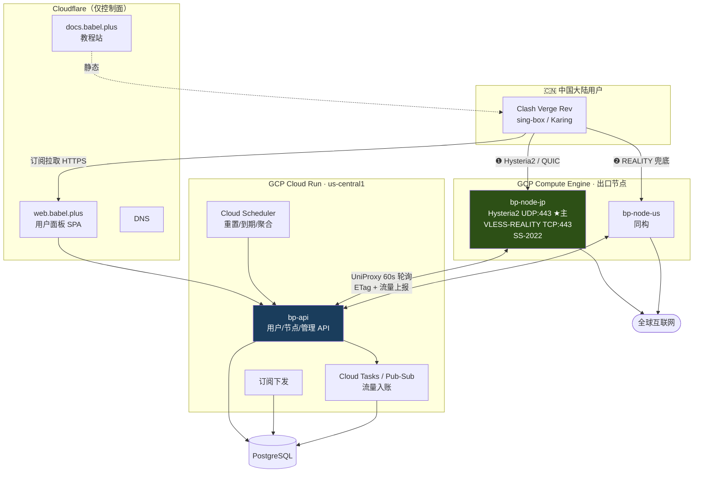
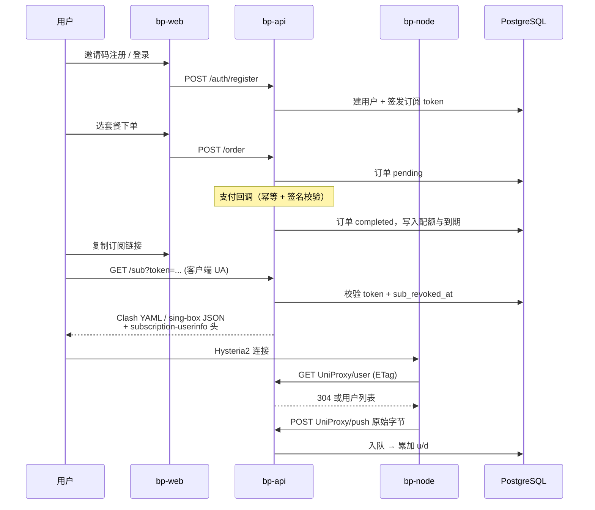

# 系统架构设计

> 日期：2026-08-16 · 性质：**设计方案** · 状态：**设计稿 v1**（2026-08-16，未实施）
> 事实基线：现有资产见 [as-built-gcp.md](as-built-gcp.md)；
> 面板选型依据 [panels-and-market.md](../01-research/panels-and-market.md) §6；
> 协议实测依据 [reference-repos.md](../01-research/reference-repos.md) §1.5
> 关联：[0001 CF ToS 裁决](../05-adr/0001-cloudflare-tos-risk.md)、
> [0002 通知通道裁决](../05-adr/0002-notification-channels.md)
> ⚠️ **本文写的是设计目标，不是当前实现。** 当前实现见 `as-built-*.md`。

---

## 1 · 三条主线

整套系统由三个**故障域互相隔离**的部分构成。这个划分是全篇的骨架：

| 面 | 职责 | 挂了会怎样 | 部署 |
|---|---|---|---|
| **数据面** | 真正转发流量 | 用户上不了网 | GCE 节点（多协议） |
| **控制面** | 账户/订阅/计费/后台/工单 | 用户上得了网，但买不了、改不了 | Cloud Run（API）+ 静态站（Web） |
| **恢复面** | 域名发现、失联广播 | 前两者挂了也救不回来 | 邮件 + 节点名 + 静态域名池 |

> **关键约束：三者不得共享单点。**
> 特别地，控制面挂掉**不能**导致已连接用户断线 —— 节点必须能在面板不可达时
> 用最后一次拉取的配置继续服务（见 §5.3）。

---

## 2 · 全局拓扑

**注意图中没有的东西**：Cloudflare **不在数据路径上**。
理由见 [ADR 0001](../05-adr/0001-cloudflare-tos-risk.md) —— 既是 ToS 合规考虑，
也因为 CDN 路径受单流 TCP 拥塞控制约束，实测吞吐只有 Hysteria2 的 1/5 左右。

---

## 3 · 数据面：协议栈

### 3.1 单节点并跑多协议（抄 Proxy_Skill）

同一台 VM 上并行开三个入口，成本几乎为零，抗封锁收益极大。
Reality 用 TCP:443、Hysteria2 用 UDP:443，**端口号相同但不冲突**。

| 优先级 | 协议 | 端口 | 定位 | 实测单流吞吐 |
|---|---|---|---|---|
| ❶ 默认 | **VLESS + XTLS-Vision + REALITY** | TCP 443 | **默认通路（下限稳）** | 269 KB/s |
| ❷ 加速 | **Hysteria2 + salamander obfs + 端口跳跃** | UDP 443 | **高丢包/晚高峰切换（上限高）** | **~1700 KB/s** |
| ❸ | Shadowsocks-2022 (`2022-blake3-aes-128-gcm`) | 高位端口 | 兜底 | 370 KB/s |
| ❹ 应急 | VLESS + XHTTP over CF CDN | CF anycast 443 | **默认关闭**，仅节点 IP 被封时下发启用 | 受 TCP 瓶颈约束 |

明确排除：VMess（特征明显）、Trojan-Go（2021 后无发布）、TUIC v5（SNI 暴露于 QUIC 审查）、
裸 SS-2022 作主力（高熵首包易筛）、裸 WireGuard（无抗审查设计）。
观察名单：**AnyTLS**（唯一针对 TLS-in-TLS 论文设计填充方案的协议），待实网数据后再评估。

#### 为什么默认是 REALITY 而不是吞吐更高的 Hysteria2

**这里存在一处调研内部冲突，必须显式记录而不是悄悄取一边。**

| 立场 | 依据 | 强度 |
|---|---|---|
| **Hysteria2 应为默认** | Proxy_Skill 一手实测：单流 370 → ~1700 KB/s，**4.6×** | 一手实测，但**单一网络、单一时段、4 轮轮询、仅 JP 节点** |
| **REALITY 应为默认** | REALITY 走 TCP:443 与海量正常 HTTPS 同形，封锁它附带损害极高；Hysteria2 走 UDP，**逐运营商逐时段的 QoS 降级方差极大** | 机制论证 + 行业共识 |

**裁决：REALITY 做默认，Hysteria2 做可切换的加速通路。**

理由是**方差而非均值**：Hysteria2 的期望吞吐更高，但**最坏情况更差** ——
UDP 被运营商 QoS 降级时它几乎不可用，而 REALITY 的下限稳定得多。
产品的默认值应当优化**首次使用成功率**，不是优化峰值性能；
一个新用户第一次连不上就流失了，不会有机会体验 4.6 倍。

同时下发两条并让用户（或客户端）择优，是成本最低的做法。
**但选路不能按延迟自动做** —— 实测证明 `url-test` 会稳定选错：
各健康节点延迟同在 100–250ms 噪声带内，吞吐却差 4–5 倍。
因此默认组用 **`fallback` 类型**（人工排序 + 失效自动跳过），
并在教程里明确引导用户「慢的时候切到 HY2 组试试」。

> **待实测项**：REALITY 与 Hysteria2 在电信/联通/移动三网、
> 晚高峰（19:00–24:00 CST）的真实可用性与吞吐。
> **若实测显示 UDP QoS 并不严重，本裁决应反转。**

### 3.2 节点端软件

选 **v2node**（MPL-2.0，2026 年仍活跃）而非 XrayR（已废弃、源码被删）、
V2bX（已归档）或 soga（闭源 + 绑定域名）。
协议保持 **UniProxy v1 兼容**，这样节点端不用自己写。

> 🔴 **两个版本兼容性地雷，必须在选定版本时验证：**
>
> 1. **mihomo 已正式放弃与 Xray ≥ v26.7.11 的 REALITY 兼容性。**
>    而 mihomo 是 Clash Verge Rev 等主流客户端的内核 ——
>    这意味着**服务端 Xray 版本直接决定了一大批客户端能否连上**。
>    升级 Xray 前必须先验证客户端侧兼容矩阵。
> 2. **Xray 重命名了配置字段**：`clients`→`users`、`dest`→`target`、
>    `publicKey`→`password`，且**保留了静默别名**。
>    静默别名意味着**配置写错不会报错，只会行为不符预期** —— 生成器必须显式用新字段名。

### 3.3 节点资源规范

- 机型 **`e2-small`**（按需，**不用 Spot** —— 回收 = 全体用户掉线 + IP 变更 + 订阅失效）
- 区域：**`asia-east2`（香港）为主**，`asia-northeast1`（东京）做 A/B
  > 香港是三大运营商国际互联最密集的落地点。物理下限：深圳 0.3ms / 上海 12ms / 北京 20ms。
  > ⚠️ 但香港**不解决晚高峰** —— POMACS 2020 实测 **71% 的瓶颈跳在中国境内纵深**。
- Debian 12
- **网络层级：Premium**（Standard 便宜一半且有 200 GiB/区域/月免费额度，
  但**不支持 IPv6**）。详见 [ADR 0004](../05-adr/0004-transport-hardening.md) §3.7 ——
  这是本项目论据最弱的一条裁决，且直接推高定价下限。
- 🔴 **「拿到哪个 IP」是一等变量，不是实现细节。** 实测证据：同一 `asia-east2` 区域内
  zone `-b` 绕道美国而 `-a`/`-c` 直连；`35.220.x` 对移动直连约 50ms 而 `34.92.x` 绕东京约 110ms。
  **开机后必须逐 IP 实测三网路由，不合格立即释放重开。**
- ⚠️ **GCP 上买不到 CN2 GIA，这是结构性的。** 实查 RIPEstat BGP：
  Google AS15169 的 335 个观测邻居中**没有任何中国大陆运营商 ASN**，与 AS4809 也无邻接。
- ❌ **Cloud Run 不能做数据面**：不支持裸 TCP/UDP（REALITY 与 Hysteria2 都跑不了）、
  请求最长 60 分钟硬上限、出口锁定 Premium 层级。
- ❌ GKE 过度设计（$0.10/集群/小时，零收益）。
- ⚠️ GCP Free Tier 的 `e2-micro` 仅限美区，对中国用户是最差位置，**对本项目基本无效**。
- 命名 `bp-node-{region}{n}`，网络标签 `bp-node`
- 保留静态外部 IP，被封后删除重新预留即可换 IP
- SSH 仅走 IAP（`35.235.240.0/20`），公网 22 由 deny 规则压制
- sysctl 调优与 systemd 硬化写法直接复用 Proxy_Skill 的
  （`LoadCredential` + `DynamicUser=true` + `ProtectSystem=strict`）

> ⚠️ 现有防火墙规则 `allow-xray-443` / `allow-hysteria-udp443` **没有 target tag**，
> 对 default 网络所有实例生效。新建节点会自动继承，但也意味着
> **必须同时打上能继承 SSH deny 的标签**，否则 22 端口裸奔。
> 详见 [as-built-gcp.md](as-built-gcp.md) §3。

---

## 4 · 控制面：部署形态

**API 与 Web 分开部署**（硬要求）。

| 组件 | 形态 | 说明 |
|---|---|---|
| `bp-api` | Cloud Run（无状态） | 用户 API + 节点 UniProxy API + 管理 API。运行时选冷启动友好的（Go / Node），**避免 PHP-FPM** |
| `bp-web` | 静态 SPA | 用户面板 + 后台两个 SPA，只调 `bp-api` |
| `bp-docs` | 静态站 | 教程与排障，**必须中国大陆可达**（本身不能需要梯子才能打开） |
| 数据库 | PostgreSQL | ⚠️ `sqladmin` API 当前**未启用**，需显式开启；也可考虑 serverless Postgres，见 §9 |
| 流量入账 | **Cloud Tasks / Pub-Sub push → Cloud Run** | **不要常驻 worker**，这样彻底不需要 `min-instances` |
| 定时任务 | Cloud Scheduler → Cloud Run | 流量重置、到期处理、日/月聚合、订单超时取消 |
| 配置下发 | **60 秒轮询 + ETag，不做 WebSocket** | Cloud Run 上 WS 长连最长 60 分钟、会话亲和只是 best-effort、有连接的实例按 instance-based 计费 —— 成本与复杂度远超收益 |

### 4.1 域名策略（三套独立域名池）

| 用途 | 域名 | 被封时的影响 |
|---|---|---|
| Web 面板 | `web.babel.plus` + 备用池 | 用户看不到面板，但**已连接不受影响** |
| API | 独立域名 + 备用池 | 客户端拉不到新订阅，节点拉不到配置 |
| 教程站 | `docs.babel.plus` + 备用池 | 用户无法自助排障 |

**三者必须是独立域名**，不能是同一域名的不同子域 —— GFW 的封锁粒度常在**主域名**级别。
注册商也应分散，且**注册商账号与 Cloudflare 账号分离**。

---

## 5 · 核心契约

### 5.1 节点 ↔ 面板（UniProxy v1 兼容）

| 端点 | 方向 | 说明 |
|---|---|---|
| `GET /api/v1/server/UniProxy/config` | 节点拉 | 节点自身配置。**必须支持 ETag + 304** |
| `GET /api/v1/server/UniProxy/user` | 节点拉 | 该节点的用户列表与密钥。**必须支持 ETag + 304** |
| `POST /api/v1/server/UniProxy/push` | 节点推 | 上报流量：`{uid: [upload, download]}`，**原始字节** |
| `POST /api/v1/server/UniProxy/alive` | 节点推 | 在线设备数（用于设备数限制） |

> **ETag 是性能命门**：节点每 60 秒轮询，不做 ETag 会把 DB 打爆。

**必须相对 Xboard 加固的三处**（原设计的安全底子不够）：

| Xboard 现状 | babel.plus 做法 |
|---|---|
| 全节点共用一个明文 `server_token`，走 query string（会进 access log） | **每节点独立密钥 + scope 白名单**，走 `Authorization: Bearer`，DB 存哈希，支持在线轮换与吊销 |
| 订阅 token 明文永久 32 位，泄露只能手工重置 | 独立 token 表（多条、可命名、可单独吊销）+ 内嵌签发时间 + `sub_revoked_at` 一键全撤 + 每次拉取写审计表 |
| 后台路径靠 `hash('crc32b', app.key)` 混淆，无 2FA | 后台**独立域名 + IP 白名单/IAP + 强制 TOTP**，不靠路径混淆 |

### 5.2 客户端 ↔ 面板（订阅下发）

- 按 `User-Agent` 分发格式：**Clash/mihomo YAML** / **sing-box JSON** / **base64**。
  这是与客户端生态的**硬接口，不能自创格式**。
- 必须返回 `subscription-userinfo` 响应头（上传/下载/总量/到期），
  客户端靠它显示流量条。
- 每次拉取写审计表（`user_id, request_ip, user_agent, request_at`）——
  **这是唯一能识别"账号共享"的数据来源，成本极低。**

### 5.3 面板不可用时节点必须继续工作

节点在拉取失败时**使用最后一次成功的配置继续服务**，并本地缓冲流量数据，
待面板恢复后补报。**控制面故障绝不能升级为数据面故障。**

---

## 6 · 数据模型要点

完整 DDL 见 [panels-and-market.md](../01-research/panels-and-market.md)。此处只记**设计要点**：

1. **可用性判定一条 SQL 覆盖**：`u + d < transfer_enable` AND (`expired_at IS NULL` OR 未过期) AND NOT `banned`。
   `expired_at IS NULL` 天然支撑「不限时套餐」。
2. **倍率在面板侧结算，节点只报原始字节** —— 节点无状态，改倍率不用重启节点。
   （不过第一阶段**不引入倍率**，见 [product-brief.md](../00-overview/product-brief.md) §6。）
3. **流量不落明细流水**：只在用户表累加 + 按天/月聚合到 `stat_user` / `stat_server`。
   **这是本业务的性能命门**，落明细必炸。
4. **热写字段拆表**：`used_traffic` / `online_at` 从主表拆到 1:1 的 `user_traffic`，
   减少行锁竞争。
5. **金额一律 integer 存分**，绝不用 float。倍率若引入则用定点整数（基数 1e9）。
6. **订单状态机**：`待支付 → 开通中 → 已完成`，旁支 `已取消` / `已折抵`；
   订单类型 `新购 / 续费 / 升级`，升级带折抵（`surplus_amount` + `surplus_order_ids`）。
7. **`reset_traffic_method` 多种重置模式** —— 竞品实测「重置日 = 订单日」，不是每月 1 号。

---

## 7 · 关键流程

---

## 8 · 代价

> ⚠️ 这一选择的代价，必须留在记录里而不是被措辞掩盖：
>
> 1. **自研而非 fork Xboard，意味着从零写账户/订单/工单/后台。**
>    换来的是与 Cloud Run 的运行时模型匹配（Xboard 默认镜像是 supervisor 管的多进程容器，
>    拆分部署仍需 4 个常驻服务 + Redis + **共享可写卷**，而 Cloud Run 没有跨服务共享卷）。
>    **这笔交易只有在我们确实需要 Cloud Run 的弹性与零运维时才划算 ——
>    如果最终发现要长期开 `min-instances`，那不如直接在 GCE 上跑 Xboard。**
> 2. **不做 WebSocket 配置下发，改 60 秒轮询**：配置变更最长有 60 秒延迟。
>    对本业务可接受，但「封禁一个滥用用户」也要等 60 秒才生效。
> 3. **数据面不走 Cloudflare**，放弃了流量免费与「IP 被封仍可用」的常态保障，
>    代价量化见 [ADR 0001](../05-adr/0001-cloudflare-tos-risk.md) §6。
> 4. **三套独立域名池 = 三倍的域名成本与运维复杂度**，且每套都要独立监控。

## 9 · 这次没有解决的

- [ ] **数据库选型未定。** Cloud SQL 需启用 `sqladmin` API 且最小实例约 $9–10/月起；
      Memorystore 约 $35/月对本项目不划算。候选还有 serverless Postgres（Neon/Supabase）
      或自建在 GCE 上。**这是下一个必须做的 ADR。**
- [ ] API 实现语言/框架未定（Go / Node / Python）。
- [ ] 缓存/在线态存储未定（Redis 太贵，可能用 Postgres + TTL 表或 Cloud Run 内存）。
- [ ] **教程站的中国大陆可达性需实测** —— 这是整个自助排障体系的单点。
- [ ] 节点自动 provisioning 与 IaC 未设计（Proxy_Skill 只有装机脚本，建机仍是手敲）。
- [ ] 节点健康探活的具体实现未定（不能用系统网络工具，需走内核 API）。
- [ ] 「域名被封」的自动检测与切换机制未设计。
- [ ] 现有 `vpn-us`/`vpn-jp` 是**原地改造**还是**新建 `bp-node-*` 并行**未裁决。
- [ ] 支付通道未定，见 [payments.md](../01-research/payments.md)。
