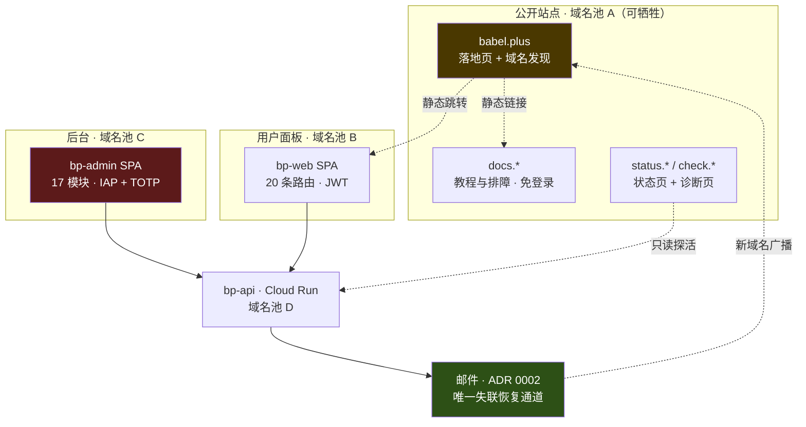
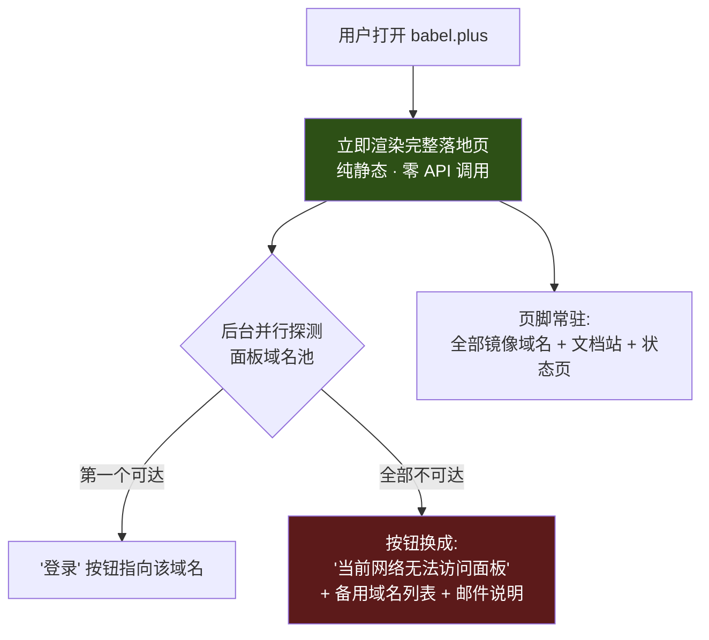

# 页面清单：用户面板 20 路由 · 后台 17 模块 · 公开站 7 页，P1 只做其中 28 个

> 日期：2026-08-16 · 性质：**设计方案** · 状态：**设计稿 v1**（2026-08-16）
> 事实基线：竞品路由与页面字段为 2026-08-16 一手走查所得（[competitor-conyss.md](../01-research/competitor-conyss.md) §3）；
> Xboard 后台功能面来自 [panels-and-market.md](../01-research/panels-and-market.md) §5.6；
> 大陆可达性数字来自 [ADR 0003](../05-adr/0003-web-hosting-and-reachability.md) §2 的 OONI 聚合
> 关联：[pricing-and-plans.md](pricing-and-plans.md)、[tutorials-spec.md](tutorials-spec.md)、
> [system-design.md](../02-architecture/system-design.md) §4–§5、[ADR 0002](../05-adr/0002-notification-channels.md)、
> [ADR 0003](../05-adr/0003-web-hosting-and-reachability.md)、
> [ADR 0010](../05-adr/0010-domain-strategy.md)（§8 第 1 条的域名策略、§5.1 的 `status.`/`check.`）、
> [ADR 0013](../05-adr/0013-billing-and-refund-rules.md) §3.6（§5.4 法务页的退款条款）、
> [ADR 0015](../05-adr/0015-client-strategy.md) §6（§3.2.3 的设备数口径）
> —— **三份均为提案，未批准**（2026-08-23）
> **2026-08-29 补登**：§3.2.3 与 §8 加落点，路由表、模块表与优先级一处未改。
> 读者：写前端的人、写 API 的人、排交付顺序的人。本文定义**有哪些页、每页干什么、先做哪些**。
> ⚠️ 本文写的是**设计目标**，不是当前实现。当前实现为零。

---

## 1 · 结论

**三套前端，互不共享域名、互不共享鉴权、互不共享故障域。**

| 前端 | 页面/模块数 | P1 | 域名 | 鉴权 | 大陆可达性要求 |
|---|---|---|---|---|---|
| **用户面板** `bp-web` | 20 条路由 | 12 | 独立主域名 + 备用池 | 自建 JWT | 高（被封时靠邮件 + 节点名广播恢复） |
| **后台** `bp-admin` | 17 个模块 | 11 | 另一个独立主域名 | IP 白名单/IAP + **强制 TOTP** | **不要求** —— 运维自备出网 |
| **公开站点** | 7 页 | 5 | 第三套域名，落地页**可牺牲** | 全部免登录 | **最高** —— 文档站是排障体系的单点 |

**总计 44 个页面/模块，P1 收敛到 28 个。** 其余 16 个不是「砍掉」，是排到 P2/P3。

相对竞品用户面板的净变化：**8 条路由 → 20 条**，其中

| 变化 | 数量 | 明细 |
|---|---|---|
| 保留 | 6 | `dashboard` `plan` `order` `invite` `ticket` `profile`（`profile` 大幅瘦身） |
| **删除** | 1 | `#/knowledge` —— 教程移出登录墙，见 §3.3 |
| 降级 | 1 | `#/node` 从 P1 降到 P2 —— 我们节点数是个位数，竞品是 58 个 |
| **新增** | 13 | 认证 4 + 收银台 1 + 订阅与设备 1 + 用量 1 + 钱包 1 + 公告 1 + 诊断 1 + 工单详情 1 + token 管理 1 + 用户侧 2FA 1 |

三条最重要的取舍，先说清楚：

1. **教程与排障文档不放在面板里。** 竞品的 `#/knowledge` 在登录墙之后 —— 用户最需要教程的时刻（连不上、订阅拉不到）恰恰是他打不开面板的时刻。这是 [ADR 0002](../05-adr/0002-notification-channels.md) §2.1 记录的**自我引用失效模式**，必须在信息架构上打破：文档站是**独立域名 + 免登录 + 纯静态**。
2. **用量可视化独立成页，不做成 dashboard 上的一个小图。** 竞品完全没有流量趋势图（[competitor-conyss.md](../01-research/competitor-conyss.md) §6），这是最便宜的差异化，但它需要一张新的聚合表（§3.2.7）。
3. **后台的每一个能改钱、改配额、改节点可用性的按钮，都要二次确认 + 审计日志。** 清单见 §4.4，共 **16 条**。

> ⚠️ **一处必须先解决的既有矛盾**：[system-design.md](../02-architecture/system-design.md) §2 的拓扑图用了
> `web.babel.plus` / `docs.babel.plus` 两个**子域**，而同一份文档的 §4.1 又写「三者必须是独立域名，
> **不能是同一域名的不同子域**」。两处互相矛盾。
> **本文按 §4.1 的更严要求排布**（独立主域名），并把这个矛盾登记进 §8。

---

## 2 · 全局约定

先把重复的部分抽出来，后面逐页只写差异。

### 2.1 API 端点命名的效力范围

**只有 `/api/v1/server/UniProxy/*` 是冻结契约**（照抄 Xboard，好让节点端直接用 v2node，见
[system-design.md](../02-architecture/system-design.md) §5.1）。
**面向用户与后台的 API 是我们自己的，没有兼容包袱**，因此本文放弃 v2board 的
`/api/v1/user/{resource}/{action}` 动作式命名，改用 REST。

> ⚠️ 本文列出的用户端/管理端端点名是**占位提案**，真正的冻结版本应写进
> `02-architecture/api-contract.md`（尚未存在，见 §8）。**不要照本文的端点名直接编码。**

### 2.2 加载 / 空 / 错误三态（全站统一，逐页只写例外）

| 态 | 统一规则 | 理由 |
|---|---|---|
| **加载** | 骨架屏，**不用居中 spinner**；骨架必须 200ms 内出现（本地渲染，不等 API） | 跨境 API 往返常在数百毫秒到数秒；spinner 在这个时长区间会被用户读成「卡死」 |
| **慢加载** | 超过 **3 秒**仍无响应，骨架下方插入提示条「跨境链路较慢，正在重试」+ 备用域名链接 | SIGMETRICS 2020：中国大陆 **>70% 的收发对每天有 5 小时以上速度低于 1 Mbps**（[ADR 0003](../05-adr/0003-web-hosting-and-reachability.md) §4）。**慢是常态，不是异常，不能当故障报** |
| **超时** | 前端超时阈值 **15 秒**，超时后自动向**备用 API 域名**重试一次，再失败才报错 | 常见的 5 秒阈值会在晚高峰把正常请求判死。⚠️ 15 秒是提案值，**需实测**按 P95 校准 |
| **空** | 必须给出**下一步动作按钮**，禁止只显示「暂无数据」 | 空态几乎都是转化位或引导位，逐页在 §3.2 指定 |
| **错误** | 必须区分 **401 / 403 / 4xx / 5xx / 网络不可达** 五类，文案与动作各不相同 | 把「你的账号过期了」和「我们的服务器挂了」显示成同一句话，会直接变成工单 |
| **网络不可达** | 展示**静态内嵌**的备用域名列表（不经 API）+ 一句话：「**你的订阅仍然有效，已连接的设备不受影响**」 | 控制面故障不得被用户理解为数据面故障（[system-design.md](../02-architecture/system-design.md) §1） |
| **5xx** | 引导到 `status.*` 状态页，不要求用户提工单 | 服务端故障时工单洪峰毫无价值 |

### 2.3 移动端口径

用户主要在手机上操作（复制订阅链接、扫码、付款、提工单都发生在手机上）。三档要求：

| 档 | 含义 | 适用 |
|---|---|---|
| **M1 移动优先** | 先设计 375px，桌面是放大版；不得出现横向滚动 | 用户面板**全部** 20 条路由、公开站全部 7 页 |
| **M2 移动必须可用** | 桌面优先，但核心操作在手机上能完成；表格**卡片化**降级 | 后台的工单回复、节点启停、订单查单 |
| **M3 桌面优先** | 手机上可读即可，不保证可操作 | 后台的统计、配置、批量操作 |

**M1 的一条硬规则**：任何超过 4 列的表格在 <768px 时必须转成卡片列表，**不允许横向滚动表格**。
订单、节点、流量记录三处是重灾区。

### 2.4 大陆可达性口径

三套域名池各自独立被封。本文逐页标注的不是「这一页会不会被封」（同域名池同命运），而是
**「这一页不可达时，用户还有没有别的路」**：

| 标记 | 含义 |
|---|---|
| **有替代** | 该页失效不阻断用户，另有路径（订阅仍在客户端里、教程在另一个域名、邮件里有链接） |
| **无替代** | 该页失效则该功能完全失效，只能靠 [ADR 0002](../05-adr/0002-notification-channels.md) 的三条恢复路径 |
| **本身是恢复路径** | 该页必须比其他页更抗封（更多镜像、更小体积、零 API 依赖） |

---

## 3 · 用户面板 `bp-web`

### 3.1 路由总表

| # | 路由 | 职责 | 登录 | 移动 | 不可达后果 | P | vs 竞品 |
|---|---|---|---|---|---|---|---|
| 1 | `/auth/login` | 邮箱 + 密码登录 | ❌ | M1 | 无替代 | **P1** | 竞品有（未在 hash 路由中暴露） |
| 2 | `/auth/register` | **邀请码**注册 | ❌ | M1 | 有替代（可延后注册） | **P1** | 改：邀请码**必填**，非可选 |
| 3 | `/auth/forgot` | 找回密码（发邮件） | ❌ | M1 | 无替代 | **P1** | 保留 |
| 4 | `/auth/reset?token=` | 邮件链接落地，设新密码 | ❌ | M1 | 无替代 | **P1** | 保留 |
| 5 | `/dashboard` | 订阅概览 + 公告 + 四快捷入口 | ✅ | M1 | 有替代 | **P1** | 保留结构，卡片内容改 |
| 6 | `/subscribe` | **订阅链接 + 设备管理** | ✅ | M1 | 无替代 | **P1** | **新增**（竞品散落在 dashboard/profile） |
| 7 | `/plan` | 套餐选购 | ✅ | M1 | 有替代（公开站 `/pricing`） | **P1** | 保留，加折扣与设备数列 |
| 8 | `/order` | 订单列表 | ✅ | M1 | 有替代 | **P1** | 保留 |
| 9 | `/order/:trade_no` | 订单详情 + **USDT 收银台** | ✅ | M1 | **无替代**（付款中断=丢单） | **P1** | **新增**（竞品是弹窗） |
| 10 | `/ticket` | 工单列表 | ✅ | M1 | 无替代 | **P1** | 保留 |
| 11 | `/ticket/:public_id` | 工单会话 | ✅ | M1 | 无替代 | **P1** | **新增**（拆详情页） |
| 12 | `/profile` | 安全 + 通知偏好 | ✅ | M1 | 有替代 | **P1** | 保留但**大幅瘦身** |
| 13 | `/usage` | **用量可视化** | ✅ | M1 | 有替代 | P2 | **新增** —— 竞品完全没有 |
| 14 | `/wallet` | 余额与流水 | ✅ | M1 | 有替代 | P2 | **新增**（竞品在 profile 里） |
| 15 | `/invite` | 邀请码与返佣 | ✅ | M1 | 有替代 | P2 | 保留 |
| 16 | `/node` | 节点列表 | ✅ | M1 | 有替代（客户端里就有） | P2 | 保留但**降级** |
| 17 | `/notice` | 公告列表 | ✅ | M1 | **本身是恢复路径** | P2 | **新增**（竞品只有 dashboard 轮播） |
| 18 | `/diagnose` | **账号侧自助诊断** | ✅ | M1 | 有替代（`check.*`） | P2 | **新增** —— 竞品零排障 |
| 19 | `/subscribe/tokens` | 多订阅 token 管理 | ✅ | M1 | 有替代 | P3 | **新增** —— 安全加固第 2 条 |
| 20 | `/profile/2fa` | 用户侧 TOTP（可选） | ✅ | M1 | 有替代 | P3 | **新增** |
| — | `#/knowledge` | ~~教程知识库~~ | — | — | — | **删除** | 移到 `docs.*`，见 §3.3 |

### 3.2 逐页明细

#### 3.2.1 认证四页（#1–#4）

| 路由 | 关键 UI | 调用 API | 空 / 错态 |
|---|---|---|---|
| `/auth/login` | 邮箱、密码、「记住我」、找回密码链接、**页脚常驻备用域名列表** | `POST /api/v1/auth/login` | 401 → 「邮箱或密码不正确」（**不区分哪个错**，防枚举）；429 → 显示解锁倒计时；网络不可达 → §2.2 备用域名块 |
| `/auth/register` | **邀请码（必填）**、邮箱、密码、密码强度条、条款勾选 | `POST /api/v1/auth/register`、`GET /api/v1/invite/verify?code=` | 邀请码无效/已用尽 → 明确区分这两种，并给出「找邀请你的人要一个」；邮箱已注册 → 引导到登录而不是报错 |
| `/auth/forgot` | 邮箱输入 | `POST /api/v1/auth/password/forgot` | **无论邮箱是否存在都返回同样的成功文案**（防枚举）；成功页必须写「**请检查垃圾箱**，并把发信域名加入白名单」+ 一条到 QQ 邮箱白名单设置的说明链接 |
| `/auth/reset` | 新密码、确认 | `POST /api/v1/auth/password/reset` | token 过期 → 一键重新发送，不要求用户回到上一页 |

**三条设计约束**：

1. **人机验证不能用 Cloudflare Turnstile** —— 它不在 Cloudflare China Network 的可用产品清单里
   （[ADR 0003](../05-adr/0003-web-hosting-and-reachability.md) §3.2）。替代方案见 §5.3。
2. **注册页的第一道闸是邀请码本身**，不是验证码。邀请制注册（[product-brief.md](../00-overview/product-brief.md) §4）
   已经把批量注册的成本抬到很高，验证码在这里的边际收益很低。
   真正需要防刷的是 `/auth/login` 与 `/auth/forgot`（后者会消耗邮件配额，而邮件是核心基础设施）。
3. **找回密码流程的成功率 = 邮件送达率。** [ADR 0002](../05-adr/0002-notification-channels.md) §5 已把邮件
   从「配置项」升级为「核心基础设施」。注册成功页必须引导用户把发信域名加白名单
   —— QQ 邮箱官方文档确认**白名单优先级高于黑名单与反垃圾规则**
   （[admin-support-docs.md](../01-research/admin-support-docs.md) §3.2）。这是**零成本、高回报**的一步。

#### 3.2.2 `/dashboard` — 仪表盘

竞品的结构是对的（公告轮播 + 订阅卡 + 四快捷入口），**结构保留，内容全换**。

| 区块 | 关键 UI | 调用 API | 相对竞品 |
|---|---|---|---|
| 公告轮播 | 最近 **3** 条 + 「查看全部」→ `/notice` | `GET /api/v1/notices?limit=3` | 竞品轮播 4 条且没有列表页 |
| **订阅卡** | 套餐名、到期日 + 剩余天数、**「已用 X / 总 Y」进度条**、**「重置日 = 订单日」的明示**、设备 `n/N` | `GET /api/v1/subscription` | **加设备数**；**加重置日说明**（[tutorials-spec.md](tutorials-spec.md) §5：这是高频误解） |
| 四快捷入口 | `查看教程`（→ `docs.*` 外链）/ `一键订阅` / `续费` / `遇到问题`（→ `/diagnose`） | — | 结构照抄，目标改：教程指向站外、问题指向诊断页 |
| **失联提示条** | 页面底部常驻：当前域名 + 备用域名列表 | 静态内嵌 | **新增**，[ADR 0003](../05-adr/0003-web-hosting-and-reachability.md) §5 硬要求 |

三态：

- **加载**：订阅卡骨架 + 公告骨架，两者独立请求，**任一失败不影响另一个**。
- **空（无有效订阅）**：**这是最重要的空态**。不显示「暂无订阅」，显示「选一个套餐开始」+ 直达 `/plan` 的主按钮 + 一句「不确定选哪个？看用量说明」。
- **空（无公告）**：整块隐藏，不占位。
- **错**：订阅卡 5xx → 「暂时读不到订阅状态，**你已连接的设备不受影响**」+ 状态页链接。

#### 3.2.3 `/subscribe` — 订阅链接与设备管理（新增，本项目最重的一页）

竞品把订阅链接埋在 dashboard 的「一键订阅」按钮里、把重置埋在 profile 里、**完全没有设备列表**。
我们把这三件事合并成一页，因为它们是同一个心智单元：「谁在用我的订阅」。

| 区块 | 关键 UI | 调用 API |
|---|---|---|
| 订阅链接 | 链接文本框（**默认打码**）、复制按钮、二维码、**三种格式切换**（Clash YAML / sing-box JSON / base64）、各客户端「一键导入」按钮 | `GET /api/v1/subscription` |
| 客户端引导 | 按 UA 猜测平台并高亮对应客户端卡片，每张卡片链到 `docs.*` 的对应教程 | 静态 |
| **设备** | 在线设备列表：IP 归属地、最后活跃时间、协议、**「踢下线」按钮**；顶部 `n / N` 计数 | `GET /api/v1/devices`、`DELETE /api/v1/devices/:id` |
| 安全 | **「重置订阅」**（`sub_revoked_at` 一键全撤）、最近 10 次订阅拉取审计（时间 / IP / UA） | `POST /api/v1/subscription/revoke`、`GET /api/v1/subscription/fetch-log` |

**设备数是我们的档位杠杆（2 / 5 / 10，[pricing-and-plans.md](pricing-and-plans.md) §3.1），
而竞品三档统一为 3。杠杆用得好是差异化，用得糙就是工单发生器。** 三条必须做的事：

1. **计数口径必须写在页面上。** Xboard 的 `alivelist` 是**按 IP** 计的（[panels-and-market.md](../01-research/panels-and-market.md) §5.2 #11，**待核实**具体实现）。
   若确实按 IP，则同一台手机在 Wi-Fi 与蜂窝之间切换会**占两个名额** —— 在设备数 = 2 的档位上，
   一个人一台手机一台电脑就已经超限。**这不是 bug，是口径，必须在页面上直说。**
2. **必须有用户自助「踢下线」，不能只等 TTL 过期。** 否则用户换手机、重装客户端就会撞墙并直接开工单。
3. **`n / N` 达到上限时不显示红色报错**，显示「已达上限，需要更多设备可以升级套餐」+ 「踢掉一个」——
   这是升档转化位，不是错误提示。

> **2026-08-29 补登落点：设备数的产品口径已裁决（roadmap B16）—— [ADR 0015](../05-adr/0015-client-strategy.md) §6（提案，未批准）。**
>
> **上面第 1 条的「待核实」可以关掉一半：口径确实是按 IP**（roadmap B16 已订正：节点上报 `{uid:["ip1","ip2"]}`、
> 面板回 `{"alive":{uid:count}}`）。但 0015 §6.1 补了一条**更要紧、本节没有的事实**：
> `GetUserAlive` 在 `r == nil || r.RawResponse == nil || r.StatusCode() >= 399` 时把在线列表置为**空 map 并返回 nil error**
> （出处：`docs/evidence/v2node-401-behavior-20260821/` §3），**401/403 也走这个分支** ——
> 也就是说设备数限制会**静默失败开放（全员放行）**。
> **我们有的是一个按 IP 计、有 60 秒延迟、拿不到 `alivelist` 时会失败开放的计数器：它是一个信号，不是一道围栏。**
>
> **0015 §6.2 的裁决：表述成容量承诺，而不是执行承诺。** 对外统一文案见 §6.2 原文（套餐页 / 本页 / 教程共用一段）。
> 三条**不许写**：「严格限制 / 超出将被封禁 / 系统会自动踢下线」（证明不了执行过）、
> 「这个限制目前可能不生效」（等于教人钻空子）、以及把设备数写进**服务条款、计费口径、退款理由**。
> ⚠️ 0015 §6.2 还点名删掉了草稿里的「拒新不踢旧」断言 —— 那是 [user-journey](user-journey.md) §12.2 的**待核实**项，
> 关掉它的方法是读 v2node 的 limiter 源码（0015 估 1 小时），**不是闸门，但发布对外文案前必须做**。
>
> ⚠️ **对 `2 / 5 / 10` 这个档位杠杆的直接冲击**：0015 §6.3 **整条删除**了档位数字的提案，
> 理由是「定价必须以流量为主要杠杆重做一次，否则 2/5/10 只是一个装饰性的数字」，
> 并明写它与 [pricing-and-plans-revision-20260823](pricing-and-plans-revision-20260823.md)
> （那份把 2/5/10 原样保留、且写「设备数是**档位阶梯的全部承重结构**」）**必须对齐后才能一起批准**。
> 这与本文 §7 代价 3 的撤回条件（设备数相关工单 > 10% 则改回统一 5 台）是同一根线。
> 🔴 **本节今天不改写**：0015 状态是**提案，未批准**（2026-08-23）。

三态：

- **空（无设备在线）**：「还没有设备连接过」+ 直达教程站的「3 分钟接入」链接。**这是新用户最重要的一步。**
- **空（无拉取记录）**：「还没有客户端拉取过订阅」—— 与上一条含义不同，要分开显示。
- **错（订阅接口 5xx）**：**订阅链接必须从本地缓存回显**，并标注「以下为上次读取的链接，可能已过期」。用户来这一页十有八九是为了复制链接，读不到就是最糟的体验。

#### 3.2.4 `/plan` — 套餐

| 区块 | 关键 UI | 调用 API |
|---|---|---|
| Tab | 「按周期」/「按流量包」两个 tab（照抄竞品的信息架构） | `GET /api/v1/plans` |
| 套餐卡 | 名称、流量/30 天、**设备数（2/5/10，加粗）**、价格、**周期折扣角标** | 同上 |
| 周期选择 | 月 / 季（**9 折**）/ 半年（**85 折**）/ 年（**75 折**） | 同上 |
| **诚实声明** | 「**不承诺流媒体解锁**」，与卖点同等字号，不放在折叠区 | 静态 |

**相对竞品的四处改动，逐条给理由**：

| 改动 | 理由 |
|---|---|
| 加长周期梯度折扣 | 竞品季付 = 3×月付、半年付 = 6×月付，**长周期零折扣**（[competitor-conyss.md](../01-research/competitor-conyss.md) §3.3 实测订单流水）。用户没有任何理由预付。折扣提升 LTV 与现金流，且**摊薄 USDT 归集成本** —— 一笔 TRC20 归集 $2.13–4.31，对 ¥30–90 的月付订单是 **20–85% 的侵蚀**（[pricing-and-plans.md](pricing-and-plans.md) §4.2） |
| **设备数加粗做主卖点** | 竞品三档统一为 3，未作杠杆 |
| **删除「峰值带宽 500/1000 Mbps」分档** | 跨境链路的真实瓶颈在中国境内纵深（SIGMETRICS 2020，71% 的瓶颈跳在境内），这个数字对用户没有意义，是营销噪音 |
| **加「不承诺流媒体解锁」** | GCP IP 段普遍被主流流媒体平台封禁（[product-brief.md](../00-overview/product-brief.md) §3）。竞品把「流媒体解锁」写成三档共有卖点 —— 我们做不到就不能写。**这是结构性劣势，只能诚实标注** |

三态：**空**（无可售套餐）→ 「暂时没有开放的套餐，有需要请提工单」；**错** → 引导公开站 `/pricing`（静态副本，永远可读）。

#### 3.2.5 `/order` 与 `/order/:trade_no`

| 页 | 关键 UI | 调用 API |
|---|---|---|
| `/order` | 列表：订单号 / 类型（新购·续费·升级）/ 金额 / 状态 / 时间；操作：查看详情、取消。**移动端卡片化** | `GET /api/v1/orders` |
| `/order/:trade_no` | 明细 + 折抵金额 + 优惠码 + **支付区** | `GET /api/v1/orders/:trade_no` |

**收银台必须独立成页，不能做成弹窗**（竞品是弹窗）。理由是 USDT 支付的形态与卡支付完全不同：

| USDT 收银台元素 | 为什么必须有 |
|---|---|
| 收款地址 + 二维码 + **精确到分位的唯一金额** | 我们用「小地址池 + 金额唯一性」匹配订单，不做一单一地址（[pricing-and-plans.md](pricing-and-plans.md) §4.2） |
| **汇率锁定倒计时** | 下单时锁定 CNY→USDT 汇率写进订单，超时作废重新报价 |
| 链选择（TRC20 / ERC20 / BEP20）+ **「从交易所提币请选 TRC20」提示** | 用户手上的 U 基本在 TRC20，且交易所代付能量 |
| **`underpaid` 状态的显式界面** | 金额唯一性匹配决定了少付一定会发生（[pricing-and-plans.md](pricing-and-plans.md) §4.4）。必须显示「已收到 X，还差 Y」而不是笼统的「支付失败」 |
| 「已付款，等待确认」轮询区 | 链上确认有分钟级延迟；**必须能关掉页面再回来**，所以要独立路由而非弹窗 |

三态：

- **空**（无订单）→ 「还没有订单」+ 直达 `/plan`。
- **加载**（等待链上确认）→ 进度条 + 预期确认时间 + **「可以关闭此页，到账后会发邮件」**。
- **错**（回调失败但链上已付）→ **必须有「我已付款，帮我查一下」按钮**触发主动查单。回调不可信，NewAPI 的易支付回调漏洞就是先例（[pricing-and-plans.md](pricing-and-plans.md) §4.1）。这个按钮是用户侧的最后防线。

#### 3.2.6 `/ticket` 与 `/ticket/:public_id`

| 页 | 关键 UI | 调用 API |
|---|---|---|
| `/ticket` | 列表：`public_id` / 主题 / 分类 / 优先级 / 状态 / 最后回复；「新建工单」按钮 | `GET /api/v1/tickets` |
| `/ticket/:public_id` | 会话流、回复框、附件上传、状态标签、**建单时的诊断上下文快照** | `GET /api/v1/tickets/:id`、`POST /api/v1/tickets/:id/messages` |

**新建工单表单的关键设计**：分类必选（`subscription` / `node-down` / `billing` / `account`），
且**选定分类后先弹出对应的排障文档链接**，给一个「我已经看过了，还是要提单」的按钮。
这是把 [tutorials-spec.md](tutorials-spec.md) 的 12+ 篇排障文档接到工单入口上的唯一位置 ——
文档写了没人看，等于没写。

**建单时自动带上 `context` JSONB 快照**（订阅 id、套餐、客户端 UA、最近节点、设备数、
最近一次订阅拉取时间），对应 [admin-support-docs.md](../01-research/admin-support-docs.md) §2.4 的
`tickets.context`。理由：工单记录的是「报障当时的事实」，用户事后续费或换节点不应改变诊断上下文。

三态：**空** → 不是「暂无工单」，而是排障决策树的入口 + 「大部分问题在这里能自己解决」；
**错（附件上传失败）** → 保留已输入的正文，**绝不清空**。

> ⚠️ `ticket_messages.is_internal` 是整个系统最容易出安全事故的一列。
> 用户侧查询必须走**固定带 `is_internal = false` 的视图或方法，不接受调用方传参决定**
> （[admin-support-docs.md](../01-research/admin-support-docs.md) §2.4）。

#### 3.2.7 `/usage` — 用量可视化（新增，最便宜的差异化）

竞品**完全没有流量趋势图**，只有 dashboard 上一行「已用 3.55 GB / 总计 100.00 GB」。

| 区块 | 关键 UI | 调用 API | 数据来源 |
|---|---|---|---|
| 日流量柱状图 | 近 30 天，上传/下载分色 | `GET /api/v1/usage/daily?days=30` | `stat_user` 日聚合 |
| 周期进度 | 已用 / 配额、**距重置 N 天**、按当前速率的耗尽预测 | `GET /api/v1/subscription` | — |
| **按节点分布** | 环图 + 列表 | `GET /api/v1/usage/by-node` | ⚠️ **需要新表**，见下 |
| 订阅拉取审计 | 最近 10 次：时间 / IP 归属地 / UA | `GET /api/v1/subscription/fetch-log` | 拉取审计表 |

**两条必须记录的工程事实**：

1. **「按节点分布」需要一张 `system-design.md` §6.3 里没有的表。** 现有聚合口径只有
   `stat_user`（用户维度）与 `stat_server`（节点维度），**没有 (user × server) 交叉维度**。
   要做这个图必须加 `stat_user_server(user_id, server_id, date, u, d)`。
   量级估算：**100 用户 × 10 节点 × 30 天 ≈ 3 万行/月**，对 PostgreSQL 是噪音级，可以做。
   但这条要写进数据模型，不能等到写前端时才发现没数据。
2. **订阅拉取审计表本来就要建**（[system-design.md](../02-architecture/system-design.md) §5.2：
   「这是唯一能识别账号共享的数据来源，成本极低」）。**把它直接展示给用户，边际成本为零，
   但价值很高** —— 用户自己就能发现订阅被白嫖，然后自助重置，不用开工单。

三态：

- **空（新用户，无历史数据）**：**这是最需要认真做的空态**。日曲线在用户注册后至少 1 天才有数据。
  不显示空白图表，显示「用满一天后这里会出现流量曲线」+ 当前实时累计值。
- **加载**：图表区骨架，**不要让图表从 0 动画增长到实际值** —— 在慢网络下会被误读为数据错误。
- **错**：聚合表读失败 → 降级显示 dashboard 那个总量进度条（数据源不同，更可靠）。

**优先级定为 P2 而不是 P1 的理由**：P1 上线那天，`stat_user` 里一行数据都没有，图表页是空的。
先上 dashboard 的总量进度条（P1），积累 30 天数据后再上曲线页（P2）。

#### 3.2.8 `/diagnose` — 账号侧自助诊断（新增）

**要先说清楚它和 `check.babel.plus` 的分工，否则会做重。**

| 页 | 位置 | 登录 | 回答的问题 |
|---|---|---|---|
| `/diagnose` | 面板域名 | ✅ 要 | **「我的账号有没有问题」** |
| `check.*`（§5.1 #6） | 公开域名 | ❌ 不要 | **「我的网络有没有走代理、走的是谁」** |

用户连不上时通常打不开面板 —— 所以 `check.*` 是排障主入口，`/diagnose` 是它的补充。
**两个都要有，但 `check.*` 更重要。**

`/diagnose` 的检查项（每项一行，红/黄/绿三态 + 一句人话解释 + 一个动作按钮）：

| 检查项 | 判据 | 失败时的动作 |
|---|---|---|
| 账号状态 | `banned` = false | → 提工单 |
| 订阅有效期 | `expired_at` 未过 | → `/plan` 续费 |
| 流量余额 | `u + d < transfer_enable` | → 买流量包 |
| 设备数 | 在线数 ≤ `device_limit` | → `/subscribe` 踢下线 |
| 订阅可拉取 | 服务端自测：从 API 侧拉一次自己的订阅，返回 HTTP 状态与字节数 | → 订阅类排障文档 |
| 最近拉取记录 | 有无、时间、IP | → 若为陌生 IP，引导重置 token |
| 节点健康 | 各节点最后上报时间 | → 若节点侧异常，显示「已知问题」而不是让用户排查自己 |
| **诊断码** | 一键生成，包含上述全部结果 | 提工单时自动填入 `tickets.context` |

> 前四项覆盖了「能拉到订阅但连不上」的绝大多数成因，而这四项**用户在客户端里一个都看不到**。
> 这一页的价值就在这里。

三态：**加载** → 逐项流式出结果，不等全部完成（各项互相独立）；**错（某项检查本身失败）** → 该项显示灰色「检测不可用」，**不能显示成红色失败** —— 检测失败和检测到失败是两回事。

#### 3.2.9 其余页（#12、#14–#17、#19、#20）

| 路由 | 职责与关键 UI | 调用 API | 相对竞品 / 三态要点 |
|---|---|---|---|
| `/profile` | **瘦身后只剩三块**：改密码、通知开关（到期 / 流量 / 工单，三个独立）、Telegram 绑定（**P3，明确标注「大陆不可用」**） | `GET/PATCH /api/v1/me`、`POST /api/v1/me/password` | 竞品的钱包 → `/wallet`、重置订阅 → `/subscribe`。**Telegram 绑定必须写明大陆不可达**：OONI 实测 `api.telegram.org` 异常 48 / 正常 0，Telegram 整体 anomaly 12,215 / ok 253 ≈ 98%（[ADR 0002](../05-adr/0002-notification-channels.md) §3.1）。**不能让用户误以为绑了就能收到通知** |
| `/wallet` | 余额、流水（充值 / 消费 / 佣金划入）、**「余额仅可消费，不可提现」常驻声明** | `GET /api/v1/wallet`、`GET /api/v1/wallet/transactions` | 从 profile 拆出。声明是**资金合规底线**（[product-brief.md](../00-overview/product-brief.md) §6），必须常驻而非藏在条款里。空态 → 「还没有余额记录」 |
| `/invite` | 邀请码列表（可生成多个）、已注册人数、**佣金 10%**、`确认中` / `累计获得` 两段式、「划转到余额」 | `GET /api/v1/invites`、`POST /api/v1/invites`、`POST /api/v1/invites/transfer` | 照抄竞品的两段式（退款冷静期防套利，设计正确）。**P2 而非 P1**：邀请制下第一阶段由后台统一发码即可，用户自助生成可以晚做 |
| `/node` | 节点列表：名称、地区、**倍率恒为 1x**、在线状态 | `GET /api/v1/nodes` | **降级 P2**。竞品 58 个节点需要一个列表页，我们第一阶段是个位数，客户端里就能看全。**不引入倍率**（[product-brief.md](../00-overview/product-brief.md) §6），所以倍率列可以直接不显示 |
| `/notice` | 公告列表 + 详情，带发布日期 | `GET /api/v1/notices` | **新增**。理由：公告兼作**域名广播位** —— 竞品置顶公告第一条即「官网域名（防失联）」，2023-06-03 发布并长期置顶（[competitor-conyss.md](../01-research/competitor-conyss.md) §2）。dashboard 只轮播 3 条，历史公告必须可查 |
| `/subscribe/tokens` | 多 token 列表（命名、创建时间、最后使用、单独吊销） | `GET/POST/DELETE /api/v1/subscription/tokens` | **新增，安全加固第 2 条**。P1 只做 `/subscribe` 上的「一键全撤」；多 token 是 P3。理由：多 token 的价值在「手机一个、电脑一个、丢了单独撤」，这对个位数设备的用户是奢侈品 |
| `/profile/2fa` | 用户侧 TOTP 绑定与恢复码 | `POST /api/v1/me/2fa/*` | **新增，P3**。管理员 TOTP 是 P1 强制（§4.1），用户侧是可选项 |

### 3.3 为什么删掉 `#/knowledge`

这是本节唯一的**删除**，需要单独交代。

| 竞品做法 | 问题 | 我们的做法 |
|---|---|---|
| 教程在面板内，`#/knowledge`，**需登录** | 用户最需要教程的时刻是「连不上 / 订阅拉不到」，而那个时刻他多半也打不开面板 —— [ADR 0002](../05-adr/0002-notification-channels.md) §2.1 的**自我引用失效模式** | 教程移到 `docs.*`：**独立主域名 + 免登录 + 纯静态 + 本地搜索索引** |
| 教程与面板同域名 | 面板域名被封 = 教程一起没了 | 独立域名池，两者互不牵连 |
| 8 篇教程，**零排障文档** | 真实工单绝大多数不是「不会装」而是「装好了不通」 | 30+ 篇，其中排障 12+ 篇（[tutorials-spec.md](tutorials-spec.md) §1） |

面板里保留的只有**链接**：dashboard 的「查看教程」快捷入口、每篇客户端卡片上的教程链接、
工单分类选定后弹出的对应排障篇。**链接是廉价的，内容不重复放。**

> ⚠️ 代价：教程站是**新的单点**，且它自己必须在大陆可达（[tutorials-spec.md](tutorials-spec.md) §6）。
> 这个可达性**尚未实测**，是整个自助排障体系的最大不确定性。

---

## 4 · 后台 `bp-admin`

### 4.1 鉴权：三道闸，缺一不可

Xboard 的后台靠 `hash('crc32b', app.key)` 做路径混淆，**无 2FA**
（[panels-and-market.md](../01-research/panels-and-market.md) §5.6 #2）。路径混淆不是安全措施，只是拖延。

| 闸 | 做法 | 说明 |
|---|---|---|
| 1 | **独立主域名** | 与用户面板、公开站不同的主域名。不做子域，不做路径混淆 |
| 2 | **IP 白名单 / GCP IAP** | Cloud Run 加 `--iap` 标志 + 授予 IAP service agent invoker 权限，认证零代码（[admin-support-docs.md](../01-research/admin-support-docs.md) §1.4） |
| 3 | **强制 TOTP** | 应用层第二因子，**不接受关闭**。IAP 与 TOTP 是两套独立凭据，任一泄漏不足以进入 |

> 🔴 **IAP 引入一个必须写进 runbook 的自我引用失效模式**：IAP 要求 Google 身份，而
> `google.com` 在中国大陆自 2014 年起被完全封锁。**服务出故障时，身处大陆的运维自己也进不了后台。**
> 因此**必须准备一条不依赖本服务的备用出网路径**（另一家商业服务 / 国际漫游 / 境外跳板），
> 并定期演练。这不是可选项。

**后台的大陆可达性要求是「不要求」** —— 这是有意的取舍：把可达性预算全部花在用户面板与文档站上。

### 4.2 模块总表

| # | 模块 | 路由 | 移动 | P | 说明 |
|---|---|---|---|---|---|
| 1 | 运营看板 | `/admin` | M3 | **P1** | 今日订单/额、新注册、总流量、待回工单、节点异常 |
| 2 | **用户管理** | `/admin/users`、`/admin/users/:id` | M3 | **P1** | 全系统最危险的模块 |
| 3 | **订单管理** | `/admin/orders`、`/admin/orders/:trade_no` | M2 | **P1** | 涉资金 |
| 4 | 套餐管理 | `/admin/plans` | M3 | **P1** | — |
| 5 | **节点管理** | `/admin/nodes`、`/admin/nodes/:id` | **M2** | **P1** | 手机上要能紧急停用节点 |
| 6 | **节点密钥** | `/admin/node-keys` | M3 | **P1** | 安全加固第 1 条的落地页 |
| 7 | 流量统计 | `/admin/stats` | M3 | **P1** | 成本核算的唯一依据 |
| 8 | **工单处理** | `/admin/tickets`、`/admin/tickets/:id` | **M2** | **P1** | 手机上要能回工单 |
| 9 | 邀请与返佣 | `/admin/invites` | M3 | **P1** | 邀请制注册 → 发码是 P1 能力 |
| 10 | **审计日志** | `/admin/audit` | M3 | **P1** | **append-only，无删除入口** |
| 11 | 管理员账号 | `/admin/admins` | M3 | **P1** | TOTP 管理 |
| 12 | 公告管理 | `/admin/notices` | M3 | P2 | 兼域名广播位 |
| 13 | 优惠码 | `/admin/coupons` | M3 | P2 | — |
| 14 | 支付与对账 | `/admin/payments` | M3 | P2 | 通道配置 + 链上查单 |
| 15 | 邮件与送达 | `/admin/mail` | M3 | P2 | 模板 + 送达日志 + 退信 |
| 16 | 系统配置 | `/admin/settings` | M3 | P2 | KV 表 + 热生效 |
| 17 | 域名池与可达性 | `/admin/domains` | M3 | P3 | 镜像域名状态看板 |

### 4.3 逐模块：能看什么 / 能改什么 / 危险在哪

| 模块 | 能看 | 能改 | 危险操作（见 §4.4 编号） |
|---|---|---|---|
| **用户管理** | 列表（邮箱、套餐、流量、到期、设备数、状态、注册时间、邀请人）；详情（订单史、工单史、订阅拉取审计、余额流水、设备列表） | 配额、到期时间、套餐、封禁、备注 | **D1** 改配额/到期 · **D2** 封禁 · **D3** 吊销订阅 token · **D14** 导出 CSV |
| **订单管理** | 列表（`trade_no`、用户、类型、金额、状态、渠道、时间）；详情（金额构成、折抵、优惠码、支付回调原文、链上 txid） | 状态、备注 | **D6** 手工标记已支付 · **D7** 退款/作废 |
| 套餐管理 | 套餐列表、各周期价格、流量、设备数、上下架状态 | 全部字段 | **D8** 改价 / 下架 |
| **节点管理** | 列表（名称、地区、协议、在线人数、最后上报、今日流量、健康）；详情（协议参数 JSON、分组、标签） | 上下架、启停、协议参数、分组、排序、**节点名** | **D4** 删除/停用节点 · **D9** 改协议参数 |
| **节点密钥** | 每节点的密钥指纹、scope、签发时间、最后使用、状态 | 签发新密钥、设 scope、吊销 | **D5** 轮换/吊销密钥 |
| 流量统计 | 日/月聚合：全局、按用户、按节点；**出口成本估算**（GCP Premium ≈ ¥1.65/GB） | 只读 | **D14** 导出 CSV |
| **工单处理** | 队列（按状态 + 优先级 + SLA 排序）、会话、内部备注、诊断上下文、快捷回复 | 状态、优先级、指派、标签、回复 | — |
| 邀请与返佣 | 邀请码列表、邀请关系树、佣金记录（`确认中` / `已获得`） | 生成邀请码、作废、手工调整佣金 | **D11** 手工发放/作废佣金 |
| **审计日志** | 全部管理操作：时间、管理员、IP、动作、目标、**改前值 / 改后值**、原因 | **不可改、不可删** | — |
| 管理员账号 | 管理员列表、角色、最后登录、TOTP 状态 | 增删、改角色、重置 TOTP | **D15** 删管理员 · **D16** 重置他人 TOTP |
| 公告管理 | 公告列表、发布状态、置顶 | 增删改、置顶、发布 | **D12** 发布公告 |
| 优惠码 | 券列表、使用记录 | 增删改 | **D8**（同价格） |
| 支付与对账 | 通道状态、地址池余额、待确认订单、链上查单结果、`underpaid` 列表 | 通道开关、地址池 | **D10** 调整余额 · **D13** 改通道配置 |
| 邮件与送达 | 模板、发送日志、退信/投诉率、按收件域名的送达统计（**QQ / 163 / 126 分开看**） | 模板、群发 | **D11b** 群发邮件 |
| 系统配置 | 全部 KV 配置项 | 注册开关、邀请策略、SLA、域名池、通知开关 | **D13** 改配置 |
| 域名池 | 各镜像域名的探活状态、证书到期、最近异常 | 增删镜像 | **D13** |

**三条「刻意不做」的后台能力**，必须写在这里而不是被当成遗漏：

| 不做 | 理由 |
|---|---|
| ❌ **按用户查「访问了哪些网站」** | 不落目的地址日志（[panels-and-market.md](../01-research/panels-and-market.md) §5.7 #11）。**后台不存在这个查询入口，这是刻意的，既是隐私承诺也是自我保护** |
| ❌ **以用户身份登录（impersonate）** | 一旦有这个按钮，管理员就能看到用户的订阅 token。第一阶段不做；若将来要做，必须审计 + **用户侧可见记录** |
| ❌ **流量明细流水** | 只存日/月聚合（[system-design.md](../02-architecture/system-design.md) §6.3：「这是本业务的性能命门，落明细必炸」）。因此后台**查不到**「某用户 14:32 用了多少」，只能查到日粒度 |

### 4.4 危险操作清单（16 条）

**规则**：所有 D 项都写审计日志（含改前值/改后值），标 🔒 的额外要求**输入确认串**（用户邮箱 / 节点名），
标 📧 的额外要求**自动通知受影响用户**。

| # | 操作 | 危害 | 要求 |
|---|---|---|---|
| **D1** | 改用户流量配额 / 到期时间 | 直接等于送钱；也是内部欺诈面 | 二次确认 + **必填原因** + 审计 |
| **D2** | 封禁 / 解封用户 | 用户 **60 秒内**断网（配置下发是 60s 轮询，[system-design.md](../02-architecture/system-design.md) §8） | 二次确认 + 必填原因 + 审计 |
| **D3** | 一键吊销用户全部订阅 token（`sub_revoked_at`） | 用户**所有设备立即失效**，必然产生工单 | 🔒 输入用户邮箱 + 审计 + 📧 |
| **D4** | 停用 / 删除节点 | 该节点**所有在线用户掉线** | 🔒 输入节点名 + **确认框内必须显示当前在线人数** + 审计 |
| **D5** | 轮换 / 吊销节点密钥 | 若一步完成，节点会在下一次轮询时失联 | **强制两步：先发新密钥、确认节点已用新密钥上报、再撤旧的**。UI 层禁止一步完成 + 审计 |
| **D6** | 手工标记订单已支付 | **绕过支付校验，全系统最大的内部欺诈面** | 🔒 + 必填原因 + 审计 + **独立权限位**（默认不授予） |
| **D7** | 退款 / 作废订单 | 资金 + 已开通的配额需回收 | 二次确认 + 必填原因 + 审计 + 📧 |
| **D8** | 改套餐价格 / 下架套餐 | 影响待支付订单与续费 | 二次确认 + 审计 + **已生成订单的价格快照不可变** |
| **D9** | 改节点协议参数 | 参数写错 = 节点静默不可用。Xray 保留了 `clients`→`users` 等**静默别名**，写错不报错只是行为不符预期（[system-design.md](../02-architecture/system-design.md) §3.2） | 二次确认 + **保存前 JSON schema 校验** + 审计 + 保留上一版可一键回滚 |
| **D10** | 调整用户余额 | 等于印钱 | 🔒 + 必填原因 + 审计 + **单次金额上限** |
| **D11** | 手工发放 / 作废佣金 | 资金 | 二次确认 + 必填原因 + 审计 |
| **D11b** | **群发邮件** | 邮件送达是核心基础设施（[ADR 0002](../05-adr/0002-notification-channels.md) §5）。一次群发翻车会推高退信率，**AWS SES 退信率 ≥ 5% 进入审查、≥ 10% 可能暂停发信** | 二次确认 + **强制先发测试件** + 确认框显示收件人数 + 频率上限 + 审计 |
| **D12** | 发布 / 置顶公告 | 公告兼**域名广播位**，写错域名会把用户导向错误地址 | 二次确认 + **强制预览** + 审计 |
| **D13** | 改系统配置 / 支付通道 / 域名池 | 全局生效 | 二次确认 + **展示 diff** + 审计 |
| **D14** | 导出用户数据 CSV | 数据泄漏面 | 审计（**谁、何时、哪些字段、多少行**）+ 独立权限位 |
| **D15** | 删除管理员 | 后台失守 / 自锁 | 🔒 + 审计 + **禁止删除最后一个管理员** |
| **D16** | 重置他人 TOTP | 绕过第二因子 | 🔒 + 审计 + 📧 通知被重置者 |

> **审计日志本身没有删除入口，也没有编辑入口。** 后台前端不提供，API 不提供。
> 一个能被清理的审计日志等于没有审计日志。

---

## 5 · 公开站点

### 5.1 页面表

| # | 页面 | 域名 | 登录 | 移动 | 大陆可达性 | P |
|---|---|---|---|---|---|---|
| 1 | **落地页 + 域名发现** | `babel.plus`（**可牺牲**） | ❌ | M1 | 会被封，**这是设计前提** | **P1** |
| 2 | 套餐页 `/pricing` | 同上 | ❌ | M1 | 同上 | **P1** |
| 3 | **文档站** | 独立主域名 + ≥2 镜像 | ❌ | M1 | **最高要求，整个排障体系的单点** | **P1** |
| 4 | 法务页（服务条款 / 隐私 / 退款） | 同 #1 | ❌ | M1 | 中 | **P1** |
| 5 | **备用域名页** | 多域名硬编码 | ❌ | M1 | **本身是恢复路径** | **P1** |
| 6 | 诊断页 `check.*` | 独立主域名 | ❌ | M1 | 高 | P2 |
| 7 | 状态页 `status.*` | 独立主域名 | ❌ | M1 | 高 | P2 |

### 5.2 落地页：按「域名一定会被封」设计

竞品的主域名 `conyss.uk` **不是营销首页，是一个纯跳转页**（标题「线路检测页」，
正文「线路测试中 / 将自动跳转可用域名 请耐心等候」）。真正的服务跑在 `user.conyss01.online` ——
序号暗示存在 `conyss02` / `conyss03` 预备池（[competitor-conyss.md](../01-research/competitor-conyss.md) §2）。

**这个思路是对的，但竞品做过头了**：把主域名做成纯跳转页，等于放弃了它作为营销入口的全部价值，
而且首屏就可能失败。我们的做法是**两者兼得**：

四条硬约束：

| 约束 | 理由 |
|---|---|
| **落地页零 API 调用，纯静态** | API 域名被封时落地页必须仍然完整可用。它不能依赖任何一个可能挂掉的东西 |
| **域名探测在后台并行做，不阻塞首屏** | 竞品的做法是先探测再跳转，探测慢 = 首屏白屏。**先给内容，再改按钮** |
| **页脚常驻全部镜像域名** | [ADR 0003](../05-adr/0003-web-hosting-and-reachability.md) §5 硬要求：「用户遇到问题时第一眼能看到」 |
| **所有字体、图标自托管** | 消除不可控的第三方主机名（[ADR 0003](../05-adr/0003-web-hosting-and-reachability.md) §5）。**理由是消除依赖，不是因为 Google Fonts 被封** —— OONI 显示 `fonts.googleapis.com` 约 90% 可达，这个流行说法是错的 |

**落地页的内容纪律**（与 §3.2.4 一致）：不写「BGP 内网跨境专线」「流媒体解锁」这类竞品话术。
我们没有 CN2 GIA（实查 RIPEstat：Google AS15169 的 335 个观测邻居中**没有任何中国大陆运营商 ASN**），
也不承诺流媒体解锁。**竞品面板上把 Shadowsocks 拼成 "Shadowcocks"，基础的专业度本身就是差异化。**

### 5.3 人机验证：Turnstile 出局后怎么办

**Cloudflare Turnstile 在中国大陆不可用** —— 它不在 Cloudflare China Network 的可用产品清单里
（[ADR 0003](../05-adr/0003-web-hosting-and-reachability.md) §3.2）。

| 候选 | 评价 | 结论 |
|---|---|---|
| Cloudflare Turnstile | 官方清单中缺席 | ❌ 出局 |
| Google reCAPTCHA | `google.com` 在大陆完全封锁 | ❌ 出局 |
| hCaptcha | 其 CDN 主机名在大陆的可达性**无 OONI 数据** | ⚠️ **需实测**，不可假设 |
| **自托管 PoW 验证** | 零第三方主机名，与「一切外部资源自托管」一致；对分布式人工打码无效，但对脚本刷有效 | ✅ **倾向方案**。具体开源项目与其授权**待核实** |
| **邀请码 + 速率限制 + 邮件验证** | 注册已被邀请码封死；登录/找回密码用 IP + 账号双维度限流 | ✅ **P1 就用这个** |

**P1 的决定：不上任何 captcha。** 理由：注册被邀请码封死，登录与找回密码用速率限制 + 指数退避
已经足够；引入一个可达性未知的第三方主机名，风险大于收益。
若实际观察到刷量，再按上表补 PoW 方案。

### 5.4 其余六页

| 页 | 关键内容 | 三态 / 特殊要求 |
|---|---|---|
| `/pricing` | §3.2.4 套餐卡的**静态副本**，价格构建期注入 | **不调 API** —— API 挂了它仍要可读。代价：改价需重新构建部署，接受 |
| **文档站** | 30+ 篇，其中排障 12+ 篇；首页是**决策树**不是文章列表 | 页面结构、篇目清单、完成标准全部见 [tutorials-spec.md](tutorials-spec.md)，**本文不重复定义**。对本文只有三条约束：免登录、独立主域名 + ≥2 镜像、搜索用本地索引（不用 Algolia DocSearch） |
| 法务页 | 服务条款 / 隐私政策 / **退款政策** | 三者都是必备项（[panels-and-market.md](../01-research/panels-and-market.md) §5.7 #13）。⚠️ **退款政策目前未定**（[pricing-and-plans.md](pricing-and-plans.md) §7），而年付 75 折把风险前置了 —— 这一页不能空着上线 |
| **备用域名页** | 全部镜像域名的硬编码列表 + 「如果都打不开，请查收邮件」 | 部署在**每一个**镜像域名上，体积必须最小（目标 <20 KB，无 JS）。它是最后一道防线 |
| `check.*` 诊断页 | 出口 IP + 地理位置 + 是否命中我们的节点 + DNS 出口 + **多线程测速** | [tutorials-spec.md](tutorials-spec.md) §4.4 已提出。**必须免登录**：用户连不上时打不开面板。**必须提供多线程测速** —— 用户用单线程工具测出 ~300 KB/s 会认为服务不行，而实测单流 370 → ~1700 KB/s（4.6×）的差异正是我们的技术选型优势 |
| `status.*` | 各节点健康、API 可用性、最近事件 | **必须托管在与 API 不同的地方**，否则 API 挂了状态页跟着挂。数据源用探活结果的静态快照，不实时查 API |

---

## 6 · 优先级汇总与交付顺序

| 阶段（对应 [product-brief.md](../00-overview/product-brief.md) §9） | 交付的页面 | 数量 |
|---|---|---|
| **P2 产品闭环** | 用户面板 P1 全部 12 页 + 公开站 P1 全部 5 页 | **17** |
| **P3 可运营** | 后台 P1 全部 11 模块 | **11** |
| 之后 | 用户面板 P2（6）+ 后台 P2（5）+ 公开站 P2（2） | 13 |
| 最后 | 用户面板 P3（2）+ 后台 P3（1） | 3 |

**P1 的 28 个之内还有一条更小的关键路径** —— 一个新用户从零到能上网，只需要 8 页：

`落地页` → `/auth/register` → `/plan` → `/order/:trade_no`（付款）→ `/subscribe`（复制链接）
→ `docs.*`（照教程配置）→ `/dashboard`（确认流量在动）→ `/ticket`（卡住时求助）

**这 8 页的完成度决定了服务是否成立，其余 36 个都是改善。**

---

## 7 · 代价

> ⚠️ 这一选择的代价，必须留在记录里而不是被措辞掩盖：
>
> 1. **44 个页面 / 三套独立前端，对 1–3 人团队是真实的、可能被低估的工作量。**
>    竞品用 8 条路由跑了三年（订单流水从 2023-06 到 2026-04），说明**用户面板的 8 条路由确实够用**。
>    我们新增的 13 条里，只有 `/subscribe`（设备管理）和 `/order/:trade_no`（USDT 收银台）
>    是「不做就跑不起来」的，其余 11 条都是改善。
>    **如果 P1 的 12 页做完发现工期已经超支，应该砍掉的是 P2 的 6 页，而不是压缩 P1 每页的质量。**
> 2. **三套独立域名池 = 三倍的域名成本、证书管理、内容同步与监控复杂度**，
>    且每个镜像域名都可能被单独封锁，需要逐个监控
>    （[ADR 0003](../05-adr/0003-web-hosting-and-reachability.md) §6.1 已量化这一条）。
>    本文把落地页、面板、后台、文档站、诊断页、状态页拆成**至少 5 个主域名**，
>    比 system-design §4.1 的「三套」更多。**这是本文对成本的净增加，需要显式接受或否决。**
> 3. **设备数做档位杠杆（2/5/10）会制造工单。** 若 `alivelist` 确实按 IP 计（**待核实**），
>    设备数 = 2 的档位下，一台手机在 Wi-Fi/蜂窝间切换就占两个名额 ——
>    **这个杠杆的收益（升档转化）和成本（客诉）现在都没有数据。**
>    缓解手段（页面明示口径 + 自助踢下线）能减轻但不能消除。
>    **若 P2 阶段观察到设备数相关工单超过总量的 10%，这条差异化应该撤回，改回统一 5 台。**
> 4. **`/usage` 的「按节点分布」要新增一张 `stat_user_server` 表**，
>    量级约 3 万行/月（100 用户 × 10 节点 × 30 天）。数据量不是问题，
>    但它**不在现有数据模型里**，是本文对 [system-design.md](../02-architecture/system-design.md) §6 的净增加。
> 5. **后台不做 impersonate、不查目的地址、不存流量明细，意味着客服排障时会有查不到的东西。**
>    这是刻意的取舍，代价是**部分工单只能靠让用户自己在 `/diagnose` 上跑一遍诊断**来定位。
>    如果实际运营中发现这条严重拖慢工单处理，需要重新裁决 —— 但**重新裁决的对象是隐私承诺本身，
>    不是「悄悄加个后门」**。

## 8 · 这次没有解决的

- [ ] 🔴 **`system-design.md` §2 与 §4.1 的域名矛盾未消解** —— §2 拓扑图用 `web.babel.plus` /
      `docs.babel.plus` 子域，§4.1 又禁止子域。本文按 §4.1 排布，但**这是两份文档之间的冲突，
      需要一份 ADR 来裁决域名策略**（要几个主域名、注册在哪、DNS 用谁）。不在本文范围内，
      因为它是架构裁决不是页面设计。
      > **2026-08-29 补登落点：那份 ADR 已经写出来了 —— [ADR 0010](../05-adr/0010-domain-strategy.md)（roadmap B4，提案，未批准）。**
      > 0010 §11 落点表对本条的原话是「**本文即是，可划掉**」。
      > 三问都有答案：**五个故障域池**（WEB / API / DOCS / CERT / MAIL）+ 暗池（§1.3）、
      > 注册商 Porkbun + NameSilo（§5.2，Cloudflare Registrar 永久出局）、
      > **五个池内 zone 的 NS 全部放注册商，Cloudflare 在 P1 持有零个池内 zone**（§5.4）。
      > 矛盾本身由 §1.4 消解：**§4.1 胜出，但改写成 R1–R5 五条可机械校验的规则**。
      > **本文另有三处被 0010 §11 点名**：§5.1 #6/#7 的 `check.*` / `status.*` **并入 WEB 池而不是买独立主域名**（§7.5）；
      > §5.2 「落地页并行探测面板域名池」**语义变更**——探测对象改为 WEB 池内其它镜像，
      > 而 **P1 池内只有 1 个，此功能等于不存在**，降级为「只展示静态镜像列表，不展示探测结果」，
      > 且**不得写进任何产品口径**；§5.1 #3 文档站「独立主域名 + ≥2 镜像」标 P1 与 0010 **显式冲突**
      > （P1 只给 DOCS 1 个域名），0010 §13 把它登记为**明知故犯**，P2 补齐。
      > 🔴 **本条不划掉**：0010 状态是**提案，未批准**（2026-08-23），且域名尚未采购（roadmap B4）。
- [ ] **API 契约未冻结。** 本文的用户端/管理端端点名全部是占位提案，
      真正的契约要写进 `02-architecture/api-contract.md`（尚不存在）。**不要照本文编码。**
- [ ] **`alivelist` 的设备计数口径未核实** —— 按 IP 还是按连接标识，直接决定 §3.2.3
      整个设备管理页的可用性，也直接决定设备数杠杆能不能成立。**这是本文最需要先核实的一条。**
      > **2026-08-29 补登落点：口径已核实为按 IP（roadmap B16 已订正），产品表述已裁决 ——
      > [ADR 0015](../05-adr/0015-client-strategy.md) §6（提案，未批准）。** 详细落点写在 §3.2.3。
      > ⚠️ **但本条不能整条划掉**：0015 §6.1 揭出的 `alivelist` **失败开放**（拿不到列表 ⇒ 全员放行）
      > 说明「杠杆能不能成立」的答案是**不能作为强保证成立**，只能是容量承诺；
      > 且仍剩一个**待核实**：超限时 v2node 是拒新还是抢占（[user-journey](user-journey.md) §12.2）。
      > 0015 §6.3 同时删掉了 `2 / 5 / 10` 的档位提案，需与定价文档对齐后才能一起批准。
- [x] ~~**视觉设计与组件库未定。**~~ 视觉这一半 2026-09-05 由 [design-system.md](design-system.md) 关掉（「控制台」：一套色板、等宽字、LED 状态、四个签名元件，三套前端已按此重做）；**组件库仍未选**（危险操作要的可访问确认对话框还没有，见 web/README §7 代价 5）。
- [ ] **前端超时阈值 15 秒是提案值，需实测。** 应按晚高峰（19:00–24:00 CST）三网实测的 P95 校准。
      在此之前所有超时/重试文案都是猜的。
- [ ] **文档站的大陆可达性未实测**（[tutorials-spec.md](tutorials-spec.md) §9 已登记）。
      它是本文 §5.1 #3 标「最高要求」的那一页，也是整个排障体系的单点。
      **可达性没实测之前，「删掉 `#/knowledge`」这个决定的前提是不成立的。**
- [ ] **人机验证方案未定。** P1 决定不上 captcha，但这依赖「邀请制足以防刷」这个未经验证的假设。
      hCaptcha 的大陆可达性无数据（**需实测**），自托管 PoW 的具体项目与授权**待核实**。
- [ ] **退款政策未定**（[pricing-and-plans.md](pricing-and-plans.md) §7），而 §5.4 的法务页
      不能空着上线。年付 75 折把风险前置，这一条是**上线前置条件**不是待办事项。
      > **2026-08-29 补登落点：[ADR 0013](../05-adr/0013-billing-and-refund-rules.md) 裁决 ①（roadmap B24，提案，未批准）。**
      > **政策定了**：退款额 = 本订阅窗口实付总额 − 已服务天数按月付标价的折算 − 本周期已用套餐流量按月付标价的折算，
      > **下限为 0**；**一律退到不可提现的钱包余额**；首单 7 天内且已用 ≤ min(套餐配额 10%, 10 GiB) 可全退
      > （**一账号一生一次**）；流量包 / 重置包 / 充值不退；**唯一现金例外是我方终止服务**。
      > 0013 §3.2 给出证明：两项扣减合起来使退款用户与不退款用户的**单位消费价格完全相同**，
      > 于是退款**没有任何增量敞口** —— 「可以退得宽」不再依赖「退到余额不花现金」这条被它自己删掉的错误推理。
      > **本文 §5.4 法务页那一行的填空**由 0013 **§3.6** 直接给出可用条款。
      > ⚠️ 0013 §11 登记：**退款申请的用户侧入口没有设计** —— 本文路由里没有「申请退款」页，
      > 只有管理面的 `POST /admin/orders/{trade_no}/refund`（D7）；0013 建议先走工单，
      > 但需要在本文的工单 `category` 里加一个 `refund` 取值，**那条改动不在 0013 的迁移里**。
      > 🔴 **本条不划掉**：0013 状态是**提案，未批准**（2026-08-23），法务页仍是上线前置条件。
- [ ] **视觉设计与组件库未定。** 用户面板与后台是否共用一套组件？
      后台倾向 Refine + shadcn（[admin-support-docs.md](../01-research/admin-support-docs.md) §1.5），
      用户面板未选型。共用能省事，但两者的移动端要求（M1 vs M3）差异很大。
- [ ] **i18n 未决**（内部使用，初期只做简体中文，与 [tutorials-spec.md](tutorials-spec.md) §9 一致），
      但页面文案中的英文标识符与中文混排规则没有统一约定。
- [ ] **`/usage` 与 `/diagnose` 的具体交互原型未画。** 本文只定义了「有什么、为什么」，
      没定义「长什么样」。这两页是差异化所在，值得单独出原型。
- [ ] **状态页的数据源与更新机制未设计** —— 它必须托管在与 API 不同的地方，
      但探活数据怎么流过去（静态快照？独立探活器？）没定。
- [ ] **后台的角色与权限模型未设计。** §4.4 有两处提到「独立权限位」（D6 手工标记已支付、
      D14 导出 CSV），但完整的 RBAC 模型不在本文范围内。1–3 人团队短期内可以只有一个角色，
      **但 D6 那个权限位必须从第一天就存在**。
