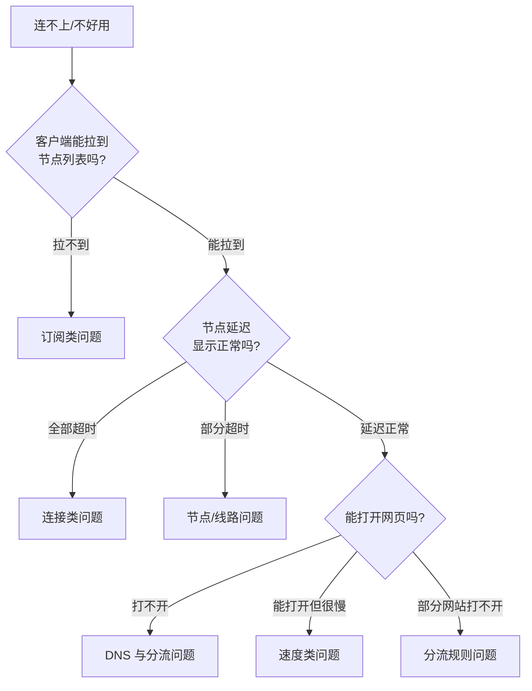

# 教程与使用说明体系规格

> 日期：2026-08-16 · 性质：**设计方案** · 状态：**设计稿 v1**（2026-08-16）
> 事实基线：竞品教程结构见 [competitor-conyss.md](../01-research/competitor-conyss.md) §3.8；
> 客户端现状与文档站选型见 [admin-support-docs.md](../01-research/admin-support-docs.md)
> 关联：[product-brief.md](../00-overview/product-brief.md) §7（差异化第 2 条）、
> [ADR 0015](../05-adr/0015-client-strategy.md) §3/§9（**裁决 §3 的 iOS 首推改 Karing**，提案，未批准）、
> [user-journey.md](user-journey.md) §4.3（分歧的另一侧）
> **2026-08-29 补登**：§3 加落点，选型表与固定结构未改。
> 读者：写教程的人。本文定义**要写哪些页、每页写什么、以什么标准算写完**。

---

## 1 · 设计目标

**用文档把配置类工单压到 20% 以下。**

竞品 Conyss 只有 8 篇教程，全部是「怎么装客户端、怎么导入订阅」，
**零篇排障文档**。而真实世界里用户提工单的原因绝大多数不是「不会装」，
而是「装好了但不通」。这是可以用文档吃掉的成本。

因此本体系的重心分配是**反直觉的**：

| 类别 | 竞品篇数 | 我们的目标篇数 | 理由 |
|---|---|---|---|
| 快速开始 | 0 | 1 | 竞品没有统一入口，用户直接掉进平台分类里 |
| 客户端教程 | 8 | 10 | 覆盖度略增，但**不是重点** |
| **排障** | **0** | **12+** | **重点。这是差异化所在** |
| 进阶用法 | 0 | 5 | 分流规则、路由器、多设备 |
| 账户与账单 | 0 | 4 | 减少非技术类工单 |

---

## 2 · 信息架构

```
docs.babel.plus/
├── 快速开始
│   └── 3 分钟接入            ← 唯一入口，按平台分叉
├── 客户端教程
│   ├── Windows   · Clash Verge Rev / v2rayN
│   ├── macOS     · Clash Verge Rev / sing-box
│   ├── iOS       · Shadowrocket / Stash / Karing
│   ├── Android   · Clash Meta for Android / v2rayNG / Hiddify
│   └── 路由器/Linux · OpenWrt / sing-box CLI
├── 排障                        ← 体系核心
│   ├── 决策树：我该看哪一篇
│   ├── 订阅类（3 篇）
│   ├── 连接类（4 篇）
│   ├── 速度类（2 篇）
│   ├── DNS 与分流类（3 篇）
│   └── 平台特有问题
├── 进阶
│   ├── 分流规则怎么写
│   ├── 多设备与设备数限制
│   ├── 自定义 DNS
│   ├── 路由器全局代理
│   └── 订阅链接的三种格式
└── 账户与账单
    ├── 套餐与流量重置规则
    ├── 支付方式与开票
    ├── 邀请返佣规则
    └── 订阅泄漏了怎么办
```

---

## 3 · 客户端选型（**只推现役**）

竞品仍在推 **Clash for Windows**（已停止维护）和 **ClashX**（已归档）。
这不只是过时 —— 停止维护的客户端不再跟进协议更新，**用不了 Hysteria2**，
而 Hysteria2 恰好是我们的主路径。所以这条不是「顺手改进」，是硬约束。

| 平台 | 首推（新手） | 备选（进阶） | 关键要求 |
|---|---|---|---|
| Windows | **Clash Verge Rev** | v2rayN | 必须支持 Hysteria2 + TUN |
| macOS | **Clash Verge Rev** | sing-box CLI | 同上 |
| iOS | **Shadowrocket**（付费） | Stash / Karing | Karing 免费，Shadowrocket 需外区 Apple ID |
| Android | **Clash Meta for Android** | v2rayNG / Hiddify / NekoBox | |
| Linux/路由器 | **sing-box** | mihomo | OpenWrt 需额外篇幅 |

> ⚠️ **iOS 是最大的摩擦点**：Shadowrocket 需要外区 Apple ID 且付费。
> 「怎么注册外区 Apple ID」本身要单独成篇，否则这一步会吃掉大量工单。
> Karing 作为免费替代必须给到同等篇幅。

> **2026-08-29 补登落点：iOS 首推之争已裁决（roadmap B29）—— [ADR 0015](../05-adr/0015-client-strategy.md) §3（提案，未批准）。**
>
> **裁决：iOS 首推 Karing**，即本表这一格被推翻，[user-journey](user-journey.md) §4.3 那一侧胜出。
> 0015 §3.1 把分歧的原文两侧并排列出，并指出**本文原文只写了「Karing 免费，Shadowrocket 需外区 Apple ID」**，
> 「生态成熟、配置能力强」那句是 user-journey 对本文的**转述**，本文里没有 —— 登记以免以讹传讹。
>
> ⚠️ **两份文档共有的一个前提可能是错的**（0015 §3.2）：都把「外区 Apple ID」当成 Shadowrocket **独有**的成本。
> 仓库里唯一的 App Store 链接是 `/us/` 路径（0015 引 [admin-support-docs](../01-research/admin-support-docs.md) L1441），
> **没有任何证据说明 Karing 在中国区**。若它同样不在，外区 Apple ID 就是两条路径的**共同前缀**。
> 这条核实**不是闸门**（无论结果如何都不改裁决，只改我们对外讲的理由），进 0015 §7.4 的 5 分钟清单。
> 承重理由改为 0015 §3.3 的四条不对称，退路见 §3.4（三级，不是一级）。
>
> **0015 §9 给本节的具体改动清单**（篇目编号见 [admin-support-docs](../01-research/admin-support-docs.md) §4.6）：
> Karing（`I4`）升为 iOS 首篇客户端教程 · 删 Stash（`I3`）· Shadowrocket（`I2`）降备选 ·
> 去掉 `I1` 里的外区 Apple ID 教程 · 新增「**不支持的客户端：SFT**」（tvOS，0015 §4.10 正式列为不接收完整配置）。
> Stage 2 另需写死「sing-box 官方客户端要求 ≥ vX.Y」（0015 §4.8，具体版本由闸门 A 实测确定）。
> 🔴 **本表今天不改写**：0015 状态是**提案，未批准**（2026-08-23），
> 且 §7.2 的闸门 B（Karing 真机验证）未过之前不许写进教程。

每篇客户端教程的**固定结构**：

1. 适用版本与下载地址（给出校验方式，不给第三方转载链接）
2. 导入订阅（**一键导入按钮** + 手动填写两条路径）
3. 选择节点组（说明为什么默认组不是「自动选择」，见 §5.3）
4. 验证连通（给出一个可点的验证页，**不要让用户去 ping**）
5. 开机自启与系统代理设置
6. **常见错误 3 条 + 各自跳转到排障篇的链接**
7. 页尾：`最后更新：YYYY-MM-DD` + 「这篇没解决我的问题」→ 工单入口

---

## 4 · 排障体系（核心）

### 4.1 入口：决策树

排障区的首页**不是文章列表，是一棵决策树**。用户回答 2–3 个问题就落到具体页面：



### 4.2 篇目清单

**订阅类**

| 篇目 | 核心内容 |
|---|---|
| 订阅更新失败 / 拉不到节点 | 订阅域名是否可达、token 是否被重置、客户端是否走了代理去拉订阅（鸡生蛋问题） |
| 订阅地址泄漏与重置 | 什么现象说明被白嫖、如何重置、重置后所有设备要重新导入 |
| 订阅链接的三种格式怎么选 | Clash YAML / sing-box JSON / base64，哪个客户端用哪个 |

**连接类**

| 篇目 | 核心内容 |
|---|---|
| 所有节点全部超时 | **最高频工单**。分三种成因：本地网络、客户端配置、节点侧 |
| 部分节点超时 | 节点维护 vs 线路被封 vs 本地 ISP 差异 |
| 连上了但立刻断开 | UDP 被 QoS、MTU、客户端版本过旧 |
| 公司/校园网下无法使用 | 出口端口受限，切换到 443/8443 等常用端口的方案 |

**速度类**

| 篇目 | 核心内容 |
|---|---|
| 速度慢 / 下载只有几百 KB/s | **必须讲清单流 vs 多流**（见 §4.3） |
| 晚高峰变慢 | 跨境链路拥塞的客观解释 + 建议切换节点/协议 |

**DNS 与分流类**

| 篇目 | 核心内容 |
|---|---|
| DNS 泄漏怎么检测和修复 | 给出检测站点 + fake-ip 配置说明 |
| 国内网站变慢/打不开 | 分流规则没生效，GEOIP,CN 的位置问题 |
| 某个网站打不开但别的正常 | 规则命中顺序排查方法 |

### 4.3 「速度慢」这一篇必须写对

这是最容易被写成废话的一篇，但我们有**实测数据**可以讲清楚
（来自 [reference-repos.md](../01-research/reference-repos.md) §1.5）：

- 用户测速用单线程工具时看到 ~300 KB/s，会认为「服务不行」。
- 实际上单流吞吐受**跨境 TCP 拥塞控制**限制，8 并发可以聚合到 8 倍。
- 所以：**先问用户用什么测的**。浏览器下载单文件 = 单流；`speedtest` 多线程 = 聚合。
- **解法是切到 Hysteria2 路径**，实测单流从 370 KB/s → ~1700 KB/s（4.6×）。

这一篇的价值不只是排障，更是**把我们的技术选型优势讲给用户听**。

### 4.4 用户不能用系统工具自测

必须单独提示：**开启 TUN/fake-ip 模式后，`ping` / `nslookup` / `curl` 的结果全部不可信**
（会被客户端劫持，Proxy_Skill §十一 有对照实验记录）。
教程里要给出**正确的自测方法**：用客户端内置的延迟测试，或访问我们提供的诊断页。

> 因此需要建一个 **诊断页 `check.babel.plus`**：一次性返回出口 IP、地理位置、
> 是否命中我们的节点、DNS 出口、以及一个多线程测速。这页本身就是排障文档的一部分。

---

## 5 · 账户与账单类

| 篇目 | 要点 |
|---|---|
| 套餐与流量重置规则 | 重置日=订单日不是每月 1 号（这是高频误解）；流量包与周期套餐的关系 |
| 支付方式 | 各通道到账时间、失败怎么办 |
| 邀请返佣规则 | 佣金比例、确认期为什么存在、如何划转 |
| 订阅泄漏了怎么办 | 指向重置功能 |

### 5.3 「为什么默认不是自动选择」要写进教程

实测结论：**按延迟自动选路（`url-test`）会稳定选错节点** ——
各健康节点延迟同在 100–250ms 噪声带内，吞吐却相差 4–5 倍。
所以我们的默认组是 **`fallback` 类型（人工排序 + 失效自动跳过）**，不是 `url-test`。

用户会问「为什么不自动选最快的」，教程必须正面回答，否则会被当成偷懒。

---

## 6 · 平台与站点选型

**待与 [admin-support-docs.md](../01-research/admin-support-docs.md) 的结论对齐后定稿。** 硬约束：

1. **必须在中国大陆可达** —— 文档站是用户「连不上时」唯一能求助的地方，
   它自己不能也需要梯子才能打开。**这是整个体系的单点。**
2. **搜索不能依赖 Algolia DocSearch**（在大陆常不可用），
   应使用本地索引方案（如 Pagefind）。
3. 静态站点，可多域名部署（与订阅域名池同策略）。
4. 支持 `最后更新` 日期自动生成（竞品有这个，用户吃这一套）。

---

## 7 · 完成标准（Definition of Done）

一篇教程算写完，必须满足：

- [ ] 有 `最后更新` 日期
- [ ] 客户端版本号明确，下载链接为官方源
- [ ] 每一步都有截图或可复制的配置块
- [ ] 结尾有「常见错误」区块并链到排障篇
- [ ] 有「这篇没解决我的问题」→ 工单入口
- [ ] **被一个没用过代理的人实际走通过一遍**（这条最容易跳过，也最重要）

---

## 8 · 代价

> ⚠️ 这一选择的代价，必须留在记录里而不是被措辞掩盖：
>
> 1. **30+ 篇文档是真实的写作与维护成本**，且客户端版本更新会持续让截图过期。
>    竞品只维护 8 篇是理性的成本选择，我们选择多付这份成本换取更低的工单量 ——
>    **如果实测工单量并没有因此下降，这个投入需要重新评估。**
> 2. **排障文档会暴露服务的不完美**（承认会超时、会慢、会被封）。
>    这与营销话术冲突，但对内部使用型服务是正确取舍。
> 3. **诊断页 `check.babel.plus` 是一个额外要建、要维护、要抗封锁的服务。**

## 9 · 这次没有解决的

- [ ] 文档站技术选型未定（依赖 admin-support-docs 结论 + **中国大陆可达性需实测**）。
- [ ] 「一键导入」按钮的 URL scheme 需按客户端逐个确认（`clash://`、`sing-box://`、
      `shadowrocket://` 等），**待核实**。
- [ ] 是否做 i18n 未定（内部使用，初期只做简体中文）。
- [ ] 诊断页 `check.babel.plus` 的具体功能与实现未设计。
- [ ] 教程的截图从哪来、谁来更新、更新频率 —— 无流程。
