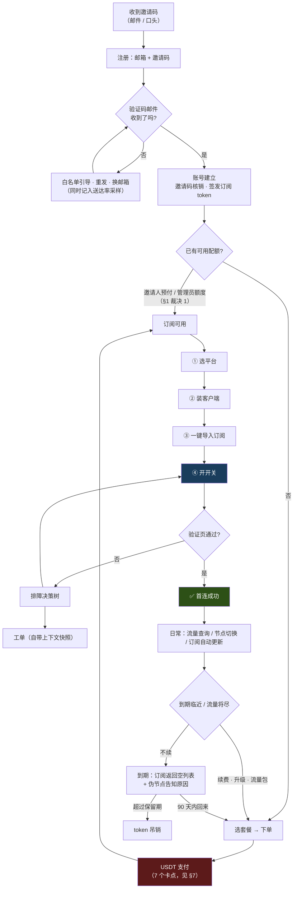
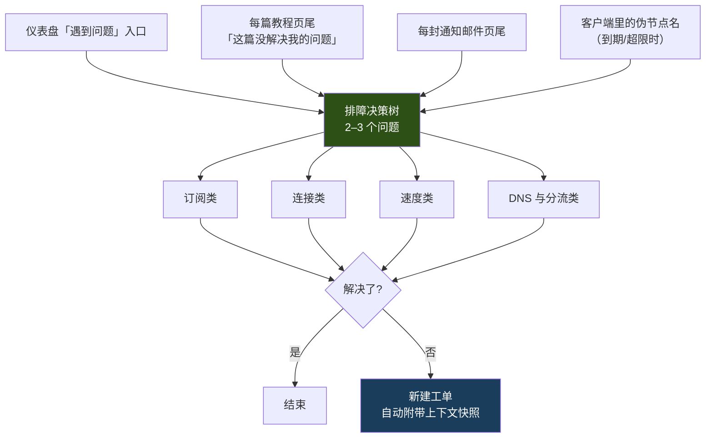
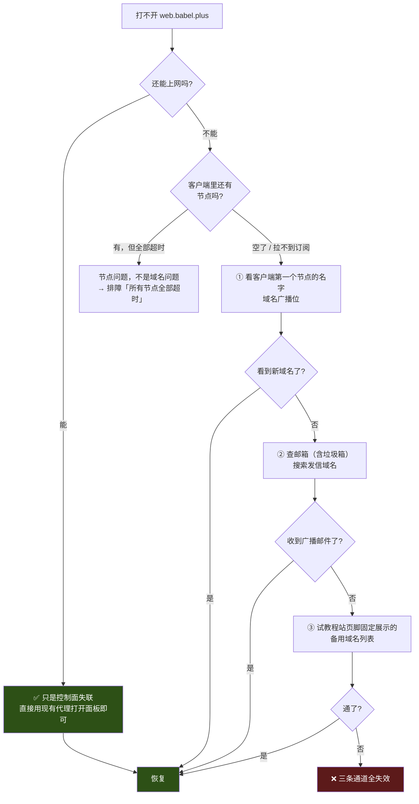

# 用户旅程：唯一真正的转化点是「第一次连接成功」，其余环节都为它让路

> 日期：2026-08-16 · 性质：**设计方案** · 状态：**设计稿 v1**（2026-08-16）
> 事实基线：竞品旅程为 2026-08-16 实地走查（[competitor-conyss.md](../01-research/competitor-conyss.md) §3、§5）；
> 订单状态机与 `underpaid` 定义引自 [payments.md](../01-research/payments.md) §4.8、§2.10；
> 链上成本引自 [pricing-and-plans.md](pricing-and-plans.md) §4.2；
> 通道可达性引自 [ADR 0002](../05-adr/0002-notification-channels.md) §3
> 关联：[product-brief.md](../00-overview/product-brief.md) §8、[pricing-and-plans.md](pricing-and-plans.md)、
> [tutorials-spec.md](tutorials-spec.md)、[system-design.md](../02-architecture/system-design.md) §5、
> [ADR 0003](../05-adr/0003-web-hosting-and-reachability.md) §5、
> [ADR 0011](../05-adr/0011-domain-blackout-detection.md)（§16 的域名失联缺口）、
> [ADR 0012](../05-adr/0012-payment-gateway.md) §3.7 / §6.4（推翻 §7 卡点 5 的页面文案）、
> [ADR 0013](../05-adr/0013-billing-and-refund-rules.md)（§10 的折抵与流量包口径）、
> [ADR 0015](../05-adr/0015-client-strategy.md) §3（§4.3 的 iOS 分歧）—— **五份均为提案，未批准**
> **2026-08-29 补登**：§4.3 与 §16 各加落点，正文旅程设计未改。
> 读者：写 Web 面板的人、写 API 的人、写教程的人。本文定义**每一步用户看到什么、系统做什么、
> 失败会怎样、我们怎么度量**。价格数字一律留空 —— 依赖 [pricing-and-plans.md](pricing-and-plans.md) §7 的 P0 阻塞项。

---

## 1 · 结论

**整条旅程只有一个真正的转化点：新用户第一次成功上网。** 其余所有环节（付款、续费、工单、
公告）都发生在这个点之后，且只有跨过它的用户才会经历。因此四条裁决：

| # | 裁决 | 理由 |
|---|---|---|
| 1 | **把「首次付款」从首连路径上挪走** —— 新账号由邀请人余额或管理员额度预付第一个周期 | 默认路径（先付款后接入）是 **6 步**，其中「USDT 付款」一步内含 **7 个独立卡点**（§7）。挪走后首连是 **4 步**。⚠️ **提案，需与 [pricing-and-plans.md](pricing-and-plans.md) §3.4「不做免费试用」对齐裁决** |
| 2 | **邀请码一次性核销 + 强制邮箱验证码** | 邀请码可重复使用等于开放注册，与「内部使用」定位（[product-brief.md](../00-overview/product-brief.md) §4）直接冲突；邮箱验证同时是**送达率的免费持续采样**（§3.3） |
| 3 | **首连未完成的账号，面板首屏不是仪表盘，是接入向导** | 竞品的四个快捷入口（`查看教程` / `一键订阅` / `续费订阅` / `遇到问题`）是**稳态用户**的入口，对新用户是四个平级的岔路 |
| 4 | **一切「服务不可用」类通知不受用户通知开关控制** | 竞品的 `到期邮件提醒` / `流量邮件提醒` 两个开关值得抄（[competitor-conyss.md](../01-research/competitor-conyss.md) §3.6），但 [ADR 0002](../05-adr/0002-notification-channels.md) 已裁定邮件是唯一失联恢复通道，**生命线不能被用户关掉** |

> **一个反直觉但重要的前提**：三套域名池（Web / API / 教程站）**全部失联时，已连上的用户仍然能上网** ——
> 因为数据面（GCE 节点）与控制面故障域隔离，且节点在拉取失败时使用最后一次成功的配置继续服务
> （[system-design.md](../02-architecture/system-design.md) §5.3）。
> 所以域名失联的真正杀伤力是**新用户接不进来、老用户续不了费、订阅刷不了**，不是「大家立刻断网」。
> 这一条决定了 §13 的整个应对设计。

---

## 2 · 主旅程



---

## 3 · 阶段 1：邀请码 → 注册

| | |
|---|---|
| **用户看到** | 一个只有三个字段的表单：邮箱、密码、邀请码。提交后立刻进入「输入 6 位验证码」页，页面上同时给出**「60 秒没收到？三步把 `babel.plus` 加白名单」**的折叠引导 |
| **系统做** | ① 校验邀请码存在、未核销、未过期 → ② 速率限制（同 IP / 同邮箱域名） → ③ 发验证码邮件（10 分钟有效） → ④ **验证码通过后才真正建账号并核销邀请码** → ⑤ 签发订阅 token，写 `invite_redeem` 记录（挂邀请人，为返佣归属） |
| **失败会怎样** | 邮件进垃圾箱或被拒 = 用户永远注册不成功，且**我们看起来什么错都没有**。这是本阶段唯一严重的失败模式 |
| **度量** | `注册完成率` = 验证码通过 / 表单提交；`验证码送达时延 p50/p95`；**按收件域名分组**的完成率（QQ / 163 / 126 / Gmail / 自建）—— 这张表就是 [ADR 0002](../05-adr/0002-notification-channels.md) §7 要求的送达率实测数据 |

### 3.1 邀请码从哪来、谁能生成、能用几次

| 类型 | 谁能生成 | 可用次数 | 有效期 | 用途 |
|---|---|---|---|---|
| **种子码** | 管理员（后台批量） | **可配置 1–N 次**，带总量上限 | 可设 | 冷启动、一次性拉一批人 |
| **用户码** | **已有有效订阅的用户**自助生成 | **恒为 1 次** | 30 天（提案） | 常态增长路径，返佣归属明确 |

三条约束及其理由：

1. **用户码恒为一次性。** 多次可用的码一旦被贴到论坛就等于开放注册 —— 而这与
   [product-brief.md](../00-overview/product-brief.md) §4「注册必须受控」是同一条底线。
   一次性还让返佣归属天然无歧义（一码一人）。
2. **生成资格挂在「有有效订阅」上**，不是「有账号」。否则被邀请进来的人可以立刻再邀请，
   邀请制退化为链式开放注册。未付费账号的可生成配额为 0。
3. **每用户同时持有的未核销码上限 3 个**（提案，数字待运营校准）。竞品允许用户自行生成多个
   （[competitor-conyss.md](../01-research/competitor-conyss.md) §3.5），但未见上限。

### 3.2 不做人机验证

[ADR 0003](../05-adr/0003-web-hosting-and-reachability.md) §3.2 已确认 **Cloudflare Turnstile
在中国大陆不可用**（官方 China Network 可用产品清单中没有它），hCaptcha 的大陆可达性**无任何测量数据**。
因此本阶段的反滥用靠三层，不靠验证码：

- **邀请码本身**（必须持有一个未核销的码才能提交）
- **邮箱验证码**（必须能收信）
- **速率限制**（同 IP、同邮箱域名、同邀请人）

> ⚠️ **这套组合是否足够，未经验证。** 若出现邀请码被批量爆破的迹象，
> 需要重开人机验证方案的评估（[ADR 0003](../05-adr/0003-web-hosting-and-reachability.md) §7 已列为未决项）。

### 3.3 注册邮箱验证 = 生命线的免费压测

这是本阶段最值得写下来的一条，因为它把一个看似例行的步骤变成了核心基础设施的监测点。

[ADR 0002](../05-adr/0002-notification-channels.md) §1 裁定：**邮件是唯一的失联恢复通道**，
理由是 Telegram 在大陆的 OONI 异常率 —— `api.telegram.org` 近 12 个月 111 次测量、110 次异常，
**99.1%**；`t.me` 87.8%；Telegram DC 接入点 97.0%。

由此推出一条直接的等价关系：

> **一个收不到我们验证码的用户，就是一个在域名被封那天必然失联的用户。**

所以注册验证不是「防机器人的例行步骤」，而是**在用户还没付钱、还没依赖我们之前，
把这条生命线先测一遍**。收不到 → 现在就暴露，而不是三个月后的封锁夜里才暴露。

工程要求：

- 每一次验证码发送写一条 `email_probe` 记录：`收件域名 / ESP / 发送时刻 / bounce 码 / 用户回填时刻`。
  这是一份**零成本的持续采样**，比一次性送达率实测更有价值，因为它覆盖真实收件域名分布。
- 60 秒未回填即展示 QQ 白名单引导。依据是 [admin-support-docs.md](../01-research/admin-support-docs.md)
  记录的 QQ 官方原文：域名白名单下「该域名下各个邮箱发来的信件都将不受反垃圾规则的影响」，
  且**「白名单优先级高于黑名单与反垃圾规则」**。这是一个官方记载、成本极低的缓解手段。
- **首批用户的送达率必然低于稳态**，这不是 bug。网易的退信码 `554 HL:IPB`（「该IP不在网易允许的
  发送地址列表里」）证明**未知发信 IP 的默认状态就是「不被允许」**。
  冷启动期需要人工兜底通道（管理员代为核销 + 站内展示验证码）—— **提案，未实现**。

---

## 4 · 阶段 2：首次接入（决定留存的一段）

### 4.1 步数：默认 6 步，目标 4 步

| # | 步骤 | 默认路径 | 预付路径（§1 裁决 1） |
|---|---|---|---|
| 1 | 选套餐 | ✅ | — |
| 2 | **USDT 付款** | ✅（内含 7 个子卡点，§7） | — |
| 3 | 选平台 | ✅ | ✅ |
| 4 | 装客户端 | ✅ | ✅ |
| 5 | 一键导入订阅 | ✅ | ✅ |
| 6 | 开开关 + 点验证 | ✅ | ✅ |
| | **合计** | **6** | **4** |

> **「≤ 4 步」是设定的目标，不是实测结论。** 竞品的实际步数我们**没有测过** ——
> [competitor-conyss.md](../01-research/competitor-conyss.md) §7 明确记录：未下单、未下载客户端。
> 唯一能证伪本节的动作是 [tutorials-spec.md](tutorials-spec.md) §7 的最后一条：
> **让一个没用过代理的人实际走通一遍。**

### 4.2 逐步的流失风险与压缩手段

| 步骤 | 用户看到 | 主要流失风险 | 压缩手段 |
|---|---|---|---|
| 选平台 | 四个大按钮（Windows / macOS / iOS / Android），**按 User-Agent 预选** | 选错平台，教程对不上 | UA 预选 + 「不是这个？」小字切换 |
| 装客户端 | 一个下载按钮 + 版本号 + 校验值 | **Windows SmartScreen / macOS Gatekeeper / Android 侧载警告**吓退用户 | 每个平台的教程第 1 节必须**提前**给出这三个警告的截图与处理方式，而不是让用户自己遇到 |
| 装客户端（iOS） | — | **Shadowrocket 需外区 Apple ID 且付费** | 见 §4.3 |
| 一键导入 | 「一键导入到 Clash Verge Rev」按钮 + 「手动复制订阅链接」折叠项 | URL scheme 未注册 → 点了没反应，用户不知道下一步 | 按钮下方常驻手动路径；点击后 3 秒无跳转自动展开手动路径。⚠️ scheme 逐客户端**待核实**（[tutorials-spec.md](tutorials-spec.md) §9） |
| 开开关 + 验证 | 一个「检查我的连接」按钮，跳 `check.babel.plus` | 用户改用 `ping` / `nslookup` 自测得到错误结论 | 开 TUN/fake-ip 后 `ping`/`nslookup`/`curl` 全部不可信（[tutorials-spec.md](tutorials-spec.md) §4.4）。**教程里一次都不要出现这些命令** |

### 4.3 iOS 首推客户端：本文与 tutorials-spec 有分歧

| 来源 | iOS 首推 | 理由 |
|---|---|---|
| [tutorials-spec.md](tutorials-spec.md) §3 | **Shadowrocket**（付费），Karing 备选 | 生态成熟、配置能力强 |
| **本文（旅程视角）** | **Karing**（免费），Shadowrocket 备选 | Shadowrocket 在首连路径上**插入了一个完整的子旅程**（注册外区 Apple ID → 充值 → 购买），tutorials-spec §3 自己也承认「这一步会吃掉大量工单」 |

**未裁决。** 分歧点是「更好的客户端」与「更短的首连路径」哪个优先。
本文的立场是：默认值应优化首次使用成功率（与 [system-design.md](../02-architecture/system-design.md) §3.1
选 REALITY 而非 Hysteria2 做默认的理由完全同构 —— **优化下限，不优化峰值**）。

> **2026-08-29 补登落点：这处分歧（roadmap B29）已有裁决 —— [ADR 0015](../05-adr/0015-client-strategy.md) §3（提案，未批准）。**
>
> **裁决：iOS 首推 Karing**，即本文这一侧胜出。但**本文给的理由被 0015 §3.2 判定为很可能是错的**，
> 必须一并登记：本文（与 tutorials-spec §3）都把「注册外区 Apple ID」当成 Shadowrocket **独有**的成本，
> 而仓库里唯一的 App Store 链接是 `/us/` 路径（0015 §3.2 引 admin-support-docs L1441）——
> **没有任何证据说明 Karing 在中国区**。若它同样不在，外区 Apple ID 就是两条路径的**共同前缀**，
> 本节「旅程步数最短」这条论据**归零**。0015 把这条核实放进 §7.4 的 5 分钟清单，
> 并明说它**不是闸门**：无论结果如何都不改变裁决，只改变我们对外讲的理由。
>
> 真正承重的理由换成了 0015 §3.3 的四条不对称（格式能力、订阅形态、免费、退路阶梯 §3.4）。
> 落地面见 0015 §9：Karing（篇目 `I4`）升为 iOS 首篇、Stash（`I3`）删除、Shadowrocket（`I2`）降备选、
> `I1` 里的外区 Apple ID 教程去掉、新增「不支持的客户端：SFT」。
> 🔴 **本节今天不改写**：0015 状态是**提案，未批准**（2026-08-23）。

### 4.4 面板首屏按状态切换

竞品的四个快捷入口值得原样保留（[competitor-conyss.md](../01-research/competitor-conyss.md) §5 第 8 条），
但**只对已经首连成功的用户展示**：

| 账号状态 | 首屏 | 内容 |
|---|---|---|
| 已注册，无配额 | **接入向导** | 一条进度条，当前步高亮，其余灰显 |
| 有配额，`subscribe_log` 为空 | **接入向导**（跳到第 3 步） | 同上 |
| 有配额，拉过订阅但 `u+d < 1MB` | **「看起来还没连上」卡片** | 直接给三个最常见原因 + 排障决策树入口 |
| 首连成功 | **仪表盘** | 订阅卡片 + 公告 + 四个快捷入口 |
| 到期 / 流量耗尽 | 仪表盘，四入口中「续费」置为主按钮 | |

第三行是本节的关键：**「拉过订阅但没有任何流量」是一个我们能自动检测的状态**
（订阅拉取审计表 + `UniProxy/push` 流量入账，见 [system-design.md](../02-architecture/system-design.md) §5.1/§5.2），
它精确对应「用户已经把配置装进客户端了但连不上」。这是整条漏斗里信息量最大的一个信号。
触发动作：面板卡片 + **T+2h 一封邮件**（「看起来你还没连上，最常见的三个原因是…」）。

---

## 5 · 🔑 关键时刻 A：第一次连接成功

### 5.1 全部失败点

按用户实际推进的顺序分层。**「我们能自动发现吗」这一列决定了哪些失败必须靠文档、哪些可以靠系统主动救。**

| 层 | 失败点 | 用户看到什么 | 兜底 | 能自动发现? |
|---|---|---|---|---|
| **L0 拿不到订阅** | Web 面板域名被封 | 打不开面板 | §13 三条恢复通道 | ✅ 外部探活（**未实现**） |
| | API/订阅域名被封 | 客户端报「订阅更新失败」 | 备用域名池 + 手动改订阅 URL | ✅ 同上 |
| | 订阅 token 被重置/吊销 | 401 / 空列表 | 面板重新复制；重置弹窗必须警告「所有设备需重新导入」 | ✅ `subscribe_log` 有 401 |
| | **客户端拉订阅时自己走了代理（鸡生蛋）** | 首次导入永远超时 | 教程明确：首次导入前**关闭系统代理 / 关闭 TUN** | ❌ 我们侧看不到任何请求 |
| **L1 装不上客户端** | iOS 无外区 Apple ID | 商店搜不到 App | 首推 Karing（§4.3） | ❌ |
| | SmartScreen / Gatekeeper / 侧载警告 | 「此应用可能有害」 | 教程提前给截图与处理步骤 | ❌ |
| **L2 导入失败** | URL scheme 未注册 | 点「一键导入」无反应 | 3 秒无跳转自动展开手动路径 | ⚠️ 前端埋点可测 |
| | 复制的 URL 带换行/空格 | 客户端报格式错误 | 一键复制按钮（不给可选中的文本框） | ❌ |
| | **客户端版本太老，不认 Hysteria2** | 导入成功但该节点组为空 | 教程标注最低版本；订阅按 UA 降级下发 | ⚠️ `subscribe_log` 有 UA |
| **L3 连不上** | UDP:443 被运营商 QoS 降级 | HY2 组全超时，REALITY 组正常 | 默认组是 REALITY 不是 HY2（[system-design.md](../02-architecture/system-design.md) §3.1） | ⚠️ 需用户上报 |
| | 公司/校园网封非常用端口 | 全部超时 | 排障篇「公司/校园网下无法使用」（[tutorials-spec.md](tutorials-spec.md) §4.2） | ❌ |
| | 节点 IP 被封 | 该节点全超时，其他节点正常 | 节点探活 + 换 IP（[runbook-node-health.md](../04-ops/runbook-node-health.md)） | ✅ |
| | **节点证书用了 GTS 而非 Let's Encrypt** | 节点从某刻起完全不通 | GTS 证书在中国触发 **IP 级单向丢包** —— 已裁定必须钉 LE。这是**运维失误**，不是用户问题 | ✅ 节点探活 |
| | 客户端系统时间偏差过大 | REALITY 握手失败 | 排障篇提示校时。⚠️ 具体容差 **待核实** | ❌ |
| | MTU / 分片 | 连上立刻断 | 排障篇「连上了但立刻断开」 | ❌ |
| **L4 连上但不通** | TUN 未开 / 系统代理未设 | 客户端显示已连接，浏览器仍打不开 | 验证页给出「你当前的出口 IP」，一眼可判 | ✅ 验证页命中记录 |
| | DNS 泄漏 | 部分站点解析到国内 CDN | 排障篇 + fake-ip 配置 | ⚠️ 验证页可测 DNS 出口 |
| | 分流规则把目标站走了直连 | 「别的都行，就这个站不行」 | 排障篇「规则命中顺序排查」 | ❌ |
| **L5 通了但用户不认** | **单流测速只有几百 KB/s** | 「服务不行」→ 退款 / 流失 | **这一条最危险，因为技术上完全正常**。见下 | ⚠️ 可从工单文本识别 |

### 5.2 L5 值得单独说：技术成功但体验失败

[reference-repos.md](../01-research/reference-repos.md) 的一手实测（引自 [tutorials-spec.md](tutorials-spec.md) §4.3）：

- 单线程工具测得 **~300 KB/s**，用户判定「服务不行」。
- 实际是**跨境 TCP 单流拥塞控制**的限制，8 并发可聚合到约 8 倍。
- 切到 Hysteria2 路径后单流 **370 KB/s → ~1700 KB/s（4.6×）**。

因此验证页 `check.babel.plus` **必须自带多线程测速**，而不是只返回 IP 和位置。
否则用户会拿浏览器下载单文件的数字来判断我们 —— 而那个数字在物理上就不可能好看。

### 5.3 度量

| 指标 | 定义 | 数据来源 | 目标 |
|---|---|---|---|
| `订阅首次拉取率` | 配额生效后 24h 内至少一次 `200` 拉取 | `subscribe_log` | ≥ 95%（**设定值**） |
| **`首连成功率`** | 配额生效后 24h 内该 `uid` 在任一节点累计 `u+d ≥ 1 MB` | `UniProxy/push` 入账 | **≥ 90%（设定值，无基线）** |
| `首连中位耗时` | 配额生效 → 首个 ≥1MB 流量 | 同上 | ≤ 30 分钟（**设定值**） |
| `卡在 L0/L2 的比例` | 拉取成功但 24h 无流量 | 两表 JOIN | 这是唯一能精确定位的漏斗段 |
| `首连相关工单占比` | 注册后 7 天内提的工单 / 全部工单 | 工单表 | ≤ 20%（口径同 [product-brief.md](../00-overview/product-brief.md) §8） |

> ⚠️ 三个「设定值」都是拍的，**没有任何基线数据支撑**。它们的作用是给出报警阈值，
> 不是预测。第一批 20 个用户跑完后必须用实测值替换。

---

## 6 · 阶段 3：选套餐 → 下单 → 支付 → 开通

| | |
|---|---|
| **用户看到** | 套餐页两个 tab（按周期 / 按流量，抄竞品结构）；周期档默认**预选年付**并显示折扣；结算页显示锁定汇率与倒计时 |
| **系统做** | 建订单（`pending`）→ 分配 (收款地址, 唯一金额) 组合并锁定 → 状态机推进 → `paid` → **单独一步** `completed` 才发放权益 |
| **失败会怎样** | 见 §7 的七个卡点；金额少付则进 `underpaid` 且**订单看起来永远挂着** |
| **度量** | `下单→支付完成率`（按通道分）、`underpaid 发生率`、`汇率超时重报价次数/订单`、`支付中位耗时` |

### 6.1 三条产品侧的硬约束（都来自成本，不是偏好）

1. **默认预选年付，月付要多点一次。**
   依据 [pricing-and-plans.md](pricing-and-plans.md) §4.2：一笔 TRC20 USDT 转账的归集成本
   **$2.13（收款方已持 U）～ $4.31（未持 U）**，是 ERC20/BEP20 的 500–2000 倍。
   对 ¥30–90 的月付订单，这是 **20–85% 的侵蚀**。月付在链上是亏本的。
2. **不是一单一地址。** 用小地址池 + 金额唯一性做匹配（抄 EPUSDT 的机制：
   哈希表里找空闲的 (地址, 金额) 组合锁 10 分钟，冲突则金额 `+0.0001` 递增重试，最多 100 次
   —— [payments.md](../01-research/payments.md) §2.10）。这直接决定了 §7 卡点 3 的文案。
3. **`paid` 与 `completed` 必须是两步。**
   [payments.md](../01-research/payments.md) §4.8 硬约束 2：不要在 `paid` 里发货。
   用户视角的价值是：发放失败时订单不会卡在「已付款但看起来什么都没发生」。

### 6.2 订单状态在用户界面上的措辞

状态机本身见 [payments.md](../01-research/payments.md) §4.8。用户不该看到英文状态名：

| 内部状态 | 用户看到 | 主按钮 |
|---|---|---|
| `pending` | 待支付 · 剩余 `mm:ss` | 去支付 |
| `paying` | 已生成收款信息 · 等待到账 | 我已转账 |
| **`underpaid`** | **还差 `X.XXXX USDT`，请用同一地址补足** | 复制补足金额 |
| `paid` | 已到账 · 正在开通 | — |
| `completed` | 已开通 | 复制订阅链接 |
| `expired` | 已超时 · 汇率需重新报价 | **按当前汇率重下** |

---

## 7 · 🔑 关键时刻 B：首次 USDT 付款

USDT 是主通道（[pricing-and-plans.md](pricing-and-plans.md) §4），
且该文自己承认「**主通道选 USDT 意味着放弃相当比例的非技术用户**」。
本节把这个抽象代价拆成七个具体卡点。

| # | 卡点 | 用户的实际处境 | 我们能做什么 | 兜底 |
|---|---|---|---|---|
| 1 | **手上没有 U** | 需要注册交易所 → KYC → 出金买币。这是一个**比我们整个产品还长的子旅程** | 写一篇「怎么买 U」教程；**但我们解决不了这一步** | 易支付备用通道（⚠️ 风险见 [pricing-and-plans.md](pricing-and-plans.md) §4.0：该类目被易支付平台自己的协议点名拒收） |
| 2 | **不知道选哪条链** | TRC20 / ERC20 / BEP20 三个词对新手无意义 | **默认预选 TRC20，其余折叠。** 依据：中国用户手上的 U 基本都在 TRC20，且交易所提币由交易所代付能量，用户只付约 1 USDT 固定提币费 —— **那 $2–4 不落在用户头上** | 页面写「不确定就选 TRC20」 |
| 3 | **金额带四位小数，看着像诈骗** | 「为什么是 12.3457 而不是 12.35？」 | 必须解释：**尾数是订单识别码，少一位就无法自动到账**（这是 §6.1 第 2 条机制的必然结果） | 文案 + 一键复制精确金额 |
| 4 | **复制地址出错 / 转错链** | **资金不可恢复** | 二维码 + 一键复制 + 首尾各 4 位高亮供人工校验；转链警示用页面最强的视觉层级 | 无。这一条只能靠预防 |
| 5 | **提币手续费从转出额里扣 → 实收少了** | 用户转了 12.3457，我们收到 11.3457 → `underpaid` | 页面明写：「请按**到账金额**填写，交易所提币手续费会另外扣除」。**这是 `underpaid` 的头号成因** | `underpaid` 状态 + 补足引导（§6.2） |
| 6 | **等确认数，不知道要等多久** | 页面一直转圈 | 展示链上进度（已检测到 N 笔 / 需 M 确认）。**确认数配置化不硬编码**（[payments.md](../01-research/payments.md) §2.11，具体数值 **待核实**） | 允许关闭页面，结果走邮件 |
| 7 | **倒计时归零后才转账** | 链上已到账，订单已 `expired` | **过期订单的收款地址仍需继续监听 ≥ 24 小时**；到账后**入账为余额**而非直接开通 | 余额仅可消费不可提现（[product-brief.md](../00-overview/product-brief.md) §6），所以这个兜底在资金合规上是安全的 |

> 卡点 7 是本节唯一的设计增量，也是最容易被漏掉的：
> **汇率锁定 TTL 15–30 分钟**（[payments.md](../01-research/payments.md) §4.8）
> 对一个第一次用交易所提币的人来说很紧。不做这个兜底，用户的钱就真的进了黑洞，
> 而这是**第一次付款**——最不能出事的一次。

**度量**：按卡点埋点 —— 停留在收款页超过 TTL 的比例、`underpaid` 发生率（目标 **需实测后设定**）、
过期后仍到账的笔数（卡点 7 的实际发生频率）、易支付分流占比。

---

## 8 · 阶段 4：日常使用

| | |
|---|---|
| **用户看到** | 仪表盘：订阅卡片（套餐名、到期日、距到期天数、已用/总计、**按日流量曲线**）+ 公告 + 四快捷入口 |
| **系统做** | 节点每 60 秒 `push` 原始字节 → Cloud Tasks/Pub-Sub 入队 → 累加 + 按天聚合到 `stat_user`；客户端按自身周期自动拉订阅 |
| **失败会怎样** | 面板数字与客户端流量条对不上 → 客诉。见 §8.1 |
| **度量** | 周活跃（有流量的天数）、订阅拉取频次分布、节点组切换率、按日流量分布（识别重度用户） |

### 8.1 流量数字必须只有一个口径

用户会同时看到三处流量数字，**它们天然不一致**：

| 位置 | 数据来自 | 滞后 |
|---|---|---|
| 面板 | DB 累加值 | **最多 ~60 秒（节点上报间隔）+ 队列延迟** |
| 客户端流量条 | 订阅响应的 `subscription-userinfo` 头（[system-design.md](../02-architecture/system-design.md) §5.2） | 上次拉订阅至今（可能几十分钟） |
| 邮件提醒 | 发信时刻的快照 | 固定 |

处理方式：**面板上明写「数据延迟约 1 分钟」**，并让邮件提醒里的数字带时间戳。
不写这一句，就一定会有人拿客户端的数字来质问面板的数字。

竞品在这里有一个明确缺口：**无用量可视化，没有流量趋势图**
（[competitor-conyss.md](../01-research/competitor-conyss.md) §6）。按日曲线 + 按节点用量是低成本的信任建设，
也让用户能自己发现「哪天流量异常」——这是订阅泄漏的第一个用户可见信号（§12.1）。

### 8.2 节点切换：要正面回答「为什么不自动选最快」

默认组是 **`fallback`（人工排序 + 失效自动跳过）**，不是 `url-test`。
理由是实测的：各健康节点延迟同在 **100–250ms 噪声带**内，吞吐却差 **4–5 倍** ——
按延迟自动选路会**稳定选错**（[system-design.md](../02-architecture/system-design.md) §3.1、
[tutorials-spec.md](tutorials-spec.md) §5.3）。

用户不会自己想到这一层，只会觉得我们偷懒。所以这句话必须出现在**教程和节点页两处**，
并配一句可操作的引导：「觉得慢就切到 HY2 组试试」。

节点命名照抄竞品的说明书式格式（`{旗帜}{地区}{序号}{(线路类型)}`），
**但不写解锁能力** —— 我们不承诺流媒体解锁（[product-brief.md](../00-overview/product-brief.md) §3）。
第一个节点的名字保留给域名广播（§13.2）。

---

## 9 · 阶段 5：遇到问题

### 9.1 决策树在文档站，工单入口在决策树之后



决策树本身见 [tutorials-spec.md](tutorials-spec.md) §4.1（已画）。本文只定三件事：

1. **工单入口不独立存在，只出现在决策树的叶子节点上。**
   这不是刁难 —— 是让每张工单都自带诊断路径（「用户已经回答过：拉得到节点列表、延迟正常、网页打不开」）。
2. **提交工单时自动附带用户说不清但我们本来就有的上下文**，
   存为 JSONB 快照而非外键（[admin-support-docs.md](../01-research/admin-support-docs.md) §2.4 的设计要点：
   工单记录的是「报障当时的事实」，事后续费或换节点不应改变诊断上下文）：

   | 字段 | 来源 |
   |---|---|
   | 套餐 / 到期日 / 已用流量 | 用户表 |
   | 最近一次订阅拉取的时刻、IP、UA | `subscribe_log` |
   | 最近产生流量的节点与时刻 | `stat_user` |
   | 当前在线设备数 | `alivelist` 计数 |
   | 用户填的平台与客户端版本 | 表单（必填，下拉不给自由文本） |
3. **一个例外**：账号/支付/失联三类问题**直达工单，不过决策树**。
   这三类文档解决不了，强行拦一道只会激怒人。

### 9.2 度量

| 指标 | 目标 |
|---|---|
| **配置类工单占比** | **≤ 20%**（[product-brief.md](../00-overview/product-brief.md) §8） |
| 决策树自解率 | 进入决策树但未开工单 / 进入决策树总数 |
| 首次响应时间 | **待定** —— 无值班表就不该承诺 |
| 单张工单的往返轮次 | 上下文快照做得好，这个数应该下降 |

---

## 10 · 阶段 6：续费 / 升级 / 流量包

### 10.1 三条路径的区别必须在界面上一眼看清

| 路径 | 改到期日? | 改配额? | 改设备数? | 触发点 |
|---|---|---|---|---|
| **续费**（同套餐） | ✅ 顺延 | ✅ 重置 | — | 到期提醒、仪表盘主按钮 |
| **升级**（换更高档） | ⚠️ **见 §10.2** | ✅ | ✅ | 流量告警邮件、套餐页 |
| **流量包** | ❌ 不变 | ✅ **叠加** | ❌ | 流量用到 80% 时的提醒里直接带链接 |

流量包的存在有实证依据：竞品的流量重置包近半年复购 **6 次（¥23 档）+ 1 次（¥14 档）**
（[competitor-conyss.md](../01-research/competitor-conyss.md) §3.3），说明基础配额对真实用户偏紧，
流量包是重要的第二营收曲线。

> **一条必须裁决的细节**：流量包配额在下个周期重置时**保留还是清零**？
> 本文建议**保留**（跨周期结转），理由是清零会让月末买包的用户直接烧钱，
> 一次就足以毁掉信任。但这与 `reset_traffic_method` 的实现方式相关，
> **未与 [system-design.md](../02-architecture/system-design.md) §6.7 对齐，标：待裁决。**

### 10.2 升级折抵怎么呈现给用户

算法**未设计**（[pricing-and-plans.md](pricing-and-plans.md) §7 最后一条已列为未决）。
本文只定**呈现口径**，因为呈现方式决定了用户信不信这个数：

结算页必须显示三行，缺一不可：

```
当前套餐剩余价值        − ¥ X.XX     ← 必须给出算法说明的展开链接
升级到「标准」          + ¥ Y.YY
────────────────────────────
本次实付                  ¥ Z.ZZ
```

两条硬要求：

1. **「剩余价值」旁必须有可展开的一句话算法说明**（按剩余天数？按剩余流量？）。
   不写清楚，用户会认为我们在算计他 —— 这是折抵功能最典型的失败方式。
2. **建议：升级不改到期日**，只改配额与设备数，差价按剩余天数折算。
   **提案**。对比另一种做法（升级即重置周期、到期日按新订单日重算）：后者会让周期末升级的用户
   白扔掉已付的剩余天数，是一个隐性的惩罚。数据模型侧已经预留了
   `surplus_amount` + `surplus_order_ids`（[system-design.md](../02-architecture/system-design.md) §6.6），
   两种做法都装得下。

### 10.3 度量

续费率（按周期长度分组）、升级率、流量包复购次数/用户、
**「流量告警 → 购买」的转化率**（这一条直接检验 §10.1 触发点设计是否有效）。

---

## 11 · 阶段 7：到期与流失

### 11.1 提醒节奏

| 时点 | 通道 | 内容 | 可被用户关闭? |
|---|---|---|---|
| T−7 天 | 站内 + 邮件 | 到期提醒 + 续费链接 | ✅ |
| T−3 天 | 站内 + 邮件 | 同上，语气加强 | ✅ |
| T−1 天 | 站内 + 邮件 + TG（若绑） | 明日到期 | ✅ |
| **T+0** | 站内 + 邮件 + **订阅内伪节点** | 已到期 | ✅ |
| T+3 天 | 邮件 | 最后一次 | ✅ |
| 流量 80% / 95% | 站内 + 邮件 | 带流量包购买链接 | ✅ |
| **任何失联恢复广播** | 邮件 + 节点名 + 域名池 | 新域名 | ❌ **不可关闭** |

节奏（7/3/1/0/3）是**提案，未做任何 A/B**。
两个开关（`到期提醒` / `流量提醒`）抄竞品（[competitor-conyss.md](../01-research/competitor-conyss.md) §3.6），
但最后一行是本文加的硬约束：**生命线不受开关控制**（§1 裁决 4）。

### 11.2 到期后：不要让节点凭空消失

到期用户拉订阅时，**返回空节点列表 + 一个名字即公告的伪节点**：

```
⚠️ 订阅已到期 · 续费 web.babel.plus
```

依据是 [admin-support-docs.md](../01-research/admin-support-docs.md) 记录的一条通道特性：
**订阅 URL 本身就是通知通道** —— 它是「唯一在用户邮箱收不到、Telegram 连不上、
主站被封时仍然能触达的通道」，因为它走的正是产品自己的链路。

产品价值很直接：用户在客户端里看到的不是「所有节点突然消失」（一个无解的现象，
必然产生工单），而是一句写明原因和去处的话。同样的手法用于配额耗尽与设备数超限（§12.2）。

> ⚠️ **待核实**：各客户端对节点名称长度与特殊字符（emoji、空格、冒号）的渲染差异，需实测。

### 11.3 数据保留（提案）

| 到期后 | 账号 | 订阅 token | 用户体验 |
|---|---|---|---|
| 0–90 天 | 保留 | **保留但拉取返回空** | 续费即恢复，**不需要重新导入订阅** |
| 90–365 天 | 保留 | **吊销** | 续费需重新导入一次 |
| > 365 天 | 按请求删除 | — | — |

取舍写明：**token 保留期越长，续费摩擦越小；但一个泄漏的 token 也就多存活这么久。**
90 / 365 这两个数字是拍的，**没有法规依据核对过**（§16）。

### 11.4 度量

到期未续率（按套餐/周期分组）、**流失前 30 天的用量趋势**（用量先掉再流失 = 体验问题；
用量正常突然流失 = 价格或替代品问题，两者的应对完全不同）、90 天内回流率。

---

## 12 · 阶段 8：异常路径

| 异常 | 用户先看到什么 | 系统做什么 | 用户要做什么 |
|---|---|---|---|
| **订阅泄漏 / 被白嫖** | 流量曲线异常陡增；或明明没用却快耗尽 | 见 §12.1 | 面板一键重置 token |
| **设备数超限** | **「家里的能用，公司的连不上」** | 见 §12.2 | 面板踢掉旧设备 |
| **配额耗尽** | 节点列表变空 + 伪节点提示 | 订阅返回空 + `⚠️ 流量已用尽 · 购买流量包 …` | 买流量包或升级 |
| **单个节点被封** | 某节点全超时，其余正常 | 节点探活 → 摘除 → 换 IP（[runbook-node-health.md](../04-ops/runbook-node-health.md)） | 换节点组（`fallback` 自动跳过） |
| **域名失联** | 见 §13 —— **取决于哪个域名** | §13 | §13 |
| **账号被封** | 全部节点不可用，面板可登录 | 面板显示原因与申诉入口 | 提工单 |

### 12.1 订阅泄漏

**怎么发现**：订阅拉取审计表（`user_id, request_ip, user_agent, request_at`）。
[system-design.md](../02-architecture/system-design.md) §5.2 明确：
**「这是唯一能识别账号共享的数据来源，成本极低。」**

**用户看到**：个人中心里一块「你的订阅最近被谁拉过」——
`最近 7 天：N 个不同 IP · M 种客户端 · 最近一次 2026-08-15 22:13 来自 江苏 · Clash Verge Rev`。
竞品只提供重置按钮和一句风险说明（[competitor-conyss.md](../01-research/competitor-conyss.md) §3.6），
不给证据。给证据的价值是：用户能自己判断「这是不是我」，而不是在恐慌和无视之间二选一。

**重置的两个粒度**（这是我们相对 Xboard 的加固点之一）：

| 操作 | 效果 | 用户成本 |
|---|---|---|
| 吊销**单条** token | 独立 token 表，多条、可命名、可单独吊销 | 只有那一台设备要重新导入 |
| **一键全撤**（`sub_revoked_at`） | 所有 token 立即失效 | **所有设备都要重新导入** |

> ⚠️ 一键全撤的确认弹窗必须写死这句话：**「你所有设备都需要重新导入订阅」**。
> 不写，用户点完就全断网，然后来提一张本可以避免的工单。

### 12.2 设备数超限：最难自诊断的一个异常

机制：节点先拉 `alivelist` 拿到全网在线计数，再本地决策是否放行
（[panels-and-market.md](../01-research/panels-and-market.md)：「这是多节点共享设备数限制的机制」）。

**用户视角的现象极具迷惑性**：家里那台好好的，公司那台连不上，且**两台的配置完全一样**。
用户会先怀疑公司网络、再怀疑客户端、最后才想到设备数 —— 中间隔着若干张工单。

三条设计要求：

1. **拒新不踢旧。** 新设备连不上，已在线的不受影响。
   ⚠️ **待核实**：v2node 侧「本地决策」的实际行为是拒绝还是抢占，需读源码或实测确认。
   若实际是抢占，用户看到的是「两台设备互相把对方踢下线」——那是完全不同（且更糟）的体验。
2. **面板必须有「当前在线设备」列表**（IP + 地区 + 最后活跃时刻 + 所在节点）**+ 一键全部下线**。
   没有这个列表，用户永远猜不到是哪台占着位置。
3. **告诉用户「全部下线」不是立刻生效** —— 配置下发是 **60 秒轮询 + ETag**，不做 WebSocket
   （[system-design.md](../02-architecture/system-design.md) §4、§8.2），
   所以最长 60 秒后才生效。不说这一句，用户会连点五次然后提工单。

---

## 13 · 🔑 关键时刻 C：域名失联

### 13.1 先分清失联的是哪一个

这是本节最重要的一张表，因为**用户和我们的直觉都是错的** ——
「域名被封」听起来像世界末日，实际上大部分情况下用户还在正常上网。

| 失联对象 | 用户先看到什么 | 已连接的用户还能上网吗 | 严重度 |
|---|---|---|---|
| **Web 面板域名** | 打不开面板 | ✅ **完全不受影响** | 中：买不了、改不了 |
| **API / 订阅域名** | 客户端报「订阅更新失败」 | ✅ 节点用最后一次成功的配置继续服务（[system-design.md](../02-architecture/system-design.md) §5.3） | **高**：新用户接不进来，token 刷不了 |
| **教程站域名** | 排障时打不开文档 | ✅ 不受影响 | 中：自助排障能力归零 |
| **节点 IP** | 节点全超时 | ❌ **直接断网** | **最高** —— 但这不是「域名失联」，处置见 [runbook-node-health.md](../04-ops/runbook-node-health.md) |

三套域名池必须是**独立主域名**而非同一域名的子域，因为 GFW 的封锁粒度常在主域名级别
（[system-design.md](../02-architecture/system-design.md) §4.1）。
封锁机制本身已被 OONI 原始测量确认为 **SNI 级**：DNS 未污染、TCP 握手成功、
TLS 阶段 `connection_reset`（[ADR 0003](../05-adr/0003-web-hosting-and-reachability.md) §3.2 证据二）。
**IP 没问题，被封的是名字** —— 这正是「换域名就能恢复」成立的原因。

### 13.2 用户视角的完整路径



**第一个分支是最容易被所有人忽略、却最常命中的一条**：能上网 = 数据面正常 =
用现有代理直接打开面板就行。教程和邮件里必须把这句话放在最前面，
否则用户会在一个其实完好的系统里做灾难恢复。

三条恢复通道来自 [ADR 0002](../05-adr/0002-notification-channels.md) §4.1，它们的独立性是关键
（邮件走 SMTP，节点名走订阅 API，域名池走本地存储，任一失效不影响其余两条）：

| # | 通道 | 妙处 / 局限 |
|---|---|---|
| 1 | **邮件**（主） | 国内邮箱不依赖代理。局限：可能进垃圾箱、发信域名可能被拉黑 |
| 2 | **节点名广播** | 订阅更新会把新域名**自动同步进客户端** —— **它在用户还能连上的时候就已经把新域名送到了**。抄自竞品的 `🇭🇰香港01 官网:conyss.uk` |
| 3 | **教程站/客户端内置域名池** | 静态兜底。要求：页面底部**固定展示**备用域名列表（[ADR 0003](../05-adr/0003-web-hosting-and-reachability.md) §5） |

### 13.3 我们这边要做什么，以及一个必须承认的空洞

| 阶段 | 动作 | 现状 |
|---|---|---|
| 检测 | 判定某域名已被封 | 🔴 **未设计** |
| 决策 | 启用哪个备用域名 | 未设计 |
| 切换 | 一键新增镜像域名并发布 | 要求已写（[ADR 0003](../05-adr/0003-web-hosting-and-reachability.md) §5），未实现 |
| 广播 | 三通道齐发 | 通道已设计，触发未设计 |

> 🔴 **[product-brief.md](../00-overview/product-brief.md) §8 承诺的「域名失联恢复时间 ≤ 30 分钟」
> 目前没有任何机制支撑。**
> 「域名被封的自动检测机制」在三份文档里被列为未解决项
> （[ADR 0002](../05-adr/0002-notification-channels.md) §7、
> [system-design.md](../02-architecture/system-design.md) §9、
> [ADR 0003](../05-adr/0003-web-hosting-and-reachability.md) §7）——
> 三次记录同一个洞，说明它一直在被推迟。
> **谁来判定、多快判定、判定后自动做什么，一个都没有答案。**
> 在它被解决之前，这条旅程的实际恢复时间是「有人恰好发现并手动处理」的时间。

**度量**：域名可用性探活（需从中国大陆内部探测，目前**无探针**）、
广播邮件的送达与打开率、切换后 24h 内的订阅拉取恢复曲线（这是唯一能证明用户真的迁移过来的指标）。

---

## 14 · 度量汇总

| 阶段 | 核心指标 | 数据来源 | 目标 | 目标性质 |
|---|---|---|---|---|
| 注册 | 注册完成率（**按收件域名分组**） | `email_probe` | — | 先采基线 |
| 注册 | 验证码送达时延 p50/p95 | `email_probe` | — | 先采基线 |
| 首次接入 | 订阅首次拉取率（24h） | `subscribe_log` | ≥ 95% | **设定值** |
| **首次接入** | **首连成功率（24h 内 ≥1MB）** | `UniProxy/push` 入账 | **≥ 90%** | **设定值，无基线** |
| 首次接入 | 首连中位耗时 | 两表 JOIN | ≤ 30 min | **设定值** |
| 支付 | 下单→支付完成率（按通道） | 订单状态机 | — | 先采基线 |
| 支付 | `underpaid` 发生率 | 订单状态机 | — | **需实测**后设阈值 |
| 支付 | 过期后仍到账的笔数 | 链上监听 | — | 验证 §7 卡点 7 是否真实存在 |
| 日常 | 周活跃天数、按日流量分布 | `stat_user` | — | — |
| 问题 | **配置类工单占比** | 工单表 | **≤ 20%** | [product-brief.md](../00-overview/product-brief.md) §8 |
| 问题 | 决策树自解率 | 前端埋点 | — | 先采基线 |
| 续费 | 续费率（按周期分组）、流量告警→购买转化率 | 订单表 | — | — |
| 流失 | 流失前 30 天用量趋势 | `stat_user` | — | 区分体验问题与价格问题 |
| 异常 | 订阅重置次数、设备数超限触发次数 | 审计表 / `alivelist` | — | — |
| 失联 | 切换后 24h 订阅拉取恢复曲线 | `subscribe_log` | — | 唯一能证明用户真迁移了的指标 |

> **本表里没有一个「目标」来自实测。** 标「设定值」的是拍板的报警阈值，
> 标「先采基线」的是明确承认现在不知道。第一批 20 个用户跑完必须整体重写这一列。

---

## 15 · 代价

> ⚠️ 这一选择的代价，必须留在记录里而不是被措辞掩盖：
>
> 1. **强制邮箱验证把注册成功率直接绑死在国内邮箱送达率上，而这是我们最不能控制的一环。**
>    QQ/163 的过滤规则不公开、不可协商、可随时变化（[ADR 0002](../05-adr/0002-notification-channels.md) §6.1），
>    且网易的 `554 HL:IPB` 证明**未知发信 IP 的默认状态就是「不被允许」**。
>    **若实测送达率低于 80%（这个阈值是拍的），§3 的整个注册流程需要重新设计** ——
>    退路是「邀请人代为核销 + 站内展示验证码」，但那等于放弃了 §3.3 的免费压测价值。
> 2. **「邀请人预付第一个周期」把流量成本敞口转嫁给了邀请人的余额，而这个成本是真实且不小的。**
>    按 [pricing-and-plans.md](pricing-and-plans.md) §2 现行裁决（GCP Premium，≈¥1.65/GB），
>    一份 100 GB 的预付就是 **≈¥165 的真实出口成本**。这不是可以随手送的东西。
>    需要一套额度扣减与滥用防护；**若邀请人余额不足或额度被刷，这条路径必须能一键关掉**，
>    而关掉之后首连路径立刻从 4 步退回 6 步。
> 3. **到期后保留订阅 token 90 天 = 90 天的攻击面。**
>    一个泄漏的 token 在到期后仍是有效标识符（虽拉不到节点），
>    而唯一的兜底 `sub_revoked_at` 一键全撤会同时打断该用户所有正常设备。
>    缩短保留期会提高续费摩擦，两者不可兼得。
> 4. **强制「工单必须先过决策树」会让紧急问题也慢 2–3 次点击。**
>    §9.1 已给账号/支付/失联三类开了直达口子，但边界一定会有争议。
>    **若实测显示这抬高了怨气却没有降低工单量，这条要撤。**
> 5. **本文的全部漏斗步数与流失点都是推演，不是观察。**
>    竞品的真实下单与安装流程我们没走过（[competitor-conyss.md](../01-research/competitor-conyss.md) §7：
>    刻意未执行下单与下载）。**本文的可信度上限就是推演的可信度上限。**

## 16 · 这次没有解决的

- [ ] 🔶 **所有价格数字留空** —— 依赖 [pricing-and-plans.md](pricing-and-plans.md) §7 第一条
      ⚠️ **2026-08-30：被依赖的那一半已经不成立了，但本文自己还没改。**
      pricing §7 第一条（出口单价）早已划掉，且 pricing §3.1–§3.3 已定案三档
      **¥72 / ¥159 / ¥358**（30/100/250 GiB，2/5/10 设备）与周期折扣 95/90/85。
      **本文里的价格占位可以填了，本次没填** —— 填数字要连带核对旅程各步的金额示例与文案，
      属独立一次修订。**在填完之前，本条保持未勾选。**
      （GCP 出口到中国大陆的准确单价未核实，P0）。在它落地前，套餐页与结算页只能画占位。
- [ ] 🔴 **「域名被封」的自动检测机制未设计** —— 直接导致 §13.3 的「≤ 30 分钟恢复」
      没有任何机制支撑。这个洞已在三份文档里各记一次，**需要一次专门的裁决把它合并解决**。
      > **2026-08-29 补登落点：那次合并裁决已经写出来了 —— [ADR 0011](../05-adr/0011-domain-blackout-detection.md)（提案，未批准）。**
      > 洞实际不止三处，0011 文档头登记的是**七处**（本条是其中之一）。
      > 对本文最直接的是 **0011 §12.3**：`≤ 30 分钟` 这个单一数字被**拆成四个口径**
      > —— `T_detect`（判定）、`T_ack`（人从告警到坐到键盘前，**明确不设 SLO**，仓库里零数据）、
      > `T_switch`（热备轮换秒级全自动 / 冷备提升 ≤ 30 分钟，**自 T_ack 起计**）、`T_reach_user`。
      > 也就是说 §13.3 那句「必须承认的空洞」在 0011 之后**仍然是空洞**，只是位置从「整条承诺」缩小到了 `T_ack`。
      > 用户沟通口径见 0011 §12.1/§12.2。
      > 🔴 **本条不划掉**：0011 状态是**提案，未批准**（2026-08-23）。
- [ ] **「邀请人预付首周期」与 [pricing-and-plans.md](pricing-and-plans.md) §3.4「不做免费试用」
      的边界未裁决** —— 本文认为两者不冲突（成本有明确承担方，不是敞口），但**需用户决策**。
- [ ] **iOS 首推客户端与 [tutorials-spec.md](tutorials-spec.md) §3 有明确分歧**
      （Karing vs Shadowrocket，§4.3），未裁决。
      > **2026-08-29 补登落点：[ADR 0015](../05-adr/0015-client-strategy.md) §3 已裁决 —— iOS 首推 Karing（roadmap B29）。**
      > 详细落点写在 §4.3。**本条不划掉**：0015 状态是**提案，未批准**（2026-08-23），
      > 且 0015 §7.2 给 Karing 设了闸门 B（真机验证伪节点通道与订阅加载），闸门未过之前不许写进教程。
- [ ] **升级折抵算法未设计**（[pricing-and-plans.md](pricing-and-plans.md) §7 已列）。
      本文只定了呈现口径（§10.2），且「升级不改到期日」是提案。
- [ ] **流量包在周期重置时保留还是清零，未与 `reset_traffic_method` 的实现对齐**（§10.1）。
- [ ] **待核实：v2node 在设备数超限时是「拒新」还是「抢占」**（§12.2）。
      若是抢占，该场景的用户体验描述需整体重写。
- [ ] **待核实：一键导入的 URL scheme 需逐客户端确认**（`clash://`、`sing-box://`、
      `shadowrocket://` 等，[tutorials-spec.md](tutorials-spec.md) §9 已列）。
- [ ] **待核实：各客户端对节点名长度与特殊字符的渲染差异**（§11.2、§13.2 的伪节点通道依赖它）。
- [ ] **待核实：REALITY 对客户端系统时间偏差的容差**（§5.1 的 L3 失败点）。
- [ ] **人机验证方案未定** —— 本文按「邀请码 + 邮箱验证 + 速率限制」设计（§3.2），
      未验证是否足够。Turnstile 已因大陆不可用出局。
- [ ] **邮件提醒节奏（T−7/−3/−1/+0/+3）未做任何 A/B**，是拍的。
- [ ] **数据保留期（90 / 365 天）是拍的**，未对照任何法规或退款政策
      （退款政策本身也未定，[pricing-and-plans.md](pricing-and-plans.md) §7）。
- [ ] **未做任何真实用户走查。** [tutorials-spec.md](tutorials-spec.md) §7 的
      「被一个没用过代理的人实际走通一遍」是唯一能证伪本文的动作，**优先级应高于继续写文档**。
- [ ] **易支付备用通道在旅程中的具体位置未定** —— 考虑到
      [pricing-and-plans.md](pricing-and-plans.md) §4.0 的合规事实（该类目被易支付平台自己的
      协议点名拒收），它到底展不展示给用户、展示给谁，是经营决策而非产品决策。
