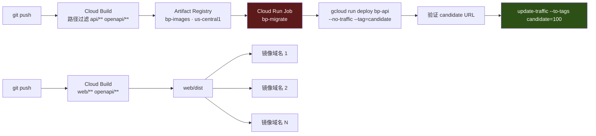

# 部署手册 · 每次部署都以隔离快照开始、以修订版回滚收尾

> 日期：2026-08-16（2026-08-20 按线上实况修状态） · 性质：**执行手册** ·
> 状态：**执行中**（2026-08-20 —— `bp-api`、`bp-db`、`bp-api-sa` 与 4 个 `bp-` secret
> **已经存在于 `oratis-491316` 并在计费**，见
> [as-built-gcp §10](../02-architecture/as-built-gcp.md)；
> 但线上参数与本文 §5 的示例命令**不一致**（见 §5 命令下方的红框），
> 且 `bp-migrate` Job、Scheduler、Tasks、Pub/Sub 与 `bp-web` 侧仍未实施）
> 事实基线：现有资产与隔离承诺见 [as-built-gcp.md](../02-architecture/as-built-gcp.md)（2026-08-16 `gcloud` 实测输出）；
> 部署形态见 [system-design.md](../02-architecture/system-design.md) §4；
> 数据库参数见 [ADR 0005](../05-adr/0005-database-selection.md) §6/§10；语言与镜像见 [ADR 0006](../05-adr/0006-api-stack.md) §4/§13；
> 托管与证书见 [ADR 0003](../05-adr/0003-web-hosting-and-reachability.md) §5 与 [ADR 0004](../05-adr/0004-transport-hardening.md) §3.4
> 证据口径：GCP 官方文档 = 中（本文未逐页逐字复核，凡关键处标 **待核实**）；
> 本项目实测 = **部分**（`bp-api` / `bp-db` 已上线，参数以
> [`infra/deploy/`](../../infra/deploy/) 的脚本与 as-built §10 为准，不以本文的示例命令为准）
> 读者：值班运维。**要发布 `bp-api` 或 `bp-web` 时从 §2 开始，出事时跳到 §12。**
> 关联：[runbook-node-health.md](runbook-node-health.md)（节点侧排障，本文不重复）、[monitoring.md](monitoring.md)（部署完必须补齐告警）

---

## 1 · 结论：部署的形状与五条不许违反的

控制面只有两个可部署单元，加三类无状态触发器：

| 单元 | 形态 | 构建产物 | 部署命令 | 回滚手段 | 本文章节 |
|---|---|---|---|---|---|
| `bp-api` | Cloud Run 服务（`us-central1`） | distroless 容器镜像 | `gcloud run deploy` | **修订版流量切换，秒级** | §4–§6 |
| `bp-migrate` | Cloud Run **Job**（同区、同镜像） | 同上 | `gcloud run jobs execute` | **不可回滚**（见 §12.3） | §6.3 |
| `bp-web` / `bp-docs` | 静态 SPA / 静态站 | `dist/` 目录 | 平台各自的发布命令 | 重新发布上一次构建 | §10 |
| Cloud Scheduler | 6 条定时任务 | — | `gcloud scheduler jobs create http` | 暂停任务 | §8 |
| Cloud Tasks | 1 条入账队列 | — | `gcloud tasks queues create` | 暂停队列 | §9 |
| Pub/Sub | 告警通道 | — | 见 [monitoring.md](monitoring.md) §4 | — | — |

**五条不许违反的**（每条后面括号里是违反的直接后果）：

1. **禁止 `gcloud run deploy --source .`。** 它会自动创建 / 复用 `cloud-run-source-deploy` 仓库 ——
   而那正是现有三个服务（`anthropic-relay` / `lisa-cloud` / `lisa-web`）的镜像所在地（as-built §4）。
   （后果：`bp-` 镜像与现有服务混在同一仓库，一次清理策略配错就删掉别人的镜像。）
2. **禁止在项目级授任何 `roles/secretmanager.secretAccessor`。** 只能逐 secret 授权。
   （后果：`bp-api-sa` 直接读到 `anthropic-api-key` 与 `relay-token`，as-built §5。）
3. **禁止 `--no-cpu-throttling`（always-allocated CPU）。** 它把计费从 request-based 切到 instance-based。
   （后果：[ADR 0006](../05-adr/0006-api-stack.md) §3.3 那套「200 万请求免费额度」的算术当场作废。）
4. **禁止 `--vpc-connector` / `--network` / `--subnet`。** 我们不碰 `default` 网络。
   （后果：`default` 正是 `vpn-us`/`vpn-jp` 所在的网络，落入「影响已部署服务」，ADR 0005 §6.4。）
5. **禁止 `--max-instances` 缺省。** Cloud Run 默认上限 100，`db-f1-micro` 只有 25 个连接。
   （后果：`FATAL: sorry, too many clients already`，控制面整体不可用，ADR 0005 §6.2。）



> `bp-migrate` 标红的原因只有一个：**它是这条流水线里唯一不可回滚的一步。**

---

## 2 · 部署前：隔离快照（每次部署前后各跑一次，不允许跳过）

as-built §2.1 第 5 条的可执行形式。把 §7 的清点命令固化成可 `diff` 的 JSON 快照。

```bash
#!/usr/bin/env bash
# deploy/snapshot.sh <目录名>   例：./deploy/snapshot.sh before
set -euo pipefail
P=oratis-491316
D=${1:?用法: snapshot.sh <before|after>}
mkdir -p "$D"

gcloud compute instances list      --project=$P --format=json | jq -S . > "$D/instances.json"
gcloud compute addresses list      --project=$P --format=json | jq -S . > "$D/addresses.json"
gcloud compute firewall-rules list --project=$P --format=json | jq -S . > "$D/firewall.json"
gcloud run services list           --project=$P --region=us-central1 --format=json | jq -S . > "$D/run.json"
gcloud secrets list                --project=$P --format=json | jq -S . > "$D/secrets.json"
gcloud artifacts repositories list --project=$P --format=json | jq -S . > "$D/artifacts.json"
gcloud iam service-accounts list   --project=$P --format=json | jq -S . > "$D/sa.json"
gcloud services list --enabled     --project=$P --format=json | jq -S . > "$D/apis.json"
```

判定用的不是「diff 为空」（新增 `bp-` 资源本来就会让 diff 非空），
而是「**排除 `bp-` 前缀之后的部分必须逐字节相同**」：

```bash
#!/usr/bin/env bash
# deploy/assert-untouched.sh   —— 无输出 = 通过；有输出 = 立即停止部署
set -euo pipefail
check() {  # $1=文件 $2=jq 取名字的路径表达式
  jq -S "[.[] | select((${2}) | startswith(\"bp-\") | not)]" "before/$1" > /tmp/bp_a.json
  jq -S "[.[] | select((${2}) | startswith(\"bp-\") | not)]" "after/$1"  > /tmp/bp_b.json
  diff -u /tmp/bp_a.json /tmp/bp_b.json && echo "OK  $1" || { echo "!!! 现有资源被改动：$1"; exit 1; }
}
check instances.json '.name'
check addresses.json '.name'
check firewall.json  '.name'
check secrets.json   '(.name | split("/") | last)'
check artifacts.json '(.name | split("/") | last)'
check sa.json        '(.email | split("@") | first)'
check run.json       '.metadata.name'
```

> ⚠️ `gcloud ... --format=json` 的字段路径**随 gcloud 版本变化**（`run services list` 是 Knative 风格的
> `.metadata.name`，其余是 `.name`）。第一次跑之前先手工 `gcloud run services list --format=json | jq '.[0] | keys'`
> 确认一次。标 **待核实**。

### 2.1 必须保持不变的清单（人工复核，一条都不能少）

| 资源 | 期望值（as-built 2026-08-16） |
|---|---|
| `vpn-us` | `us-west1-a` / `e2-micro` / `8.231.52.43` / RUNNING |
| `vpn-jp` | `asia-northeast1-a` / `e2-micro` / `34.104.192.233` / RUNNING |
| `vpn-us-ip-v4` / `vpn-jp-ip` | 均 IN_USE，地址不变 |
| 10 条防火墙规则 | 一条不增不减不改（含那三条已知有风险的） |
| `anthropic-relay` / `lisa-cloud` / `lisa-web` | URL 与 `lastDeployed` 不变 |
| `anthropic-api-key` / `relay-token` | 存在，版本数不变 |
| `cloud-run-source-deploy` 仓库 | 存在，**镜像数不减少** |

> **`gcloud config set project` 打错项目是本文最现实的事故源。**
> 所有命令一律显式写 `--project=$P`，不依赖当前 config。

---

## 3 · 一次性初始化（只做一次，做完写进 as-built）

### 3.1 启用 API

```bash
P=oratis-491316
gcloud services enable sqladmin.googleapis.com cloudscheduler.googleapis.com \
  cloudtasks.googleapis.com --project=$P
```

`run` / `artifactregistry` / `cloudbuild` / `secretmanager` / `iam` / `iap` / `logging` /
`monitoring` / `pubsub` 已启用（as-built §6）。
`dns` 与 `redis` **保持未启用** —— 我们的 DNS 在 Cloudflare，缓存用 Postgres `UNLOGGED` 表（ADR 0005 §8）。

### 3.2 Artifact Registry：新建 `bp-images`，不混用现有仓库

```bash
gcloud artifacts repositories create bp-images \
  --project=$P --repository-format=docker --location=us-central1 \
  --description="babel.plus 控制面镜像（勿与 cloud-run-source-deploy 混用）"

gcloud auth configure-docker us-central1-docker.pkg.dev
```

现有 `cloud-run-source-deploy` 约 1375 MB（as-built §4）。分仓的理由不是洁癖，是**清理策略的爆炸半径** ——
镜像仓库迟早要配自动清理，而清理策略是按仓库配的。

清理策略（先 `--dry-run` 看一遍再落）：

```json
[
  {"name":"keep-recent","action":{"type":"Keep"},
   "mostRecentVersions":{"packageNamePrefixes":["bp-api"],"keepCount":10}},
  {"name":"delete-untagged","action":{"type":"Delete"},
   "condition":{"tagState":"UNTAGGED","olderThan":"7d"}}
]
```

```bash
gcloud artifacts repositories set-cleanup-policies bp-images \
  --project=$P --location=us-central1 --policy=deploy/ar-cleanup.json --dry-run
```

> `set-cleanup-policies` 的确切子命名与 JSON schema 在 gcloud 各版本间变动过，**待核实**。

### 3.3 服务账号：四个，职责互不重叠

```bash
for sa in bp-api-sa bp-deploy-sa bp-tasks-sa; do
  gcloud iam service-accounts create $sa --project=$P --display-name="babel.plus $sa"
done
```

（`bp-node-sa` 属于节点侧，见 [ADR 0007](../05-adr/0007-node-migration.md)，本文不涉及。）

| SA | 是谁 | 角色 | 为什么不能合并 |
|---|---|---|---|
| `bp-api-sa` | Cloud Run 运行时身份 | `roles/cloudsql.client` + 逐 secret 的 `secretAccessor` + `roles/cloudtasks.enqueuer` | 运行时身份泄露 ≠ 能改部署 |
| `bp-deploy-sa` | CI / Cloud Build | `roles/run.developer` + `roles/artifactregistry.writer` + 对 `bp-api-sa` 的 `roles/iam.serviceAccountUser` | 部署身份不该能读生产 secret |
| `bp-tasks-sa` | Scheduler / Tasks / Pub-Sub push 的 OIDC 主体 | `roles/run.invoker`（仅 `bp-api`） | 它签出来的 token 会被 `/internal/tasks/*` 当作凭据（ADR 0006 §10.2） |

```bash
gcloud projects add-iam-policy-binding $P \
  --member=serviceAccount:bp-api-sa@$P.iam.gserviceaccount.com \
  --role=roles/cloudsql.client

gcloud run services add-iam-policy-binding bp-api \
  --project=$P --region=us-central1 \
  --member=serviceAccount:bp-tasks-sa@$P.iam.gserviceaccount.com \
  --role=roles/run.invoker

gcloud iam service-accounts add-iam-policy-binding bp-api-sa@$P.iam.gserviceaccount.com \
  --project=$P --member=serviceAccount:bp-deploy-sa@$P.iam.gserviceaccount.com \
  --role=roles/iam.serviceAccountUser
```

> **绝不复用 `2360090741-compute@developer.gserviceaccount.com`**（as-built §5）。
> 它被现有工作负载共用且权限过大 —— 用它跑 `bp-api` 等于把 babel.plus 的爆炸半径接到 `lisa-*` 上。

### 3.4 Cloud SQL 实例（照抄 ADR 0005 §10.2，一字不改）

```bash
gcloud sql instances create bp-db \
  --project=$P \
  --database-version=POSTGRES_17 \
  --edition=ENTERPRISE \
  --tier=db-f1-micro \
  --region=us-central1 \
  --storage-type=SSD --storage-size=10GB --storage-auto-increase \
  --backup --backup-start-time=10:00 \
  --enable-point-in-time-recovery \
  --retained-backups-count=14 \
  --retained-transaction-log-days=7 \
  --database-flags=autovacuum_vacuum_cost_delay=2

gcloud sql databases create bp --instance=bp-db --project=$P
gcloud sql users create bp_app --instance=bp-db --project=$P --password="$(openssl rand -base64 32)"
```

> 🔴 **`--edition=ENTERPRISE` 不能省**（ADR 0005 §10.2）：PostgreSQL 16+ 缺省是 Enterprise Plus，
> 而 Enterprise Plus 不支持 shared-core 机型，命令会带着一个语焉不详的报错直接失败。
>
> ⚠️ 上面那条 `users create` 会把密码留在 shell history 里。正确做法是先写进 Secret Manager（§7），
> 再从 secret 读出来建用户。

---

## 4 · `bp-api`：镜像

### 4.1 Dockerfile 要点

```dockerfile
# syntax=docker/dockerfile:1
FROM golang:1.25-bookworm AS build
WORKDIR /src
COPY go.mod go.sum ./
RUN --mount=type=cache,target=/go/pkg/mod go mod download
COPY . .
ARG GIT_SHA=dev
RUN --mount=type=cache,target=/root/.cache/go-build \
    CGO_ENABLED=0 GOOS=linux GOARCH=amd64 \
    go build -trimpath -buildvcs=false \
      -ldflags="-s -w -X main.revision=${GIT_SHA}" \
      -o /out/bp-api ./cmd/bp-api

FROM gcr.io/distroless/static-debian12:nonroot
COPY --from=build /out/bp-api /bp-api
USER nonroot:nonroot
ENV PORT=8080
ENTRYPOINT ["/bp-api"]
```

| 写法 | 为什么 | 出处 |
|---|---|---|
| `golang:1.25` | `pgx/v5` 要求 Go 1.25+，这是下限不是偏好 | ADR 0006 §1 |
| `CGO_ENABLED=0` | `distroless/static` 里没有 libc；pgx 是纯 Go 驱动，本来也不需要 cgo | ADR 0006 §8 |
| `distroless/...:nonroot` | **不是为了冷启动** —— Cloud Run 官方明确镜像体积不影响启动时间。要的是无 shell / 无包管理器的供应链攻击面 | ADR 0006 §4 |
| `-trimpath -ldflags="-s -w"` | 去掉构建机绝对路径与符号表 | — |
| `-X main.revision` | 让 `/healthz` 能回报自己是哪个 commit —— 排障时第一个要问的问题就是「线上到底是哪版」 | — |
| 监听 `$PORT` 且绑 `0.0.0.0` | Cloud Run 注入 `PORT`，绑 `127.0.0.1` 会导致容器被判定启动失败 | — |
| 不写 `HEALTHCHECK` | Cloud Run 不使用 Dockerfile 的 HEALTHCHECK，健康检查在 §5.3 配 | — |

> 🔴 **2026-08-21 新增的一条硬教训：短 sha 做 tag，在分支被 force-push 之后就不再指向任何东西。**
>
> 生产 `bp-api-2fbf49d` 的镜像 tag 来自 `git rev-parse --short=7 HEAD`。
> 排查时发现 **`2fbf49d` 不被任何分支引用** —— `pr7/p1-core-and-deploy` 后来被改写过，
> 那个 commit 成了孤儿。它还在 GitHub 的对象库里（能按完整 sha 取回），
> 但**没有任何常规操作能从仓库回答「线上跑的是哪份源码」**。
> 本次取回比对确认与 PR #9 的 head 只差 4 个文件、`api/` 侧全是注释，**属于运气好**。
>
> 两个修法，至少做一个（登记为 roadmap **B41**）：
> - `deploy-api.sh` 改用**完整 sha** 做 tag，并把分支名 + 完整 sha 写进镜像 label
>   （`--label` 或 Dockerfile 的 `LABEL`），这样 `docker inspect` 就能自证来源；
> - 或者约定：**已部署过的分支禁止 force-push**。
>
> `-X main.revision` 也一样只带短 sha —— 它解决的是「线上是哪版」，
> 但当短 sha 变成孤儿时这个答案是不可解析的。
>
> ---
>
> **2026-08-23 处置（第一条已做，第二条没做）：**
>
> 1. `infra/deploy/deploy-api.sh` 现在往镜像写六个 label：
>    `org.opencontainers.image.revision`（**完整 40 位 sha**）· `.version`（tag）· `.created`（构建时间）·
>    `plus.babel.git.branch` · `plus.babel.git.dirty` · `plus.babel.build.by`。
>    tag **仍是短 sha**（人要读它），但不再是唯一线索。
>    修订版另加 `--update-labels=bp-git-sha=<完整sha>`，让反查不必先拉镜像
>    （该 label 是否传播到新建修订版 **待核实**）。
> 2. 反查工具：`./infra/scripts/image-provenance.sh` —— 拿一个正在跑的 revision，
>    一条命令查出完整 sha，并**当场判断那个 commit 是否还被分支引用**（B41 的判据本身）。
> 3. **工作树脏时默认拒绝构建**，`--allow-dirty` 才放行且 tag 变成 `<短sha>-dirty`。
>    选「拒绝」而不是「标记后放行」的理由：label 记的是 HEAD 的 sha，构建进去的是工作区，
>    两者不一致时 label 就是一句**可信但错误**的话 —— 比没有 label 更糟。
>    ⚠️ 这道门**只在真的要构建时才关**。`--no-build`（两段式发布的第 4 步、回补一次
>    失败的部署）不构建任何东西，工作区脏不脏与那个已经存在的镜像无关 ——
>    早先的版本在那里也拦，等于把值班最常用的一条路堵死（值班做第 4 步时工作区
>    通常正脏着），2026-08-23 修。
> 4. **第二条修法（禁止已部署分支 force-push）没有做** ——
>    它要在代码托管方配分支保护，而仓库托管在哪至今未定（§15）。
>
> ⚠️ 顺带核实到的一件事：`-X main.version` 打的那个符号
>    **在 `api/cmd/server/main.go` 里根本不存在**（2026-08-23 grep），
>    所以 `--build-arg VERSION=` 目前是**空转**的，`/healthz` 也回报不了版本。
>    这不影响 label（label 在镜像元数据上，不经过链接器），但意味着
>    「让 `/healthz` 自证是哪个 commit」这条**还没有实现**。单独登记，不在本次处理。
>
> ⚠️ **需实测**：`distroless:nonroot`（uid 65532）能否读写 Cloud Run 注入的
> `/cloudsql/<conn-name>` Unix socket。若首次部署报连接被拒，先把 `USER nonroot` 去掉验证是不是权限问题，
> **不要**先去怀疑 Cloud SQL 配置。这一条没有一手数据。

### 4.2 两条构建路径

**A. 本地构建推 Artifact Registry**（第一次、以及 CI 未搭好之前用这条）

```bash
P=oratis-491316
SHA=$(git rev-parse --short=7 HEAD)
IMG=us-central1-docker.pkg.dev/$P/bp-images/bp-api:$SHA

docker buildx build --platform=linux/amd64 --build-arg GIT_SHA=$SHA -t "$IMG" --push api/
```

> `--platform=linux/amd64` 不是可选的 —— 在 Apple Silicon 上不写这个会推上去一个
> arm64 镜像，Cloud Run 拉起来直接 `exec format error`。

**B. Cloud Build 触发器**（单仓 + 路径过滤，ADR 0006 §13）

```yaml
# api/cloudbuild.yaml
steps:
  - name: gcr.io/cloud-builders/docker
    args: ["build","--build-arg","GIT_SHA=$SHORT_SHA",
           "-t","us-central1-docker.pkg.dev/$PROJECT_ID/bp-images/bp-api:$SHORT_SHA",
           "-f","api/Dockerfile","api/"]
  - name: gcr.io/cloud-builders/docker
    args: ["push","us-central1-docker.pkg.dev/$PROJECT_ID/bp-images/bp-api:$SHORT_SHA"]
images: ["us-central1-docker.pkg.dev/$PROJECT_ID/bp-images/bp-api:$SHORT_SHA"]
options:
  logging: CLOUD_LOGGING_ONLY
serviceAccount: projects/$PROJECT_ID/serviceAccounts/bp-deploy-sa@$PROJECT_ID.iam.gserviceaccount.com
```

```bash
gcloud builds triggers create github \
  --project=$P --region=us-central1 --name=bp-api-build \
  --repo-name=babel-plus --repo-owner=<owner> --branch-pattern='^main$' \
  --included-files='api/**,openapi/**' \
  --build-config=api/cloudbuild.yaml
```

`--included-files` 是 ADR 0006 §13「单仓 ≠ 单体部署」的落地形式：
`web/**` 的改动**不应**触发 API 构建，反之亦然；`openapi/**` 两条都触发。

> `options.logging: CLOUD_LOGGING_ONLY` 不是可选项 —— 用自定义 `serviceAccount` 的构建
> 若不显式指定日志去向会直接报错。

---

## 5 · `bp-api`：`gcloud run deploy` 完整命令

```bash
P=oratis-491316
SHA=$(git rev-parse --short=7 HEAD)

gcloud run deploy bp-api \
  --project=$P \
  --region=us-central1 \
  --image=us-central1-docker.pkg.dev/$P/bp-images/bp-api:$SHA \
  --revision-suffix=$SHA \
  --service-account=bp-api-sa@$P.iam.gserviceaccount.com \
  --add-cloudsql-instances=$P:us-central1:bp-db \
  --allow-unauthenticated \
  --ingress=all \
  --min-instances=0 \
  --max-instances=8 \
  --concurrency=80 \
  --cpu=1 \
  --memory=512Mi \
  --timeout=120 \
  --cpu-boost \
  --set-env-vars=DB_HOST=/cloudsql/$P:us-central1:bp-db,DB_NAME=bp,DB_USER=bp_app,DB_POOL_MAX=2,APP_ENV=prod,GIT_SHA=$SHA \
  --set-secrets=DB_PASSWORD=bp-db-password:latest,JWT_SIGNING_KEY=bp-jwt-signing-key:latest,SUB_TOKEN_PEPPER=bp-sub-token-pepper:latest,NODE_TOKEN_PEPPER=bp-node-token-pepper:latest,MAIL_API_KEY=bp-mail-api-key:latest \
  --no-traffic --tag=candidate
```

> 🔴 **上面这段命令与线上实况不一致（2026-08-20 核实）——
> 要发布请以 [`infra/deploy/deploy-api.sh`](../../infra/deploy/deploy-api.sh) 为准。**
>
> - 线上 `bp-api` 用的是 `BP_*` 前缀的环境变量
>   （`BP_ENV` / `BP_GCP_PROJECT_ID` / `BP_DB_MAX_CONNS` / `BP_LOG_LEVEL` /
>   `BP_TRUST_PROXY_HEADERS` / `BP_ALLOWED_ORIGINS`），
>   连接串**整串**走 secret `bp-database-url` → `BP_DATABASE_URL`；
>   `DB_HOST` / `DB_NAME` / `DB_USER` / `APP_ENV` / `GIT_SHA` 与 secret `bp-db-password`
>   **线上都不存在**。环境变量名的唯一事实源是
>   [`api/internal/config/config.go`](../../api/internal/config/config.go)。
> - 线上也没有挂 `bp-mail-api-key` —— `setup-infra.sh` 明确不建它（ESP 未选型，见 §15）。
> - `--service-account`、`--add-cloudsql-instances`、`--max-instances=8`、`--cpu-boost`
>   四项线上与本节**一致**，5.1 的推理仍然成立。
>
> 偏差登记见 [infra/deploy/README.md §4](../../infra/deploy/README.md) 第 4 行，
> 线上实际参数见 [as-built-gcp §10.1](../02-architecture/as-built-gcp.md)。

### 5.1 逐参数交代（这一节是本文的核心，不要跳读）

| 参数 | 值 | 依据 |
|---|---|---|
| `--max-instances` | **8** | 硬公式 `max_instances × pool_max + 运维预留 ≤ max_connections − 3`：`8 × 2 + 6 = 22 ≤ 25 − 3`。ADR 0005 §6.2。**这个数字属于数据库，不属于 Cloud Run** —— 升到 `db-g1-small` 才能改到 20 |
| `--concurrency` | **80** | Cloud Run 默认值，ADR 0005 §10.3 沿用。我们的请求是「一次主键查 + 返 304」为主（ADR 0006 §11.2），单实例扛 80 并发绰绰有余。**调低它等于变相调高实例数，会直接撞 §5 的连接数天花板** |
| `--cpu` / `--memory` | **1 / 512Mi** | Go 静态二进制 + 池上限 2 连接，512 MiB 是宽裕的。`--cpu=1` 是能拿到 request-based 计费的最小完整核；小于 1 会限制并发能力 |
| `--min-instances` | **0** | 见 §5.2 |
| `--timeout` | **120s** | 必须 ≥ 最慢的 `/internal/tasks/*`（日聚合）。**不要拉到 3600** —— 实例总数只有 8，一个卡住的请求就吃掉 12.5% 的容量。若某个聚合确实超过 120 秒，把它拆成 Cloud Run **Job**，不要动这个值 |
| `--cpu-boost` | 开 | 启动期给额外 CPU，缩短冷启动。ADR 0006 §3 全部冷启动数据都标了 **需实测**，所以这一条也是「先开着，等基线数据再评估」。其计费细节 **待核实** |
| `--allow-unauthenticated` | 必须 | 鉴权在应用层（五条互不共享的中间件链，ADR 0006 §10）。节点、客户端、Cloud Tasks 都是**公网**调用方，IAM 级鉴权在这里不适用 |
| `--ingress=all` | 必须 | 同上 |
| `--add-cloudsql-instances` | 必须 | Unix socket 连接器，$0，不碰 `default` 网络。ADR 0005 §6.4 |
| `--revision-suffix=$SHA` | 建议 | 让 `gcloud run revisions list` 直接可读成 commit。副作用：**同一 commit 重复部署会因修订版重名失败** —— 这是特性不是 bug，它挡住了「以为改了其实没改」的重发 |
| `--no-traffic --tag=candidate` | 建议 | 先起不接流量的候选版本，验证后再切。见 §12.1 |

**没有出现在命令里、且必须继续保持没有的**：
`--vpc-connector`、`--network`、`--subnet`、`--no-cpu-throttling`、`--source`。理由见 §1。

### 5.2 `--min-instances` 为什么是 0

三条理由，按分量排序：

1. **节点轮询本身就是保温器。** ADR 0006 §3.3：按每节点每 60 秒 4 次请求算，
   2 个节点就是**每 7.5 秒**一个请求，10 个节点每 1.5 秒一个。实例基本不会缩到零，
   `min-instances=1` 买到的东西**在稳态下已经免费拥有了**。
2. **成本量级不对。** `min-instances=1` 意味着 730 h × 3600 s = **2,628,000 vCPU-s/月**，
   是 180,000 免费额度的 **14.6 倍**。按 ADR 0006 §3.4 引用的（**待核实**）$0.000024/vCPU-s
   上限估算约 **$63/月** —— 即使 Google 对 min-instance 空闲时段有折扣（折扣倍率 **待核实**），
   量级仍是「整个数据库月费 $9.53 的数倍」。为一个稳态下不存在的问题付这笔钱不合理。
3. **架构上本来就不需要它。** system-design §4 明确「流量入账走 Cloud Tasks / Pub-Sub push，
   不要常驻 worker，这样彻底不需要 `min-instances`」。开 `min-instances` 等于悄悄推翻那条裁决。

> ⚠️ 反面证据要留在记录里：Cloud Run 官方立场是空闲实例（**包括 `min-instances` 保温的**）
> 可能随时被关停（ADR 0006 §3.3 注）。所以 `min-instances=1` 连「保证不冷启动」都做不到。
> **复审触发条件**：若 [monitoring.md](monitoring.md) §5 的 `startup_latencies` P95 基线
> 超过 3 秒，且冷启动确实落在用户请求上（而不是只落在部署时），本条重新评估。

### 5.3 健康检查：两个端点，用途不同

> 🔴 **2026-08-30 订正：下面这张表描述的是设计意图，实现与它有三处不一致，逐条列出。**
> 原表保留在下方（它是 2026-08-16 的设计记录），**但落地时以「实现」那一列为准**。
>
> | 项 | 本表原写 | `api/` 实际实现 | 后果 |
> |---|---|---|---|
> | 路径 | `/healthz` | **`/-/healthz`** | Cloud Run 的 Google Frontend **拦截 `/healthz`**，请求根本到不了容器（2026-08-17 实测，证据 [cloudrun-healthz-intercept-20260817](../evidence/cloudrun-healthz-intercept-20260817/)）。探活配 `/healthz` = 永远探不到我们的服务 |
> | 响应体 | `{"ok":true,"revision":"<sha>"}` | **三个字节的纯文本 `ok`**（`api/internal/handler/server.go`：`return gen.GetHealthz200TextResponse("ok"), nil`） | 任何 `--matcher-content='"ok":true'` 的判据**从第一天起永久报红**。[monitoring.md §6.2 / §7](monitoring.md) 已同步改成 `ok` |
> | `revision` 字段 | 有 | **没有** | `/healthz` 至今回报不了版本（`-X main.version` 打的符号在 `main.go` 里不存在，见 [roadmap B41](../00-overview/roadmap.md) 遗留第 ③ 条） |
> | 查不查 DB | `/healthz` **不查**，另有 `/readyz` 查 | **`/-/healthz` 会查**（`s.db.Health(ctx)`，DB 不可达返 503）；**`/readyz` 这个 operation 在 `openapi.yaml` 里不存在** | 下面那条「`/healthz` 绝不能查数据库」的论证**在当前实现上没有落地** —— 一次 Cloud SQL 抖动确实会让 Cloud Run 判容器不健康。这是一处**真实且未修的设计-实现偏离**，登记为下面的 ⚠️ 一条 |

| 端点 | 查数据库吗 | 谁用 | 失败意味着 |
|---|---|---|---|
| `/healthz` | **不查** | Cloud Run startup/liveness probe、Uptime check | 进程活着、能接 HTTP。返回~~`{"ok":true,"revision":"<sha>"}`~~ **纯文本 `ok`**（2026-09-02 订正，与上表一致；实现见 `server.go`） |
| `/readyz` | **查**（`SELECT 1`） | 只给 [monitoring.md](monitoring.md) 用 | 数据库不可达 |

**`/healthz` 绝不能查数据库。** system-design §5.3 的原则是「控制面故障不得升级为数据面故障」；
如果 `/healthz` 依赖 DB，一次 Cloud SQL 抖动就会让 Cloud Run 判定容器不健康并重启全部实例 ——
把一个「部分功能降级」放大成「整体不可用」。

> ⚠️ **这条原则当前没有被实现遵守，2026-08-30 登记。** `handler.GetHealthz` 的第一行就是
> `if err := s.db.Health(ctx); err != nil { return gen.GetHealthz503JSONResponse{}, nil }` ——
> 它**查 DB**，而且它就是 Cloud Run 探针打的那个端点。该文件自己的注释写着
> 「只探数据库连接，不查业务表」，说明写的人是**有意**这么做的，只是与本节的裁决相反。
> 两条路可选（本文不代替裁决）：① 按本节改实现，拆出不查 DB 的 `/-/healthz` 与查 DB 的 `/readyz`；
> ② 按实现改本节，并显式接受「Cloud SQL 抖动会重启全部实例」这个代价。
> **在二选一之前，不要把这段文字当成对线上行为的描述。**

```bash
gcloud run services update bp-api --project=$P --region=us-central1 \
  --startup-probe=httpGet.path=/healthz,initialDelaySeconds=0,timeoutSeconds=2,periodSeconds=2,failureThreshold=10
```

> probe 参数的 `gcloud` 平铺语法在版本间有差异，**待核实**；用 `--startup-probe` 报错时改用
> YAML（`gcloud run services replace service.yaml`）。

---

## 6 · 数据库连接

### 6.1 连接串

Cloud Run 在容器里注入 `/cloudsql/<INSTANCE_CONNECTION_NAME>` 目录（内含 `.s.PGSQL.5432`），
所以 DSN 的 `host` 是**目录路径**不是主机名：

```
postgres://bp_app:${DB_PASSWORD}@/bp?host=/cloudsql/oratis-491316:us-central1:bp-db
```

不需要 `sslmode` —— 连接器本身走 Google 内部网络且已加密。
不需要 authorized network，**数据库的公网 IP 上没有任何一条白名单**（ADR 0005 §10.2）。

### 6.2 pgxpool 参数（这些数字是被数据库倒逼出来的，不是调优）

```go
cfg, err := pgxpool.ParseConfig(dsn)
cfg.MaxConns        = 2                 // ← 与 --max-instances=8 相乘必须 ≤ 22
cfg.MinConns        = 1                 // 最坏情况 8×1=8 常驻，仍在预算内
cfg.MaxConnIdleTime = 30 * time.Second  // Cloud Run 空闲实例仍持连接，必须主动放
cfg.MaxConnLifetime = 30 * time.Minute
cfg.HealthCheckPeriod = 15 * time.Second
```

> 🔴 **不要照抄网上「Cloud SQL 要把 `DefaultQueryExecMode` 设成 `QueryExecModeExec`」的说法。**
> 那条建议是给 PgBouncer transaction pooling 准备的（ADR 0006 §8.2）。
> 我们**没有** PgBouncer —— Cloud SQL 的 Managed Connection Pooling 要求 Enterprise Plus，
> 而 Enterprise Plus 不支持 shared-core，这条路对我们是封死的（ADR 0005 §6.2）。
> 保持 pgx 默认的语句缓存（`StatementCacheCapacity` 512），我们直连，用得上。

### 6.3 迁移：独立 Job，不在容器启动时跑

```bash
gcloud run jobs deploy bp-migrate \
  --project=$P --region=us-central1 \
  --image=us-central1-docker.pkg.dev/$P/bp-images/bp-api:$SHA \
  --command=/bp-api --args=migrate,up \
  --service-account=bp-api-sa@$P.iam.gserviceaccount.com \
  --set-cloudsql-instances=$P:us-central1:bp-db \
  --set-secrets=DB_PASSWORD=bp-db-password:latest \
  --set-env-vars=DB_HOST=/cloudsql/$P:us-central1:bp-db,DB_NAME=bp,DB_USER=bp_app \
  --max-retries=0 --task-timeout=600 --tasks=1

gcloud run jobs execute bp-migrate --project=$P --region=us-central1 --wait
```

三条硬要求：

1. **不在 `bp-api` 启动时跑迁移。** 8 个实例会并发跑同一份迁移。
   即使工具带锁，也会让冷启动挂在锁上。
2. **迁移必须持 Postgres advisory lock**（`SELECT pg_advisory_lock(<常量>)`），`--max-retries=0`
   保证失败不自动重试（重试一个改了一半 schema 的迁移比失败更糟）。
3. **expand / contract 两段式。** 一次发布只能做「加列 / 加表 / 加可空字段」，
   删列与改类型放到下一次发布。理由见 §12.3：**代码能回滚，schema 不能。**

> ⚠️ 上面这段 `gcloud run jobs deploy` 示例与仓库里实际的 `infra/migrate/` 实现**不一致**
> （env 名、secret 名、`--command`），偏差早已登记在
> [`infra/deploy/README.md §4`](../../infra/deploy/README.md)，**以脚本为准**。
> 实际入口是 `infra/migrate/entrypoint.sh`，用 `infra/migrate/build-and-run.sh` 驱动。

### 6.4 dirty 状态的处置（这条以前只在 entrypoint 的报错里，正文没有）

`migrate` 执行到一半失败会在 `schema_migrations` 留下 `dirty = true`，
之后一切 `up` / `down` 都会被 `infra/migrate/entrypoint.sh` 的闸门拒绝。**这是对的**，
但闸门**放行 `version` 与 `force` 两条**，所以恢复不需要绕过脚本：

```bash
# 1. 先看现在停在哪一版（dirty 下这条是放行的）
BP_MIGRATE_CMD=version ./infra/migrate/build-and-run.sh --step=run

# 2. 登库核对 schema 到底应用到了哪一步 —— 这一步不能省，也不能靠猜。
#    看那一版迁移文件里的每条 DDL 是否都已生效（表/列/索引/约束逐个查）。
#    「不能盲目 force」指的就是跳过这一步。

# 3. force 到核对出来的那个版本号（只改 schema_migrations，不执行任何 SQL）
BP_MIGRATE_CMD=force BP_MIGRATE_ARG=<核对出的版本号> ./infra/migrate/build-and-run.sh --step=run

# 4. 重新 up
./infra/migrate/build-and-run.sh --step=run
```

**两个方向的 force 都可能是对的**，取决于第 2 步查到什么：
DDL 全都生效了就 force 到**这一版**（然后 up 会从下一版继续）；
一条都没生效就 force 到**上一版**（然后 up 会重跑这一版）。
生效了一部分是最麻烦的情况 —— 手工补齐或手工回退到一个干净的版本边界，再 force。

> `--max-retries=0` 在这里是必需的：自动重试一个 dirty 的迁移只会让第 2 步更难查。

---

## 7 · 密钥管理

### 7.1 清单

| Secret | 内容 | 消费者 | 轮换方式 |
|---|---|---|---|
| `bp-db-password` | `bp_app` 的密码 | `bp-api`、`bp-migrate` | `gcloud sql users set-password` + 新 secret version + 重部署 |
| `bp-jwt-signing-key` | 用户面板 access/refresh JWT 签名密钥 | `bp-api` | 双密钥并存（新签旧验）→ 过 refresh 有效期后撤旧 |
| `bp-sub-token-pepper` | 订阅 token 哈希的 pepper | `bp-api` | **不可轮换**（轮换 = 全体订阅失效）。要撤销用 `sub_revoked_at` |
| `bp-node-token-pepper` | 节点密钥哈希的 pepper | `bp-api` | 同上，节点密钥的轮换走 DB 两步流程（page-inventory D5） |
| `bp-mail-api-key` | 主 ESP 的 API key | `bp-api` | 直接换 version |
| `bp-mail-api-key-backup` | **第二家** ESP（ADR 0002 §5 要求两家互为备份） | `bp-api` | 同上 |
| `bp-payment-webhook-secret` | 支付回调签名校验密钥 | `bp-api` | 与支付商同步换 |

**不进 Secret Manager 的东西**（写下来是为了防止将来有人「顺手」放进去）：

- **节点的 UniProxy 密钥** —— 每节点独立、DB 存哈希、支持在线轮换吊销（system-design §5.1）。
  它是**数据**不是配置，放进 Secret Manager 就失去了「按节点吊销」的能力。
- **管理员 TOTP 种子** —— 在 DB 里加密存，不在 Secret Manager。
- **USDT 收款地址的私钥** —— 产品上不做提现（product-brief §6），收款只需要**观察地址**。
  私钥根本不应该存在于任何联网系统里。这是本项目少数几处「结构上就没有风险」的地方，别把它毁了。

### 7.2 创建与授权

```bash
P=oratis-491316
new_secret() {  # new_secret <name>  从 stdin 读值
  gcloud secrets create "$1" --project=$P \
    --replication-policy=user-managed --locations=us-central1 --data-file=-
  gcloud secrets add-iam-policy-binding "$1" --project=$P \
    --member=serviceAccount:bp-api-sa@$P.iam.gserviceaccount.com \
    --role=roles/secretmanager.secretAccessor
}

openssl rand -base64 48 | tr -d '\n' | new_secret bp-jwt-signing-key
openssl rand -base64 48 | tr -d '\n' | new_secret bp-sub-token-pepper
openssl rand -base64 48 | tr -d '\n' | new_secret bp-node-token-pepper
```

三条要点：

- `--replication-policy=user-managed --locations=us-central1`：与 `bp-api`、`bp-db` 同区，
  与 ADR 0005 §9 的数据驻留结论一致。
- **逐 secret 授权，不在项目级授。** 项目级 `secretAccessor` 会把
  `anthropic-api-key` 与 `relay-token`（as-built §5，属于**现有服务**）一并交给 `bp-api-sa`。
  这是本项目「软隔离」下最容易犯、且后果最严重的一个 IAM 错误。
- `--set-secrets` 里全部钉 `:latest` 是有代价的：**加一个 secret version 会在下次实例启动时生效，
  而不是立刻生效**，于是同一时刻可能有实例用新值、有实例用旧值。
  对 JWT 签名密钥这种「双密钥并存期」的场景要按此设计，不要假设切换是原子的。

> ⚠️ **`--set-secrets` 与 `--set-env-vars` 是「全量替换」语义**：漏写一项就是静默删除一项。
> 部署脚本必须每次列全。若只想改一项，用 `--update-secrets` / `--update-env-vars`。

---

## 8 · Cloud Scheduler 定时任务

### 8.1 audience 一律用 `run.app` URL，不用镜像域名

```
AUD=https://bp-api-2360090741.us-central1.run.app
```

这不是省事，是设计：

- **域名池会轮换**（ADR 0003 §5），而 OIDC 的 `aud` 是硬校验（ADR 0006 §10.2）。
  audience 跟着镜像域名走，意味着每换一次域名都要重建全部 Scheduler / Tasks 配置。
- 更重要的是**故障隔离**：定时任务打 `run.app` 直连，
  **公开域名被封时，重置、到期、聚合、入账全部照常运行**。
  这一条与 system-design §5.3「控制面故障不得升级为数据面故障」是同一条原则的控制面内部版本。

### 8.2 六条任务

| # | 任务名 | cron（`--time-zone=Asia/Shanghai`） | 端点 | 幂等锚 | 漏跑/重跑的后果 |
|---|---|---|---|---|---|
| 1 | `bp-alive-gc` | `*/5 * * * *` | `/internal/tasks/alive-gc` | 条件式 `DELETE`，天然幂等 | 漏跑：在线设备数虚高，误判设备超限。重跑：无害 |
| 2 | `bp-order-timeout` | `*/2 * * * *` | `/internal/tasks/order-timeout` | `WHERE status='pending' AND expires_at < now()` | 重跑：零行。**取消订单不得停止收款地址监听**（user-journey：过期订单地址继续监听 ≥24 h，到账入余额） |
| 3 | `bp-expire-sweep` | `*/10 * * * *` | `/internal/tasks/expire-sweep` | `WHERE expired_at <= now() AND status <> 'expired'` | 漏跑：过期用户继续用（最长 10 min + 60 s 轮询）。重跑：零行 |
| 4 | `bp-traffic-reset` | `7 * * * *` | `/internal/tasks/traffic-reset` | 置零与推进 `next_reset_at` **在同一条 UPDATE 里**完成 | 🔴 若拆成两条语句，重跑会**把用户流量二次清零**。这是本表最危险的一条 |
| 5 | `bp-stat-rollup-daily` | `20 1 * * *` | `/internal/tasks/rollup?grain=day` | `INSERT … ON CONFLICT DO UPDATE SET u = EXCLUDED.u`（**覆盖，不累加**） | 重跑：结果相同。若写成 `u = stat.u + EXCLUDED.u`，重跑即翻倍 |
| 6 | `bp-stat-rollup-monthly` | `35 1 1 * *` | `/internal/tasks/rollup?grain=month` | 同上 | 同上 |

**四条贯穿全表的规则**：

1. **幂等不是「记一个 task id」，是「把幂等写进 SQL 的 WHERE 或 ON CONFLICT 里」。**
   Cloud Scheduler 会重试（`--max-retry-attempts`），Cloud Tasks 是 at-least-once（ADR 0006 §12），
   重复投递是常态不是异常。
2. 🔴 **任务 3 与任务 4 必须 bump `user_rev`，任务 5/6 绝不能 bump。**
   ADR 0006 §11.2 定死了这条：凡改变节点可见用户集合的写操作必须 bump `user_rev`，
   而流量累加不得 bump。**流量重置会让一个超额用户重新可用 —— 它改变了可见用户集合，属于必须 bump 的一类。**
   漏 bump 的现象是：用户续了费/重置了流量，但节点端一直用旧表，用户连不上，
   而面板上一切正常。这是最难排查的一类故障。
3. 统计口径的「一天」统一按 `Asia/Shanghai`（用户与账单都在中国时区），
   DB 存 `timestamptz`，聚合时显式 `AT TIME ZONE 'Asia/Shanghai'`。cron 也用同一时区。
   **口径只定这一次，之后所有报表都用它** —— 两套时区口径的对账问题会比它解决的任何问题都大。
4. 全部任务**只做集合操作，不做逐用户循环**。ADR 0005 §7 第 1 条已经为 `push` 定了这条规矩，
   定时任务同理。

### 8.3 创建命令

```bash
P=oratis-491316
AUD=https://bp-api-2360090741.us-central1.run.app
SA=bp-tasks-sa@$P.iam.gserviceaccount.com

mkjob() {  # mkjob <name> <cron> <path>
  gcloud scheduler jobs create http "$1" \
    --project=$P --location=us-central1 \
    --schedule="$2" --time-zone="Asia/Shanghai" \
    --uri="$AUD$3" --http-method=POST \
    --oidc-service-account-email=$SA --oidc-token-audience="$AUD" \
    --attempt-deadline=120s \
    --max-retry-attempts=3 --min-backoff=10s --max-backoff=120s
}

mkjob bp-alive-gc            "*/5 * * * *"  /internal/tasks/alive-gc
mkjob bp-order-timeout       "*/2 * * * *"  /internal/tasks/order-timeout
mkjob bp-expire-sweep        "*/10 * * * *" /internal/tasks/expire-sweep
mkjob bp-traffic-reset       "7 * * * *"    /internal/tasks/traffic-reset
mkjob bp-stat-rollup-daily   "20 1 * * *"   "/internal/tasks/rollup?grain=day"
mkjob bp-stat-rollup-monthly "35 1 1 * *"   "/internal/tasks/rollup?grain=month"
```

第七条任务 `bp-db-dump-weekly` 是 Cloud Run **Job**（需要 `pg_dump` 二进制与更长超时），
按 ADR 0005 §10.4 每周日跑一次 `pg_dump -Fc` 到跨区 GCS bucket `bp-db-dump`：

```bash
gcloud scheduler jobs create http bp-db-dump-weekly \
  --project=$P --location=us-central1 --schedule="0 3 * * 0" --time-zone="Asia/Shanghai" \
  --uri="https://us-central1-run.googleapis.com/apis/run.googleapis.com/v1/namespaces/$P/jobs/bp-db-dump:run" \
  --http-method=POST --oauth-service-account-email=$SA
```

> 触发 Cloud Run Job 用的是 **OAuth**（`--oauth-service-account-email`）不是 OIDC，
> 因为调用的是 Google API 而不是我们自己的端点。该 SA 需要 `roles/run.invoker`。
> 这条 URI 的形式 **待核实**（Cloud Run Jobs 的 Admin API 路径在版本间调整过）。

---

## 9 · Cloud Tasks：流量入账队列

```bash
gcloud tasks queues create bp-traffic-ingest \
  --project=$P --location=us-central1 \
  --max-concurrent-dispatches=4 \
  --max-dispatches-per-second=10 \
  --max-attempts=10 \
  --min-backoff=5s --max-backoff=300s --max-doublings=4
```

`--max-concurrent-dispatches=4` 与 `--max-dispatches-per-second=10` 直接来自 ADR 0005 §6.2 第 2 条。
**这些任务打的是同一个 `bp-api` 服务，消耗的是同一份 `--max-instances=8` 预算** ——
不限并发的话，一批任务同时投递会瞬间把实例拉满，把用户请求挤成 429。

### 9.1 队列真正买到的是什么

诚实记录：按 ADR 0005 §2 的量化，P3 情景（8 节点 / 300 活跃用户）也只有 **40 行/秒**，
同步入账在吞吐上完全算得过来。**队列不是为了吞吐。**

它买到的是**解耦**：`POST /api/v1/server/UniProxy/push` 落一条待处理记录就返回 200，
DB 慢或短暂不可用时节点仍然拿到成功响应、不会重复上报也不会丢数据。
这是 system-design §5.3 那条要求（面板不可用时节点必须继续工作）在入账方向上的对称形式。

### 9.2 幂等：at-least-once 是常态

v2node 的 `push` 载荷是 `{uid: [upload, download]}`（system-design §5.1），
**里面没有任何批次标识** —— 幂等键必须由我们生成：

```
1. push handler：生成 ingest_id (uuid) → 写 traffic_ingest(ingest_id, node_id, payload, created_at) → 200
2. 入队一个携带 ingest_id 的 task
3. worker：BEGIN
     INSERT INTO ingest_applied(ingest_id) VALUES ($1);   -- PK 冲突 = 已处理过，直接 ROLLBACK 返 200
     UPDATE user_traffic AS t SET u = t.u + v.u, d = t.d + v.d
       FROM (VALUES ...) AS v(user_id,u,d) WHERE t.user_id = v.user_id;   -- 一条语句，ADR 0005 §7
     DELETE FROM traffic_ingest WHERE ingest_id = $1;
   COMMIT
```

- **重复投递返回 200 而不是 4xx** —— 返错会让 Cloud Tasks 继续重试同一个已完成的任务。
- `ingest_applied` 需要一条清理任务（保留 7 天足够覆盖 `--max-backoff` 与人工重放窗口）。
- 这条路径**不得 bump `user_rev`**（ADR 0006 §11.2 第 3 条）：
  流量累加每 60 秒发生一次，bump 它等于让 ETag 永远不命中，整套 304 设计归零。
- 幂等必须有**表驱动测试**（ADR 0006 §12），不是靠 code review 看出来。

**Pub/Sub 不用在这里。** 本项目里 Pub/Sub 的唯一用途是告警通道
（[monitoring.md](monitoring.md) §4）。分工：**Cloud Tasks 管入账，Pub/Sub 管告警。**
两者混用会让「队列积压」这个告警自己也走在积压的队列里。

---

## 10 · `bp-web`：静态 SPA

### 10.1 构建产物只有一份，发布到 N 个镜像

```bash
cd web
npm ci
VITE_API_BASE_POOL="https://api.babel.plus,https://<api-镜像2>" \
VITE_MIRRORS_FILE=public/mirrors.json \
npm run build          # → web/dist
```

**同一份 `dist/` 原封不动发布到域名池里的每一个域名。** 三条来自 ADR 0003 与 page-inventory 的硬约束：

1. **落地页零 API 调用、纯静态** —— API 域名被封时它必须仍然完整可用。
2. **页脚常驻全部镜像域名**，来源是构建期注入的 `mirrors.json`；
   因此**新增一个镜像域名要重新发布全部镜像**（见 §11.3）。
3. **字体、图标一律自托管**。理由是消除不可控第三方依赖 ——
   **不是**因为 Google Fonts 被封（ADR 0003 记录 `fonts.googleapis.com` 约 90% 可达，那个流行说法是错的）。

### 10.2 平台与发布命令

ADR 0003 §3.2 的修订结论：封锁是 **SNI 级**的，`*.pages.dev` / `*.vercel.app` 被封而
Cloudflare 的 IP 段本身完全可达 —— 所以**自有域名 + Cloudflare Pages 是可用的**，
GitHub Pages（平台异常率 8.9%，等同基线）与 Netlify（25.8%）同样可用。
**平台不是单点，域名才是** —— 因此镜像应当**跨平台**分布，而不是同平台多域名。

| 镜像 | 平台 | 发布命令 | 证书签发者 |
|---|---|---|---|
| 主 | Cloudflare Pages | `npx wrangler pages deploy dist --project-name=bp-web` | **必须手工钉 Let's Encrypt**（见 §11.2） |
| 备 1 | GitHub Pages | push 到 `gh-pages` 分支 + `CNAME` 文件 | 平台自动签发 Let's Encrypt（**待核实**：GitHub Pages 曾用 LE，需实测确认） |
| 备 2 | Netlify | `npx netlify deploy --prod --dir=dist` | 平台自动签发 Let's Encrypt（**待核实**） |

**明确不用的**：
`*.pages.dev` / `*.vercel.app` / `*.github.io` 平台子域名（ADR 0003 §3.5：
自有域名是我们**能控制、能轮换**的主机名，平台子域名不是）；
Vercel 整体（99.1% 异常率，675/675 主机名全封）。

### 10.3 三条不能带进 `bp-web` 的依赖

| 不做 | 理由 | 出处 |
|---|---|---|
| **不用 Cloudflare Turnstile** | 不在 Cloudflare China Network 可用产品清单里 | ADR 0003 §3.2 |
| **不依赖 Cloudflare DoH** | `one.one.one.one` 115/115 全异常、`cloudflare-dns.com` 41,969/41,969 dnscheck 失败。前端若依赖它做 DNS 会**静默失效** | ADR 0003 §3.2 注 |
| **P1 不上任何 captcha** | reCAPTCHA 依赖 `google.com`（大陆封锁）、hCaptcha 大陆可达性无数据。注册被邀请码封死，登录/找回密码用 IP + 账号双维度速率限制 + 指数退避 | page-inventory |

### 10.4 `bp-docs`（教程站）

同样的构建—多镜像模型，但有一条额外要求：**它必须在用户连不上代理时可达**
（system-design §4：「本身不能需要梯子才能打开」）。
`bp-docs` 与 `bp-web` **必须是不同主域名**，不能是同一域名的子域 —— GFW 的封锁粒度常在主域名级别。

> ⚠️ system-design §2 的拓扑图画的是 `web.babel.plus` / `docs.babel.plus` 两个**子域**，
> 与同文 §4.1「三者必须是独立域名，不能是同一域名的不同子域」自相矛盾。
> **本文按更严的 §4.1 执行**（这一矛盾 page-inventory 已登记，待 ADR 裁决）。

---

## 11 · 域名与证书

### 11.1 三套独立域名池

| 池 | 用途 | 最少域名数 | 被封时的影响 | 谁在用 |
|---|---|---|---|---|
| **WEB** | 用户面板 + 落地页 + 后台（后台另用独立主域名） | 2 | 看不到面板，**已连接用户完全不受影响** | 浏览器 |
| **API** | 用户 API + 订阅下发 | 2 | 客户端拉不到新订阅；**节点不受影响**（节点走 `run.app`，见 §8.1） | 浏览器 + 代理客户端 |
| **DOCS** | 教程与排障 | 2 | 自助排障归零 | 浏览器 |

注册商必须分散，且**注册商账号与 Cloudflare 账号分离**（ADR 0001 §5）。

> 🔴 **API 入口的证书是本节最需要先实测的一件事。**
> Cloud Run 的自定义域名映射与 `*.run.app` 用的是 **Google 托管证书**，
> 极可能由 **Google Trust Services** 签发 —— 而 ADR 0004 §3.4 记录 GTS 证书在中国触发
> **IP 级单向丢包**（`net4people/bbs` #381，抓包证据：证书消息之后单向丢包，不是 RST 注入）。
>
> 先跑这条命令确认：
> ```bash
> echo | openssl s_client -servername bp-api-2360090741.us-central1.run.app \
>   -connect bp-api-2360090741.us-central1.run.app:443 2>/dev/null \
>   | openssl x509 -noout -issuer
> ```
> **若 issuer 含 `Google Trust Services`**，则：
> - 面向中国用户的 API 域名**必须**经一层能钉 LE 的代理（Cloudflare 代理开橙云 + Universal SSL 钉 LE，$0；
>   或 GCLB + 自管 LE 证书，约 $18/月的转发规则费，**待核实**）；
> - **节点可以继续直连 `run.app`** —— 节点在 GCP 内，流量不经过 GFW，GTS 对它无害。
>
> 也就是说：**同一个服务会有两个入口、两种证书要求。** 这不是冗余，这是必需的。
>
> ✅ **2026-08-21 实测完成，「若 issuer 含 Google Trust Services」这一分支成立。**
> 实际签发链是 `CN=*.a.run.app` ← **`O=Google Trust Services, CN=WR2`** ← `GTS Root R1` ← `GlobalSign Root CA`，
> 有效期 2026-07-20 → 10-12。原始输出见
> [evidence/gcp-inventory-20260821 §2](../evidence/gcp-inventory-20260821/)。
> **所以上面两条要求现在是硬约束，不是待定分支** —— 面向中国用户的 API 入口必须过代理，
> 而 CF 橙云 $0 与 GCLB 约 $18/月之间的选型**仍未做**（roadmap B9 的剩余部分）。
> （注：实测用的主机名是实际的 `bp-api-cko3zfff5a-uc.a.run.app`，
> 不是本节示例里的 `bp-api-2360090741.us-central1.run.app`；证书 SAN 同时覆盖
> `*.a.run.app` 与逐区域的 `*.<region>.run.app`，换区域不改变结论。）

### 11.2 钉 Let's Encrypt（Cloudflare 侧）

Cloudflare 后台：SSL/TLS → Edge Certificates → Universal SSL 的 Certificate Authority
显式选 **Let's Encrypt**（默认可能是 Google Trust Services —— ADR 0004 §3.4：
「Cloudflare Universal SSL 的两家 CA 之一就是 Google Trust Services」）。

API 形式（字段名与各计划可用性 **待核实**）：

```bash
curl -X PATCH "https://api.cloudflare.com/client/v4/zones/${ZONE_ID}/ssl/universal/settings" \
  -H "Authorization: Bearer ${CF_API_TOKEN}" -H "Content-Type: application/json" \
  --data '{"enabled":true,"certificate_authority":"lets_encrypt"}'
```

**改完必须验证，并且要等证书重新签发（可能数小时）：**

```bash
for d in web.babel.plus api.babel.plus docs.babel.plus; do
  printf '%-24s' "$d"
  echo | openssl s_client -servername "$d" -connect "$d:443" 2>/dev/null \
    | openssl x509 -noout -issuer -enddate
done
```

| 判定 | issuer | 处置 |
|---|---|---|
| ✅ 通过 | `O = Let's Encrypt`（CN 可能是 `R10`/`R11`/`E5`/`E6`…） | 只校验 `O`，**不要校验 CN** —— LE 会轮换中间证书，钉 CN 会造成误报 |
| 🔴 立即处置 | `O = Google Trust Services`，或 CN ∈ {`WE1`,`WR2`,`WR3`,`GTS CA 1C3`,`GTS CA 1D4`,`GTS CA 1P5`} | 中国用户会遭遇单向丢包，且现象酷似网络抖动。按 ADR 0004 §3.4 处理 |

这条检查不是一次性的，它必须变成每日任务 —— 见 [monitoring.md](monitoring.md) §8。

**2026-08-23：那个每日任务的可执行形式有了** —— `infra/scripts/check-cert-issuer.sh`，
判定口径与上表逐条一致（只校验 `O`），不符时写一条结构化日志喂 `bp_cert_issuer_bad`。
`infra/deploy/deploy-web.sh` 里那条发布后的即时确认继续保留，两者不互相替代：
一个是发布这一刻的门，一个是之后每天的哨。

⚠️ 两个都需要**一个真实存在的域名**才能产生判定，而域名一个都还没注册。

### 11.3 新增一个镜像域名（ADR 0003 §5「一键新增」的具体形态）

**这不是「加一个域名」，是九步。** 恢复速度取决于它有没有被脚本化：

```bash
./deploy/add-mirror.sh --pool=WEB --domain=<new-domain>
```

| 步 | 动作 | 能否自动化 |
|---|---|---|
| 1 | 在**另一家**注册商注册域名 | ❌ 人工（付款 + 实名） |
| 2 | 域名接入 DNS，指向平台 | ✅ Cloudflare API / 平台 API |
| 3 | 平台侧添加自定义域名 | ✅ |
| 4 | 钉 LE，等待签发 | ⚠️ 半自动，签发要等 |
| 5 | **验证证书签发者**（§11.2） | ✅ 失败即中止 |
| 6 | 写入 `web/public/mirrors.json` | ✅ |
| 7 | **重新构建并发布池内全部镜像**（页脚要列全） | ✅ |
| 8 | 更新节点名里的域名广播位（ADR 0002 §4.1 路径 2） | ✅（改 DB → bump `config_rev` → 60 秒内下发） |
| 9 | 邮件广播 + 加进 uptime check 与告警 | ⚠️ 邮件自动，监控配置目前人工 |

> ⚠️ product-brief §8 承诺「域名失联恢复 ≤ 30 分钟」。
> 上表第 1 步（注册一个新域名）**单独就可能超过 30 分钟**。
> 唯一能让这个承诺成立的做法是：**域名池里始终有已注册、已配好证书、已在 `mirrors.json` 里但未启用的备件**。
> 换句话说，30 分钟指的是「启用一个已备好的域名」，不是「从零弄一个新域名」。
> 这一点必须写进产品口径，否则承诺是假的。
> （user-journey 已记录：「域名被封的自动检测」在三份文档里各被记为未解决一次，至今无人认领。）

---

## 12 · 回滚

### 12.1 `bp-api`：修订版流量切换（秒级，这是我们最强的一张牌）

```bash
P=oratis-491316
# 看有哪些修订版
gcloud run revisions list --service=bp-api --project=$P --region=us-central1

# 回滚到指定修订版（100% 流量）
gcloud run services update-traffic bp-api --project=$P --region=us-central1 \
  --to-revisions=bp-api-<sha>=100

# 灰度：新版本 10%
gcloud run services update-traffic bp-api --project=$P --region=us-central1 \
  --to-revisions=bp-api-<newsha>=10,bp-api-<oldsha>=90

# 用 §5 的 --no-traffic --tag=candidate 部署后，验证再切
curl -sS https://candidate---bp-api-2360090741.us-central1.run.app/healthz
gcloud run services update-traffic bp-api --project=$P --region=us-central1 --to-tags=candidate=100
```

> ⚠️ **灰度对节点是无效的。** 节点每 60 秒轮询一次，10% 的流量切分意味着
> **同一个节点在相邻两次轮询里可能拿到两个不同版本的响应**。
> 若这次发布改动了 UniProxy 响应体或 ETag 计算方式，灰度会造成节点反复失效缓存。
> **凡是改动 `/api/v1/server/UniProxy/*` 的发布，一律 0% → 验证 → 100%，不做灰度。**

### 12.2 `bp-web`：重新发布上一次的 `dist/`

产物是纯静态目录，回滚 = 拿上一个 commit 重新构建重新发布。
**必须发布到池内全部镜像** —— 只回滚一个镜像会造成用户在不同域名上看到不同版本，
而用户在故障时恰恰会挨个域名试。

### 12.3 数据库：不可回滚，这是本文最需要记住的不对称

| 层 | 回滚耗时 | 回滚方式 |
|---|---|---|
| `bp-api` 代码 | **秒级** | `update-traffic` |
| `bp-web` 静态 | 分钟级 | 重新发布 |
| **DB schema** | **小时级或不可能** | PITR **一定会新建实例**，因此必须改连接串 + 重部署 `bp-api`（ADR 0005 §10.4） |

由此产生的发布纪律（重复一遍 §6.3，因为这是回滚的前提而不是迁移的细节）：

- 一次发布里**只做 expand**（加列/加表/加可空字段），contract（删列/改类型）放下一次。
- 上线后如果要回滚代码，**旧代码必须能在新 schema 上跑** —— expand-only 保证了这一点。
- ADR 0005 §10.4 要求的恢复演练**必须真做一次并把耗时写进本文**。目前**没做**（§14）。

### 12.4 回滚后必做

1. 再跑一次 §2 的快照与 `assert-untouched.sh`。
2. 确认 `node_rev` 没有因为回滚而倒退 —— 若新版本 bump 过 `config_rev`/`user_rev`，
   回滚代码**不会**把版本号退回去（那是数据不是代码）。这没关系，
   单调递增的版本号多走几步是安全的；**倒退才是危险的**（会让节点认为缓存仍有效）。
   所以 `user_rev` 的实现必须是 `rev = rev + 1`，**绝不能是 `rev = <某个计算值>`**。

---

## 13 · 部署后核对清单

```bash
./deploy/snapshot.sh after
./deploy/assert-untouched.sh          # 必须无输出
```

- [ ] `assert-untouched.sh` 通过（现有资源逐字节未变）
- [ ] §2.1 的人工清单逐条比对（`vpn-*` 两台、两个 IP、10 条防火墙规则、三个现有 Cloud Run 服务、两个现有 secret）
- [ ] `curl https://<api 域名>/healthz` 返回预期 `revision`（确认线上跑的确实是刚发的 commit）
- [ ] `/readyz` 返回 200（数据库连得上）
- [ ] `gcloud sql operations list --instance=bp-db --limit=5` 无异常
- [ ] 六条 Scheduler 任务 `state: ENABLED`，且各手工触发一次 `gcloud scheduler jobs run <name>` 验证 OIDC 通
- [ ] 节点侧确认能拿到 200/304（若本次改了 UniProxy 相关代码）
- [ ] §11.2 的证书签发者检查通过
- [ ] [monitoring.md](monitoring.md) 的 log-based metrics **在本次部署之前**就已建好
      （它们**不追溯**，事后补建拿不到本次部署的数据）

---

## 14 · 代价

> ⚠️ 这一选择的代价，必须留在记录里而不是被措辞掩盖：
>
> 1. **本文是按官方文档与既有裁决推演出来的，不是 as-built。**
>    首次执行必然会遇到参数名、字段路径、权限的偏差（文中已逐处标 **待核实** / **需实测**）。
>    **首次执行必须逐条记录偏差并回写本文。**
>    2026-08-20 已证实这条代价是真的：`bp-api` / `bp-db` 已经上线，
>    而线上的环境变量与 secret 名**与 §5 的示例命令对不上**（§5 红框、as-built §10.1）——
>    偏差是脚本作者当时就发现并记在 [infra/deploy/README.md §4](../../infra/deploy/README.md) 的，
>    但**没有回写本文**，于是本文当了三天的错误事实源。
> 2. **软隔离靠人的纪律，不靠机制。** as-built §8 已经接受了「共享项目 = 共享爆炸半径」。
>    本文的 `assert-untouched.sh` 是**事后发现**不是**事前阻止** ——
>    一条 `gcloud compute firewall-rules delete` 打错名字，脚本能告诉你出事了，但拦不住你。
>    真正的机制隔离要独立 GCP 项目 + 共享 VPC，那是另一次裁决。
> 3. **`--max-instances=8` 把 `bp-api` 的吞吐上限写死在部署参数里。**
>    它来自 `db-f1-micro` 的 25 连接（ADR 0005 §6.2），不是性能测算。
>    后果是：一次流量尖峰表现为**拒绝**而不是**变慢**，而
>    [monitoring.md](monitoring.md) §2 说明**被拒绝的请求根本不出现在 `request_count` 里** ——
>    我们会在图表一片平静的时候把用户挡在门外。升配到 `db-g1-small`（$25.55/月，20 实例）
>    是唯一的出路，触发条件见 ADR 0005 §6.3。
> 4. **若 §11.1 的实测确认 `run.app` 是 GTS 证书，API 的公开入口就必须挂在 Cloudflare 上。**
>    这与 ADR 0001「CF 只承载控制面」一致，但**扩大了 CF 的爆炸半径**：
>    CF 出问题时用户拉不到订阅（节点仍工作，走 `run.app`）。
>    换来的是不继承 ADR 0004 §3.4 那个「单向丢包、排障时极难定位」的失效模式 —— 这笔交易值得做，
>    但要知道自己在交易什么。
> 5. **三套域名池 × 每池 ≥2 个镜像 = 至少 6 个域名**的注册费、证书、DNS、发布与监控。
>    每改一次前端要发布 6 次；每新增一个镜像域名要**重新发布同池全部镜像**（§11.3 第 7 步）。
>    ADR 0003 §6 已经把这笔账记为「成倍的成本与复杂度」，本文只是把它变成了具体的步数。
> 6. **完全没有 IaC。** 本文每条命令都是一次性手敲，没有状态文件、没有 drift 检测、
>    没有 code review 能看见基础设施变更。这是我们在 P1 阶段主动接受的技术债，见 §15。

## 15 · 这次没有解决的

- [ ] **IaC（Terraform / Pulumi）未做。** 不在本次范围的理由是 as-built §9 尚未清点完
      Cloudflare 侧资产（Tunnel / DNS zone / Workers）—— 导入一份**不完整**的 state
      比没有 state 更危险（`terraform destroy` 会按 state 走）。CF 侧清点完成后应立即补。
- [x] ~~**计费账号与月度支出未查**（as-built §9，`gcloud billing` 需要额外权限）。~~
      **部分解决**：2026-08-20 已改走 BigQuery 账单导出 `loopback-500616.billing_export`
      并完成一次对账（as-built §10.3）。
      但 [monitoring.md](monitoring.md) §9 的 Cloud Billing budget 告警**仍然建不了** ——
      建 budget 要的是计费账号级权限，与「能读导出表」不是一回事，**是否具备未查**。
- [ ] 🔴 **`*.run.app` 与 Cloud Run 自定义域名的证书签发者未实测**（§11.1）。
      它决定 API 的入口形态，应当在写第一行代码之前就跑那条 `openssl` 命令 —— 成本是 10 秒。
- [ ] **域名一个都还没注册。** 本文所有 `*.babel.plus` 是占位符，域名策略（几个、注册在哪、
      DNS 用谁）仍是 product-brief §11 的未决项。
- [ ] **迁移工具未选**（`golang-migrate` / `atlas` / `tern`）。§6.3 的 advisory lock 与
      expand/contract 纪律与工具无关，先定纪律后选工具。
- [ ] **代码仓库托管在哪未定** → §4.2 的 Cloud Build 触发器建不了，只能先用本地构建（路径 A）。
- [ ] **`bp-admin` 是否独立成一个 Cloud Run 服务未定。** page-inventory 要求后台
      独立主域名 + IP 白名单/IAP + 强制 TOTP；若独立部署，它会**再吃一份 `max-instances` 与连接数预算**，
      ADR 0005 §6.2 的公式要重算。
- [ ] **邮件 ESP 未选**（ADR 0002 §7），§7.1 里的 `bp-mail-api-key` 是占位。
      ADR 0002 §5 要求**两家**互为备份，意味着密钥、模板、退信回调都要做两套。
- [ ] **回滚演练与 ADR 0005 §10.4 的数据库恢复演练均未做。**
      §12 的耗时全是推断，「秒级 / 分钟级 / 小时级」没有一个是实测的。
- [ ] **`bp-docs` 的中国大陆可达性未实测** —— 它是整个自助排障体系的单点，
      而 page-inventory 删掉面板内 `#/knowledge` 这个决定的前提就是它可达。
- [ ] **蓝绿之外的发布安全网没有。** 没有自动化冒烟测试、没有基于错误率的自动回滚；
      §12.1 的所有回滚都靠人在看图表然后手敲命令。
