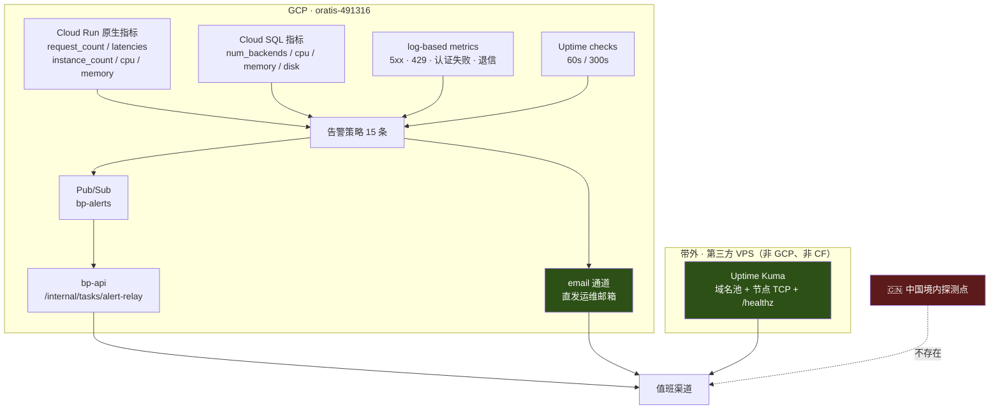

# 监控与告警 · 不能只看 `request_count`，被拒绝的请求根本不在里面

> 日期：2026-08-16 · 性质：**执行手册** · 状态：**待实施**（2026-08-16 —— 本文全部策略**一条都没有在 `oratis-491316` 上创建过**，全部阈值均为设定值而非实测值）
> 事实基线：巡检项来自 [runbook-node-health.md](runbook-node-health.md) §5；
> 部署参数（`--max-instances=8` 等）来自 [deploy.md](deploy.md) §5；
> 连接数阈值来自 [ADR 0005](../05-adr/0005-database-selection.md) §6.3；
> 证书黑名单来自 [ADR 0004](../05-adr/0004-transport-hardening.md) §3.4；
> 告警通道故障域来自 Google 官方通知渠道文档（经 runbook §5 转述）
> 证据口径：GCP 官方文档 = 中（本文未逐页逐字复核，关键处标 **待核实**）；本项目实测 = **无**；
> 阈值来源分两类 —— **设定值**（拍板的报警线）与 **先采基线**（明确承认现在不知道）
> 读者：值班运维。**收到告警时跳到 §12；建监控时从 §3 开始（因为日志指标不追溯，必须最先建）。**
> 关联：[runbook-node-health.md](runbook-node-health.md)（收到告警之后的排障动作全在那里，本文不重复）

---

## 1 · 结论

1. 🔴 **`request_count` 不能单独用作异常告警的依据。** 它**不包含未到达容器的请求** ——
   包括未授权的、以及因触到 `--max-instances=8` 被拒绝的。
   **服务被打满时这条曲线会看起来平稳甚至下降，而用户正在被拒绝。**
   必须与 `container/instance_count`（是否触顶）+ 基于日志的拒绝/5xx 计数 + 外部探针三者交叉。
2. **全部 log-based metrics 必须在 `bp-api` 第一次部署之前建好** ——
   自定义日志指标**不追溯**，只统计创建之后的日志。事后补建拿不到事故当天的数据。
3. **日志指标严禁打 per-user / per-IP 标签。** 它属于计费的自定义指标，基数爆炸既是性能问题也是账单问题。
   允许的标签只有**有界枚举**（`route_group`、`reason`）与**有硬上限的实体**（`node_id`，节点数 ≤ 10）。
4. **告警通道走 Pub/Sub，并且必须再配一条 email 冗余。** Google 官方说明
   webhook / Slack / PagerDuty / 移动应用**共用同一内部服务，是同一个故障域**（runbook §5 已记）。
   Pub/Sub 中继跑在 `bp-api` 上 —— `bp-api` 挂了它也发不出去，**所以 email 不是可选项**。
5. **GCP 的监控看不到中国。** Uptime check 与 Uptime Kuma 的探测点都在境外，
   它们能回答「世界能不能访问」，回答不了「中国能不能访问」。
   「域名被封」的自动检测**至今没有机制**（ADR 0002 §7、system-design §9、ADR 0003 §7、
   user-journey 四处各记一次），本文也没有解决它。



> 图里三条到值班的箭头是**故意画成三条**的：
> `bp-api` 挂了走 email，GCP 整体挂了走 Uptime Kuma，Uptime Kuma 挂了走 GCP。
> 而虚线那条 —— 中国境内探测点 —— **不存在**，这是当前监控体系最大的一个洞。

---

## 2 · Cloud Run 原生指标：能看什么，以及那个必须记住的盲区

### 2.1 🔴 `request_count` 的盲区

> **Cloud Run 的 `request_count` 只统计到达容器实例的请求。**
> 未授权而被前置拒绝的请求、以及**因达到 `--max-instances` 上限而被拒绝的请求，不计入**。
>
> 依据：Cloud Run 指标文档。**本文未逐字复核该页面，标 待核实** ——
> 但监控设计必须按它成立来做（按最坏情况设计），因为反过来（以为它包含而实际不包含）
> 会让我们在事故当天完全瞎掉。

对我们的直接后果，来自 [deploy.md](deploy.md) §5.1 的参数：

`--max-instances=8` 不是性能测算的结果，是 `db-f1-micro` 25 连接倒逼出来的
（ADR 0005 §6.2：`8 × 2 + 6 ≤ 25 − 3`）。也就是说**我们的服务天生就有一个很低的天花板**，
而撞天花板的表现是**拒绝**不是**变慢**。于是：

| 真实情况 | `request_count` | `request_latencies` | `instance_count` | 值班看到的 |
|---|---|---|---|---|
| 正常 | 平稳 | 平稳 | 2–3 | 正常 |
| DB 变慢 | 平稳 | **升高** | 升高 | 一眼看出 |
| **被打满、用户在被拒** | **平甚至下降** | **可能正常**（只测量了挤进来的那些） | **顶在 8** | 🔴 **看起来一切正常** |

**所以异常告警的第一信号是 `container/instance_count` 触顶，不是 `request_count` 下降。**

### 2.2 指标清单

| 指标 | 类型 | 回答什么问题 | 陷阱 |
|---|---|---|---|
| `run.googleapis.com/request_count` | DELTA，带 `response_code_class` 标签 | 流量与错误率构成 | 🔴 §2.1；且 `response_code_class` 只有 `2xx/3xx/4xx/5xx` 四档，看不出 429 与 400 的区别 |
| `run.googleapis.com/request_latencies` | DISTRIBUTION | P50/P95/P99 | 只统计到达容器的请求。被拒请求的延迟是 ∞，但它不入统计 —— 会让 P99 显得很漂亮 |
| `run.googleapis.com/container/instance_count` | GAUGE，带 `state=active/idle` | **是否触顶 8** | `active` 与 `idle` 必须分开看；只看总和会把「保温的空闲实例」误判成负载 |
| `run.googleapis.com/container/cpu/utilizations` | DISTRIBUTION | CPU 是不是瓶颈 | 分布型指标，告警必须用 percentile aligner（`ALIGN_PERCENTILE_99`），用 `ALIGN_MEAN` 会把尖峰抹平 |
| `run.googleapis.com/container/memory/utilizations` | DISTRIBUTION | 内存 | Go 的 GC 会让 RSS 长期居高不下，这个指标在 Go 服务上**天生偏高**，阈值要按基线定不要按直觉定 |
| `run.googleapis.com/container/startup_latencies` | DISTRIBUTION | 冷启动 | ADR 0006 §3 全部冷启动数据都标了 **需实测** —— **这里就是采基线的地方**，它同时是 `--min-instances=0` 这个决定的复审依据（deploy.md §5.2） |
| `cloudsql.googleapis.com/database/postgresql/num_backends` | GAUGE | 连接数 | 阈值有硬依据，见 §5 第 8 条 |
| `cloudsql.googleapis.com/database/memory/utilization` | GAUGE | 0.6 GiB 够不够 | ADR 0005 §6.3：周峰值 ≥85% 即升配触发器 |
| `cloudtasks.googleapis.com/queue/depth` | GAUGE | 入账是否积压 | 积压 = 面板流量数字失真，用户会拿客户端数字来质问（user-journey 已记） |

> 全部 Cloud Run / Cloud SQL 原生指标**免费**（§11）。免费意味着**没有理由不全都开着看**，
> 该省的是**告警策略数量**不是指标数量。

---

## 3 · 日志指标：不追溯，所以必须最先建

### 3.1 两条硬规矩

1. 🔴 **不追溯。** 用户自定义 log-based metric 只统计**创建之后**写入的日志。
   → **在 `bp-api` 第一次部署之前把全部指标建好。**
   事故发生后再建，拿不到事故当天的数据，也没有历史基线可比。
2. 🔴 **不许打高基数标签。** log-based metric 属于计费的自定义指标，
   每一个不同的标签取值组合都是一条独立 time series。

| 禁止作为标签 | 基数 | 后果 |
|---|---|---|
| `user_id` | 无上限（目标 200+） | 账单与查询同时爆 |
| `request_ip` | 无上限 | 同上，且它是个人数据（page-inventory 已裁定不落目的地址日志，这里同理） |
| `sub_token` / `trade_no` / `ingest_id` | 无上限 | 同上 |
| **允许** `route_group` | 5（`user`/`client`/`server`/`admin`/`tasks`，ADR 0006 §10） | 有界枚举 |
| **允许** `reason` | 十几 | 有界枚举，且必须在代码里是常量不是拼接的字符串 |
| **允许** `node_id` | ≤ 10（ADR 0006 §3.3 按 10 节点算账） | 有硬上限的实体。**这是唯一被允许的实体标签** |

> 值得注意的对称：`node_id` 能当标签而 `user_id` 不能，区别**只有一个** —— 节点数有硬上限。
> 一旦将来节点数不再有上限，这条允许要立刻撤回。

### 3.2 上线前必须建好的十条

```bash
P=oratis-491316
mkmetric() {  # mkmetric <name> <描述> <filter>
  gcloud logging metrics create "$1" --project=$P --description="$2" --log-filter="$3"
}
BASE='resource.type="cloud_run_revision" AND resource.labels.service_name="bp-api"'

mkmetric bp_api_5xx  "bp-api 5xx"  "$BASE AND httpRequest.status>=500"
mkmetric bp_api_429  "bp-api 429（被拒/限流）" "$BASE AND httpRequest.status=429"
```

| 指标 | 抓什么 | 为什么它必须存在 |
|---|---|---|
| `bp_api_5xx` | `httpRequest.status>=500` | 错误率的分子。原生 `request_count` 的 `5xx` 标签也能用，但日志指标能带 `route_group` |
| `bp_api_429` | `httpRequest.status=429` | 🔴 §2.1 的替代信号之一。**我们的规模下任何 429 都是异常** |
| `bp_uniproxy_auth_fail` | 节点 Bearer 校验失败 | 两种成因：密钥轮换没做完两步（page-inventory D5），或有人在试 |
| `bp_subscribe_404` | 订阅 token 无效（ADR 0006 §10.2 规定返 404 不泄露存在性） | **突增 = 有人在扫 token**。这是订阅 token 唯一的对外可观测攻击面 |
| `bp_admin_totp_fail` | 后台 TOTP 校验失败 | 后台是三道闸的最后一道 |
| `bp_task_idem_skip` | 幂等键命中（deploy.md §9.2） | Cloud Tasks at-least-once 的**可观测证据**。这个数长期为 0 反而可疑（说明幂等逻辑可能根本没被走到） |
| `bp_db_pool_wait` | pgxpool 获取连接超时 / `sorry, too many clients already` | ADR 0005 §6.3 的升配触发器之一 |
| `bp_mail_bounce` | ESP 退信回调 | AWS SES 退信率 ≥5% 进入审查、≥10% 可能暂停发信（page-inventory 已记）。邮件是**唯一**失联恢复通道（ADR 0002），停信 = 恢复面失效 |
| `bp_cert_issuer_bad` | §8 的每日证书核对写的日志 | ADR 0004 §3.4 |
| `bp_node_alive` | 节点 `/alive` 上报成功，**带 `node_id` 标签** | §5 第 1 条的 metric-absence 告警依赖它 |

> ⚠️ **`bp_node_alive` 必须由应用主动写一行结构化日志**，不能靠解析 access log ——
> access log 里 `POST /alive` 的 200 无法区分「哪个节点」，而我们需要**逐节点**的缺失告警。

---

## 4 · 告警通道：Pub/Sub 为主，email 为冗余，理由是故障域

Google 官方说明：**webhook / Slack / PagerDuty / 移动应用共用同一内部服务，是同一个故障域**
（runbook §5 已记）。建议用 **email 或 Pub/Sub** 做冗余。

因此本项目的通道拓扑是：

```
告警策略 ──┬─→ Pub/Sub topic bp-alerts ─→ push 订阅 ─→ bp-api /internal/tasks/alert-relay ─→ 值班渠道
           └─→ email 通道（直发运维邮箱，不经我们的任何基础设施）
```

**两条都挂在每一条策略上，不做分级。** 理由：

- Pub/Sub 是主通道，因为它能**积压重投** —— 中继暂时不可用时消息不丢，恢复后补发。
  这是选它而不是 webhook 的第二个好处（第一个是故障域）。
- 🔴 **中继跑在 `bp-api` 上，这是自我引用。** `bp-api` 挂了 → 中继挂了 → 而这恰恰是最需要告警的时刻。
  **email 通道就是为这一刻存在的**，它绕开 Pub/Sub、绕开 `bp-api`、绕开我们的域名池。
  这不是冗余，这是唯一在最坏情况下还工作的那条。
- Telegram 只在**运维自己**的通道里用（Uptime Kuma 原生支持，§7）。
  **绝不用于任何面向用户的广播** —— ADR 0002：OONI 实测 `api.telegram.org` 异常率 99.1%。

```bash
P=oratis-491316
gcloud pubsub topics create bp-alerts --project=$P

# 允许 Monitoring 的服务代理向该 topic 发布（SA 域名字符串 待核实）
gcloud pubsub topics add-iam-policy-binding bp-alerts --project=$P \
  --member="serviceAccount:service-2360090741@gcp-sa-monitoring-notification.iam.gserviceaccount.com" \
  --role=roles/pubsub.publisher

gcloud alpha monitoring channels create --project=$P \
  --display-name="bp-alerts-pubsub" --type=pubsub \
  --channel-labels=topic=projects/$P/topics/bp-alerts

gcloud alpha monitoring channels create --project=$P \
  --display-name="bp-alerts-email" --type=email \
  --channel-labels=email_address=<运维邮箱>

gcloud alpha monitoring channels list --project=$P --format="table(name,type,displayName)"
```

> ⚠️ **email 通道的收件邮箱不能是 `@babel.plus`。** 我们自己的发信域名一旦出问题
> （ADR 0002 §5 说明邮件送达本身就是薄弱环节），告警会跟着一起消失。
> 用一个与本项目完全无关的第三方邮箱。

---

## 5 · 告警策略清单（runbook §5 巡检表的可执行展开）

runbook §5 给了六行巡检项与阈值。本节把它们展开成具体策略，并补上 runbook 没有覆盖的控制面部分。

**阈值来源一律标注**：`设定` = 拍板的报警线（无实测依据）；`有据` = 来自某份 ADR 的硬约束；`基线` = 上线后先采基线再定。

| # | 告警 | 指标 / 来源 | 条件 | 重测窗口 | 阈值来源 | 严重度 | 对应 runbook |
|---|---|---|---|---|---|---|---|
| 1 | **节点心跳缺失** | `logging.googleapis.com/user/bp_node_alive`，按 `node_id` 分组 | **metric absence** | **5 分钟** | 有据（runbook §5：超 5 分钟无上报） | P1 | §2 → §3 |
| 2 | **API 实例数触顶** | `container/instance_count` `state=active` | `> 7` | 5 分钟 | 有据（`--max-instances=8`，ADR 0005 §6.2） | P1 | — |
| 3 | **API 5xx 率** | `bp_api_5xx` / `request_count` | 比值 `> 1%` | 5 分钟 | 设定 → 上线后按基线改 | P1 | §2 |
| 4 | **API 429** | `bp_api_429` | `> 0` | 5 分钟 | 有据（我们的规模下任何拒绝都异常） | P1 | — |
| 5 | **API 延迟** | `request_latencies` `ALIGN_PERCENTILE_95` | `> 1500 ms` | 10 分钟 | 设定（同区 DB RTT <1 ms + Go 毫秒级处理 ⇒ 1.5 s 只可能是排队或 DB 慢） | P2 | — |
| 6 | **冷启动延迟** | `startup_latencies` P95 | `> 3000 ms` | 30 分钟 | 基线（ADR 0006 §3 全部标需实测） | P3 | — |
| 7 | **`/healthz` 不可达** | uptime check（§6） | 连续 2 个周期失败 | 2 分钟 | 设定 | P1 | §4 |
| 8 | **DB 连接数** | `num_backends` | `≥ 18` | 10 分钟 | **有据**（ADR 0005 §6.3：22 可用的 80%） | P2 **兼升配触发器** | — |
| 9 | **DB 内存** | `database/memory/utilization` | `≥ 85%` | 30 分钟 | **有据**（ADR 0005 §6.3） | P2 兼升配触发器 | — |
| 10 | **DB 磁盘** | `database/disk/utilization` | `≥ 80%` | 30 分钟 | 设定 | P2 | — |
| 11 | **入账队列积压** | `cloudtasks/queue/depth` | `> 100` | 10 分钟 | 设定（8 节点 × 1 次/分 ⇒ 正常应 <10） | P2 | — |
| 12 | **Scheduler 任务失败** | 日志 `resource.type="cloud_scheduler_job"` 且状态非 2xx | `> 0` | 单次即告警 | 设定（每天仅数百次执行，噪音低） | P2 | — |
| 13 | **订阅 404 突增** | `bp_subscribe_404` | `> 50 / 5 min` | 5 分钟 | 基线 | P2 | — |
| 14 | **节点认证失败突增** | `bp_uniproxy_auth_fail` | `> 10 / 5 min` | 5 分钟 | 基线 | P1 | §2 |
| 15 | **证书签发者变更** | `bp_cert_issuer_bad` | `> 0` | 单次即告警 | **有据**（ADR 0004 §3.4） | **P0** | §4 |
| 16 | **出口流量超预算** | 见 §9 | 见 §9 | 每日 | 有据（runbook §5：超预算 80%） | P2 | — |
| 17 | **邮件退信率** | 见 §10 | `≥ 5%` | 每日 | 有据（SES 审查线） | P1 | — |

### 5.1 第 1 条（节点心跳）的两个坑

```json
{
  "displayName": "bp-node 心跳缺失 >5min",
  "combiner": "OR",
  "conditions": [{
    "displayName": "no /alive from node",
    "conditionAbsent": {
      "filter": "resource.type=\"cloud_run_revision\" AND metric.type=\"logging.googleapis.com/user/bp_node_alive\"",
      "aggregations": [{
        "alignmentPeriod": "60s",
        "perSeriesAligner": "ALIGN_COUNT",
        "crossSeriesReducer": "REDUCE_SUM",
        "groupByFields": ["metric.label.node_id"]
      }],
      "duration": "300s",
      "trigger": {"count": 1}
    }
  }],
  "notificationChannels": [
    "projects/oratis-491316/notificationChannels/<PUBSUB_ID>",
    "projects/oratis-491316/notificationChannels/<EMAIL_ID>"
  ],
  "alertStrategy": {"autoClose": "3600s"}
}
```

```bash
gcloud alpha monitoring policies create --project=$P --policy-from-file=alerts/node-heartbeat.json
```

> 🔴 **坑一：metric absence 需要该 time series 曾经有过数据。**
> 一个**从未上报过**的新节点不会触发这条告警 —— 它在监控眼里根本不存在。
> 所以 [ADR 0007](../05-adr/0007-node-migration.md) 的建节点流程必须多一步：
> **节点首次上报成功后，人工确认该 `node_id` 的 time series 已出现，告警才算 armed。**
>
> 🔴 **坑二：`groupByFields` 决定了告警的粒度。**
> 不按 `node_id` 分组的话，「8 个节点里挂了 1 个」不会触发缺失（总数仍 >0）。
> 这正是 §3.2 允许 `node_id` 当标签的原因。

### 5.2 第 2 条（实例数触顶）的策略

```json
{
  "displayName": "bp-api 实例数触顶 max-instances=8",
  "combiner": "OR",
  "conditions": [{
    "displayName": "active instances >= 8 for 5m",
    "conditionThreshold": {
      "filter": "resource.type=\"cloud_run_revision\" AND resource.labels.service_name=\"bp-api\" AND metric.type=\"run.googleapis.com/container/instance_count\" AND metric.labels.state=\"active\"",
      "aggregations": [{
        "alignmentPeriod": "60s",
        "perSeriesAligner": "ALIGN_MAX",
        "crossSeriesReducer": "REDUCE_SUM"
      }],
      "comparison": "COMPARISON_GT",
      "thresholdValue": 7,
      "duration": "300s"
    }
  }],
  "notificationChannels": ["…pubsub…", "…email…"],
  "documentation": {
    "content": "request_count 此时可能是平的，不要以为没事。见 monitoring.md §2.1。处置：ADR 0005 §6.3 升配 db-g1-small。",
    "mimeType": "text/markdown"
  }
}
```

> `documentation.content` 会随告警一起送到值班手里。**把「这条告警意味着什么、去看哪一节」写进去** ——
> 这是最便宜的一次 runbook 投递，凌晨三点没人会去翻文档目录。

其余 15 条按同一形状写，只换 `filter` / `comparison` / `thresholdValue` / `duration`。
全部策略 JSON 放 `alerts/` 目录并入库，理由与 ADR 0006 §13「生成物入库」一致：
**code review 时能看见告警配置的变化本身。**

---

## 6 · 正常运行时间检查（Uptime check）

### 6.1 规格与预算

- **周期只支持 60 / 300 / 600 / 900 秒**，没有别的档。
- **1,000,000 次 / 项目 / 月免费。**
- 60 秒周期 ≈ **43,800 次/月**（按 30.4 天算），单看很宽裕。

⚠️ 但**每次执行会从多个探测区域各发一次请求**，实际计数要乘以所选区域数（**待核实**具体计费口径）：

| 配置 | 每检查/月 | 6 个区域 | 说明 |
|---|---|---|---|
| 60 秒 × 1 个检查 | 43,800 | 262,800 | 26% 额度 |
| 60 秒 × 3 个检查 | 131,400 | **788,400** | **79% 额度，逼近上限** |
| 300 秒 × 6 个检查 | 52,560 | 315,360 | 32% 额度 |

**裁决：只有 `/healthz`（API 主域名）用 60 秒；三套域名池里的其余镜像域名一律 300 秒。**
镜像域名的作用是「主域名被封时的备胎」，它晚 5 分钟被发现不影响任何东西。

### 6.2 创建

```bash
gcloud monitoring uptime create bp-api-healthz \
  --project=$P \
  --resource-type=uptime-url \
  --resource-labels=host=api.babel.plus,project_id=$P \
  --protocol=https --port=443 --path=/healthz \
  --period=1 --timeout=10 \
  --matcher-type=contains-string --matcher-content='"ok":true'
```

> `gcloud monitoring uptime create` 的 flag 名在版本间调整过（`--period` 取分钟数 1/5/10/15），
> **待核实**；报错时改用控制台或 `--uptime-check-config-from-file`。

**必须校验响应体内容**（`--matcher-content`），不能只看 200 ——
被劫持的 DNS、被中间设备接管的连接、平台的默认 404 页面都可能返回 200。

### 6.3 权限：`run.routes.invoke`

我们的 `bp-api` 是 `--allow-unauthenticated`（[deploy.md](deploy.md) §5.1，
因为鉴权在应用层），所以 uptime check 直接打就行。

⚠️ **但一旦某个 Cloud Run 服务改成需要 IAM 鉴权，uptime check 就需要
`run.routes.invoke` 权限**才能通过（否则会稳定拿到 403，表现为「服务一直是挂的」）。
这会在两处命中我们：

1. 若将来 `bp-api` 改成 `--no-allow-unauthenticated`；
2. **`bp-admin` 若独立部署并挂 IAP**（page-inventory 要求后台独立域名 + IAP + TOTP）——
   IAP 后面的服务，uptime check 基本上探不了，只能探到 IAP 的登录页。

> 后台的可达性要求本来就是「不要求」（page-inventory：可达性预算全花在用户面板与文档站上），
> 所以第 2 条可以接受**不做**后台的 uptime check。但要知道这是主动放弃，不是遗漏。

---

## 7 · 带外探针：Uptime Kuma

**它的价值恰恰是独立于 GCP 失败。** GCP Monitoring 本身出问题、项目计费出问题、
或者整个项目因为任何理由不可用时，它仍在报告。

| 项 | 决定 | 理由 |
|---|---|---|
| 软件 | Uptime Kuma（MIT，单容器） | 原生支持 HTTP / TCP / DNS 检查与 Telegram / 邮件通知，零依赖 |
| **部署在哪** | **第三方 VPS，不是 `oratis-491316`，也不是 Cloudflare** | 部署在 GCP 里就不叫带外了 —— 它会和被监控对象一起挂 |
| 成本 | $5/月量级的最小 VPS | §11 |
| 通知 | Telegram（对运维本人有效）+ 邮件 | 运维自己有代理；**不用于用户广播**（ADR 0002） |

```bash
docker run -d --restart=always -p 3001:3001 \
  -v uptime-kuma:/app/data --name uptime-kuma \
  louislam/uptime-kuma:1
```

> 镜像 tag 固定到大版本（`:1`）不要用 `latest`。是否已有 2.x **待核实**。

监控项：

| 检查 | 类型 | 周期 | 判据 |
|---|---|---|---|
| 三套域名池的**每一个**域名 | HTTP(s) | 60 s | 200 + 关键字 |
| `bp-api` `/healthz` | HTTP(s) | 60 s | 200 + `"ok":true` |
| 每个 `bp-node-*` 的 TCP 443 | TCP Port | 300 s | 能完成握手 |
| 每个 `bp-node-*` 的证书剩余天数 | HTTP(s) 自带 | — | <14 天告警 |

> ⚠️ **节点的 UDP 443（Hysteria2）Uptime Kuma 探不了** —— 它没有 QUIC 探针。
> 而 runbook §2 的分诊流程恰恰高度依赖「HY2 失败但 REALITY 正常 = QUIC 被识别封锁」这个对照。
> 这一项目前只能靠人工，记入 §14。
>
> 🔴 **Uptime Kuma 自己是单点，而且没有第二个 Uptime Kuma 在监控它。**
> 缓解只能是「它的通知里带心跳」—— 但那需要另一个接收方来发现心跳停了。诚实记录，不假装解决了。

---

## 8 · 证书签发者的持续核对

ADR 0004 §6 把「证书链监控未设计」列为未解决项。本节是它的答案。

**机制**：Cloud Scheduler `bp-cert-issuer-check`（每日）→ `/internal/tasks/cert-check`
→ 对域名池全部域名做 TLS 握手 → 取 issuer 的 `O` 与 `CN` 与到期时间 → 写结构化日志
→ log-based metric `bp_cert_issuer_bad` → 告警第 15 条（**P0**）。

| 判定 | 规则 |
|---|---|
| ✅ 通过 | `O = Let's Encrypt` |
| 🔴 立即告警 | `O = Google Trust Services`，或 `CN` ∈ {`WE1`,`WR2`,`WR3`,`GTS CA 1C3`,`GTS CA 1D4`,`GTS CA 1P5`} |
| ⚠️ 告警 | 剩余有效期 < 14 天 |

**只校验 `O`，不要校验 `CN`** —— Let's Encrypt 会轮换中间证书（`R10`/`R11`/`E5`/`E6`…），
钉 CN 会造成周期性误报，而误报会让人关掉这条告警，最后等于没有它。

值班可直接手跑的版本（与 [deploy.md](deploy.md) §11.2 同一条命令，两处都要有）：

```bash
for d in web.babel.plus api.babel.plus docs.babel.plus; do
  printf '%-24s' "$d"
  echo | openssl s_client -servername "$d" -connect "$d:443" 2>/dev/null \
    | openssl x509 -noout -issuer -enddate
done
```

> ⚠️ **这个检查是从我们这一侧发起的，它看到的是我们发出去的证书。**
> ADR 0004 §3.4 记录的失效是**中国到我们的路径上的单向丢包**（`net4people/bbs` #381：
> 「blocked some time after the server's Certificate message … packet dropping, not RST injection」）。
> 所以本检查能发现「CA 变了」，**发现不了「中国用户连不上」**。
> 两件事都要有，而后者我们目前没有（§1 第 5 条）。

---

## 9 · 出口流量与预算

**数据面出口在 GCE 节点上，不在 Cloud Run。** 指标是
`compute.googleapis.com/instance/network/sent_bytes_count`，按实例名前缀 `bp-node-` 过滤
（**不能**按整项目聚合 —— `vpn-us` / `vpn-jp` 的流量不属于 babel.plus）。

成本口径（ADR 0004 §3.7 裁定 Premium 层级）：

| 项 | 值 | 出处 |
|---|---|---|
| 出口单价 | **$0.23 / GiB**（Premium，无免费额度） | pricing §2.2 |
| 100 GB/人/月的出口成本 | ≈ **¥165** | pricing §2.2 |
| 单用户月成本参照 | 约 **$23/人/月**（100 GB 计） | ADR 0001 §6 |

告警形态（runbook §5：「出口流量用量 / 每日 / 超出预算 80%」）：

- **日均阈值**：设月度出口预算 `B` GiB，当**日**出口 > `B/30 × 1.2` 且连续 2 天 → 告警。
  用日阈值而不是月累计，是因为 Cloud Monitoring 做「自然月累计」很别扭，
  而**我们真正想抓的是趋势变化不是绝对值**。
- **钱的兜底**：Cloud Billing budget，阈值 50% / 80% / 100%，通知发到 `bp-alerts` topic。

```bash
gcloud billing budgets create --billing-account=<BILLING_ACCOUNT_ID> \
  --display-name="bp-monthly" --budget-amount=200USD \
  --threshold-rule=percent=0.5 --threshold-rule=percent=0.8 --threshold-rule=percent=1.0 \
  --filter-projects=projects/2360090741 \
  --filter-labels=app=babel-plus \
  --notifications-rule-pubsub-topic=projects/$P/topics/bp-alerts
```

三条必须知道的：

1. ⚠️ **Budget 是项目级的，而项目里还跑着 `anthropic-relay` / `lisa-cloud` / `lisa-web` 与
   `vpn-us` / `vpn-jp`**（as-built §2、§4）。不加 `--filter-labels` 的话，预算数字里混着别人的钱。
   → **所有 `bp-` 资源创建时必须打 label `app=babel-plus`。**
   这条要求源自 as-built §8 接受的「共享项目」取舍，是它的直接账单后果。
   `--filter-labels` 的确切行为与生效范围 **待核实**。
2. ⚠️ **Budget 只发通知，不会自动停机。** 没有任何自动熔断。
3. 🔴 **这一条现在建不了。** as-built §9 记录「计费账号与当前月度实际支出未查
   （`gcloud billing` 需要额外权限）」—— 我们连 `<BILLING_ACCOUNT_ID>` 都还不知道。
   这是本文里唯一一条被前置条件卡死的告警。

---

## 10 · 邮件送达率

邮件是**唯一**的失联恢复通道（ADR 0002）。它的健康度是恢复面的健康度。

### 10.1 送达率无法直接测量，只有两个代理指标

我们看不到用户的收件箱。能测的只有：

| 代理指标 | 怎么来 | 覆盖什么 |
|---|---|---|
| **退信 / 投诉率** | ESP 的 bounce / complaint 回调 → `bp_mail_bounce` | 硬失败（地址不存在、被拒收） |
| **验证码 N 分钟内被使用的比例** | 注册流程的 `email_probe` 表（user-journey：收件域名 / ESP / bounce 码 / 回填时刻） | **软失败**（进了垃圾箱、被延迟、被静默丢弃） |

按**收件域名**分组统计（QQ / 163 / 126 / Gmail / 其他），这正是 user-journey 把注册验证码
重新定位为「失联生命线的免费持续压测」的度量化形态。

### 10.2 阈值，以及对 runbook §5 的一处修正

| 指标 | 阈值 | 依据 |
|---|---|---|
| 退信率 | **≥ 5%** 立即告警 | AWS SES ≥5% 进入审查、≥10% 可能暂停发信（page-inventory 已记）。**发信被暂停 = 恢复面失效** |
| 投诉率 | ≥ 0.1% | 行业通行线，**待核实** |
| 验证码使用率 | **先采基线**，不要直接用 95% | 见下 |

> ⚠️ **runbook §5 写的「邮件送达率 / 每周 / 低于 95%」这个阈值，用在验证码使用率上是错的。**
> 验证码使用率**天然低于**送达率 —— 用户可能收到了但放弃了注册。
> 95% 是一个**结构上就达不到**的目标，一个永远红着的告警等于没有告警。
>
> 正确做法：先跑满第一批 20 个用户采基线，**按收件域名分别定线**，
> 并且用**相对下降**（较过去 14 天中位数下降 >20%）而不是绝对值做告警条件 ——
> 我们真正想抓的是「QQ 邮箱突然开始拦我们了」，不是「基线本来就是 78%」。

---

## 11 · 成本

| 项 | 现在（2026-08） | 2027-09-01 起 | 备注 |
|---|---|---|---|
| Cloud Run / Cloud SQL **原生指标** | **$0** | $0 | 系统指标免费 |
| **告警策略** | **$0** | **$0.35 / 月 / 指标引用** | 按 §5 的 17 条、每条 1 个指标引用估 ≈ **$5.95/月** |
| log-based metrics（自定义指标） | 按写入量计费 | 同 | 金额取决于基数 —— §3.1 的标签禁令**首先是一条省钱条款** |
| Uptime checks | 1M 次/月免费 | 同 | §6.1 的预算表 |
| Pub/Sub 告警通道 | 量极小，实质 $0 | 同 | — |
| Uptime Kuma VPS | **约 $5/月** | 同 | 第三方，不在 GCP 账单里 |
| **合计增量** | **约 $5/月** | **约 $11/月** | 对照 Cloud SQL 的 $9.53/月（ADR 0005） |

三条推论：

1. **$0.35/月/指标引用给「策略数量」定了一个价。** 每加一条策略每月 $0.35 ——
   17 条策略的月费接近整个数据库月费的 62%。这不是天文数字，但它意味着
   **「先把所有能想到的都告警上」在 2027-09 之后会变成一个有价格的坏习惯**。
   应当在 2027-09-01 之前做一次策略瘦身，把从未触发过、或触发了也没人处置的策略删掉。
2. **原生指标免费 ⇒ 仪表盘可以尽情做，要克制的是告警不是图表。**
3. **告警计费日期 2027-09-01 与费率 $0.35 标 待核实**（来自定价变更公告，本文未逐字复核）。
   但预算里先留着 —— 留了没用到只是少花钱，没留而突然计费会是个意外账单。

---

## 12 · 值班：告警到手先看哪三块

**收到任何 P1/P0 告警，先按顺序看这三块，再进 [runbook-node-health.md](runbook-node-health.md) 分诊。**
本节不重复 runbook 的排障步骤，只做「从监控到 runbook」的路由。

| 顺序 | 看什么 | 它回答的问题 |
|---|---|---|
| 1 | **Uptime Kuma**（带外，§7） | 它绿而 GCP 告警红 → 先怀疑监控自身；它也红 → 是真的挂了 |
| 2 | **`instance_count` + `bp_api_5xx` / `bp_api_429`**（**不是** `request_count`，§2.1） | 是被打满、是出错、还是没流量 |
| 3 | **`num_backends`**（DB 连接数） | 是不是撞了 25 连接天花板（ADR 0005 §6.2） |

告警 → runbook 的路由表：

| 告警 | 去哪一节 |
|---|---|
| #1 节点心跳缺失、#14 节点认证失败突增 | runbook §2（本地 vs 全局判定）→ §3（IP 封锁的三条独立证据） |
| #7 `/healthz` 不可达、#15 证书签发者变更 | runbook §4（域名失联流程） |
| #2/#3/#4/#5/#8/#9/#10/#11 | **runbook 没有覆盖控制面** —— 处置写在告警的 `documentation.content` 里（§5.2） |
| 用户报「连不上」但监控全绿 | runbook §1 分诊流程；**先读 runbook §0**（TUN/fake-ip 下系统网络工具的结果全部不可信） |

> **控制面故障不得升级为数据面故障**（system-design §5.3）。
> 收到 #2–#11 任意一条时，第一句话不是「用户断网了吗」，而是
> **「节点是否还在用最后一次成功的配置正常服务」** —— 如果是，那这是一次
> 「用户买不了、改不了」的故障，不是「用户上不了网」的故障。两者的处置紧迫度差一个量级。

---

## 13 · 代价

> ⚠️ 这一选择的代价，必须留在记录里而不是被措辞掩盖：
>
> 1. **17 条告警里只有 8 条的阈值有硬依据**（#1/#2/#4/#8/#9/#15/#16/#17 来自 runbook 或 ADR），
>    其余 9 条全是「设定值」或「先采基线」。也就是说**本文超过一半的阈值是猜的**。
>    第一批 20 个用户跑完必须整体重写 —— 这与 user-journey 的度量口径纪律是同一条要求。
>    在那之前，误报率会很高，而**误报会让人关掉告警**，这是监控体系最常见的死法。
> 2. **log-based metrics 不追溯，逼我们在零数据的情况下先猜一批指标。**
>    §3.2 的十条是按现在能想到的失效模式列的；**猜漏的那一条，在事故当天补建也来不及** ——
>    补建之后要等下一次事故才有数据。这是不可弥补的信息损失，只能靠「宁可多建几条」对冲，
>    而多建几条在 2027-09 之后是要花钱的（§11）。
> 3. **没有任何中国大陆境内的探测点。** Uptime check 与 Uptime Kuma 都在境外，
>    它们回答「世界能不能访问」，回答不了「中国能不能访问」。
>    直接后果：**product-brief §8 承诺的「域名失联恢复 ≤ 30 分钟」依然零机制支撑** ——
>    实际恢复时间仍是「有人恰好发现并报障」的时间。本文没有改变这一点，只是把它写得更清楚了。
> 4. **Pub/Sub 中继跑在 `bp-api` 上是自我引用。** `bp-api` 挂了告警发不出去。
>    email 冗余是唯一对冲，而 email 本身的送达率我们**没有实测过**（ADR 0002 §7）——
>    也就是说，我们的最后一条告警路径，其可靠性是未知的。
> 5. **Uptime Kuma 是单点，没有人监控它。** 它静默死掉时，我们会以为一切正常。
>    再套一层监控只是把问题推远一层，本文选择接受。
> 6. **UDP / QUIC 路径探不了。** runbook §2 的分诊高度依赖「HY2 失败但 REALITY 正常」这个对照，
>    而我们的探针只有 TCP 与 HTTP。Hysteria2 的可用性目前**完全靠用户报障**发现 ——
>    而它恰恰是 ADR 0004 §3.2 判定「方差极大」的那条通路。

## 14 · 这次没有解决的

- [ ] 🔴 **中国大陆境内探针未落实。** 不在本次范围是因为它需要采购决策（租境内 VPS，
      ADR 0003 §7 已列为未解决；或用商业监测服务如 boce / 17ce，**未评估**），
      且境内 VPS 探测境外中转服务本身有法律敞口（ADR 0004 §6 记录了相关观察）。
      **这是本文最大的缺口，优先级高于新增任何一条 GCP 告警。**
- [ ] **QUIC / Hysteria2 的自动探活未设计。** 需要一个会说 QUIC 的探针；
      runbook §0 已裁定不能用系统网络工具，必须走内核 API 或独立探针机 —— 那套东西**当前不存在**。
- [ ] **SLO 与 error budget 未定义。** product-brief §8 有「主路径可用率 ≥99%（月）」，
      但没有定义什么算「可用」、按哪个指标算、谁来算。没有 SLO 就没有「该不该发版」的客观依据。
- [ ] **on-call 轮值、升级路径、告警静默流程未定义**（runbook §7 已列，至今仍是未解决）。
      本文定义了告警发到哪，没有定义**发给谁、多久没人应答怎么办**。
- [ ] **日志保留期与成本未核算。** `_Default` bucket 的免费额度与超出后的单价未查，
      而 §3.2 要求应用主动写结构化日志（`bp_node_alive` 等），会增加日志量。
- [ ] **Cloud Trace 已启用但未接入**（as-built §6）。跨 `bp-api` → Cloud SQL → Cloud Tasks
      的请求追踪没做，排「哪一步慢」时只能靠日志时间戳。
- [ ] **节点侧的进程级指标未接入。** xray / hysteria / v2node 各自的 metrics 端点
      （若有）与 systemd 状态目前完全不在 GCP 监控里，节点健康只有「心跳有没有」这一个二值信号。
- [ ] **告警去重、自动关闭（`autoClose`）、维护窗口静默均未验证。**
      §5.1 里写的 `autoClose: 3600s` 是抄来的默认值，没有依据。
- [ ] **邮件送达率基线未采**（ADR 0002 §7 的 P1 第一优先级验证项），
      §10.2 的阈值在基线出来之前无法定稿。
- [ ] **恢复演练未做。** ADR 0005 §10.4 要求的数据库恢复演练、以及本文全部告警的
      「触发 → 送达 → 值班响应」端到端演练，一次都没做过。
      **一条从未被真正触发过的告警链路，应当默认视为不工作。**
