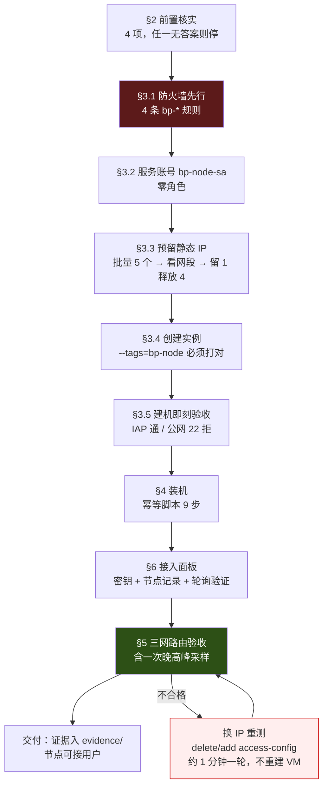

# 节点建机与装机 · 建机也要脚本化，唯一不可跳过的闸是三网路由验收

> 日期：2026-08-16 · 性质：**执行手册** · 状态：**设计稿 v1，待实施**（2026-08-16，未在任何真机上跑通）
> 事实基线：GCP 资产快照见 [as-built-gcp.md](../02-architecture/as-built-gcp.md)（2026-08-16 `gcloud` 实测）；
> sysctl 与 systemd 硬化写法逐字照抄 [reference-repos.md](../01-research/reference-repos.md) §1.6–1.8（Proxy_Skill 一手实测）；
> 协议参数与版本地雷来自 [protocol-and-infra.md](../01-research/protocol-and-infra.md) §5.3–5.4
> 证据口径：GCP / 上游项目官方文档 = 高；Proxy_Skill 一手实测 = 高；社区单一来源 = **待核实**；
> 本文自拟的判定阈值一律标「**设定值**」，它们不来自任何测量
> 读者：值班运维。**新建一台 bp 节点时从 §2 开始逐条照做；§8 是可勾选的清单，勾完才算交付。**
> 关联：[ADR 0007](../05-adr/0007-node-migration.md)（本手册是它阶段 1–3 的执行细则）、
> [ADR 0004](../05-adr/0004-transport-hardening.md) §3.4–3.7、
> [as-built-gcp.md](../02-architecture/as-built-gcp.md) §3（防火墙三风险）、
> [system-design.md](../02-architecture/system-design.md) §3、
> [runbook-node-health.md](runbook-node-health.md)（建成之后的事归它管）
> ⚠️ **本手册尚未在真机验证。** 第一次执行时必须逐条记录偏差并回写本文，
> 凡标 **待核实** / **需实测** 的地方，第一次执行就是那次实测。

---

## 1 · 结论：一次建机分七段，六段可回滚，一段不可

**建机不是「开一台机器然后装软件」，是七个各有验收标准的阶段。**
把它们排成这个顺序的原因只有一条：**把不可逆的、以及贵的，尽量往前挪。**



三条贯穿全程的硬规矩：

| # | 规矩 | 违反的后果 |
|---|---|---|
| 1 | **防火墙规则必须在实例创建之前就位** | `default-allow-ssh` 对 `0.0.0.0/0` 放通 tcp:22 且**无 target tag**（[as-built §3](../02-architecture/as-built-gcp.md)）。实例从 RUNNING 到规则生效之间，22 端口对全网开放 |
| 2 | **每个阶段前后各跑一次 [as-built §7](../02-architecture/as-built-gcp.md) 的清点命令做 diff** | 这是「不影响已部署服务」这条约束的**唯一可验证形式**（[ADR 0007 §9.2](../05-adr/0007-node-migration.md)） |
| 3 | **凭据只走环境变量与 stdin，不落盘、不进命令行、不进 shell history** | 见 §2.2 的传递方式 |

**唯一不可跳过的是 §5 的三网路由验收。** 其余六段做错了都能重来：机型可改
（`stop` → `set-machine-type` → `start`，静态 IP 保留，停机数十秒）、装机脚本幂等可重跑、
面板记录可改。而**把一个绕道美国的 IP 推给用户，代价是用户第一次连接就判定这个服务不行** ——
[user-journey](../03-product/user-journey.md) 已论证 L5「技术成功但体验失败」是最危险的失败点。

> **一个必须纠正的措辞**：[ADR 0007 §9.1](../05-adr/0007-node-migration.md) 阶段 2 写的
> 「释放 IP → 重新预留 → **重开**」，其中「重开」指的是**重新预留地址**，不是重建 VM。
> 外部 IP 在 GCE 上是到内网 IP 的 1:1 NAT，服务监听 `0.0.0.0`，**换 IP 不需要重建实例、不需要重装、甚至不需要重启进程**。
> 一轮换 IP 重测约 1 分钟，见 §5.4。

---

## 2 · 前置条件

### 2.1 四项必须先有答案的核实项

**任何一项没有答案就停下，不要凭假设推进。** 前两项来自 [ADR 0007 §3](../05-adr/0007-node-migration.md)，
后两项是本手册新增的，它们直接决定 §4 的装机脚本长什么样。

| # | 核实项 | 怎么查 | 没答案的后果 |
|---|---|---|---|
| 1 | 现有防火墙规则的实际 priority | §3.1 的第一条命令 | 我们的 900/1000 可能与既有规则产生意外次序 |
| 2 | `asia-east2` 的 `default` 子网当前有没有实例 | `gcloud compute instances list --filter="zone~asia-east2"` | 决定 §3.6 的 IPv6 开启是否零爆炸半径 |
| 3 | 🔴 **v2node 到底承载哪些协议** | §2.3 | 决定 Hysteria2 是 v2node 管还是要单独装一套（工作量差一个数量级） |
| 4 | 🔴 **v2node 用什么方式带节点密钥**（query string 还是 `Authorization: Bearer`） | §2.3 | 与 [ADR 0006 §10.2](../05-adr/0006-api-stack.md) 的 Bearer 裁决直接冲突，见 §6.1 |

### 2.2 凭据传递方式（改进了 Proxy_Skill 的做法）

[reference-repos §1.6](../01-research/reference-repos.md) 记录的 Proxy_Skill 调用方式是把 secrets
**拼进 `--command` 字符串**。这一步我们改掉：命令行参数在远端 `ps` 里可见，也会进本地 shell history。
改成**把 export 语句与脚本一起从 stdin 灌进去**：

```bash
# 本地：secrets 只存在于当前 shell 的环境变量里
set -a; source ~/.secrets/bp-node-hk1.env; set +a

# 传递：变量值走 stdin 流，命令行里只出现变量名
{
  for v in BP_PANEL_URL BP_NODE_ID BP_NODE_TOKEN BP_CERT_DOMAIN \
           BP_HY2_OBFS_PASSWORD BP_SS_PORT BP_SS_PSK Ali_Key Ali_Secret; do
    printf 'export %s=%q\n' "$v" "${!v:?缺少环境变量 $v}"
  done
  cat ./bp-setup-node.sh
} | gcloud compute ssh bp-node-hk1 \
      --project=oratis-491316 --zone=asia-east2-a --tunnel-through-iap \
      --command="sudo bash -s"
```

三个要点：

1. `${!v:?...}` 是 **fail-closed**：缺任何一个变量在连上机器之前就退出，不生成半成品配置。
   这是照抄 [reference-repos §1.9](../01-research/reference-repos.md) 里 `gen-clash.py` 的
   `REQUIRED` 校验模式 —— 那份代码的注释直接写着拼写不一致「导致生成器长期无法运行」。
2. `printf %q` 保证含特殊字符的密码不会被 shell 二次解释。
3. `.env` 文件权限 `600`，且**必须在 `.gitignore` 里**（Proxy_Skill 的 `.gitignore` 已有先例：
   `.secrets.env` / `.secrets-*.env`）。

> ⚠️ **不要把凭据写进实例 metadata。** [protocol-and-infra §3.7](../01-research/protocol-and-infra.md)
> 第 2 条：metadata 对项目内**任何有读权限的主体**可见 —— 而 `oratis-491316` 是共享项目
> （[as-built §8](../02-architecture/as-built-gcp.md) 的软隔离取舍）。

### 2.3 两条核实命令（§2.1 第 3、4 项的清零手段）

在**本地**跑，不需要节点：

```bash
# ① v2node vendor 了哪个版本的 xray-core，以及是否内置 sing-box / hysteria core
#    这一条同时决定 §7 的 mihomo 兼容性地雷落在哪个版本上
git clone --depth=1 https://github.com/wyx2685/v2node /tmp/v2node
grep -E 'xtls/xray-core|sagernet/sing-box|apernet/hysteria' /tmp/v2node/go.mod

# ② 节点密钥的传递方式：找出请求构造处
grep -rn 'node_id\|node_type\|Authorization\|SetQueryParam' /tmp/v2node --include='*.go' | head -30

# ③ 顺带清零 ADR 0006 §11.4：它发不发 If-None-Match
grep -rn 'If-None-Match\|ETag\|eTag' /tmp/v2node --include='*.go'
```

> **这三条的输出必须存进 `evidence/v2node-contract-<YYYYMMDD>/`，附 commit hash。**
> 它们是整个节点端设计的地基，而现在我们对它们**只有推断没有事实**：
> [panels-and-market §2.3](../01-research/panels-and-market.md) 记录 v2node 消费
> `config` / `user` / `push` / `alive` / `alivelist`、`node_type=v2node` 走 query 参数，
> 但那是对 Xboard 侧代码的阅读，**不是对 v2node 侧代码的阅读**。

---

## 3 · 建机（`gcloud`，可直接复制）

全节公用的变量，先在 shell 里定好：

```bash
export P=oratis-491316
export REGION=asia-east2          # 香港。ADR 0004 §3.6
export ZONE=asia-east2-a          # -a 或 -c；🔴 必须避开 -b（社区实测绕道美国，待核实）
export NODE=bp-node-hk1
export IPNAME=${NODE}-ip
```

### 3.1 防火墙先行（必须在建实例之前）

先查既有规则的 priority —— [as-built §3](../02-architecture/as-built-gcp.md) 的表**没有记录 priority**，
而 priority 是本节唯一的决策输入：

```bash
gcloud compute firewall-rules list --project=$P \
  --format="table(name,priority,direction,sourceRanges.list(),targetTags.list(),
allowed[].map().firewall_rule().list(),denied[].map().firewall_rule().list())"
```

然后建**四条**规则，全部绑 `--target-tags=bp-node`：

```bash
# ① IAP SSH 放通 —— 优先级必须最高（数字最小），否则自己被自己的 deny 挡在门外
gcloud compute firewall-rules create bp-iap-ssh-allow --project=$P \
  --network=default --direction=INGRESS --priority=900 \
  --action=ALLOW --rules=tcp:22 --source-ranges=35.235.240.0/20 \
  --target-tags=bp-node \
  --description="IAP TCP forwarding only. MUST outrank bp-public-ssh-deny."

# ② 压制 default-allow-ssh（它对 0.0.0.0/0 放通 22 且无 target tag，priority 65534）
gcloud compute firewall-rules create bp-public-ssh-deny --project=$P \
  --network=default --direction=INGRESS --priority=1000 \
  --action=DENY --rules=tcp:22 --source-ranges=0.0.0.0/0 \
  --target-tags=bp-node \
  --description="Suppress default-allow-ssh for bp nodes."

# ③ REALITY / VLESS-XTLS-Vision，TCP 443
gcloud compute firewall-rules create bp-allow-reality-443 --project=$P \
  --network=default --direction=INGRESS --priority=1000 \
  --action=ALLOW --rules=tcp:443 --source-ranges=0.0.0.0/0 \
  --target-tags=bp-node

# ④ Hysteria2 / QUIC，UDP 443
gcloud compute firewall-rules create bp-allow-hy2-udp443 --project=$P \
  --network=default --direction=INGRESS --priority=1000 \
  --action=ALLOW --rules=udp:443 --source-ranges=0.0.0.0/0 \
  --target-tags=bp-node

# ⑤（可选）SS-2022 兜底。端口从环境变量来，不写死在文档里
gcloud compute firewall-rules create bp-allow-ss-${BP_SS_PORT} --project=$P \
  --network=default --direction=INGRESS --priority=1000 \
  --action=ALLOW --rules=tcp:${BP_SS_PORT},udp:${BP_SS_PORT} --source-ranges=0.0.0.0/0 \
  --target-tags=bp-node
```

**两个不等式，写错等于规则白写**（[ADR 0007 §6.1](../05-adr/0007-node-migration.md)）：

- `bp-public-ssh-deny`(1000) < `default-allow-ssh`(65534) —— 数字越小优先级越高，否则公网 22 依然放通。
- `bp-iap-ssh-allow`(900) < `bp-public-ssh-deny`(1000) —— 否则 IAP 隧道也被挡，
  **节点变成无法登录的砖**（GCE 没有能救 SSH 配置的带外 console）。

另外两条容易忽略的语义：

- **同 priority 时 DENY 胜过 ALLOW。** 我们的 443 allow 在 1000，若将来有人在 1000 加一条宽泛 deny，443 会被吃掉。
- **allow 规则是并集语义**，重复放通无害 —— 这是下面这条「明知冗余仍要建」的前提。

> 🔴 **为什么明知会自动继承 443，还要自建规则**（[ADR 0007 §6.3](../05-adr/0007-node-migration.md)）：
> 现有 `allow-xray-443` / `allow-hysteria-udp443` 没有 target tag，新节点会自动获得 443 放通。
> 但 [as-built §3](../02-architecture/as-built-gcp.md) 的处置建议本身就写着要给这两条**补 target tag** 做收敛 ——
> 这是正确的安全动作，早晚会做。一旦执行，bp 节点**毫无预警地瞬时失去 443 入向**，
> 而现象（443 无响应、服务端零入站连接、进程 active）与
> [reference-repos §1.5](../01-research/reference-repos.md) 第 7 条的**IP 级封锁三条取证特征完全吻合**，
> 排障会走到「释放 IP 重开机器」上去。
> **用 40 秒建两条冗余规则，换掉一个能造成半小时误诊的跨系统耦合。**

**为什么不复用 `vpn-node` 标签**：打上它可以「免费」继承 `vpn-public-ssh-deny`，省两条规则。
否决理由是它让 bp 节点的安全姿态**依赖一条属于遗留系统、由别人负责的规则** ——
将来任何人清理 `vpn-*` 资源，都会在不知情的情况下把我们的 22 暴露到公网
（[ADR 0007 §6.2](../05-adr/0007-node-migration.md)）。

**验收（此时还没有任何实例带 `bp-node` 标签，回滚代价为零）**：跑
[as-built §7](../02-architecture/as-built-gcp.md) 清点命令做 diff，确认 `vpn-*` 与三个 Cloud Run 服务零变化。

### 3.2 最小权限服务账号 `bp-node-sa`

```bash
gcloud iam service-accounts create bp-node-sa --project=$P \
  --display-name="babel.plus node runtime" \
  --description="Attached to bp-node-*. Intentionally holds ZERO project roles."
```

**故意不授予任何角色。** 一台只做转发、只跟 `bp-api` 说话的节点，不需要任何 GCP 权限。

> ⚠️ **绝不能用 Compute 默认 SA `2360090741-compute@developer.gserviceaccount.com`**
> （[as-built §5](../02-architecture/as-built-gcp.md)）。它被现有工作负载共用，
> 且默认 SA 在多数项目上带 Editor 角色 —— 意味着**一台被攻陷的节点可以删掉
> `vpn-us` / `vpn-jp` 与三个 Cloud Run 服务**。这就是「爆炸半径共享」
> （[as-built §8](../02-architecture/as-built-gcp.md)）的具体形态。

更严的选项是建实例时用 `--no-service-account --no-scopes`（实例完全没有身份）。
代价是 `gcloud` 在机器上不可用、将来接 Secret Manager 要重建 NIC 之外的配置。
**第一阶段推荐 `bp-node-sa` + 零角色**：形态上留了口子，实际权限等于零。

### 3.3 预留静态 IP（含免费的网段预筛）

[ADR 0004 §3.5](../05-adr/0004-transport-hardening.md) 的实测证据：同一 `asia-east2` 区域内，
`35.220.x` 对中国移动直连约 50 ms，而 `34.92.x` 绕东京约 110 ms（社区来源，2022，**待核实**）。
**GCP 不允许指定网段**，但允许多预留几个再挑 —— 而看网段是免费且即时的：

```bash
# 一次预留 5 个，看它们落在哪个段
for i in 1 2 3 4 5; do
  gcloud compute addresses create ${IPNAME}-cand$i --project=$P \
    --region=$REGION --network-tier=PREMIUM
done
gcloud compute addresses list --project=$P --filter="region:($REGION)" \
  --format="table(name,address,networkTier,status)"

# 选定一个（优先 35.220.x，其次非 34.92.x），改名为正式名字：
#   GCP 不支持给地址改名，所以做法是保留选中的那个候选，其余全删
for i in 1 2 3 5; do
  gcloud compute addresses delete ${IPNAME}-cand$i --project=$P --region=$REGION --quiet
done
```

三条必须说清楚的限制：

1. **网段预筛只是先验，不是验收。** 它基于两条 2019/2022 年的社区观察
   （[ADR 0004 §3.5](../05-adr/0004-transport-hardening.md)），
   **真正的判定在 §5**，那里要实际打包。网段好但实测不合格照样释放。
2. **未挂到实例上的保留地址不响应任何探测**，所以预筛只能看段，不能测 RTT。
3. **闲置地址是计费的。** 2024-02-01 起 GCP 对全部外部 IPv4 计费，
   闲置约 $0.010/hr、在用约 $0.005/hr（**待核实**，须核对 `cloud.google.com/vpc/network-pricing`）。
   4 个候选地址存活 10 分钟约 $0.007 —— 可忽略，但**不是零**，用完立刻删。

### 3.4 创建实例

```bash
IP=$(gcloud compute addresses describe ${IPNAME}-cand4 --project=$P \
       --region=$REGION --format="value(address)")

gcloud compute instances create $NODE --project=$P --zone=$ZONE \
  --machine-type=e2-small \
  --image-family=debian-12 --image-project=debian-cloud \
  --boot-disk-size=20GB --boot-disk-type=pd-balanced --boot-disk-device-name=$NODE \
  --network=default --network-tier=PREMIUM --address=$IP \
  --tags=bp-node \
  --service-account=bp-node-sa@${P}.iam.gserviceaccount.com \
  --scopes=https://www.googleapis.com/auth/cloud-platform \
  --shielded-secure-boot --shielded-vtpm --shielded-integrity-monitoring \
  --metadata=block-project-ssh-keys=TRUE,enable-oslogin=TRUE \
  --labels=owner=babelplus,role=node,region=hk \
  --deletion-protection
```

逐个参数的理由：

| 参数 | 理由 |
|---|---|
| `--machine-type=e2-small` | [ADR 0007 §4.4](../05-adr/0007-node-migration.md)。`e2-micro` 的 1 GB 在多租户下撞墙形态是 **OOM kill 全员瞬时掉线**，不是变慢。**机型是可逆决策**，不必一开始上 `e2-medium` |
| `--tags=bp-node` | 🔴 **唯一一个写错就有安全后果的参数**，见下方专段 |
| `--network-tier=PREMIUM` | [ADR 0004 §3.7](../05-adr/0004-transport-hardening.md)。注意这是本项目**论据最弱**的一条裁决，且出口单价翻倍（$0.11 → $0.23/GiB） |
| `--boot-disk-type=pd-balanced` | `pd-standard` 的 IOPS 与容量成正比，20 GB 只有个位数 IOPS，`journald` 写日志就能把盘打满队列。盘大小只影响日志，20 GB 够 |
| `--shielded-*` | Debian 12 官方镜像支持 UEFI，三项 Shielded VM 特性零成本 |
| `block-project-ssh-keys=TRUE` | 阻断项目级 SSH 公钥 —— 共享项目里别人加的 key 不该能登我们的节点 |
| `enable-oslogin=TRUE` | 用 IAM 管 SSH 身份而不是 metadata key。⚠️ **开启后操作者必须持有 `roles/compute.osLogin` 或 `osAdminLogin`，否则立刻把自己锁在外面**，见下方 |
| `--deletion-protection` | 误删一台在跑的节点 = 全体用户掉线 + IP 释放不可逆。删之前要先显式解锁 |
| 不用 `--preemptible` / Spot | [system-design §3.3](../02-architecture/system-design.md)：抢占 = 全员掉线 + IP 变更 + 订阅失效 |
| 不用 `--metadata-from-file=startup-script=` | 装机走 §4 的 SSH + stdin，理由见 §2.2（startup script 以 root 每次开机运行，且凭据必须落进 metadata） |

**开 OS Login 之前先把权限授给自己**，顺序反了就得从 Console 救：

```bash
gcloud projects add-iam-policy-binding $P \
  --member="user:<你的邮箱>" --role="roles/compute.osAdminLogin"
gcloud projects add-iam-policy-binding $P \
  --member="user:<你的邮箱>" --role="roles/iap.tunnelResourceAccessor"
```

#### 🔴 网络标签为什么是唯一不能写错的参数

`oratis-491316` 的 `default` 网络里有两组**没有 target tag** 的规则，它们对所有实例生效
（[as-built §3](../02-architecture/as-built-gcp.md)）：

| 无 tag 的规则 | 对新 VM 的影响 |
|---|---|
| `allow-xray-443`(tcp:443) / `allow-hysteria-udp443`(udp:443) | **自动放通**，看起来很方便 —— 但这是 §3.1 要切断的隐式耦合 |
| `default-allow-ssh`(0.0.0.0/0 → tcp:22) | **自动放通 22**。压制它的 `vpn-public-ssh-deny` 只覆盖 `vpn-node` 标签 |

所以：**新 VM 必须带上一个能被某条 SSH deny 规则命中的标签，否则 22 端口对全网裸奔。**
我们的答案是 `bp-node`，被 §3.1 建的 `bp-public-ssh-deny` 命中。

缓和一点的事实（但不构成依赖它的理由）：GCE 的 Debian 官方镜像默认
`PasswordAuthentication no`，所以裸奔的 22 不等于当场沦陷。
**但这是「碰巧安全」，不是「设计安全」。**

### 3.5 建机即刻验收（装机之前就要过）

```bash
# ① IAP 通
gcloud compute ssh $NODE --project=$P --zone=$ZONE --tunnel-through-iap --command='echo IAP-OK'

# ② 公网 22 必须被拒 —— 从一台境外机器上测，且这台机器不能开着代理客户端
#    预期：连接超时（deny 是丢包不是 RST）
timeout 8 bash -c "cat < /dev/null > /dev/tcp/${IP}/22" && echo "🔴 22 裸奔" || echo "22 已压制 ✅"

# ③ 生效中的规则以 GCP 侧为准，不要只信本地测试
gcloud compute instances network-interfaces get-effective-firewalls $NODE \
  --project=$P --zone=$ZONE
```

### 3.6 IPv6：不开就等于白买 Premium

[ADR 0004 §3.7](../05-adr/0004-transport-hardening.md) 用 Standard Tier **不支持 IPv6** 作为
「改回 Premium」的决定性理由，代价是出口单价翻倍。
**如果建机时不配 IPv6，那笔翻倍的钱一次都没花在它买来的东西上。**

`default` 网络的自动子网默认没有 IPv6 范围，需要先给 `asia-east2` 的子网开：

```bash
# ⚠️ 这一步修改的是共享项目的 default 子网。
#    前置：§2.1 第 2 项已确认 asia-east2 的 default 子网当前没有任何实例 → 爆炸半径为零。
gcloud compute networks subnets update default --project=$P --region=$REGION \
  --stack-type=IPV4_IPV6 --ipv6-access-type=EXTERNAL     # 参数名 待核实

# 实例侧在创建时加：--stack-type=IPV4_IPV6 --ipv6-network-tier=PREMIUM
```

**开了 IPv6 就必须补 IPv6 防火墙规则，否则两件事同时发生：**

1. `bp-allow-reality-443` / `bp-allow-hy2-udp443` 的来源是 `0.0.0.0/0`，**不覆盖 IPv6**
   → IPv6 上 443 完全不通，等于没开。
2. 反过来是好消息：`default-allow-ssh` 也是 IPv4-only（as-built §3 表中全部规则的来源均为 IPv4），
   IPv6 入向默认隐式拒绝 → **不要**给 22 加任何 `::/0` 的 allow 规则。

```bash
gcloud compute firewall-rules create bp-allow-reality-443-v6 --project=$P \
  --network=default --direction=INGRESS --priority=1000 \
  --action=ALLOW --rules=tcp:443 --source-ranges=::/0 --target-tags=bp-node
gcloud compute firewall-rules create bp-allow-hy2-udp443-v6 --project=$P \
  --network=default --direction=INGRESS --priority=1000 \
  --action=ALLOW --rules=udp:443 --source-ranges=::/0 --target-tags=bp-node
```

> **本节整体标 待核实**：`--ipv6-access-type` 等参数名未在本项目实测；
> 实例的 stack-type 能否事后变更（而不必重建）同样**待核实**。
> **保守做法是建实例时就带上 `--stack-type=IPV4_IPV6`** —— 这属于「不可逆决策提前做对」那一类。

---

## 4 · 装机（幂等脚本 `bp-setup-node.sh`）

结构照抄 [reference-repos §1.6](../01-research/reference-repos.md) 的 8 步，按我们的裁决调整为 9 步。
**每一步都必须可重复执行且结果相同** —— 换 IP、改配置、升级版本之后都要能原地重跑。

```bash
#!/usr/bin/env bash
set -euo pipefail
: "${BP_PANEL_URL:?}" "${BP_NODE_ID:?}" "${BP_NODE_TOKEN:?}" "${BP_CERT_DOMAIN:?}"
: "${BP_HY2_OBFS_PASSWORD:?}" "${BP_SS_PORT:?}" "${BP_SS_PSK:?}"
umask 077
```

### 4.1 [1/9] sysctl 调优

**逐字复用 [reference-repos §1.8](../01-research/reference-repos.md) 的那份**，一个字不改：

```bash
cat >/etc/sysctl.d/99-bp-network.conf <<'SYSCTL'
net.core.default_qdisc=fq
net.ipv4.tcp_congestion_control=bbr
net.ipv4.tcp_mtu_probing=1
net.ipv4.tcp_fastopen=3
net.ipv4.tcp_slow_start_after_idle=0
net.core.rmem_max=16777216
net.core.wmem_max=16777216
net.core.netdev_max_backlog=4096
net.ipv4.tcp_rmem=4096 131072 16777216
net.ipv4.tcp_wmem=4096 65536 16777216
SYSCTL
sysctl --system
```

四条注释，每条都对应一个具体失效模式：

- `default_qdisc=fq` + `tcp_congestion_control=bbr` —— 源注释明确：
  **保留 GCE 现役的多队列 qdisc，这个 default 只作用于新建的单队列接口。**
- `tcp_mtu_probing=1` —— 恢复 path-MTU 黑洞。跨境链路上 PMTU 黑洞表现为「握手成功但传大包卡死」。
- `rmem_max` / `wmem_max` = 16 MB —— **这两条同时服务 TCP 与 UDP**，
  是 Hysteria2 吞吐的前提（[protocol-and-infra §3.7](../01-research/protocol-and-infra.md)）。
  若缓冲区不足，quic-go 会在启动日志里打印一条 receive buffer 警告
  （具体措辞 **待核实**）—— 看到它就说明这份 sysctl 没生效，不要放过。
- ⚠️ **[reference-repos §1.5](../01-research/reference-repos.md) 第 2 条已经实测过：
  这套调优正确且无害，但不要期待吞吐提升。** 跨境单流瓶颈是拥塞控制，不是缓冲区。
  写这一句是为了防止有人把它当作性能手段而反复加码。

### 4.2 [2/9] 系统基线

```bash
export DEBIAN_FRONTEND=noninteractive
apt-get update -qq
apt-get install -y --no-install-recommends curl ca-certificates unzip jq socat mtr-tiny

# 时间偏差是隐蔽的握手失败成因（runbook §2）
timedatectl show -p NTPSynchronized --value | grep -qx yes || echo "🔴 时间未同步"

# 日志上限：20 GB 盘不能被 journald 吃光
mkdir -p /etc/systemd/journald.conf.d
printf '[Journal]\nSystemMaxUse=200M\nMaxRetentionSec=14day\n' \
  > /etc/systemd/journald.conf.d/99-bp.conf
systemctl restart systemd-journald
```

> **提案（未经 ADR 裁决）：加 1 GB swapfile + `vm.swappiness=10`。**
> 理由是 [ADR 0007 §4.2](../05-adr/0007-node-migration.md) 那条：内存耗尽在 Linux 上是
> **OOM killer 挑一个进程杀掉**，现象与 IP 封锁高度相似，会把排障指向封锁取证流程、
> 浪费掉最宝贵的半小时。swap 把「瞬时全员掉线」换成「可观测、可告警的劣化」。
> **代价**：pd 上的 swap 极慢，用户侧表现为「时快时慢」，比干脆掉线更难定位；
> 且 20 GB 盘要让出 1 GB。**这个取舍没有被裁决过，第一台节点建议开着并观察，
> 若 30 天内 swap 使用始终为 0 就撤掉。**

### 4.3 [3/9] 证书：钉 Let's Encrypt，禁 GTS

**先说清楚谁需要证书**，这一点在教程里常被搞混：

| 协议 | 要不要真证书 | 说明 |
|---|---|---|
| VLESS + XTLS-Vision + **REALITY** | ❌ **不需要** | REALITY 借用 `target` 站点的真实 TLS 握手，服务端不持有自己的证书（[protocol-and-infra §1](../01-research/protocol-and-infra.md)） |
| **Hysteria2** | ✅ 需要 | `tls` 对 hysteria2 是必填项；生产环境**不得**设 `insecure: true` |
| SS-2022 | ❌ 不需要 | 非 TLS |

所以 [ADR 0004 §3.4](../05-adr/0004-transport-hardening.md)「必须钉 Let's Encrypt、禁用 GTS」
在节点上的落点**只有 Hysteria2 一处**（另一处在控制面的 Cloudflare 证书，不归本手册管）。

**签发方式用 DNS-01，不建 A 记录**：

```bash
curl -fsSL https://get.acme.sh | sh -s email=<ops邮箱>
~/.acme.sh/acme.sh --set-default-ca --server letsencrypt        # 🔴 显式钉 LE，不用默认 CA
~/.acme.sh/acme.sh --issue --dns dns_ali -d "$BP_CERT_DOMAIN" --keylength ec-256   # 阿里云 DNS（ADR 0016），不是 dns_cf
~/.acme.sh/acme.sh --install-cert -d "$BP_CERT_DOMAIN" --ecc \
  --fullchain-file /etc/bp/certs/fullchain.pem \
  --key-file       /etc/bp/certs/privkey.pem \
  --reloadcmd      "systemctl restart bp-node.service"

# 验收：签发者必须是 Let's Encrypt，不是 GTS
openssl x509 -in /etc/bp/certs/fullchain.pem -noout -issuer | grep -qi "let's encrypt" \
  || { echo "🔴 证书不是 Let's Encrypt 签发"; exit 1; }
```

四条要点：

1. **`--server letsencrypt` 必须显式写。** acme.sh 的默认 CA 在版本之间变过，
   依赖默认值就是把 [ADR 0004 §3.4](../05-adr/0004-transport-hardening.md) 交给上游决定。
2. **用 DNS-01，且不给这个域名建 A 记录。** 订阅里节点地址填 **IP**、`sni` 填证书域名 ——
   客户端不做 DNS 解析，域名只存在于证书里，而 salamander obfs 之下证书不上网线。
   这样这个域名既不需要解析、也不会因为被封而影响连接。
3. ~~**`CF_Token` 需要的是该 zone 的 DNS 编辑权限**~~ **2026-09-02 订正：DNS 在阿里云，走 `dns_ali`，
   变量名是 `Ali_Key` / `Ali_Secret`**（acme.sh `dnsapi/dns_ali.sh`；值存 Secret Manager
   `bp-aliyun-dns-ali-key` / `bp-aliyun-dns-ali-secret`）。`bp-node-hk1` 的 `hk1.babel.plus` 证书就是这样签出来的
   （2026-09-01，acme.sh cron 自动续期已挂）。这是一个**跨系统依赖**：阿里云账号出问题时无法续期，代价写在 §9。
   ⚠️ 该 AK 持有 `babel.plus` zone 的 DNS 写权限，**泄露即可劫持整个域名**（含 web./api./admin.）——
   比原来的 CF token 影响面更大，因为 ADR 0016 之后所有入口都在这一个 zone 上。
4. **GTS 的失效模式是单向丢包不是握手失败**（[ADR 0004 §3.4](../05-adr/0004-transport-hardening.md)：
   "it is the IP that is blocked"、"packet dropping, not RST injection"）——
   所以「能握手」不能证明证书没问题，必须直接看 issuer。

### 4.4 [4/9] 节点端软件：v2node

选 v2node（`wyx2685/v2node`，MPL-2.0，2026 年仍活跃）而非 XrayR（已废弃、源码被删）、
V2bX（已归档）、soga（闭源 + USDT 授权 + 绑定域名）。

```bash
V2NODE_VER="<pin>"    # 🔴 必须钉死。绝不用 latest，理由见 §7
ARCH=$(uname -m); case "$ARCH" in x86_64) T=64;; aarch64) T=arm64-v8a;; esac
curl -fsSLo /tmp/v2node.zip \
  "https://github.com/wyx2685/v2node/releases/download/${V2NODE_VER}/v2node-linux-${T}.zip"
sha256sum /tmp/v2node.zip | tee /etc/bp/v2node.sha256      # 记录，下次升级要对比
install -d -m 700 /etc/bp
unzip -o /tmp/v2node.zip -d /tmp/v2node && install -m 755 /tmp/v2node/v2node /usr/local/bin/v2node
```

节点本地配置**只有面板坐标，没有协议参数** —— 这是 UniProxy 架构最容易被误解的一点：

```jsonc
// /etc/bp/v2node.json —— 字段名 待核实，必须以所钉 tag 的 config.json.example 为准
{
  "Nodes": [{
    "ApiHost":  "${BP_PANEL_URL}",
    "ApiKey":   "${BP_NODE_TOKEN}",   // 每节点独立密钥，面板存哈希
    "NodeID":   ${BP_NODE_ID},
    "NodeType": "v2node",
    "Timeout":  30
  }]
}
```

> 🔴 **REALITY 的 `privateKey` / `serverName` / `target` / `shortId`、Hysteria2 的
> `obfs` / `obfs-password` / `up_mbps` / `down_mbps`、SS 的 `cipher` / `server_key`，
> 全部由面板经 `GET /api/v1/server/UniProxy/config` 下发**
> （[panels-and-market §2.1](../01-research/panels-and-market.md) 的 `buildNodeConfig()` 输出）。
> **也就是说「配置 REALITY / HY2 / SS」这件事有八成发生在面板里，不在这台机器上。**
> 节点侧写错的只可能是面板地址与密钥。协议参数怎么填见 §6.2。

### 4.5 [5/9] 三条通路的参数（面板侧填，节点侧只验证）

| 通路 | 端口 | 关键参数 | 来源与陷阱 |
|---|---|---|---|
| **❶ VLESS + XTLS-Vision + REALITY** | TCP 443 | `privateKey`（`xray x25519` 的 `PrivateKey:` 行）、`serverName` = `target` 站点、`shortId`（`openssl rand -hex 8`，长度必须偶数）、`xver=0` | `target` 站点必须**支持 TLS 1.3 + HTTP/2、无跳转、境外、非自家域名、且在中国可正常访问**；还必须**从本节点可达且低延迟**，否则回落超时反而暴露。在节点上实测一次 |
| **❷ Hysteria2 + salamander** | UDP 443 | `obfs: salamander` + `obfs-password`；**`up_mbps` / `down_mbps` 留空或 0** | 🔴 **这就是「用 BBR 不用 Brutal」的落点**：Hysteria2 只有在带宽被显式指定时才用 Brutal，留空即回落到 BBR（[protocol-and-infra §5.4.2](../01-research/protocol-and-infra.md)）。放弃的是 55% 吞吐（1700 → 1094 KB/s），换掉的是一个 **100% 可分的行为特征**（[ADR 0004 §3.1](../05-adr/0004-transport-hardening.md)） |
| **❸ SS-2022** | `${BP_SS_PORT}` | `2022-blake3-aes-128-gcm`，PSK = `openssl rand -base64 16`（16 字节） | 端口**不要复用旧节点的 48882** —— 那会把 bp 节点与 `vpn-*` 关联起来，且那条规则绑的是 `vpn-node` 标签 |

两条刻意不做的事：

- **不开 UDP 端口跳跃范围**（`udp:20000-30000`）。
  [ADR 0004 §3.2](../05-adr/0004-transport-hardening.md) 记录社区实测**端口跳跃没有帮助**
  （`apernet/hysteria` #1267/#1380），开一万个 UDP 端口是净增攻击面换零收益。
- **不装 cloudflared**（[ADR 0007 §7.2](../05-adr/0007-node-migration.md)）：
  CDN 应急通道是「默认关闭」的第四优先级，不属于 P1；
  且现有隧道的 Cloudflare 账号归属至今未确认，**绝不把旧节点的 tunnel token 复制过来**（token 即凭据）。

> ⚠️ **服务端有一个能强制 BBR 的硬开关 `ignoreClientBandwidth`（字段名待核实），我们刻意不开** ——
> 因为 [ADR 0004 §3.1](../05-adr/0004-transport-hardening.md) 允许用户手动选择「激进模式」。
> 也就是说：**拥塞控制的决定权在客户端配置里，服务端只负责默认不下发带宽字段。**
> 这条要同步给订阅生成器，否则默认值会在订阅侧被写回去。

### 4.6 [6/9] systemd 硬化

直接抄 [reference-repos §1.6](../01-research/reference-repos.md) 的写法，补三行：

```ini
# /etc/systemd/system/bp-node.service
[Unit]
Description=babel.plus node agent (v2node)
After=network-online.target
Wants=network-online.target

[Service]
Type=simple
ExecStart=/usr/local/bin/v2node --config %d/node.json
LoadCredential=node.json:/etc/bp/v2node.json
LoadCredential=fullchain.pem:/etc/bp/certs/fullchain.pem
LoadCredential=privkey.pem:/etc/bp/certs/privkey.pem
DynamicUser=true
ProtectSystem=strict
ProtectHome=true
PrivateTmp=true
NoNewPrivileges=true
RestrictAddressFamilies=AF_INET AF_INET6 AF_NETLINK AF_UNIX
# ↓ DynamicUser 下没有 root，绑 443 必须显式给这一条，否则启动即失败
AmbientCapabilities=CAP_NET_BIND_SERVICE
CapabilityBoundingSet=CAP_NET_BIND_SERVICE
LimitNOFILE=1048576
Restart=on-failure
RestartSec=5
# ↓ 提案：把「内核挑一个进程杀」换成「这个 cgroup 自己先被限住」，见 §4.2 的同一论证
MemoryHigh=1400M
MemoryMax=1600M

[Install]
WantedBy=multi-user.target
```

- `LoadCredential` + `DynamicUser=true` + `ProtectSystem=strict` + `NoNewPrivileges=true`
  是 Proxy_Skill 已经在跑的组合，凭据以只读方式出现在 `%d/`，进程没有固定 uid、看不到 `/etc` 其余部分。
- `AmbientCapabilities=CAP_NET_BIND_SERVICE` 是**新增的必需项**：Proxy_Skill 的 `ssserver`
  监听高位端口不需要它，我们监听 443 需要。漏了它的症状是启动即 `permission denied`。
- `MemoryHigh` / `MemoryMax` 是提案（Debian 12 = cgroup v2，可用）。
  数字取自 [ADR 0007 §4.2](../05-adr/0007-node-migration.md) 的预算：`e2-small` 2 GB，
  系统占 150–250 MB，留给代理进程约 1.4 GB。**这两个数字是设定值，第一台节点跑完必须按实测重标定。**

### 4.7 [7/9] unattended-upgrades

```bash
apt-get install -y unattended-upgrades
cat >/etc/apt/apt.conf.d/99-bp-unattended <<'EOF'
Unattended-Upgrade::Automatic-Reboot "false";
Unattended-Upgrade::Remove-Unused-Kernel-Packages "true";
EOF
systemctl enable --now unattended-upgrades
```

> ⚠️ **`Automatic-Reboot` 必须是 `false`。** 自动重启会在无人值守时让全体用户掉线，
> 且 [ADR 0007 §8](../05-adr/0007-node-migration.md) 已论证**面向用户的回滚做不到** ——
> 掉线期间没有任何补救手段。内核更新放到维护窗口手动重启。
> 代价是内核 CVE 的修复延迟，需要一条「待重启节点」的巡检项（当前不存在，见 §10）。
> 代理二进制不走 apt，所以 unattended-upgrades **不会**动 v2node 的版本钉死。

### 4.8 [8/9] SSH 加固

用 drop-in 而不是 `sed` 改主文件 —— 这是「幂等」的具体含义
（Debian 12 的 `sshd_config` 顶部有 `Include /etc/ssh/sshd_config.d/*.conf`）：

```bash
cat >/etc/ssh/sshd_config.d/99-bp-hardening.conf <<'EOF'
PasswordAuthentication no
PermitRootLogin no
KbdInteractiveAuthentication no
PermitEmptyPasswords no
X11Forwarding no
ClientAliveInterval 120
EOF
sshd -t || { echo "🔴 sshd 配置语法错误，拒绝重启"; exit 1; }
systemctl reload ssh
```

- **先 `sshd -t` 再 reload**，且用 `reload` 不用 `restart` —— 现有会话不断。
- `KbdInteractiveAuthentication` 是 `ChallengeResponseAuthentication` 在 OpenSSH 8.7+ 的新名
  （Debian 12 = OpenSSH 9.2；旧名是否仍作为别名被接受 **待核实**）。
- **管理通道只走 IAP**：`gcloud compute ssh <vm> --tunnel-through-iap`，公网 22 已被 §3.1 的 deny 压制。

### 4.9 [9/9] 自检

```bash
systemctl is-active bp-node.service || exit 1
ss -tulnp | grep -E ':443\s'                       # 期望 tcp 与 udp 各一条，监听 0.0.0.0/[::]
ss -tulnp | grep -E ":${BP_SS_PORT}\s"
openssl x509 -in /etc/bp/certs/fullchain.pem -noout -issuer -enddate
sysctl net.ipv4.tcp_congestion_control | grep -q bbr || echo "🔴 BBR 未生效"
journalctl -k | grep -i -m1 'out of memory' && echo "🔴 已发生过 OOM"
free -m; nproc; uptime                              # 记录内存基线，这是 ADR 0007 §4.2 唯一的实测锚点
```

**把 `free -m` 的输出抄进 `evidence/`。** [ADR 0007 §4.2](../05-adr/0007-node-migration.md)
的整套内存论证都是模型推算，这一行是它的第一个真实数字。

---

## 5 · 🔴 IP 路由验收

[ADR 0004 §3.5](../05-adr/0004-transport-hardening.md) 把「拿到哪个 IP」定为**一等变量**。
[ADR 0007 §11](../05-adr/0007-node-migration.md) 明确记着「三网路由实测合格的判定阈值未定义」——
**本节就是补这个定义。以下阈值全部是「设定值」，不来自任何测量，第一批节点跑完必须整体重标定。**

### 5.1 先说不能怎么测

> **本机开着 TUN / fake-ip 时，`ping` / `dig` / `nslookup` / `nc` / `curl --interface`
> 的结果全部被客户端劫持，不能作为任何判断依据。**
> [runbook §0](runbook-node-health.md) 记录了 Proxy_Skill 的对照实验：连 `baidu.com` 的**正对照也失败**。

对本节的三条具体约束：

1. 在国内机器上做路由测量前，**必须完全退出代理客户端**（退出进程，不是切「直连」模式 ——
   fake-ip 的 DNS 劫持在直连模式下依然可能生效）。
2. 或者用一台**从未装过代理客户端**的机器。
3. 需要「经由节点的连通性/延迟」这类数据时，走内核 API（mihomo 的 delay 接口，
   Clash Verge 的 unix socket 在 `/tmp/verge/verge-mihomo.sock`），**不要用系统命令**。

### 5.2 三个数据源，各测半张图

我们目前**没有探针机**（[runbook §7](runbook-node-health.md) 第 1 条），所以只能拼：

| 数据源 | 测到的是 | 测不到的是 | 强度 |
|---|---|---|---|
| **A. 节点本机 `mtr` 打中国三网已知目标** | **出向**路径（HK → CN） | **入向**路径 | 高（自己的机器），但只有一半 |
| **B. 国内公开测速站**（如 `itdog.cn` / `ping.pe` 之类的多点 ping / traceroute，**待核实**其当前可用性） | 入向路径与多省 RTT | 口径不可控、样本时段不可控 | 中，且**这是唯一能拿到入向数据的来源** |
| **C. 运维自己的国内机器**（阶段 3 单人验证时） | 真实用户视角 | 只有一个省一个运营商 | 高但样本 = 1 |

> ⚠️ **A 与 B 测的不是同一条路径。** 中国方向的非对称路由是常态 ——
> [ADR 0004 §3.7](../05-adr/0004-transport-hardening.md) 已经说明**入向路径由中国运营商的 BGP 决策决定，
> 我们完全无法控制**，这正是「移动绕美」现象的成因。
> **只跑 A 就宣布验收通过是错的**，A 好看而 B 难看的情况完全可能发生，而用户体验由 B 决定。

节点侧的 A：

```bash
apt-get install -y mtr-tiny
# ⚠️ 目标地址是占位示例（分别取自电信 / 联通 / 移动的公共递归 DNS 段），
#    归属与可达性 待核实 —— 第一次执行时按实际选定的探测点替换，并把最终列表写进本节
for t in 202.96.209.133 202.106.196.115 211.136.112.50; do
  mtr -4 -r -c 100 -n "$t"                                    # 100 包，记录中位 RTT 与丢包
done
```

### 5.3 判定标准（全部为**设定值**）

采样要求：**三网各 ≥ 5 个探测点**（华北 / 华东 / 华南 / 西南 / 华中 各 ≥ 1），
且**必须包含一次晚高峰（19:00–24:00 CST）采样** ——
[ADR 0004 §3.6](../05-adr/0004-transport-hardening.md) 已论证香港带来的是**最好的非高峰延迟**，
不是对高峰劣化的免疫；POMACS 2020 实测 **71% 的瓶颈跳在中国境内纵深**。

| # | 判据 | 阈值 | 不合格的处置 |
|---|---|---|---|
| J1 | traceroute 出现**跨洋绕行**（路径中出现境外远端 PoP 标识，或相邻跳 RTT 跃升 > 80 ms） | 任一运营商命中 | **硬否决，立即换 IP** |
| J2 | 非高峰 ICMP 中位 RTT | 任一运营商 > **120 ms** → 否决 | 硬否决。参考：香港物理下限深圳 0.3 / 上海 12.3 / 北京 19.7 ms，实测正常值应在 30–80 ms |
| J3 | 非高峰丢包率 | 任一运营商 > **5%** → 否决 | 硬否决 |
| J4 | 三网中位 RTT 极差 | > **60 ms** → 警告不否决 | 记录进 evidence，进入 A/B 观察名单 |
| J5 | 晚高峰中位 RTT 相对非高峰的劣化 | > **3×** → 警告不否决 | 记录。这是链路属性不是 IP 属性，换 IP 通常救不了 |
| J6 | 证书链签发者 | 必须是 Let's Encrypt | 否决，回 §4.3 |

**J1 是唯一一条真正针对「拿到哪个 IP」的判据**，其余几条更多反映链路状况。
它的依据是 [ADR 0004 §3.5](../05-adr/0004-transport-hardening.md) 那两条社区观察
（`-b` 绕美、`34.92.x` 绕东京 110 ms vs `35.220.x` 直连 50 ms），
证据强度是 **2019 / 2022 年的社区单一来源，待核实** —— 这也是 §9 代价第 2 条的由来。

### 5.4 不合格怎么换 IP（约 1 分钟一轮，不重建实例）

```bash
AC=$(gcloud compute instances describe $NODE --project=$P --zone=$ZONE \
      --format="value(networkInterfaces[0].accessConfigs[0].name)")   # 默认通常是 external-nat

gcloud compute instances delete-access-config $NODE --project=$P --zone=$ZONE \
  --access-config-name="$AC" --network-interface=nic0
gcloud compute addresses delete ${IPNAME}-candN --project=$P --region=$REGION --quiet

gcloud compute addresses create ${IPNAME}-cand$((N+1)) --project=$P \
  --region=$REGION --network-tier=PREMIUM
NEWIP=$(gcloud compute addresses describe ${IPNAME}-cand$((N+1)) --project=$P \
        --region=$REGION --format="value(address)")
gcloud compute instances add-access-config $NODE --project=$P --zone=$ZONE \
  --access-config-name="$AC" --address="$NEWIP" --network-tier=PREMIUM --network-interface=nic0
```

三件必须知道的事：

1. **顺序不能反。** 地址处于 `IN_USE` 时删不掉，必须先摘 access-config。
2. **不需要重建实例、不需要重装、不需要重启进程。** 外部 IP 是到内网 IP 的 1:1 NAT，
   服务监听 `0.0.0.0`。防火墙按 network tag 匹配，**换 IP 无需改任何规则**
   （Proxy_Skill 的设计，[runbook §3.1](runbook-node-health.md) 沿用）。
3. **换 IP 之后订阅里的地址就变了。** 若节点已经在服务用户，换 IP 属于
   [runbook §3.2](runbook-node-health.md) 的流程（触发订阅重新生成 + 邮件广播 + 更新节点名广播位 + 记台账）。
   **这就是为什么路由验收要在接用户之前做完** —— 建机阶段换 IP 代价为零，上线之后代价是全员重导订阅。

### 5.5 验收产出

写进 `evidence/node-route-<node>-<YYYYMMDD>/`，含 `README.md` 说明**证明什么、不证明什么**：

- 每个候选 IP 的完整 `mtr` 原始输出（**失败样本要保留**，不要只留合格的那个）
- 三网多点 ping 的截图或导出，标明采集时刻与工具
- 一句话结论：`IP <地址> 于 <时刻> 在 J1–J6 全部通过 / J4 警告`
- **换过几次 IP、每次为什么不合格** —— 这是评估「同区域 IP 段差异是否真实存在」的唯一数据来源，
  也是将来复审 §9 代价第 2 条的依据

---

## 6 · 接入面板

### 6.1 签发节点密钥

```bash
# 在本地生成，不在节点上生成 —— 面板要存哈希，节点要存明文，两边都由运维注入
BP_NODE_TOKEN=$(openssl rand -base64 32)
```

三条硬要求（[system-design §5.1](../02-architecture/system-design.md) 相对 Xboard 加固的第一处）：

1. **每节点独立密钥**，不是全节点共用一个 `server_token`。
2. **DB 存哈希**，常数时间比对；明文只存在于节点配置文件与运维的 `.env` 里。
3. **支持在线轮换与吊销**，且轮换必须是**两步**（先下发新密钥 → 确认节点已用新密钥上报 → 再撤旧的）。
   UI 层禁止一步完成，否则节点会在下一次 60 秒轮询时失联（[page-inventory](../03-product/page-inventory.md) D5）。

> 🔴 **一个尚未裁决的冲突**：[ADR 0006 §10.2](../05-adr/0006-api-stack.md) 规定
> `/api/v1/server/UniProxy/*` 走 `Authorization: Bearer`，
> 而 [panels-and-market §2.1](../01-research/panels-and-market.md) 记录 UniProxy 契约里
> 节点把 `token` / `node_id` / `node_type` 放在 **query string** 里
> （会进 access log —— 这正是我们要加固的理由）。
> **如果 v2node 只会发 query string，那么「照抄契约以便直接用 v2node」与「Bearer 加固」二者必须放弃一个**
> （panels-and-market §7 已预告：换 per-node 密钥「会破坏与所有现成节点端的兼容，需要同步改 v2node」）。
> §2.3 的核实命令就是为这个问题准备的。**建机流程本身不受影响** ——
> 无论哪种传输，运维的动作都是「生成 32 字节 → 面板存哈希 → 节点配置填明文」。

### 6.2 面板侧建节点记录

面板要填的字段，就是 `GET /api/v1/server/UniProxy/config` 会下发给节点的那些
（[panels-and-market §2.1](../01-research/panels-and-market.md) 的 `buildNodeConfig()`）：

```bash
# REALITY 材料，在本地生成
xray x25519            # 输出三行：PrivateKey: / Password (PublicKey): / Hash32:
openssl rand -hex 8    # shortId，长度必须偶数
```

| 面板字段 | 值 | 陷阱 |
|---|---|---|
| `protocol` | `vless` | |
| `server_port` | `443` | |
| `flow` | `xtls-rprx-vision` | |
| `tls_settings.private_key` | `xray x25519` 的 **`PrivateKey:`** 行 | 🔴 **`Password (PublicKey):` 才是给客户端的**；`Hash32:` 是 VLESS Encryption 用的，**与 REALITY 无关，误填即不通**。任何抓取旧版 `Public key:` 字样的脚本都已失效 |
| `tls_settings.server_name` / `target` | 同一个 `target` 站点域名 | 选择标准见 §4.5 |
| `tls_settings.short_id` | `openssl rand -hex 8` | 允许空字符串；长度必须偶数 |
| `up_mbps` / `down_mbps`（hysteria 分支） | **留空 / 0** | 🔴 这就是 BBR 开关，见 §4.5 |
| `obfs` / `obfs-password` | `salamander` / 随机串 | sing-box 1.13 只认 `salamander`，`gecko` 仅开发线（1.14）文档有 |
| `base_config.push_interval` / `pull_interval` | `60` / `60` | 这就是流量上报与配置拉取的节奏 |

### 6.3 验证轮询确实在跑

节点侧：

```bash
journalctl -u bp-node.service -f | grep -Ei 'config|user|push|alive|304|401'
```

面板侧，三件事各验一次：

| 验什么 | 怎么验 | 期望 |
|---|---|---|
| 拉配置与用户表 | API 访问日志 | 每 60 秒各一次 `GET /api/v1/server/UniProxy/config` 与 `/user` |
| 上报流量 | API 访问日志 + DB | 每 60 秒一次 `POST .../push`，body 形如 `{"1":[u,d]}`（**原始字节**，倍率在面板侧结算） |
| **ETag 是否真的生效** | 见下 | 3 个轮询周期内出现 1 次 `200` + 2 次 `304` |

> 🔴 **这是 [ADR 0006 §11.4](../05-adr/0006-api-stack.md) 那条「不验证就不能动工」的最高优先级前置项
> 第一次被真正执行的地方。**
> 做法：在 `bp-api` 的访问日志里临时记录 `If-None-Match` 请求头与响应码，观察 180 秒。
> **若三次全是 `200` 且没有 `If-None-Match` 头，说明 v2node 不发条件请求 ——
> 整套 ETag 设计一行都不生效**，必须改用拉长轮询间隔或 `/user` 增量游标。
> 结论写进 `evidence/v2node-contract-<YYYYMMDD>/`。

---

## 7 · 版本兼容性地雷（每次建机与每次升级都要走一遍）

### 7.1 🔴 mihomo 已放弃与 Xray ≥ v26.7.11 的 REALITY 兼容

mihomo 官方原话（[protocol-and-infra §5.3.1](../01-research/protocol-and-infra.md)，**已核实**）：

> "Due to xray-core's deliberately incompatible behavior, we will not consider compatibility with xray v26.7.11+ versions."

**而 mihomo 是 Clash Verge Rev 的内核** —— 也就是说**服务端的 xray-core 版本直接决定了
一大批客户端能不能连上 REALITY**，且 mihomo 明确表示不会修。

本项目特有的复杂之处：**我们不单独装 Xray。**
v2node 是「改版 xray-core」（[panels-and-market §1](../01-research/panels-and-market.md)），
xray-core 是它 vendor 进去的依赖。所以这个地雷的真实形态是：

> **v2node 的某个版本升级，可能在没有任何提示的情况下把 vendored xray-core 带过 v26.7.11，
> 于是所有 Clash Verge Rev 用户在下一次节点重启后集体连不上 REALITY。**

三条处置：

1. **v2node 版本钉死**，升级前先跑 §2.3 的 `go.mod` 检查，确认 vendored xray-core 版本。
2. 注意 Xray 的 **v26.4.x–v26.7.28 均以 prerelease 发布** —— 任何「取 latest release」的自动化都会踩坑。
   当前最新非预发布版是 **v26.3.27**（2026-03-27）。
3. **每次升级前用真实 mihomo 客户端回归测试一次 REALITY 连通性。**
   这件事无法自动化断言「真实客户端能不能加载」（[ADR 0006 §12](../05-adr/0006-api-stack.md)），只能人工做。

### 7.2 Xray 配置字段已改名，且保留静默别名

[protocol-and-infra §5.3](../01-research/protocol-and-infra.md)，**已核实**，来自 `xtls.github.io`：

| 位置 | 旧字段名 | **新字段名** |
|---|---|---|
| `streamSettings` | `network` | **`method`** |
| `streamSettings.method` 取值 | `tcp`（+`tcpSettings`） | **`raw`**（+`rawSettings`） |
| `settings`（VLESS inbound） | `clients` | **`users`** |
| `realitySettings`（inbound） | `dest` | **`target`** |
| `realitySettings`（outbound） | `publicKey` | **`password`** |

**旧名仍作为别名被接受**（源码里有 `if c.Clients != nil { c.Users = c.Clients }` 这样的兼容分支），
所以**写错不报错，只是行为不符预期**。这是本项目最容易产生「查不出来的 bug」的一处。

三条防线：

1. **生成器一律用新字段名**，任何生成出的配置里出现旧名都视为缺陷。
2. CI 里加一条 grep：配置模板中出现 `"clients"` / `"dest"` / `"publicKey"` / `"network": "tcp"` 即失败。
3. **契约测试起真实 v2node 容器**（[ADR 0006 §12](../05-adr/0006-api-stack.md)）——
   这是唯一能证明「抄对了」的测试。

> `publicKey` → `password` 这个改名不是美学改名：该字段确实是 x25519 公钥，
> 但在 REALITY 的设计里它是**客户端持有的秘密**，**持有它即可探测 REALITY 服务器**。
> 叫它 publicKey 会诱导用户随手分享。理解这一点才不会在文档里写「把公钥发给用户就行」。

### 7.3 其余四条，同样会造成「查不出来的失败」

| # | 地雷 | 后果 |
|---|---|---|
| 1 | mihomo 的 `client-fingerprint`（uTLS 指纹，取值 `chrome`/`iOS` 等，注意大小写）与 `fingerprint`（**证书 SHA-256 pin**）是完全不同的东西 | 写错导致难以排查的连接失败 |
| 2 | sing-box 的 obfs `gecko` 只在开发线（1.14）文档中存在，1.13.18 只认 `salamander` | 钉 1.13 时下发 `gecko` = 客户端加载失败 |
| 3 | Hysteria2 的 **userpass** 认证（把 `user:pass` 整体当密码）在 sing-box 里没有别名，必须输出 `"password": "user:pass"` | 订阅生成器不处理 = sing-box 用户全体认证失败 |
| 4 | 🔴 **mux 与 XTLS-Vision 能否共存，未核实** | [ADR 0004 §3.3](../05-adr/0004-transport-hardening.md) 裁定「TCP 路径启用 mux」（抗 TLS-in-TLS 指纹，TPR 下降 > 70%），而 [system-design §3.1](../02-architecture/system-design.md) 的默认通路是 VLESS+**XTLS-Vision**+REALITY。多路复用由**客户端发起**、服务端只是接受，所以这是订阅生成器的事而不是装机的事 —— **但如果两者互斥，这两条裁决必须放弃一个**。建机验收时用真实 mihomo 与 sing-box 各加载一次即可判定 |

---

## 8 · 建机检查清单

复制到工单里逐条勾。**顺序即依赖顺序，不要跳步。**

**前置**

- [ ] 跑 [as-built §7](../02-architecture/as-built-gcp.md) 清点命令，存下 **变更前**快照
- [ ] §2.1 四项核实全部有答案，**没有一项标着「假设」**
- [ ] §2.3 的 v2node 三条核实已跑，输出存进 `evidence/v2node-contract-<YYYYMMDD>/`
- [ ] `.env` 已备齐并 `chmod 600`，且在 `.gitignore` 内；确认凭据**不会**出现在命令行或 history

**建机**

- [ ] 查清现有防火墙规则的实际 priority（§3.1 第一条命令）
- [ ] 建 4 条 `bp-*` 防火墙规则，**全部绑 `--target-tags=bp-node`**
- [ ] 验证两个不等式：deny(1000) < `default-allow-ssh`(65534)；IAP allow(900) < deny(1000)
- [ ] 跑清点命令 diff：`vpn-*` 与三个 Cloud Run 服务**零变化**
- [ ] 建 `bp-node-sa`，**确认它没有任何 IAM 角色绑定**
- [ ] 给自己授 `roles/compute.osAdminLogin` + `roles/iap.tunnelResourceAccessor`（在开 OS Login 之前）
- [ ] 批量预留 5 个静态 IP → 看网段 → 留 1 删 4（优先 `35.220.x`，避开 `34.92.x`）
- [ ] 决定是否开 IPv6；若开，先更新 `asia-east2` 的 default 子网并补两条 `::/0` 的 443 规则，
      **且确认没有给 22 加任何 IPv6 allow**
- [ ] 创建实例：`e2-small` / `debian-12` / `--network-tier=PREMIUM` / **`--tags=bp-node`** /
      `--service-account=bp-node-sa@...` / `--deletion-protection`
- [ ] zone 是 `-a` 或 `-c`，**不是 `-b`**
- [ ] IAP SSH 通
- [ ] **公网 22 从境外测被拒**（`get-effective-firewalls` 与实测都要看）

**装机**

- [ ] 用 §2.2 的 stdin 方式执行 `bp-setup-node.sh`（凭据不进命令行）
- [ ] `sysctl net.ipv4.tcp_congestion_control` = `bbr`，`default_qdisc` = `fq`
- [ ] 时间已同步（`timedatectl show -p NTPSynchronized`）
- [ ] v2node 版本已钉死，二进制 sha256 已记录
- [ ] 证书 issuer 是 **Let's Encrypt**（`openssl x509 -noout -issuer`），不是 GTS
- [ ] 证书域名**没有 A 记录**；订阅里节点地址填 IP、`sni` 填证书域名
- [ ] systemd unit 含 `LoadCredential` + `DynamicUser=true` + `ProtectSystem=strict` +
      `NoNewPrivileges=true` + **`AmbientCapabilities=CAP_NET_BIND_SERVICE`**
- [ ] `unattended-upgrades` 已装且 **`Automatic-Reboot "false"`**
- [ ] SSH drop-in 生效，`sshd -t` 通过，用 `reload` 不用 `restart`
- [ ] 自检：`systemctl is-active` ✅；`ss -tulnp` 显示 tcp:443 + udp:443 + SS 端口
- [ ] `journalctl -k | grep -i 'out of memory'` 为空；`free -m` 基线已抄进 `evidence/`
- [ ] **未安装 cloudflared**，**未复制任何旧节点的 tunnel token**

**接面板**

- [ ] 节点密钥独立生成，面板存**哈希**，明文只在节点配置与 `.env`
- [ ] 面板节点记录已建；`private_key` 填的是 `PrivateKey:` 行**不是** `Hash32:`
- [ ] `up_mbps` / `down_mbps` **留空**（= BBR，不是 Brutal）
- [ ] 配置里使用**新字段名**（`users` / `target` / `password` / `method` / `raw`），
      grep 不到任何旧名
- [ ] 轮询验证：60 秒一次 `config` + `user`，`push` 有数据入账
- [ ] 🔴 **ETag 验证**：180 秒内出现 1×`200` + 2×`304`；若全是 `200` 则 v2node 不发
      `If-None-Match`，立刻触发 [ADR 0006 §11.4](../05-adr/0006-api-stack.md) 的退路
- [ ] 用真实 **mihomo**（Clash Verge Rev）与 **sing-box** 各加载一次订阅并实连成功
- [ ] 跑清点命令 diff，存下**变更后**快照，与变更前对比

**最后一项（不可跳过）**

- [ ] 🔴 **三网路由验收（§5）通过**：J1–J3 硬判据全过，J4/J5 警告已记录，
      **含一次晚高峰（19:00–24:00 CST）采样**；全部原始输出（含不合格样本）已入
      `evidence/node-route-<node>-<YYYYMMDD>/`，README 写明证明什么、不证明什么

---

## 9 · 代价

> ⚠️ 这一选择的代价，必须留在记录里而不是被措辞掩盖：
>
> 1. **本手册是「脚本化的手敲」，不是 IaC。** 建机部分从「文档里的手敲 `gcloud`」升级成了
>    「可复制的命令序列 + 一个幂等 shell 脚本」，但仍然**不可重放、不可 diff、没有状态**。
>    照本手册走一遍的估计耗时是 **90–150 分钟**（不含 §5 的晚高峰挂机采样，那要跨一个白天），
>    **这个数字是估计不是测量，需实测**。第 N 台节点仍然要花同样的时间。
>    IaC 属 [product-brief §9](../00-overview/product-brief.md) 的 **P4 阶段**，
>    代价是在那之前每一台节点都靠人不出错。
> 2. **路由验收把建机从 30 分钟变成跨晚高峰的一天。** 而 §5.3 的 J1 判据
>    **建立在两条 2019 / 2022 年的社区单一来源之上**（`-b` 绕美、`34.92.x` vs `35.220.x`）。
>    **若实测显示同区域 IP 段之间的路由差异并不显著，这整套流程就是纯亏。**
>    复审条件写死：**连续 5 个新 IP 的三网中位 RTT 极差都 < 20 ms，则把逐 IP 全量验收降级为抽检。**
> 3. **版本钉死 = 主动放弃上游安全修复。** 参照点：Xray 当前最新非预发布版 v26.3.27
>    发布于 2026-03-27，到今天已 **4.7 个月**未跟进。
>    换来的是 mihomo 系客户端（Clash Verge Rev 用户）能连上 REALITY。
>    **一旦 xray-core 出现 CVE 级别修复，这个取舍必须重新裁决，而不是默认续期。**
> 4. **不装 Ops Agent = 没有系统级指标。** 内存 / 磁盘 / steal 只能靠登机看或靠
>    UniProxy `POST /status` 上报，而 `/status` 是 Xboard 的扩展、
>    **v2node 是否上报它待核实**（[panels-and-market §2.3](../01-research/panels-and-market.md)
>    列出的 v2node 消费端点里没有 `status`）。
>    也就是说**「内存爆了但我们不知道」是一个真实可能的状态**，
>    而 [ADR 0007 §4.2](../05-adr/0007-node-migration.md) 恰恰论证了 OOM 是首要失效模式。
>    换来的是几十到一百多 MB 的内存（**未实测**）。这是本手册最脆弱的一处取舍。
> 5. **证书走 DNS-01 = 建机依赖阿里云 DNS 的 AccessKey**（2026-09-02 订正，原写 Cloudflare token；ADR 0016 之后 DNS 在阿里云）。
>    这是一条跨系统依赖：阿里云账号出问题时无法签发也无法续期，而 Hysteria2 没有证书就完全不可用。
>    且该 AK 持有 zone 的 DNS 编辑权限，**泄露即可劫持我们的全部入口域名**。
> 6. **一台机器承载三条通路 = 单点。** 装机脚本任何一步出错影响全部协议；
>    换 IP 时三条通路一起换。换来的是 [reference-repos §1.5](../01-research/reference-repos.md)
>    第 2 条的结论：一台机器并行多入口的成本几乎为零，抗封锁收益极大。
> 7. **§4.2 的 swap 与 §4.6 的 `MemoryHigh` 都是本手册自拟的提案，没有被任何 ADR 裁决过。**
>    它们把「瞬时全员掉线」换成「缓慢劣化」，而缓慢劣化在用户侧表现为「时快时慢」，
>    **比干脆掉线更难定位、更容易被误判成运营商 QoS**。
>    若 30 天内 swap 使用始终为 0、`MemoryHigh` 从未触发，应当撤掉它们而不是留着当护身符。

## 10 · 这次没有解决的

- [ ] 🔴 **v2node 到底承载哪些协议未核实**（§2.1 第 3 项）。若它不内置 Hysteria2 core，
      §4.4–4.5 的单进程模型不成立，HY2 要单独装一套并自己解决用户同步 ——
      [ADR 0007 §10](../05-adr/0007-node-migration.md) 代价第 4 条已预告
      「HY2 装机自动化要从头写，工作量不能按脚本已有估」。不在本次范围是因为它需要读 v2node 源码，
      属 §2.3 的前置动作而非本手册的内容。
- [ ] 🔴 **节点密钥的传输形式（query string vs Bearer）未裁决**（§6.1）。
      这是 [ADR 0006 §10.2](../05-adr/0006-api-stack.md) 与 UniProxy 冻结契约之间的直接冲突，
      需要一次裁决而不是一份手册。
- [ ] 🔴 **v2node 是否发 `If-None-Match` 未验证**（§6.3）。承接
      [ADR 0006 §11.4](../05-adr/0006-api-stack.md)，它决定 ETag 设计是否成立。
      本手册只提供了验证方法与判据，验证本身要等第一台节点接上面板。
- [ ] **探针机不存在**（[runbook §7](runbook-node-health.md)），
      §5.2 的入向数据只能靠第三方公开测速站，**口径不可控、时段不可控、随时可能不可用**。
      不在本次范围是因为探针机本身是一套要建、要维护、要付费的基础设施。
- [ ] **§5.3 的六条判据全是设定值**，没有一条来自测量。第一批节点跑完必须整体重标定。
- [ ] **§3.6 的 IPv6 参数名与「实例 stack-type 能否事后变更」均待核实。**
      这一条卡着 [ADR 0004 §3.7](../05-adr/0004-transport-hardening.md)
      （论据最弱的裁决）的复审 —— 不开 IPv6 就无法验证「Premium 换来的东西值不值双倍出口单价」。
- [ ] **mux 与 XTLS-Vision 是否互斥未核实**（§7.3 第 4 条）。
      不在本次范围是因为它属于订阅生成器而不是装机，但它可能推翻
      [ADR 0004 §3.3](../05-adr/0004-transport-hardening.md) 或
      [system-design §3.1](../02-architecture/system-design.md) 之一。
- [ ] **节点退役 / 删除流程未写。** 本手册只覆盖建机。
      按 [ADR 0007](../05-adr/0007-node-migration.md) 裁决第 7 条，
      退役需要另写 ADR，且旧端点必须与新端点并行存活 ≥ 7 天。
- [ ] **密钥轮换的具体命令未写**，因为它依赖面板侧尚不存在的两步流程（page-inventory D5）。
- [ ] **「待重启节点」的巡检项不存在**（§4.7 关掉了自动重启，但没人负责补上手动重启）。
- [ ] **`bp-node-hk1` 的 zone（`-a` 还是 `-c`）仍未定** ——
      [ADR 0004 §3.5](../05-adr/0004-transport-hardening.md) 只排除了 `-b`，
      两者之间要按实际拿到的 IP 段实测决定，即本手册 §3.3 + §5 的循环。
- [ ] **SS-2022 的端口号未定**（只约定了不复用 48882）。
- [ ] **备份策略未定。** 节点理论上无状态（配置来自面板），
      但 acme 账户密钥与证书丢失需要重新签发 —— 重签期间 Hysteria2 不可用。
- [ ] **多节点共机（Xboard 的 `machine_id` / `v2_server_machine` 机制）未评估**，
      本手册假设「一台 VM 一个节点记录」。
