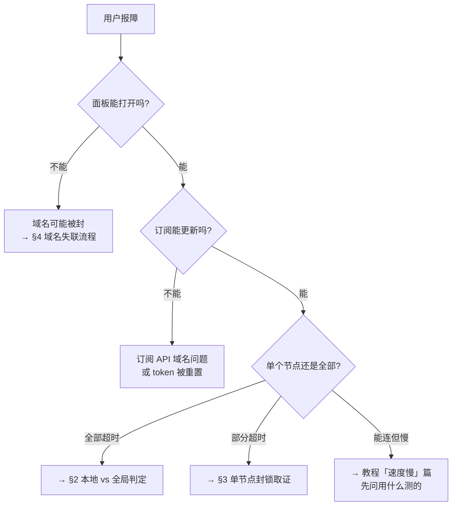

# 运维手册 · 节点健康与封锁取证

> 日期：2026-08-16 · 性质：**执行手册** · 状态：**设计稿 v1**（2026-08-16，未经本项目实战验证）
> 事实基线：取证方法来自 Proxy_Skill `VPN方案设计.md` §十一 的实战诊断（[reference-repos.md](../01-research/reference-repos.md) §1.5）
> 读者：值班运维。**用户报「连不上」时从本文第 1 节开始。**
> 关联：[system-design.md](../02-architecture/system-design.md) §3、[as-built-gcp.md](../02-architecture/as-built-gcp.md)

---

## 0 · 最重要的一条：不要用系统网络工具判断连通性

> **本机开启 TUN / fake-ip 模式时，`ping`、`dig`、`nslookup`、`nc`、`curl --interface`
> 的结果全部会被客户端劫持，不能作为任何判断依据。**

Proxy_Skill 记录了对照实验：连 `baidu.com` 的**正对照也失败** ——
说明失败来自本机劫持，不是链路问题。

**正确做法**：走客户端内核的 API。mihomo 的 delay 接口
（Clash Verge 的 unix socket 位于 `/tmp/verge/verge-mihomo.sock`）。

按此，探活服务的实现也**不能**用系统网络工具，必须用内核 API 或独立于客户端的探针机。

---

## 1 · 用户报「连不上」的分诊流程



---

## 2 · 全部节点超时：先分清本地问题还是全局问题

按顺序排除，**不要跳步**：

1. **看监控**：其他用户是否同时报障？独立探针机是否也失败？
   - 只有一个用户 → 大概率本地（运营商 QoS、客户端版本、系统时间偏差）
   - 多用户同时 → 继续
2. **分协议看**：Hysteria2（UDP）失败但 REALITY（TCP）正常 → **QUIC 被识别封锁**，
   不是节点故障。引导用户切到 REALITY 组。

   > **QUIC 封锁有明确的可判定特征**（USENIX Security 2025）：
   > GFW 自 2024-04-07 起解密 QUIC Initial 包读取 SNI，命中后丢弃该
   > **3 元组（源 IP、目的 IP、目的端口）** 的全部后续 UDP 包，**持续 180 秒**。
   >
   > 因此排障时：
   > - **等 3 分钟再重试** —— 若自动恢复，基本确认是 QUIC 残留封锁而非故障。
   > - **换源端口无效**（仍被丢弃），**换目的端口有效** —— 这是最快的判别实验。
   > - **端口跳跃不是有效防御**（社区实测，`apernet/hysteria` #1380）。
   > - 切到 TCP 再切回可恢复（社区验证的恢复手段）。
   > - 企业静态 IP 受影响远重于家宽动态 IP（社区观察，**待核实**）。
3. **分运营商看**：只有某一家运营商失败 → 该运营商的路由或 QoS 策略变化。
4. 以上都不是 → 进入 §3。

> **系统时间偏差**是一个隐蔽成因：多数协议对时间敏感，
> 客户端系统时间偏差超过阈值会导致握手失败。排障时值得一问。

---

## 3 · 节点 IP 被封的三条独立证据

**满足全部三条才判定为 IP 级封锁**（照搬 Proxy_Skill 的实战判据）：

| # | 证据 | 怎么查 |
|---|---|---|
| ① | 服务端进程 `active`，端口正常 bind | `systemctl is-active`；`ss -tulnp` |
| ② | 服务端 443 上**没有任何来自公网的 established 连接**，且数小时零日志 | `ss -tnp state established '( sport = :443 )'`；查服务日志 |
| ③ | 同端口**从境外回打可完成 TCP 握手**，而同协议同配置的另一区域节点完全正常 | 从境外探针机测 |

三条的逻辑是：① 排除服务故障，② 证明流量根本没到达，
③ 证明不是服务端配置问题而是路径问题。

### 3.1 判定为 IP 被封后的处置

```bash
# 1. 删除旧的保留静态 IP（防火墙按 tag 匹配，无需改规则）
gcloud compute addresses delete <old-ip-name> --project=oratis-491316 --region=<region>

# 2. 重新预留并挂载新 IP
gcloud compute addresses create <new-ip-name> --project=oratis-491316 --region=<region>
```

> **防火墙规则按 network tag 匹配（`bp-node`），换 IP 时无需修改任何规则。**
> 这是 Proxy_Skill 的设计，直接沿用。

**但换 IP 只是治标** —— 新 IP 同样会被再次探测封锁
（现有 `vpn-us-ip-v4` 的 `-v4` 后缀说明美国节点已换过三次）。
真正的抗封锁手段是协议层（REALITY 伪装、Hysteria2 混淆）与应急 CDN 通道。

### 3.2 换 IP 之后必须做的

- [ ] 触发订阅重新生成（所有用户下次拉取即获得新 IP）
- [ ] 通过邮件广播通知（见 [ADR 0002](../05-adr/0002-notification-channels.md)）
- [ ] 更新节点名中的域名广播位
- [ ] 记录到 IP 轮换台账（第几代、封锁存活时长）——
      **存活时长是评估协议抗封锁能力的唯一真实指标**

---

## 4 · 域名失联流程

**触发条件**：面板/API/教程站域名在多个运营商下均不可达。

1. 确认是域名被封而非服务故障（其他域名是否正常？境外访问是否正常？）
2. 切换到域名池中的下一个域名，更新 DNS
3. **通过邮件广播新域名**（唯一能触达大陆用户的通道 —— Telegram 在大陆被封，
   见 [ADR 0002](../05-adr/0002-notification-channels.md) §3.1）
4. 更新节点名中的域名广播位（订阅更新时会同步进客户端）
5. 记录到域名台账

> **三条恢复路径互不依赖**：邮件走 SMTP、节点名走订阅 API、域名池走客户端本地存储。

---

## 5 · 日常巡检

| 项目 | 频率 | 告警阈值 |
|---|---|---|
| 节点进程存活 | 60s | 连续 3 次失败 |
| 节点上报心跳（UniProxy `/alive`） | 60s | 超过 5 分钟无上报 |
| 各协议端口从境外可握手 | 5min | 连续 3 次失败 |
| 各域名从多运营商可达 | 15min | 任一运营商连续失败 |
| 出口流量用量 | 每日 | 超出预算 80% |
| 邮件送达率（QQ/163/126） | 每周 | 低于 95% |

告警通道：GCP 告警策略 → **Pub/Sub**（不用 webhook —— Google 官方说明
webhook / Slack / PagerDuty / 移动应用**共用同一内部服务，是同一个故障域**，
建议用 email 或 Pub/Sub 做冗余）→ Cloud Run 中继 → 值班渠道。
**并配一条 email 通道作为冗余路径。**

---

## 6 · 代价

> ⚠️ 1. 本手册的取证方法来自 Proxy_Skill 的**单次实战诊断**，未在本项目验证过。
> 首次实际使用时应记录偏差并回写本文。
> 2. §5 的巡检项全部需要独立于用户客户端的探针机 ——
> 这本身是一套要建、要维护、要付费的基础设施，**当前不存在**。

## 7 · 这次没有解决的

- [ ] 探针机部署方案未定（在哪、几台、什么运营商）。
- [ ] 「域名被封」的**自动**检测未实现，当前流程全靠人工触发。
- [ ] 节点自动换 IP 未脚本化（Proxy_Skill 也是手敲 `gcloud`）。
- [ ] 无 IP 轮换台账与域名台账的载体（写在哪、谁维护）。
- [ ] 值班制度、告警升级路径、on-call 轮值均未定义。
