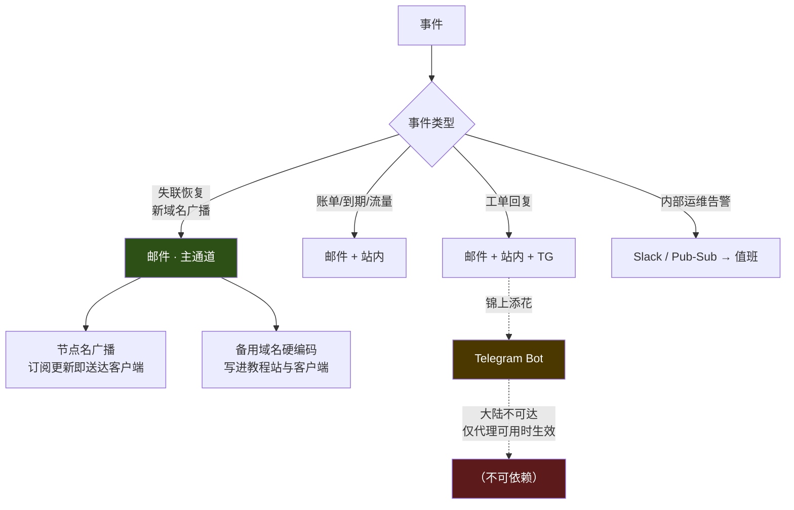

# 0002 · 裁决：邮件是唯一的失联恢复通道，Telegram 只能做锦上添花

> 日期：2026-08-16 · 性质：**架构裁决** · 状态：**设计稿 v1，待实施**（2026-08-16）
> 事实基线：OONI API 与 GreatFire 实测数据，采集于 2026-08-16
> 证据口径：OONI 聚合measurement + 同日 raw measurement = 高；GreatFire 单次测试 = 中；无数据 = **需实测**
> 关联：[0001-cloudflare-tos-risk.md](0001-cloudflare-tos-risk.md)、
> [admin-support-docs.md](../01-research/admin-support-docs.md)、
> [competitor-conyss.md](../01-research/competitor-conyss.md) §2（竞品的防失联做法）、
> [0011](0011-domain-blackout-detection.md)（承接本文 §7 的「域名被封自动检测」缺口，**提案，未批准**；落点见 §7）

---

## 1 · 裁决

**所有与「服务不可用」相关的通知 —— 新域名广播、节点故障、订阅地址变更 ——
必须以邮件为主通道，且邮件送达 QQ/163/126 邮箱的能力是本项目的硬需求。**

**Telegram 绑定仍然做，但明确定位为「服务正常时的便利通道」，
不得作为失联恢复路径的任何一环。**

---

## 2 · 为什么这条值得单独裁决

竞品 Conyss 的做法是：面板内公告 +「到期/流量邮件提醒」+ 绑定 Telegram。
照抄这个组合看起来很合理，但它有一个**结构性缺陷**，而且这个缺陷恰好在最关键的时刻发作。

> **通知系统的唯一硬需求是：在服务不可用时，仍然能把消息送到用户手里。**
> 服务正常时用户根本不需要通知 —— 他们打开面板就能看到。

按这个标准检验各通道：

| 通道 | 服务正常时 | **服务不可用时（真正需要它的时刻）** |
|---|---|---|
| 面板内公告 | ✅ | ❌ 域名被封时打不开 |
| Telegram Bot | ✅ | ❌ **Telegram 在中国大陆被封** |
| Discord | ✅ | ❌ 同样被封 |
| 邮件 | ✅ | ✅ **国内邮箱不依赖代理** |

**Telegram 是一个只在不需要它的时候才工作的通道。** 这是本裁决的核心。

---

## 3 · 证据

### 3.1 Telegram —— 包括 Bot API 在内，全线被封

数据来自 OONI 官方 API，采集日 2026-08-16：

| 目标 | 时间窗 | 测量数 | 异常数 | 异常率 |
|---|---|---|---|---|
| Telegram DC 接入点（`telegram` 测试） | 2025-08-01 → 2026-08-16 | 16,899 | 16,387 | **97.0%** |
| `api.telegram.org` | 近 12 个月 | 111 | 110 | **99.1%** |
| `t.me` | 近 12 个月 | 923 | 810 | 87.8% |
| `web.telegram.org` | 近 12 个月 | 104 | 103 | 99.0% |

**对照组**：同期 `www.google.com` 异常率 94.7%（946 次测量）——
证明探针确实位于 GFW 之内，不是挂了代理在测，数据管道可信。

**同日（2026-08-16）AS4837 中国联通的原始测量**：所有 Telegram DC 端点
（`149.154.175.50:80/443`、`149.154.167.51:443/80`、`185.60.219.41:443`、
`149.154.175.100:443/80`、`149.154.167.91:80`）**全部 `generic_timeout_error`**。

**`api.telegram.org` 的封锁机制已定位**（2026-08-09，AS9808 中国移动原始测量）：

1. DNS 解析**成功且一致**，返回真实 Telegram IP（`149.154.166.110`）—— 没有 DNS 投毒；
2. TCP 连接 `149.154.166.110:443` **成功**；
3. **TLS 握手被 `connection_reset`** —— 典型的 GFW SNI 触发重置；
4. IPv6 超时。

> 这一条尤其重要：**服务端从 GCP 调用 `api.telegram.org` 完全正常**
> （Cloud Run 在境外），所以开发时一切看起来都能跑通。
> **失效的是最后一跳 —— 用户的 Telegram 客户端收不到。**
> 这种「开发环境永远测不出来」的失效模式，必须写进文档，否则一定会被踩。

### 3.2 其他即时通讯通道

| 服务 | 状态 | 证据 |
|---|---|---|
| Discord | **被封**（DNS 投毒） | 近 12 月 5,649 次测量 / 5,170 异常（91.5%）。2026-08-16 原始测量：国内 DNS 返回伪造的 `210.56.51.192`，控制组返回真实 Cloudflare IP |
| WhatsApp | **被封** | 20,997 次测量 / 20,500 异常（97.6%） |
| Facebook Messenger | **被封** | 20,214 次测量 / 19,778 异常（97.8%） |
| Line | **被封** | 973 次测量 / 915 异常（94%） |
| **Slack** | **可达** | `slack.com` 843 次测量 / 742 正常（88%）；`app.slack.com` 91% |

Slack 可达是个意外发现，但它不是面向 C 端用户的通道，对本项目价值有限
（可考虑用作**内部运维告警**通道）。

### 3.3 一条必须纠正的流行错误认知

调研中顺带核实了「Google Fonts 在中国被封」这一广泛流传的说法 —— **当前数据不支持**：

- `fonts.googleapis.com`：OONI 近 12 月 82 次测量，**72 次正常（88%）**；
  GreatFire 2026-07-05 测试结果为「未封锁」，90 天内零中断。
- 对照：同期 `www.google.com` 异常率 94.7%。**不是管道问题。**
- ⚠️ 但样本全部来自 AS9808 / AS56040（**均为中国移动**），
  无电信/联通数据，标 **需实测**。
- `ajax.googleapis.com` 则不同：GreatFire 评级为「部分中断/间歇性」。

**结论：不要把「Google Fonts 被封」写进任何设计文档。**
但出于样本偏差，前端仍应自托管字体 —— 理由是消除外部依赖，不是「被封」。

### 3.4 客服 widget 的可达性 —— 无证据，不可假设

| 主机名 | OONI | GreatFire |
|---|---|---|
| `client.crisp.chat` | 无数据 | **从未测试** |
| `client.relay.crisp.chat`（WebSocket 中继） | 无数据 | **从未测试** |
| `widget.intercom.io` | **0 次测量** | 可达（2026-03-01） |
| `static.zdassets.com` | 无数据 | 可达（2025-12-29，**已过期 8 个月**） |
| `ekr.zdassets.com` | 无数据 | **从未测试** |

**没有任何可信证据说明这些 widget 在中国可用或不可用。**
Crisp 真正需要的两个主机名（脚本 + WebSocket 中继）从未被任何人测过。

> 且 Crisp 另有硬伤：其服务器 IP 段 `93.177.84.0/22` **仅在荷兰**，
> 数据驻留明确在欧洲，realtime PoP 最近的亚洲节点在新加坡，无中国大陆存在。
> 其官方排障文档对被封地区给出的建议是「用 VPN」—— 对我们的用户是同义反复。

**因此：不采用第三方客服 widget。工单系统自建。**

---

## 4 · 通道架构

### 4.1 三条失联恢复路径（互不依赖）

单靠邮件仍然不够 —— 邮件可能进垃圾箱、发信域名可能被拉黑。因此需要三条独立路径：

1. **邮件**（主）—— 送达国内邮箱，不依赖代理。
2. **节点名广播**（抄竞品）—— 把官方域名写进节点名称
   （竞品做法：`🇭🇰香港01 官网:conyss.uk`）。
   订阅更新时域名会**自动同步进客户端**，用户在选节点时就能看到。
   这条路径的妙处在于：**它在用户还能连上的时候就已经把新域名送到了**。
3. **客户端/教程站内置备用域名池** —— 静态兜底。

> 这三条的独立性是关键：邮件走 SMTP，节点名走订阅 API，域名池走本地存储。
> 任一条失效不影响其余两条。

---

## 5 · 由此产生的硬性工程要求

因为邮件成了单点，**邮件送达能力从「配置项」升级为「核心基础设施」**：

- [ ] 必须配置完整的 **SPF / DKIM / DMARC**。
- [ ] 必须实测送达 **QQ 邮箱 / 163 / 126 / Sina** 的收件箱（不是垃圾箱）。**需实测**。
- [ ] 发信域名应与主站域名**分离**（主域名被封或被拉黑不影响发信信誉）。
- [ ] 需要**两家**邮件服务商互为备份（主通道故障时自动切换）。
- [ ] 退信（bounce）与投诉（complaint）必须回收处理，否则信誉快速劣化。
- [ ] 关键邮件（新域名广播）需要有**送达确认与重试**机制。

> ⚠️ 国内邮箱服务商对境外发信域名的过滤非常激进，
> 且**没有任何公开文档说明其规则**。这一项的实际难度远高于表面，
> 必须在 P1 阶段就开始验证，不能留到最后。

---

## 6 · 代价

> ⚠️ 这一选择的代价，必须留在记录里而不是被措辞掩盖：
>
> 1. **把可用性押在邮件送达上，而这是我们最不能控制的一环。**
>    QQ/163 的过滤规则不公开、不可协商、可随时变化。
>    我们能做的只有把 SPF/DKIM/DMARC 做对、把发信信誉养好，**然后祈祷**。
>    这是真实的、无法通过工程手段完全消除的风险。
> 2. **仍然要建 Telegram 集成，但它的价值被大幅折价。**
>    投入产出比变差了 —— 之所以还做，是因为对**已经能连上**的用户，
>    TG 是体验最好的即时通道，且对海外用户完全有效。
> 3. **放弃第三方客服 widget，意味着工单系统必须自建**，
>    增加了开发量。换来的是不引入一个可达性完全未知的外部依赖。
> 4. **本裁决高度依赖 OONI 的中国测量数据**，而 OONI 自 2023-07-07 起
>    在中国被封锁，测量覆盖度下降且样本偏向少数 ASN
>    （大量数据来自 AS24400 阿里云 —— 一个**数据中心**网络，不是家用宽带）。
>    **若样本偏差导致结论失真，本裁决需重新审视。**

## 7 · 这次没有解决的

- [ ] 邮件服务商未选型（Resend / SES / Postmark / Mailgun / Brevo），
      **且必须以国内邮箱实测送达率为唯一选型依据**，不能看厂商宣传。
- [ ] 未实测 QQ/163/126 的实际送达率 —— **P1 阶段第一优先级验证项**。
- [ ] `client.crisp.chat` / `client.relay.crisp.chat` / `ekr.zdassets.com`
      的中国可达性从未被测过。虽然已决定不用 widget，但若将来重新考虑，
      需先用 GreatFire 的「Test now」补测。
- [ ] 短信通道未评估（国内短信需要资质，境外短信到国内号码成本高且到达率待核实）。
- [ ] 「域名被封」的**自动检测机制**未设计 —— 谁来判定、多快判定、判定后自动做什么。
      > **2026-08-29 补登落点：这三问已有裁决，但裁决本身尚未批准。**
      > [ADR 0011](0011-domain-blackout-detection.md) 逐问作答 —— 谁来判定见 §3（客户端内核的直连探测腿是境内主信号）、
      > 多快判定见 §4（分池阈值 + §4.2 防误报四条硬规则）、判定后自动做什么见 §5
      > （§5.1 **显式否掉**「自动切主域名」，只保留可逆动作）；与本文邮件广播的接线见 §11。
      > 0011 文档头把本条列为它「合并解决 B5 的七处登记」之一。
      > 🔴 **本条不划掉**：0011 的状态是**提案，未批准**（2026-08-23），批准前既无实现也无机制。
- [ ] 微信公众号模板消息未评估（大概率因主体资质无法申请，但未核实）。
