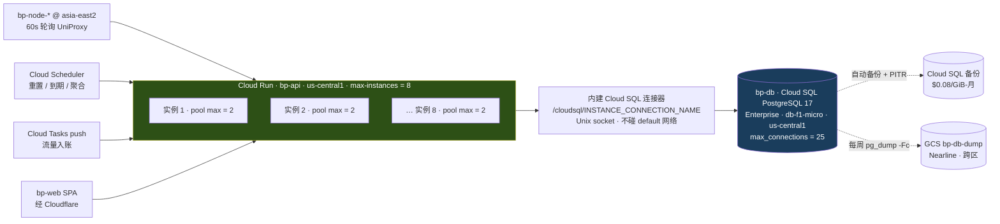

# 0005 · 裁决：控制面数据库用 Cloud SQL for PostgreSQL，与 `bp-api` 同区同项目，起步 `db-f1-micro`

> 日期：2026-08-16 · 性质：**架构裁决** · 状态：**提案，未批准**（2026-08-16）
> 事实基线：2026-08-16 实际抓取 Google Cloud / Cloudflare / Neon / Supabase / PlanetScale
> 官方定价页与开发者文档原文；GCP 现状取自
> [as-built-gcp.md](../02-architecture/as-built-gcp.md)（2026-08-16 `gcloud` 输出）
> 关联：[system-design.md](../02-architecture/system-design.md) §4 · §5.1 · §5.3 · §6 · §9、
> [0001 CF 只承载控制面](0001-cloudflare-tos-risk.md) §2.2 · §3、
> [product-brief.md](../00-overview/product-brief.md) §4
> 证据口径：官方定价页 / 官方文档 = 高；第三方定价聚合站 = **待核实**；
> 我们自己的负载估算 = **需实测**
> 裁决人：**待定** —— 本文需用户拍板（要启用 `sqladmin` API，并产生持续月度支出）

---

## 1 · 裁决

**主选：Cloud SQL for PostgreSQL，Enterprise edition，`db-f1-micro`，`us-central1`，
与 `bp-api` 同区同项目，走 Cloud Run 内建的 Cloud SQL 连接器（Unix socket），
不建 VPC connector、不碰 `default` 网络。核实价格 $7.665/月 + 10 GB SSD $1.70/月
+ 备份约 $0.16/月 = 约 $9.53/月。**

**备选：Neon Launch（`aws-us-east-2` / Ohio），常驻 0.25 CU 约 $19.70/月。**
若实测发现 25 连接的天花板真的卡住 `bp-api` 的弹性，或者我们决定把控制面从 GCP 里挪出来
做爆炸半径隔离，就切 Neon —— 它的 10,000 路 pooler 与 HTTP driver 从根上消掉连接数问题。

三条附带裁决：

| # | 裁决 | 一句话理由 |
|---|---|---|
| a | **在线态（`alive` 设备、节点最后上报）用 Postgres `UNLOGGED` 表，不买 Redis** | Memorystore Basic M1 1 GiB = **$35.77/月**，比整个数据库还贵 3.7 倍 |
| b | **`bp-api` 必须 `--max-instances=8`，每实例连接池 `max=2`** | `db-f1-micro` 的 `max_connections` = 25，这是硬天花板不是建议值 |
| c | **每周额外 `pg_dump -Fc` 到跨区 GCS bucket** | Cloud SQL 自动备份与实例生命周期绑定，防不了「删错实例」 |

**升配路径**：`db-f1-micro` → `db-g1-small`（$25.55/月，50 连接，1.7 GiB RAM），
原地改机型、重启即可。触发条件写在 §6.3。

---

## 2 · 先把负载变成数字，再谈选型

选型讨论最容易失控的地方，是拿「serverless / 弹性 / 现代」这类形容词互相说服。
所以先把 [system-design.md](../02-architecture/system-design.md) §5.1 的契约折算成行写入量。

写入来自两个端点，都是**每节点每 60 秒一次**：

- `POST /api/v1/server/UniProxy/push` —— `{uid: [upload, download]}`，只含本周期**有流量**的用户
- `POST /api/v1/server/UniProxy/alive` —— 在线设备数

于是「行更新/分钟 = 节点数 × 本周期活跃用户数」。三档情景（**需实测**，活跃比例是猜的）：

| 情景 | 节点数 | 周期内活跃用户 | 行更新/分钟 | 行更新/秒 | 行更新/月 |
|---|---|---|---|---|---|
| P1 内核可用 | 2 | 30 | 60 | 1.0 | 2.6 M |
| P2 产品闭环 | 4 | 100 | 400 | 6.7 | 17.3 M |
| P3 可运营（上限设想） | 8 | 300 | 2,400 | 40 | 103.7 M |

（月 = 分钟 × 43,200）

**这个量级对 PostgreSQL 是噪声。** 单核 Postgres 做点写轻松上万 TPS，40 行/秒连 1% 都不到。
所以「高频小写入扛不扛得住」在 Postgres 这一侧**根本不是选型变量** —— 真正的变量有两个：

1. **同一行的锁竞争与行版本膨胀**（同一个用户在多节点上并发累加 `u`/`d`）
   → 解法已经写在 [system-design §6.4](../02-architecture/system-design.md)：
   热写字段拆到 1:1 的 `user_traffic`。本文在 §7 追加两条具体调参。
2. **按行计费的数据库会被这个量级打穿** —— 见 §5.1 的 D1 算账。

读取侧同样要算：节点每 60 秒拉 `UniProxy/config` 与 `UniProxy/user`，
**ETag + 304 是性能命门**（system-design §5.1 已裁定）。
命中 304 时只需读一行版本号（`servers.user_list_version`），
8 节点 × 2 端点 × 1/分钟 = 16 次单行索引查询/分钟 ≈ **0.27 QPS**。可以忽略。

---

## 3 · 候选对比

价格全部是 2026-08-16 从官方页面抓取的真实数字，来源逐条列在 §4。
「最小可用月费」= 能跑生产（含备份）的最低配置，不是「免费层」。

| 候选 | 形态 | 最小可用月费 | 连接上限 | 与 `bp-api` 网络距离 | 备份 / PITR | 结论 |
|---|---|---|---|---|---|---|
| **Cloud SQL PG `db-f1-micro`** | GCP 托管 | **$9.53** | **25** | 同区，`< 1 ms` | 自动备份 + PITR 内建 | ✅ **主选** |
| Cloud SQL PG `db-g1-small` | GCP 托管 | $27.41 | 50 | 同区 | 同上 | ✅ 升配目标 |
| Cloud SQL PG `db-custom-1-3840` | GCP 托管 | $51.17 | 400 | 同区 | 同上，**且有 SLA** | ⏸ P3 再谈 |
| **Neon Launch（0.25 CU 常驻）** | AWS serverless PG | **$19.70** | **10,000（pooler）** | 跨云，`us-central1↔us-east-2`，**需实测** | 7 天 history window 含在内 | ✅ **备选** |
| Supabase Pro + PITR | AWS 托管 PG | **$130** | 200（Supavisor，Micro） | 跨云 | Pro 才有备份；**PITR 是 $100/月 加购** | ❌ 见 §5.2 |
| Cloudflare D1 | Workers SQLite | $5（Workers Paid） | —— | **只能走 REST API，4 req/s** | 无 PITR | ❌ 见 §5.1 |
| 自建 PG on GCE `e2-small` | 自运维 | 约 $14.2 **待核实** | 自定（可 200+） | 同区 | **全部自己做** | ❌ 见 §5.3 |
| PlanetScale Postgres PS-5 | AWS/GCP 托管 PG | $5（单节点）/ $15（3 节点 HA） | **待核实** | GCP 区域清单**待核实** | 含 2× 磁盘的备份额度 | ⏸ 见 §5.4 |
| Turso | libSQL / SQLite | $29（Scaler，**待核实**） | —— | —— | —— | ❌ 与 D1 同类问题 |
| Memorystore Redis Basic M1 1 GiB | GCP 托管 Redis | **$35.77** | —— | 同区 | —— | ❌ 仅作缓存对比，见 §8 |

### 3.1 为什么 Cloud SQL 赢

按重要性排序，只有三条真正起作用：

1. **它和 `bp-api` 在同一个区、同一个项目、同一套 IAM 里。**
   同区内网 RTT `< 1 ms`；连接不出 Google 网络；密钥走 Secret Manager 与
   `bp-api-sa` 服务账号（as-built §5 已规划）；不新增任何供应商账号。
   相比之下 Neon/Supabase/PlanetScale 都要跨云，每条查询都要过公网。
2. **它最便宜，而且便宜得不含糊。** $9.53/月 比 Neon 的 $19.70 少一半，
   比 Supabase 带 PITR 的 $130 少 93%。
3. **备份与 PITR 是内建的，不是加购项。** 这一条把 Supabase 直接踢出局（§5.2）。

**Cloud SQL 输在哪里，也必须写清楚**：`db-f1-micro`/`db-g1-small` 是 shared-core，
Google 官方定价页脚注原文：

> "Shared CPU machine types (db-f1-micro and db-g1-small) are not covered by the Cloud SQL SLA."
> —— [Cloud SQL pricing](https://cloud.google.com/sql/pricing)，2026-08-16 抓取

**我们敢接受「无 SLA」的唯一依据是
[system-design §5.3](../02-architecture/system-design.md)：
节点在面板不可达时用最后一次成功的配置继续服务，本地缓冲流量数据待恢复后补报。**
也就是说数据库挂掉的后果是「买不了、改不了」，不是「用户掉线」。
这把数据库的 RTO 要求从分钟级降到小时级可接受。

> 🔴 **这条依赖是本裁决的承重墙。**
> 如果哪天节点侧不再实现「面板不可达仍继续服务」，
> 那么 shared-core 无 SLA 就变成不可接受，本裁决必须重做。

---

## 4 · 价格核实明细（全部一手抓取）

### 4.1 Cloud SQL for PostgreSQL

来源：[cloud.google.com/sql/pricing](https://cloud.google.com/sql/pricing)，2026-08-16 抓取页面内嵌定价表。

| 项目 | `us-central1`（Iowa） | `asia-east1`（台湾） | `asia-east2`（香港） |
|---|---|---|---|
| `db-f1-micro`（0.6 GiB） | $0.0105/hr = **$7.665/月** | **$7.665/月** | $0.0158/hr = **$11.534/月** |
| `db-g1-small`（1.7 GiB） | $0.035/hr = **$25.55/月** | **$25.55/月** | $0.0525/hr = **$38.325/月** |
| HA `db-f1-micro` | —— | —— | $0.0315/hr = $22.995/月 |
| Enterprise 独占核 vCPU | **$30.149/vCPU-月** | —— | **$45.26/vCPU-月** |
| Enterprise 独占核内存 | **$5.11/GiB-月** | —— | **$7.665/GiB-月** |
| SSD 存储 | **$0.17/GiB-月** | $0.17/GiB-月 | **$0.255/GiB-月** |
| HDD 存储 | $0.09/GiB-月 | $0.09/GiB-月 | $0.135/GiB-月 |
| 备份（已用量） | **$0.08/GiB-月** | $0.08/GiB-月 | **$0.12/GiB-月** |

由此推出三个关键的**衍生数字**：

- **最小 SLA 覆盖配置**：`db-custom-1-3840`（1 vCPU + 3.75 GiB）
  = $30.149 + 3.75 × $5.11 = **$49.31/月**（不含存储）。
  也就是说，**在 Cloud SQL 上买一个「有 SLA」的最小 Postgres 要 $51.17/月**，
  是 `db-f1-micro` 的 5.4 倍。这个价差就是我们接受无 SLA 的价码。
- **`asia-east1`（台湾）与 `us-central1` 完全同价**，而 `asia-east2`（香港）
  实例贵 50%、SSD 贵 50%、备份贵 50%。见 §9 的区域裁决。
- 本文的 $9.53/月 = $7.665（实例）+ 10 GiB × $0.17（$1.70，存储下限按 10 GB 计，**待核实**）
  + 约 2 GiB × $0.08（$0.16，备份）。

⚠️ 官方文档明确：
"If the database version for your instance is PostgreSQL 16 or later, then the default
Cloud SQL for PostgreSQL edition is Cloud SQL Enterprise Plus edition."
（[Create instances](https://docs.cloud.google.com/sql/docs/postgres/create-instance)）
而 **Enterprise Plus 不支持 shared-core 机型** —— 所以建实例时
`--edition=ENTERPRISE` 必须显式写，否则命令直接失败。见 §10。

### 4.2 Neon

来源：[neon.com/pricing](https://neon.com/pricing) 与
[neon.com/docs/introduction/plans](https://neon.com/docs/introduction/plans)，2026-08-16。

| 项目 | Free | Launch | Scale |
|---|---|---|---|
| 计算 | **100 CU-hours / project** | **$0.106 / CU-hour** | $0.222 / CU-hour |
| 存储 | 0.5 GB / project | **$0.35 / GB-月** | $0.35 / GB-月 |
| 出网 | 5 GB | 500 GB / project，超出 $0.10/GB | —— |
| 自动缩到零 | 5 分钟后，**不可关** | 5 分钟后，可关 | 1 分钟至常开 |
| history window（≈ PITR） | 6 小时 | **最多 7 天** | —— |
| 最小计算规格 | **0.25 CU**（1 CU ≈ 4 GB RAM） | 同 | 同 |

**关键推论：scale-to-zero 对我们没有价值。**
节点每 60 秒轮询一次 API，任何一次查询都会重置 Neon 的 5 分钟空闲计时器，
**计算实例永远不会挂起**。所以：

- Neon Launch 实际成本 = 0.25 CU × 730 h = **182.5 CU-hours × $0.106 = $19.35/月**
  ＋ 1 GB 存储 $0.35 = **约 $19.70/月**。
- Neon Free 的 100 CU-hours ÷ 0.25 CU = **400 小时 = 16.7 天**，
  连一个月都撑不到。**免费层对本项目无效。**

Neon 的真正杀手锏是连接数：
[Connection pooling](https://neon.com/docs/connect/connection-pooling) 文档给出
`max_client_conn = 10000`，`default_pool_size = 0.9 × max_connections`；
0.25 CU 的 `max_connections` = 104，故池后端约 93 路、前端 10,000 路。
**这从根上消掉了 §6 那一整节的问题。**

Neon 的区域限制是它做不了主选的原因：
[Regions](https://neon.com/docs/introduction/regions) 只列了 8 个 AWS 区域
（`us-east-1`/`us-east-2`/`us-west-2`/`eu-central-1`/`eu-west-2`/
`ap-southeast-1`/`ap-southeast-2`/`sa-east-1`），Azure 区域已停止新建，
**没有任何 GCP 区域**。离 `us-central1`（Iowa）最近的是 `aws-us-east-2`（Ohio）。

### 4.3 Supabase

来源：[supabase.com/pricing](https://supabase.com/pricing)、
[Backups](https://supabase.com/docs/guides/platform/backups)、
[Going into prod](https://supabase.com/docs/guides/platform/going-into-prod)，2026-08-16。

| 项目 | Free | Pro |
|---|---|---|
| 数据库 | 500 MB（Shared CPU / 500 MB RAM） | 8 GB 磁盘 |
| 出网 | 5 GB | 250 GB |
| 活跃项目数 | **最多 2 个** | —— |
| 起价 | $0 | **$25/月**（含 $10 compute credit） |
| Micro 计算加购 | —— | $10/月（2-core ARM / 1 GB，60 直连 / **200 pooler**） |
| Small 计算加购 | —— | $15/月（2-core ARM / 2 GB，90 直连 / 400 pooler） |
| **自动备份** | **无** | 每日备份，保留 7 天 |
| **PITR** | 无 | **加购，7 天保留 $100/月**，且要求至少 Small 计算 |

### 4.4 Cloudflare D1

来源：[D1 pricing](https://developers.cloudflare.com/d1/platform/pricing/) 与
[D1 limits](https://developers.cloudflare.com/d1/platform/limits/)，2026-08-16。

| 项目 | Workers Free | Workers Paid |
|---|---|---|
| Rows read | 5 M / 天 | 首 25 B/月含，超出 $0.001 / M 行 |
| Rows written | **100 K / 天** | 首 50 M/月含，超出 **$1.00 / M 行** |
| 存储 | 5 GB（总） | 首 5 GB 含，超出 $0.75 / GB-月 |
| 单库上限 | 500 MB | **10 GB** |
| 库数上限 | 10 | 50,000 |
| 单次查询最长 | 30 秒 | 30 秒 |
| 每次 Worker 调用可开连接 | 6 | 6 |

官方对 rows written 的定义（原文）：

> "Indexes will add an additional written row when writes include the indexed column,
> as there are two rows written: one to the table itself, and one to the index."
> —— [D1 pricing](https://developers.cloudflare.com/d1/platform/pricing/)

### 4.5 其余

| 项目 | 数字 | 来源与口径 |
|---|---|---|
| Memorystore Redis Basic M1 | $0.049/GiB-hr × 1 GiB × 730 = **$35.77/月** | 搜索结果引 Google 定价，**与 as-built §6 的「约 $35」一致** |
| GCE `e2-small` `us-central1` | $0.0168/hr = **$12.23/月** | [gcloud-compute.com](https://gcloud-compute.com/e2-small.html) 二手源，**待核实** |
| GCE `e2-small` `asia-east2` | $0.0234/hr = **$17.11/月** | 同上，**待核实** |
| GCE `e2-small` `asia-east1` | $0.0194/hr = **$14.16/月** | 同上，**待核实** |
| Serverless VPC Access connector | 最小 2 × f1-micro ≈ **$14/月**，且**不缩容** | 二手源，**待核实** |
| Direct VPC egress | **无计算费**，只按网络出量计费 | [官方对比文档](https://docs.cloud.google.com/run/docs/configuring/connecting-vpc) |
| PlanetScale Postgres PS-5 | 单节点 **$5/月**（1/16 vCPU / 512 MB），3 节点 HA **$15/月**，含 10 GB 存储 | [PlanetScale 定价文档](https://planetscale.com/docs/postgres/pricing)，无免费层 |

---

## 5 · 逐个否决

### 5.1 Cloudflare D1 —— 死在「我们的 API 不在 Workers 上」

先澄清一个可能的误解：**D1 属控制面，不违反
[ADR 0001](0001-cloudflare-tos-risk.md) §2.2 的 §2.2.1(j)。**
把数据库放 Cloudflare 不构成「提供 VPN 或类似代理服务」。ToS 不是否决理由。

否决理由有三条，第一条是致命的：

1. **`bp-api` 跑在 Cloud Run，不是 Worker。D1 只能通过 Cloudflare REST API 访问，
   而 Cloudflare 的全局 API 限流是 1,200 请求 / 5 分钟 / 账号 = 4 req/s，
   且与该账号下所有其他 API 调用（DNS 变更、缓存清除……）共享。**
   （[API 限流文档](https://developers.cloudflare.com/fundamentals/api/reference/limits/)）
   一次用户面板页面加载做 6 条查询，20 个并发用户就是 120 次调用；
   加上节点轮询与后台，几分钟内必然触发 `HTTP 429`，而 429 会把
   **接下来 5 分钟的全部 API 调用一起封掉** —— 包括我们改 DNS 的能力。
   要绕开只能把 `bp-api` 整体重写成 Worker，那是推翻
   [system-design §4](../02-architecture/system-design.md) 的另一个裁决。

2. **按行计费会被我们的写入模式打穿。** 用 §2 的 P3 情景（8 节点 / 300 活跃用户）：
   103.7 M rows written/月，超出 Workers Paid 含的 50 M，超出部分
   53.7 M × $1.00/M = **$53.7/月**。而 `user_traffic` 上只要有一个二级索引
   覆盖被更新的列，按官方定义就翻倍到 207 M 行 → **超出部分 $157/月**。
   Free 层更直接：P2 情景（4 节点 / 100 活跃用户）= 576,000 行/天，
   是 100,000 行/天额度的 **5.76 倍**。

3. **架构上不该把控制面数据库放进那个账号。**
   [ADR 0001 §3](0001-cloudflare-tos-risk.md) 已经论证：Cloudflare 的处置是**账号级**的，
   而抗封锁架构的全部备份路径都挂在 CF 账号下。再把数据库放进去，
   等于把「服务商处置」这个风险从「面板打不开」升级成「数据拿不回来」。

附带的技术天花板（不是主要理由，但要记录）：单库 10 GB 上限、
每个数据库**串行处理查询**（SQLite 单线程）、无 PITR。

**Turso 同理否决**：同样是 SQLite/libSQL 形态，同样要跨网访问，
且它不是 Postgres —— 我们已经裁定用 PostgreSQL，换 SQLite 意味着重写
[system-design §6](../02-architecture/system-design.md) 的数据模型要点。

### 5.2 Supabase —— 死在备份，不是死在暂停

任务书假设「免费项目暂停」对我们是致命的。**核实后发现不是。**
官方原文是：

> "We may pause applications on the Free Plan that exhibit low activity in a 7-day period
> to save on server resources."
> —— [Going into prod](https://supabase.com/docs/guides/platform/going-into-prod)

我们有 60 秒心跳，**永远不会 "low activity"**，所以不会被暂停。
把这条当否决理由是错的，必须纠正。

真正的否决理由是**备份**：

- **Free 层完全没有自动备份。** 官方建议是自己用 CLI `db dump`
  （[Backups](https://supabase.com/docs/guides/platform/backups)）。
  一个跑真实订单与余额的控制面数据库没有备份，不可接受。
- **Pro 层有每日备份（保留 7 天），但 PITR 是 $100/月 的加购项**，
  且要求至少 Small 计算。算总账：$25（Pro）+ $5（Small 补差价）+ $100（PITR 7 天）
  = **约 $130/月**，是 Cloud SQL `db-f1-micro` 的 **13.6 倍**，
  而后者的 PITR 是内建的。

次要问题：Free 层 500 MB 数据库 + 最多 2 个活跃项目（我们至少要 prod + staging）。

### 5.3 自建 Postgres on GCE —— 资源更多，但每月贵 $4.7，且把三件事揽回自己身上

成本对比（`us-central1`）：

| 项 | 自建 GCE | Cloud SQL `db-f1-micro` |
|---|---|---|
| 计算 | `e2-small` $12.23/月（2 GiB，**待核实**） | $7.665/月（0.6 GiB） |
| 存储 | 20 GB balanced PD 约 $2/月（**待核实**） | 10 GB SSD $1.70/月 |
| 备份 | 自己写 `pg_dump` → GCS Nearline，约 $0.02/月 | 自动备份 $0.16/月 |
| **合计** | **约 $14.2/月** | **约 $9.53/月** |
| RAM | **2 GiB**（是 f1-micro 的 3.3 倍） | 0.6 GiB |
| `max_connections` | **自定，200 无压力** | **25，硬天花板** |

**自建在纯资源上其实更划算 —— 更多内存、更多连接、只贵 $4.7/月。**
这一点必须诚实写出来，不能用「托管服务当然更好」糊过去。

否决理由是**非资源成本**：

1. **它把三件事从「Google 的责任」变成「我们的责任」**：小版本升级与安全补丁、
   WAL 归档与 PITR、崩溃恢复。这三件事各自的工作量都不大，
   但它们是**永久性的、需要有人记得的**负担。
   [product-brief §4.2](../00-overview/product-brief.md) 明确说本项目追求「运维可控性」，
   而不是「资源利用率最优」。
2. **单可用区、单实例、无自动故障转移**，且我们不会为它做 HA（做了就不省钱了）。
   Cloud SQL 至少提供了一条「改一个参数就变 HA」的路。
3. **它要放进 `default` 网络**，而 as-built §3 已经记录该网络存在
   `default-allow-ssh 0.0.0.0/0` 且无 target tag 的裸奔风险。
   多一台带 5432 的 VM 就多一份暴露面，还要为它单独写防火墙规则。
4. 省下的 $4.7/月，对照 [ADR 0001 §6](0001-cloudflare-tos-risk.md) 记录的
   **单用户出口流量成本约 $23/月**，是 0.2 个用户的量。**不值得。**

> 若后续验证发现 `db-f1-micro` 的 0.6 GiB RAM 确实不够用，
> **升级顺序应该是 `db-g1-small`（$25.55）→ 重新评估自建（$14.2）**，
> 而不是直接跳到 `db-custom-1-3840`（$49.31）。
> 在 $25 这个价位上，自建的性价比优势会变得明显，届时第 1、2、3 条理由要重新称重。

### 5.4 PlanetScale Postgres —— 唯一被搁置而非否决的候选

$5/月单节点、$15/月 3 节点 HA、含 10 GB 存储、含 100 GB 出网、
备份额度是磁盘的 2 倍 —— 这套报价**比 Cloud SQL 便宜**，
而且 3 节点 HA 只要 $15/月这件事在同价位里没有对手。

搁置而非采纳的原因只有一个，且是可以消除的：
官方文档列出的 GCP 区域是「US locations、比利时、荷兰、蒙特利尔、首尔」，
**没有明确说是否覆盖 `us-central1`**，且 PS-5 的 1/16 vCPU / 512 MB 规格下
连接数上限**未核实**。这两项查清之前不能作为主选。

**行动项已写入 §12：P2 阶段重新评估。**

---

## 6 · Cloud Run 的连接数天花板：这是本裁决唯一的真风险

### 6.1 问题的形状

Cloud Run 无状态、按请求横向扩，而 Postgres 的连接是**有限且昂贵**的资源。
官方文档把这件事说得很直白：

> "Cloud Run container instances are limited to 100 connections to a Cloud SQL database.
> Each instance of a Cloud Run service or job can have 100 connections to the database,
> and as this service or job scales, the total number of connections per deployment can grow."
> —— [Connect from Cloud Run](https://docs.cloud.google.com/sql/docs/postgres/connect-run)

而 `db-f1-micro` 的 `max_connections` 默认值是 **25**（`db-g1-small` 是 **50**），
由机型自动设定。25 个连接对上「可以扩到 100 个实例的 Cloud Run」，
默认配置下**必然打爆**。



### 6.2 硬约束公式

```
max_instances × pool_max + 运维预留 ≤ max_connections − superuser_reserved_connections
```

`superuser_reserved_connections` 默认 3。代入两档机型：

| 机型 | `max_connections` | 可用 | 建议 `--max-instances` | 每实例池 `max` | 占用 | 余量 |
|---|---|---|---|---|---|---|
| `db-f1-micro` | 25 | 22 | **8** | **2** | 16 | 6 |
| `db-g1-small` | 50 | 47 | **20** | **2** | 40 | 7 |

余量留给：手工 `psql` 排障、迁移工具（`migrate`/`atlas`）、监控采集。

**配套的三条硬要求**（不做的话公式就是废纸）：

1. **`--max-instances` 必须显式设。** Cloud Run 的默认上限是 100，
   不设就等于没有约束。
2. **Cloud Tasks 队列必须限并发。** 流量入账走 Cloud Tasks push
   （[system-design §4](../02-architecture/system-design.md)），
   一批任务同时投递会瞬间拉起大量实例。设
   `--max-concurrent-dispatches=4 --max-dispatches-per-second=10`。
   注意这些请求打的是**同一个** `bp-api` 服务，所以它们消耗的是同一份 `max-instances` 预算。
3. **连接池要设短的 idle timeout。** Cloud Run 实例在空闲但未被回收时仍持有连接。
   Go 用 `pgxpool` 设 `MaxConns=2 / MaxConnIdleTime=30s`；
   Node 用 `pg.Pool` 设 `max: 2, idleTimeoutMillis: 30000`。

⚠️ **不要靠调大 `max_connections` 解决。** 它是可配置 flag，但 `db-f1-micro`
只有 0.6 GiB RAM，每个 Postgres backend 常驻约 5–10 MB，
50 个 backend 就是 250–500 MB —— 直接 OOM。**连接数天花板本质是内存天花板。**

⚠️ **Cloud SQL 的 Managed Connection Pooling 用不了。** 官方要求
"Your instance must be a Cloud SQL Enterprise Plus edition instance"
（[MCP 文档](https://docs.cloud.google.com/sql/docs/postgres/managed-connection-pooling)），
而 Enterprise Plus 不支持 shared-core。**这条路对我们是封死的。**

### 6.3 什么时候升配到 `db-g1-small`

任一条触发即升（$25.55/月，重启一次，控制面停机数分钟）：

- Cloud Run `bp-api` 的实例数在一周内有 **≥ 3 次**触到 `max-instances=8`
- Cloud SQL 的 `pg_stat_database.numbackends` 周峰值 **≥ 18**（22 可用的 80%）
- 出现任何一次 `FATAL: sorry, too many clients already`
- 数据库内存使用率周峰值 **≥ 85%**

### 6.4 为什么不用私有 IP + Direct VPC egress（至少第一阶段不用）

私有 IP 在安全上更优（数据库完全不暴露公网 IP），且省掉 Cloud SQL Auth Proxy 的握手。
但它需要在 `default` 网络上做一次 VPC peering 并分配一段 `/24` ——
而 `default` 正是现有 `vpn-us`/`vpn-jp` 所在的网络（as-built §2、§3）。
这落在「影响已部署服务」的边缘地带，**需要用户单独授权**。

第一阶段用 Cloud Run 内建的 Cloud SQL 连接器（`--add-cloudsql-instances`）：
Google 在容器里注入 `/cloudsql/<conn-name>` Unix socket，
连接自动加密，走 Google 内部网络，**不需要给数据库开任何 authorized network**，
**不碰 `default` 网络，成本 $0**。

如果将来要改私有 IP，**必须用 Direct VPC egress，不要用 Serverless VPC Access connector**
—— 后者最小配置约 $14/月且**不会缩容**（连接器实例只扩不缩），
而 Direct VPC egress 没有计算费。

> **需实测**：内建连接器在 Cloud Run 冷启动时的附加延迟。
> Auth Proxy 首次建连要做一次证书交换，估计增加 100–500 ms，
> 但没有一手数据。这个数字决定要不要在 P3 为了省这几百毫秒去动 `default` 网络。

---

## 7 · 写入模式的具体调参

§2 已经证明吞吐不是问题，所以这一节只处理锁竞争与膨胀。

1. **每次 `push` 合成一条语句。** 不要对 N 个用户发 N 条 `UPDATE`，
   用一条 `UPDATE user_traffic AS t SET u = t.u + v.u, d = t.d + v.d
   FROM (VALUES ...) AS v(user_id, u, d) WHERE t.user_id = v.user_id`。
   把 N 次网络往返压成 1 次，也把 N 个事务压成 1 个。
2. **`user_traffic` 设 `fillfactor = 70`。** 让 `UPDATE` 走 HOT（Heap-Only Tuple），
   新行版本留在同一页内，**不触碰索引**。这是把「行版本膨胀」控制住的关键一招。
3. **`user_traffic` 上除主键外不建任何索引。** 每多一个覆盖被更新列的索引，
   HOT 就失效一次。查询用户流量时按 `user_id` 主键查，不需要别的索引。
4. **对 `user_traffic` 单独调 autovacuum**：
   `autovacuum_vacuum_scale_factor = 0.02`、`autovacuum_vacuum_cost_delay = 2ms`。
   这是一张行数少、更新极频繁的表，默认的 20% scale factor 会让它长期带着死元组跑。
5. **明细流水绝不落表**（[system-design §6.3](../02-architecture/system-design.md) 已裁定），
   只累加 + 按天/月聚合到 `stat_user` / `stat_server`。

照抄 Xboard 数据模型时的两个 **MySQL → PostgreSQL 陷阱**，写在这里免得踩：

- 🔴 **大小写敏感性。** Xboard 用 MySQL 的 `utf8mb4_unicode_ci`（不区分大小写），
  `users.email` 的唯一约束天然把 `A@x.com` 与 `a@x.com` 视为同一个。
  **PostgreSQL 的 `text` 默认区分大小写** —— 直接照抄 DDL 会让同一个邮箱注册两次。
  解法：`CREATE UNIQUE INDEX ON users (lower(email))`，或用 `citext` 扩展。
- **无符号整数。** MySQL 的 `unsignedBigInteger` 在 PG 里没有对应类型，用 `bigint`。
  `int8` 上限 9.22 × 10^18 字节 ≈ 9.2 EB，存流量字节绰绰有余。
  金额仍按 [system-design §6.5](../02-architecture/system-design.md) 用 `integer` 存分。

---

## 8 · 缓存与在线态：用 `UNLOGGED` 表，不买 Redis

四个候选，三个被否：

| 候选 | 月费 | 否决理由 |
|---|---|---|
| Memorystore Redis Basic M1 1 GiB | **$35.77** | 比整个数据库贵 3.7 倍；`redis` API 当前未启用（as-built §6） |
| Cloud Run 进程内存 | $0 | 实例无状态、会被回收、同时可能有 8 个 —— **无法承载跨实例的在线态** |
| Cloudflare KV / Durable Objects | 低 | 与 §5.1 同一堵墙：Cloud Run 只能走 REST API，撞 1,200 请求/5 分钟 |
| **Postgres `UNLOGGED` 表** | **$0** | ✅ 采纳 |

```sql
CREATE UNLOGGED TABLE user_alive (
  user_id    bigint      NOT NULL,
  node_id    integer     NOT NULL,
  device_ip  inet        NOT NULL,
  seen_at    timestamptz NOT NULL DEFAULT now(),
  PRIMARY KEY (user_id, node_id, device_ip)
) WITH (fillfactor = 70);
```

`UNLOGGED` 的三条语义**恰好就是在线态应该有的语义**：

- 不写 WAL → 写入开销大幅降低，也不进备份（在线态本来就不该被备份）
- 崩溃或非正常关机后表被自动 `TRUNCATE` → 在线态本来就该在重启后重建
- 量级核算：200 用户 × 3 设备 = 600 行，每 60 秒全量 upsert 一次 = **10 行/秒**，可忽略

清理靠 Cloud Scheduler（**不需要常驻 worker**）：每 5 分钟打一次
`DELETE FROM user_alive WHERE seen_at < now() - interval '5 minutes'`。

节点最后上报时间不需要单独机制，直接写 `servers.last_push_at`
（普通表，8 节点 = 8 行/分钟）。

**ETag 也不需要缓存层。** 在 `servers` 上放 `config_version` / `user_list_version` 两列，
变更时自增；ETag 由 `(node_id, version)` 计算。304 判定 = 一次主键查询，
`< 1 ms`，8 节点 × 2 端点 = 0.27 QPS。为这个买 Redis 是荒谬的。

> ⚠️ **`UNLOGGED` 表的数据在只读副本上不可见**（因为不走 WAL）。
> 第一阶段没有副本，不受影响；**将来加只读副本时必须重新设计在线态存储**。
> 已记入 §12。

---

## 9 · 区域：数据库跟随 API，不跟随节点

三个组件在三个地方，看起来像个难题，其实不是：

| 组件 | 区域 | 与数据库的关系 |
|---|---|---|
| `bp-api`（Cloud Run） | `us-central1` | **每个请求做数条查询** → 延迟极敏感 |
| `bp-node-*`（GCE） | `asia-east2` / `asia-northeast1` | 每 60 秒轮询一次 → 延迟**完全不敏感** |
| 用户（中国大陆） | —— | 经 Cloudflare 到 `us-central1` |

**裁决：数据库放 `us-central1`，与 `bp-api` 同区。** 三条理由：

1. **同区内网 RTT `< 1 ms`；跨区 `us-central1` ↔ `asia-east2` RTT 约 150–190 ms（需实测）。**
   一个做 5 条串行查询的 API 请求，跨区就是 `+750 ms` 到 `+950 ms`。不可接受。
2. **节点对延迟不敏感。** 即使节点到 API 的 RTT 是 190 ms，
   相对 60 秒的轮询周期是 **0.3%** 的开销。把数据库挪到亚洲去照顾节点，
   是拿敏感项去换不敏感项。
3. **用户侧的主导延迟项不在数据库。**
   [system-design §3.1](../02-architecture/system-design.md) 记录各健康节点延迟
   同在 100–250 ms 噪声带内 —— 中国到美国中部的 RTT 本来就是 180–250 ms，
   数据库放哪都改不了这个主导项。

**一个有用的意外发现**：`asia-east1`（台湾）的 Cloud SQL 定价与 `us-central1` **完全相同**
（`db-f1-micro` $7.665、`db-g1-small` $25.55、SSD $0.17、备份 $0.08），
而 `asia-east2`（香港）在这四项上都贵约 **50%**。
所以**如果**将来把 `bp-api` 挪到亚洲以缩短中国用户 RTT，
数据库应该跟去 `asia-east1` 而不是 `asia-east2` —— 尽管节点在香港。
（节点选香港是为了三网国际互联质量，那是数据面的理由，不适用于控制面。）

**数据驻留合规**：本项目是邀请制内部服务（product-brief §4），
用户数据（邮箱、订单、订阅 token、拉取审计）落在美国。
这与控制面已经在 `us-central1` 的现状一致，**本裁决不引入新的驻留问题**，
但也**没有为任何司法辖区的驻留要求做设计**。

---

## 10 · 落地清单

### 10.1 启用 API（这是本裁决唯一需要动 GCP 配置的地方）

```bash
P=oratis-491316
gcloud services enable sqladmin.googleapis.com --project=$P
```

**这是新增一个 API，不改动任何现有资源**，符合 as-built §2.1 的隔离承诺。
`dns` 与 `redis` 两个 API **仍然保持未启用**（我们不用 Cloud DNS，也不买 Memorystore）。

### 10.2 建实例

```bash
gcloud sql instances create bp-db \
  --project=$P \
  --database-version=POSTGRES_17 \
  --edition=ENTERPRISE \
  --tier=db-f1-micro \
  --region=us-central1 \
  --storage-type=SSD --storage-size=10GB --storage-auto-increase \
  --backup --backup-start-time=10:00 \
  --enable-point-in-time-recovery \
  --retained-backups-count=14 \
  --retained-transaction-log-days=7 \
  --database-flags=autovacuum_vacuum_cost_delay=2
```

> 🔴 **`--edition=ENTERPRISE` 不能省。** PostgreSQL 16+ 在未指定 edition 时默认
> Enterprise Plus，而 **Enterprise Plus 不支持 shared-core 机型**，命令会直接失败。
> 这个坑不会在文档里跳出来提醒你，只会给一个语焉不详的报错。

⚠️ 保留公网 IP 但**不配置任何 authorized network** —— 访问只能经
Cloud SQL Auth Proxy + IAM，公网无法直连。理由见 §6.4。

### 10.3 部署 API

```bash
gcloud run deploy bp-api \
  --project=$P --region=us-central1 \
  --service-account=bp-api-sa@$P.iam.gserviceaccount.com \
  --add-cloudsql-instances=$P:us-central1:bp-db \
  --max-instances=8 --concurrency=80 \
  --set-secrets=DB_PASSWORD=bp-db-password:latest
```

`bp-api-sa` 需要 `roles/cloudsql.client`。**不复用 Compute 默认 SA**（as-built §5）。

### 10.4 备份的第二层

Cloud SQL 的自动备份解决「数据写坏了」，解决不了「实例被删了」。
所以另配一条：Cloud Scheduler（每周日）→ Cloud Run job →
`pg_dump -Fc` → GCS bucket `bp-db-dump`（Nearline，**建在与 `us-central1` 不同的区**），
生命周期规则保留 8 周。库小于 2 GB 时这条链路的成本 `< $0.05/月`。

**恢复演练必须真做一次，并把耗时写进
[04-ops/](../04-ops/) 的 runbook。** 注意官方约束：

> "A point-in-time recovery always creates a new instance;
> you cannot perform a PITR to an existing instance."
> —— [Perform PITR](https://docs.cloud.google.com/sql/docs/postgres/backup-recovery/pitr)

也就是说恢复流程**一定包含「改连接串 + 重新部署 `bp-api`」这一步**，
演练时不能跳过它。

**RPO / RTO 目标（需实测验证）**：

| 指标 | 目标 | 依据 |
|---|---|---|
| RPO | ≤ 5 分钟 | PITR 事务日志 |
| RTO | ≤ 60 分钟 | 新建实例 + 改 Secret + 重部署 `bp-api` |
| 可接受的 RTO 上限 | 数小时 | 因为 [system-design §5.3](../02-architecture/system-design.md)：控制面挂了用户不掉线 |

---

## 11 · 代价

> ⚠️ 这一选择的代价，必须留在记录里而不是被措辞掩盖：
>
> 1. **`db-f1-micro` 与 `db-g1-small` 都不在 Cloud SQL SLA 覆盖范围内**（官方脚注原文见 §3.1），
>    也**不能享受 CUD 折扣**。买到 SLA 的最小配置是 `db-custom-1-3840`，**$51.17/月**，
>    是 `db-f1-micro` 的 **5.4 倍**。我们用「没有 SLA」换了 **$41.64/月**。
>    **这笔交易成立的唯一前提是节点能在面板不可达时继续服务
>    （[system-design §5.3](../02-architecture/system-design.md)）——
>    这个前提一旦不成立，本裁决立即失效。**
> 2. **0.6 GiB RAM 与 25 个连接是硬天花板，它直接限死了 `bp-api` 的弹性上限。**
>    `--max-instances=8` 不是调优值，是被数据库倒逼出来的。
>    并发把 8 个实例打满时，**唯一的解法是升配重启（分钟级停机），不是自动扩容**。
>    我们用产品的弹性上限换了 **$17.88/月**（$9.53 vs `db-g1-small` 的 $27.41）。
> 3. **升配 = 停机。** Cloud SQL 改机型要重启实例，小实例估计 1–5 分钟（**需实测**）。
>    这段时间用户买不了、改不了套餐，但不掉线。
> 4. **选 Cloud SQL 而非 Neon，等于放弃了 10,000 路 pooler 与数据库分支。**
>    分支功能对 migration 演练有实质价值（在生产数据的副本上跑一次 migration 再丢掉），
>    我们要用「临时克隆实例」手工替代，估计每次演练多花 15 分钟。
> 5. **数据库、API、节点、Secret 全在同一个 GCP 项目 `oratis-491316` 内**，
>    沿用 [as-built §8](../02-architecture/as-built-gcp.md) 的软隔离取舍。
>    一次打错名字的 `gcloud sql instances delete` 就能抹掉控制面的全部数据，
>    而自动备份**很可能随实例一起删除**（**待核实**）。
>    §10.4 那条每周 `pg_dump` 到跨区 GCS 不是冗余，**它是这条代价的唯一对冲**。
> 6. **月度成本从 $0 变成 $9.53。** 放进 [product-brief §8](../00-overview/product-brief.md)
>    「单用户月成本可核算」的框架里：20 个用户时是 **$0.48/人/月**，
>    对照 [ADR 0001 §6](0001-cloudflare-tos-risk.md) 记录的出口流量成本
>    **约 $23/人/月**，占比 **2.1%**。**不构成定价压力，但它是一笔固定成本 ——
>    用户数越少，摊到每人头上越贵。** 5 个用户时是 $1.91/人/月。
> 7. **本文全部负载数字都是估算，没有一个来自实测。** §2 的三档情景、
>    §6.2 的连接预算、§8 的在线态行数，全部建立在「活跃用户比例」这个猜测上。
>    **P1 上线后第一件事就是把这些数字换成真实观测值。**

## 12 · 这次没有解决的

- [ ] **Cloud SQL 的四个配置细节未核实**，需以实际 `gcloud sql instances describe`
      输出为准：存储下限（本文按 10 GB 计）、自动备份默认份数、PITR 事务日志默认保留天数、
      **删除实例时自动备份是否一并删除**。第四项直接决定 §10.4 的必要性，优先级最高。
- [ ] **Cloud Run 冷启动经内建 Cloud SQL 连接器建连的附加延迟未实测。**
      这个数字决定要不要在 P3 为省几百毫秒去动 `default` 网络做私有 IP。**需实测**
- [ ] **`us-central1` ↔ `asia-east2` 的实际 RTT 未实测**（本文按 150–190 ms 估）。
      不影响裁决（跟随 API 的结论对任何跨区延迟都成立），但影响 §9 的表述精度。
- [ ] **PlanetScale Postgres 的 GCP 区域清单与 PS-5 连接数上限未核实。**
      若它覆盖 `us-central1`，$5/月单节点 / $15/月 3 节点 HA 会成为比 Cloud SQL
      更便宜且带 HA 的候选，**P2 阶段必须重新评估**。这是本文最可能被推翻的一条。
- [ ] **AlloyDB 未评估。** 直觉上其最小配置远超本项目量级，但**价格未核实**，
      不排除有 serverless 档位。
- [ ] **e2-small 与 balanced PD 单价来自二手源（`gcloud-compute.com`），待核实。**
      只影响 §5.3 自建方案的对比精度，不影响裁决方向。
- [ ] **Supabase 的可用区域列表（是否有 GCP 区域）未核实。** 因为它已被备份问题否决，
      核实的边际价值低，故不在本次范围。
- [ ] **流量上报的幂等性未设计。** 节点重试或面板返回 5xx 会导致同一周期的增量
      被累加两次。需要在 `UniProxy/push` 契约里带周期标识做去重 ——
      这属于 API 契约设计（system-design §5.1 的加固清单），不是数据库选型问题。
- [ ] **只读副本与读写分离未评估。** 第一阶段单实例。注意 §8 的 `UNLOGGED` 表
      在副本上不可见，**加副本时在线态存储必须重新设计**。
- [ ] **审计表的保留期与分区策略未设计。** system-design §5.2 要求每次订阅拉取写审计表，
      这张表会单调增长；按 200 用户 × 6 次/天算是 43.8 万行/年，
      量级不大但需要一个明确的保留期决定。属于数据模型设计，不在本裁决范围。
- [ ] **数据库迁移工具链未选型**（`golang-migrate` / `atlas` / `sqlc` 等），
      依赖 API 语言/框架的裁决，而后者本身也未定（system-design §9）。
- [ ] **若 `bp-api` 后续从 `us-central1` 迁到亚洲**（缩短中国用户 RTT），
      数据库必须同步迁移，届时应选 `asia-east1`（台湾，与 `us-central1` 同价）
      而非 `asia-east2`（香港，贵约 50%）。**迁移方案未设计。**
