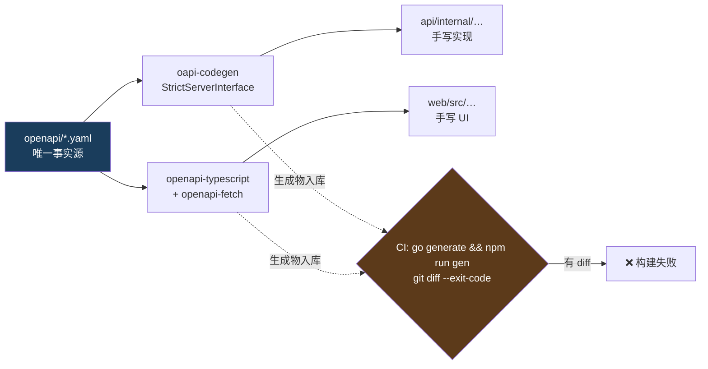
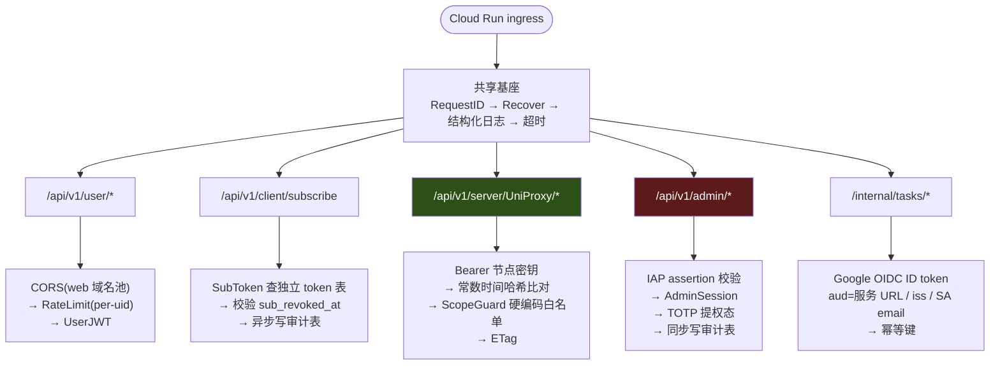

# 0006 · 裁决：API 用 Go + net/http/chi + sqlc/pgx，OpenAPI spec 作唯一契约源

> 日期：2026-08-16 · 性质：**架构裁决** · 状态：**执行中**（2026-08-30 订正；原状态「设计稿 v1，待实施」，2026-08-16）
> 落地范围：§1 裁决的整套栈**已经在 Cloud Run 上跑着**，不再是「待实施」——
> `api/go.mod` 里 `github.com/go-chi/chi/v5 v5.3.1` + `github.com/jackc/pgx/v5 v5.10.0` +
> `github.com/oapi-codegen/runtime v1.7.0`；`openapi/openapi.yaml` 是唯一契约源，
> `api/internal/gen/` 与 `web/shared/api/` 两处生成物入库、CI 用 `git diff --exit-code` 卡漂移；
> sqlc 生成 **194 条**查询（`grep -c '^-- name:' api/db/queries/*.sql` 与
> `api/db/gen/*.sql.go` 里的 SQL 常量数一致，2026-08-30 实数）；
> `bp-api` 自 2026-08-17 起在 `us-central1` 运行（[as-built-gcp §10.1](../02-architecture/as-built-gcp.md)）。
> **仍未实施的部分逐条留在 §15**，其中 §12 的「起真实 v2node 容器的契约测试」与真实 Postgres
> 集成测试**一个都还不存在**（[CONTRIBUTING §8](../../CONTRIBUTING.md) 同步登记）。
> ⚠️ **`执行中` 不等于「§1 八条全做完了」** —— 128 个 operation 里实现了 18 个，
> 其余 110 个 fail-closed 返 501（2026-08-30 实数），见
> [launch-readiness-review-20260830.md](../00-overview/launch-readiness-review-20260830.md) §2。
> 事实基线：Cloud Run 官方文档（image streaming / startup CPU boost / 计费模型）；
> pgx v5 官方 pkg.go.dev 文档；Prisma 官方博客（2025-01-30）；
> Cloudflare Python Workers 冷启动基准（含 Cloud Run 对照）；
> Guillaume Blaquière 的 Cloud Run 多语言冷启动测试（Google Cloud Community，2021-11-22）
> 证据口径：GCP / pgx / Prisma 官方文档 = 高；厂商对竞品的自测基准（Cloudflare、Encore）= **有利益冲突，标待核实**；
> 技术博客与聚合站 = 低，只用于定位问题不用于支撑裁决
> 关联：[system-design.md](../02-architecture/system-design.md) §4、§5、§9；
> [panels-and-market.md](../01-research/panels-and-market.md) §6.5、§6.6；
> [0003 托管选型](0003-web-hosting-and-reachability.md) §4（跨境性能的客观下限）
> ⚠️ 本裁决**依赖但不等待** `0005`（数据库选型，待写）。§8 说明为什么四个主流 DB 候选都不改变本裁决。

---

## 1 · 裁决

**先说最重要的一句：API 的性能不是这个产品的瓶颈，跨境网络才是。**
[ADR 0003](0003-web-hosting-and-reachability.md) §4 引用的 POMACS 2020 结论是「**超过 70% 的收发对每天有 5 小时以上速度低于 1 Mbps**」。
在这个量级面前，Go 与 Python 之间几十毫秒的差别对用户是不可见的。
因此选型的第一目标是**少出错、易排障、与节点生态同语言**，不是「最快」。

据此裁决八条：

1. **语言选 Go**（`pgx` 要求 Go 1.25+，以此为下限）。
   Node/TypeScript 是唯一有实质竞争力的备选，落选理由见 §5。
2. **HTTP 层用标准库 `net/http` + `chi` 做路由分组与中间件链**，
   不引入 gin / echo / fiber。理由见 §7。
3. **数据访问用 `pgx/v5` + `pgxpool` + `sqlc`，不引入 ORM。** 理由见 §8。
4. **契约用 OpenAPI 3.1，spec-first。**
   Go 侧由 `oapi-codegen` 生成 strict server interface（未实现即编译失败），
   TS 侧由 `openapi-typescript` + `openapi-fetch` 生成类型与客户端。
   CI 用 `git diff --exit-code` 卡生成物漂移。理由见 §9。
5. **`/api/v1/server/UniProxy/*` 单独一份冻结 spec**，标注为「兼容目标，非我们的设计」，
   并配一个跑真实 v2node 容器的契约测试。
6. **五条鉴权路径用五条互不共享的中间件链**，禁止「一个全局 auth 中间件 + if 分支」。见 §10。
7. **单仓（monorepo），但分开部署。** Cloud Build 用路径过滤触发两条独立流水线。见 §13。
8. **金额与流量一律 `int64`（DB 侧 `bigint`），Go 代码里禁止 `float32/float64` 参与金额与配额计算**，
   用 `go vet` 自定义检查或 code review 约束。

---

## 2 · 候选对比

| 维度 | **Go**（net/http+chi） | Node/TS（Hono） | Python（FastAPI） | Rust（Axum） | PHP（Laravel） |
|---|---|---|---|---|---|
| Cloud Run 冷启动方向 | 最优档 | 次优档 | 最差档 | 最优档 | ❌ 已排除 |
| 冷启动**实测值** | **需实测** | **需实测** | 3.069 s（竞品自测，待核实）| **需实测** | — |
| 常驻内存量级 | 十几 MB 起 | 数十 MB 起 | 数十–上百 MB | 十几 MB 起 | 常驻进程模型 |
| 部署产物 | **静态单二进制** | node + node_modules | 解释器 + wheels | 静态单二进制 | FPM/Octane 常驻 |
| Postgres 驱动 | pgx v5（成熟） | pg / postgres.js（成熟） | asyncpg（成熟） | sqlx / tokio-postgres | PDO |
| 官方 Cloud SQL Connector | ✅ | ✅ | ✅ | ❌ **无** | ❌ 无 |
| 编译期类型保障 | ✅ | ✅（tsc） | ❌（Pydantic 是运行时） | ✅（最强） | ❌ |
| int64 金额表达 | ✅ 原生 `int64` | ⚠️ 三种表示混用（见 §5.2） | ✅ 原生 int | ✅ 原生 i64 | ⚠️ |
| **与节点端同语言** | ✅ **v2node/xray-core/sing-box/mihomo 全是 Go** | ❌ | ❌ | ❌ | ❌ |
| 与 Web 前端共享类型 | ❌ 靠生成 | ✅ 可直接共享 | ❌ 靠生成 | ❌ 靠生成 | ❌ |
| 写完 P1 的工期 | 中 | **最快** | 快 | **最慢** | — |
| 判定 | ✅ **主选** | ⚠️ 唯一实质备选 | ❌ | ❌ | ❌ 已由既有裁决排除 |

**决定性的一格是「与节点端同语言」。** 见 §5.1。

---

## 3 · 冷启动：证据，以及为什么它不是主要理由

任务书要求给出「Cloud Run 冷启动实测数据」。**诚实的答案是：找不到一份 2026 年的、逐语言的、方法公开的 Cloud Run 冷启动基准。** 以下是能拿到的全部，按证据强度排列。

### 3.1 官方能确认的两条（高）

| 事实 | 出处 |
|---|---|
| Cloud Run 有 **startup CPU boost**：启动期间及开始服务后的**前 10 秒** CPU 翻倍（1 vCPU → 2 vCPU），部分工作负载启动时间**减半** | [Cloud Run configuring/services/cpu](https://docs.cloud.google.com/run/docs/configuring/services/cpu) |
| 执行环境 **gen1（gVisor）冷启动快于 gen2（microVM）** | [Cloud Run execution-environments](https://docs.cloud.google.com/run/docs/configuring/execution-environments) |

> 落地要求：**开启 startup CPU boost，且不切 gen2**（我们不需要 gen2 的完整 Linux 兼容性与 NFS 挂载）。

### 3.2 二手数据（中 / 待核实）

| 数据 | 出处 | 问题 |
|---|---|---|
| Cloud Run 上 Python 导入 `httpx + fastapi + pydantic` 的**冷启动均值 3.069 s**（对照：Cloudflare Workers 1.027 s、AWS Lambda 无 SnapStart 2.502 s）| [Cloudflare 博客](https://blog.cloudflare.com/python-workers-advancements/) | **竞品自测，有利益冲突**。方法论仅说「加载三个常用包」，未公布 Cloud Run 的内存/CPU/区域配置 |
| Cloud Run（us-central1，2 GiB / 1 vCPU，Fibonacci(1)，部署后首请求 ×3）：**Go 最快 > Node 次之 > Python 慢 > Java > 1.5 s** | [Blaquière, Google Cloud Community, 2021-11-22](https://medium.com/google-cloud/serverless-performance-comparison-does-the-language-matter-c72a7191c799) | **2021 年数据**，且只给了序，没给数值 |
| Node 框架**初始化**耗时：Express 41.8 ms / Fastify 142.3 ms / NestJS 143.7 ms（10 端点 + schema 校验，取 5 次最好值）| [Encore 博客](https://encore.dev/blog/cold-starts) | **厂商自测**；且这是**框架初始化**，不含 Node 运行时启动，更不是 Cloud Run 平台冷启动。**不能直接当冷启动读** |

**这三条只能支撑一个排序，不能支撑一个数字。** 因此本 ADR 不把任何冷启动数值写进理由，只保留方向性判断。

### 3.3 我们自己的场景：节点轮询是天然保温器

这一节是本 ADR 最反直觉的部分，必须写清楚，否则「Go 冷启动快」会被误当成决定性理由。

按 [system-design.md](../02-architecture/system-design.md) §5.1，每个节点每 60 秒要打 `/config`、`/user`、`/push`、`/alive` 四类请求
（**「4 次/60 秒」是假设，需读 v2node 源码核实**）：

| 节点数 | 请求间隔（平均） | 月请求数 | 对照 Cloud Run request-based 免费额度 200 万/月 |
|---|---|---|---|
| 2 | 每 **7.5 秒**一个 | 345,600 | 17% |
| 10 | 每 **1.5 秒**一个 | 1,728,000 | **86%** |
| 20 | 每 **0.75 秒**一个 | 3,456,000 | **173%，超出** |

算式：`节点数 × 4 × 1440 分钟/天 × 30 天`。

两个推论，方向相反：

1. **哪怕只有 2 个节点，服务也每 7.5 秒收到一个请求 —— 实例基本不会缩到零。**
   冷启动因此主要发生在**部署时**与**扩容时**，不是常态。
   这直接削弱了「冷启动」作为选型理由的分量。
   > ⚠️ 但这不是保证。Cloud Run 官方立场是空闲实例（**包括 min-instances 保温的**）**可能随时被关停**，
   > 见 [panels-and-market.md](../01-research/panels-and-market.md) §6.3 引用的计费文档。
2. **节点轮询本身就接近免费额度上限。** 10 个节点吃掉 86% 的请求配额，
   而这些请求里绝大多数应该返回 304 —— **ETag 不是优化，是让这个账算得平的前提**（见 §11）。

### 3.4 稳态 CPU 成本：语言选型在我们的规模上不构成差异

粗估（**全部是假设值，需实测**）：

| 假设 | 月 vCPU-秒（10 节点 = 1.728M 请求） | 对照免费额度 180,000 vCPU-s |
|---|---|---|
| Go 单请求 3 ms CPU | 5,184 | 2.9% |
| Python 单请求 25 ms CPU | 43,200 | 24% |

**两者都在免费额度内。** 即：在本项目的规模上，
**语言选型不影响 Cloud Run 的稳态计算账单**。谁再拿「Go 更省 CPU」当理由，就是在为一个不存在的问题优化。

> Cloud Run 费率（$0.000024/vCPU-s、$0.0000025/GiB-s、免费额度 200 万请求 + 180K vCPU-s + 360K GiB-s）
> 来自二手汇总页，**未逐项核对 GCP 官方定价页，标待核实**；且未确认 `asia-east2` 与 `us-central1` 的费率差。

---

## 4 · 镜像体积：Cloud Run 上的反直觉结论

任务书问「容器镜像体积对冷启动的影响」。**官方答案是：没有影响。**

> "Because of Cloud Run's container image streaming technology, the size of your container image
> **does not affect** container startup times or request processing time."
> — [Cloud Run · General development tips](https://docs.cloud.google.com/run/docs/tips/general)

同一机制还意味着**镜像体积不计入实例可用内存**。
非官方的 [cloud-run-faq](https://github.com/ahmetb/cloud-run-faq)（作者为前 Cloud Run 团队成员）措辞一致：冷启动延迟「independent of the image size」。

**所以「Go 镜像小」不是选 Go 的理由。** 但小镜像仍有三条与冷启动无关的价值，这才是我们要它的原因：

1. **供应链攻击面**：`FROM scratch` / distroless 的 Go 镜像里没有 shell、没有包管理器、没有 CVE 扫描噪音。
   Node 镜像带 `node_modules`，Python 镜像带解释器与 wheels，**两者的 CVE 告警量是数量级差别**（**需实测**：跑一次 `gcloud artifacts docker images scan` 对比）。
2. **Artifact Registry 存储与跨区拉取成本**（金额很小，不构成理由）。
3. **构建时间**，影响的是我们的迭代速度不是用户。

各候选的典型镜像体积（**量级估计，非实测，需在 P1 用真实镜像核对**）：

| 候选 | 基础镜像 | 典型压缩后体积（量级） |
|---|---|---|
| Go | `gcr.io/distroless/static` 或 `scratch` | **十几 MB** |
| Rust | 同上 | 十几 MB |
| Node | `node:*-slim` / distroless nodejs | 上百 MB |
| Python | `python:*-slim` | 上百 MB |

---

## 5 · 为什么不是 Node/TypeScript

**Node/TS 是唯一有实质竞争力的备选**，它的优势是真实的，必须先如实列出：

- **Hono 的运行时开销极低**，且能同时跑在 Node、Bun、Workers 上（若将来要把部分只读端点挪到边缘，这是唯一现成的路）。
- **与 Web 前端同语言**：类型可以**直接共享**而不是「生成」，这消灭了 §9 全部的漂移风险。
- **Prisma 的历史包袱已解决**：Prisma 官方博客（2025-01-30）确认去掉 Rust query engine 改用 TypeScript/WASM query compiler 后，
  bundle 从 **14 MB（gzip 7 MB）降到 1.6 MB（gzip 600 KB）**，约 85–90% 缩减，v6.16+ 生产可用。
  > 网上流传的「冷启动改善最多 9×」「Vercel/CF Workers 上 ~800 ms → <100 ms」来自第三方博客，**待核实**。
  > 但即使打折，「Prisma 冷启动是硬伤」这个 2023 年的说法**在 2026 年已经过期**，不能再用它当排除理由。
- Drizzle 的类型推导在不引入 codegen 的前提下就能给到编译期保障。

落选理由三条，按分量排序。

### 5.1 决定性理由：我们要读的所有参考实现都是 Go

| 我们必须打交道的代码 | 语言 | 我们要用它做什么 |
|---|---|---|
| **v2node**（`wyx2685/v2node`，MPL-2.0） | **Go** | 节点端。UniProxy 契约的另一半就是它的源码 |
| **Xray-core**（`xtls/xray-core`） | **Go** | REALITY 配置字段的真相来源。[system-design.md](../02-architecture/system-design.md) §3.2 记录了 `clients→users` / `dest→target` / `publicKey→password` 的**静默别名** —— 写错不报错，只能读源码确认 |
| **sing-box** | **Go** | sing-box 订阅 JSON 的字段兼容性 |
| **mihomo** | **Go** | Clash YAML 的字段兼容性。且 §3.2 记录了它已放弃与 Xray ≥ v26.7.11 的 REALITY 兼容 |

[panels-and-market.md](../01-research/panels-and-market.md) §6.7 把订阅格式适配称作「纯体力活」，
并指出各客户端字段兼容性是**靠三年 issue 磨出来的**。这意味着我们会**反复**回去读 mihomo / sing-box 的 Go 结构体定义。

> **面板端用 Go，意味着"对着源码核字段"和"写我们自己的适配器"发生在同一个语言、同一个 IDE、同一套类型系统里。
> 甚至可以在契约测试里直接 `import` sing-box 的配置结构体来验证我们生成的 JSON 能被反序列化。**
> 这在 TS 里做不到 —— 只能靠人眼比对，而人眼比对正是 §3.2 那三个静默别名会咬人的地方。

这一条不是「Go 更好」，是**「Go 和这个具体项目的周边更好」**。换个项目它就不成立。

### 5.2 int64 在 JavaScript 里没有单一表示

我们的硬约束是「金额一律 integer 存分」「流量报原始字节」。在 JS 里同一个 `bigint` 会有三种表示：

| 表示 | 来自哪里 | 风险 |
|---|---|---|
| `string` | `node-postgres` 默认把 `int8` 解析为 string 以避免精度丢失（**待核实其在 Drizzle 下的默认映射**） | `"100" + 50 === "10050"` —— **静默算错，不抛异常** |
| `number` | 显式 `parseInt` 或 ORM 配 `mode:'number'` | 超过 `Number.MAX_SAFE_INTEGER` 静默丢精度 |
| `bigint` | ORM 配 `mode:'bigint'` | `JSON.stringify` 直接抛 `TypeError`，必须手写 replacer；且不能与 `number` 混算 |

**先把风险量化，别夸大：** `Number.MAX_SAFE_INTEGER = 2^53-1 = 9,007,199,254,740,991 ≈ 9.007×10^15`。
- 金额存分：上限 ≈ **9×10^13 元**，永远溢不了。
- 流量字节：上限 ≈ **9 PB**（十进制）/ **8 PiB**，单用户永远溢不了。

**所以真正的风险不是溢出，是三种表示在代码里混用导致的静默错误** —— 尤其是字符串拼接冒充加法。
Go 里 `int64` 就是 `int64`，`pgx` 直接映射，`encoding/json` 直接序列化，这个错误类别**不存在**。

> 这条论据的正确分量：**它是一个持续性的纪律成本，不是一个会炸的定时炸弹。**
> 如果最终选了 Node，缓解手段是全程 `mode:'bigint'` + 自定义 JSON serializer + lint 规则禁止 `+` 用于金额字段。可行，但要一直守。

### 5.3 单线程事件循环 vs 我们的 CPU 热点

订阅下发要为每个用户生成 Clash YAML / sing-box JSON（序列化 + 模板渲染），
UniProxy 鉴权要做密钥哈希比对。Cloud Run 默认单实例并发 80，
**Node 的单事件循环里一个慢序列化会阻塞其余 79 个请求**，Go 的 goroutine 不会。

> ⚠️ **这条论据未经实测，强度低。** 实际上订阅生成大概率在毫秒级，够不上阻塞。
> 写在这里是为了记录它被考虑过并被判定为**次要**，而不是拿它当理由。

---

## 6 · 为什么不是 Python / Rust / PHP

### 6.1 Python（FastAPI / Litestar）

FastAPI 的开发速度是真实优势，`asyncpg` 也成熟。但三条否决：

1. **冷启动最差档。** §3.2 的 Cloudflare 数据（3.069 s，待核实）与 Blaquière 2021 的排序方向一致。
   考虑到 §3.3「轮询保温」的存在，这条不致命，但它是**唯一一个所有来源都指向同一方向**的性能差异。
2. **类型保障只在运行时。** Pydantic 校验的是入参出参边界，
   业务代码内部（订单状态机、折抵计算、配额判定）拿不到任何编译期保障。
   我们的核心逻辑几乎全是「整数金额 + 状态迁移」，**这正是编译期类型收益最高的形状**。
3. Litestar 在合成基准上快于 FastAPI（msgspec vs Pydantic v2），
   但社区规模与生态成熟度差一截；而**换掉框架解决不了第 1、2 条**（瓶颈是解释器导入与语言本身）。

### 6.2 Rust（Axum）

冷启动与内存最优（第三方报告 AWS Lambda arm64 上低至 16 ms，**待核实且非 Cloud Run**）。但：

1. **Google 官方 Cloud SQL Language Connectors 覆盖 Go / Java / Python / Node.js，不含 Rust。**
   Rust 只能走 Cloud Run 内建的 Unix socket 挂载或自建 Auth Proxy sidecar —— 可行，但少一层官方支持。
2. **`sqlx` 的编译期查询校验需要构建期能连到数据库**（或维护 offline query cache），CI 复杂度显著上升。
3. **开发速度代价换不回来。** P1 要交付：五张主表 + UniProxy 六个端点 + 订单状态机 + 折抵计算 + 11 个订阅格式适配器。
   Rust 在这个形状的工作上没有任何加速，只有减速。
4. 回到 §1 的第一句：**省下的几十毫秒冷启动，在一个每天有 5 小时低于 1 Mbps 的跨境链路面前，边际收益接近零。**

> 保留的可能性：若第二阶段出现真实的 CPU 瓶颈（例如订阅生成量级上来），
> **可以局部改写某个服务，不需要整体重选**。Go 与 Rust 都产出静态二进制，Cloud Run 侧无差别。

### 6.3 PHP（Laravel）

已由 [panels-and-market.md](../01-research/panels-and-market.md) §6.3 第 2/5/6/9 条与
[system-design.md](../02-architecture/system-design.md) §4 裁定排除，本 ADR 不重复论证。
只补一条本 ADR 视角的总结：**Octane / Horizon / workerman 三者的价值全部建立在「进程常驻」之上，
而 Cloud Run 的价值全部建立在「可以缩到零」之上。这两个前提无法同时成立。**

---

## 7 · 框架层：为什么是 net/http + chi

Go 1.22 起，标准库 `http.ServeMux` 已支持**方法匹配与路径通配**（`mux.Handle("GET /users/{id}", h)`），
官方博客明确「for new work the standard library is recommended」
（[go.dev/blog/routing-enhancements](https://go.dev/blog/routing-enhancements)）。
所以问题不是「选哪个框架」，而是「标准库之外还缺什么」。

**缺的只有两样：子路由分组 + 中间件链。** 而这两样恰好是 §10 的五条鉴权分支所必需的。

| 候选 | 判定 | 理由 |
|---|---|---|
| 纯 `net/http` | ⚠️ 可行但要手写分组 | 五条中间件链手工组合，重复代码多 |
| **`chi`** | ✅ **选中** | **100% `net/http` 兼容** —— `chi.Router` 的处理器就是 `http.Handler`。这意味着 `oapi-codegen` 的 chi-server 模板、`otelhttp`、任何标准中间件都直接可用；**将来要撤掉 chi 只需删几行** |
| `gin` | ❌ | 社区最大，但有自己的 `*gin.Context` 抽象，标准 `net/http` 中间件需适配层。为了「社区大」引入一层不可逆的抽象，不划算 |
| `echo` | ❌ | 同上 |
| `fiber` | ❌ **硬排除** | 基于 `fasthttp`，**不兼容 `net/http` 中间件生态**，且 HTTP/2 支持受限。Cloud Run 前端到容器默认走 HTTP/1.1，但要用 HTTP/2 端到端时它是死路。为一个我们不需要的吞吐数字放弃整个标准库生态，是最差的交易 |

> **原则**：这一层要选**可撤销**的依赖。chi 可撤销，fiber 不可撤销。

---

## 8 · 数据访问：sqlc + pgx，不用 ORM

### 8.1 决定性理由：我们的 schema 是抄来的，不是推导出来的

[panels-and-market.md](../01-research/panels-and-market.md) §6.1 的裁决是
「**严格照抄 Xboard 的数据模型**」。这句话决定了数据访问层的方向：

| 工具 | 事实源方向 | 与我们的处境 |
|---|---|---|
| Prisma（`schema.prisma`）/ Drizzle（TS schema） | **代码 → DDL** | ❌ **方向反了**。我们已经有 DDL（抄来的），要把它再翻译成 TS schema，翻译错了不会有人发现 |
| SQLAlchemy / GORM（模型类 → 迁移） | **代码 → DDL** | ❌ 同上 |
| **sqlc** | **DDL + SQL → 代码** | ✅ **方向对**。DDL 是输入不是输出，SQL 是输入不是输出，生成的 Go 结构体是产物 |

**sqlc 读 `db/migrations/*.sql` 与 `db/queries/*.sql`，生成类型安全的 Go 代码。**
写错列名、类型不匹配、参数个数不对 —— 全部在 `sqlc generate` 或 `go build` 阶段失败。

附带收益：[system-design.md](../02-architecture/system-design.md) §6 的性能要点
（流量不落明细、只累加与聚合、热字段拆表）**全部是 SQL 层的设计**。
ORM 会在这些地方生成我们没打算写的查询；直接写 SQL 则一眼可审。

### 8.2 pgx 的两个必须知道的行为（官方文档，高）

| 事实 | 影响 |
|---|---|
| `pgx` **默认自动预编译并缓存语句**（`StatementCacheCapacity` 默认 512），而**预编译语句与 PgBouncer 不兼容** | 若 `0005` 选了带 PgBouncer 风格 transaction pooling 的方案（Supabase pooler、自建 PgBouncer），**必须**把 `ConnConfig.DefaultQueryExecMode` 设为 `QueryExecModeExec` 或 `QueryExecModeSimpleProtocol`，否则**运行时报错** |
| `*pgx.Conn` **不是并发安全的**，并发访问必须用 `pgxpool` | Cloud Run 单实例并发默认 80 → 必然多 goroutine → **必须用 `pgxpool`**，且池大小要按「实例数 × 每实例池大小 ≤ DB 最大连接数」倒算 |

> ⚠️ **第二条是 serverless + Postgres 的经典事故**：Cloud Run 自动扩容到 N 个实例，
> 每个实例开 M 条连接，`N×M` 轻易打爆 Cloud SQL 的连接上限。
> **缓解手段（连接池上限、`max-instances` 硬上限、外部 pooler）属于 `0005` 的范围**，但选型时必须知道它存在。

### 8.3 数据库选型不改变本裁决

`0005` 尚未写。逐个候选检查是否会推翻 §1：

| DB 候选 | Go 侧可用性 | 是否影响本裁决 |
|---|---|---|
| Cloud SQL for PostgreSQL | ✅ `cloud.google.com/go/cloudsqlconn`（官方，支持自动 IAM DB AuthN）；或 Cloud Run 内建 Unix socket | 否 |
| Neon / 其他 serverless Postgres | ✅ 标准 TCP 连 pooler。其 HTTP/WebSocket driver 是 TS-only，但那是为**没有 TCP 的 edge runtime** 准备的 —— **Cloud Run 有 TCP，用不到** | 否（见 §14.6） |
| Supabase | ✅ 标准 Postgres 连接；注意 §8.2 的 pooler 事项 | 否 |
| 自建 Postgres on GCE | ✅ 私有 IP + VPC connector | 否 |

**四个候选都是 Postgres，`pgx` 全覆盖。** 唯一会被 DB 选型影响的是 §8.2 的 `DefaultQueryExecMode` 设置。

---

## 9 · 契约：OpenAPI 3.1，spec-first

### 9.1 为什么是 spec-first 而不是 code-first

| 方案 | 契约事实源 | 前端类型 | 漂移防护 | 判定 |
|---|---|---|---|---|
| **tRPC** | TS 类型 | 直接推导，零漂移 | 编译期 | ❌ **要求两端同为 TS**。且节点端（Go）与将来任何非 TS 消费者都用不了 |
| gRPC / Connect | `.proto` | 生成 | 编译期 | ❌ **UniProxy v1 是既定的 JSON over HTTP，不能换协议**；浏览器侧还要额外一层 |
| OpenAPI code-first（Huma） | **Go 代码** | 从生成的 spec 再生成 | 单向，构造上不会漂 | ⚠️ 备选，见下 |
| **OpenAPI spec-first（oapi-codegen）** | **YAML** | `openapi-typescript` | 双向，CI 卡 | ✅ **主选** |

**决定性理由：`/api/v1/server/UniProxy/*` 不是我们设计的，是我们要兼容的。**

一个「兼容目标」天然应该以**外部可读的规格文件**存在，而不是从我们的 Go 代码里反推出来。
把 UniProxy 写成一份冻结的 `uniproxy-v1.yaml`，意味着：

- 它可以被人直接对照 v2node 源码逐字段审查；
- 我们**改不动它**（改了就是破坏兼容），spec 文件是这条纪律的物理载体；
- 将来若节点端换实现，这份 spec 就是验收标准。

> Huma 的 code-first 有一个真实优势：**spec 由代码派生，构造上不可能漂移。**
> 我们放弃它，换的是「UniProxy 契约有一份不由我们代码决定的独立表述」。
> **若后续发现 spec-first 的 CI 纪律守不住（见 §14.2），改用 Huma 是一条合理的退路，且不影响本 ADR 的其他七条。**

### 9.2 具体流水线



三条硬约束：

1. **生成物入库**（不是构建期生成）。理由：代码审查时能看见契约变化，而不是只看见 YAML 变化。
2. **CI 重新生成并 `git diff --exit-code`。** 这是唯一的漂移防线。
3. **Go 侧必须用 `StrictServerInterface`**（而非普通 ServerInterface）——
   spec 里加一个端点、改一个必填字段，**不实现就编译不过**。
   用非 strict 版本的话漂移会退化成运行时 404，这条防线就废了。

---

## 10 · 鉴权：五条互不共享的中间件链

### 10.1 路由拓扑



### 10.2 逐条规格

| 路由前缀 | 调用方 | 凭据 | 失败响应 | 来源约束 |
|---|---|---|---|---|
| `/api/v1/user/*` | 用户面板 SPA | 短期 access JWT + refresh | `401` | CORS 只允许 Web 域名池 |
| `/api/v1/client/subscribe` | Clash/sing-box 客户端 | 订阅 token（独立表，可命名可单独吊销） | **`404`**（不泄露 token 是否存在） | 每次拉取写审计表 |
| `/api/v1/server/UniProxy/*` | 节点（v2node） | `Authorization: Bearer <每节点独立密钥>`，DB 存**哈希** | `401` | scope 白名单 |
| `/api/v1/admin/*` | 后台 SPA | IAP assertion + 会话 + **强制 TOTP** | `403` | 独立域名 + IP 白名单/IAP |
| `/internal/tasks/*` | Cloud Tasks / Pub-Sub push | Google 签发的 **OIDC ID token** | `403` | 校验 `aud` = 服务 URL、`iss`、`email` = 指定 SA |

### 10.3 三条不许违反的实现规则

1. **禁止「一个全局 auth 中间件 + 身份类型 if 分支」。**
   这正是 Xboard 的病灶（见 [panels-and-market.md](../01-research/panels-and-market.md) §6.6）：
   一个中间件同时判断多种身份，**每加一条分支都可能给节点密钥开一条通往管理 API 的路**。
   五条链在 chi 里各自 `r.Route(prefix, func(r chi.Router){ r.Use(...) })`，**共享的只有基座那四个**。
2. **scope 白名单必须是硬编码的路由允许表**（照抄 3x-ui 的做法），
   **不是**从 DB 读出来的字符串做前缀比对。字符串比对的 scope 是可以被路径构造绕过的。
3. **`/internal/tasks/*` 的保护是 OIDC，不是路径保密。**
   它和公网端点在同一个 Cloud Run service（这是「不要常驻 worker」的直接后果），
   **路径不是秘密，token 才是**。同时要拒绝 `X-Cloud-Trace` 之类可伪造头做判据。

---

## 11 · ETag + 304 的实现约束

[system-design.md](../02-architecture/system-design.md) §5.1 写了「ETag 是性能命门」。
但**怎么算这个 ETag 决定了它有没有用**，这一点必须在 ADR 里定死，否则会被实现成一个没有收益的版本。

### 11.1 反模式：先构建响应体再哈希

```
❌ 查 DB → 拼出完整用户列表 JSON → sha256(body) → 比对 If-None-Match → 返 304
```

**这样 DB 已经被查过了。** 304 省下的只有出网带宽，而 §3.3 的算术说明我们要省的是 DB 查询。

### 11.2 正确做法：版本号驱动

```
✅ SELECT config_rev, user_rev FROM node_rev WHERE node_id = $1   ← 一次主键查询
   → ETag = W/"<node_id>-<config_rev>-<user_rev>"
   → 命中 If-None-Match 直接 304，不查用户表
```

由此产生**三条对 `0005` DDL 的硬要求**（必须写进数据模型，否则 ETag 无法正确实现）：

1. 存在一张 `node_rev`（或等价的列），主键为 `node_id`，含 `config_rev`、`user_rev` 两个单调递增计数。
2. **凡是会改变该节点可见用户集合或其密钥的写操作，必须 bump 对应的 `user_rev`**：
   开通 / 到期 / 封禁 / 换订阅密钥 / 改套餐 / 改节点分组。**漏一处 = 节点永远拿到旧用户表。**
3. 流量累加**不得** bump `user_rev`（否则每 60 秒都会失效，ETag 归零）。

### 11.3 HTTP 层细节

- `If-None-Match` 用**弱比较**（RFC 9110 §8.8.3.2），弱验证器前缀 `W/` 参与匹配逻辑但不参与字节比较。
- 304 响应**必须**回带 `ETag`，并带 `Cache-Control: no-cache`（要求每次都回源验证，而不是直接用缓存）。
- Go 侧手写比对，**不要用 `http.ServeContent`**（它是为文件设计的，会引入 `Last-Modified` 与 Range 语义）。

### 11.4 🔴 最高优先级的前置验证

> **必须先确认 v2node 到底发不发 `If-None-Match`。**
> 若它不发，上述全部设计**一行都不生效**，ETag 是纯摆设，我们必须改用别的降载手段
> （拉长轮询间隔、或在 `/user` 上加增量游标）。
> 这是 §15 清单里唯一一条「不验证就不能动工」的。

---

## 12 · 测试

| 层 | 方案 | 说明 |
|---|---|---|
| 单元 | 标准 `testing` + `testify/require` | Go 不需要测试框架 |
| **DB 集成** | **`testcontainers-go` 起真实 Postgres** | 版本与生产对齐。**不用 sqlite/mock** —— 我们大量依赖 Postgres 特有语义（`timestamptz`、`bigint`、部分索引） |
| DB 隔离 | 建一个 template database，每个测试 `CREATE DATABASE … TEMPLATE …` | 比每测起一个容器快得多。Postgres 容器启动约 3 秒（**第三方数据，待核实**），只能付一次 |
| **UniProxy 契约** | **起真实 v2node 容器**，指向测试中的 API，断言它拉到配置、生成 Xray 配置、正常上报流量 | **这是本项目唯一能证明「抄对了」的测试。** 没有它，UniProxy 兼容性只是我们的一厢情愿 |
| 订阅格式 | golden file：固定输入 → 生成 Clash YAML / sing-box JSON，与 golden 比对 | 加分做法：直接 `import` sing-box 的配置结构体反序列化我们的输出（§5.1 的收益） |
| 前端契约 | spec 生成 TS 类型 + CI `git diff --exit-code`（§9.2） | — |
| 幂等 | 支付回调、Cloud Tasks 回调重复投递的表驱动测试 | Cloud Tasks 是 **at-least-once**，重复投递是常态不是异常 |

> golden file 有一个测不出来的东西：**真实客户端能不能加载**。
> 约定：每次改订阅格式，人工用 Clash Verge Rev / sing-box 各加载一次 golden 输出。这条无法自动化。

---

## 13 · 仓库结构与部署

**单仓，分开部署。**

```
babel-plus/
  openapi/
    user-api.yaml
    admin-api.yaml
    uniproxy-v1.yaml        # 冻结：兼容目标，非我们的设计
  api/                      # Go → Cloud Run (bp-api)
    cmd/bp-api/
    internal/{auth,uniproxy,subscribe,billing,store}/
    gen/                    # oapi-codegen 输出，禁止手改
    db/{migrations,queries}/  # sqlc 输入
  web/                      # TS SPA → 静态托管 (bp-web)
    src/api/generated/      # openapi-typescript 输出，禁止手改
  deploy/
  docs/
```

| 问题 | 裁决 | 理由 |
|---|---|---|
| 单仓还是多仓？ | **单仓** | 唯一跨边界的产物是 OpenAPI spec 与生成的 TS 类型。单仓让「改 spec → 两侧重新生成 → CI 卡漂移」**在一个 PR 里原子完成**。多仓需要发版一个类型 npm 包，对 1–2 人团队是净负担 |
| 类型定义共享吗？ | **不共享，只生成** | 语言不同（§5.1 的代价）。共享的是 spec，不是类型 |
| 单仓 = 单体部署吗？ | **不是** | Cloud Build 路径过滤：`api/**` 或 `openapi/**` → 触发 API 构建；`web/**` 或 `openapi/**` → 触发 Web 构建。**部署形态与 [product-brief.md](../00-overview/product-brief.md) §5.1 的硬要求一致** |
| 生成物入库吗？ | **入库** | Code review 时能看见契约变化本身 |

---

## 14 · 代价

> ⚠️ 这一选择的代价，必须留在记录里而不是被措辞掩盖：
>
> 1. **Go 的代码量比 TS/Python 多。** 五张主表 CRUD + 订单状态机 + 折抵计算 + 11 个订阅适配器，
>    粗估要多写 **30–50%** 的行数（**这是估计，不是实测**），主要来自显式错误处理。
>    换来的是把一整类错误挪到编译期。**若 P1 工期压力超过预期，这是第一个会被抱怨的地方。**
> 2. **前后端不同语言 = 类型只能生成，不能共享。**
>    整条防线就是 CI 里那一行 `git diff --exit-code`。
>    **一旦有人加了 `[skip ci]`、或本地忘记 `go generate` 而 CI 恰好被跳过，契约就静默漂移。**
>    这在「团队 1–2 人、CI 纪律靠自觉」时最脆弱 ——
>    **若发生过一次真实的契约漂移事故，应当认真考虑 §9.1 的 Huma 退路或整体转向 Node/TS。**
> 3. **Go 生态没有 Laravel 级别的「电池全包」。** 已知要自己拼的：
>    TOTP、JWT 签发与轮换、SMTP/邮件 API 客户端、USDT 链上确认、后台列表页的筛选与分页、
>    以及 [panels-and-market.md](../01-research/panels-and-market.md) §6.7 已经点名的 11 个订阅适配器。
>    **单个都是几百行，加起来是周级工作量，而且分散在 P1–P3 各处，很难被一次性估准。**
> 4. **`sqlc` 不做动态查询。** 后台的多条件筛选（按状态 × 套餐 × 关键字任意组合）
>    在 sqlc 里表达不出来，会退化成手写 pgx + 字符串拼接 ——
>    **而这正是 SQL 注入最容易出现的地方。**
>    强制约定：动态查询只允许用参数化 builder（如 `squirrel`），
>    **`fmt.Sprintf` 出现在 SQL 上下文里一律视为缺陷**，加 lint 规则拦。
> 5. **「冷启动」这条理由的证据强度只有中低。** §3.2 三个来源分别是 2021 年的、竞品自测的、和测错对象的。
>    **若 §15 的实测显示 Node(Hono) 与 Go 在 Cloud Run 上的冷启动差距在 100 ms 以内
>    （考虑到 §3.3 轮询保温，这完全可能），那么「冷启动」这条理由作废。**
>    此时裁决只剩「与节点生态同语言」（§5.1）与「int64 单一表示」（§5.2）两条支撑 ——
>    **这两条仍然成立且仍然足够，但论据强度下降一档，且第 1、3 条代价的相对分量随之上升。**
> 6. **若 `0005` 选了 Neon 之类以 TS 为一等公民的 serverless Postgres，
>    Go 侧只能走标准 TCP + pooler**，拿不到其 HTTP driver 的分支/自动挂起等便利。
>    在 Cloud Run（有 TCP、非 edge runtime）上这个损失很小，但它是真的。
> 7. **单仓意味着 API 与 Web 的 git 历史、issue、权限混在一起。**
>    若将来 Web 要外包或开源而 API 不能，拆仓的成本届时才付。

## 15 · 这次没有解决的

- [x] ~~🔴 **v2node 是否发送 `If-None-Match` 未验证。** 见 §11.4。
      不验证这一条，§11 的整套 ETag 设计与 §3.3 的降载算术全部悬空。
      **这是本 ADR 里唯一一条「不验证就不能动工」的前置项**，且它与语言选型无关，应立即做。~~
      ⚠️ **2026-08-30 订正：本条与下一条是同一件事的正反两遍**，从 2026-08-17 起就在同一节里
      并列写着「未验证」与「已解决：发」。原文保留不删（它是 2026-08-16 写下时的真实状态），
      **但结论以下一条为准**。留下这个矛盾的原因值得记一笔：解决它的人是**追加**了一条已勾选项，
      而没有回头把被推翻的那条划掉 —— 追加式更新保住了历史，却在同一节里留下了两个相反的现值。
- [x] ~~🔴 v2node 是否发送 `If-None-Match`（最高优先级未知）~~ —— **✅ 2026-08-17 已解决：发。**
      v2node 完整实现条件请求（发送 → 304 短路 → 保存新 ETag），ETag 降载设计成立。
      证据 [v2node-contract-20260817 §2](../evidence/v2node-contract-20260817/)。
      🔴 但浮现一个新约束：**v2node 默认超时 15 秒且只重试 1 次** ——
      `/user` 的 p99 必须远低于 15 秒，一次冷启动超时就会让该节点这轮拿不到用户列表。
- [ ] 🔴 **逐语言 Cloud Run 冷启动需实测。** 方法：同一个「hello + 一次 DB 主键查询」的服务，
      用 Go / Node(Hono) / Python(FastAPI) 各部署一个 Cloud Run service，
      同配置（1 vCPU / 512 MiB / gen1 / startup CPU boost 开），
      每次部署后测首请求延迟，重复 ≥20 次取 p50/p95。
      §14.5 说明了这个结果可能推翻哪条理由。证据落 `evidence/coldstart-cloudrun-YYYYMMDD/`。
- [ ] **节点轮询频率「4 次/60 秒」是假设**，需读 v2node 源码确认实际请求次数与间隔是否可配。
      §3.3 的整张表随这个数字缩放。
- [ ] **Cloud Run 费率与免费额度未对官方定价页逐项核对**（§3.4 脚注），
      且未确认 `asia-east2` 与 `us-central1` 的费率差 —— 这会与「API 部署在哪个区域」一起裁决。
- [ ] **API 的部署区域未定**：靠近 DB（降低查询 RTT）还是靠近节点（降低 UniProxy 轮询 RTT）？
      两者可能不在同一区。属于 `0005` 与部署裁决的交叉地带。
- [ ] **Cloud Run 并发数、`max-instances`、连接池上限三者的联合上限未算**（§8.2 的连接爆炸）。
      需要 DB 的最大连接数才能倒算，因此归 `0005`。
- [ ] **可观测性未设计**：结构化日志字段表、trace 传播（`otelhttp` → Cloud Trace）、
      以及 Cloud Logging 的成本模型（节点每 60 秒轮询会产生大量 304 日志，需要采样）。
- [ ] **迁移工具未选**（`golang-migrate` / `atlas` / 手工 SQL + 版本表）。
      与 `0005` 的 DB 选型耦合（例如 Neon 的分支能力会改变迁移策略），故不在本 ADR 裁决。
- [ ] **Web 前端框架未裁决**（React / Vue / Svelte）。本 ADR 只裁决了「TS 类型由 spec 生成」这一条接口。
- [ ] **后台是否用现成 admin 框架未定**（refine / react-admin 之类）。
      这会**反过来影响 admin API 的形状**（这类框架对列表分页与筛选参数有约定），
      因此 `openapi/admin-api.yaml` 应在前端框架定了之后再冻结。
- [ ] **Rust 未做任何实测。** 它的排除基于一条客观事实（无官方 Cloud SQL connector）
      与一条主观判断（开发速度）。若第二阶段出现真实 CPU 瓶颈，
      可局部改写单个服务而不必重开本裁决。
- [ ] **限流方案未定。** Cloud Run 多实例下的 per-uid 限流需要共享状态，
      而 [system-design.md](../02-architecture/system-design.md) §9 已记录「Redis 太贵」。
      候选：Postgres + TTL 表、Cloud Armor 边缘限流、或接受每实例独立限流。
