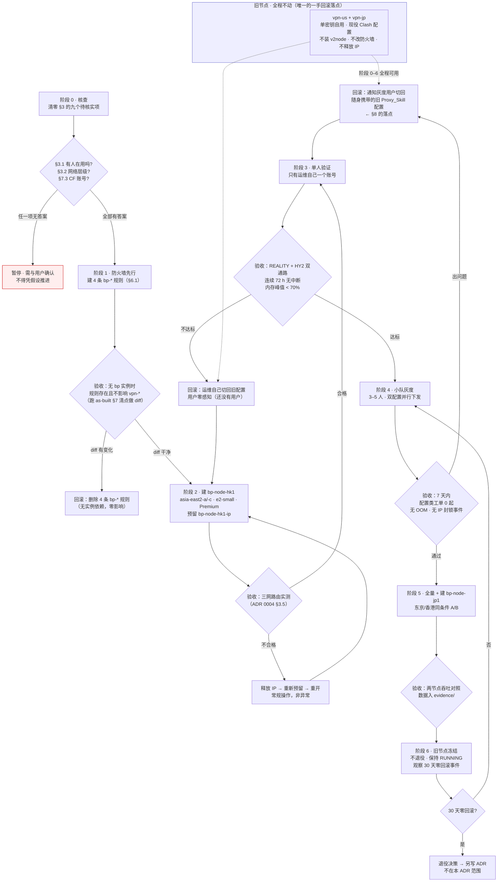

# 0007 · 裁决：新建 `bp-node-*` 为主力，`vpn-us`/`vpn-jp` 原封不动降级为回滚落点，不做原地改造

> 日期：2026-08-16 · 性质：**架构裁决** · 状态：**设计稿 v1，待实施**（2026-08-16）
> 事实基线：[as-built-gcp.md](../02-architecture/as-built-gcp.md)（2026-08-16 `gcloud` 实测快照）；
> [reference-repos.md](../01-research/reference-repos.md) §1.4–1.8（Proxy_Skill 一手实测）；
> [ADR 0004](0004-transport-hardening.md) §3.5–3.7；GCP 官方机型/网络层级/计费文档
> 证据口径：`gcloud` 快照 = 高；GCP 官方文档 = 高；Proxy_Skill 一手实测 = 高；
> **两台旧节点的机内状态一律标「待核实」，本文任何一处都不假设它们的运行情况**
> 关联：[0001](0001-cloudflare-tos-risk.md) §5.4（cloudflared 账号归属）、
> [0004](0004-transport-hardening.md)、[system-design.md](../02-architecture/system-design.md) §3.3、
> [runbook-node-health.md](../04-ops/runbook-node-health.md) §3.1（换 IP 流程）

---

## 1 · 裁决

**选 C（混合），但「混合」必须有精确定义，否则它会退化成「拖着不处置」。**

| # | 裁决 | 一句话理由 |
|---|---|---|
| 1 | **不在 `vpn-us` / `vpn-jp` 上安装 v2node，不接入面板，不改多租户，不改机型，不改防火墙** | 原地改造在**区域**这一维上物理不可能满足 [ADR 0004](0004-transport-hardening.md) §3.4（见 §2） |
| 2 | **新建 `bp-node-hk1`（`asia-east2-a` 或 `-c`，`e2-small`，Premium，新预留静态 IP）为主力** | ADR 0004 §3.6 已裁定香港为主；静态 IP 是**区域级资源**，跨区不可搬（见 §5） |
| 3 | **两个旧静态 IP（`vpn-us-ip-v4` / `vpn-jp-ip`）一律不释放、不迁移、不复用** | 释放是**单向门**；ADR 0004 §3.5 把「拿到哪个 IP」列为一等变量（见 §5.2） |
| 4 | **`vpn-jp` 角色重定义为「第一次切换的人工回滚落点」+「东京 vs 香港的路由对照组」** | §8 会说明：面向用户的回滚**只能**靠保留旧端点，不能靠改订阅 |
| 5 | **`vpn-us` 角色重定义为「与中国链路无关的带外管理落点」，不参与用户服务** | us-west1 对深圳的物理延迟下限 106.1 ms，是 ADR 0004 §3.6 表里最差的一格 |
| 6 | **新节点只打 `bp-node` 一个标签，并自建 4 条 `bp-*` 防火墙规则（含冗余的 443 放通）** | 不让我们的可用性依赖一条属于遗留系统、且已被建议收敛的无 tag 规则（见 §6） |
| 7 | **旧节点的退役不在本 ADR 范围内**，需 bp 侧连续 30 天零回滚事件后另行裁决 | 现在决定退役等于在没有数据的时候做不可逆决策 |

> **本裁决的一句话形态：把不可逆的决策（区域、IP、账号归属）一次做对，
> 把可逆的决策（机型、协议参数、用户分批）留给实测去调。**

**A（原地改造）被否决**，理由见 §2。**纯 B（新建并行、旧节点完全不管）不够**：
它没有给旧节点一个明确角色，结果是既付着钱又没人负责，
而且第一次切换出问题时没人记得旧配置还能用 —— 那正是回滚最需要它的时刻。

---

## 2 · 为什么不是 A：三件物理不可能，一件不可接受

### 2.1 区域改不了 —— 这一条单独就足以否决 A

GCE 实例的 **zone/region 是创建时确定且不可变更的属性**。
机型可以改（`stop` → `set-machine-type` → `start`，停机数十秒），区域不行 ——
换区域等于新建实例。而 [ADR 0004](0004-transport-hardening.md) §3.6 已裁定
**`asia-east2`（香港）为主力区域**，现有两台节点分别在 `us-west1` 与 `asia-northeast1`。

物理延迟下限对照（引自 ADR 0004 §3.6，大圆距离 ×2 ÷ 200,000 km/s，是**下限非实测**）：

| 出发地 | `asia-east2`（目标） | `asia-northeast1`（`vpn-jp` 所在） | `us-west1`（`vpn-us` 所在） |
|---|---|---|---|
| 深圳 | **0.3 ms** | 28.7 ms | 106.1 ms |
| 上海 | **12.3 ms** | 17.5 ms | 94.0 ms |
| 北京 | 19.7 ms | 20.9 ms | 89.2 ms |
| 成都 | **13.7 ms** | 33.4 ms | 103.9 ms |

也就是说：**原地改造的终点是一台位置错误的多租户节点**，我们迟早要再建一台香港的，
届时刚做完的多租户改造要在香港重做一遍 —— 等于把同一件事做两次，
中间还多了一次「改造已在用的节点」的风险敞口。

> 顺带一条 ADR 0004 §3.5 的落点：**新建时必须避开 `asia-east2-b`** ——
> 社区实测该 zone 绕道美国，而 `-a`/`-c` 直连（`shanyemangfu.com/route-of-gcp.html`，2019，**待核实**）。

### 2.2 静态 IP 搬不过去

保留外部 IP 是**区域级（regional）资源**。`vpn-jp-ip`（`34.104.192.233`，`asia-northeast1`）
在物理上无法挂到 `asia-east2` 的实例上。所谓「保留旧 IP 资产迁到新节点」这个选项**不存在**。

### 2.3 机型不够，且撞墙方式是 OOM 不是降速

详见 §4。要点：`e2-micro` 只有 **1 GB 内存**，而多租户下第一个撞墙的是
Hysteria2 的 **per-connection QUIC 接收窗口**，撞墙表现是内核 OOM killer 杀进程 ——
**全节点瞬时掉线**，而不是缓慢劣化。

### 2.4 不可接受的继承：来路不明的 cloudflared 隧道

[as-built §9](../02-architecture/as-built-gcp.md) 与 [ADR 0001 §5.4](0001-cloudflare-tos-risk.md)
都已记录：**现有 cloudflared 隧道挂在哪个 Cloudflare 账号下，至今未确认**。
原地改造意味着把一条账号归属未知、且按 ADR 0001 判定**违反 CF ToS** 的隧道，
直接带进我们的生产多租户节点。这不是技术问题，是风险继承问题（详见 §7）。

---

## 3 · 本文不假设的九件事（登机前必须清零）

> **这一节是本 ADR 的前置条件，不是附录。**
> `gcloud instances list` 只能证明两台机器在 RUNNING，
> **不能证明有人在用、也不能证明服务是健康的。**

### 3.1 🔴 有没有人正在用这两台节点 —— **需与用户确认**

**这是无法从 GCP 侧完全确认的事情。** as-built 是外部资产快照，
`RUNNING` 状态与「有活跃用户」之间没有推导关系。

非侵入的旁证（可以先跑，但**不能替代向用户确认**）：

```bash
P=oratis-491316

# ① 实例已连续运行多久（长期不重启 ≈ 有人依赖它，或纯粹没人管）
gcloud compute instances describe vpn-jp --project=$P --zone=asia-northeast1-a \
  --format="value(lastStartTimestamp,status,machineType,tags.items)"
gcloud compute instances describe vpn-us --project=$P --zone=us-west1-a \
  --format="value(lastStartTimestamp,status,machineType,tags.items)"

# ② 近 30 天出向流量 —— 唯一能量化「有没有人在用」的指标
#    指标：compute.googleapis.com/instance/network/sent_bytes_count
#    若当前 gcloud 版本无该子命令，改走 Console → Monitoring → Metrics Explorer，
#    或直接调 Monitoring API v3 projects/oratis-491316/timeSeries。   **待核实**（命令可用性）
gcloud monitoring time-series list --project=$P \
  --filter='metric.type="compute.googleapis.com/instance/network/sent_bytes_count"'
```

**判定口径（先约定好，避免事后自圆其说）**：
月出向 < 1 GB → 视为无人使用；> 20 GB → 视为有活跃用户，
**任何变更都必须走维护窗口并提前通知**。中间区间一律按「有人在用」处理。

> ⚠️ 本 ADR 的裁决**不依赖**这个答案 —— 因为我们选的是「完全不动」。
> 但**第 4 条裁决（`vpn-jp` 兼做路由对照组）依赖它**：
> 如果 `vpn-jp` 承载着不能中断的日常使用，就不能在它上面跑对照测试，
> 那一条要收回（见 §10 代价第 3 条）。

### 3.2 网络层级 —— as-built 未记录，**待核实**

[reference-repos §1.6](../01-research/reference-repos.md) 记载 Proxy_Skill「选 Premium Tier」，
但那是**文档里的意图**，不是**当前实际配置**。两处都要查，且**可能不一致**
（实例的 accessConfig 与保留地址各自带 `networkTier`）：

```bash
P=oratis-491316
# 实例侧
gcloud compute instances describe vpn-jp --project=$P --zone=asia-northeast1-a \
  --format="value(networkInterfaces[0].accessConfigs[0].networkTier)"
gcloud compute instances describe vpn-us --project=$P --zone=us-west1-a \
  --format="value(networkInterfaces[0].accessConfigs[0].networkTier)"
# 保留地址侧
gcloud compute addresses describe vpn-jp-ip   --project=$P --region=asia-northeast1 \
  --format="value(name,address,networkTier,status,users)"
gcloud compute addresses describe vpn-us-ip-v4 --project=$P --region=us-west1 \
  --format="value(name,address,networkTier,status,users)"
```

**为什么必须查**：如果旧节点实际跑的是 Standard，那么
[reference-repos §1.5](../01-research/reference-repos.md) 那组吞吐实测
（HY2 ~1700 KB/s、SS 370 KB/s、REALITY 269 KB/s）是**在 Standard 上测的**，
而 [ADR 0004](0004-transport-hardening.md) §3.7 裁定新节点用 Premium ——
两者不同层级，**新旧节点的性能对比就不是同条件对照**，
ADR 0004 §3.7「Premium 论据最弱」那一条的复审也就失去了基线。

### 3.3 网络标签与防火墙优先级 —— 决定新规则该给多少优先级

[as-built §3](../02-architecture/as-built-gcp.md) 断言「现有两台节点是安全的」，
其前提是它们**确实带着 `vpn-node` 标签**（3.1 的命令已顺带查出 `tags.items`）。
另外 as-built 的防火墙表**没有记录 priority**，而 priority 恰好是 §6 的决策输入：

```bash
gcloud compute firewall-rules list --project=oratis-491316 \
  --format="table(name,priority,direction,sourceRanges.list(),targetTags.list(),\
allowed[].map().firewall_rule().list(),denied[].map().firewall_rule().list())"
```

### 3.4 cloudflared 隧道的账号归属 —— 见 §7

### 3.5 Hysteria2 到底是怎么装上去的 —— **待核实**

[reference-repos §1.6](../01-research/reference-repos.md) 逐条列出的
`setup-server.sh` **8 步里没有 Hysteria2**（只有 sysctl / shadowsocks-rust / xray /
cloudflared / unattended-upgrades / SSH 加固），而 §1.4 明确 `JP-HY2` 已部署且是默认路径。

**结论：Hysteria2 走的是另一条装机路径**（另一个脚本或手工），
其 systemd unit 名、配置文件位置、拥塞控制参数（Brutal 还是 BBR）**全部未知**。
这意味着 Proxy_Skill 的装机脚本**不能直接复用来建 bp 节点的主力加速通路** ——
那部分要重写，工作量不能按「脚本已有」来估。

### 3.6–3.9 需登机才能确认的（侵入性操作，需授权）

```bash
gcloud compute ssh vpn-jp --project=oratis-491316 --zone=asia-northeast1-a \
  --tunnel-through-iap --command='
    systemctl list-units --type=service --state=running --no-pager;   # 3.6 实际跑着什么
    ss -H -tun state established | wc -l;                             # 3.7 当前活跃连接数
    free -m; nproc; uptime;                                           # 3.8 内存/CPU 基线
    ls -l /etc/hysteria /etc/xray /etc/shadowsocks 2>/dev/null'       # 3.9 配置落点
```

3.8 的 `free -m` 输出是 §4 内存论证的**唯一实测锚点**，
在此之前 §4 的一切数字都是模型推算，不是测量。

---

## 4 · 机型：`e2-micro` 在多租户下会 OOM，不是会变慢

### 4.1 规格对照（GCP 官方文档，证据强度：高）

| 机型 | vCPU 基线 | 突发上限 | 内存 | 出向带宽上限 |
|---|---|---|---|---|
| `e2-micro`（现状） | **0.25 vCPU** | 2 vCPU（消耗 burst credit） | **1 GB** | 1 Gbps |
| `e2-small`（system-design 裁定） | **0.5 vCPU** | 2 vCPU | **2 GB** | 2 Gbps |
| `e2-medium`（逃生舱） | 1 vCPU | 2 vCPU | 4 GB | 4 Gbps |

**带宽上限不是选型理由**：1 Gbps 持续 = 10.8 TB/天。按
[ADR 0001 §6](0001-cloudflare-tos-risk.md) 记的 Premium 出向约 $0.23/GiB，
跑满一天就是五位数美元。**成本会在带宽上限之前很久就先把我们拦住**，
所以这一列只是背景，不参与裁决。

### 4.2 内存：Hysteria2 的 QUIC 窗口是第一个撞墙的地方

1 GB 的预算模型（**全部标 需实测**，锚点见 §3.8）：

| 项 | 估算 | 依据强度 |
|---|---|---|
| Debian 12 + systemd + unattended-upgrades | 150–250 MB | 常识区间，**需实测** |
| xray-core（REALITY + **mux**） | 基础 40–80 MB + 每并发连接数百 KB | **需实测**；mux 由 [ADR 0004](0004-transport-hardening.md) §3.3 强制启用，会抬高常驻连接数 |
| **hysteria2 server** | **每连接** initConnReceiveWindow ≈ 20 MB、initStreamReceiveWindow ≈ 8 MB | 官方默认值，**待核实**（须核对 v2node 实际下发值） |
| shadowsocks-rust | 10–30 MB | **需实测** |
| v2node agent（Go 运行时） | 30–60 MB | **需实测** |

**关键算式**：按「30 用户 × 3 设备 = 90 并发」的规模，
只要其中 **10 个客户端同时走 Hysteria2**，最坏情况下
`10 × 20 MB ≈ 200 MB` 就只是 QUIC 连接窗口一项。
叠加系统 250 MB + xray 80 MB + v2node 60 MB + ss 30 MB ≈ 620 MB，
**1 GB 的余量只剩约 380 MB，而这台机器还没有 swap**。

> 🔴 **撞墙形态很重要**：内存耗尽在 Linux 上不是「变慢」，是
> **OOM killer 挑一个进程杀掉**。被杀的很可能是 RSS 最大的 hysteria 或 xray ——
> 结果是**全体用户瞬时掉线**，且现象与「IP 被封」高度相似
> （端口不再响应、日志戛然而止），会把排障方向指到
> [runbook §3](../04-ops/runbook-node-health.md) 的封锁取证流程上去，浪费掉最宝贵的那半小时。

`e2-small` 的 2 GB 把余量从 ~380 MB 提到 ~1.4 GB，
**够不够仍然是需实测的**，但至少 OOM 不再是首要失效模式。

### 4.3 CPU：多租户负载正好落在 E2 突发模型最不利的一侧

`e2-micro` 的 **0.25 vCPU 是基线（持续可得），2 vCPU 是靠 burst credit 的**。
自用场景是突发型负载（偶尔下载、平时闲置），credit 有时间积累；
**多租户是持续型负载**，credit 会被耗光并跌回基线。

更麻烦的是协议侧的不对称：

- **XTLS-Vision + REALITY** 在握手后走 splice/直连拷贝，每字节 CPU 成本很低；
- **Hysteria2 / QUIC 全程在用户态做加解密与包处理**，每字节 CPU 成本显著更高。

也就是说：**我们最想推的那条加速通路，恰好是最吃 CPU 的那条。**
具体倍数**需实测** —— 在 `vpn-jp` 上跑一次 8 并发 HY2 压测，
记录 `pidstat` 的进程 `%CPU` 与 `mpstat` 的 `%steal`（`%steal` 升高即证明 burst credit 已耗尽）。

### 4.4 裁决：按 `e2-small` 开，但把机型明确标为「可逆决策」

维持 [system-design §3.3](../02-architecture/system-design.md) 的 `e2-small`，不改。
同时写进运维约定：**机型升级是在线可做的**（`stop` → `set-machine-type` → `start`，
静态 IP 在停机期间保留不变，停机窗口数十秒），
所以不必为了「怕不够」一开始就上 `e2-medium` 多花一倍的钱。

> **区域和 IP 是不可逆的，机型是可逆的 —— 这个不对称决定了哪些事必须现在想清楚。**

---

## 5 · 区域与 IP 资产

### 5.1 区域：新建香港，东京保留为对照，美西退出中国链路

| 节点 | 区域 | 新角色 | 依据 |
|---|---|---|---|
| `bp-node-hk1`（新建） | `asia-east2-a` 或 `-c` | **主力** | ADR 0004 §3.6；避开绕美的 `-b` |
| `vpn-jp`（不动） | `asia-northeast1-a` | 回滚落点 + **东京/香港路由对照组** | system-design §3.3 明确要东京做 A/B；东京对北京仅比香港差 1.2 ms |
| `vpn-us`（不动） | `us-west1-a` | **带外管理落点**，不服务中国用户 | 深圳下限 106.1 ms，是最差的一格 |

> ⚠️ **对照组的效力是打折的**：`vpn-jp` 是 `e2-micro` + 单密钥 + 网络层级待核实，
> 与 `bp-node-hk1`（`e2-small` + 多租户 + Premium）**不是同条件对照**。
> 它能给出的是**路由与延迟对照**（这部分只取决于 IP 段与区域），
> **不能**给出多租户吞吐对照。要真正做 A/B，必须另建 `bp-node-jp1`（见 §9 阶段 5）。

### 5.2 IP 资产：两个都留，一个都不释放

| 地址 | 值 | 历史 | 裁决 |
|---|---|---|---|
| `vpn-us-ip-v4` | `8.231.52.43` | **第四代** —— 前三代已被封锁更换（as-built §2） | **保留，不释放** |
| `vpn-jp-ip` | `34.104.192.233` | 无版本后缀，**疑似从未被封**（**待核实** —— 也可能只是命名习惯不同，需问用户或翻 Proxy_Skill 历史） | **保留，不释放** |

三条理由：

1. **释放是单向门。** GCP 不保证能拿回同一个地址。
   [ADR 0004 §3.5](0004-transport-hardening.md) 把「拿到哪个 IP」列为一等变量，
   实测证据是同一区域内 `35.220.x` 对移动直连约 50 ms、`34.92.x` 绕东京约 110 ms。
   **一个当前活着、路由已被日常使用验证过的 IP，本身就是有价值的资产。**
2. **跨区搬不了**（§2.2），所以「保留」与「复用」是两件事 —— 我们保留，但不复用。
3. **`vpn-jp-ip` 若确实从未被封，它是本项目最有价值的单个 IP 资产** ——
   一个在东京、活了很久、没进过封锁名单的地址。这种东西买不到，只能攒。

**新节点一律新预留**：`bp-node-hk1-ip`（`asia-east2`，Premium）。
开机后按 [ADR 0004 §3.5](0004-transport-hardening.md) 与
[runbook §3.1](../04-ops/runbook-node-health.md) **逐 IP 实测三网路由，不合格就释放重开** ——
这是常规操作，不是异常处置，要预留时间预算（见 §9 阶段 2）。

> ⚠️ **一条需要修正的成本前提**：[reference-repos §1.6](../01-research/reference-repos.md)
> 记「保留静态 IP 挂在运行中的 VM 上免费」。**这条在 2024-02-01 之后不再成立** ——
> GCP 自该日起对**全部**外部 IPv4 计费，含挂在运行 VM 上的。
> 费率约 $0.005/hr（在用）与 $0.010/hr（闲置），**待核实**，须核对
> `cloud.google.com/vpc/network-pricing` 的当前档位。这直接影响 §10 的保留成本核算。

---

## 6 · 防火墙与网络标签策略

### 6.1 裁决：只打 `bp-node` 一个标签，并自建全部 4 条规则

| 规则名 | 方向 | 来源 | 动作 | 建议优先级 | Target Tag |
|---|---|---|---|---|---|
| `bp-iap-ssh-allow` | INGRESS | `35.235.240.0/20` | allow `tcp:22` | **900** | `bp-node` |
| `bp-public-ssh-deny` | INGRESS | `0.0.0.0/0` | **deny** `tcp:22` | **1000** | `bp-node` |
| `bp-allow-reality-443` | INGRESS | `0.0.0.0/0` | allow `tcp:443` | 1000 | `bp-node` |
| `bp-allow-hy2-udp443` | INGRESS | `0.0.0.0/0` | allow `udp:443` | 1000 | `bp-node` |

（若启用 SS-2022 兜底，再加一条 `bp-allow-ss-<port>`，同样绑 `bp-node`。）

**优先级必须满足两个不等式**，否则规则写了等于没写：

- `bp-public-ssh-deny` 的优先级数字**必须小于** `default-allow-ssh`（GCP 默认规则为 **65534**）——
  数字越小优先级越高，否则公网 22 依然放通。
- `bp-iap-ssh-allow` **必须小于** `bp-public-ssh-deny`，否则 IAP 隧道也被自己挡在门外，
  节点会变成**无法登录的砖**（GCE 没有带外 console 可以救 SSH 配置）。

§3.3 的命令要先跑，确认现有 `allow-iap-ssh` / `vpn-public-ssh-deny` 的实际 priority，
避免我们的 900/1000 与既有规则产生意料之外的相对次序。

### 6.2 为什么不复用 `vpn-node` 标签

给新节点也打 `vpn-node` 可以「免费」继承 `vpn-public-ssh-deny` 与 `vpn-iap-ssh-allow`，
省两条规则。**否决**，两个理由：

1. 违反 [as-built §2.1](../02-architecture/as-built-gcp.md) 第 2 条的标签隔离承诺；
2. 更实质的：它让 **bp 节点的安全姿态依赖一条属于遗留系统、由别人负责的规则**。
   将来任何人清理 `vpn-*` 资源，都会在不知情的情况下把我们的 22 端口暴露到公网。

### 6.3 🔴 为什么明知会自动继承，还要自建 443 放通

[as-built §3](../02-architecture/as-built-gcp.md) 已查明：
`allow-xray-443` 与 `allow-hysteria-udp443` **没有 target tag**，
对 `default` 网络所有实例生效 —— **新建的 bp 节点会自动获得 443 TCP/UDP 放通**，
理论上不必自己建规则。

**但这是一个我们不可控的隐式耦合，必须切断：**

as-built §3 的「处置建议」本身就写着要给这两条规则**补上 target tag** 做安全收敛。
一旦哪天执行了这个收敛（它是正确的安全动作，早晚会做），
**bp 节点会在毫无预警的情况下瞬时失去 443 入向** —— 全体用户掉线。

更糟的是**排障方向会被彻底指错**：
现象（443 无响应、服务端零入站连接、进程 active）与
[reference-repos §1.5](../01-research/reference-repos.md) 第 7 条记载的
**IP 级封锁三条取证特征完全吻合**。运维会去走
[runbook §3](../04-ops/runbook-node-health.md) 的封锁取证流程、
甚至释放 IP 重开机器 —— 而真正的原因只是一条防火墙规则加了个 tag。

GCP 防火墙 allow 规则是**并集语义**，重复放通无害。
**用 40 秒建两条冗余规则，换掉一个能造成半小时误诊的跨系统耦合。**

---

## 7 · cloudflared 隧道：迁移的前置条件，不是收尾工作

### 7.1 现状与约束

- [ADR 0001 §5.1](0001-cloudflare-tos-risk.md) 要求：**两个 Cloudflare 账号严格隔离**，
  主账号只放 Web/API/DNS/教程站（完全合规），应急通道放**随时可弃**的隔离账号。
- [ADR 0001 §5.4](0001-cloudflare-tos-risk.md) 与 [as-built §9](../02-architecture/as-built-gcp.md)
  都记着：**现有隧道挂在哪个账号下未确认**。

### 7.2 对本次迁移的三条硬要求

1. **`bp-node-hk1` 一律不装 cloudflared**（第一阶段）。
   应急通道按 [system-design §3.1](../02-architecture/system-design.md) 是「❹ 默认关闭」的第四优先级，
   不属于 P1 范围。装了就是提前把 ToS 风险引入生产节点。
2. **绝不把旧节点的 tunnel token 复制到新节点。**
   token 即凭据，复制它等于把新节点绑进一个账号归属未知的隧道。
3. **应急通道启用前，必须先完成账号归属核查**，并确保它落在 ADR 0001 定义的**隔离账号**下。

### 7.3 账号归属的查法（**待核实**项 3.4 的清零手段）

Proxy_Skill 用的是 **token 模式**（`cloudflared service install <token>`，
见 [reference-repos §1.7](../01-research/reference-repos.md)），
token 是 base64 编码的 JSON，其中 **`a` 字段就是 Account Tag**：

```bash
gcloud compute ssh vpn-us --project=oratis-491316 --zone=us-west1-a --tunnel-through-iap \
  --command='sudo systemctl cat cloudflared | grep -o "ey[A-Za-z0-9_+/=-]*" | head -1 | base64 -d 2>/dev/null'
# 输出形如 {"a":"<account_tag>","t":"<tunnel_id>","s":"..."}，只需比对 a 字段
```

> ⚠️ **这条命令会在终端里显出一个长期有效的凭据。**
> 只取 `a` 字段做比对，**不落盘、不粘贴进任何文档或工单、不进命令历史**
> （命令前置一个空格，或事后清理 shell history）。
> `s` 字段是隧道密钥，泄露等同于隧道被接管。
>
> **替代做法（更安全，优先用）**：直接登录各候选 Cloudflare 账号的
> Zero Trust → Networks → Tunnels，按隧道创建时间与连接的边缘节点
> （[reference-repos §1.7](../01-research/reference-repos.md) 记录日本隧道注册了
> **4 条 QUIC 连接到 nrt01/nrt15/nrt16**）比对认领。

### 7.4 若查出隧道在主账号下

按 ADR 0001 §5.4，这属于**当前就存在的暴露**（主账号正在承载中转流量，直接踩 ToS）。
处置**不在本 ADR 范围**，但要点名它是 §9 阶段 0 的输出之一，并写进 §11。

---

## 8 · 回滚模型：一个反直觉的事实（迁移计划的地基）

**60 秒 ETag 轮询回滚不了用户。**

已裁定的「配置下发用 60 秒轮询 + ETag」描述的是
**节点 ← 面板**方向的用户列表同步（v2node 拉 `/api/v1/server/UniProxy/user`）。
它让「封禁某个用户」在 60 秒内生效 —— 这是真的。

但**用户 ← 面板**方向完全是另一回事：客户端拉订阅的频率由
**用户或客户端配置决定**（Clash Verge Rev / sing-box 常见默认是手动或 24 小时），
面板侧无法强制刷新。因此：

| 想做的事 | 靠改面板配置能做到吗 | 实际手段 |
|---|---|---|
| 封禁某用户 | ✅ ≤ 60 秒 | 节点侧用户列表同步 |
| 加一个新节点 | ⚠️ 用户下次刷订阅才看得到（可能 24 h 后） | 需要引导用户手动刷新 |
| **把用户切回旧节点** | ❌ **做不到** | **只能靠旧端点 `IP:port` 继续在线** |

**推论（本 ADR 最重要的工程结论）：**

> **任何一次节点变更，旧端点必须与新端点并行存活 ≥ 7 天**
> （覆盖一个客户端订阅刷新周期 + 缓冲）。
> 回滚不是「改一行配置」，回滚是「旧机器还没关」。

而**第一次切换没有「上一代 bp 节点」可以退回** —— 那时唯一存在的旧端点，
就是 `vpn-us` / `vpn-jp` 上现役的 Proxy_Skill 配置。
**这正是裁决第 4/5 条不动它们的全部理由**，也是纯 B 方案的缺口所在。

---

## 9 · 迁移计划



### 9.1 逐阶段的验收标准与回滚点

| 阶段 | 动作 | 验收标准（可判定，不含「感觉正常」） | 回滚点 | 回滚代价 |
|---|---|---|---|---|
| **0 · 核查** | 跑 §3 全部命令 + 向用户确认 §3.1 | §3 的九项全部有答案，**没有一项标着「假设」** | 无（只读操作） | 零 |
| **1 · 防火墙** | 建 §6.1 的 4 条 `bp-*` 规则 | 跑 [as-built §7](../02-architecture/as-built-gcp.md) 清点命令 diff：**`vpn-*` 与三个 Cloud Run 服务零变化**；4 条新规则 priority 满足 §6.1 两个不等式 | 删除 4 条规则 | **零** —— 此时无任何实例带 `bp-node` 标签 |
| **2 · 建节点** | 预留 `bp-node-hk1-ip` → 建 VM（`--tags=bp-node`）→ 装机 | ① IAP SSH 通、公网 22 **拒绝**；② `tcp/udp:443` 从境外可达；③ **三网路由实测合格**（ADR 0004 §3.5）；④ 证书链签发者是 **Let's Encrypt 不是 GTS**（ADR 0004 §3.4） | 释放 IP 重开；或整机删除 | 零用户影响（无用户） |
| **3 · 单人验证** | 只给运维自己开一个账号 | ① REALITY 与 HY2 双通路各连续 **72 h** 无中断；② 内存峰值 **< 70%**（`e2-small` = 1.4 GB）；③ `%steal` 不持续高位（§4.3）；④ 订阅 60 s ETag 轮询命中 304 | 运维自己切回旧配置 | 零 |
| **4 · 小队灰度** | 3–5 人，**下发新配置的同时保留旧配置为备用组** | ① 7 天内配置类工单 **0 起**；② 无 OOM（`journalctl -k \| grep -i oom` 为空）；③ 无 IP 封锁事件；④ 单流吞吐中位 **≥ 1500 KB/s**（[product-brief §8](../00-overview/product-brief.md) 的指标） | **通知灰度用户切回旧 Proxy_Skill 配置** | 需人工通知（≤ 5 人可控）；这是 §8 唯一可行的回滚路径 |
| **5 · 全量 + A/B** | 建 `bp-node-jp1`，全量迁移 | 两节点同条件吞吐对照数据写入 `evidence/` | 保留 `bp-node-hk1` 与 `bp-node-jp1` 互为退路 | 此后回滚在 bp 代际之间进行，不再依赖旧节点 |
| **6 · 冻结观察** | 旧节点保持 RUNNING，**停止一切变更** | 连续 **30 天**零回滚事件 | 30 天内任何一次回滚 → 退回阶段 4 | 保留成本见 §10 |

### 9.2 三条贯穿全程的纪律

1. **每个阶段前后各跑一次 [as-built §7](../02-architecture/as-built-gcp.md) 的清点命令做 diff。**
   这是「不影响已部署服务」这条约束的**唯一可验证形式**。
2. **不并阶段。** 阶段 2 与阶段 3 之间那 72 小时看起来很浪费，
   但 §4.2 的 OOM 风险恰好是**只有持续负载才暴露**的失效模式，
   压缩这一步等于把它推迟到有用户的时候才发现。
3. **阶段 4 的用户必须被明确告知「你手里有两套配置，旧的那套是安全绳」。**
   §8 已论证回滚只能靠旧端点 —— 如果用户把旧配置删了，安全绳就断了。

---

## 10 · 代价

> ⚠️ 这一选择的代价，必须留在记录里而不是被措辞掩盖：
>
> 1. **多付一份钱养两台不服务用户的机器。**
>    `vpn-us`（`e2-micro` / `us-west1`）落在 GCP Free Tier 三区内，**计算费约 $0**；
>    `vpn-jp`（`e2-micro` / `asia-northeast1`）**不在免费额度内**，按公开牌价推算约 **$7.4/月**（**待核实**）。
>    另加两个外部 IPv4 —— 2024-02-01 起 GCP 对在用 IPv4 也计费，
>    约 $0.005/hr × 2 ≈ **$7.3/月**（**待核实**，见 §5.2 注）。
>    **合计约 $15/月**，约等于 `asia-east2` 一台 `e2-small` 的月费（约 $17–18/月，按 us-central1 牌价 ×
>    区域系数推算，**待核实**）。
>    **换来的是：第一次切换时存在一条真实可用的回滚路径。**
>    § 8 已论证这条路径无法用「改配置」替代 —— 这 $15/月买的是**唯一的那根安全绳**。
> 2. **灰度期同时跑 3 台 VM**（`bp-node-hk1` + 两台旧的），
>    阶段 5 之后是 4 台。按上述推算，峰值月成本比「只跑新节点」高约 **$15**，
>    持续时间 = 阶段 2 到阶段 6 结束，按计划 ≥ **30 + 7 + 3 ≈ 40 天**。
> 3. **裁决第 4 条（`vpn-jp` 兼做路由对照组）建立在一个未确认的前提上。**
>    如果 §3.1 的核查结论是「有人正在日常使用 `vpn-jp`」，
>    那么在它上面跑对照测试就是在生产节点上做实验 —— **这一条必须收回**，
>    对照只能等 `bp-node-jp1`（阶段 5）建好后再做，A/B 数据因此推迟约 40 天。
> 4. **放弃了「复用已验证装机脚本」的省事路径。** §3.5 已查明
>    Proxy_Skill 的 `setup-server.sh` 8 步里**没有 Hysteria2**，
>    而 HY2 是 [system-design §3.1](../02-architecture/system-design.md) 的加速通路。
>    也就是说主力协议栈里最吃 CPU、最需要调参的那一条，装机自动化**要从头写**。
>    工作量不能按「脚本已有」估。
> 5. **§4 的内存与 CPU 论证全部是模型推算，不是测量。**
>    最关键的那个数字（Hysteria2 per-connection QUIC 窗口约 20 MB）标着**待核实**。
>    **如果实测证明 v2node 下发的窗口远小于此，那么 §2.3「e2-micro 不够」这条论据就失效** ——
>    但 §2.1（区域改不了）与 §2.2（IP 搬不了）**独立成立**，A 方案依然被否决。
>    换句话说：机型论证错了，裁决不变；区域论证错了，整份 ADR 要重写。
> 6. **本裁决把「旧节点退役」这个决策推迟了至少 40 天。**
>    推迟本身有成本（见第 1 条），且存在**推迟变成永久**的组织惯性风险 ——
>    所以阶段 6 的 30 天观察期必须有明确的到期动作，不能靠人记得。

## 11 · 这次没有解决的

- [ ] 🔴 **§3.1「两台旧节点是否有人在用」未确认，需与用户确认。**
      本 ADR 的主裁决不依赖它（我们选的是完全不动），但**裁决第 4 条依赖它**（见 §10 代价第 3 条）。
      这是本文唯一一个必须由人回答、任何命令都替代不了的问题。
- [ ] **§3.2 现有节点的网络层级未查**（as-built 未记录）。
      不查清楚，[reference-repos §1.5](../01-research/reference-repos.md) 那组吞吐实测就没有层级归属，
      [ADR 0004 §3.7](0004-transport-hardening.md)（论据最弱的一条）也就无法复审。
- [ ] **§3.5 Hysteria2 的实际装机路径、unit 名、拥塞控制参数全部未知。**
      不在本次范围是因为它需要登机；但它决定了 bp 节点装机脚本的真实工作量。
- [ ] **cloudflared 隧道的账号归属未确认**（承接 [ADR 0001 §7](0001-cloudflare-tos-risk.md) 第 1 条）。
      本 ADR 只规定了「新节点不装 cloudflared」这条前置约束，
      **若查出隧道在主账号下，其处置属于 ADR 0001 的范围，不在这里裁决。**
- [ ] **旧节点的退役方案未定**（阶段 6 之后），按裁决第 7 条需另写 ADR。
      不在本次范围：现在决定退役等于在零数据的情况下做不可逆决策。
- [ ] **`bp-node-hk1` 的具体 zone（`-a` 还是 `-c`）未定** ——
      ADR 0004 §3.5 只排除了 `-b`，两者之间的选择需要按拿到的 IP 段实测决定。
- [ ] **「三网路由实测合格」的判定阈值未定义**（阶段 2 的验收标准里它还是个定性描述）。
      需要在 [runbook](../04-ops/runbook-node-health.md) 里补一个可判定的口径
      （例如：电信/联通/移动各 ≥ N 个探测点，RTT 中位数 < X ms，且 traceroute 无跨洋绕行）。
- [ ] **迁移过程未做 IaC 化。** 本计划全程手敲 `gcloud`，与
      [reference-repos §1.10](../01-research/reference-repos.md) 记录的 Proxy_Skill 现状一样。
      不在本次范围是因为 IaC 属于 [product-brief §9](../00-overview/product-brief.md) 的 **P4 阶段**；
      但代价是这次迁移**不可重放**，下一次建节点还要重来一遍。
- [ ] **未评估「阶段 4 灰度失败且旧节点也不可用」的双故障场景。**
      §8 的回滚模型假设旧端点始终在线 —— 如果旧节点在灰度期恰好被封 IP，安全绳会同时断掉。
