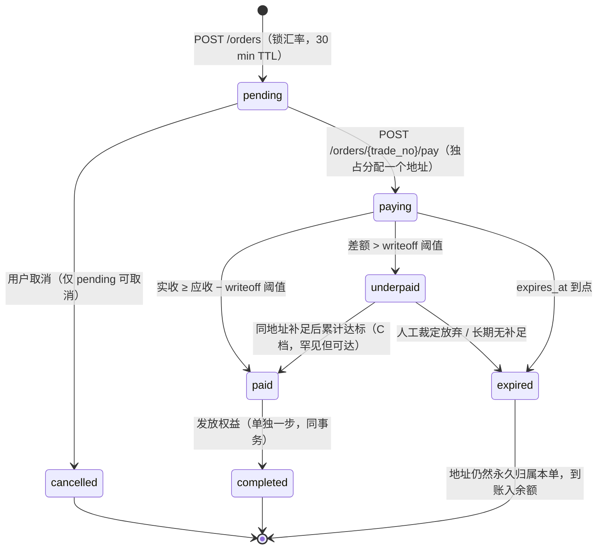

# 0012 · 裁决：收款地址一单一址且永不复用，bp-api 自扫链；不部署 EPUSDT、不接易支付、第一阶段一次都不归集

> 日期：2026-08-23 · 性质：**架构裁决** · 状态：**提案，未批准**（2026-08-23）
> 事实基线：master **`618bf1cc89b`**（2026-08-23）；`api/db/migrations/0001–0013`（2026-08-23 实查，**44 张表**，
> 其中 `0001–0012` 的 43 张已在真实 Cloud SQL 上，`0013_rate_limit` 是否已在生产库跑过**待核实**）、
> 冻结的 `openapi/openapi.yaml`（2026-08-23 实查 **128 个 `operationId`**，两次提交均为 2026-08-17）、
> `docs/01-research/payments.md`（2026-08-16）、`docs/03-product/pricing-and-plans.md` §4（2026-08-16 链上实测 + 2026-08-21 SKU 拆分）、
> `docs/03-product/user-journey.md` §7、`docs/00-overview/roadmap.md` §5.2 / R2 / R3 / R6 / R9、
> `docs/00-overview/launch-readiness-review-20260821.md` §6、`docs/04-ops/monitoring.md` §3。
> 关联：[ADR 0001](0001-cloudflare-tos-risk.md)、[ADR 0002](0002-notification-channels.md)、[ADR 0005](0005-database-selection.md)、
> [ADR 0006](0006-api-stack.md) §3.3、[payments.md](../01-research/payments.md)、[pricing-and-plans.md](../03-product/pricing-and-plans.md) §4、
> [user-journey.md](../03-product/user-journey.md) §7、`openapi/openapi.yaml`（本裁决要求改其中 **6 处 description**，见 §3.6）
> 裁决人：**待用户批准**（本 ADR 推翻一处已冻结契约的描述性约束 + 一条已发布调研的推荐方案，必须经批准才生效）
> 证据口径：仓库内 migration / openapi / 文档 = 一手；本文自己做的算术 = 推算，已逐条标注；
> 链上与交易所行为 = **待核实**；外部免费额度 = **需实测**
> 📎 **2026-08-29 行号勘误（只改引用坐标，不动任何论证与裁决）**：ESP 的 `TODO(P1)` 在 `api/internal/handler/auth.go` 的 **`:1272`**（`status: "queued"` 的赋值在 `:1285`），不在 `:1140` —— §16.3 与 §20 两处引用已改。`:1140` 这个坐标来自 `launch-readiness-review-20260821`（对它自己的基线成立），抄进本文时没有按本文的基线 `618bf1cc89b` 重新核。本文 §7.2 表 P17 行里的 `:1272`/`:1285` 一直是对的，两处互相打架，现已统一。

---

## 1 · 裁决

**主通道是 USDT-TRC20。收款地址由我们自持、私钥离线，一张订单独占一个地址并且这个地址永不复用；
到账由 `bp-api` 的 `/internal/tasks/chain-scan` 自己扫链识别，归属只看地址、不看金额。
EPUSDT 不部署，易支付一家都不接，OxaPay 只保留接口不写实现，第一阶段一次都不归集。**

九条，每条都可执行：

1. **归属靠地址，不靠金额。** 删除「小地址池 + 金额尾数递增匹配」。
   `orders_pay_addr_amount_uk` **`DROP`**，换成 `orders_pay_addr_uk ON orders (pay_address)`。
   报价取整到 **0.01 USDT**，四位小数尾数连同 user-journey §7 卡点 3（「尾数像诈骗」）一起消失。
2. **地址永不复用。** 一个地址在它的生命周期里只服务一张订单，订单终结后也不回收。
   由此得到本裁决最有价值的一条性质：**任何时刻、任何金额打到这个地址，归属都是唯一确定的**——
   「钱进黑洞」这个 user-journey 判定为「最不可挽回」的失败模式**被消除，而不是被缓解到 7 天**。
3. **私钥不在服务器上。** `pay_addresses` 表里永远没有 `private_key` 列。
   地址在离线环境按 `m/44'/195'/0'/0/i` 批量派生（一次 32 个），备份仍只有一份助记词。
4. **第一阶段一次都不归集。** 钱留在它落地的那个地址上。
   单次 Tether 拉黑事件的损失上限 = **一张订单 ≈ $55.6 ≈ 假设年营收的 2.5%**（推算，§4）；
   年链上成本 **$0**；私钥年取出次数 **0**。归集推迟到出金压力第一次出现时（失效条件 6）一次性处理。
5. **少付按三档处理，不再要求用户做一次不可能的补足。**
   差额 ≤ **2.0 USDT** → 自动 `paid`，差额记 `expense:payment_shortfall`；
   2.0–5.0 USDT → `underpaid` 进人工队列，**文案明确写「无需再次转账」**；
   > 5.0 USDT → `underpaid` 且提示补足（此时补足在交易所侧是可执行的）。阈值在 `settings` 里，改动走 D13。
6. **扫描清单是自适应的**：只扫「有活跃收银台或仍在监听窗口内」的地址。
   稳态外部调用 ≈ **77 次/天**，是原方案 5,760 次/天 的 **1/75**（推算，§10）。
   TronGrid 从「本裁决最脆弱的一环」降级为「有五级台阶可退的普通依赖」。
7. **`payments` 表建起来，`(provider, external_id)` 是唯一入账幂等键，链上 txid 是它的唯一取值来源。**
   D6 手工入账**必须填一个真实 txid**，因此手工与自动天然互斥，不会两次入账、两次开通。
8. **D6 在它的带外留痕真正带外之前保持关闭**（`admin_users.perm_mark_order_paid` 已 `DEFAULT false`，
   实查 `0002_foundation.up.sql:62`）。带外 sink 必须是同步外呼、失败即 D6 失败，且必须真的触发一次看到它。
9. **易支付一家都不接**（两条硬理由，第三条无证据的理由删除）；**Paddle / Stripe 本阶段否决**；
   **OxaPay 只保留 `Provider` 接口的位置，第一阶段不写实现**，并把「读完它的条款」变成一条有日期的任务而不是一条未决项。

**「手工收款 + D6」不是主路径，是被显式定义、被计量、被红线卡住的降级路径**（§16、§18）。

---

## 2 · 辩论与裁决

这一节是本文档的主体。**正方与反方各自的每一条攻击都在这里落点**，
被采纳的攻击在下文都有对应的设计改动，不存在「嘴上采纳、身体不改」的行。

### 2.1 反方（con）

| # | 反方论点 | 裁决 | 理由与落点 |
|---|---|---|---|
| C1 | 识别机制的分辨率（0.0001 USDT）比主付款路径的系统误差（交易所提币费 1.5 USDT）细 **15,000 倍**，金额尾数匹配整段应删 | **采纳** | 决定性的不是那 15,000 倍，而是**它在最常发生的那条路径上恰好失效**：手续费从转出额扣 ⇒ 实收落在所有槽位之外 ⇒ 归属只能退回「同地址 + 窗口内」，也就是退回地址归属。一个在模态情形下必须退回备用机制的判别器，不是判别器。**落点：§5 全节重写为一单一址；`orders_pay_addr_amount_uk` `DROP`（§17.2）** |
| C2 | `underpaid → paid` 这条状态转移实践中不可达（补足会被再扣一次提币费，净到账 0；且要手算命中 1e-4 窗口） | **部分采纳** | 「不可达」的因是两个：窗口太窄（随 C1 消失）+ 补足额小于提币费（不随 C1 消失）。后者必须单独解。**落点：§6 的三档写销/人工/补足规则。差额 > 5 USDT 时补足在交易所侧可执行，这条边因此是可达的、只是罕见；差额 ≤ 2 USDT 时我们根本不要求补足** |
| C3 | `user-journey` §7 卡点 5 的文案「提币手续费会另外扣除」写反了，草稿一边复述正确机制一边引用了这句错文案 | **采纳** | 实查确认草稿 §6.3 同时含正确机制与错误文案。这正是 AGENTS.md §3 点名的「继承一句话、丢掉它的前提」。**落点：§6.4 重写收银台文案，明写「手续费从你填写的金额里扣」，并在报价页显示两个数** |
| C4 | 四位小数尾数本身就是 user-journey 七卡点里的第三个，是我们自己制造的问题；它换来的「单地址并发 100 单」对 0.77 单/周 毫无价值 | **采纳** | 130 倍的容量余量，代价是制造一个必须靠 `note` 字段去解释的信任问题。**落点：§5.3 报价取整到 0.01 USDT；`PaymentCheckout.note` 改为解释提币费而不是解释尾数** |
| C5 | 归集把风险集中而不是分散；「$200 上限」是假的，真实上限是迄今累计全部营收；第一阶段正确答案是**不归集** | **采纳** | 草稿 §3 已裁定「原样持有、不出金」，那么归集的唯一收益（把钱集中起来好花）在第一阶段不存在，而它的风险效果是负的。**落点：§13 全节；`asset:crypto:tron:cold` 科目不建；§14 的能量方案在第一阶段直接归零；代价 3 改写** |
| C6 | 这条同时打掉 §10.4——否决托管网关的论证不能建立在「上限谁大谁小」上 | **采纳** | 自持的上限也是「某个地址的全部余额」，只是执刀人从网关换成 Tether。**落点：§12.4 改写为「谁来决定、我们有没有选择权、我们知不知道」三问，不再比大小** |
| C7 | 归集次数算漏了「30 天」那条触发规则，两条一起算是 ≈22 次/年 / $32.3 / 1.45%，与 OxaPay 打平而非「已低于」 | **采纳** | 算术核对通过（更新过程推算）。**落点：因 C5 采纳，归集次数变为 0 次/年、$0，「已低于 OxaPay」这句在新设计下重新成立——但 §13.5 明写它仍然不是选自建的理由** |
| C8 | AML Layer 1 绑定 `from_address` 在主付款路径上失效：交易所提币的 from 是热钱包，它回答的是「是不是又从币安出来的」 | **部分采纳** | 机制推理成立，但反方自己标了 **待核实**（热钱包是否共享、是否轮换）。采纳它对**宣传语**与**阻断行为**的攻击，不采纳「Layer 1 应当删除」。**落点：§12.2 把绑定对象从「用户」改为「已见过的来源」，宣传语改成它实际能回答的那句** |
| C9 | Layer 1 把自动化省下的人工原样加回来：年付模型下续费几乎每单命中 `unbound_payer`，40 次 × 4 分钟 ≈ 2.7 小时/年，恰好等于手工路径的工时 | **采纳** | 这条比 C8 更致命，因为它不依赖热钱包行为的细节——只要来源会变，队列就会长。**落点：§12.2 裁定 `unbound_payer` **不阻断开通**，只打标签、记账、进日报；人工确认从「每笔」降为「每见到一个新来源一次」** |
| C10 | D6 的「带外邮件」经同一个 Postgres 队列，不是带外；且邮件送达率本身未验证（`docs/README` §7 阻塞项 5） | **采纳并加严** | 反方给的修法是「同步打外部 sink，失败即 D6 失败」。本裁决走得更远：**在这个 sink 端到端验证通过之前，`perm_mark_order_paid` 对所有管理员保持 `false`**，即 D6 不可用。理由：这个权限位默认关是既有事实，把它作为闸门是零成本的。**落点：§16.3、§20 第 9 步** |
| C11 | `asset:manual_reconcile` 会永久非零（冲正是手工的，没人写）；`ProcessDeposit` 缺「该订单已 paid/completed」分支 | **采纳** | 实查草稿 §7.3 确为四分支。一个天天报红的指标等于没有这个指标，而它是把「全系统最大内部欺诈面」变成可观测量的唯一手段。**落点：§8.4 补第五分支，冲正由 `ProcessDeposit` 自动写** |
| C12 | 60 秒扫全部 4 个地址是自找的脆弱；只扫活跃地址可降 75 倍，UX 不变 | **采纳** | 与正方 P3 指向同一处。**落点：§10.1 自适应清单；§10.3 五级降级梯子；代价 4 从「最脆弱的一环」降级** |
| C13 | 「口径差 ≤ 0.0099 USDT」是真值（0.000099）的 **100 倍**，按它实现会跨 99 个槽位静默吞钱 | **采纳** | 正方 P1 独立得出同一结论，两边算术一致。**落点：随 C1 采纳，槽位与该常数一起消失；§17.1 把这次单位错误单独登记为教训** |
| C14 | `external_id = 'D6:' || audit_logs.id` 根本不幂等：D6 点两次 = 两条 audit_log = 两次入账；且与 `chain-scan` 跨 provider 不去重 | **采纳** | 「先手工上线、后补自动化」是 §18.3 计划内的必经状态，所以这不是理论场景。**落点：§8.2 —— 链上的钱一律 `provider='chain_tron'`、`external_id = txid || ':' || log_index`，D6 必须填真实 txid，新增 `payments.entered_by` 区分录入者。手工与自动因此天然互斥** |
| C15 | 漏了第四把幂等锁 `orders_gateway_ref_uk`（已在生产库）；一张订单在补足场景下对应两个 txid，而 `gateway_ref` 只有一列 | **采纳** | 实查 `0006_orders.up.sql` 确认该索引存在。**落点：§8.3 —— `orders.gateway_ref` 降级为「首笔到账 txid，仅供人工检索，不承担幂等」；`orders.gateway` ↔ `payments.provider` 的映射在 §8.3 直接写死** |
| C16 | 质押盈亏平衡用了无出处的 `r = 5%`；质押不是全有全无；`$1.47/次` 是 2026-08-16 现货报价，TRX 价敞口一处没登记 | **采纳** | 结论（不质押）在任何合理参数下都不翻，但论证方式要改。**落点：§14 给出 r 的敏感区间并标 假设；登记 TRX 价与能量租赁市价敞口；同时说明第一阶段归集次数为 0，这个问题暂时无关** |
| C17 | 五处事实错误：`perm_mark_order_paid` 在 0002 不在 0011；`used_totp` 表不存在导致 D6 四层强制的验收项结构上无法通过；`pay_amount_raw numeric(38,18)` 与契约的 `int64` 跨界；`orders.pay_address` 注释是「本单专属收款地址」 | **全部采纳** | 逐条实查复核通过（`0002_foundation.up.sql:62`；44 张表无 `used_totp`；`0006_orders.up.sql:59` 为 `numeric(38,18)`；`0006:58` 注释确为「本单专属收款地址」）。**最后一条反过来是本裁决最有力的旁证：schema 的作者当初假设的就是一单一址，金额尾数机制是后来焊上去的。落点：§17.2–§17.4** |
| C18 | 「新增月度固定成本 $0」不成立，与同一份草稿的「TronGrid 额度需实测」自相矛盾 | **采纳** | **落点：§10.2 把 $0 改写成有条件、可验证的形式，并把三项未实测的外部额度显式列出** |
| C19 | 否决易支付的第三条理由（「转化率不是我们的问题」）无证据，且与 §14.4 自认的零数据、与 user-journey §7 卡点 1 直接冲突 | **采纳** | 一条会被后人当既定事实引用的无证据理由，比一条错误结论更危险。**落点：§3.2 只保留两条一手证据理由，结论一字不改** |
| C20 | OxaPay 降热备的理由「我们没读过它的条款」在方法论上站不住——读一份公开 ToS 是当天可完成的有界动作 | **部分采纳，主体驳回** | **驳回**：草稿 §2.2 给了四条理由，「没读过条款」只是第一条；另外三条（托管方持币且条款给它「不说明理由」的权力、它不消除 AML 风险只改变落点、单人运维下黑盒故障我们修不了）**独立成立且与是否读过条款无关**。所以裁决不变。**采纳的部分**：把「读完 OxaPay 条款」从「这次没有解决的」移进 §20 落地顺序（第 0 步，无前置、可当天做）。**并额外加严**：第一阶段**连实现也不写**——为一份没读过的条款写代码是投机性工作 |
| C21 | 问卷有社会期许偏差，正确的工具是让他们真的发 1 USDT 到测试地址 | **采纳** | 二元、可观测、不靠自述，且顺便把真实链上闭环测掉。**落点：§18.1 与 §20 第 1 步** |
| C22 | 替代方案：一张订单独占一个地址「**直到 `address_watch_until`**」，池 N=16，离线生成 64 个 | **部分采纳** | **采纳**独占；**驳回复用**。窗口结束后回收地址会重新引入归属歧义：第 8 天到账的钱会落在一个已经属于别人的地址上，而这正是草稿 §5.3 想修的那类不可判定。**永不复用把「7 天内认账」升级为「永远认账」，且删掉了草稿发明的 `addr_reserved` 列**（§5.2）。派生批量改为一次 32 个、余量 < 8 告警 |
| C23 | tolerance 若由我们承担，稳态 ≈ $60/年 = 2.7% 营收，**高于** OxaPay 的 1.5% | **部分采纳** | 数字方向对，但「全额承担」不是唯一落点。**落点：§6 的三档规则——默认由用户在提币金额里承担手续费（报价页显示两个数），写销阈值只吸收失败的那些。上界 40 × $2 = $80/年（3.6%），期望值未知，因此 §19 建 `bp_pay_shortfall_writeoff` 计量它；季度 > 10 次即判定文案失败** |
| C24 | tail 时延从 60 秒拉到最坏 15 分钟 | **采纳** | **落点：§10.1 双档——活跃收银台 60 秒，监听尾部 15 分钟。付款当时的体验一秒没变** |
| C25 | `used_totp` 表「属于 D6 而不属于支付通道」，不在本次范围 | **驳回** | D6 是本 ADR 亲手扩大的欺诈面，它的 L3 防重放是承重控制；把它留在范围外会让 §20 第 12 步的验收项永远无法通过。**落点：`used_totp` 纳入 `0015` migration（§17.5）** |
| C26 | `orders.gateway` 与 `payments.provider` 两套命名空间的统一需要一次单独的 schema 裁决 | **驳回** | 两套命名空间是本 ADR 引入的，不能由本 ADR 推给下一份 ADR。**落点：§8.3 直接写死映射表，并把 `orders.gateway` 降为展示与检索字段** |

### 2.2 正方（pro）

| # | 正方论点 | 裁决 | 理由与落点 |
|---|---|---|---|
| P1 | 容差 0.0099 错 100×；`$2,224` 用的是 §12.2 自己警告过「不要当基准」的示例汇率 7.1930；「336 倍」应为 337 | **采纳** | 与 C13 同源。**落点：全篇营收一律以 **¥** 计，示例汇率只出现一次并显式标注（§4）；周转率那句随机制删除消失** |
| P2 | `$200 上限` 在归集之后失效，冷地址才是真正的单点；建议冷地址分片 + 污染隔离 | **部分采纳** | **结论采纳**（上限是低估）。**修补方案被 C5 取代**：分片是在承认归集的前提下降低集中度，而本裁决直接取消归集——**不混币就没有污染传染路径**，P2 的第二条修补（污染隔离）随之不再需要。**落点：§13.2、§13.3** |
| P3 | 「$0」要按 vCPU-秒算不能按请求数算；天真实现吃掉免费额度 48% | **采纳** | 这是本轮最有价值的成本修正之一。**落点：§10.2 给出三档 vCPU-秒推算；结论改写成有条件形式** |
| P4 | §14.4 的自我否定提名错了：**Q1「谁能付款」与 Q2「到账由谁识别」是两个独立问题**，问卷只能回答 Q1 | **采纳** | 并且正方指出的自撞红线成立：若 40 人里 24 人走 D6，就是 6 次/季 > 红线 5 次/季。**落点：§18 全节按 Q1/Q2 重写；失效条件 1 改为「补一条付款人不必自持 U 的入金路径」而不是「把识别换成人眼」** |
| P5 | `DelegateResource` 自带前提是质押 $2,231；且冻结契约（08-17）晚于 pricing（08-16），金额尾数早已冻结进契约 | **部分采纳** | **前半采纳**：`DelegateResource` 的地基是那笔被否决的质押，这条反驳成立且写进 §3.4 的落点表。**后半驳回**：契约冻结在后，不等于契约正确。本 ADR 就是 `docs/README` §4 第 2 条规定的推翻机制，而所需的改动是 **6 处 description，零处 schema 形状**（§3.6）——不是结构性破约 |
| P6 | 失效条件 2 从「TronGrid 撑不住」直接翻到「启用 OxaPay」台阶跨得太大，应改成五级梯子 | **采纳** | **落点：§10.3 五级梯子；失效条件 2 重写** |
| P7 | 不接易支付 = 不需要制造一个替我们承担帮信风险的**境内自然人代持人**，这条风险的承担者是第三人 | **采纳** | 一手协议原文支撑，且是纯增益论据。**落点：§3.2 第三条理由（替换掉被 C19 删掉的那条）** |
| P8 | 「过期后仍认账」这个承诺只有自持地址才做得出，托管网关的发票过期行为取决于网关 | **采纳并加强** | 在永不复用之下，承诺从「7 天」升级为「永远」。**落点：§11** |
| P9 | 链上收款不依赖域名——与 R3「域名一定会被封」是同一条防线的两端；(地址, 金额) 可以走邮件送达 | **采纳** | 设计稿一字未提，是最大的未计收益。**落点：§11.3** |
| P10 | 账本第一次有了外部可验证的锚点：`asset:crypto:tron:*` 的余额是链上公开数字 | **采纳** | 在「不归集」之下这条更强：每个地址的链上余额恰好等于一张订单的收款历史，日对账退化成一行断言。**落点：§17.6** |
| P11 | 池大小 N=4 是硬上限，所以 `addr_label` 是 `monitoring.md` §3.1 允许的实体标签 | **驳回** | 两层理由。其一，`monitoring.md` §3.1 的原文只把 `node_id` 列为允许，并加了一句「**这是唯一被允许的实体标签**」——P11 的前提在字面上就不成立。其二（更根本）：在一单一址之下地址基数随订单数无上限增长，`addr_label` 立刻违规。**落点：§19 明列 `addr_label` 为禁止标签；扫描失败只按 `reason` 分类。这是本裁决为一单一址付出的一项可观测性代价，登记在 代价 6** |
| P12 | 建 `payments` 表不是新增负担，是还一笔 2026-08-17 就欠下的契约债（三个 operation 今天无论如何实现不了） | **采纳** | 并且正方 §3.1 的加强版更硬：`gateway_ref` 是 `orders` 上的一列，结构上无法表达契约强制要求的 `underpaid`（一单两笔转账）。**落点：§8.1** |
| P13 | `webhook_events` 在 Phase 0 恒为空表 → 出现任何一行都意味着有人在打一个我们没启用的端点，是零误报的入侵信号 | **采纳** | **落点：§20 验收判据第 7 行** |
| P14 | `recheck` 的 429 会污染 `bp_api_429`「任何 429 都是异常」的语义；应当缓存而不是拒绝 | **采纳** | 「给一个害怕的人回 429」确实是这个按钮所有可能行为里最差的一种。**落点：§10.4 —— 20 秒冷却窗口内直接返回上次扫描结果（200），不回 429** |
| P15 | 私钥离线把 `refunds.destination='original'` 事实上钉死在人工，本 ADR 替一个未拍板的决策做了预设 | **采纳** | 实查 `0007_ledger.up.sql:90` 确认 `refunds` 表与该 CHECK 已存在。**落点：代价 5** |
| P16 | log-based metric 不追溯（B42 已经因此永久丢失 08-17→08-21 四天数据），必须在第一次部署前建好 | **采纳** | **落点：§19 全节；§20 把建指标放在第 2 步，先于任何 migration** |
| P17 | 至少四条路径以邮件为终点，而 ESP 未选型、发信未接通（`api/internal/handler/auth.go:1272` 的 `TODO(P1)`，status 恒为 `queued`，见 `auth.go:1285`） | **采纳** | **落点：§20 前置条件栏；并与 C10 合流——D6 的闸门同时也是 ESP 的闸门** |
| P18 | 形式合规三条：文档头未套格式、`05-adr/README.md` 需登记本号与预留号段、推翻登记不完整（漏了 payments.md §2.10 与 pricing §4.2 第 5 条） | **采纳** | **落点：本文档头；§3 完整落点表；§20 第 14 步**。⚠️ 索引现状已变：`05-adr/README.md` 已登记 0012，0010/0011 也已成文，**只剩 `0009` 一个待写号**（原提法「0009–0011 三个预留」已过时） |
| P19 | ERC20 归集侧便宜 367 倍（$0.004 vs $1.47）且 AML Layer 0 同样可用，失效条件里应优先评估加链而不是评估质押 | **部分采纳** | 在「第一阶段不归集」之下，归集成本优势暂时无处兑现；但它在**出金那一天**是真金白银的差别。**落点：失效条件 3 改为「优先评估加 ERC20，而不是评估质押 TRX」；§20 第 1 步的实测顺便问「你的 U 在哪条链」** |
| P20 | 匹配应落在 `bigint` 上而不是 `numeric(38,18)` | **采纳** | 即便归属改为按地址，`paid` / `underpaid` 的判定仍是一次金额比较，仍不该跨类型。**落点：§17.3 新增 `orders.pay_amount_usdt6 bigint`** |
| P21 | 不部署 EPUSDT 的四层论证（R2 已登记的失效形态少一种、周边件已在库、EPUSDT 是持币进程、payments.md §2.11 本来就是仓库里的第二选项） | **采纳** | 第三层尤其重要：部署 EPUSDT 等于在服务器上跑一个能动钱的服务，正是本裁决支点否定的那样东西。**落点：§3.1** |
| P22 | 6 条指标若各自挂告警约 +$2.1/月（推算，待核实），在 $9.53/月 的 `bp-db` 面前是 22% | **采纳** | **落点：§19 —— 七条指标全建，但只有 `bp_pay_scan_fail` 与 `bp_pay_fx_reject` 挂告警策略** |

### 2.3 辩论没有改变的

以下五条经双方攻击后原样保留，登记在此以免后人重新评估：

1. **不部署 EPUSDT**（反方 §8-1 自认推不翻；Cloud Run 不容常驻 worker，三处文档独立记着）。
2. **私钥不上服务器**（反方 §8-2：「整份草稿最好的一条，我没有反例」）。
3. **`Query` 必需 / `Verify` 可选 / `Verify` 返回值里不含金额**（用类型系统让「相信回调里的金额」不可表达；NewAPI `new-api/issues/4279` 是真实判例）。
4. **不接易支付**的两条一手证据理由（协议原文点名 VPN；签约主体必须是境内自然人）。
5. **过期后到账不改订单状态、只入余额**（与冻结契约的 `runOrderTimeoutTask` description 一致，且避免汇率敞口）。

---

## 3 · 推翻登记（`docs/README` §4 第 2 条要求的逐条落点）

### 3.1 `payments.md`（2026-08-16）「推荐方案：EPUSDT 自托管」

| 旧理由 | 在本裁决下的落点 |
|---|---|
| 无第三方否决权 | **保留**，且是本裁决的立论基础 |
| 零拒付 | **保留**（`chargeback*` 三个状态在本裁决下永远不可达，§7.2） |
| 零类目审查 | **保留** |
| 用户群重合 | **保留**，但其比例是零数据，本裁决把它变成一次实测（§18.1） |
| 成本最低 | **保留但降权**（§13.5：费率差在任何方向上都是噪音，不该承重） |
| 「用 EPUSDT 这个进程去实现它」 | 🔴 **推翻**。它要自己管理收款地址才能做到「一个地址服务无限订单」（payments.md §2.10），即**在服务器上跑一个能动钱的服务**——恰是本裁决支点否定的东西。且它新增一台 VM（roadmap R6 的 e2-small 口径：us-central1 二手源 **$12.23/月**，asia-east2 溢价未核实）或 `min-instances=1`（roadmap R6：≈ **$63/月**，是免费额度的 14.6 倍），与「不要常驻 worker」冲突。⚠️ roadmap R6 的 **$47–55/月** 是**全部已知固定成本的合计粗估**，不是一台 VM 的价钱，不要引作单机口径 |

### 3.2 `payments.md`「备用通道：易支付聚合 2–3 家」

🔴 **推翻。** 三条理由，前两条是一手协议原文，第三条替换掉了草稿里那条无证据的：

1. **协议点名拒收本类目**：虎皮椒接入协议 **4.10.10**（「VPN，翻墙工具」）与 **4.10.17**（禁止易支付类商户接入）；
   某在运营易支付网关协议 **3.2.9** 同样点名 VPN，其 FAQ 写「情节严重者直接上报片区网警」；
   某平台协议 **4.5**「被冻结或关闭支付权限，充值未消费的余额不退款」（全部出自 pricing §4.0/§4.1 的一手协议走查）。
2. **签约主体必须是境内自然人**（身份证 + 个人银行卡 + 实名支付宝），境外主体拿不到。
3. **代持让身份提供者承担帮信风险**（pricing §4.0 原文）。**这条风险的承担者既不是我们也不是用户，而是一个第三人。**
   一个内部服务不应该为了收几十个熟人的钱去制造这样一个人。

🔴 **删除**草稿的原第三条理由「转化率漏斗是公开市场的问题，不是我们的问题」——
无证据，且与 user-journey §7 卡点 1 的现存判断（「这是一个比我们整个产品还长的子旅程」「但我们解决不了这一步」）相反。

### 3.3 `payments.md` §2.10「内部支付抽象层应该以 epay 协议为一等公民」

🔴 **推翻**（这是一次此前未登记的静默推翻，由正方 §9-3 指出）。
本裁决把 **`Query`（反向查单）** 而不是 epay 协议放在一等公民的位置（§9.1）。
理由：epay 协议是一个**通道形状**，而 `Query` 是一条**信任规则**。我们不接任何 epay 通道（§3.2），
把一个不会被使用的协议做成抽象层的中心，会让每个新 provider 都去实现一层它不需要的适配。

### 3.4 `pricing-and-plans.md` §4.2 第 5 条「归集策略修正为质押 + `DelegateResource`，无需退化成金额唯一性匹配」

🔴 **前提不成立，因此不采用**（不是被拒绝）。
`DelegateResource` 出借的是**已经质押出来的**能量：按 pricing §4.2 自己的数（`TotalEnergyWeight = 18,842,211,114` → 每质押 1 TRX 每天产 9.55 Energy），
一笔 64,285 Energy 的转账需质押 **≈ 6,730 TRX ≈ $2,231**，解质押锁 **14 天**。
在第一阶段归集次数为 **0** 的设计下（§13），这笔质押要服务的动作根本不发生。
`roadmap` R2 还把「TRON 能量不足导致归集卡住（需质押约 6,730 TRX）」列为三种已登记失效形态之一——
用它去实现主通道等于把缓解措施换成风险源。**保留这条知识，标注前提。**

### 3.5 `pricing-and-plans.md` §4.2 第 3 条「月付在链上是亏本的，必须主推年付」

**结论保留，理由更换。** 原理由建立在「一单一次归集」的模型上，而本裁决第一阶段归集次数为 0，
边际链上成本对月付/年付都是 $0。新的三条理由：

1. 每年 12 次付款 → 12 倍的 `underpaid` / 过期 / 「钱进黑洞」体感机会，而 user-journey 判定首次付款是最不能出事的一次。
2. 12 倍的运维注意力（人工队列、`recheck`、邮件），而 roadmap R9 记着运维是一个人。
3. 一单一址之下，**月付会以 12 倍速度消耗地址库存**（40 单/年 → 480 单/年），把派生批次从每 9 个月一次变成每 24 天一次。
4. 现金流前置 + 降低流失（pricing §3.2 原本的理由，成立）。

### 3.6 🔴 冻结契约 `openapi/openapi.yaml`（2026-08-17）的「小地址池 + 金额尾数递增匹配」

**推翻。** 这是本 ADR 唯一一处推翻冻结契约的地方，因此把改动范围写到字段级：

| 位置 | 现文 | 改为 | 是否改 schema 形状 |
|---|---|---|---|
| `payOrder` description 硬约束 1 | 「`amount_usdt6` 的末位是订单识别码…冲突则 `+0.0001` 递增重试，最多 100 次」 | 「订单与收款地址一一对应且地址永不复用；归属只看 `to_address`，金额只用于判定 `paid`/`underpaid`」 | ❌ 否 |
| `PaymentCheckout.amount_usdt6` description | 同上尾数说明 | 「应付金额，单位 1e-6 USDT。取整到 0.01 USDT」 | ❌ 否（仍是 `integer/int64`） |
| `PaymentCheckout.amount_display` description | 「供展示的四位小数字符串（如 `5.8423`）」 | 「供展示的两位小数字符串（如 `55.60`）。**展示用字符串，不是数值类型**」 | ❌ 否（仍是 `string`） |
| `PaymentCheckout.note` description | 「解释四位小数尾数的文案…卡点 3」 | 「解释提币手续费从转出额扣除的文案，并给出含手续费的填写金额」 | ❌ 否（非 `required`） |
| `PaymentState` description（`openapi.yaml:5924`） | 「**必须含 `underpaid`** —— 金额唯一性匹配决定了少付一定会发生」 | 「**必须含 `underpaid`** —— 交易所提币手续费从转出额扣，少付一定会发生」 | ❌ 否（枚举值一个不动） |
| `listAdminUnderpaidPayments` description（`openapi.yaml:3739`） | 「金额唯一性匹配决定了少付一定会发生（**提币手续费从转出额扣是头号成因**）…」 | 「提币手续费从转出额扣决定了少付一定会发生…」（后半句「常驻的对账入口，不是异常处理页」原样保留） | ❌ 否 |

**六处全部是 description，零处 schema 形状变更。**
（前四处是草稿已登记的；后两处是本次核准对 `openapi.yaml` 全文 `grep` 出来的遗漏 ——
「金额唯一性 / 尾数 / 递增重试 / 四位小数」这四个词在契约里一共只出现在这六处，逐条核对无遗。）
`PayOrderRequest.method` 的 `[usdt_trc20, balance]`、`PaymentCheckout.chain` 的 `[TRC20]`、
`PaymentState` 的 `[waiting, confirming, underpaid, paid, expired]`、`shortfall_usdt6`、`confirmations_required`
——**枚举取值与字段形状一个都不动**（`PaymentState` 只改它的 description，见上表）。
CI 的 `git diff --exit-code` 生成物校验因此只会看到 description 漂移，不会看到接口漂移。

### 3.7 `user-journey.md` §7 卡点 5 的页面文案

🔴 **推翻**（由反方 §2.3 指出）。原文「请按到账金额填写，**交易所提币手续费会另外扣除**」对 Binance 式提币是反的——
费用是**从你填的数里扣**。用户照这句话填 X，我们收到 X − 1.5，**必然 underpaid**。
新文案见 §6.4。

---

## 4 · 规模前提与数字基线

后面所有取舍都靠这组数字。**哪些是实测、哪些是假设，逐行标清。**

| 量 | 数值 | 性质 |
|---|---|---|
| 付费用户数 | 几十人（建模用 **40**） | product-brief §4「规模有上限」；具体数字 **假设** |
| 订单频次（主推年付） | **40 单/年 ≈ 0.77 单/周** | 推算 |
| 假设年营收 | **¥16,000**（40 人 × ¥400/年） | **假设**（pricing §7 明记价格未定） |
| 示例汇率（**本文只在这里出现一次**） | **7.2 CNY/USDT** | **示例，非实测。** ⚠️ `api-contract` 示例里的 `cny_per_usdt_e4: 71930` 是文档示例，不是基准（§15.2） |
| 单笔订单折 USDT | ¥400 / 7.2 ≈ **$55.6** | 推算 |
| 假设年营收折 USDT | ¥16,000 / 7.2 ≈ **$2,222** | 推算 |
| 出口成本（实测） | 完整窗口 **3,399 GiB / $332.91**（gross） | evidence/egress-billing-20260820 |
| **实际现金支出** | **约 $6** | 其余被账户级 GFS 推广抵扣吸收（$100k，2026-06-16 → 2027-06-15，至 08-20 已用 $39,107，本项目占 3.3%，池子由同账户 Vertex AI 主导） |
| `bp-db` 稳态 | **$9.53/月** | 已实测 |
| 一笔 TRC20 USDT 转账（收方已持 U） | 64,285 energy = 6.43 TRX ≈ **$2.13** | pricing §4.2，2026-08-16 链上实测 |
| 同上（收方未持 U） | 130,285 energy = 13.03 TRX ≈ **$4.31** | 同上 |
| 能量租赁 | 4.42 TRX ≈ **$1.47** | TronSave 67.25 sun/Energy 下限，65,000 Energy，**2026-08-16 现货报价**（§14.3 登记敞口） |
| 自给一笔所需质押 | ≈ **6,730 TRX ≈ $2,231**，解质押锁 **14 天** | 同上 |
| Binance TRC20 提币费 | **1.5 USDT**（ERC20 0.4 / BEP20 0.01） | pricing §4.2 第 8 条，2026-08-16 实查 |
| Tether 拉黑（2020-06-26 → 2026-08-15 链上遍历） | `AddedBlackList` **8,043** 次；`DestroyedBlackFunds` **1,164** 次 / 累计销毁 **581,237,667 USDT**；近 30 天新增 264 个（≈ 8.8/天） | pricing §4.3 |

**三个必须一起看的推论：**

1. **现金压力几乎为零**（约 $6）。因此**没有必须把 USDT 换成法币的压力**——而 pricing §4.3 已判定
   「法币出金那一端才是风险集中点，不是链上收款那一端」。**直接推论：收到的 USDT 原样持有，第一阶段不做任何出金动作。**
2. **一周不到一笔。** 这个频次让「为吞吐设计」的一切方案在这里都是错的——包括金额尾数匹配那 100 个并发槽位。
3. **单笔订单 $55.6 是本设计里最重要的一个风险刻度**：一单一址 + 不归集 ⇒ 任何单点事件的损失上限就是它。

---

## 5 · 归属：一单一址、永不复用

### 5.1 分配算法（这是 §5 的全部）

```sql
-- 在 payOrder 的事务里
WITH picked AS (
  SELECT a.id, a.address
    FROM pay_addresses a
   WHERE a.chain = 'tron'
     AND a.enabled
     AND NOT a.is_blacklisted
     AND a.assigned_order_id IS NULL
   ORDER BY a.id
     FOR UPDATE SKIP LOCKED
   LIMIT 1
)
UPDATE pay_addresses p SET assigned_order_id = $order_id
  FROM picked WHERE p.id = picked.id
RETURNING p.address;
-- 无行返回 → 地址库存耗尽 → 503 ErrDependencyDown（冻结契约已定义该响应）
```

配套一条**兜底唯一索引**，让并发错误在 DB 层就变成错误而不是变成脏数据：

```sql
CREATE UNIQUE INDEX orders_pay_addr_uk ON orders (pay_address) WHERE pay_address IS NOT NULL;
```

**注意这里没有 `addr_reserved` 列。** 草稿为了让「状态与槽位占用解耦」发明了这一列；
在永不复用之下，「地址是否被占用」等价于「`assigned_order_id IS NULL`」，
而这是一个**单调一次性**的赋值，不需要任何随状态变化的维护逻辑。
`/internal/tasks/order-timeout` 因此少一项职责。

### 5.2 为什么是「永不复用」而不是「窗口结束后回收」

反方的替代方案是独占**到 `address_watch_until` 为止**。本裁决驳回回收，理由是一条可判定性：

> 若地址在第 7 天被回收给订单 B，那么第 8 天到账的一笔钱**在数据上无法区分**它属于 A 还是 B。
> 而「倒计时归零后才转账」被 user-journey §7 判定为最不可挽回的一类失败，
> 「归零后很久才转账」只是它的更极端版本。
> **回收把一个已经被消除的失败模式重新引进来，只为了省下几十个字符串。**

代价是地址数随订单数线性增长（约 40 个/年）。这是可以承受的：
派生是离线批量动作，一次 32 个（约 9 个月用量，推算），**备份仍然只有一份助记词**，
派生路径 `m/44'/195'/0'/0/i` 写进 runbook。剩余可用地址 < 8 时告警。

### 5.3 报价取整：到 0.01 USDT

```
amount_usdt6 = ceil( amount_due_cents × 1e6 × (1 + fx_buffer) / (cny_per_usdt_e4 × 100) )
amount_usdt6 = ceil( amount_usdt6 / 10000 ) × 10000        -- 取整到 0.01 USDT
amount_display = 格式化为两位小数字符串，例如 "55.60"
```

- **一律 `ceil`**：舍入误差落在我们这边比落在用户那边更容易解释。取整到 0.01 USDT 的最大多收 = 0.0099 USDT ≈ **¥0.071**。
  （⚠️ 这个 ¥0.071 是**取整**造成的，与草稿里那个错了 100 倍的「匹配容差 0.0099」不是同一件事——
  匹配容差随金额匹配机制一起消失了。见 §17.1。）
- 尾数不再承载任何识别功能，因此 **user-journey §7 卡点 3「四位小数看着像诈骗」消失**，
  `PaymentCheckout.note` 被腾出来去解释一件真正需要解释的事（提币费，§6.4）。

### 5.4 这一节删掉的东西

| 删除项 | 出处 | 为什么 |
|---|---|---|
| `orders_pay_addr_amount_uk` 两列部分唯一索引 | `0006_orders.up.sql`，已在生产库 | `DROP`。它守的是一个不再存在的机制 |
| `+0.0001` 递增最多 100 次 | 草稿 §5.1 / 冻结契约 payOrder 硬约束 1 | 归属不再看金额 |
| 半开区间 `[x, x+100)` 匹配 | 草稿 §5.2 | 同上 |
| 常数「口径差 ≤ 0.0099 USDT」 | 草稿 §5.2 / §6.4 | 真值是 0.000099，而按字面实现会跨 99 个槽位吞钱（§17.1） |
| `addr_reserved` 列 | 草稿 §5.3 | 永不复用之下不需要 |
| 池大小 N=4 的三方向取舍表 | 草稿 §5.1 | 池大小不再是风险参数，只是库存参数 |
| 「同一地址最多一个未结 `underpaid`」硬约束 | 草稿 §6.3 | 地址独占之下自动成立 |
| 「向上取整到 100 的倍数」 | 草稿 §12.3 | 改为取整到 0.01 USDT |

---

## 6 · 少付、写销与超额

`underpaid` 一定会发生，头号成因已被 user-journey §7 卡点 5 定性：**交易所提币手续费从转出额里扣。**
Binance TRC20 是 **1.5 USDT**（pricing §4.2 第 8 条，2026-08-16 实查）。

### 6.1 三档规则（本节是对反方攻击 C2/C23 的正面回答）

设 `shortfall = amount_usdt6 − received_usdt6`（均为 1e-6 USDT 整数）：

| 档 | 条件 | 处理 |
|---|---|---|
| **A · 自动写销** | `shortfall ≤ writeoff_usdt6`（默认 **2,000,000 = 2.0 USDT**） | 直接 `paying → paid`，正常开通。差额记 `expense:payment_shortfall`，计一次 `bp_pay_shortfall_writeoff` |
| **B · 人工队列** | `writeoff_usdt6 < shortfall ≤ review_usdt6`（默认 **5,000,000 = 5.0 USDT**） | `paying → underpaid`，进 `GET /admin/payments/underpaid`。**页面文案明写「我们正在人工处理，无需再次转账」** |
| **C · 提示补足** | `shortfall > review_usdt6` | `paying → underpaid`，显示「已收到 X，还差 Y USDT，请向**同一地址**补足」+ 提醒「提币手续费从你填写的金额里扣，请填 Y + 手续费」 |

两个阈值都在 `settings` 里，改动走 **D13**（二次确认 + 展示 diff + 审计）。

**为什么必须分三档而不是一个 tolerance：**

- 反方证明了「要求用户补足 1.5 USDT」是一条结构上走不通的路径（补足会被再扣一次同样的费，净到账 0）。
  **A 档的存在就是承认这一点：我们不去要一笔要不来的钱。**
- 但把 tolerance 一路开到能覆盖所有情况（反方算的 $60/年 = 2.7% 营收）会让自建的总成本反超 OxaPay 的 1.5%。
  **B 档把 2–5 USDT 的中间地带交给人**——这个区间在正确文案下应当极少发生，若频发说明文案失败。
- **C 档让 `underpaid → paid` 这条状态边重新可达**：差额 > 5 USDT 时，一笔补足提币在交易所侧是正常操作
  （高于常见的最低提币额，**具体数值待核实**），归属又因地址独占而无歧义。
  反方预测这条边一年触发 0 次；本设计下它会是罕见但结构成立的，实际频次由 `order_transitions` 实测。

**成本上界（推算）**：40 单/年 全部落在 A 档且全额 2.0 USDT → 40 × $2 = **$80/年 = 假设年营收的 3.6%**。
这是最坏情况，不是期望值。期望值**未知**，因此 §19 建 `bp_pay_shortfall_writeoff` 去测它。
**红线：单季 > 10 次写销 ⇒ 判定收银台文案失败，必须改文案或改报价口径**（而不是调高阈值）。

### 6.2 超额支付

| 超出量 | 处理 |
|---|---|
| ≤ 0.01 USDT（取整误差量级） | 正常 `paid`，不入账。差额 ≈ ¥0.072，小于人民币 1 角、在「分」量纲上是 7 分——**不是不可表示，只是不值得为它开一条路径**（这是与草稿的措辞差别，草稿那句「小于 1 分」建立在错了 100 倍的常数上） |
| > 0.01 USDT | 正常 `paid` 并开通，超出部分按锁定汇率折算入**用户余额**，发一封邮件说明 |

余额仅可消费、不可提现（product-brief §6），所以「多收的钱入余额」在资金合规上安全，且不需要退款路径——而退款路径现在还不存在（§7.2）。

### 6.3 补足与累计

地址独占之下，**打到该地址的任何一笔钱都累加进这张订单**：

```
received_usdt6 = SUM(payments.amount_usdt6 WHERE to_address = order.pay_address AND aml_verdict <> 'blacklisted')
```

每次入账后重新评估三档规则。这就是为什么草稿那条「同一地址最多一个未结 `underpaid`」的硬约束、
它配套的 3 天超时、以及它对池子的占用规则**全部可以删掉**——它们服务的问题不存在了。

### 6.4 收银台文案（推翻 user-journey §7 卡点 5 的原文案）

报价页必须**同时显示两个数**：

> **你需要到账：`55.60 USDT`**
> 若你从交易所提币，请在提币金额里填 **`55.60 + 你的提币手续费`**
> （手续费是**从你填的金额里扣**的，不是另外加收。Binance 的 TRC20 提币费当前为 1.5 USDT，
> 各交易所不同，以你的提币页显示为准。）
> 这个地址**永远认账**：无论多久之后到账、无论金额多少，都会自动记到这张订单或你的账户余额上。

最后一句是 §11 的产品化表达，也是本裁决最应该被用户看见的一句话。

---

## 7 · 订单状态机

### 7.1 本阶段可达的状态

`order_status` 枚举已在 `0001_enum_types.up.sql` 冻结为 **14 值**（实查逐个数：`pending` `paying` `underpaid` `paid`
`completed` `cancelled` `expired` `failed` `refunding` `refunded` `partially_refunded` `chargeback`
`chargeback_won` `chargeback_lost`）。本裁决下可达 **7 个**：



**`refunding` / `refunded` / `partially_refunded` 在退款政策拍板前不实现**
（launch review §6 第 2 条列为需用户拍板，法务页「不能空着上线」）。

**`failed` 在纯链上通道下没有触发源**：payments.md §4.8 给它的入边是「网关明确返回失败」，
而链上没有一个会返回失败的网关。它与 `chargeback*` 同属不可达，一并纳入下面那条测试断言。

**`chargeback` / `chargeback_won` / `chargeback_lost` 在本裁决下永远不可达**——链上交易不可逆。
不收窄枚举（要 migration，不值得），但**必须加一条测试断言**：
只要启用的 provider 全是链上通道，任何转移到 `chargeback*` 的尝试都必须失败。
理由：一个留在枚举里、没人守着的状态，会在某次重构里被当成可用状态。

### 7.2 转移只允许一个函数，DB 层 CAS

```sql
UPDATE orders SET status = $to, updated_at = now()
WHERE id = $id AND status = $from
RETURNING id;
-- 影响 0 行 = 并发冲突或非法转移。调用方必须当作失败处理，
-- 不得退化成 UPDATE ... WHERE id = $id
```

每次转移写一条 `order_transitions`（`actor` 取 `system` / `chain:<txid>` / `admin:<id>` / `user:<id>`，
该格式已在 `0006_orders.up.sql` 预留）。`order_transitions` 已由 DB 层 `REVOKE UPDATE/DELETE` 强制 append-only（data-model §11.1）。

### 7.3 过期后到账：不改订单状态

- **订单状态保持 `expired`，不回改为 `paid`。** `paid → completed` 是唯一的权益发放路径（payments.md §4.8 硬约束 2）；
  把过期单改回 `paid` 等于用一个已经过期的汇率开通，汇率敞口由我们承担。
- 另开一条 ledger 分录，按**到账时刻**重新取汇率折算，入用户余额。
- 发邮件：「你的付款已入账为余额（¥X），可用于重新下单」。

这与冻结契约的 `runOrderTimeoutTask` description 完全一致（「期间到账的资金**入账为余额，不直接开通订阅**」）。

---

## 8 · `payments` 表、幂等与 `ProcessDeposit`

### 8.1 先说这张表为什么非建不可

冻结契约里有 `GET /admin/payments`、`GET /admin/payments/underpaid`、`PATCH /admin/payments/{id}`，
返回 `AdminPayment{id, provider, external_id, state, expected_usdt6, received_usdt6, shortfall_usdt6, txid, created_at}`，
其 `external_id` 的描述直接写着「**幂等键的一半**：`(provider, external_id)` 上有唯一索引」。

**这张表不存在**（2026-08-23 实查 44 张表，逐张核对）。所以这三个 operation 今天无论如何都实现不了。

> ⚠️ **顺手纠正一个在仓库里流传的数字**：`launch-readiness-review-20260821` §1 与 §2.1 写的「41 张表」是
> `grep "CREATE TABLE"` 的结果，它漏掉三张 `CREATE UNLOGGED TABLE`（`server_online_state`、
> `user_device_state`、`rate_limit`）。`make migrate-verify` 的实测值是 **44 张表 / 120 个索引 / 4 个视图**
> （`docs/04-ops/local-development.md` §3.2，2026-08-23 复测；`rate_limit` 之前是 43 表 / 118 索引），
> `docs/02-architecture/data-model.md` §1.1 的表清单也是 44（38 + 沿用的 6 张工单辅助表）。**本文一律用 44。**

但更硬的论证不依赖 openapi 的描述文字，只依赖 DDL 的形状（正方 §3.1）：

> `orders.gateway_ref` 是 `orders` 表上的**一列**（`0006_orders.up.sql`，注释「网关侧交易号 / 链上 txid」），
> 所以一张订单只能记住**一个** txid。而契约强制要求支持的 `underpaid` 补足场景必然产生
> **一张订单对应两笔链上转账**。
> **现有 schema 在结构上无法表达冻结契约强制要求的状态。这是一对多关系缺一张表。**

### 8.2 幂等键：`(provider, external_id)`，且链上 txid 是唯一取值来源

仓库里此前有**四个**互相打架的幂等键（第四个由反方实查发现）：

| 出处 | 幂等键 | 落点 |
|---|---|---|
| roadmap §5.2 2.B / openapi `AdminPayment` | `(provider, external_id)` | ✅ **采用为唯一入账幂等键** |
| `0006_orders.up.sql` `webhook_events` | `(gateway, event_id)` | **保留但语义不同**，见下 |
| openapi `/internal/tasks/chain-scan` | `(chain, txid, log_index)` | **被完整吸收**：`provider='chain_tron'`，`external_id = txid \|\| ':' \|\| log_index` |
| `0006_orders.up.sql` `orders_gateway_ref_uk` | `(gateway, gateway_ref)` | **降级**，见 §8.3 |

🔴 **推翻草稿的 `external_id = 'D6:' || audit_logs.id`**（反方 C14）。理由是它根本不幂等：
D6 点两次 = 两条 `audit_logs` = 两个 `external_id` = **两次入账、两次开通**。
而且它与 `chain-scan` 跨 provider 不去重——同一笔钱可以既被 D6 记成 `('manual','D6:123')`、
又被扫描记成 `('chain_tron','abc…:0')`。**「先手工上线、后补自动化」是 §18.3 计划内的必经状态，所以这不是理论场景。**

**裁决：链上的钱一律 `provider='chain_tron'`、`external_id = txid || ':' || log_index`，与录入者无关。**

- D6 手工标记**必须携带一个真实的 txid**（`POST /api/v1/admin/orders/{trade_no}/mark-paid` 的 body 新增必填 `txid` + `log_index`）。
  这不是新增负担：草稿 §14.1 说手工核对本来就要「打开 Tronscan、核金额、核 txid 没被用过」——这个值本来就在操作员手里。
- 新增列 `payments.entered_by text NOT NULL`（`'scanner'` | `'admin:<id>'`）区分录入者。
- **手工与自动因此天然互斥**：谁先到谁插入成功，后到的撞唯一索引，走「已入账」分支（§8.4 第五分支）。
- 真正没有 txid 的手工入账（例如线下现金）**不走 D6**，走 **D10 调整余额**——两条路径的职责因此彻底分开。

`webhook_events` 保留且**不合并**：它记「收到过什么」（含验签失败的、含伪造的，用于取证），
`payments` 记「入账过什么」。回调可以来三次，入账只能一次；没有回调的链上路径**也必须走同一道锁**。

### 8.3 `orders.gateway` / `gateway_ref` 的落点（反方 C15/C26）

**本 ADR 直接写死映射，不推给下一份 ADR：**

| `orders.gateway` | `payments.provider` |
|---|---|
| `'usdt_trc20'` | `'chain_tron'` |
| `'usdt_erc20'`（暂不启用） | `'chain_eth'` |
| `'usdt_bep20'`（暂不启用） | `'chain_bsc'` |
| `'epay:*'` | **永不出现**（§3.2） |

- **`orders.gateway_ref` 降级为「首笔到账 txid，仅供人工检索，不承担幂等」。**
  `orders_gateway_ref_uk` 保留（它无害且能挡住明显的重复录入），但**任何代码都不得依赖它做入账去重**——
  唯一的入账锁是 `payments (provider, external_id)`。
- 一张订单的完整收款历史只能从 `payments WHERE order_id = ?` 读，不能从 `orders` 读。

### 8.4 `ProcessDeposit`：唯一入口，五个分支

```
BEGIN;
  INSERT INTO payments (provider, external_id, entered_by, ...) VALUES (...) ON CONFLICT DO NOTHING;
  IF 影响 0 行 THEN
      -- ① 已入账（重投 / 手工与扫描撞车）
      IF 既有行 entered_by LIKE 'admin:%' AND 本次 entered_by = 'scanner' THEN
          写冲正分录：Dr asset:crypto:tron:<addr> / Cr asset:manual_reconcile   -- §16.2
          UPDATE payments SET entered_by = entered_by || '+scanner' WHERE ...
      END IF;
      COMMIT; RETURN AlreadyProcessed;
  END IF;

  AML 判定（§12）→ blacklisted 则落 aml_verdict、order_id=NULL、不入账、告警，COMMIT 后退出
                   unbound_source 则落 aml_verdict 但【继续入账】（§12.2）

  order := SELECT * FROM orders WHERE pay_address = payment.to_address;   -- 归属：唯一确定
  CASE
    order IS NULL                          → ② order_id 保持 NULL，aml_verdict='quarantined'，进人工队列
    order.status IN ('paying','underpaid') → ③ 累计 received；按 §6.1 三档判定 paid / underpaid
    order.status = 'expired'               → ④ 不改状态；按到账时刻汇率折算入余额；enqueue 邮件
    order.status IN ('paid','completed')   → ⑤ 超额：折算入余额；enqueue 邮件（§6.2）
  END CASE;
COMMIT;
```

**分支 ⑤ 与 ① 里的冲正分支是反方 C11 的直接落点**：草稿的四分支在「D6 先标记、扫描后扫到同一笔钱」时落在未定义分支上，
导致 `asset:manual_reconcile` 永久非零、「每天看一眼的数字」天天报红、
而它是把「全系统最大的内部欺诈面」变成可观测量的**唯一**手段。

**三条硬约束：**

1. **`chain-scan`、`recheck`、D6、以及未来的 webhook，四条路径必须调用同一个 `ProcessDeposit`。**
   不同的触发源，同一段代码。两条路径一旦漂移，漂移的那天就是出事的那天。**并加一条测试断言之。**
2. **开通是一个事务**：写配额 + 写到期 + 改状态 + **bump `user_rev`**。
   少 bump 一次，用户付了钱但节点在下一次 `user_rev` 变更前都看不到他（api-contract §8.1）。
3. **审计/账本写入与业务写入同事务**，写失败则整体回滚。

### 8.5 表结构（`0014_payments.up.sql`）

> ⚠️ **编号从 `0014` 起，不是 `0013`。** `0013_rate_limit.{up,down}.sql`（`CREATE UNLOGGED TABLE rate_limit`）
> 已随 2026-08-23 合并的 PR #15 占用该号，本裁决的两支 migration 顺延为 `0014` / `0015`。

```sql
CREATE TYPE payment_state AS ENUM ('waiting','confirming','underpaid','paid','expired');
-- 与 openapi 的 PaymentState 枚举逐字一致；生成物漂移由 CI 的 git diff --exit-code 卡住。

CREATE TABLE pay_addresses (
  id                   bigint GENERATED ALWAYS AS IDENTITY PRIMARY KEY,
  chain                text    NOT NULL,                 -- 'tron'
  address              text    NOT NULL,
  derivation_index     integer NOT NULL,                 -- m/44'/195'/0'/0/i 的 i
  assigned_order_id    bigint  UNIQUE REFERENCES orders(id) ON DELETE RESTRICT,  -- NULL = 库存
  enabled              boolean NOT NULL DEFAULT true,
  is_blacklisted       boolean NOT NULL DEFAULT false,   -- Tether isBlackListed(自有地址) 的缓存
  blacklist_checked_at timestamptz,
  last_scanned_at      timestamptz,
  cursor_ts            bigint,                           -- TronGrid 增量游标（毫秒时间戳）
  created_at           timestamptz NOT NULL DEFAULT now(),
  UNIQUE (chain, address),
  UNIQUE (chain, derivation_index)
);
-- ⚠️ 这张表里没有 private_key 列，而且永远不会有。见 §1 第 3 条。
-- ⚠️ assigned_order_id 是单调一次性赋值：一旦非 NULL 就永不回退（§5.2 永不复用）。

CREATE TABLE payments (
  id               bigint GENERATED ALWAYS AS IDENTITY PRIMARY KEY,
  provider         text          NOT NULL,     -- 'chain_tron' | 'oxapay'（暂不启用）
  external_id      text          NOT NULL,     -- 链上：txid || ':' || log_index
  entered_by       text          NOT NULL,     -- 'scanner' | 'admin:<id>' | 'admin:<id>+scanner'
  order_id         bigint        REFERENCES orders(id) ON DELETE RESTRICT,   -- NULL = 未归属
  user_id          bigint        REFERENCES users(id)  ON DELETE RESTRICT,
  chain            text,
  txid             text,
  log_index        integer,
  from_address     text,
  to_address       text,
  amount_usdt6     bigint,                     -- 链上实收，1e-6 USDT。判定一律在这个整数域做
  amount_cny_cents bigint,                     -- 按订单锁定汇率折算，仅记录
  state            payment_state NOT NULL,
  confirmations    integer       NOT NULL DEFAULT 0,
  aml_checked_at   timestamptz,
  aml_verdict      text CHECK (aml_verdict IN ('clean','blacklisted','unbound_source','quarantined')),
  ledger_entry_id  bigint        REFERENCES ledger_entries(id),
  raw              jsonb         NOT NULL,     -- 链上原始 event / 网关原始 payload，取证用
  received_at      timestamptz   NOT NULL DEFAULT now(),
  -- 🔴 入账幂等的唯一真相。不是应用层 SELECT ... IF NOT EXISTS ——
  --    后者在两个 Cloud Run 实例并发处理同一次重投时会双双通过。
  UNIQUE (provider, external_id)
);
CREATE INDEX payments_order_idx     ON payments (order_id);
CREATE INDEX payments_unmatched_idx ON payments (received_at DESC) WHERE order_id IS NULL;
CREATE INDEX payments_addr_idx      ON payments (to_address, received_at DESC);
```

`AdminPayment` 的 `expected_usdt6` / `shortfall_usdt6` **不落列**，由 join `orders` 算出
（未归属的 payment 没有 expected，openapi 里这两个字段本来就不在 `required` 列表）。

---

## 9 · `Provider` 接口与切换规则

### 9.1 接口形状：`Query` 是一等公民

```go
// api/internal/payment/provider.go
type Provider interface {
    Name() string                                          // "chain_tron" | "oxapay"

    // 报价 / 起单。链上通道 = 独占分配一个地址；托管网关 = 调其下单 API。
    Quote(ctx context.Context, o *Order) (Checkout, error)

    // 反向查单。**必需方法，没有例外。** 权威金额与状态只能来自这里。
    Query(ctx context.Context, ref ExternalRef) (Authoritative, error)

    // 回调验签 → 归一化事件。**可选**：chain_tron 返回 ErrNotSupported。
    Verify(ctx context.Context, raw []byte, hdr http.Header) (Event, error)

    Caps() Capabilities   // {HasWebhook, SupportsRefund, MinConfirmations, Currencies}
}
```

**接口里最重要的一件事是方法的必选性**：`Query` 必需、`Verify` 可选。
大多数支付抽象是反过来的（回调是主路径、查单是补偿），那是错的，
而且 pricing §4.1 记了一个真实判例：NewAPI 的易支付回调处理直接信任状态参数、完全跳过验签，
攻击者构造回调即可白嫖到账（`github.com/QuantumNous/new-api/issues/4279`）。

> **回调只是「该查哪一单」的提示，永远不是「收了多少钱」的答案。**
> `Verify` 的返回值里**不包含金额**——让「相信回调里的金额」在类型上就不可表达。
> 这与 api-contract 对 `ticket_messages.is_internal` 的处理是同一手法：
> 把危险的东西从 schema 里删掉，而不是靠 code review 记得别用。

这条同时**推翻 payments.md §2.10 的「以 epay 协议为一等公民」**（§3.3）。

### 9.2 配置在 DB，密钥在 Secret Manager，代码里零硬编码

```jsonc
// settings 表，key = 'payment.providers'
[
  { "name": "chain_tron", "enabled": true, "priority": 100, "secret_ref": null,
    "config": { "scan_active_s": 60, "scan_tail_s": 900, "confirm_policy": "solidified",
                "writeoff_usdt6": 2000000, "review_usdt6": 5000000,
                "addr_low_water": 8 } }
  // oxapay：第一阶段既不启用也不实现（§9.4）。启用它需要先新增一个条目 + 一次 D13。
]
```

切换 = `PATCH /admin/settings`，走 **D13**（二次确认 + 展示 diff + 审计，page-inventory §4.4）。**不重新部署。**
`secret_ref` 只是 Secret Manager 的资源名，**密钥本身从不进 DB、不进仓库**（AGENTS.md §4 红线）。

### 9.3 一条必须写死的切换规则

> **切换 provider 只影响新订单。已生成收银台的订单，其收款地址的扫描职责不因任何配置变化而停止。**

`chain-scan` 的地址清单取自 `orders.pay_address`（§10.1 的条件），**不取自当前启用的 provider 配置**。
在永不复用之下这条更强：一个地址一旦被分配，它对那张订单的归属是永久的，任何配置都改不了它。

### 9.4 OxaPay：接口留位，第一阶段不写实现（部分驳回反方 C20）

反方说「用一个未做的 30 分钟动作（读 ToS）去论证一套要长期运维的自建链路」在方法论上站不住。
**这条被主体驳回**：草稿给了四条理由，「没读过条款」只是第一条，另外三条与是否读过条款无关：

1. **托管方持币直到结算，且条款给了它「不说明理由」的权力。** 可核验的同型条款：
   NOWPayments §14.2 原文 `"shall not give reasons for its actions"`；
   §15.1 把「任何加密货币服务受限或被禁止的司法辖区」的居民排除在外，而 pricing §4.3 已判定
   「结合 2021 年央行立场，中国大陆付款人的一个直白解读就落在这个排除项里」「条款没点名中国，但它是自执行的」。
2. **它不消除 AML 风险，只改变风险落点**（§12.4）。
3. **单人运维（roadmap R9）下黑盒故障我们修不了。** 一个黑盒在周末挂掉，我们唯一能做的是等。

**采纳的部分**：把「读完 OxaPay 的公开条款并写进 evidence」从「这次没有解决的」移进 §20 落地顺序的**第 0 步**——
它无前置、可当天完成，把它留在未决项里确实不符合本项目纪律。

**并额外加严**：第一阶段**连实现也不写**。为一份没读过的条款写代码是投机性工作；
真正的保险是**接口的缝**（`Provider` + `settings` 开关），不是那 200 行适配代码。
代价登记在 代价 7：链上路径硬故障时，我们需要「读条款 + 开户（lead time 未知）+ 写实现（约 1 人日，估算）」，不是「改一个开关」。

---

## 10 · 扫链：自适应清单与五级降级梯子

### 10.1 扫描清单是自适应的（反方 C12/C24、正方 P3）

```sql
-- 每次 chain-scan 的第一条查询；走已建好的 orders_addr_watch_idx（0006_orders.up.sql）
SELECT DISTINCT o.pay_address, 
       (o.status = 'paying' AND o.expires_at > now()) AS is_active
  FROM orders o
 WHERE o.pay_address IS NOT NULL
   AND (o.status IN ('paying','underpaid') OR o.address_watch_until > now());
```

- **活跃档（`is_active`）**：订单在 `paying` 且收银台未过期 → **每 60 秒**扫一次。
- **尾部档**：其余仍在监听窗口内的地址 → **每 15 分钟**扫一次。
- 空集时任务在一次索引查询后立即返回（~10 ms），**不发起任何外部调用**。

**调用量（推算）：**

| 方案 | TronGrid 调用/天 |
|---|---|
| 草稿：4 地址 × 60 秒，全天 | **5,760** |
| 本裁决：活跃档（40 单/年 × 30 min = 1,200 分钟/年 ≈ 3.3 次/天）+ 尾部档（稳态 0.77 个地址 × 96 次/天 ≈ 74） | **≈ 77** |

**削减 75 倍，付款当时的体验一秒没变**（活跃收银台仍是 60 秒，用户还有 `recheck`）。
（稳态并发 0.77 的算法：40 单/年 × 监听窗口 7.02 天 ÷ 365 天 = 0.769，推算。）

尾部档的代价是 tail 时延最坏 15 分钟（反方 C24 已登记）：用户关掉页面后回来可能多等 14 分钟，
缓解是 `recheck` 按钮永远可见（§10.4）。**若实测发现用户不会点那个按钮，这条要回退到 5 分钟。**

### 10.2 「新增月度固定成本 $0」改写成有条件形式（反方 C18、正方 P3）

草稿把 `$0` 写成整条路径成立的支点，同一份草稿又写「TronGrid 免费额度需实测」。**这两句不能同时按字面成立。**
更要命的是口径：**Cloud Run 的 request-based 计费按请求时长计 vCPU-秒，而 `chain-scan` 的时长几乎全部是等外部 HTTP 的时间**
（该计费口径细节 **待核实**）。ADR 0006 §3.3（请求数）与 §3.4（vCPU-秒）给了本仓库唯一一份 Cloud Run 额度算术
——其费率与免费额度（200 万请求 + 180K vCPU-s + 360K GiB-s）它自己标了「来自二手汇总页，**未逐项核对 GCP 官方定价页，标待核实**」。

| 口径 | 数值 | 对照 |
|---|---|---|
| Cloud Run 请求数 | `1 × 1440 × 30` = **43,200/月** | 免费额度 200 万的 **2.16%** |
| vCPU-秒（**天真实现**：每次串行打全部地址，单次 2 s，**假设，需实测**） | `43,200 × 2` = **86,400** | 免费额度 180,000 的 **48%** |
| vCPU-秒（**本裁决**：空闲分钟仅一次 DB 查询 ~10 ms；活跃分钟 ~0.5 s；尾部每 15 min ~0.5 s） | `43,200×0.01 + 100×0.5 + 0.77×96×30×0.5` ≈ **1,591** | 免费额度的 **0.88%**（推算） |

**因此正确写法是：**

> `chain-scan` 的新增月度固定成本为 **$0 + 三项未实测的外部额度余量**：
> **(i) TronGrid 免费额度**（77 次/天，**需实测**）；
> **(ii) Cloud Run 免费额度余量**——roadmap §11-R6 记着「10 节点 = 1,728,000 请求/月 = 免费额度的 86%，20 节点超出 173%」，
> 所以在 20 节点的规划状态下 chain-scan 的 43,200 次/月 **每一次都是计费调用**（单价 **待核实**，量级为「分」，但**不是零**）；
> **(iii) 汇率源的免费额度**（§15.2，**需实测**）。
> 成立条件：扫描清单取自活跃 + 监听中的地址（§10.1），且同一次任务内对多个地址并发发起请求。

**把 $0 改成「$0 + 三项余量」，这条论据反而经得起打。**

### 10.3 五级降级梯子（正方 P6）

草稿的失效条件 2 从「TronGrid 撑不住」一步翻到「启用 OxaPay」，等于在自己的裁决里承认主通道随时可能倒向被否决的方案。改为：

| 级 | 动作 | 代价 |
|---|---|---|
| 0 | 只扫有活跃/监听窗口的地址 | 0，且**一开始就这么做**（§10.1） |
| 1 | 活跃档 60 s → 300 s，尾部档 15 min → 60 min，靠 `recheck` 兜体验 | 到账时延中位数上升；`recheck` 调用量上升 |
| 2 | 叠加公共 TRON HTTP API 做冗余 | 各家额度 **需实测**；同样没有合同 |
| 3 | 买 TronGrid 付费档 | 与 OxaPay 在假设营收下的 1.5% ≈ **$33/年** 比价——**这才是干净的翻转点** |
| 4 | 启用 `oxapay` | 前提：条款已读完（§20 第 0 步）+ 实现已写（§9.4 承认这需要约 1 人日 + 未知的开户 lead time） |

### 10.4 `recheck`：缓存而不是拒绝（正方 P14）

`monitoring.md` §3.2 对 `bp_api_429` 的判据原文是「**我们的规模下任何 429 都是异常**」。
而给 `recheck` 定「每订单 6 次/小时」的限流会在一个完全正常的场景里触发 429：
一个刚转完账、盯着页面的新用户，每 30 秒点一次，5 分钟就点满。
**给一个害怕的人回 429，是这个按钮所有可能行为里最差的一种。**

**裁决：同一订单在 20 秒冷却窗口内的重复 `recheck` 直接返回上一次扫描的结果（200 + `PaymentCheckout`），
只有跨过冷却窗口才真正打 TronGrid。**
外部配额一样受保护、用户永远拿到 200、`bp_api_429` 的语义保持干净。
（20 秒是拍的，须按 TronGrid 实际额度调整，登记为未决项。）

- `recheck` 与 `chain-scan` 走**同一个 `ProcessDeposit`**，只是针对单个订单的地址做一次即时拉取。**加测试断言之。**
- 按钮**必须在页面上永远可见**，不能只在检测到异常时才出现——因为「检测到异常」这件事本身就是我们做不到才需要这个按钮。

### 10.5 扫描的其余参数

- 触发：Cloud Scheduler → `POST /internal/tasks/chain-scan`（OIDC 校验三项：`aud` / `iss` / `email`；
  `api/cmd/server/authmap.go` 的 `internalOidc` 映射已建）。
- 确认策略：**只认固化块**（`confirm_policy: "solidified"`）。TRON 的最终性是「固化」而不是「N 个确认」，
  而 openapi 的 `confirmations_required` 是 `integer` —— 裁决：该字段下发 **19**，
  **但服务端的实际判据是固化标志，不是这个数字**；这个数字只用于前端展示进度。
  具体的 TronGrid 参数名与固化标志字段 **待核实 / 需实测**。
- **游标 + 回看**：`cursor_ts` 往回退 10 分钟重扫（幂等索引兜底），防止边界漏读。
- 回调端点 `POST /api/v1/payment/notify/{provider}` 在 Phase 0 **保持 501**（`unimplemented.gen.go` 的既有行为）。
  一个不需要的公开端点就是一个免费送出去的攻击面，而 NewAPI 那个漏洞的前提正是「有一个接受外部回调的端点」。

---

## 11 · 监听窗口与「这个地址永远认账」

### 11.1 自动监听 7 天，但归属是永久的

`address_watch_until` 默认 = `expires_at + 7 days`（可在 `settings` 配置）。**但这只是自动扫描的时长，不是认账的时长。**

在永不复用之下：

> **一个地址永远只属于一张订单。** 第 8 天、第 80 天、第 800 天到账的钱，归属仍然唯一确定。
> 超出 7 天的到账由 §17.6 的**每日链上余额对账**发现（延迟 ≤ 24 小时），按 §8.4 分支 ④ 入余额。

**「钱进黑洞」这个 user-journey §7 判定为最不可挽回的失败模式，在本设计下被消除，而不是被缓解到 7 天。**
这是本裁决相对于草稿与反方替代方案的唯一净增益，也是驳回「窗口结束后回收地址」的全部理由（§5.2）。

### 11.2 产品侧表述（必须写进收银台，正方 P8）

> 「倒计时结束后本单作废，**但这个地址永远认账** ——
> 到账会自动入你的账户余额，可以用来重新下单。」

user-journey §7 判定卡点 7「倒计时归零后才转账」是最不可挽回的一类失败，而 30 分钟对一个第一次用交易所提币的人「很紧」。
**把兜底提前告诉用户，比把兜底做好更能减少那一刻的恐惧。**

而这个承诺**只有自持地址做得出**：托管网关的发票在过期后是否还认账、认多久，取决于网关而不是我们——
而 OxaPay 的条款我们还没读（§9.4）。**自持把「我们能不能兑现这个承诺」从供应商能力变成我们自己的一行配置。**

### 11.3 收款不依赖域名——与 R3 的直接协同（正方 P9）

`roadmap` R3 的可能性栏原文：「**高，应当假定为必然。**`ADR 0003` 裁决第 5 条就是『按域名一定会被封来设计』」。

- 托管网关的收银台**是一个域名**；域名被封 = 收款中断。
- 链上收款的权威载体是 **(地址, 金额) 这一对字符串**，它可以走 ADR 0002 认定的唯一失联恢复通道（邮件）送到用户手上。
  **用户在面板完全打不开的情况下依然能付款**，钱在永久归属之下自动入余额。

> **这是本设计与既有防御体系最强的一处协同，草稿一个字都没提。**
> 它也解释了 7 天窗口不只是「对新手友好」：7 天正好覆盖 `deploy` §11.3 九步换镜像域名的缓冲期。

---

## 12 · AML：两层，改掉宣传语，且不阻断开通

### 12.1 法律钩子的证据等级

- ✅ **已取得原文**：《关于办理电信网络诈骗等刑事案件适用法律若干问题的意见（二）》法发〔2021〕22号
  （2021-06-17，两高一部）**第十一条**，将明知而通过「虚拟货币」转换财物、套现处置电诈赃款的行为，
  按**掩饰、隐瞒犯罪所得罪**论处。`https://www.gov.cn/zhengce/zhengceku/2021-06/22/content_5620164.htm`
- ✅ **已取得原文**：银发〔2021〕237号（2021-09-15，十部门），点名泰达币，判定「法定货币与虚拟货币兑换业务」属非法金融活动。
  `https://www.gov.cn/zhengce/zhengceku/2021-10/08/content_5641404.htm`
- 🔴 **法释〔2024〕4号 原文至今未取回**（pricing §7 登记：court.gov.cn / spp.gov.cn 从本环境不可达，「引用前必须核对」）。
  **本裁决不把它当承重论据。** 即使没有它，法发〔2021〕22号 第十一条已足以让「入账前筛查」成为非可选项。

### 12.2 两层，$0/月（含反方 C8/C9 的落点）

**Layer 0 · `isBlackListed()`（免费、即时、Tether 自己的权威名单）**

- **对我方地址**（承重）：**每日**对所有已分配且有余额的地址各调一次 `isBlackListed`，
  写进 `pay_addresses.is_blacklisted`；命中则立即 `enabled=false` 并告警。
  近 30 天平均 8.8 个地址/天被拉黑（pricing §4.3），一天一次足够。
  **在不归集之下这一层更重要**：钱本来就不动，我们唯一能做的是尽早知道。
- **对付款方地址**（弱）：入账前调一次只读 `triggerconstantcontract`（不花能量）。
  命中 → `aml_verdict='blacklisted'`，**不入账、不开通**，进人工队列并告警。
  **诚实登记**：主付款路径上付款方是交易所热钱包，被 Tether 拉黑的概率≈0
  （真拉黑了是交易所的头条新闻，不是我们的风控事件）。**这一层对主路径的检出率接近 0，保留它是因为它是免费的，不是因为它有效。**

**Layer 1 · 来源白名单（不是用户绑定）** —— 这是反方 C8/C9 的直接落点

草稿写的是「把 `from_address` 绑定到该用户……它回答的是『这笔钱是不是我认识的那个人付的』」。
**这句话是错的**：`pricing` §4.2 第 1 条与 `user-journey` §7 卡点 2 都写明用户是从交易所提币来付款的，
交易所提币的 `from_address` 是交易所的归集/热钱包（**待核实**，一条 Tronscan 命令可验），
所以它实际回答的是「**这笔钱是不是又从一个我们见过的地方来的**」。

**裁决三条：**

1. **绑定对象从「用户」改为「来源」**：维护一张已知来源表（首次见到一个新 `from_address` 时人工确认一次，
   此后该地址对**所有**用户免检）。人工从「每笔一次」降为「每见到一个新来源一次」。
2. **`unbound_source` 不阻断开通**，只打标签 + 记账 + 进日报 + 计 `bp_pay_unmatched`。
   理由：钱已经在链上、不可逆，卡着不开通惩罚的是用户不是风险；而 §12.3 已经承认真正的风险这两层都测不出来。
3. **宣传语按它实际能回答的那句写**，不按我们希望它回答的那句写。

**若不做这两条改动，代价是可量化的**（反方 C9 的算术）：年付模型下续费几乎每单命中 `unbound_payer`，
40 次/年 × 4 分钟 ≈ **2.7 小时/年**，恰好等于草稿 §14.1 用来论证「工时不是决定因素」的那个数——
**自动化省下的人工被自己的风控层原样加回来，而换来的检出率≈0。**

### 12.3 必须承认它不够

> `isBlackListed(from)` 只回答「付款人**此刻**是否已被拉黑」，**它不回答资金上游是否干净**。
> 真正的「黑 U」风险是上游污染，而上游污染在到账那一刻通常还没有被任何名单标记。

所以 Layer 0/1 是**必要不充分**，而且**对占绝大多数的那条路径近似空转**。
结构性缓解是 §13 的那一条：**不归集、不混币**，让单点事件的损失上限锁死在一张订单（≈ $55.6）。

**明确排除的选项**（列在这里是为了不让后来的人再评估一次）：

| 候选 | 处置 |
|---|---|
| TRM Labs / Chainalysis / Elliptic | **排除。** 面向机构，最低合同额 **待核实**，但几十人、¥16,000/年 的规模不可能过它们的商务门槛 |
| MistTrack / SlowMist（覆盖 19 条链含 TRON，有 OpenAPI 与免费档） | **留作 Layer 2，本阶段不接。** 免费档额度 **待核实**。触发条件：单笔入账 > $500，或人工队列一个月内超过 5 次 |
| 「只收托管网关的钱、把风险外包」 | **拒绝。** 见 §12.4 |

### 12.4 托管网关不外包这个风险（按反方 C6 重写论证方式）

草稿用「上限谁大谁小」来否决托管网关（自持 ≤ $200 vs 网关全部未结算余额）。
**反方证明这个比较的前提不成立**——在草稿自己的资金流下（归集到一个冷地址且不出金），自持的上限也是「全部余额」。

**因此本裁决换一种论证方式，改问三件事：**

| | 自持地址 | 托管网关 |
|---|---|---|
| **谁来决定** | Tether（一个我们无法影响、但行为公开可查的主体） | 网关的风控（条款给了它「不说明理由」的权力，NOWPayments §14.2） |
| **我们有没有选择权** | 有：不归集、不混币，损失粒度由我们自己的资金流设计决定（本裁决把它压到一张订单） | 没有：结算余额的粒度由网关的结算周期决定 |
| **我们知不知道** | 知道：`isBlackListed` 是公开只读调用，我们每天自己查 | 不一定：账户被限制时的通知义务由条款决定，而条款我们没读 |

**风险没有消失，但它从「不可量化 + 我们没有话语权 + 我们可能最后一个知道」
变成了「可量化 + 粒度由我们设计 + 我们每天自己查」。这才是自持的真实收益。**

---

## 13 · 资金存放：第一阶段一次都不归集

### 13.1 裁决

**收到的 USDT 留在它落地的那个地址上，第一阶段一次都不归集、一次都不出金。**
`asset:crypto:tron:cold` 科目**不建**；能量租赁、粉尘预充、月度硬件钱包仪式**全部推迟**到出金那天。

### 13.2 为什么（反方 C5，本轮第二强的一击）

草稿 §3 已裁定「原样持有作储备，第一阶段不做任何出金动作」，同时 §11 又要定期归集到一个冷地址。
把两条连起来：**我们把每个地址里的钱定期搬进一个地址，然后永远不动它。** 于是：

- 第 1 年末，冷地址上是当年全部营收 ≈ **$2,222**；第 3 年末 ≈ **$6,666**（推算）。
- 冷地址同样可被 `addBlackList` + `destroyBlackFunds`。
- 也就是说草稿的「损失上限 $200 ≈ 年营收 9.0%」**低估了约 11 倍（第 1 年末）到 33 倍（第 3 年末）**。

`pricing` §4.3 的原话是「结构性缓解仍是：**不囤积**，到账即归集，让暴露余额始终接近零」。
**草稿继承了「到账即归集」这个形式，丢掉了它的前提**——那句话只有在归集目的地**不受 Tether 冻结影响**
（即出金到交易所/法币）时才降低风险。归集到我们自己的另一个 TRON 地址，风险总量一点没变，集中度反而上升。
**这又是一次「继承结论、丢掉前提」，与 AGENTS.md §3 点名的 Cloudflare 2.8 条款是同一类错误。**

### 13.3 不归集买到了什么

| | 草稿（4 地址 + 阈值归集 + 冷地址） | 本裁决（一单一址，不归集） |
|---|---|---|
| 年链上成本 | $32.3（反方按两条触发规则一起算的推算；草稿只算了一条，写成 $16.17） | **$0** |
| 单点最大损失 | 冷地址 = 累计全部营收（第 1 年末 ≈ $2,222） | **一张订单 ≈ $55.6 = 假设年营收的 2.5%** |
| 私钥取出频次 | ≈ 11–22 次/年 | **0 次/年**（除非出金） |
| 污染传染路径 | 存在：脏钱与干净钱在归集时混进同一个冷地址 | **不存在：从不混币**（正方 P2 的第二条修补因此不再需要） |
| 需要的科目/流程 | `asset:crypto:tron:cold`、能量租赁、粉尘预充、月度仪式 | 全部删除 |

### 13.4 推迟归集的代价必须诚实登记

到出金那天，每个有余额的地址各需一笔转账。
3 年约 120 张订单 → 120 次 × $1.47 ≈ **$176**（推算），高于逐年归集的 3 × $32.3 ≈ $97。**差约 $79 / 3 年。**
按草稿自己「差 $17/年 不该决定任何架构」的标准，这笔差价买下
「单点损失从累计全部营收降到 2.5%」+「私钥 0 次取出」+「零污染传染」，是明显划算的交易。

**并且这笔 $176 是可以被优化掉的**：出金那天若 ERC20 更划算（归集侧 $0.004 vs $1.47，差 367 倍，pricing §4.2 第 8 条），
正确动作是加一条链而不是质押 TRX（失效条件 3）。

### 13.5 关于「自建比 OxaPay 便宜」这条论据

在本设计下自建的年链上成本是 **$0**，OxaPay 在假设营收下是 **1.5% ≈ $33/年**。
**这句话现在是对的，但它仍然不是选自建的理由。** $33/年 在任何口径下都是噪音，
选自建的理由是 §9.4 的三条（持币权、风险落点、单人运维下的可修复性）与 §11.3（不依赖域名）。
**费率这条论据本来就不该承重，写在这里只是为了让它退出讨论。**

---

## 14 · TRON 能量：不质押（且第一阶段无关）

### 14.1 裁决

**不质押 TRX。** 第一阶段归集次数为 0，所以这个问题在第一阶段**根本不发生**；
到出金那天按次租赁能量（4.42 TRX ≈ $1.47/笔），并在操作账户常备约 50 TRX（≈ $16.6）
作为租赁市场不可用时直接烧 TRX 的兜底（6.43 TRX ≈ $2.13/笔）。

### 14.2 论证（按反方 C16 修正过的版本）

关键机制事实：**TRON 的能量每天再生并封顶于你的最大值，不能跨日累积。**
所以「完全自给」所需的质押规模由**单笔交易的能量需求**决定，**不由频次决定**：
哪怕一年只做 1 笔，也必须质押满 **6,730 TRX ≈ $2,231**（64,285 Energy ÷ 9.55 Energy/天/TRX），解质押锁 **14 天**。

| 方式 | 一次成本 | 占用资金 | 退出成本 |
|---|---|---|---|
| **租赁能量** | **$1.47** | 0 | 0 |
| 直接烧 TRX | $2.13 | 常备 ~50 TRX ≈ $16.6 | 0 |
| 完全质押自给 | $0（边际） | **$2,231 锁死** | **14 天** |

**反方指出的两处必须收回的精度：**

1. **盈亏平衡点用的 `r = 5%` 没有出处，应标 假设并给敏感区间。**
   平衡式 `$2,231 × r = N × $1.47`：`r = 2% → N ≈ 30 次/年`；`r = 5% → N ≈ 76`；`r = 10% → N ≈ 152`（均为推算）。
   **本裁决第一阶段 N = 0，在任何 r 下都不成立。**
2. **质押不是全有全无**（可以部分质押、不足部分烧 TRX，成本函数连续）。
   「必须质押满 6,730 TRX」只对「完全自给」成立，不对「是否质押」这个决策成立。**结论不变，框架已改。**

再换一个口径：本项目在 2026-08-20 那份账单完整窗口里的**真实现金支出约 $6**（§4）。**$2,231 是它的约 372 倍**（推算）。

### 14.3 必须登记的敞口（反方 C16 第三点）

`$1.47/次` 来自 pricing §4.2 的 **2026-08-16 TronSave 现货报价下限**；
本文所有以美元表示的 TRX 成本都隐含当日 TRX 价（约 **$0.331/TRX**，由 6.43 TRX = $2.13 反推，推算）。
**能量租赁单价与 TRX 价的敞口在本裁决下不承重**（第一阶段用量为 0），
但在出金那天它会直接决定 §13.4 的那笔 $176。**登记为待核实项。**

### 14.4 出金那天的一条准备动作

**预先给出金目的地址转入一笔粉尘 USDT**，让它处于「收方已持有 USDT」的档位。
否则第一笔转入会落进 130,285 Energy ≈ **$4.31** 的档，白多花 **$2.18**。
（这条现在不做，写在这里是为了出金那天不用重新想一遍。）

---

## 15 · 汇率源与锁定

### 15.1 锁定时长：30 分钟，并且只有一个 TTL

openapi 里有两个时间字段：`Order.expires_at`（下单 + 30 分钟）与 `PaymentCheckout.quote_expires_at`。

**裁决：两者取同一个值。不引入第二个 TTL。**
理由：两个 TTL 会产生「汇率过期但订单没过期」的中间态，而这个中间态**没有任何正确的 UI 表述**；
更糟的是重新报价会改变 `amount_usdt6`，而地址是永久绑定的——一个中间态换来一堆解释成本，不值得。
过期就重下，与 user-journey §6.2 已定的口径一致（`expired` → 主按钮「按当前汇率重下」）。

### 15.2 汇率源：双源 + 偏差熔断

**USDT/CNY 没有权威汇率。** 实际成交价是场外/P2P 价，不是「USD/CNY 中间价 × 1」；
用后者会引入一个系统性偏差（USDT 相对美元的溢价/折价），落在用户身上。

1. 取 **两个独立来源**，候选：交易所 P2P 挂单中位价（Binance P2P / OKX P2P）、
   聚合行情（CoinGecko `simple/price?ids=tether&vs_currencies=cny`）。
   **具体端点、免费额度、是否需要 API key，全部 需实测**——一个都不要写死在代码里。
2. **两源偏差 > 2% → 拒绝出价**，`POST /orders/{trade_no}/pay` 返回 **503 `ErrDependencyDown`**（openapi 已定义）。
   > **宁可不报价，也不报一个我们自己都不确定的价。**
   > 一个错的汇率会静默地在每一单上损失或多收，而且要等到对账才发现。
   熔断是一个**会静默停止全部收款的开关**，所以它必须有指标（`bp_pay_fx_reject`，§19）。
3. 服务端缓存 ≤ **60 秒**。
4. **1% 缓冲，且必须在收银台明示**：「汇率含 1% 缓冲，30 分钟内有效」。
   隐藏加价对内部用户尤其不能做——这些人是同事，不是流量。缓冲记入 `revenue:fx_buffer` 科目，**不藏在收入里**。
5. 快照写进 `orders.fx_usdt_per_cny` + `fx_locked_at`。data-model §2.5（金额与量纲总表）已定：这个字段
   「**只作记录与申诉证据，不参与任何再计算**」。

> ⚠️ api-contract 示例里的 `cny_per_usdt_e4: 71930`（7.1930）是**文档示例，不是实测汇率**。
> 本文 §4 用的 7.2 同样是示例，且**全文只在 §4 出现一次**——草稿在 §3 用 7.1930 算出 $2,224、
> 又在 §12.2 警告「不要有人把它当基准」，本裁决不重复这个自相矛盾（正方 P1）。

---

## 16 · D6：在带外留痕真正带外之前保持关闭

四层强制已在 api-contract §6.2 定死：

| 层 | 要求 | 现状（2026-08-23 实查） |
|---|---|---|
| L1 确认串 | body `confirmation` 必须等于订单所属用户邮箱，**服务端自查后常数时间比对**（前端弹窗对 `curl` 是零） | 契约已定 |
| L2 必填原因 | `reason` ≥ 8 字符，进审计 | 契约已定 |
| L3 TOTP step-up | `X-TOTP-Code`，同一 code 5 分钟内只能用一次（需 `used_totp` 表） | 🔴 **`used_totp` 表不存在**（44 张表逐张核对），见 §17.5 |
| L4 独立权限位 | `admin_users.perm_mark_order_paid`，`DEFAULT false` | ✅ 在 **`0002_foundation.up.sql:62`**（草稿写「0011」是错的，0011 是 `ops`） |

**本裁决新增四条。**

### 16.1 D6 必须携带真实 txid，并走 `payments` 的同一道锁

见 §8.2。`provider='chain_tron'`、`external_id = txid || ':' || log_index`、`entered_by = 'admin:<id>'`。
**手工与自动因此天然互斥**，草稿那个「D6 点两次 = 两次入账」的洞被封死。
没有 txid 的手工入账走 **D10 调整余额**，不走 D6。

### 16.2 D6 的记账科目必须与真实到账分开，且冲正是自动的

```
D6 标记已支付：
   Dr asset:manual_reconcile        42,000  CNY      ← 不是 asset:crypto:tron:<addr>
       Cr liability:deferred_revenue  42,000  CNY
```

**因为手工标记的那一刻，钱可能根本没到。**

> **`asset:manual_reconcile` 的余额长期不为零 = 有人标了「已支付」但钱没进来。
> 这把「全系统最大的内部欺诈面」变成了一个可以每天看一眼的数字。**

🔴 **但草稿把冲正留成了手工动作，没说谁写、什么时候写、由哪段代码触发**（反方 C11）。
稳态会是：这个数字长期非零 → 天天报红 → 按本项目判例**等于没有这个指标**，
而它是把那个欺诈面变成可观测量的**唯一**手段。

**裁决：冲正由 `ProcessDeposit` 在 §8.4 分支 ① 自动写**
（`Dr asset:crypto:tron:<addr> / Cr asset:manual_reconcile`），科目自动归零。**没有人工动作。**

### 16.3 🔴 带外留痕必须真的带外，否则 D6 不许启用（反方 C10）

草稿写「同事务内 enqueue、事务外发送」，而 enqueue 落在**同一个 Postgres**
（冻结契约里 `/internal/tasks/mail-send` 的幂等键就是 `mail_queue.id`）。
一个能改 Postgres 的攻击者，在邮件发出去之前把队列行删掉即可——**带外的只有收件箱，不是发信路径。**

叠加两条已登记的事实：`docs/README` §7 阻塞项 5「**邮件送达率未验证**」；
ADR 0002 把邮件定为唯一失联恢复通道但同样未实测；
launch review 记着 **ESP 未选型、发信未接通**（`api/internal/handler/auth.go:1272` 的 `TODO(P1)`，实查该处 status 恒为 `'queued'`，赋值在 `:1285`）。
**一条未验证送达率、且其触发队列由被防范对象控制的告警链路，按本项目判例应默认视为不工作。**

**裁决（比反方的修法更严）：**

1. D6 handler 在返回 200 之前**同步**打一次外部 sink（直发 ESP API，或写一个我们自己的 Postgres 控制不到的 append-only 外部存储），
   **失败就让 D6 失败**。
2. **在这个 sink 被端到端验证通过之前，`perm_mark_order_paid` 对所有管理员保持 `false`，即 D6 不可用。**
   这个权限位默认关是既有事实（`0002:62`），把它当闸门是零成本的。
3. §20 验收项必须**真的触发一次**并在外部 sink 里看到它——不是「代码写了」，是「看到了」。

**这条闸门的连带后果必须说明白**：§18.3 允许的「链上扫描没写完时先用手工路径上线」
**同样被这个闸门挡住**——因为它依赖 D6。所以「先手工上线」并不比「先自动化上线」快，
它们共享同一个未完成的前置（ESP / 外部 sink）。**这反过来是支持先做自动化的一条论据**（正方 P17）。

### 16.4 D6 的频次是一个健康指标

- **目标：0–2 次/年。** **红线：> 5 次/季** → 说明要么自动化没做好，要么有人在滥用。两者都必须查。
- 计数进 `bp_pay_d6` 与运营看板（`GET /admin/dashboard`）。

> **一个每年触发 40 次的 D6，和没有 D6 是一样的**——审计日志里 40 条正常记录会把 1 条异常记录淹掉。
> 这是 §18.2 的核心论据。

---

## 17 · 账本、科目与五处 schema 修复

### 17.1 先把那个错了 100 倍的常数单独登记为教训

草稿 §5.2 / §5.3 / §6.4 反复出现「口径差 ≤ **0.0099 USDT ≈ ¥0.071**，小于人民币 1 分」。
正反双方独立算出同一个结论：区间 `[x, x+100)` 的最大容纳超付是 **99 × 1e-6 = 0.000099 USDT ≈ ¥0.00071**。

- **0.0099 是真值的 100 倍。**
- 原文的 ¥0.071 = **7.1 分 > 1 分**，也就是说**按它自己写的数字，它自己的结论是假的**。
- 更严重的是资损：§6.4 若按字面实现（「≤ 0.0099 USDT 的超付正常 paid，不入账」），
  这个死区**跨越 99 个相邻槽位**——一笔本属于另一张订单的入账会被当成「本单的零头」静默吞掉。
  **一个数字写错 100 倍，在这里不是排版问题，是资损。**

这个常数随金额匹配机制一起删除（§5.4），但**在一份把「不编数字」写成第一纪律的仓库里，这条必须留在记录里**。
（注意区分：§5.3 的「取整到 0.01 USDT 最大多收 0.0099 USDT ≈ ¥0.071」是**另一回事**，那个数字是对的。）

### 17.2 `orders_pay_addr_amount_uk` → `orders_pay_addr_uk`

```sql
DROP INDEX orders_pay_addr_amount_uk;
CREATE UNIQUE INDEX orders_pay_addr_uk ON orders (pay_address) WHERE pay_address IS NOT NULL;
```

顺带记录一处旁证：`orders.pay_address` 的列注释是「**本单专属收款地址**」（`0006_orders.up.sql:58`）——
**既有 schema 的作者当初假设的就是一单一址**，金额尾数机制是后来焊上去的。本裁决是把 schema 和机制重新对齐。

### 17.3 `numeric(38,18)` 与 `int64` 的跨界（反方 C17、正方 P20）

冻结契约里金额是 `amount_usdt6: integer(int64)`，`amount_display` 明确是**字符串**
（原文：「展示用字符串，不是数值类型——不给浮点留口子」）。
但 DB 侧 `orders.pay_amount_raw` 是 **`numeric(38,18)`**（`0006:59`）。
`numeric(38,18)` 允许 18 位小数，即**类型本身容得下链上不可能出现、且互不相等的值**。

```sql
ALTER TABLE orders ADD COLUMN pay_amount_usdt6 bigint;   -- 契约的量纲，唯一参与判定的列
```

`pay_amount_raw` 保留为「链上等值比对与记录证据」（这正是 `0006` 文件头量纲铁律给它的定位：
「**不参与任何货币再计算**」）。**`paid` / `underpaid` 的判定一律在 `bigint` 域做**，不做任何跨类型比较。

### 17.4 `char(3)` 装不下 `'USDT'`

实查：`orders.currency`（`0006:41`）、`ledger_accounts.currency`（`0007:18`）、
`ledger_lines.currency`（`0007:39`）、`wallet_balances.currency`（`0007:57`）全部是 `char(3)`。
**Postgres 向 `char(3)` 插入 `'USDT'`（4 字符）会直接报 `value too long for type character(3)`**——
这不是静默截断（`bpchar` 只截断尾随空格）。

```sql
ALTER TABLE orders          ALTER COLUMN currency TYPE varchar(8);
ALTER TABLE ledger_accounts ALTER COLUMN currency TYPE varchar(8);
ALTER TABLE ledger_lines    ALTER COLUMN currency TYPE varchar(8);
ALTER TABLE wallet_balances ALTER COLUMN currency TYPE varchar(8);
```

### 17.5 `used_totp` 表纳入本次范围（驳回反方 C26/§10 的推迟）

实查 41 张表中**没有 `used_totp`**，而 api-contract §1261 与生成的 `api.gen.go`（8 处）都要求
「同一 code 5 分钟内只能用一次（防重放，需 `used_totp` 表）」。
没有它，§20 验收项「用 `curl` 逐个绕过 L1/L2/L3/L4，四次全部失败」**结构上无法通过**。

```sql
CREATE TABLE used_totp (
  admin_user_id bigint NOT NULL REFERENCES admin_users(id) ON DELETE CASCADE,
  code_hash     bytea  NOT NULL,             -- 不存明文 code
  used_at       timestamptz NOT NULL DEFAULT now(),
  PRIMARY KEY (admin_user_id, code_hash)
);
CREATE INDEX used_totp_gc_idx ON used_totp (used_at);
-- 由 /internal/tasks/* 定期清理 used_at < now() - interval '10 minutes' 的行
```

**它属于 D6，而 D6 是本 ADR 亲手扩大的欺诈面，所以它属于本 ADR。**

### 17.6 账本：跨币种、外部锚点与两条每日断言

**（a）借贷平衡的不变量在多币种下写错了。** `0007_ledger.up.sql` 的注释写 `∀ entry: SUM(lines.amount) = 0`，
而 payments.md §4.13 的校验 SQL 是 `GROUP BY entry_id, currency HAVING SUM(amount) <> 0`。
**多币种分录下前者是错的、后者是对的。** 统一为 **per `(entry_id, currency)`**，
并落成一个定时校验（返回非空行即告警），而不是只留在注释里。

**（b）收款分录（一张凭证，两个币种各自平衡）：**

```
Entry「订单 20260823T… 收款」
  Dr asset:crypto:tron:<addr>          +55,600,000   USDT       ← USDT 侧 SUM = 0
     Cr equity:fx_clearing:USDT        -55,600,000   USDT
  Dr equity:fx_clearing:CNY                +40,000   CNY        ← CNY 侧 SUM = 0
     Cr liability:deferred_revenue         -40,000   CNY
```

`equity:fx_clearing:*` 两个科目累积的净额，其经济含义就是「以 CNY 标价、以 USDT 收款」这件事的汇率敞口，
期末按当期汇率重估。`ledger_accounts.currency` 是 per-account 的，所以必须建**两个**科目，不能共用一个 code。

**（c）本裁决的科目表：**

| code | kind | 用途 |
|---|---|---|
| `asset:crypto:tron:pool` | asset | 全部收款地址合计，**`subject_id = pay_addresses.id` 分账**（不归集之下这是必须的） |
| ~~`asset:crypto:tron:cold`~~ | — | **不建**（§13.1） |
| `asset:manual_reconcile` | asset | **D6 专用**（§16.2）。余额长期非零 = 告警；冲正自动 |
| `equity:fx_clearing:USDT` / `:CNY` | equity | 跨币种桥接 |
| `expense:chain_fee` | expense | 出金那天的手续费与能量租赁（第一阶段为空） |
| `expense:payment_shortfall` | expense | **§6.1 A 档的写销**，这是新增科目 |
| `revenue:fx_buffer` | revenue | §15.2 的 1% 缓冲，**明记不藏** |

`ledger_accounts` 目前**没有任何 seed 数据**（实查 `0007_ledger.up.sql`，`INSERT INTO ledger_accounts` 出现 **0 次**）——
本裁决要求新增一个 seed migration，否则第一笔收款就会因为找不到科目而失败。

**（d）两条每日断言（正方 P10）：**

> **断言 1（外部锚点）**：对每个已分配地址，
> `SUM(payments.amount_usdt6 WHERE to_address = a)` **==** 该地址的链上 USDT 余额。不等 → 告警。
> **在不归集之下这条退化成一行**：地址的链上余额恒等于那张订单的收款总额，永不因转出而变化。
> **托管网关做不到这一条——网关的余额只能由网关告诉你。**
>
> **断言 2（内部一致）**：`ledger_lines` 按 `(entry_id, currency)` 求和恒为 0。

断言 1 同时是 §11.1「超出 7 天的到账在 24 小时内被发现」的实现载体。

---

## 18 · 手工还是自动：Q1 与 Q2 是两个问题

草稿 §14.4 自己提名「自动化边际成本≈0，所以不选手工 + D6」是最可能被推翻的一条。**正方 P4 证明它提名错了地方。**

### 18.1 把两个问题拆开

| 问题 | 由什么决定 | 实测能回答吗 |
|---|---|---|
| **Q1 · 谁能付款** —— USDT 能不能做唯一入金方式 | 用户手上有没有 U | ✅ 这正是要测的 |
| **Q2 · 到账由谁识别** —— 定时任务还是人眼 | §18.2 的三条理由 | ❌ 与 U 的持有率无关 |

**Q2 的答案不随 Q1 变化**：因为 payments.md 的「明确不做」清单已按冻卡与刑事风险否决了「个人收款码 / 码商通道」，
所以「手工收款」在本项目里的唯一形态也是**人工核对一笔链上 USDT 转账**。
USDT 持有率下降会**同时**压低两条路径的单量，**不改变它们之间的比较**。

**更要命的是，把 D6 变成主路径会当场撞破自己的红线**（正方 P4）：
若 40 人里 40% 能用 U，剩下 24 人走 D6，就是 **24 次/年 = 6 次/季 > 红线 5 次/季**（§16.4）。
**一条会在上线第一年就撞破自身红线的降级路径，不能被写成「正确答案」。**

**实测工具改掉（反方 C21）**：不做问卷。
问「你会用 USDT 吗」有明确的社会期许偏差，正确的工具是**让他们真的发 1 USDT 到一个测试地址**——
二元、可观测、不靠自述，而且顺便把 §20 第 13 步的真实链上闭环测掉。
顺带零边际成本地多问一句「你的 U 在哪条链」（喂 §13.4 与失效条件 3）。

### 18.2 选自动化的三条理由（工时不在其中）

每笔手工核对约 3–5 分钟（**估算，未实测**），40 单/年 → 2–3.3 小时/年。
对照自动化的一次性投入（真正要新写的只有「读 TronGrid → 落 `payments` → 调 `ProcessDeposit`」三段）。
**两边都在噪音里，所以工时不能决定。** 真正的三条：

1. 🔴 **把欺诈面变成日常路径，等于关掉审计。** D6 是全系统最大的内部欺诈面（page-inventory §4.4）。
   它作为异常路径时，审计日志里每一条都值得逐条看；作为日常路径时，40 条正常 D6 会把 1 条欺诈 D6 完全淹没。
   **这条理由与规模成反比**——人越少，越没有第二个人会去翻那 40 条。
2. **时延落在最不能出事的那一次上。** 用户凌晨 02:00 付款、运维 09:00 才标记 → 7 小时的「钱进黑洞」体感。
   自动化把它压到 ≤ 60 秒（活跃档间隔）+ 约 57 秒（固化）≈ **2 分钟**。
3. **可用性等于一个人的可用性**（roadmap R9 单人运维）+ 每笔等待都可能变成一张工单，而工单成本远大于 3–5 分钟。

### 18.3 但手工路径必须存在，且被显式定义

roadmap §11-R2 已写明：支付通道失效时「转手工收款 + D6」，「**这正是 D6 权限位必须从第一天存在的原因**」。本裁决把它固化为：

- D6 走同一张 `payments` 表、同一道 `(provider, external_id)` 唯一索引、同一个 `ProcessDeposit`（§8.2）。
- 允许在 P2 上线时链上扫描还没写完的情况下**先用手工路径上线**——
  **但它被 §16.3 的闸门挡住**（D6 在外部 sink 验证通过前不可用），
  而那个闸门与自动化路径的邮件前置是同一个。**所以「先手工上线」没有时间优势。**
- 退出条件写死：**D6 触发 > 5 次/季 必须完成自动化**（§16.4）。

---

## 19 · 指标：必须在第一次部署前建好

`monitoring.md` §3.1 第 1 条是红字硬规矩：
「**用户自定义 log-based metric 只统计创建之后写入的日志 → 在 `bp-api` 第一次部署之前把全部指标建好。**」
**这条规矩本项目已经违反过一次**：2026-08-17 首次部署时十条指标一条都没建，
`08-17 → 08-21` 四天数据**永久缺失**（`evidence/gcp-inventory-20260821` §5.3，登记为 B42）。

**因此建指标是 §20 的第 2 步，先于任何 migration。**

| 指标 | 它验证本裁决的哪一句 | 允许的标签 | 挂告警 |
|---|---|---|---|
| `bp_pay_scan_fail` | §10.2「TronGrid 额度需实测」+ 失效条件 2 的翻转点。**没有它，「够不够」永远只能是「需实测」** | `reason`（`quota`/`timeout`/`http5xx`） | ✅ |
| `bp_pay_fx_reject` | §15.2 的双源熔断。**这是一个会静默停止全部收款的开关**，没有它没人会知道熔断了 | `reason` | ✅ |
| `bp_pay_shortfall_writeoff` | §6.1 A 档的实际频次与金额；红线「单季 > 10 次 = 文案失败」 | `reason` | ❌ |
| `bp_pay_underpaid` | user-journey §7 的度量要求「`underpaid` 发生率（目标需实测后设定）」 | `reason`（`fee_deducted`/`partial`/`other`） | ❌ |
| `bp_pay_unmatched` | §8.4 分支 ② 与 §12.2 的人工队列深度 | `reason`（`no_match`/`aml`） | ❌ |
| `bp_pay_d6` | §16.4 的红线「> 5 次/季」**需要一个计数器才能成为红线** | — | ❌ |
| `bp_pay_late_deposit` | §11.1「超出 7 天的到账」实际频次，也是 user-journey 卡点 7 的度量与 roadmap 5.3 出口标准之一 | — | ❌ |

- **禁止的标签**（`monitoring.md` §3.1 明列，无上限基数）：`trade_no`、`user_id`、`txid`、`from_address`，
  **以及 `addr_label`**——正方 P11 论证 N=4 时它是合法实体标签，但**在一单一址之下地址基数无上限，该标签违规**（本裁决驳回 P11）。
  §16.3 的 D6 带外记录里带 `trade_no` 是对的（那不是指标），**别把同一份字段拷进 metric 标签**。
- **只有两条挂告警策略**：roadmap R6 记着告警策略约 $0.35/条/月（**待核实**），7 条全挂约 +$2.45/月（推算），
  在 `bp-db` 的 $9.53/月 面前是 26%。其余五条**只建指标不挂策略**（正方 P22）。

---

## 20 · 落地顺序与验收判据

按「每一步都能独立验证」排。**前三步没有一步需要写业务代码。**

| # | 动作 | 完成判据 | 前置 |
|---|---|---|---|
| 0 | **读完 OxaPay 的公开条款，写进 `evidence/`** | 一份带取回日期与 URL 的原文摘录；重点核对是否有 NOWPayments §15.1 同型的司法辖区排除条款 | 无（当天可做，§9.4） |
| 1 | **实测「谁有 U」**：请目标用户各发 **1 USDT** 到一个测试地址；顺带问「你的 U 在哪条链」 | ≥ 20 人参与；到账比例写进 `evidence/`（§18.1）。**这是失效条件 1 的判据来源** | 一个离线生成的测试地址 |
| 2 | **建 §19 的 7 条 log-based metric**（其中 2 条挂告警） | `gcloud logging metrics list` 能看到 7 条；**必须先于任何部署**（B42 教训） | 无 |
| 3 | migration `0014_payments`（`payment_state` / `pay_addresses` / `payments`；编号分配见 §8.5 —— `0013` 已被 `0013_rate_limit` 占用） | up/down 可逆；44 → 46 张表 | 2 |
| 4 | migration `0015_payment_fixes`：`DROP orders_pay_addr_amount_uk` + `CREATE orders_pay_addr_uk` + `orders.pay_amount_usdt6` + 四张表 `currency → varchar(8)` + `used_totp` + `ledger_accounts` seed | up/down 可逆；46 → 47 张表；seed 后 `SELECT count(*) FROM ledger_accounts > 0` | 3 |
| 5 | **改冻结契约的 4 处 description**（§3.6）并重新生成 | CI 的 `git diff --exit-code` 只显示 description 变更，**零 schema 形状变更** | 无 |
| 6 | 离线批量派生 **32 个** TRON 地址（`m/44'/195'/0'/0/i`），只把地址与 `derivation_index` 写进 `pay_addresses` | **实查确认服务器上、Secret Manager 里、仓库里都没有私钥**；派生路径与助记词保管方式写进 runbook | 3 |
| 7 | `Provider` 接口 + `chain_tron` 实现 + `ProcessDeposit` | 单测覆盖五个分支：正常 / A 档写销 / B 档人工 / C 档补足 / 过期后到账 / 已 paid 超额 / 重复 txid | 4,6 |
| 8 | `chain-scan` 接 Cloud Scheduler + 自适应清单 | **TronGrid 免费额度实测**，连续 24 小时无 429；空闲分钟确认 0 次外部调用 | 7 |
| 9 | `recheck` 20 秒缓存 + 与 `chain-scan` 同一段代码的断言测试 | 两条路径调用同一函数，**测试断言之**；连点 10 次全部返回 200，`bp_api_429` 无增量 | 7 |
| 10 | AML Layer 0（我方地址每日 + 付款方即时）+ Layer 1 来源白名单（**不阻断**） | 用一个已知被拉黑地址（从 `AddedBlackList` 事件里挑一个）做一次拒绝路径实测 | 7 |
| 11 | **ESP 选型并接通**（`auth.go:1272` 的 TODO 关闭） | 一封真实邮件送达外部邮箱 | 无 |
| 12 | D6 四层 + `used_totp` + `asset:manual_reconcile` + **同步外部 sink** | 用 `curl` 逐个绕过 L1/L2/L3/L4，四次全部失败；**真的触发一次 D6 并在外部 sink 里看到它**；看到之后才把 `perm_mark_order_paid` 打开（§16.3） | 4,11 |
| 13 | **真实闭环** | roadmap §5.3 出口标准：≥1 笔真实链上收款完成对账；≥1 笔**故意少付 1.5 USDT**（验 A 档写销）；≥1 笔**过期后到账入余额**；`webhook_events` 行数恒为 **0**（正方 P13） | 7,8,10 |
| 14 | 更新 `docs/05-adr/README.md` 索引 | 登记 0012；并**写明 0009–0011 是为尚未动笔的裁决预留的号段**，否则下一个人会以为漏了三份（正方 P18） | — |

第 13 行的三笔测试单**必须用真金白银跑**，不能用测试网——
测试网上不存在「交易所提币手续费从转出额扣」这个 `underpaid` 的头号成因。

---

## 21 · 失效条件（什么情况下必须重审本裁决）

1. **§20 第 1 步实测的 USDT 到账比例 < 50%** → **不是**把到账识别从机器换成人眼（正方 P4 证明那会当场撞破 D6 红线），
   而是**补一条「付款人不必自持 U」的入金路径**。可以立刻组合的零件都已在冻结契约里：
   `order_type` 枚举含 **`wallet_topup`**（`0001_enum_types.up.sql`）、`PayOrderRequest.method` 含 **`balance`**、
   后台 operation **`AdjustAdminUserBalance`**（D10）。
   再叠加 user-journey §2 已提出的「新账号由邀请人余额或管理员额度预付第一个周期」。
   **在几十人、邀请制、彼此认识的前提下，入金可以由少数几个有 U 的人集中完成，而链上识别仍然是自动的。**
   （这条路径的记账形态本 ADR 不设计，见 §23。）
2. **TronGrid（及公共替代）撑不住 77 次/天**，或其付费档 > **$33/年**（= OxaPay 在假设营收上的抽成）
   → 沿 §10.3 的五级梯子逐级下退，**第 3 级与第 4 级之间才是干净的翻转点**。
3. **出金压力出现，且届时归集成本显著**（§13.4 的约 $176）→ **优先评估加一条 ERC20 通道**
   （归集侧 $0.004 vs $1.47，差 367 倍；且 ERC20 是 Tether 自己发行，AML Layer 0 同样可用），
   **而不是评估质押 6,730 TRX**（后者比前者贵两个数量级）。
   ⚠️ BEP20 不在此列：pricing §4.3 实测 BSC 上的 `0x55d3…7955` 是 Binance 锚定的包装币，`isBlackListed` **直接 revert**。
4. **我方任一收款地址被 `AddedBlackList`** → 该地址 `enabled=false`，其上的资金按已损失处理并记账；
   同时重审「一单一址是否足够分散」（当前粒度是一张订单 ≈ $55.6）。
5. **用户规模 > 200，或出现非中国大陆付款人** → 「几十人」前提失效，
   Paddle（Restricted Category + enhanced due diligence，5% + $0.50）/ 卡通道重新进入议程，
   本 ADR §3.2 的否决需要一份新 ADR 推翻。
6. **GFS 推广抵扣耗尽（2027-06-15）或提前用完**（池子由同账户 Vertex AI 主导，不由本项目控制）
   → 现金支出从「整个账单窗口约 $6」的量级跃升，**出金（off-ramp）压力第一次出现**。
   在那之前本裁决明确「原样持有、不归集、不出金」（§13）；在那之后必须先有一份出金方案。
   **这是本裁决刻意推迟、而不是解决了的问题。**
7. **单季 `bp_pay_shortfall_writeoff` > 10 次** → §6.4 的收银台文案失败。
   正确动作是改文案或改报价口径（例如把提币费直接算进报价并明示），**不是调高写销阈值**。
8. **法释〔2024〕4号 原文取回后**，若其内容改变 §12.1 的判断 → 重审 AML 层级。

---

## 22 · 代价

> ⚠️ 这一选择的代价，必须留在记录里而不是被措辞掩盖：

1. **放弃了所有法币入口。** 不接易支付、不接卡通道、不做支付宝/微信——
   一个不会用 USDT 的内部用户，在本设计下**只能走 D6 手工路径**，而 D6 的目标频次是 0–2 次/年（§16.4）。
   这两个数字如果打架，说明 §20 第 1 步的实测结果不支持本裁决，必须按失效条件 1 补入金路径。
   **注意本裁决把这条代价加重了**：D6 在外部 sink 验证通过前不可用（§16.3），
   所以在第 12 步完成之前，「不会用 USDT 的人」连手工路径都没有。

2. **我们自己扛私钥的物理安全，而且地址数是单调增长的。**
   私钥不在服务器上是优点，但它把风险从「服务器被入侵」转移到「保管助记词的那个人」。
   一单一址意味着约 **40 个地址/年**、每 9 个月一次离线派生仪式（32 个一批）；
   到出金那天要对约 120 个地址逐个签名（3 年口径，推算）。
   没有 HSM、没有多签（多签会把出金成本至少翻倍，且 TRON 多签的能量消耗**待核实**）。
   **单点是人，不是机器。** ——若用硬件钱包签名，私钥从不离开设备，暴露的是一次签名批准而不是一次密钥搬运；
   但 **TRON 的硬件钱包支持待核实**，未核实前按「每次都要把助记词拿出来」计价。

3. **单点损失上限是一张订单 ≈ $55.6 ≈ 假设年营收的 2.5%**，且**无通知、无救济、无申诉**。
   这个上限是我们自己选的资金流结构给的，不是别人的保证。
   **本裁决明确推翻草稿的「$200 ≈ 9.0%」**——那个数字在归集之后失效，真实上限当时是累计全部营收（第 1 年末约 11 倍，第 3 年末约 33 倍）。
   代价的方向：为了把上限压到 2.5%，我们放弃了归集，因而把约 **$79 / 3 年**（推算）的链上成本推到了出金那天（§13.4）。

4. **TronGrid 是一个我们没有合同的外部依赖**（免费额度**需实测**，且可以在任何一天改政策）。
   自适应扫描把它从 5,760 次/天 降到 77 次/天，并给了五级台阶（§10.3），
   所以**它不再是「最脆弱的一环」，但它仍然是一个没有合同的依赖**。
   备用是「多个公共 API 冗余」，那些同样没有合同。

5. **本 ADR 事实上把退款的默认目的地钉死在 `balance`。**
   `refunds` 表已建好且 `destination` 的 CHECK 是 `('balance','original')`（实查 `0007_ledger.up.sql:90`）。
   在私钥离线之下，`destination='original'`（原路退回 USDT）必然是人工动作，
   时延以「运维下次拿出硬件钱包」为单位，且每笔要付一次链上手续费（$1.47–2.13）。
   **这是本裁决替一个尚未拍板的决策（launch review §6 第 2 条）做了预设**，必须在退款政策拍板时一并复核。

6. **可观测性上损失了一个合法的实体标签。** 正方论证 N=4 的固定池让 `addr_label` 成为 `monitoring.md` §3.1
   允许的实体标签，「4 号地址扫描连续失败」因此天然可观测。**一单一址之下地址基数无上限，该标签违规**（§19）。
   代价：扫描失败只能按 `reason` 聚合，定位到具体地址要翻日志。
   **取舍不再成立的条件**：若地址总数被人为封顶（例如引入复用），这条代价消失——但那会把 §5.2 消除的失败模式重新引进来。

7. **OxaPay 只有接口没有实现，「热备」是名义上的。**
   链上路径硬故障时，我们需要「读条款（第 0 步应已完成）+ 开户（lead time **未知**）+ 写实现（约 1 人日，**估算**）」，
   而不是「改一个开关」。**这个取舍本 ADR 替用户做了**（理由：为一份没读过的条款写代码是投机性工作），
   但两边的成本都摆在这里，用户可以推翻它。

8. **写销阈值是我们主动放弃的收入，上界 $80/年 = 假设年营收的 3.6%。**
   期望值**未知**（取决于 §6.4 文案的有效性），因此必须靠 `bp_pay_shortfall_writeoff` 实测。
   若期望值逼近上界，自建的总成本会**反超 OxaPay 的 1.5%**——
   这不构成翻转（费率从来不是理由，§13.5），但它会让「自建更便宜」这句话彻底不能再说。

9. **2 分钟的到账时延仍然不是零，而关掉页面后最坏是 15 分钟。**
   活跃档 60 秒 + 约 57 秒固化 ≈ 2 分钟；尾部档 15 分钟。
   缓解是 `recheck` 按钮永远可见（§10.4）。**若实测发现用户不会点那个按钮，§10.1 的尾部档要回退到 5 分钟**，
   代价是外部调用量涨 3 倍（仍远低于草稿的 5,760 次/天）。

10. **本裁决推翻了一处冻结契约。** 虽然只改 4 处 description、零处 schema 形状（§3.6），
    但「冻结」这个词的可信度会因此下降一档。
    **抵消措施**：把这次推翻按 `docs/README` §4.2 完整登记（§3 全节），让下一次推翻同样必须付出这个代价。

---

## 23 · 这次没有解决的

- [ ] **USDT 出金（off-ramp）路径** —— 被「整个账单窗口现金支出约 $6 + GFS 抵扣到 2027-06-15」推迟。
      不在本次范围，因为在现金压力出现之前做这个设计，等于在没有约束的情况下做选择。
      **本裁决把它加重了**：不归集意味着出金那天要处理约 120 个地址（§13.4）。
- [ ] **「付款人不必自持 U」的入金路径的记账形态** —— 失效条件 1 只指出零件都在
      （`wallet_topup` / `method: balance` / `AdjustAdminUserBalance`），没有设计代付人之间的结算与凭证。
      它会牵动 §17.6 的科目表，应当单独成文。
- [ ] **退款政策** —— launch review §6 第 2 条列为需用户拍板；本 ADR 因此不实现
      `refunding` / `refunded` / `partially_refunded` 三个状态，但已在 代价 5 登记本 ADR 对它做的预设。
- [ ] **写销阈值 2.0 USDT 与人工阈值 5.0 USDT 的具体数值** —— 拍的。
      它们取决于主流交易所 TRC20 USDT 的**提币费现值与最低提币额**（**待核实**，两条都能在提币页 10 分钟内验完）。
      本 ADR 只把机制与计量做实（§6.1、§19）。
- [ ] **交易所提币的 `from_address` 行为**（是否共享热钱包、是否轮换、轮换周期）—— **待核实**，
      一次 Tronscan 走查可验。它决定 §12.2 的 Layer 1 是「近似空转」还是「部分有效」。
      在验完之前，§12.2 的论证按「机制推理」而不是「实证」计价。
- [ ] **TronGrid 免费额度的实测数字** —— **需实测**（§20 第 8 步）。本 ADR 给出了五级台阶与翻转点（失效条件 2）。
- [ ] **TRON 固化标志的具体 API 字段名与参数名** —— **待核实**。写代码前必须实测一次。
- [ ] **Cloud Run request-based 计费是否在等外部 I/O 期间计 vCPU-秒** —— §10.2 的整段算术依赖这一条，**待核实**。
      若官方口径是「仅计实际 CPU 占用」，那一格会大幅下降，但「只扫活跃地址」的结论仍然成立
      （它同时降低外部调用量）。
- [ ] **TRC20 转账能否携带备注（`raw_data.data`），以及交易所提币界面是否允许并原样上链** —— **待核实**。
      **注意本裁决降低了它的价值**：地址独占已经让归属唯一确定，备注不再能简化任何东西。
      保留这一条只是为了记录我们查过。
- [ ] **汇率源的具体端点与免费额度** —— **需实测**（§15.2）。本 ADR 只定了「双源 + 2% 熔断 + 熔断必须有指标」。
- [ ] **`recheck` 的 20 秒冷却窗口** —— 拍的，须随 TronGrid 实测额度调整。
- [ ] **MistTrack 免费档的额度与覆盖** —— **待核实**。触发条件已定（§12.3），接入方案未设计。
- [ ] **多签 / HSM 保管助记词，以及 TRON 的硬件钱包支持** —— 均**待核实**，不在本次范围。
      代价 2 已把这个单点写明。触发条件应当是「单地址余额上限从一张订单提高到某个让人睡不着的数字」。
- [ ] **`ledger_lines.amount bigint`「最小货币单位」在 CNY（1e-2）与 USDT（1e-6）之间切换时是否需要显式 scale 列**
      —— 反方 §10 最后一条指出：`wallet_balances` 的主键是 `(user_id)` 单列，而 `user_wallet_balance` 视图按
      `(user_id, currency)` 分组，**一旦有任何 USDT 计价的分录进入 `liability:user_wallet`，
      那条每日比对会永久报红**。本裁决下不会发生（余额一律 CNY），但**没有任何约束把这条规矩钉住**。
      不在本次范围，因为它属于账本 schema 而不属于支付通道。
- [ ] **升级折抵（proration）算法** —— pricing §7 与 openapi `surplus_amount` 都标着「现在没有契约」。
      它影响 `orders.amount_due` 的等式，但不影响本 ADR 的任何一条。
- [ ] **法释〔2024〕4号 原文** —— 环境不可达，仍未取回。本 ADR 刻意不把它当承重论据（§12.1）。
